# Índice

Este documento combina toda la documentación de emisión en un solo archivo.

## Contenido

- [DOCUMENTACIÓN - EMISIÓN](#capacitacion-documentacion-emision)
- [DEFINICIÓN de CONCEPTOS de EMISIÓN](#definicion-concepto-emision)
- [DOCUMENTACIÓN de definición de EMISIÓN (Común)](#definicion-emision-comun)
- [DEFINICIÓN DE PROCESOS MASIVOS](#definicion-proceso-masivo)
- [DEFINICIÓN de Excepciones](#definir-proceso-masivo-excepcion)
- [DEFINICIÓN DE RAMO AUTOMÓVIL](#definicion-emision-negocio-automovil)
- [DEFINICIÓN de tarifa multivariable](#definicion-emision-cobertura-tarifa-multivariable)
- [DEFINICIÓN DE RAMO VIDA](#definicion-emision-negocio-vida)
- [DEFINICIÓN DE RAMO TRANSPORTE](#definicion-emision-negocio-transporte)
- [DEFINICIÓN DE RAMO SALUD](#definicion-emision-negocio-salud)
- [DEFINICIÓN DE RAMOS GENERALES](#definicion-emision-negocio-generales)
- [OPERACIÓN en EMISIÓN](#operacion-emision)
- [DOCUMENTACIÓN de OPERACIÓN de EMISIÓN (Automóvil)](#operacion-emision-auto)
- [DOCUMENTACIÓN de OPERACIÓN de EMISIÓN (Automóvil) - PRESUPUESTO](#operacion-emision-auto-presupuesto)
- [DOCUMENTACIÓN de OPERACIÓN de EMISIÓN (Automóvil) - NUEVA PRODUCCIÓN](#operacion-emision-auto-nueva-produccion)
- [DOCUMENTACIÓN de OPERACIÓN de EMISIÓN (Automóvil) - SUPLEMENTO](#operacion-emision-auto-suplemento)
- [EXTENDER vigencia de la póliza  ([enlace con visión técnica][tecnica])](#extender-poliza-vigencia)
- [Selección de la póliza a modificar](#alterar-poliza-01-seleccion-poliza)
- [EXTENDER vigencia - Información básica](#extender-poliza-vigencia-02-informacion-basica)
- [EXTENDER vigencia - Información general](#extender-poliza-vigencia-03-informacion-general)
- [DEFINICIÓN de póliza cliente](#definir-poliza-cliente)
- [TOMADOR](#emitir-alterar-poliza-05-tomador)
- [INTERVENCIONES DE CLIENTE](#emitir-alterar-poliza-07-intervencion-cliente)
- [ATRIBUTOS](#emitir-alterar-poliza-08-atributo)
- [DEFINICIÓN de atributo](#definir-emision-atributo-ramo)
- [ACCESORIOS](#emitir-alterar-poliza-09-accesorio)
- [COBERTURAS](#emitir-alterar-poliza-10-cobertura)
- [CLÁUSULAS](#emitir-alterar-poliza-11-clausula)
- [GESTOR COBRO](#emitir-alterar-poliza-14-gestor-cobro)
- [TEXTO ANEXO](#emitir-alterar-poliza-12-texto-anexo)
- [OBSERVACIONES](#emitir-alterar-poliza-15-observaciones)
- [DOCUMENTACIÓN de OPERACIÓN de EMISIÓN (Automóvil) - REEMPLAZO](#operacion-emision-auto-reemplazo)
- [DOCUMENTACIÓN de OPERACIÓN de EMISIÓN (Automóvil) - CONTROL TÉCNICO](#operacion-emision-auto-control-tecnico)
- [DOCUMENTACIÓN de OPERACIÓN de EMISIÓN (Automóvil) - INSPECCIÓN](#operacion-emision-auto-inspeccion)
- [DOCUMENTACIÓN de OPERACIÓN de EMISIÓN (Automóvil) - PROCESOS MASIVOS](#operacion-emision-auto-masivo)
- [DOCUMENTACIÓN de OPERACIÓN de EMISIÓN (Automóvil) - CONSULTA](#operacion-emision-auto-consulta)
- [DOCUMENTACIÓN de OPERACIÓN de EMISIÓN (Vida)](#operacion-emision-vida)
- [DOCUMENTACIÓN de OPERACIÓN de EMISIÓN (Vida) - PRESUPUESTO](#operacion-emision-vida-presupuesto)
- [DOCUMENTACIÓN de OPERACIÓN de EMISIÓN (Vida) - NUEVA PRODUCCIÓN](#operacion-emision-vida-nueva-produccion)
- [DOCUMENTACIÓN de OPERACIÓN de EMISIÓN (Vida) - SUPLEMENTO](#operacion-emision-vida-suplemento)
- [DOCUMENTACIÓN de OPERACIÓN de EMISIÓN (Vida) - REEMPLAZO](#operacion-emision-vida-reemplazo)
- [DOCUMENTACIÓN de OPERACIÓN de EMISIÓN (Vida) - CONTROL TÉCNICO](#operacion-emision-vida-control-tecnico)
- [DOCUMENTACIÓN de OPERACIÓN de EMISIÓN (Vida) - INSPECCIÓN](#operacion-emision-vida-inspeccion)
- [DOCUMENTACIÓN de OPERACIÓN de EMISIÓN (Vida) - PROCESOS MASIVOS](#operacion-emision-vida-masivo)
- [DOCUMENTACIÓN de OPERACIÓN de EMISIÓN (Vida) - CONSULTA](#operacion-emision-vida-consulta)
- [DOCUMENTACIÓN de OPERACIÓN de EMISIÓN (Transportes)](#operacion-emision-transporte)
- [DOCUMENTACIÓN de OPERACIÓN de EMISIÓN (Transportes) - PRESUPUESTO](#operacion-emision-transporte-presupuesto)
- [DOCUMENTACIÓN de OPERACIÓN de EMISIÓN (Transportes) - NUEVA PRODUCCIÓN](#operacion-emision-transporte-nueva-produccion)
- [DOCUMENTACIÓN de OPERACIÓN de EMISIÓN (Transportes) - SUPLEMENTO](#operacion-emision-transporte-suplemento)
- [DOCUMENTACIÓN de OPERACIÓN de EMISIÓN (Transportes) - REEMPLAZO](#operacion-emision-transporte-reemplazo)
- [DOCUMENTACIÓN de OPERACIÓN de EMISIÓN (Transportes) - CONTROL TÉCNICO](#operacion-emision-transporte-control-tecnico)
- [DOCUMENTACIÓN de OPERACIÓN de EMISIÓN (Transportes) - INSPECCIÓN](#operacion-emision-transporte-inspeccion)
- [DOCUMENTACIÓN de OPERACIÓN de EMISIÓN (Transportes) - PROCESOS MASIVOS](#operacion-emision-transporte-masivo)
- [DOCUMENTACIÓN de OPERACIÓN de EMISIÓN (Transportes) - CONSULTA](#operacion-emision-transporte-consulta)
- [DOCUMENTACIÓN de OPERACIÓN de EMISIÓN (Salud)](#operacion-emision-salud)
- [DOCUMENTACIÓN de OPERACIÓN de EMISIÓN (Salud) - PRESUPUESTO](#operacion-emision-salud-presupuesto)
- [DOCUMENTACIÓN de OPERACIÓN de EMISIÓN (Salud) - NUEVA PRODUCCIÓN](#operacion-emision-salud-nueva-produccion)
- [DOCUMENTACIÓN de OPERACIÓN de EMISIÓN (Salud) - SUPLEMENTO](#operacion-emision-salud-suplemento)
- [DOCUMENTACIÓN de OPERACIÓN de EMISIÓN (Salud) - REEMPLAZO](#operacion-emision-salud-reemplazo)
- [DOCUMENTACIÓN de OPERACIÓN de EMISIÓN (Salud) - CONTROL TÉCNICO](#operacion-emision-salud-control-tecnico)
- [DOCUMENTACIÓN de OPERACIÓN de EMISIÓN (Salud) - INSPECCIÓN](#operacion-emision-salud-inspeccion)
- [DOCUMENTACIÓN de OPERACIÓN de EMISIÓN (Salud) - PROCESOS MASIVOS](#operacion-emision-salud-masivo)
- [DOCUMENTACIÓN de OPERACIÓN de EMISIÓN (Salud) - CONSULTA](#operacion-emision-salud-consulta)
- [DOCUMENTACIÓN de OPERACIÓN de EMISIÓN (Generales)](#operacion-emision-generales)
- [DOCUMENTACIÓN de OPERACIÓN de EMISIÓN (Generales) - PRESUPUESTO](#operacion-emision-generales-presupuesto)
- [DOCUMENTACIÓN de OPERACIÓN de EMISIÓN (Generales) - NUEVA PRODUCCIÓN](#operacion-emision-generales-nueva-produccion)
- [DOCUMENTACIÓN de OPERACIÓN de EMISIÓN (Generales) - SUPLEMENTO](#operacion-emision-generales-suplemento)
- [DOCUMENTACIÓN de OPERACIÓN de EMISIÓN (Generales) - REEMPLAZO](#operacion-emision-generales-reemplazo)
- [DOCUMENTACIÓN de OPERACIÓN de EMISIÓN (Generales) - CONTROL TÉCNICO](#operacion-emision-generales-control-tecnico)
- [DOCUMENTACIÓN de OPERACIÓN de EMISIÓN (Generales) - INSPECCIÓN](#operacion-emision-generales-inspeccion)
- [DOCUMENTACIÓN de OPERACIÓN de EMISIÓN (Generales) - PROCESOS MASIVOS](#operacion-emision-generales-masivo)
- [DOCUMENTACIÓN de OPERACIÓN de EMISIÓN (Generales) - CONSULTA](#operacion-emision-generales-consulta)
- [VERSUS en EMISIÓN](#enfrentamiento-emision)
- [PÓLIZA MULTI-RIESGO vs PÓLIZA GRUPO](#enfrentar-emision-poliza-multi-riesgo-y-poliza-grupo)
- [DOCUMENTACIÓN de los distintos esquemas de modelo de datos](#documentacion-emision-modelo-de-datos)
- [ESTRUCTURA del diagrama MODELO DE DEFINICIÓN DE RAMO](#documentacion-emision-def-ramo)
- [ESTRUCTURA del diagrama MODELO DE DEFINICIÓN DE CONTRATO](#documentacion-emision-def-contrato)
- [ESTRUCTURA del diagrama MODELO DE DEFINICIÓN DE NUMERACIONES DE PÓLIZA](#documentacion-emision-def-numeracion-poliza)
- [ESTRUCTURA del diagrama MODELO DE DEFINICIÓN DE NUMERACIONES DE PRESUPUESTO](#documentacion-emision-def-numeracion-presupuesto)
- [ESTRUCTURA del diagrama MODELO DE DEFINICIÓN DE PÓLIZA GRUPO](#documentacion-emision-def-poliza-grupo)
- [ESTRUCTURA del diagrama MODELO DE DEFINICIÓN DE RAMO (NIVEL COBERTURA)](#documentacion-emision-def-ramo-cobertura)
- [ESTRUCTURA del diagrama MODELO DE DEFINICIÓN DE ATRIBUTOS](#documentacion-emision-def-atributo)
- [ESTRUCTURA del diagrama MODELO DE DEFINICIÓN DE CLÁUSULAS](#documentacion-emision-def-clausula)
- [ESTRUCTURA del diagrama MODELO DE DEFINICIÓN DE COBERTURA](#documentacion-emision-def-cobertura)
- [ESTRUCTURA del diagrama MODELO DE DEFINICIÓN DE CONCEPTOS DE DESGLOSE](#documentacion-emision-def-desglose)
- [ESTRUCTURA del diagrama MODELO DE DEFINICIÓN DE FRANQUICIA](#documentacion-emision-def-franquicia)
- [ESTRUCTURA del diagrama MODELO DE DEFINICIÓN DE INTERVALOS](#documentacion-emision-def-intervalo)
- [ESTRUCTURA del diagrama MODELO DE DEFINICIÓN DE LÍMITES](#documentacion-emision-def-limite)
- [ESTRUCTURA del diagrama MODELO DE DEFINICIÓN DE TARIFA MULTIVARIABLE](#documentacion-emision-def-multivariable)
- [ESTRUCTURA del diagrama MODELO DE DEFINICIÓN DE OCURRENCIAS](#documentacion-emision-def-ocurrencia)
- [ESTRUCTURA del diagrama MODELO DE DEFINICIÓN DE RAMO (NIVEL PÓLIZA)](#documentacion-emision-def-ramo-poliza)
- [ESTRUCTURA del diagrama MODELO DE DEFINICIÓN DE CONTRATO (DATOS FIJOS DE PÓLIZA)](#documentacion-emision-def-contrato-poliza-datos-fijos)
- [ESTRUCTURA del diagrama MODELO DE DEFINICIÓN DE CUADROS DE COASEGURO](#documentacion-emision-def-cuadro-coaseguro)
- [ESTRUCTURA del diagrama MODELO DE DEFINICIÓN DE INTERVENCIONES](#documentacion-emision-def-intervencion)
- [ESTRUCTURA del diagrama MODELO DE DEFINICIÓN DE PLANES DE PAGO](#documentacion-emision-def-plan-pago)
- [ESTRUCTURA del diagrama MODELO DE DEFINICIÓN DE REVALORIZACIÓN](#documentacion-emision-def-revalorizacion)
- [ESTRUCTURA del diagrama MODELO DE DEFINICIÓN DE TEXTOS ANEXOS](#documentacion-emision-def-texto-anexo)
- [ESTRUCTURA del diagrama MODELO DE DEFINICIÓN DE RAMO (NIVEL RAMO)](#documentacion-emision-def-ramo-ramo)
- [ESTRUCTURA del diagrama MODELO DE DEFINICIÓN DE CONTEXTO](#documentacion-emision-def-contexto)
- [ESTRUCTURA del diagrama MODELO DE DEFINICIÓN DE COTIZACIÓN](#documentacion-emision-def-cotizacion)
- [ESTRUCTURA del diagrama MODELO DE DEFINICIÓN DE INSPECCIONES](#documentacion-emision-def-inspeccion)
- [ESTRUCTURA del diagrama MODELO DE DEFINICIÓN DE SUPLEMENTO](#documentacion-emision-def-suplemento)
- [ESTRUCTURA del diagrama MODELO DE DEFINICIÓN DE RAMO (NIVEL RIESGO)](#documentacion-emision-def-ramo-riesgo)
- [ESTRUCTURA del diagrama MODELO DE DEFINICIÓN DE MARCA](#documentacion-emision-def-marca)
- [ESTRUCTURA del diagrama MODELO DE DEFINICIÓN DE MODALIDAD](#documentacion-emision-def-modalidad)
- [ESTRUCTURA del diagrama MODELO DE DEFINICIÓN DE PLATEA (EMISIÓN)](#documentacion-emision-def-platea)
- [ESTRUCTURA del diagrama MODELO DE DEFINICIÓN DE RAMO (NIVEL RIESGO AUTOMÓVIL)](#documentacion-emision-def-ramo-riesgo-auto)
- [ESTRUCTURA del diagrama MODELO DE DEFINICIÓN DE RAMO (NIVEL RIESGO AUTOMÓVIL ACCESORIOS)](#documentacion-emision-def-ramo-riesgo-auto-accesorios)
- [ESTRUCTURA del diagrama MODELO DE DEFINICIÓN DE RAMO (NIVEL RIESGO AUTOMÓVIL CATÁLOGO)](#documentacion-emision-def-ramo-riesgo-auto-catalogo)
- [ESTRUCTURA del diagrama MODELO DE DEFINICIÓN DE RAMO (NIVEL RIESGO AUTOMÓVIL GENERAL)](#documentacion-emision-def-ramo-riesgo-auto-general)
- [ESTRUCTURA del diagrama MODELO DE DEFINICIÓN DE SUBCONTRATO](#documentacion-emision-def-subcontrato)
- [ESTRUCTURA del diagrama MODELO DE PÓLIZA (REAL)](#documentacion-emision-poliza-real)
- [ALTERAR Póliza plan pago ([enlace con visión técnica][tecnica])](#alterar-plan-pago)
- [ALTERAR plan pago (visión técnica)](#alterar-plan-pago-tecnica)
- [DEFINICIÓN de plan de pago](#definicion-emision-plan-pago)
- [DEFINICIÓN de plan de pago](#definir-emision-plan-pago)
- [DEFINICIÓN de plan de pago - cuotas](#definir-emision-plan-pago-cuotas)
- [DEFINICIÓN de plan de pago - días de efecto](#definir-emision-plan-pago-dias-efecto)
- [DEFINICIÓN de plan de pago - intervención agente](#definir-emision-plan-pago-intervencion-agente)
- [DEFINICIÓN de plan de pago - Exceso de comisiones](#definir-emision-plan-pago-exceso-comisiones)
- [ALTERAR plan pago - Información básica](#alterar-plan-pago-02-informacion-basica)
- [PLAN DE PAGO](#alterar-plan-pago-03-plan-pago)
- [RECIBOS](#alterar-plan-pago-04-recibos)
- [MOTIVO SUPLEMENTO](#alterar-poliza-16-motivo-suplemento)
- [CREAR movimiento diferido en Emisión ([enlace con visión técnica][Tecnica])](#crear-proceso-masivo-emision)
- [CREAR movimiento diferido en Emisión (visión técnica)](#crear-proceso-masivo-emision-tecnica)
- [EMITIR póliza](#emitir-poliza)
- [SELECCIÓN DEL RAMO](#emitir-poliza-01-seleccion-ramo)
- [EMITIR - Información básica](#emitir-poliza-02-informacion-basica)
- [EMITIR póliza - Información general](#emitir-poliza-03-informacion-general)
- [COASEGURO](#emitir-alterar-poliza-04-coaseguro)
- [AGENTE](#emitir-alterar-poliza-06-intervencion-agente)
- [PLAN PAGO](#emitir-alterar-poliza-13-plan-pago)
- [DEFINICIÓN DE AUTOMÓVILES](#definicion-emision-automovil)
- [DEFINICIÓN de conceptos de desglose](#definicion-emision-cobertura-concepto-desglose)
- [DEFINICIÓN de Comisiones](#definicion-emision-comun-cuadro-comision)
- [DEFINICIÓN de Cuadro de comisión](#definir-emision-comun-cuadro-comision-cuadro)
- [DEFINICIÓN de Comisiones](#definir-emision-comun-cuadro-comision-porcentaje)
- [DEFINICIÓN de Excepciones](#definir-emision-comun-cuadro-comision-excepcion)
- [DEFINICIÓN de numeración](#definicion-emision-numeracion)
- [DEFINICIÓN del formato del número de póliza/presupuesto](#definir-formato-numero-poliza)
- [DEFINICIÓN de la reserva de números de póliza/presupuesto](#definir-formato-numero-poliza-reserva)
- [DEFINICIÓN de Intervenciones](#definicion-emision-poliza-intervencion)
- [DEFINICIÓN intervenciones - Actividad de tercero](#definir-emision-poliza-intervencion-actividad)
- [DEFINICIÓN de Intervenciones del ramo](#definir-emision-poliza-intervencion-ramo)
- [DEFINICIÓN de Intervenciones por contrato/subcontrato](#definicion-emision-poliza-intervencion-contrato)
- [DEFINICIÓN de intervenciones](#definir-emision-poliza-intervencion-contrato-tip-benef)
- [DEFINICIÓN de Terceros](#definir-emision-poliza-intervencion-contrato-tercero)
- [DEFINICIÓN de Ocurrencia](#definicion-emision-poliza-ocurrencia)
- [DEFINICIÓN de Revalorización/depreciación](#definicion-emision-poliza-revalorizacion-depreciacion)
- [DEFINICIÓN de Contexto](#definicion-emision-ramo-contexto)
- [DEFINICIÓN de Cotización](#definicion-emision-ramo-cotizacion-rapida)
- [DEFINICIÓN de Suplemento](#definicion-emision-ramo-suplemento)
- [DEFINICIÓN de Suplemento](#definir-emision-ramo-suplemento)
- [DEFINICIÓN de Campos habilitados por suplemento](#definir-emision-ramo-suplemento-campos-habilitados)
- [DEFINICIÓN de Opciones habilitadas](#definir-emision-ramo-suplemento-opciones-habilitadas)
- [DEFINICIÓN de Exclusión de tipos de suplemento](#definir-emision-ramo-suplemento-exclusion)
- [DEFINICIÓN de Motivos](#definir-emision-ramo-suplemento-motivo)
- [DEFINICIÓN de Causas](#definir-emision-ramo-suplemento-causa)
- [DEFINICIÓN de Suplementos no permitidos por usuario](#definir-emision-ramo-suplemento-no-permitido-por-usuario)
- [DEFINICIÓN de Inspecciones](#definicion-emision-riesgo-inspeccion)
- [DEFINICIÓN de parámetros](#definir-emision-riesgo-inspeccion-parametro)
- [DEFINICIÓN de Modalidad (no vida)](#definicion-emision-riesgo-modalidad)
- [DEFINICIÓN de Modalidad](#definir-emision-riesgo-modalidad)
- [DEFINICIÓN de Coberturas](#definir-emision-riesgo-modalidad-cobertura)
- [DEFINICIÓN de accesorios](#definir-automovil-accesorio)
- [DEFINICIÓN de agrupamiento de accesorios](#definir-automovil-accesorio-agrupamiento)
- [DEFINICIÓN de accesorio por tipo de vehículo](#definir-automovil-accesorio-por-tipo-vehiculo)
- [DEFINICIÓN de tipos de accesorios](#definir-automovil-accesorio-tipo)
- [DEFINICIÓN de tipo de vehículo](#definir-automovil-tipo-vehiculo)
- [DEFINICIÓN de cobertura](#definir-cobertura)
- [DEFINICIÓN de contrato](#definir-contrato)
- [DEFINICIÓN de días de adelanto y atraso](#definir-dias-adelanto-atraso)
- [DEFINICIÓN de cláusula](#definir-emision-clausula-ramo)
- [DEFINICIÓN de concepto de desglose](#definir-emision-cobertura-concepto-desglose)
- [DEFINICIÓN de conceptos de desglose del ramo](#definir-emision-cobertura-concepto-desglose-ramo)
- [DEFINICIÓN de franquicias por contrato/subcontrato](#definir-emision-cobertura-franquicia-contrato)
- [DEFINICIÓN de intervalos por contrato/subcontrato](#definir-emision-cobertura-intervalo-contrato)
- [DEFINICIÓN de Límites por contrato/subcontrato](#definir-emision-cobertura-limite-contrato)
- [DEFINICIÓN de concepto de desglose por factor](#definir-emision-cobertura-tarifa-multivariable-desglose)
- [DEFINICIÓN de factores](#definir-emision-cobertura-tarifa-multivariable-factor)
- [DEFINICIÓN de factores que forman un factor compuesto](#definir-emision-cobertura-tarifa-multivariable-factor-compuesto)
- [DEFINICIÓN de <xxx>](#definir-emision-cobertura-tarifa-multivariable-factor-ramo-cobertura)
- [DEFINICIÓN de factores del ramo](#definir-emision-cobertura-tarifa-multivariable-ramo)
- [DEFINICIÓN de tarifas](#definir-emision-cobertura-tarifa-multivariable-tarifa)
- [DEFINICIÓN de tarifa base por cobertura](#definir-emision-cobertura-tarifa-multivariable-tarifa-base)
- [DEFINICIÓN de tarifa por factor](#definir-emision-cobertura-tarifa-multivariable-tarifa-factor)
- [DEFINICIÓN de tarifas por ramo y cobertura](#definir-emision-cobertura-tarifa-multivariable-tarifa-ramo-cobertura)
- [DEFINICIÓN de cuadro de coaseguro](#definir-emision-cuadro-coaseguro)
- [DEFINICIÓN de Atributo](#definir-emision-poliza-atributo-contrato)
- [DEFINICIÓN de Atributo](#definir-emision-poliza-atributo-subcontrato)
- [DEFINICIÓN de Escalas para pólizas temporales](#definir-emision-poliza-escala)
- [DEFINICIÓN de meses de duración](#definir-emision-poliza-meses-duracion-minimo-maximo)
- [DEFINICIÓN de Monedas](#definir-emision-poliza-moneda)
- [DEFINICIÓN de Ocurrencia](#definir-emision-poliza-ocurrencia)
- [DEFINICIÓN de Atributos](#definir-emision-poliza-ocurrencia-atributo)
- [DEFINICIÓN de Planes de pago de clientes](#definir-emision-poliza-plan-pago-cliente)
- [DEFINICIÓN de Planes de pago](#definir-emision-poliza-plan-pago-contrato)
- [DEFINICIÓN de Revalorización/depreciación automóvil](#definir-emision-poliza-revalorizacion-depreciacion-auto)
- [DEFINICIÓN de Índices](#definir-emision-poliza-revalorizacion-depreciacion-indice)
- [DEFINICIÓN de Valores de índices por año/mes](#definir-emision-poliza-revalorizacion-depreciacion-indice-detalle)
- [DEFINICIÓN de Anulación por falta de pago](#definir-emision-ramo-anulacion-falta-pago)
- [DEFINICIÓN de Contexto](#definir-emision-ramo-contexto)
- [DEFINICIÓN de Atributos](#definir-emision-ramo-contexto-atributo)
- [DEFINICIÓN de Atributos](#definir-emision-ramo-cotizacion-rapida-atributo)
- [DEFINICIÓN de Información básica](#definir-emision-ramo-cotizacion-rapida-basica)
- [DEFINICIÓN de Coberturas](#definir-emision-ramo-cotizacion-rapida-cobertura)
- [DEFINICIÓN de Conceptos de desglose](#definir-emision-ramo-cotizacion-rapida-desglose)
- [DEFINICIÓN de Información general](#definir-emision-ramo-cotizacion-rapida-general)
- [DEFINICIÓN de Planes de pago](#definir-emision-ramo-cotizacion-rapida-plan-pago)
- [DEFINICIÓN de Simulaciones](#definir-emision-ramo-cotizacion-rapida-simulacion)
- [DEFINICIÓN de Días de gracia](#definir-emision-ramo-dias-de-gracia)
- [DEFINICIÓN de suplemento](#definir-emision-ramo-suplemento-actual)
- [DEFINICIÓN de carrocerías](#definir-emision-riesgo-automovil-catalogo-carroceria)
- [DEFINICIÓN de categorías de vehículo](#definir-emision-riesgo-automovil-catalogo-categoria)
- [DEFINICIÓN de colores de vehículos](#definir-emision-riesgo-automovil-catalogo-color)
- [DEFINICIÓN de marcas de vehículo](#definir-emision-riesgo-automovil-catalogo-marca)
- [DEFINICIÓN de modelos de vehículo](#definir-emision-riesgo-automovil-catalogo-modelo)
- [DEFINICIÓN de submodelos de vehículo](#definir-emision-riesgo-automovil-catalogo-submodelo)
- [DEFINICIÓN de fabricaciones de vehículo](#definir-emision-riesgo-automovil-catalogo-tipo-de-fabricacion)
- [DEFINICIÓN de tracciones de vehículo](#definir-emision-riesgo-automovil-catalogo-tipo-de-traccion)
- [DEFINICIÓN de valores de vehículo por año de fabricación](#definir-emision-riesgo-automovil-catalogo-valor-vehiculo)
- [DEFINICIÓN de formatos de matrícula (placa) de vehículo](#definir-emision-riesgo-automovil-general-formato-matricula)
- [DEFINICIÓN de modalidades por ramo](#definir-emision-riesgo-automovil-general-modalidad-por-ramo)
- [DEFINICIÓN de modalidades por tipo y uso de vehículo](#definir-emision-riesgo-automovil-general-modalidad-por-tipo-y-uso-de-vehiculo)
- [DEFINICIÓN de tipos por uso de vehículo](#definir-emision-riesgo-automovil-general-tipo-vehiculo-por-uso)
- [DEFINICIÓN de usos de vehículo](#definir-emision-riesgo-automovil-general-uso-vehiculo)
- [DEFINICIÓN de inspectores por ramo](#definir-emision-riesgo-inspeccion-inspector-ramo)
- [DEFINICIÓN de situaciones](#definir-emision-riesgo-inspeccion-situacion)
- [DEFINICIÓN de textos anexos](#definir-emision-texto-anexo)
- [DEFINICIÓN de Franquicia](#definir-franquicia)
- [DEFINICIÓN de Importe mínimo](#definir-importe-minimo)
- [DEFINICIÓN de intervalo](#definir-intervalo)
- [DEFINICIÓN de límite](#definir-limite)
- [DEFINICIÓN de póliza grupo](#definir-poliza-grupo)
- [DEFINICIÓN de subcontrato](#definir-subcontrato)
- [DEFINICIÓN de tipo de cobertura](#definir-tipo-cobertura)
- [Conceptos de desglose - Información económica](#documentar-concepto-desglose-informacion-economica)
- [EMITIR póliza - buzón (visión técnica)](#emitir-poliza-buzon-tecnica)
- [EXCEPCIONAR elementos candidatos en Emisión ([enlace con visión técnica][Tecnica])](#excepcionar-proceso-masivo-elemento-candidato-emision)
- [EXCEPCIONAR movimiento diferido en Emisión (visión técnica)](#excepcionar-proceso-masivo-elemento-candidato-emision-tecnica)
- [FILTRAR póliza en procesos masivos en emisión](#filtrar-proceso-masivo-poliza-emision)
- [FILTRAR póliza en emisión - Anulación por falta de pago](#filtrar-proceso-masivo-poliza-emision-anulacion)
- [FILTRAR póliza en emisión - Recibos impagados](#filtrar-proceso-masivo-poliza-emision-impago)
- [FILTRAR póliza en emisión - Regularización vida](#filtrar-proceso-masivo-poliza-emision-regularizacion-vida)
- [FILTRAR póliza en emisión - Renovación](#filtrar-proceso-masivo-poliza-emision-renovacion)
- [FILTRAR póliza en emisión - Suspensión de aportación pactada](#filtrar-proceso-masivo-poliza-emision-suspension-aportacion-pactada)
- [INDICAR CAMBIOS elementos candidatos en Emisión](#indicar-cambio-proceso-masivo-elemento-candidato-emision)
- [INDICAR CAMBIOS elementos candidatos en Emisión (visión técnica)](#indicar-cambio-proceso-masivo-elemento-candidato-emision-tecnica)
- [CREAR proceso masivo en Emisión](#operacion-crear-proceso-masivo-emision)
- [SELECCIONAR elementos candidatos en Emisión ([enlace con visión técnica][Tecnica])](#seleccionar-proceso-masivo-elemento-candidato-emision)
- [REGISTRAR póliza en emisión](#seleccionar-proceso-masivo-elemento-candidato-emision-tecnica)
- [SELECCIONAR póliza en emisión](#seleccionar-proceso-masivo-poliza-emision)
- [REGISTRAR póliza en emisión ([enlace con visión técnica][Tecnica])](#registrar-proceso-masivo-poliza-emision)
- [REGISTRAR póliza en emisión](#registrar-proceso-masivo-poliza-emision-tecnica)
- [REGISTRAR riesgo en Emisión ([enlace con visión técnica][Tecnica])](#registrar-proceso-masivo-riesgo-emision)
- [REGISTRAR riesgo en Emisión](#registrar-proceso-masivo-riesgo-emision-tecnica)

---

# DOCUMENTACIÓN - EMISIÓN {#capacitacion-documentacion-emision}

{ width="596" height="159" style="display: block; margin: 0 auto" }

{width="64" height="64" style="vertical-align:middle";} <span style="font-weight:700; font-size:18px; vertical-align:middle">En este apartado se aborda todo aquello relacionado con la funcionalidad del sistema. La información se encuentra dividida en los apartados siguientes:</span>

- [Definición     ](#definicion)
- [Operación      ](#operacion)
- [Versus         ](#versus)
- [Modelo de datos](#modelo-de-datos)

## DEFINICIÓN {#definicion}
Documentos que detallan aquellos conceptos que se han de definir y el orden que se ha de seguir para conseguir la definición necesaria con lo que poder operar un módulo funcional.  

## OPERACIÓN {#operacion}
Documentos relacionados con las operaciones funcionales que el módulo soporta.  

## VERSUS {#versus}
¿Tienes dudas entre varios conceptos y no sabes cual es el mejor para tu necesidad?

## MODELO DE DATOS {#modelo-de-datos}
Documentación orientada hacia las tablas de la aplicación.  

[ref]: #definicion-concepto-emision
[ref]: #operacion-emision
[ref]: #enfrentamiento-emision
[ref]: #documentacion-emision-modelo-de-datos

---

# DEFINICIÓN de CONCEPTOS de EMISIÓN {#definicion-concepto-emision}

{ width="596" height="159" style="display: block; margin: 0 auto" }

{width="64" height="64" style="vertical-align:middle";} <span style="font-weight:700; font-size:18px; vertical-align:middle">Elementos que se han de definir así como el orden necesario a seguir con el fin de poder realizar operaciones con un módulo funcional. Esta documentación está organizada por tipo de negocio ya que este, especifica qué elementos se definen.
</span>

## TIPOS DE NEGOCIO
[][comun]
[][auto]
[][vida]
[][transporte]
[][salud]
[][generales]

[ref]: #definicion-emision-comun
[ref]: #definicion-emision-negocio-automovil
[ref]: #definicion-emision-negocio-vida
[ref]: #definicion-emision-negocio-transporte
[ref]: #definicion-emision-negocio-salud
[ref]: #definicion-emision-negocio-generales

---

# DOCUMENTACIÓN de definición de EMISIÓN (Común) {#definicion-emision-comun}

{ width="596" height="159" style="display: block; margin: 0 auto" }


## TIPOS DE DEFINICIÓN

[](#definicion-proceso-masivo)

---

# DEFINICIÓN DE PROCESOS MASIVOS {#definicion-proceso-masivo}

{ width="596" height="159" style="display: block; margin: 0 auto" }

 Elementos que intervienen en la definición y orden en el que se debe
realizar.

## DEFINICIONES COMUNES

### Excepciones {#definir-proceso-masivo-excepcion}

---

# DEFINICIÓN de Excepciones {#definir-proceso-masivo-excepcion}

{ width="596" height="159" style="display: block; margin: 0 auto" }

[//]: # (---)
[//]: # (tags:)
[//]: # (  - negocio)
[//]: # (  - analista)
[//]: # (  - implementador)
[//]: # (  - desarrollador)
[//]: # (---)

## **Objetivo**
Detallar causas por las que un [elemento](#elemento) candidato en un proceso masivo quedaría fuera del proceso. Es decir, el [elemento](#elemento) no será procesado.
Un ejemplo podría ser una póliza que llega a su vencimiento y NO debe renovarse. Esta póliza pasa al proceso de renovación como candidata, pero el cliente decide no renovar la póliza. Para que la póliza no sea procesada (renovada en el ejemplo), debe excepcionarse. En este caso, podría existir una excepción cuya descripción podría ser: "NO RENOVADA POR PETICIÓN DEL CLIENTE".

## **ATRIBUTOS**
### **Excepción**
Toda excepción debe contener una clave única, la cual actúa como identificador de esta.

### **Nombre de la excepción**
Descripción que identificará la excepción. Sirva como ejemplo el visto anteriormente cuando el cliente no desea renovar su póliza.

[//]: # (## **Vínculos**)
[//]: # (## **Preguntas frecuentes**)

---

# DEFINICIÓN DE RAMO AUTOMÓVIL {#definicion-emision-negocio-automovil}

{ width="596" height="159" style="display: block; margin: 0 auto" }

[//]: # (---)
[//]: # (tags:)
[//]: # (  - negocio)
[//]: # (  - analista)
[//]: # (  - implementador)
[//]: # (  - desarrollador)
[//]: # (---)

{width="64" height="64" style="vertical-align:middle";} <span style="font-weight:700; font-size:18px; vertical-align:middle">Elementos que intervienen en la definición y orden en el que se debe realizar.</span> 

<div class="grid cards" markdown>

- <span style="color:cadetblue; font-weight:700; font-size:30px;">COMÚN</span>

  ---

  <span style="font-weight:700; font-size:20px;">En este nivel se encuentran definiciones que no son exclusivas del módulo de emisión, pero son necesarias para poder realizar la definición. Entre otras definiciones se encuentra:</span>

</div>

<div class="grid cards" markdown>

- **COMPAÑÍA**:material-asterisk-circle-outline:{ .lg .middle }

  ---

  Definición de la entidad o entidades con las que se van a crear las pólizas y por consiguiente el resto de elementos

  [:material-book-open-variant-outline:{ .lg .middle } **Accede al documento**](#compania_d)  
  [:material-play-box:{ .lg .middle } **Accede al vídeo**](#compania_v)  

- **MONEDA**:material-asterisk-circle-outline:{ .lg .middle }

  ---

  Definición de las divisas con las que Reef.core va a realizar las distintas operaciones de la compañía

  [:material-book-open-variant-outline:{ .lg .middle } **Accede al documento**](#moneda_d)  
  [:material-play-box:{ .lg .middle } **Accede al vídeo**](#moneda_v)  

- **ESTRUCTURA COMERCIAL**:material-asterisk-circle-outline:{ .lg .middle }

  ---

  Definición de como se va a establecer la organización territorial de la compañía

  [:material-book-open-variant-outline:{ .lg .middle } **Accede al documento**](#estructura_comercial_d)  
  [:material-play-box:{ .lg .middle } **Accede al vídeo**](#estructura_comercial_v)  

- **ESTRUCTURA PRODUCTO**:material-asterisk-circle-outline:{ .lg .middle }

  ---

  Definición de como estarán organizados los ramos que se comercializan

  [:material-book-open-variant-outline:{ .lg .middle } **Accede al documento**](#estructura_producto_d)  
  [:material-play-box:{ .lg .middle } **Accede al vídeo**](#estructura_producto_v)  

- **CANAL**:material-asterisk-circle-outline:{ .lg .middle }

  ---

  Definición de las distintas vías por las que llegará la nueva producción a la compañía

  [:material-book-open-variant-outline:{ .lg .middle } **Accede al documento**](#canal_d)  
  [:material-play-box:{ .lg .middle } **Accede al vídeo**](#canal_v)  

- **CUADRO COMISIÓN**:material-asterisk-circle-outline:{ .lg .middle }

  ---

  Definición de los agrupadores que determinan las comisiones que se van a pagar a los agentes

  [:material-book-open-variant-outline:{ .lg .middle } **Accede al documento**](#cuadro_comision_d)  
  [:material-play-box:{ .lg .middle } **Accede al vídeo**](#cuadro_comision_v)  

- **AGENTE**:material-asterisk-circle-outline:{ .lg .middle }

  ---

  Definición de los terceros que ejercerán de intermediarios entre el cliente y la compañía

  [:material-book-open-variant-outline:{ .lg .middle } **Accede al documento**](#agente_d)  
  [:material-play-box:{ .lg .middle } **Accede al vídeo**](#agente_v)  

- **CONCEPTO ECONÓMICO**:material-asterisk-circle-outline:{ .lg .middle }

  ---

  Definición de los conceptos que formarán parte de la información económica del recibo

  [:material-book-open-variant-outline:{ .lg .middle } **Accede al documento**](#concepto_economico_d)  
  [:material-play-box:{ .lg .middle } **Accede al vídeo**](#concepto_economico_v)  

- **DOCUMENTOS DE ENTRADA/SALIDA**

  ---

  Definición de los documentos que deben salir cuando se realiza una operación y de los documentos que son necesarios solicitar cuando se realiza una operación

  [:material-book-open-variant-outline:{ .lg .middle } **Accede al documento**](#documentos_de_entrada_salida_d)  
  [:material-play-box:{ .lg .middle } **Accede al vídeo**](#documentos_de_entrada_salida_v)  

- **CONTROL TÉCNICO**

  ---

  Definición de los parámetros necesarios para realizar validaciones que permitan o no finalizar la operación

  [:material-book-open-variant-outline:{ .lg .middle } **Accede al documento**](#control_tecnico_d)  
  [:material-play-box:{ .lg .middle } **Accede al vídeo**](#control_tecnico_v)  

- **FRAUDE**

  ---

  Definiciones relacionadas para la integración con PLATEA

  [:material-book-open-variant-outline:{ .lg .middle } **Accede al documento**](#platea_d)  
  [:material-play-box:{ .lg .middle } **Accede al vídeo**](#platea_v)  

</div>

<div class="grid cards" markdown>

- <span style="color:cadetblue; font-weight:700; font-size:30px;">RAMO</span>

  ---

  <span style="font-weight:700; font-size:20px;">Son definiciones que siendo del módulo de emisión, no son exclusivas del ramo que se está definiendo. Por ejemplo:</span>

</div>

<div class="grid cards" markdown>

- **NUMERACIÓN**:material-asterisk-circle-outline:{ .lg .middle }

  ---

  Determinar que elementos formarán y en que orden el número de póliza y el número de presupuesto

  [:material-book-open-variant-outline:{ .lg .middle } **Accede al documento**](#numeracion_d)  
  [:material-play-box:{ .lg .middle } **Accede al vídeo**](#numeracion_v)  

- **RAMO**:material-asterisk-circle-outline:{ .lg .middle }

  ---

  Fija las características generales con las que contarán las pólizas, como días por año, colectivos, cláusulas, tipo de póliza temporal, etc.

  [:material-book-open-variant-outline:{ .lg .middle } **Accede al documento**](#ramo_d)  
  [:material-play-box:{ .lg .middle } **Accede al vídeo**](#ramo_v)  

- **SUPLEMENTO**:material-asterisk-circle-outline:{ .lg .middle }

  ---

  Tipos de modificaciones que podrán sufrir las pólizas (anulación, rehabilitación, renovación, etc.)

  [:material-book-open-variant-outline:{ .lg .middle } **Accede al documento**](#suplemento_d)  
  [:material-play-box:{ .lg .middle } **Accede al vídeo**](#suplemento_v)  

- **CONTRATO**

  ---

  Condiciones que alteran la definición de un ramo. Estas condiciones aplican siempre a uno o varios clientes. También se pueden determinar valores concretos o varios valores permitidos

  [:material-book-open-variant-outline:{ .lg .middle } **Accede al documento**](#contrato_d)  
  [:material-play-box:{ .lg .middle } **Accede al vídeo**](#contrato_v)  

- **SUBCONTRATO**

  ---

  Condiciones que alteran las condiciones de un contrato y, por consiguiente alteran la definición de un ramo. Un ejemplo puede ser las distintas condiciones que rigen a un grupo empresarial. Al igual que el contrato, se pueden determinar valores o grupos de valores posibles

  [:material-book-open-variant-outline:{ .lg .middle } **Accede al documento**](#subcontrato_d)  
  [:material-play-box:{ .lg .middle } **Accede al vídeo**](#subcontrato_v)  

- **PÓLIZA GRUPO**

  ---

  Conjunto de pólizas independientes. Estas, pueden ser individuales, colectivas o multi-riesgo. Siempre el conjunto está sujeto a algún tipo de excepción (contrato y/o subcontrato) sobre la definición del ramo estándar

  [:material-book-open-variant-outline:{ .lg .middle } **Accede al documento**](#poliza_grupo_d)  
  [:material-play-box:{ .lg .middle } **Accede al vídeo**](#poliza_grupo_v)  

- **PÓLIZA CLIENTE**

  ---

  Clave adicional que puede asociarse a una póliza y que puede unir varias pólizas de un cliente o colaborador

  [:material-book-open-variant-outline:{ .lg .middle } **Accede al documento**](#poliza_cliente_d)  
  [:material-play-box:{ .lg .middle } **Accede al vídeo**](#poliza_cliente_v)  

- **DÍAS DE GRACIA**

  ---

  Número de días que se adicionan al efecto de un recibo para determinar que debe pasar al proceso de anulación por falta de pago

  [:material-book-open-variant-outline:{ .lg .middle } **Accede al documento**](#dias_de_gracia_d)  
  [:material-play-box:{ .lg .middle } **Accede al vídeo**](#dias_de_gracia_v)  

- **DÍAS DE GRACIA CONTRATO**

  ---

  Alteración de la definición específica para un cliente

  [:material-book-open-variant-outline:{ .lg .middle } **Accede al documento**](#dias_de_gracia_contrato_d)  
  [:material-play-box:{ .lg .middle } **Accede al vídeo**](#dias_de_gracia_contrato_v)  

- **DÍAS DE GRACIA SUBCONTRATO**

  ---

  Alteración de la definición específica para un cliente

  [:material-book-open-variant-outline:{ .lg .middle } **Accede al documento**](#dias_de_gracia_subcontrato_d)  
  [:material-play-box:{ .lg .middle } **Accede al vídeo**](#dias_de_gracia_subcontrato_v)  

- **ANULACIÓN FALTA PAGO**

  ---

  Parámetros que tendrá en cuenta este proceso a la hora de determinar qué pólizas deben anularse por falta de pago

  [:material-book-open-variant-outline:{ .lg .middle } **Accede al documento**](#anulacion_falta_pago_d)  
  [:material-play-box:{ .lg .middle } **Accede al vídeo**](#anulacion_falta_pago_v)  

- **COTIZACIÓN RÁPIDA**

  ---

  Proceso que devuelve el precio de varias simulaciones con un mínimo de información requerida al cliente. En este punto se define las simulaciones con las que se dará precio, qué información se solicitará y qué información no se solicita al cliente y, para aquella información que no será solicitada, determinar el valor con el que se contará pra dar precio

  [:material-book-open-variant-outline:{ .lg .middle } **Accede al documento**](#cotizacion_rapida_d)  
  [:material-play-box:{ .lg .middle } **Accede al vídeo**](#cotizacion_rapida_v)  

- **CONTEXTO**

  ---

  Se pueden crear entornos en los que determinar que información (atributos) no mostrar

  [:material-book-open-variant-outline:{ .lg .middle } **Accede al documento**](#contexto_d)  
  [:material-play-box:{ .lg .middle } **Accede al vídeo**](#contexto_v)  

- **FRAUDE**

  ---

  Definiciones relacionadas para la integración con PLATEA

  [:material-book-open-variant-outline:{ .lg .middle } **Accede al documento**](#platea_d)  
  [:material-play-box:{ .lg .middle } **Accede al vídeo**](#platea_v)  

- **MARCA**

  ---

  Fijar eventos con un nivel de gravedad que puede desencadenar acciones sobre pólizas. Estas acciones pueden ser reactivas (la póliza ya está en cartera) o proactivas (la póliza aún no ha sido creada)

  [:material-book-open-variant-outline:{ .lg .middle } **Accede al documento**](#marca_d)  
  [:material-play-box:{ .lg .middle } **Accede al vídeo**](#marca_v)  

- **DOCUMENTOS DE ENTRADA/SALIDA**

  ---

  Determinar aquellos documentos que deben acompañar a una operación (por ejemplo, que documentos se generan cuando se emite una nueva póliza) y documentos que son necesarios disponer para poder realizar una operación (por ejemplo, para emitir una póliza de automóvil es necesario disponer de la licencia de conducir)

  [:material-book-open-variant-outline:{ .lg .middle } **Accede al documento**](#documentos_de_entrada_salida_d)  
  [:material-play-box:{ .lg .middle } **Accede al vídeo**](#documentos_de_entrada_salida_v)  

- **DOCUMENTOS DE ENTRADA/SALIDA CONTRATO**

  ---

  Alteración de la definición específica para un cliente

  [:material-book-open-variant-outline:{ .lg .middle } **Accede al documento**](#documentos_de_entrada_salida_contrato_d)  
  [:material-play-box:{ .lg .middle } **Accede al vídeo**](#documentos_de_entrada_salida_contrato_v)  

</div>

<div class="grid cards" markdown>

- <span style="color:cadetblue; font-weight:700; font-size:30px;">PÓLIZA</span>

  ---

  <span style="font-weight:700; font-size:20px;">En este nivel se encuentran definiciones que afectarán a todos los posibles riesgos de la póliza. Entre otros se define:</span>

</div>

<div class="grid cards" markdown>

- **MESES DURACIÓN MÍNIMO/MÁXIMO**

  ---

  Se fija el número máximo y/o mínimo de meses de vigencia que una póliza puede disponer

  [:material-book-open-variant-outline:{ .lg .middle } **Accede al documento**](#meses_duracion_minimo_maximo_d)  
  [:material-play-box:{ .lg .middle } **Accede al vídeo**](#meses_duracion_minimo_maximo_v)  

- **MESES DURACIÓN MÍNIMO/MÁXIMO CONTRATO**

  ---

  Alteración de la definición específica para un cliente

  [:material-book-open-variant-outline:{ .lg .middle } **Accede al documento**](#meses_duracion_minimo_maximo_contrato_d)  
  [:material-play-box:{ .lg .middle } **Accede al vídeo**](#meses_duracion_minimo_maximo_contrato_v)  

- **DÍAS DE ADELANTO/ATRASO**

  ---

  Con cuantos días previos o posteriores al día de hoy se puede fijar el efecto en la creación o modificación de una póliza

  [:material-book-open-variant-outline:{ .lg .middle } **Accede al documento**](#dias_de_adelanto_atraso_d)  

- **DÍAS DE ADELANTO/ATRASO CONTRATO**

  ---

  Alteración de la definición específica para un cliente

  [:material-book-open-variant-outline:{ .lg .middle } **Accede al documento**](#dias_de_adelanto_atraso_contrato_d)  
  [:material-play-box:{ .lg .middle } **Accede al vídeo**](#dias_de_adelanto_atraso_contrato_v)  

- **MONEDA, DECIMALES E IMPORTE MÍNIMO**:material-asterisk-circle-outline:{ .lg .middle }

  ---

  Determina las posibles monedas en las que se emitirán las pólizas. Afecta a capitales, primas, comisiones y recibos

  [:material-book-open-variant-outline:{ .lg .middle } **Accede al documento**](#moneda__decimales_e_importe_minimo_d)  
  [:material-play-box:{ .lg .middle } **Accede al vídeo**](#moneda__decimales_e_importe_minimo_v)  

- **IMPORTE MÍNIMO**

  ---

  Se establecen los importes mínimos para generar un recibo

  [:material-book-open-variant-outline:{ .lg .middle } **Accede al documento**](#importe_minimo_d)  

- **CUADRO COASEGURO**

  ---

  Se establecen de forma previa aquellas compañías que participarán en el riesgo con el conocimiento del cliente. Esta definición previa es para uso posterior en las emisiones de póliza

  [:material-book-open-variant-outline:{ .lg .middle } **Accede al documento**](#cuadro_coaseguro_d)  
  [:material-play-box:{ .lg .middle } **Accede al vídeo**](#cuadro_coaseguro_v)  

- **ESCALA**

  ---

  Se establece cual será la porción de prima cuando una póliza no es anual y no se desea que el cálculo sea proporcional al tiempo

  [:material-book-open-variant-outline:{ .lg .middle } **Accede al documento**](#escala_d)  
  [:material-play-box:{ .lg .middle } **Accede al vídeo**](#escala_v)  

- **INTERVENCIÓN**

  ---

  Definición de aquellas figuras que podrán intervenir en la contratación. Estas figuras se refieren a clientes y son del tipo tomador, asegurado, conductor, etc.

  [:material-book-open-variant-outline:{ .lg .middle } **Accede al documento**](#intervencion_d)  
  [:material-play-box:{ .lg .middle } **Accede al vídeo**](#intervencion_v)  

- **INTERVENCIÓN CONTRATO**

  ---

  Alteración de la definición específica para un cliente

  [:material-book-open-variant-outline:{ .lg .middle } **Accede al documento**](#intervencion_contrato_d)  
  [:material-play-box:{ .lg .middle } **Accede al vídeo**](#intervencion_contrato_v)  

- **CLÁUSULA**

  ---

  Establecer diferentes estipulaciones contractuales que precisan, amplían, derogan o modifican el contenido del seguro

  [:material-book-open-variant-outline:{ .lg .middle } **Accede al documento**](#clausula_d)  
  [:material-play-box:{ .lg .middle } **Accede al vídeo**](#clausula_v)  

- **TEXTO ANEXO**

  ---

  Fijar si es posible incluir de forma manual en una póliza diferentes estipulaciones contractuales que precisan, amplían, derogan o modifican el contenido del seguro

  [:material-book-open-variant-outline:{ .lg .middle } **Accede al documento**](#texto_anexo_d)  
  [:material-play-box:{ .lg .middle } **Accede al vídeo**](#texto_anexo_v)  

- **PLAN DE PAGO**:material-asterisk-circle-outline:{ .lg .middle }

  ---

  Definir como se va a fraccionar el pago del seguro

  [:material-book-open-variant-outline:{ .lg .middle } **Accede al documento**](#plan_de_pago_d)  
  [:material-play-box:{ .lg .middle } **Accede al vídeo**](#plan_de_pago_v)  

- **PLAN DE PAGO CONTRATO**

  ---

  Alteración de la definición específica para un cliente

  [:material-book-open-variant-outline:{ .lg .middle } **Accede al documento**](#plan_de_pago_contrato_d)  
  [:material-play-box:{ .lg .middle } **Accede al vídeo**](#plan_de_pago_contrato_v)  

- **PLAN DE PAGO CLIENTE**

  ---

  Establecer planes de pago por cliente y aplicarlos aunque el ramo no disponga de él

  [:material-book-open-variant-outline:{ .lg .middle } **Accede al documento**](#plan_de_pago_cliente_d)  

- **REVALORIZACIÓN / DEPRECIACIÓN**

  ---

  Fijar como se incrementa o decrementa el valor de un riesgo

  [:material-book-open-variant-outline:{ .lg .middle } **Accede al documento**](#revalorizacion___depreciacion_d)  

- **CONTRATO**

  ---

  Condiciones que alteran la definición de un ramo. Estas condiciones aplican siempre a uno o varios clientes. También se pueden determinar valores concretos o varios valores permitidos

  [:material-book-open-variant-outline:{ .lg .middle } **Accede al documento**](#contrato_d)  
  [:material-play-box:{ .lg .middle } **Accede al vídeo**](#contrato_v)  

- **SUBCONTRATO**

  ---

  Condiciones que alteran las condiciones de un contrato y, por consiguiente alteran la definición de un ramo. Un ejemplo puede ser las distintas condiciones que rigen a un grupo empresarial. Al igual que el contrato, se pueden determinar valores o grupos de valores posibles

  [:material-book-open-variant-outline:{ .lg .middle } **Accede al documento**](#subcontrato_d)  
  [:material-play-box:{ .lg .middle } **Accede al vídeo**](#subcontrato_v)  

- **CONTROL TÉCNICO**

  ---

  Definición de en qué condiciones se puede paralizar la contratación o hacer que una o varias personas puedan determinar si el seguro es asumible por la aseguradora

  [:material-book-open-variant-outline:{ .lg .middle } **Accede al documento**](#control_tecnico_d)  
  [:material-play-box:{ .lg .middle } **Accede al vídeo**](#control_tecnico_v)  

- **ATRIBUTO**

  ---

  Son características que sea necesario disponer y de las que Reef.core dispone, por ejemplo disponer de un lugar donde se registre un descuento que afecta a la póliza

  [:material-book-open-variant-outline:{ .lg .middle } **Accede al documento**](#atributo_d)  
  [:material-play-box:{ .lg .middle } **Accede al vídeo**](#atributo_v)  

- **ATRIBUTO CONTRATO**

  ---

  Alteración de la definición específica para un cliente

  [:material-book-open-variant-outline:{ .lg .middle } **Accede al documento**](#atributo_contrato_d)  
  [:material-play-box:{ .lg .middle } **Accede al vídeo**](#atributo_contrato_v)  

- **ATRIBUTO SUBCONTRATO**

  ---

  Alteración de la definición específica para un cliente

  [:material-book-open-variant-outline:{ .lg .middle } **Accede al documento**](#atributo_subcontrato_d)  
  [:material-play-box:{ .lg .middle } **Accede al vídeo**](#atributo_subcontrato_v)  

- **CONTROL TÉCNICO ATRIBUTO**

  ---

  Definición de en qué condiciones se puede paralizar la contratación o hacer que una o varias personas puedan determinar si el seguro es asumible por la aseguradora

  [:material-book-open-variant-outline:{ .lg .middle } **Accede al documento**](#control_tecnico_atributo_d)  
  [:material-play-box:{ .lg .middle } **Accede al vídeo**](#control_tecnico_atributo_v)  

- **OCURRENCIA**

  ---

  Es el mismo concepto de atributo, pero la solicitud de esos atributos se realiza "n" veces. Es decir, es un conjunto de atributos que su petición se realiza varias veces. Por ejemplo si fuera almacenar en la póliza una serie de materias que su transporte está limitado en cantidad

  [:material-book-open-variant-outline:{ .lg .middle } **Accede al documento**](#ocurrencia_d)  
  [:material-play-box:{ .lg .middle } **Accede al vídeo**](#ocurrencia_v)  

</div>

<div class="grid cards" markdown>

- <span style="color:cadetblue; font-weight:700; font-size:30px;">RIESGO</span>

  ---

  <span style="font-weight:700; font-size:20px;">Definiciones que afectan a cada uno de los posibles riesgos de la póliza. Por ejemplo:</span>

</div>

<div class="grid cards" markdown>

- **INTERVENCIÓN**

  ---

  Definición de aquellas figuras que podrán intervenir en la contratación. Estas figuras se refieren a clientes y son del tipo tomador, asegurado, conductor, etc.

  [:material-book-open-variant-outline:{ .lg .middle } **Accede al documento**](#intervencion_d)  
  [:material-play-box:{ .lg .middle } **Accede al vídeo**](#intervencion_v)  

- **INTERVENCIÓN CONTRATO**

  ---

  Alteración de la definición específica para un cliente

  [:material-book-open-variant-outline:{ .lg .middle } **Accede al documento**](#intervencion_contrato_d)  
  [:material-play-box:{ .lg .middle } **Accede al vídeo**](#intervencion_contrato_v)  

- **CONTROL TÉCNICO INTERVENCIÓN**

  ---

  Definición de en qué condiciones se puede paralizar la contratación o hacer que una o varias personas puedan determinar si el seguro es asumible por la aseguradora

  [:material-book-open-variant-outline:{ .lg .middle } **Accede al documento**](#control_tecnico_intervencion_d)  
  [:material-play-box:{ .lg .middle } **Accede al vídeo**](#control_tecnico_intervencion_v)  

- **ATRIBUTO**

  ---

  Son características que sea necesario disponer y de las que Reef.core dispone, por ejemplo disponer de un lugar donde se registre un descuento que afecta al riesgo

  [:material-book-open-variant-outline:{ .lg .middle } **Accede al documento**](#atributo_d)  
  [:material-play-box:{ .lg .middle } **Accede al vídeo**](#atributo_v)  

- **ATRIBUTO CONTRATO**

  ---

  Alteración de la definición específica para un cliente

  [:material-book-open-variant-outline:{ .lg .middle } **Accede al documento**](#atributo_contrato_d)  
  [:material-play-box:{ .lg .middle } **Accede al vídeo**](#atributo_contrato_v)  

- **ATRIBUTO SUBCONTRATO**

  ---

  Alteración de la definición específica para un cliente

  [:material-book-open-variant-outline:{ .lg .middle } **Accede al documento**](#atributo_subcontrato_d)  
  [:material-play-box:{ .lg .middle } **Accede al vídeo**](#atributo_subcontrato_v)  

- **CONTROL TÉCNICO ATRIBUTO**

  ---

  Definición de en qué condiciones se puede paralizar la contratación o hacer que una o varias personas puedan determinar si el seguro es asumible por la aseguradora

  [:material-book-open-variant-outline:{ .lg .middle } **Accede al documento**](#control_tecnico_atributo_d)  
  [:material-play-box:{ .lg .middle } **Accede al vídeo**](#control_tecnico_atributo_v)  

- **OCURRENCIA**

  ---

  Es el mismo concepto de atributo, pero la solicitud de esos atributos se realiza "n" veces. Es decir, es un conjunto de atributos que su petición se realiza varias veces. Por ejemplo si fuera almacenar en la póliza una serie de materias que su transporte está limitado en cantidad

  [:material-book-open-variant-outline:{ .lg .middle } **Accede al documento**](#ocurrencia_d)  
  [:material-play-box:{ .lg .middle } **Accede al vídeo**](#ocurrencia_v)  

- **MODALIDAD**

  ---

  Agrupación de coberturas que juntas se convierten en un paquete a comercializar

  [:material-book-open-variant-outline:{ .lg .middle } **Accede al documento**](#modalidad_d)  
  [:material-play-box:{ .lg .middle } **Accede al vídeo**](#modalidad_v)  

- **CLÁUSULA**

  ---

  Establecer diferentes estipulaciones contractuales que precisan, amplían, derogan o modifican el contenido del seguro

  [:material-book-open-variant-outline:{ .lg .middle } **Accede al documento**](#clausula_d)  
  [:material-play-box:{ .lg .middle } **Accede al vídeo**](#clausula_v)  

- **TEXTO ANEXO**

  ---

  Fijar si es posible incluir de forma manual en una póliza diferentes estipulaciones contractuales que precisan, amplían, derogan o modifican el contenido del seguro

  [:material-book-open-variant-outline:{ .lg .middle } **Accede al documento**](#texto_anexo_d)  
  [:material-play-box:{ .lg .middle } **Accede al vídeo**](#texto_anexo_v)  

- **COMISIÓN**

  ---

  Establecer la remuneración  por intermediar en la contratación de un seguro. Existen distintos tipos de comisiones dependiendo de como interviene el agente, así como excepciones

  [:material-book-open-variant-outline:{ .lg .middle } **Accede al documento**](#comision_d)  
  [:material-play-box:{ .lg .middle } **Accede al vídeo**](#comision_v)  

- **COMISIÓN CONTRATO**

  ---

  Alteración de la definición específica para un cliente

  [:material-book-open-variant-outline:{ .lg .middle } **Accede al documento**](#comision_contrato_d)  
  [:material-play-box:{ .lg .middle } **Accede al vídeo**](#comision_contrato_v)  

- **INSPECCIÓN**

  ---

  Definición de cuando y como realizar inspecciones a los riesgos contratados. las inspecciones pueden ser previas a la contratación o en el proceso de contratación

  [:material-book-open-variant-outline:{ .lg .middle } **Accede al documento**](#inspeccion_d)  
  [:material-play-box:{ .lg .middle } **Accede al vídeo**](#inspeccion_v)  

</div>

<div class="grid cards" markdown>

- <span style="color:cadetblue; font-weight:700; font-size:30px;">RIESGO AUTOMÓVIL - GENERAL</span>

  ---

  <span style="font-weight:700; font-size:20px;">En este nivel se encuentran definiciones generales que son necesarias para ramos de automóvil</span>

</div>

<div class="grid cards" markdown>

- **TIPO DE VEHÍCULO**:material-asterisk-circle-outline:{ .lg .middle }

  ---

  Definición de los tipos de vehículos que se pueden asegurar

  [:material-book-open-variant-outline:{ .lg .middle } **Accede al documento**](#tipo_de_vehiculo_d)  

- **TIPO DE VEHÍCULO CONTRATO**

  ---

  Alteración de la definición específica para un cliente

- **TIPO DE VEHÍCULO SUBCONTRATO**

  ---

  Alteración de la definición específica para un cliente

- **USO DE VEHÍCULO**:material-asterisk-circle-outline:{ .lg .middle }

  ---

  Definición de los usos de vehículos permitidos

  [:material-book-open-variant-outline:{ .lg .middle } **Accede al documento**](#uso_de_vehiculo_d)  

- **USO DE VEHÍCULO CONTRATO**

  ---

  Alteración de la definición específica para un cliente

- **USO DE VEHÍCULO SUBCONTRATO**

  ---

  Alteración de la definición específica para un cliente

- **TIPO DE VEHÍCULO POR USO**:material-asterisk-circle-outline:{ .lg .middle }

  ---

  Definición del tipo de vehículo según el uso

  [:material-book-open-variant-outline:{ .lg .middle } **Accede al documento**](#tipo_de_vehiculo_por_uso_d)  

- **FORMATO DE MATRÍCULA**

  ---

  Definición del formato que deben tener las matrículas de los vehículos

  [:material-book-open-variant-outline:{ .lg .middle } **Accede al documento**](#formato_de_matricula_d)  

- **MODALIDAD POR RAMO**

  ---

  Definición de las modalidades permitidas

  [:material-book-open-variant-outline:{ .lg .middle } **Accede al documento**](#modalidad_por_ramo_d)  

- **MODALIDAD POR TIPO Y USO DE VEHÍCULO**

  ---

  Definición de las modalidades permitidas según el tipo y el uso del vehículo

  [:material-book-open-variant-outline:{ .lg .middle } **Accede al documento**](#modalidad_por_tipo_y_uso_de_vehiculo_d)  

</div>

<div class="grid cards" markdown>

- <span style="color:cadetblue; font-weight:700; font-size:30px;">RIESGO AUTOMÓVIL - CATÁLOGO</span>

  ---

  <span style="font-weight:700; font-size:20px;">Son definiciones de los distintos catálogos de datos de vehículo</span>

</div>

<div class="grid cards" markdown>

- **TIPO DE TRACCIÓN**

  ---

  Definir los distintos tipo de tracción que pueden tener los vehículos

  [:material-book-open-variant-outline:{ .lg .middle } **Accede al documento**](#tipo_de_traccion_d)  

- **TIPO DE FABRICACIÓN**

  ---

  Definir los tipos de fabricación de los vehículos

  [:material-book-open-variant-outline:{ .lg .middle } **Accede al documento**](#tipo_de_fabricacion_d)  

- **CATEGORÍA**

  ---

  Definición de las categorías de los vehículos

  [:material-book-open-variant-outline:{ .lg .middle } **Accede al documento**](#categoria_d)  

- **CARROCERÍA**

  ---

  Definición de los tipos de carrocerías que pueden tener los vehículos

  [:material-book-open-variant-outline:{ .lg .middle } **Accede al documento**](#carroceria_d)  

- **COLOR**

  ---

  Identificación de los colores que pueden tener los vehículos

  [:material-book-open-variant-outline:{ .lg .middle } **Accede al documento**](#color_d)  

- **MARCAS DE VEHÍCULO**

  ---

  Registrar las distintas marcas de vehículos

  [:material-book-open-variant-outline:{ .lg .middle } **Accede al documento**](#marcas_de_vehiculo_d)  

- **MODELOS DE VEHÍCULO**

  ---

  Registrar los modelos de los vehículos de cada marca identificada

  [:material-book-open-variant-outline:{ .lg .middle } **Accede al documento**](#modelos_de_vehiculo_d)  

- **SUBMODELOS DE VEHÍCULO**

  ---

  Registrar los submodelos de las distintas marcas y modelos identificados

  [:material-book-open-variant-outline:{ .lg .middle } **Accede al documento**](#submodelos_de_vehiculo_d)  

- **VALOR DE VEHÍCULO**

  ---

  Registrar el valor, por año, de los vehículos según la marca, modelo y submodelo

  [:material-book-open-variant-outline:{ .lg .middle } **Accede al documento**](#valor_de_vehiculo_d)  

- **VALOR DE VEHÍCULO CONTRATO**

  ---

  Alteración de la definición específica para un cliente

- **VALOR DE VEHÍCULO SUBCONTRATO**

  ---

  Alteración de la definición específica para un cliente

</div>

<div class="grid cards" markdown>

- <span style="color:cadetblue; font-weight:700; font-size:30px;">RIESGO AUTOMÓVIL - ACCESORIO</span>

  ---

  <span style="font-weight:700; font-size:20px;">En este nivel se encuentran definiciones de accesorios de automóvil</span>

</div>

<div class="grid cards" markdown>

- **AGRUPAMIENTO DE ACCESORIO**

  ---

  Definir una agrupación de los accesorios

  [:material-book-open-variant-outline:{ .lg .middle } **Accede al documento**](#agrupamiento_de_accesorio_d)  

- **TIPO DE ACCESORIO**

  ---

  Definir una tipología para clasificar los accesorios

  [:material-book-open-variant-outline:{ .lg .middle } **Accede al documento**](#tipo_de_accesorio_d)  

- **ACCESORIO**

  ---

  Definir los accesorios permitidos, clasificados por tipo y agrupamiento

  [:material-book-open-variant-outline:{ .lg .middle } **Accede al documento**](#accesorio_d)  

- **ACCESORIO POR TIPO DE VEHÍCULO**

  ---

  Identificar los accesorios permitidos según el tipo de vehículo

  [:material-book-open-variant-outline:{ .lg .middle } **Accede al documento**](#accesorio_por_tipo_de_vehiculo_d)  

</div>

<div class="grid cards" markdown>

- <span style="color:cadetblue; font-weight:700; font-size:30px;">COBERTURA</span>

  ---

  <span style="font-weight:700; font-size:20px;">Definiciones que afectan a cada una de las coberturas definidas. Por ejemplo:</span>

</div>

<div class="grid cards" markdown>

- **COBERTURA**:material-asterisk-circle-outline:{ .lg .middle }

  ---

  Obligación principal en un contrato de seguro. Existen diversos tipos de cobertura que determinan el comportamiento tanto en el proceso de emisión, como en el proceso de prestaciones 

  [:material-book-open-variant-outline:{ .lg .middle } **Accede al documento**](#cobertura_d)  
  [:material-play-box:{ .lg .middle } **Accede al vídeo**](#cobertura_v)  

- **CONTRATO**

  ---

  Condiciones que alteran la definición de un ramo. Estas condiciones aplican siempre a uno o varios clientes. También se pueden determinar valores concretos o varios valores permitidos

  [:material-book-open-variant-outline:{ .lg .middle } **Accede al documento**](#contrato_d)  
  [:material-play-box:{ .lg .middle } **Accede al vídeo**](#contrato_v)  

- **SUBCONTRATO**

  ---

  Condiciones que alteran las condiciones de un contrato y, por consiguiente alteran la definición de un ramo. Un ejemplo puede ser las distintas condiciones que rigen a un grupo empresarial. Al igual que el contrato, se pueden determinar valores o grupos de valores posibles

  [:material-book-open-variant-outline:{ .lg .middle } **Accede al documento**](#subcontrato_d)  
  [:material-play-box:{ .lg .middle } **Accede al vídeo**](#subcontrato_v)  

- **LÍMITE**

  ---

  Estipulación del importe máximo contratado por el periodo de vigencia del seguro y/o importe máximo aplicable por cada uno de las prestaciones realizadas durante le periodo de vigencia. Estos importes están prefijados

  [:material-book-open-variant-outline:{ .lg .middle } **Accede al documento**](#limite_d)  
  [:material-play-box:{ .lg .middle } **Accede al vídeo**](#limite_v)  

- **LÍMITE CONTRATO**

  ---

  Alteración de la definición específica para un cliente

  [:material-book-open-variant-outline:{ .lg .middle } **Accede al documento**](#limite_contrato_d)  
  [:material-play-box:{ .lg .middle } **Accede al vídeo**](#limite_contrato_v)  

- **INTERVALO**

  ---

  Establecimiento de sumas aseguradas entre dos límites, uno inferior y otro superior

  [:material-book-open-variant-outline:{ .lg .middle } **Accede al documento**](#intervalo_d)  
  [:material-play-box:{ .lg .middle } **Accede al vídeo**](#intervalo_v)  

- **INTERVALO CONTRATO**

  ---

  Alteración de la definición específica para un cliente

  [:material-book-open-variant-outline:{ .lg .middle } **Accede al documento**](#intervalo_contrato_d)  
  [:material-play-box:{ .lg .middle } **Accede al vídeo**](#intervalo_contrato_v)  

- **INTERVALO SUBCONTRATO**

  ---

  Alteración de la definición específica para un cliente

  [:material-book-open-variant-outline:{ .lg .middle } **Accede al documento**](#intervalo_subcontrato_d)  
  [:material-play-box:{ .lg .middle } **Accede al vídeo**](#intervalo_subcontrato_v)  

- **FRANQUICIA**

  ---

  Establecer las cantidades por las que el asegurado responde en caso de siniestro. Existe la posibilidad que la reducción de la prima a aplicar se encuentre definida en la propia franquicia

  [:material-book-open-variant-outline:{ .lg .middle } **Accede al documento**](#franquicia_d)  
  [:material-play-box:{ .lg .middle } **Accede al vídeo**](#franquicia_v)  

- **FRANQUICIA CONTRATO**

  ---

  Alteración de la definición específica para un cliente

  [:material-book-open-variant-outline:{ .lg .middle } **Accede al documento**](#franquicia_contrato_d)  
  [:material-play-box:{ .lg .middle } **Accede al vídeo**](#franquicia_contrato_v)  

- **FRANQUICIA SUBCONTRATO**

  ---

  Alteración de la definición específica para un cliente

  [:material-book-open-variant-outline:{ .lg .middle } **Accede al documento**](#franquicia_subcontrato_d)  
  [:material-play-box:{ .lg .middle } **Accede al vídeo**](#franquicia_subcontrato_v)  

- **RAMO CONTABLE MULTIPLE**

  ---

  Posibilidad de definir ramos contables por el contenido de algún atributo

  [:material-book-open-variant-outline:{ .lg .middle } **Accede al documento**](#ramo_contable_multiple_d)  
  [:material-play-box:{ .lg .middle } **Accede al vídeo**](#ramo_contable_multiple_v)  

- **CONTROL TÉCNICO**

  ---

  Definición de en qué condiciones se puede paralizar la contratación o hacer que una o varias personas puedan determinar si el seguro es asumible por la aseguradora

  [:material-book-open-variant-outline:{ .lg .middle } **Accede al documento**](#control_tecnico_d)  
  [:material-play-box:{ .lg .middle } **Accede al vídeo**](#control_tecnico_v)  

- **ATRIBUTO**

  ---

  Son características que sea necesario disponer y de las que Reef.core dispone, por ejemplo disponer de un lugar donde se registre un descuento que afecta a la cobertura

  [:material-book-open-variant-outline:{ .lg .middle } **Accede al documento**](#atributo_d)  
  [:material-play-box:{ .lg .middle } **Accede al vídeo**](#atributo_v)  

- **ATRIBUTO CONTRATO**

  ---

  Alteración de la definición específica para un cliente

  [:material-book-open-variant-outline:{ .lg .middle } **Accede al documento**](#atributo_contrato_d)  
  [:material-play-box:{ .lg .middle } **Accede al vídeo**](#atributo_contrato_v)  

- **ATRIBUTO SUBCONTRATO**

  ---

  Alteración de la definición específica para un cliente

  [:material-book-open-variant-outline:{ .lg .middle } **Accede al documento**](#atributo_subcontrato_d)  
  [:material-play-box:{ .lg .middle } **Accede al vídeo**](#atributo_subcontrato_v)  

- **OCURRENCIA**

  ---

  Es el mismo concepto de atributo, pero la solicitud de esos atributos se realiza "n" veces. Es decir, es un conjunto de atributos que su petición se realiza varias veces. Por ejemplo si fuera almacenar en la póliza una serie de materias que su transporte está limitado en cantidad

  [:material-book-open-variant-outline:{ .lg .middle } **Accede al documento**](#ocurrencia_d)  
  [:material-play-box:{ .lg .middle } **Accede al vídeo**](#ocurrencia_v)  

- **CONCEPTO DESGLOSE**:material-asterisk-circle-outline:{ .lg .middle }

  ---

  Definición del detalle necesario de segregación de la información económica de una cobertura

  [:material-book-open-variant-outline:{ .lg .middle } **Accede al documento**](#concepto_desglose_d)  
  [:material-play-box:{ .lg .middle } **Accede al vídeo**](#concepto_desglose_v)  

- **TARIFA MULTIVARIABLE**

  ---

  Medio por el que se determina el cálculo. La definición se centra en el concepto factor que es el concepto por el que se realiza un cálculo

  [:material-book-open-variant-outline:{ .lg .middle } **Accede al documento**](#tarifa_multivariable_d)  
  [:material-play-box:{ .lg .middle } **Accede al vídeo**](#tarifa_multivariable_v)  

- **TARIFA MULTIVARIABLE CONTRATO**

  ---

  Alteración de la definición específica para un cliente

  [:material-book-open-variant-outline:{ .lg .middle } **Accede al documento**](#tarifa_multivariable_contrato_d)  
  [:material-play-box:{ .lg .middle } **Accede al vídeo**](#tarifa_multivariable_contrato_v)  

- **TARIFA MULTIVARIABLE SUBCONTRATO**

  ---

  Alteración de la definición específica para un cliente

  [:material-book-open-variant-outline:{ .lg .middle } **Accede al documento**](#tarifa_multivariable_subcontrato_d)  
  [:material-play-box:{ .lg .middle } **Accede al vídeo**](#tarifa_multivariable_subcontrato_v)  

- **CLÁUSULA**

  ---

  Establecer diferentes estipulaciones contractuales que precisan, amplían, derogan o modifican el contenido del seguro

  [:material-book-open-variant-outline:{ .lg .middle } **Accede al documento**](#clausula_d)  
  [:material-play-box:{ .lg .middle } **Accede al vídeo**](#clausula_v)  

- **COMISIÓN**

  ---

  Establecer la remuneración  por intermediar en la contratación de un seguro. Existen distintos tipos de comisiones dependiendo de como interviene el agente, así como excepciones

  [:material-book-open-variant-outline:{ .lg .middle } **Accede al documento**](#comision_d)  
  [:material-play-box:{ .lg .middle } **Accede al vídeo**](#comision_v)  

- **COMISIÓN CONTRATO**

  ---

  Alteración de la definición específica para un cliente

  [:material-book-open-variant-outline:{ .lg .middle } **Accede al documento**](#comision_contrato_d)  
  [:material-play-box:{ .lg .middle } **Accede al vídeo**](#comision_contrato_v)  

</div>

[ref]: #definicion-emision-cobertura-tarifa-multivariable
[ref]: #definicion-emision-cobertura-tarifa-multivariable
[ref]: #definicion-emision-cobertura-tarifa-multivariable

[//]: # (## **Vínculos**)
[//]: # (## **Preguntas frecuentes**)

---

# DEFINICIÓN de tarifa multivariable {#definicion-emision-cobertura-tarifa-multivariable}

{ width="596" height="159" style="display: block; margin: 0 auto" }

==EN CONSTRUCCIÓN==

[//]: # (---)
[//]: # (tags:)
[//]: # (  - negocio)
[//]: # (  - analista)
[//]: # (  - implementador)
[//]: # (  - desarrollador)
[//]: # (---)

## **Objetivo** {#objetivo}

## **¿En qué consiste?** {#en-que-consiste}

## **Características generales** {#caracteristicas-generales}

## **Proceso a seguir** {#proceso-a-seguir}

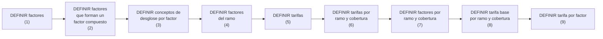

1. [DEFINIR factores](#cod_factor)  
1. [DEFINIR factores que forman un factor compuesto](#cod_factor_compuesto)  
1. [DEFINIR conceptos de desglose por factor](#factor_desglose)
1. [DEFINIR factores del ramo](#factor_ramo)
1. [DEFINIR tarifas](#cod_tarifa)
1. [DEFINIR tarifas por ramo y cobertura](#tarifa-ramo-cobertura)
1. [DEFINIR factores por ramo y cobertura](#factor-ramo-cobertura)
1. [DEFINIR tarifa base por ramo y cobertura](#tarifa-base-ramo-cobertura)
1. [DEFINIR tarifa por factor](#tarifa-factor)

[//]: # (## **Vínculos**)
[//]: # (## **Preguntas frecuentes**)

---

# DEFINICIÓN DE RAMO VIDA {#definicion-emision-negocio-vida}

{ width="596" height="159" style="display: block; margin: 0 auto" }

[//]: # (---)
[//]: # (tags:)
[//]: # (  - negocio)
[//]: # (  - analista)
[//]: # (  - implementador)
[//]: # (  - desarrollador)
[//]: # (---)

{width="64" height="64" style="vertical-align:middle";} <span style="font-weight:700; font-size:18px; vertical-align:middle">Elementos que intervienen en la definición y orden en el que se debe realizar.</span> 

<div class="grid cards" markdown>

- <span style="color:cadetblue; font-weight:700; font-size:30px;">COMÚN</span>

  ---

  <span style="font-weight:700; font-size:20px;">En este nivel se encuentran definiciones que no son exclusivas del módulo de emisión, pero son necesarias para poder realizar la definición. Entre otras definiciones se encuentra:</span>

</div>

<div class="grid cards" markdown>

- **COMPAÑÍA**:material-asterisk-circle-outline:{ .lg .middle }

  ---

  Definición de la entidad o entidades con las que se van a crear las pólizas y por consiguiente el resto de elementos

  [:material-book-open-variant-outline:{ .lg .middle } **Accede al documento**](#compania_d)  
  [:material-play-box:{ .lg .middle } **Accede al vídeo**](#compania_v)  

- **MONEDA**:material-asterisk-circle-outline:{ .lg .middle }

  ---

  Definición de las divisas con las que Reef.core va a realizar las distintas operaciones de la compañía

  [:material-book-open-variant-outline:{ .lg .middle } **Accede al documento**](#moneda_d)  
  [:material-play-box:{ .lg .middle } **Accede al vídeo**](#moneda_v)  

- **ESTRUCTURA COMERCIAL**:material-asterisk-circle-outline:{ .lg .middle }

  ---

  Definición de como se va a establecer la organización territorial de la compañía

  [:material-book-open-variant-outline:{ .lg .middle } **Accede al documento**](#estructura_comercial_d)  
  [:material-play-box:{ .lg .middle } **Accede al vídeo**](#estructura_comercial_v)  

- **ESTRUCTURA PRODUCTO**:material-asterisk-circle-outline:{ .lg .middle }

  ---

  Definición de como estarán organizados los ramos que se comercializan

  [:material-book-open-variant-outline:{ .lg .middle } **Accede al documento**](#estructura_producto_d)  
  [:material-play-box:{ .lg .middle } **Accede al vídeo**](#estructura_producto_v)  

- **CANAL**:material-asterisk-circle-outline:{ .lg .middle }

  ---

  Definición de las distintas vías por las que llegará la nueva producción a la compañía

  [:material-book-open-variant-outline:{ .lg .middle } **Accede al documento**](#canal_d)  
  [:material-play-box:{ .lg .middle } **Accede al vídeo**](#canal_v)  

- **CUADRO COMISIÓN**:material-asterisk-circle-outline:{ .lg .middle }

  ---

  Definición de los agrupadores que determinan las comisiones que se van a pagar a los agentes

  [:material-book-open-variant-outline:{ .lg .middle } **Accede al documento**](#cuadro_comision_d)  
  [:material-play-box:{ .lg .middle } **Accede al vídeo**](#cuadro_comision_v)  

- **AGENTE**:material-asterisk-circle-outline:{ .lg .middle }

  ---

  Definición de los terceros que ejercerán de intermediarios entre el cliente y la compañía

  [:material-book-open-variant-outline:{ .lg .middle } **Accede al documento**](#agente_d)  
  [:material-play-box:{ .lg .middle } **Accede al vídeo**](#agente_v)  

- **CONCEPTO ECONÓMICO**:material-asterisk-circle-outline:{ .lg .middle }

  ---

  Definición de los conceptos que formarán parte de la información económica del recibo

  [:material-book-open-variant-outline:{ .lg .middle } **Accede al documento**](#concepto_economico_d)  
  [:material-play-box:{ .lg .middle } **Accede al vídeo**](#concepto_economico_v)  

- **DOCUMENTOS DE ENTRADA/SALIDA**

  ---

  Definición de los documentos que deben salir cuando se realiza una operación y de los documentos que son necesarios solicitar cuando se realiza una operación

  [:material-book-open-variant-outline:{ .lg .middle } **Accede al documento**](#documentos_de_entrada_salida_d)  
  [:material-play-box:{ .lg .middle } **Accede al vídeo**](#documentos_de_entrada_salida_v)  

- **CONTROL TÉCNICO**

  ---

  Definición de los parámetros necesarios para realizar validaciones que permitan o no finalizar la operación

  [:material-book-open-variant-outline:{ .lg .middle } **Accede al documento**](#control_tecnico_d)  
  [:material-play-box:{ .lg .middle } **Accede al vídeo**](#control_tecnico_v)  

- **FRAUDE**

  ---

  Definiciones relacionadas para la integración con PLATEA

  [:material-book-open-variant-outline:{ .lg .middle } **Accede al documento**](#platea_d)  
  [:material-play-box:{ .lg .middle } **Accede al vídeo**](#platea_v)  

</div>

<div class="grid cards" markdown>

- <span style="color:cadetblue; font-weight:700; font-size:30px;">RAMO</span>

  ---

  <span style="font-weight:700; font-size:20px;">Son definiciones que siendo del módulo de emisión, no son exclusivas del ramo que se está definiendo. Por ejemplo:</span>

</div>

<div class="grid cards" markdown>

- **NUMERACIÓN**:material-asterisk-circle-outline:{ .lg .middle }

  ---

  Determinar que elementos formarán y en que orden el número de póliza y el número de presupuesto

  [:material-book-open-variant-outline:{ .lg .middle } **Accede al documento**](#numeracion_d)  
  [:material-play-box:{ .lg .middle } **Accede al vídeo**](#numeracion_v)  

- **RAMO**:material-asterisk-circle-outline:{ .lg .middle }

  ---

  Fija las características generales con las que contarán las pólizas, como días por año, colectivos, cláusulas, tipo de póliza temporal, etc.

  [:material-book-open-variant-outline:{ .lg .middle } **Accede al documento**](#ramo_d)  
  [:material-play-box:{ .lg .middle } **Accede al vídeo**](#ramo_v)  

- **SUPLEMENTO**:material-asterisk-circle-outline:{ .lg .middle }

  ---

  Tipos de modificaciones que podrán sufrir las pólizas (anulación, rehabilitación, renovación, etc.)

  [:material-book-open-variant-outline:{ .lg .middle } **Accede al documento**](#suplemento_d)  
  [:material-play-box:{ .lg .middle } **Accede al vídeo**](#suplemento_v)  

- **CONTRATO**

  ---

  Condiciones que alteran la definición de un ramo. Estas condiciones aplican siempre a uno o varios clientes. También se pueden determinar valores concretos o varios valores permitidos

  [:material-book-open-variant-outline:{ .lg .middle } **Accede al documento**](#contrato_d)  
  [:material-play-box:{ .lg .middle } **Accede al vídeo**](#contrato_v)  

- **SUBCONTRATO**

  ---

  Condiciones que alteran las condiciones de un contrato y, por consiguiente alteran la definición de un ramo. Un ejemplo puede ser las distintas condiciones que rigen a un grupo empresarial. Al igual que el contrato, se pueden determinar valores o grupos de valores posibles

  [:material-book-open-variant-outline:{ .lg .middle } **Accede al documento**](#subcontrato_d)  
  [:material-play-box:{ .lg .middle } **Accede al vídeo**](#subcontrato_v)  

- **PÓLIZA GRUPO**

  ---

  Conjunto de pólizas independientes. Estas, pueden ser individuales, colectivas o multi-riesgo. Siempre el conjunto está sujeto a algún tipo de excepción (contrato y/o subcontrato) sobre la definición del ramo estándar

  [:material-book-open-variant-outline:{ .lg .middle } **Accede al documento**](#poliza_grupo_d)  
  [:material-play-box:{ .lg .middle } **Accede al vídeo**](#poliza_grupo_v)  

- **PÓLIZA CLIENTE**

  ---

  Clave adicional que puede asociarse a una póliza y que puede unir varias pólizas de un cliente o colaborador

  [:material-book-open-variant-outline:{ .lg .middle } **Accede al documento**](#poliza_cliente_d)  
  [:material-play-box:{ .lg .middle } **Accede al vídeo**](#poliza_cliente_v)  

- **DÍAS DE GRACIA**

  ---

  Número de días que se adicionan al efecto de un recibo para determinar que debe pasar al proceso de anulación por falta de pago

  [:material-book-open-variant-outline:{ .lg .middle } **Accede al documento**](#dias_de_gracia_d)  
  [:material-play-box:{ .lg .middle } **Accede al vídeo**](#dias_de_gracia_v)  

- **DÍAS DE GRACIA CONTRATO**

  ---

  Alteración de la definición específica para un cliente

  [:material-book-open-variant-outline:{ .lg .middle } **Accede al documento**](#dias_de_gracia_contrato_d)  
  [:material-play-box:{ .lg .middle } **Accede al vídeo**](#dias_de_gracia_contrato_v)  

- **DÍAS DE GRACIA SUBCONTRATO**

  ---

  Alteración de la definición específica para un cliente

  [:material-book-open-variant-outline:{ .lg .middle } **Accede al documento**](#dias_de_gracia_subcontrato_d)  
  [:material-play-box:{ .lg .middle } **Accede al vídeo**](#dias_de_gracia_subcontrato_v)  

- **ANULACIÓN FALTA PAGO**

  ---

  Parámetros que tendrá en cuenta este proceso a la hora de determinar qué pólizas deben anularse por falta de pago

  [:material-book-open-variant-outline:{ .lg .middle } **Accede al documento**](#anulacion_falta_pago_d)  
  [:material-play-box:{ .lg .middle } **Accede al vídeo**](#anulacion_falta_pago_v)  

- **COTIZACIÓN RÁPIDA**

  ---

  Proceso que devuelve el precio de varias simulaciones con un mínimo de información requerida al cliente. En este punto se define las simulaciones con las que se dará precio, qué información se solicitará y qué información no se solicita al cliente y, para aquella información que no será solicitada, determinar el valor con el que se contará pra dar precio

  [:material-book-open-variant-outline:{ .lg .middle } **Accede al documento**](#cotizacion_rapida_d)  
  [:material-play-box:{ .lg .middle } **Accede al vídeo**](#cotizacion_rapida_v)  

- **CONTEXTO**

  ---

  Se pueden crear entornos en los que determinar que información (atributos) no mostrar

  [:material-book-open-variant-outline:{ .lg .middle } **Accede al documento**](#contexto_d)  
  [:material-play-box:{ .lg .middle } **Accede al vídeo**](#contexto_v)  

- **FRAUDE**

  ---

  Definiciones relacionadas para la integración con PLATEA

  [:material-book-open-variant-outline:{ .lg .middle } **Accede al documento**](#platea_d)  
  [:material-play-box:{ .lg .middle } **Accede al vídeo**](#platea_v)  

- **MARCA**

  ---

  Fijar eventos con un nivel de gravedad que puede desencadenar acciones sobre pólizas. Estas acciones pueden ser reactivas (la póliza ya está en cartera) o proactivas (la póliza aún no ha sido creada)

  [:material-book-open-variant-outline:{ .lg .middle } **Accede al documento**](#marca_d)  
  [:material-play-box:{ .lg .middle } **Accede al vídeo**](#marca_v)  

- **DOCUMENTOS DE ENTRADA/SALIDA**

  ---

  Determinar aquellos documentos que deben acompañar a una operación (por ejemplo, que documentos se generan cuando se emite una nueva póliza) y documentos que son necesarios disponer para poder realizar una operación (por ejemplo, para emitir una póliza de automóvil es necesario disponer de la licencia de conducir)

  [:material-book-open-variant-outline:{ .lg .middle } **Accede al documento**](#documentos_de_entrada_salida_d)  
  [:material-play-box:{ .lg .middle } **Accede al vídeo**](#documentos_de_entrada_salida_v)  

- **DOCUMENTOS DE ENTRADA/SALIDA CONTRATO**

  ---

  Alteración de la definición específica para un cliente

  [:material-book-open-variant-outline:{ .lg .middle } **Accede al documento**](#documentos_de_entrada_salida_contrato_d)  
  [:material-play-box:{ .lg .middle } **Accede al vídeo**](#documentos_de_entrada_salida_contrato_v)  

</div>

<div class="grid cards" markdown>

- <span style="color:cadetblue; font-weight:700; font-size:30px;">PÓLIZA</span>

  ---

  <span style="font-weight:700; font-size:20px;">En este nivel se encuentran definiciones que afectarán a todos los posibles riesgos de la póliza. Entre otros se define:</span>

</div>

<div class="grid cards" markdown>

- **MESES DURACIÓN MÍNIMO/MÁXIMO**

  ---

  Se fija el número máximo y/o mínimo de meses de vigencia que una póliza puede disponer

  [:material-book-open-variant-outline:{ .lg .middle } **Accede al documento**](#meses_duracion_minimo_maximo_d)  
  [:material-play-box:{ .lg .middle } **Accede al vídeo**](#meses_duracion_minimo_maximo_v)  

- **MESES DURACIÓN MÍNIMO/MÁXIMO CONTRATO**

  ---

  Alteración de la definición específica para un cliente

  [:material-book-open-variant-outline:{ .lg .middle } **Accede al documento**](#meses_duracion_minimo_maximo_contrato_d)  
  [:material-play-box:{ .lg .middle } **Accede al vídeo**](#meses_duracion_minimo_maximo_contrato_v)  

- **DÍAS DE ADELANTO/ATRASO**

  ---

  Con cuantos días previos o posteriores al día de hoy se puede fijar el efecto en la creación o modificación de una póliza

  [:material-book-open-variant-outline:{ .lg .middle } **Accede al documento**](#dias_de_adelanto_atraso_d)  

- **DÍAS DE ADELANTO/ATRASO CONTRATO**

  ---

  Alteración de la definición específica para un cliente

  [:material-book-open-variant-outline:{ .lg .middle } **Accede al documento**](#dias_de_adelanto_atraso_contrato_d)  
  [:material-play-box:{ .lg .middle } **Accede al vídeo**](#dias_de_adelanto_atraso_contrato_v)  

- **MONEDA, DECIMALES E IMPORTE MÍNIMO**:material-asterisk-circle-outline:{ .lg .middle }

  ---

  Determina las posibles monedas en las que se emitirán las pólizas. Afecta a capitales, primas, comisiones y recibos

  [:material-book-open-variant-outline:{ .lg .middle } **Accede al documento**](#moneda__decimales_e_importe_minimo_d)  
  [:material-play-box:{ .lg .middle } **Accede al vídeo**](#moneda__decimales_e_importe_minimo_v)  

- **IMPORTE MÍNIMO**

  ---

  Se establecen los importes mínimos para generar un recibo

  [:material-book-open-variant-outline:{ .lg .middle } **Accede al documento**](#importe_minimo_d)  

- **CUADRO COASEGURO**

  ---

  Se establecen de forma previa aquellas compañías que participarán en el riesgo con el conocimiento del cliente. Esta definición previa es para uso posterior en las emisiones de póliza

  [:material-book-open-variant-outline:{ .lg .middle } **Accede al documento**](#cuadro_coaseguro_d)  
  [:material-play-box:{ .lg .middle } **Accede al vídeo**](#cuadro_coaseguro_v)  

- **ESCALA**

  ---

  Se establece cual será la porción de prima cuando una póliza no es anual y no se desea que el cálculo sea proporcional al tiempo

  [:material-book-open-variant-outline:{ .lg .middle } **Accede al documento**](#escala_d)  
  [:material-play-box:{ .lg .middle } **Accede al vídeo**](#escala_v)  

- **INTERVENCIÓN**

  ---

  Definición de aquellas figuras que podrán intervenir en la contratación. Estas figuras se refieren a clientes y son del tipo tomador, asegurado, conductor, etc.

  [:material-book-open-variant-outline:{ .lg .middle } **Accede al documento**](#intervencion_d)  
  [:material-play-box:{ .lg .middle } **Accede al vídeo**](#intervencion_v)  

- **INTERVENCIÓN CONTRATO**

  ---

  Alteración de la definición específica para un cliente

  [:material-book-open-variant-outline:{ .lg .middle } **Accede al documento**](#intervencion_contrato_d)  
  [:material-play-box:{ .lg .middle } **Accede al vídeo**](#intervencion_contrato_v)  

- **CLÁUSULA**

  ---

  Establecer diferentes estipulaciones contractuales que precisan, amplían, derogan o modifican el contenido del seguro

  [:material-book-open-variant-outline:{ .lg .middle } **Accede al documento**](#clausula_d)  
  [:material-play-box:{ .lg .middle } **Accede al vídeo**](#clausula_v)  

- **TEXTO ANEXO**

  ---

  Fijar si es posible incluir de forma manual en una póliza diferentes estipulaciones contractuales que precisan, amplían, derogan o modifican el contenido del seguro

  [:material-book-open-variant-outline:{ .lg .middle } **Accede al documento**](#texto_anexo_d)  
  [:material-play-box:{ .lg .middle } **Accede al vídeo**](#texto_anexo_v)  

- **PLAN DE PAGO**:material-asterisk-circle-outline:{ .lg .middle }

  ---

  Definir como se va a fraccionar el pago del seguro

  [:material-book-open-variant-outline:{ .lg .middle } **Accede al documento**](#plan_de_pago_d)  
  [:material-play-box:{ .lg .middle } **Accede al vídeo**](#plan_de_pago_v)  

- **PLAN DE PAGO CONTRATO**

  ---

  Alteración de la definición específica para un cliente

  [:material-book-open-variant-outline:{ .lg .middle } **Accede al documento**](#plan_de_pago_contrato_d)  
  [:material-play-box:{ .lg .middle } **Accede al vídeo**](#plan_de_pago_contrato_v)  

- **PLAN DE PAGO CLIENTE**

  ---

  Establecer planes de pago por cliente y aplicarlos aunque el ramo no disponga de él

  [:material-book-open-variant-outline:{ .lg .middle } **Accede al documento**](#plan_de_pago_cliente_d)  

- **REVALORIZACIÓN / DEPRECIACIÓN**

  ---

  Fijar como se incrementa o decrementa el valor de un riesgo

  [:material-book-open-variant-outline:{ .lg .middle } **Accede al documento**](#revalorizacion___depreciacion_d)  

- **CONTRATO**

  ---

  Condiciones que alteran la definición de un ramo. Estas condiciones aplican siempre a uno o varios clientes. También se pueden determinar valores concretos o varios valores permitidos

  [:material-book-open-variant-outline:{ .lg .middle } **Accede al documento**](#contrato_d)  
  [:material-play-box:{ .lg .middle } **Accede al vídeo**](#contrato_v)  

- **SUBCONTRATO**

  ---

  Condiciones que alteran las condiciones de un contrato y, por consiguiente alteran la definición de un ramo. Un ejemplo puede ser las distintas condiciones que rigen a un grupo empresarial. Al igual que el contrato, se pueden determinar valores o grupos de valores posibles

  [:material-book-open-variant-outline:{ .lg .middle } **Accede al documento**](#subcontrato_d)  
  [:material-play-box:{ .lg .middle } **Accede al vídeo**](#subcontrato_v)  

- **CONTROL TÉCNICO**

  ---

  Definición de en qué condiciones se puede paralizar la contratación o hacer que una o varias personas puedan determinar si el seguro es asumible por la aseguradora

  [:material-book-open-variant-outline:{ .lg .middle } **Accede al documento**](#control_tecnico_d)  
  [:material-play-box:{ .lg .middle } **Accede al vídeo**](#control_tecnico_v)  

- **ATRIBUTO**

  ---

  Son características que sea necesario disponer y de las que Reef.core dispone, por ejemplo disponer de un lugar donde se registre un descuento que afecta a la póliza

  [:material-book-open-variant-outline:{ .lg .middle } **Accede al documento**](#atributo_d)  
  [:material-play-box:{ .lg .middle } **Accede al vídeo**](#atributo_v)  

- **ATRIBUTO CONTRATO**

  ---

  Alteración de la definición específica para un cliente

  [:material-book-open-variant-outline:{ .lg .middle } **Accede al documento**](#atributo_contrato_d)  
  [:material-play-box:{ .lg .middle } **Accede al vídeo**](#atributo_contrato_v)  

- **ATRIBUTO SUBCONTRATO**

  ---

  Alteración de la definición específica para un cliente

  [:material-book-open-variant-outline:{ .lg .middle } **Accede al documento**](#atributo_subcontrato_d)  
  [:material-play-box:{ .lg .middle } **Accede al vídeo**](#atributo_subcontrato_v)  

- **CONTROL TÉCNICO ATRIBUTO**

  ---

  Definición de en qué condiciones se puede paralizar la contratación o hacer que una o varias personas puedan determinar si el seguro es asumible por la aseguradora

  [:material-book-open-variant-outline:{ .lg .middle } **Accede al documento**](#control_tecnico_atributo_d)  
  [:material-play-box:{ .lg .middle } **Accede al vídeo**](#control_tecnico_atributo_v)  

- **OCURRENCIA**

  ---

  Es el mismo concepto de atributo, pero la solicitud de esos atributos se realiza "n" veces. Es decir, es un conjunto de atributos que su petición se realiza varias veces. Por ejemplo si fuera almacenar en la póliza una serie de materias que su transporte está limitado en cantidad

  [:material-book-open-variant-outline:{ .lg .middle } **Accede al documento**](#ocurrencia_d)  
  [:material-play-box:{ .lg .middle } **Accede al vídeo**](#ocurrencia_v)  

</div>

<div class="grid cards" markdown>

- <span style="color:cadetblue; font-weight:700; font-size:30px;">RIESGO</span>

  ---

  <span style="font-weight:700; font-size:20px;">Definiciones que afectan a cada uno de los posibles riesgos de la póliza. Por ejemplo:</span>

</div>

<div class="grid cards" markdown>

- **VIDA**:material-asterisk-circle-outline:{ .lg .middle }

  ---

  Son definiciones exclusivas para ramos del tipo de negocio automóvil. Como por ejemplo, la definición de matrículas, marcas, modelos, etc.

  [:material-book-open-variant-outline:{ .lg .middle } **Accede al documento**](#vida_d)  

- **INTERVENCIÓN**

  ---

  Definición de aquellas figuras que podrán intervenir en la contratación. Estas figuras se refieren a clientes y son del tipo tomador, asegurado, conductor, etc.

  [:material-book-open-variant-outline:{ .lg .middle } **Accede al documento**](#intervencion_d)  
  [:material-play-box:{ .lg .middle } **Accede al vídeo**](#intervencion_v)  

- **INTERVENCIÓN CONTRATO**

  ---

  Alteración de la definición específica para un cliente

  [:material-book-open-variant-outline:{ .lg .middle } **Accede al documento**](#intervencion_contrato_d)  
  [:material-play-box:{ .lg .middle } **Accede al vídeo**](#intervencion_contrato_v)  

- **CONTROL TÉCNICO INTERVENCIÓN**

  ---

  Definición de en qué condiciones se puede paralizar la contratación o hacer que una o varias personas puedan determinar si el seguro es asumible por la aseguradora

  [:material-book-open-variant-outline:{ .lg .middle } **Accede al documento**](#control_tecnico_intervencion_d)  
  [:material-play-box:{ .lg .middle } **Accede al vídeo**](#control_tecnico_intervencion_v)  

- **ATRIBUTO**

  ---

  Son características que sea necesario disponer y de las que Reef.core dispone, por ejemplo disponer de un lugar donde se registre un descuento que afecta al riesgo

  [:material-book-open-variant-outline:{ .lg .middle } **Accede al documento**](#atributo_d)  
  [:material-play-box:{ .lg .middle } **Accede al vídeo**](#atributo_v)  

- **ATRIBUTO CONTRATO**

  ---

  Alteración de la definición específica para un cliente

  [:material-book-open-variant-outline:{ .lg .middle } **Accede al documento**](#atributo_contrato_d)  
  [:material-play-box:{ .lg .middle } **Accede al vídeo**](#atributo_contrato_v)  

- **ATRIBUTO SUBCONTRATO**

  ---

  Alteración de la definición específica para un cliente

  [:material-book-open-variant-outline:{ .lg .middle } **Accede al documento**](#atributo_subcontrato_d)  
  [:material-play-box:{ .lg .middle } **Accede al vídeo**](#atributo_subcontrato_v)  

- **CONTROL TÉCNICO ATRIBUTO**

  ---

  Definición de en qué condiciones se puede paralizar la contratación o hacer que una o varias personas puedan determinar si el seguro es asumible por la aseguradora

  [:material-book-open-variant-outline:{ .lg .middle } **Accede al documento**](#control_tecnico_atributo_d)  
  [:material-play-box:{ .lg .middle } **Accede al vídeo**](#control_tecnico_atributo_v)  

- **OCURRENCIA**

  ---

  Es el mismo concepto de atributo, pero la solicitud de esos atributos se realiza "n" veces. Es decir, es un conjunto de atributos que su petición se realiza varias veces. Por ejemplo si fuera almacenar en la póliza una serie de materias que su transporte está limitado en cantidad

  [:material-book-open-variant-outline:{ .lg .middle } **Accede al documento**](#ocurrencia_d)  
  [:material-play-box:{ .lg .middle } **Accede al vídeo**](#ocurrencia_v)  

- **MODALIDAD**

  ---

  Agrupación de coberturas que juntas se convierten en un paquete a comercializar

  [:material-book-open-variant-outline:{ .lg .middle } **Accede al documento**](#modalidad_d)  
  [:material-play-box:{ .lg .middle } **Accede al vídeo**](#modalidad_v)  

- **CLÁUSULA**

  ---

  Establecer diferentes estipulaciones contractuales que precisan, amplían, derogan o modifican el contenido del seguro

  [:material-book-open-variant-outline:{ .lg .middle } **Accede al documento**](#clausula_d)  
  [:material-play-box:{ .lg .middle } **Accede al vídeo**](#clausula_v)  

- **TEXTO ANEXO**

  ---

  Fijar si es posible incluir de forma manual en una póliza diferentes estipulaciones contractuales que precisan, amplían, derogan o modifican el contenido del seguro

  [:material-book-open-variant-outline:{ .lg .middle } **Accede al documento**](#texto_anexo_d)  
  [:material-play-box:{ .lg .middle } **Accede al vídeo**](#texto_anexo_v)  

- **COMISIÓN**

  ---

  Establecer la remuneración  por intermediar en la contratación de un seguro. Existen distintos tipos de comisiones dependiendo de como interviene el agente, así como excepciones

  [:material-book-open-variant-outline:{ .lg .middle } **Accede al documento**](#comision_d)  
  [:material-play-box:{ .lg .middle } **Accede al vídeo**](#comision_v)  

- **COMISIÓN CONTRATO**

  ---

  Alteración de la definición específica para un cliente

  [:material-book-open-variant-outline:{ .lg .middle } **Accede al documento**](#comision_contrato_d)  
  [:material-play-box:{ .lg .middle } **Accede al vídeo**](#comision_contrato_v)  

- **INSPECCIÓN**

  ---

  Definición de cuando y como realizar inspecciones a los riesgos contratados. las inspecciones pueden ser previas a la contratación o en el proceso de contratación

  [:material-book-open-variant-outline:{ .lg .middle } **Accede al documento**](#inspeccion_d)  
  [:material-play-box:{ .lg .middle } **Accede al vídeo**](#inspeccion_v)  

</div>

<div class="grid cards" markdown>

</div>

<div class="grid cards" markdown>

</div>

<div class="grid cards" markdown>

</div>

<div class="grid cards" markdown>

- <span style="color:cadetblue; font-weight:700; font-size:30px;">COBERTURA</span>

  ---

  <span style="font-weight:700; font-size:20px;">Definiciones que afectan a cada una de las coberturas definidas. Por ejemplo:</span>

</div>

<div class="grid cards" markdown>

- **COBERTURA**:material-asterisk-circle-outline:{ .lg .middle }

  ---

  Obligación principal en un contrato de seguro. Existen diversos tipos de cobertura que determinan el comportamiento tanto en el proceso de emisión, como en el proceso de prestaciones 

  [:material-book-open-variant-outline:{ .lg .middle } **Accede al documento**](#cobertura_d)  
  [:material-play-box:{ .lg .middle } **Accede al vídeo**](#cobertura_v)  

- **CONTRATO**

  ---

  Condiciones que alteran la definición de un ramo. Estas condiciones aplican siempre a uno o varios clientes. También se pueden determinar valores concretos o varios valores permitidos

  [:material-book-open-variant-outline:{ .lg .middle } **Accede al documento**](#contrato_d)  
  [:material-play-box:{ .lg .middle } **Accede al vídeo**](#contrato_v)  

- **SUBCONTRATO**

  ---

  Condiciones que alteran las condiciones de un contrato y, por consiguiente alteran la definición de un ramo. Un ejemplo puede ser las distintas condiciones que rigen a un grupo empresarial. Al igual que el contrato, se pueden determinar valores o grupos de valores posibles

  [:material-book-open-variant-outline:{ .lg .middle } **Accede al documento**](#subcontrato_d)  
  [:material-play-box:{ .lg .middle } **Accede al vídeo**](#subcontrato_v)  

- **LÍMITE**

  ---

  Estipulación del importe máximo contratado por el periodo de vigencia del seguro y/o importe máximo aplicable por cada uno de las prestaciones realizadas durante le periodo de vigencia. Estos importes están prefijados

  [:material-book-open-variant-outline:{ .lg .middle } **Accede al documento**](#limite_d)  
  [:material-play-box:{ .lg .middle } **Accede al vídeo**](#limite_v)  

- **LÍMITE CONTRATO**

  ---

  Alteración de la definición específica para un cliente

  [:material-book-open-variant-outline:{ .lg .middle } **Accede al documento**](#limite_contrato_d)  
  [:material-play-box:{ .lg .middle } **Accede al vídeo**](#limite_contrato_v)  

- **INTERVALO**

  ---

  Establecimiento de sumas aseguradas entre dos límites, uno inferior y otro superior

  [:material-book-open-variant-outline:{ .lg .middle } **Accede al documento**](#intervalo_d)  
  [:material-play-box:{ .lg .middle } **Accede al vídeo**](#intervalo_v)  

- **INTERVALO CONTRATO**

  ---

  Alteración de la definición específica para un cliente

  [:material-book-open-variant-outline:{ .lg .middle } **Accede al documento**](#intervalo_contrato_d)  
  [:material-play-box:{ .lg .middle } **Accede al vídeo**](#intervalo_contrato_v)  

- **INTERVALO SUBCONTRATO**

  ---

  Alteración de la definición específica para un cliente

  [:material-book-open-variant-outline:{ .lg .middle } **Accede al documento**](#intervalo_subcontrato_d)  
  [:material-play-box:{ .lg .middle } **Accede al vídeo**](#intervalo_subcontrato_v)  

- **FRANQUICIA**

  ---

  Establecer las cantidades por las que el asegurado responde en caso de siniestro. Existe la posibilidad que la reducción de la prima a aplicar se encuentre definida en la propia franquicia

  [:material-book-open-variant-outline:{ .lg .middle } **Accede al documento**](#franquicia_d)  
  [:material-play-box:{ .lg .middle } **Accede al vídeo**](#franquicia_v)  

- **FRANQUICIA CONTRATO**

  ---

  Alteración de la definición específica para un cliente

  [:material-book-open-variant-outline:{ .lg .middle } **Accede al documento**](#franquicia_contrato_d)  
  [:material-play-box:{ .lg .middle } **Accede al vídeo**](#franquicia_contrato_v)  

- **FRANQUICIA SUBCONTRATO**

  ---

  Alteración de la definición específica para un cliente

  [:material-book-open-variant-outline:{ .lg .middle } **Accede al documento**](#franquicia_subcontrato_d)  
  [:material-play-box:{ .lg .middle } **Accede al vídeo**](#franquicia_subcontrato_v)  

- **RAMO CONTABLE MULTIPLE**

  ---

  Posibilidad de definir ramos contables por el contenido de algún atributo

  [:material-book-open-variant-outline:{ .lg .middle } **Accede al documento**](#ramo_contable_multiple_d)  
  [:material-play-box:{ .lg .middle } **Accede al vídeo**](#ramo_contable_multiple_v)  

- **CONTROL TÉCNICO**

  ---

  Definición de en qué condiciones se puede paralizar la contratación o hacer que una o varias personas puedan determinar si el seguro es asumible por la aseguradora

  [:material-book-open-variant-outline:{ .lg .middle } **Accede al documento**](#control_tecnico_d)  
  [:material-play-box:{ .lg .middle } **Accede al vídeo**](#control_tecnico_v)  

- **ATRIBUTO**

  ---

  Son características que sea necesario disponer y de las que Reef.core dispone, por ejemplo disponer de un lugar donde se registre un descuento que afecta a la cobertura

  [:material-book-open-variant-outline:{ .lg .middle } **Accede al documento**](#atributo_d)  
  [:material-play-box:{ .lg .middle } **Accede al vídeo**](#atributo_v)  

- **ATRIBUTO CONTRATO**

  ---

  Alteración de la definición específica para un cliente

  [:material-book-open-variant-outline:{ .lg .middle } **Accede al documento**](#atributo_contrato_d)  
  [:material-play-box:{ .lg .middle } **Accede al vídeo**](#atributo_contrato_v)  

- **ATRIBUTO SUBCONTRATO**

  ---

  Alteración de la definición específica para un cliente

  [:material-book-open-variant-outline:{ .lg .middle } **Accede al documento**](#atributo_subcontrato_d)  
  [:material-play-box:{ .lg .middle } **Accede al vídeo**](#atributo_subcontrato_v)  

- **OCURRENCIA**

  ---

  Es el mismo concepto de atributo, pero la solicitud de esos atributos se realiza "n" veces. Es decir, es un conjunto de atributos que su petición se realiza varias veces. Por ejemplo si fuera almacenar en la póliza una serie de materias que su transporte está limitado en cantidad

  [:material-book-open-variant-outline:{ .lg .middle } **Accede al documento**](#ocurrencia_d)  
  [:material-play-box:{ .lg .middle } **Accede al vídeo**](#ocurrencia_v)  

- **CONCEPTO DESGLOSE**:material-asterisk-circle-outline:{ .lg .middle }

  ---

  Definición del detalle necesario de segregación de la información económica de una cobertura

  [:material-book-open-variant-outline:{ .lg .middle } **Accede al documento**](#concepto_desglose_d)  
  [:material-play-box:{ .lg .middle } **Accede al vídeo**](#concepto_desglose_v)  

- **TARIFA MULTIVARIABLE**

  ---

  Medio por el que se determina el cálculo. La definición se centra en el concepto factor que es el concepto por el que se realiza un cálculo

  [:material-book-open-variant-outline:{ .lg .middle } **Accede al documento**](#tarifa_multivariable_d)  
  [:material-play-box:{ .lg .middle } **Accede al vídeo**](#tarifa_multivariable_v)  

- **TARIFA MULTIVARIABLE CONTRATO**

  ---

  Alteración de la definición específica para un cliente

  [:material-book-open-variant-outline:{ .lg .middle } **Accede al documento**](#tarifa_multivariable_contrato_d)  
  [:material-play-box:{ .lg .middle } **Accede al vídeo**](#tarifa_multivariable_contrato_v)  

- **TARIFA MULTIVARIABLE SUBCONTRATO**

  ---

  Alteración de la definición específica para un cliente

  [:material-book-open-variant-outline:{ .lg .middle } **Accede al documento**](#tarifa_multivariable_subcontrato_d)  
  [:material-play-box:{ .lg .middle } **Accede al vídeo**](#tarifa_multivariable_subcontrato_v)  

- **CLÁUSULA**

  ---

  Establecer diferentes estipulaciones contractuales que precisan, amplían, derogan o modifican el contenido del seguro

  [:material-book-open-variant-outline:{ .lg .middle } **Accede al documento**](#clausula_d)  
  [:material-play-box:{ .lg .middle } **Accede al vídeo**](#clausula_v)  

- **COMISIÓN**

  ---

  Establecer la remuneración  por intermediar en la contratación de un seguro. Existen distintos tipos de comisiones dependiendo de como interviene el agente, así como excepciones

  [:material-book-open-variant-outline:{ .lg .middle } **Accede al documento**](#comision_d)  
  [:material-play-box:{ .lg .middle } **Accede al vídeo**](#comision_v)  

- **COMISIÓN CONTRATO**

  ---

  Alteración de la definición específica para un cliente

  [:material-book-open-variant-outline:{ .lg .middle } **Accede al documento**](#comision_contrato_d)  
  [:material-play-box:{ .lg .middle } **Accede al vídeo**](#comision_contrato_v)  

</div>

[ref]: #definicion-emision-cobertura-tarifa-multivariable
[ref]: #definicion-emision-cobertura-tarifa-multivariable
[ref]: #definicion-emision-cobertura-tarifa-multivariable

[ref]: #nolink

[//]: # (## **Vínculos**)
[//]: # (## **Preguntas frecuentes**)

---

# DEFINICIÓN DE RAMO TRANSPORTE {#definicion-emision-negocio-transporte}

{ width="596" height="159" style="display: block; margin: 0 auto" }

[//]: # (---)
[//]: # (tags:)
[//]: # (  - negocio)
[//]: # (  - analista)
[//]: # (  - implementador)
[//]: # (  - desarrollador)
[//]: # (---)

{width="64" height="64" style="vertical-align:middle";} <span style="font-weight:700; font-size:18px; vertical-align:middle">Elementos que intervienen en la definición y orden en el que se debe realizar.</

<div class="grid cards" markdown>

- <span style="color:cadetblue; font-weight:700; font-size:30px;">COMÚN</span>

  ---

  <span style="font-weight:700; font-size:20px;">En este nivel se encuentran definiciones que no son exclusivas del módulo de emisión, pero son necesarias para poder realizar la definición. Entre otras definiciones se encuentra:</span>

</div>

<div class="grid cards" markdown>

- **COMPAÑÍA**:material-asterisk-circle-outline:{ .lg .middle }

  ---

  Definición de la entidad o entidades con las que se van a crear las pólizas y por consiguiente el resto de elementos

  [:material-book-open-variant-outline:{ .lg .middle } **Accede al documento**](#compania_d)  
  [:material-play-box:{ .lg .middle } **Accede al vídeo**](#compania_v)  

- **MONEDA**:material-asterisk-circle-outline:{ .lg .middle }

  ---

  Definición de las divisas con las que Reef.core va a realizar las distintas operaciones de la compañía

  [:material-book-open-variant-outline:{ .lg .middle } **Accede al documento**](#moneda_d)  
  [:material-play-box:{ .lg .middle } **Accede al vídeo**](#moneda_v)  

- **ESTRUCTURA COMERCIAL**:material-asterisk-circle-outline:{ .lg .middle }

  ---

  Definición de como se va a establecer la organización territorial de la compañía

  [:material-book-open-variant-outline:{ .lg .middle } **Accede al documento**](#estructura_comercial_d)  
  [:material-play-box:{ .lg .middle } **Accede al vídeo**](#estructura_comercial_v)  

- **ESTRUCTURA PRODUCTO**:material-asterisk-circle-outline:{ .lg .middle }

  ---

  Definición de como estarán organizados los ramos que se comercializan

  [:material-book-open-variant-outline:{ .lg .middle } **Accede al documento**](#estructura_producto_d)  
  [:material-play-box:{ .lg .middle } **Accede al vídeo**](#estructura_producto_v)  

- **CANAL**:material-asterisk-circle-outline:{ .lg .middle }

  ---

  Definición de las distintas vías por las que llegará la nueva producción a la compañía

  [:material-book-open-variant-outline:{ .lg .middle } **Accede al documento**](#canal_d)  
  [:material-play-box:{ .lg .middle } **Accede al vídeo**](#canal_v)  

- **CUADRO COMISIÓN**:material-asterisk-circle-outline:{ .lg .middle }

  ---

  Definición de los agrupadores que determinan las comisiones que se van a pagar a los agentes

  [:material-book-open-variant-outline:{ .lg .middle } **Accede al documento**](#cuadro_comision_d)  
  [:material-play-box:{ .lg .middle } **Accede al vídeo**](#cuadro_comision_v)  

- **AGENTE**:material-asterisk-circle-outline:{ .lg .middle }

  ---

  Definición de los terceros que ejercerán de intermediarios entre el cliente y la compañía

  [:material-book-open-variant-outline:{ .lg .middle } **Accede al documento**](#agente_d)  
  [:material-play-box:{ .lg .middle } **Accede al vídeo**](#agente_v)  

- **CONCEPTO ECONÓMICO**:material-asterisk-circle-outline:{ .lg .middle }

  ---

  Definición de los conceptos que formarán parte de la información económica del recibo

  [:material-book-open-variant-outline:{ .lg .middle } **Accede al documento**](#concepto_economico_d)  
  [:material-play-box:{ .lg .middle } **Accede al vídeo**](#concepto_economico_v)  

- **DOCUMENTOS DE ENTRADA/SALIDA**

  ---

  Definición de los documentos que deben salir cuando se realiza una operación y de los documentos que son necesarios solicitar cuando se realiza una operación

  [:material-book-open-variant-outline:{ .lg .middle } **Accede al documento**](#documentos_de_entrada_salida_d)  
  [:material-play-box:{ .lg .middle } **Accede al vídeo**](#documentos_de_entrada_salida_v)  

- **CONTROL TÉCNICO**

  ---

  Definición de los parámetros necesarios para realizar validaciones que permitan o no finalizar la operación

  [:material-book-open-variant-outline:{ .lg .middle } **Accede al documento**](#control_tecnico_d)  
  [:material-play-box:{ .lg .middle } **Accede al vídeo**](#control_tecnico_v)  

- **FRAUDE**

  ---

  Definiciones relacionadas para la integración con PLATEA

  [:material-book-open-variant-outline:{ .lg .middle } **Accede al documento**](#platea_d)  
  [:material-play-box:{ .lg .middle } **Accede al vídeo**](#platea_v)  

</div>

<div class="grid cards" markdown>

- <span style="color:cadetblue; font-weight:700; font-size:30px;">RAMO</span>

  ---

  <span style="font-weight:700; font-size:20px;">Son definiciones que siendo del módulo de emisión, no son exclusivas del ramo que se está definiendo. Por ejemplo:</span>

</div>

<div class="grid cards" markdown>

- **NUMERACIÓN**:material-asterisk-circle-outline:{ .lg .middle }

  ---

  Determinar que elementos formarán y en que orden el número de póliza y el número de presupuesto

  [:material-book-open-variant-outline:{ .lg .middle } **Accede al documento**](#numeracion_d)  
  [:material-play-box:{ .lg .middle } **Accede al vídeo**](#numeracion_v)  

- **RAMO**:material-asterisk-circle-outline:{ .lg .middle }

  ---

  Fija las características generales con las que contarán las pólizas, como días por año, colectivos, cláusulas, tipo de póliza temporal, etc.

  [:material-book-open-variant-outline:{ .lg .middle } **Accede al documento**](#ramo_d)  
  [:material-play-box:{ .lg .middle } **Accede al vídeo**](#ramo_v)  

- **SUPLEMENTO**:material-asterisk-circle-outline:{ .lg .middle }

  ---

  Tipos de modificaciones que podrán sufrir las pólizas (anulación, rehabilitación, renovación, etc.)

  [:material-book-open-variant-outline:{ .lg .middle } **Accede al documento**](#suplemento_d)  
  [:material-play-box:{ .lg .middle } **Accede al vídeo**](#suplemento_v)  

- **CONTRATO**

  ---

  Condiciones que alteran la definición de un ramo. Estas condiciones aplican siempre a uno o varios clientes. También se pueden determinar valores concretos o varios valores permitidos

  [:material-book-open-variant-outline:{ .lg .middle } **Accede al documento**](#contrato_d)  
  [:material-play-box:{ .lg .middle } **Accede al vídeo**](#contrato_v)  

- **SUBCONTRATO**

  ---

  Condiciones que alteran las condiciones de un contrato y, por consiguiente alteran la definición de un ramo. Un ejemplo puede ser las distintas condiciones que rigen a un grupo empresarial. Al igual que el contrato, se pueden determinar valores o grupos de valores posibles

  [:material-book-open-variant-outline:{ .lg .middle } **Accede al documento**](#subcontrato_d)  
  [:material-play-box:{ .lg .middle } **Accede al vídeo**](#subcontrato_v)  

- **PÓLIZA GRUPO**

  ---

  Conjunto de pólizas independientes. Estas, pueden ser individuales, colectivas o multi-riesgo. Siempre el conjunto está sujeto a algún tipo de excepción (contrato y/o subcontrato) sobre la definición del ramo estándar

  [:material-book-open-variant-outline:{ .lg .middle } **Accede al documento**](#poliza_grupo_d)  
  [:material-play-box:{ .lg .middle } **Accede al vídeo**](#poliza_grupo_v)  

- **PÓLIZA CLIENTE**

  ---

  Clave adicional que puede asociarse a una póliza y que puede unir varias pólizas de un cliente o colaborador

  [:material-book-open-variant-outline:{ .lg .middle } **Accede al documento**](#poliza_cliente_d)  
  [:material-play-box:{ .lg .middle } **Accede al vídeo**](#poliza_cliente_v)  

- **DÍAS DE GRACIA**

  ---

  Número de días que se adicionan al efecto de un recibo para determinar que debe pasar al proceso de anulación por falta de pago

  [:material-book-open-variant-outline:{ .lg .middle } **Accede al documento**](#dias_de_gracia_d)  
  [:material-play-box:{ .lg .middle } **Accede al vídeo**](#dias_de_gracia_v)  

- **DÍAS DE GRACIA CONTRATO**

  ---

  Alteración de la definición específica para un cliente

  [:material-book-open-variant-outline:{ .lg .middle } **Accede al documento**](#dias_de_gracia_contrato_d)  
  [:material-play-box:{ .lg .middle } **Accede al vídeo**](#dias_de_gracia_contrato_v)  

- **DÍAS DE GRACIA SUBCONTRATO**

  ---

  Alteración de la definición específica para un cliente

  [:material-book-open-variant-outline:{ .lg .middle } **Accede al documento**](#dias_de_gracia_subcontrato_d)  
  [:material-play-box:{ .lg .middle } **Accede al vídeo**](#dias_de_gracia_subcontrato_v)  

- **ANULACIÓN FALTA PAGO**

  ---

  Parámetros que tendrá en cuenta este proceso a la hora de determinar qué pólizas deben anularse por falta de pago

  [:material-book-open-variant-outline:{ .lg .middle } **Accede al documento**](#anulacion_falta_pago_d)  
  [:material-play-box:{ .lg .middle } **Accede al vídeo**](#anulacion_falta_pago_v)  

- **COTIZACIÓN RÁPIDA**

  ---

  Proceso que devuelve el precio de varias simulaciones con un mínimo de información requerida al cliente. En este punto se define las simulaciones con las que se dará precio, qué información se solicitará y qué información no se solicita al cliente y, para aquella información que no será solicitada, determinar el valor con el que se contará pra dar precio

  [:material-book-open-variant-outline:{ .lg .middle } **Accede al documento**](#cotizacion_rapida_d)  
  [:material-play-box:{ .lg .middle } **Accede al vídeo**](#cotizacion_rapida_v)  

- **CONTEXTO**

  ---

  Se pueden crear entornos en los que determinar que información (atributos) no mostrar

  [:material-book-open-variant-outline:{ .lg .middle } **Accede al documento**](#contexto_d)  
  [:material-play-box:{ .lg .middle } **Accede al vídeo**](#contexto_v)  

- **FRAUDE**

  ---

  Definiciones relacionadas para la integración con PLATEA

  [:material-book-open-variant-outline:{ .lg .middle } **Accede al documento**](#platea_d)  
  [:material-play-box:{ .lg .middle } **Accede al vídeo**](#platea_v)  

- **MARCA**

  ---

  Fijar eventos con un nivel de gravedad que puede desencadenar acciones sobre pólizas. Estas acciones pueden ser reactivas (la póliza ya está en cartera) o proactivas (la póliza aún no ha sido creada)

  [:material-book-open-variant-outline:{ .lg .middle } **Accede al documento**](#marca_d)  
  [:material-play-box:{ .lg .middle } **Accede al vídeo**](#marca_v)  

- **DOCUMENTOS DE ENTRADA/SALIDA**

  ---

  Determinar aquellos documentos que deben acompañar a una operación (por ejemplo, que documentos se generan cuando se emite una nueva póliza) y documentos que son necesarios disponer para poder realizar una operación (por ejemplo, para emitir una póliza de automóvil es necesario disponer de la licencia de conducir)

  [:material-book-open-variant-outline:{ .lg .middle } **Accede al documento**](#documentos_de_entrada_salida_d)  
  [:material-play-box:{ .lg .middle } **Accede al vídeo**](#documentos_de_entrada_salida_v)  

- **DOCUMENTOS DE ENTRADA/SALIDA CONTRATO**

  ---

  Alteración de la definición específica para un cliente

  [:material-book-open-variant-outline:{ .lg .middle } **Accede al documento**](#documentos_de_entrada_salida_contrato_d)  
  [:material-play-box:{ .lg .middle } **Accede al vídeo**](#documentos_de_entrada_salida_contrato_v)  

</div>

<div class="grid cards" markdown>

- <span style="color:cadetblue; font-weight:700; font-size:30px;">PÓLIZA</span>

  ---

  <span style="font-weight:700; font-size:20px;">En este nivel se encuentran definiciones que afectarán a todos los posibles riesgos de la póliza. Entre otros se define:</span>

</div>

<div class="grid cards" markdown>

- **MESES DURACIÓN MÍNIMO/MÁXIMO**

  ---

  Se fija el número máximo y/o mínimo de meses de vigencia que una póliza puede disponer

  [:material-book-open-variant-outline:{ .lg .middle } **Accede al documento**](#meses_duracion_minimo_maximo_d)  
  [:material-play-box:{ .lg .middle } **Accede al vídeo**](#meses_duracion_minimo_maximo_v)  

- **MESES DURACIÓN MÍNIMO/MÁXIMO CONTRATO**

  ---

  Alteración de la definición específica para un cliente

  [:material-book-open-variant-outline:{ .lg .middle } **Accede al documento**](#meses_duracion_minimo_maximo_contrato_d)  
  [:material-play-box:{ .lg .middle } **Accede al vídeo**](#meses_duracion_minimo_maximo_contrato_v)  

- **DÍAS DE ADELANTO/ATRASO**

  ---

  Con cuantos días previos o posteriores al día de hoy se puede fijar el efecto en la creación o modificación de una póliza

  [:material-book-open-variant-outline:{ .lg .middle } **Accede al documento**](#dias_de_adelanto_atraso_d)  

- **DÍAS DE ADELANTO/ATRASO CONTRATO**

  ---

  Alteración de la definición específica para un cliente

  [:material-book-open-variant-outline:{ .lg .middle } **Accede al documento**](#dias_de_adelanto_atraso_contrato_d)  
  [:material-play-box:{ .lg .middle } **Accede al vídeo**](#dias_de_adelanto_atraso_contrato_v)  

- **MONEDA, DECIMALES E IMPORTE MÍNIMO**:material-asterisk-circle-outline:{ .lg .middle }

  ---

  Determina las posibles monedas en las que se emitirán las pólizas. Afecta a capitales, primas, comisiones y recibos

  [:material-book-open-variant-outline:{ .lg .middle } **Accede al documento**](#moneda__decimales_e_importe_minimo_d)  
  [:material-play-box:{ .lg .middle } **Accede al vídeo**](#moneda__decimales_e_importe_minimo_v)  

- **IMPORTE MÍNIMO**

  ---

  Se establecen los importes mínimos para generar un recibo

  [:material-book-open-variant-outline:{ .lg .middle } **Accede al documento**](#importe_minimo_d)  

- **CUADRO COASEGURO**

  ---

  Se establecen de forma previa aquellas compañías que participarán en el riesgo con el conocimiento del cliente. Esta definición previa es para uso posterior en las emisiones de póliza

  [:material-book-open-variant-outline:{ .lg .middle } **Accede al documento**](#cuadro_coaseguro_d)  
  [:material-play-box:{ .lg .middle } **Accede al vídeo**](#cuadro_coaseguro_v)  

- **ESCALA**

  ---

  Se establece cual será la porción de prima cuando una póliza no es anual y no se desea que el cálculo sea proporcional al tiempo

  [:material-book-open-variant-outline:{ .lg .middle } **Accede al documento**](#escala_d)  
  [:material-play-box:{ .lg .middle } **Accede al vídeo**](#escala_v)  

- **INTERVENCIÓN**

  ---

  Definición de aquellas figuras que podrán intervenir en la contratación. Estas figuras se refieren a clientes y son del tipo tomador, asegurado, conductor, etc.

  [:material-book-open-variant-outline:{ .lg .middle } **Accede al documento**](#intervencion_d)  
  [:material-play-box:{ .lg .middle } **Accede al vídeo**](#intervencion_v)  

- **INTERVENCIÓN CONTRATO**

  ---

  Alteración de la definición específica para un cliente

  [:material-book-open-variant-outline:{ .lg .middle } **Accede al documento**](#intervencion_contrato_d)  
  [:material-play-box:{ .lg .middle } **Accede al vídeo**](#intervencion_contrato_v)  

- **CLÁUSULA**

  ---

  Establecer diferentes estipulaciones contractuales que precisan, amplían, derogan o modifican el contenido del seguro

  [:material-book-open-variant-outline:{ .lg .middle } **Accede al documento**](#clausula_d)  
  [:material-play-box:{ .lg .middle } **Accede al vídeo**](#clausula_v)  

- **TEXTO ANEXO**

  ---

  Fijar si es posible incluir de forma manual en una póliza diferentes estipulaciones contractuales que precisan, amplían, derogan o modifican el contenido del seguro

  [:material-book-open-variant-outline:{ .lg .middle } **Accede al documento**](#texto_anexo_d)  
  [:material-play-box:{ .lg .middle } **Accede al vídeo**](#texto_anexo_v)  

- **PLAN DE PAGO**:material-asterisk-circle-outline:{ .lg .middle }

  ---

  Definir como se va a fraccionar el pago del seguro

  [:material-book-open-variant-outline:{ .lg .middle } **Accede al documento**](#plan_de_pago_d)  
  [:material-play-box:{ .lg .middle } **Accede al vídeo**](#plan_de_pago_v)  

- **PLAN DE PAGO CONTRATO**

  ---

  Alteración de la definición específica para un cliente

  [:material-book-open-variant-outline:{ .lg .middle } **Accede al documento**](#plan_de_pago_contrato_d)  
  [:material-play-box:{ .lg .middle } **Accede al vídeo**](#plan_de_pago_contrato_v)  

- **PLAN DE PAGO CLIENTE**

  ---

  Establecer planes de pago por cliente y aplicarlos aunque el ramo no disponga de él

  [:material-book-open-variant-outline:{ .lg .middle } **Accede al documento**](#plan_de_pago_cliente_d)  

- **REVALORIZACIÓN / DEPRECIACIÓN**

  ---

  Fijar como se incrementa o decrementa el valor de un riesgo

  [:material-book-open-variant-outline:{ .lg .middle } **Accede al documento**](#revalorizacion___depreciacion_d)  

- **CONTRATO**

  ---

  Condiciones que alteran la definición de un ramo. Estas condiciones aplican siempre a uno o varios clientes. También se pueden determinar valores concretos o varios valores permitidos

  [:material-book-open-variant-outline:{ .lg .middle } **Accede al documento**](#contrato_d)  
  [:material-play-box:{ .lg .middle } **Accede al vídeo**](#contrato_v)  

- **SUBCONTRATO**

  ---

  Condiciones que alteran las condiciones de un contrato y, por consiguiente alteran la definición de un ramo. Un ejemplo puede ser las distintas condiciones que rigen a un grupo empresarial. Al igual que el contrato, se pueden determinar valores o grupos de valores posibles

  [:material-book-open-variant-outline:{ .lg .middle } **Accede al documento**](#subcontrato_d)  
  [:material-play-box:{ .lg .middle } **Accede al vídeo**](#subcontrato_v)  

- **CONTROL TÉCNICO**

  ---

  Definición de en qué condiciones se puede paralizar la contratación o hacer que una o varias personas puedan determinar si el seguro es asumible por la aseguradora

  [:material-book-open-variant-outline:{ .lg .middle } **Accede al documento**](#control_tecnico_d)  
  [:material-play-box:{ .lg .middle } **Accede al vídeo**](#control_tecnico_v)  

- **ATRIBUTO**

  ---

  Son características que sea necesario disponer y de las que Reef.core dispone, por ejemplo disponer de un lugar donde se registre un descuento que afecta a la póliza

  [:material-book-open-variant-outline:{ .lg .middle } **Accede al documento**](#atributo_d)  
  [:material-play-box:{ .lg .middle } **Accede al vídeo**](#atributo_v)  

- **ATRIBUTO CONTRATO**

  ---

  Alteración de la definición específica para un cliente

  [:material-book-open-variant-outline:{ .lg .middle } **Accede al documento**](#atributo_contrato_d)  
  [:material-play-box:{ .lg .middle } **Accede al vídeo**](#atributo_contrato_v)  

- **ATRIBUTO SUBCONTRATO**

  ---

  Alteración de la definición específica para un cliente

  [:material-book-open-variant-outline:{ .lg .middle } **Accede al documento**](#atributo_subcontrato_d)  
  [:material-play-box:{ .lg .middle } **Accede al vídeo**](#atributo_subcontrato_v)  

- **CONTROL TÉCNICO ATRIBUTO**

  ---

  Definición de en qué condiciones se puede paralizar la contratación o hacer que una o varias personas puedan determinar si el seguro es asumible por la aseguradora

  [:material-book-open-variant-outline:{ .lg .middle } **Accede al documento**](#control_tecnico_atributo_d)  
  [:material-play-box:{ .lg .middle } **Accede al vídeo**](#control_tecnico_atributo_v)  

- **OCURRENCIA**

  ---

  Es el mismo concepto de atributo, pero la solicitud de esos atributos se realiza "n" veces. Es decir, es un conjunto de atributos que su petición se realiza varias veces. Por ejemplo si fuera almacenar en la póliza una serie de materias que su transporte está limitado en cantidad

  [:material-book-open-variant-outline:{ .lg .middle } **Accede al documento**](#ocurrencia_d)  
  [:material-play-box:{ .lg .middle } **Accede al vídeo**](#ocurrencia_v)  

</div>

<div class="grid cards" markdown>

- <span style="color:cadetblue; font-weight:700; font-size:30px;">RIESGO</span>

  ---

  <span style="font-weight:700; font-size:20px;">Definiciones que afectan a cada uno de los posibles riesgos de la póliza. Por ejemplo:</span>

</div>

<div class="grid cards" markdown>

- **TRANSPORTE**:material-asterisk-circle-outline:{ .lg .middle }

  ---

  Son definiciones exclusivas para ramos del tipo de negocio automóvil. Como por ejemplo, la definición de matrículas, marcas, modelos, etc.

  [:material-book-open-variant-outline:{ .lg .middle } **Accede al documento**](#transporte_d)  

- **INTERVENCIÓN**

  ---

  Definición de aquellas figuras que podrán intervenir en la contratación. Estas figuras se refieren a clientes y son del tipo tomador, asegurado, conductor, etc.

  [:material-book-open-variant-outline:{ .lg .middle } **Accede al documento**](#intervencion_d)  
  [:material-play-box:{ .lg .middle } **Accede al vídeo**](#intervencion_v)  

- **INTERVENCIÓN CONTRATO**

  ---

  Alteración de la definición específica para un cliente

  [:material-book-open-variant-outline:{ .lg .middle } **Accede al documento**](#intervencion_contrato_d)  
  [:material-play-box:{ .lg .middle } **Accede al vídeo**](#intervencion_contrato_v)  

- **CONTROL TÉCNICO INTERVENCIÓN**

  ---

  Definición de en qué condiciones se puede paralizar la contratación o hacer que una o varias personas puedan determinar si el seguro es asumible por la aseguradora

  [:material-book-open-variant-outline:{ .lg .middle } **Accede al documento**](#control_tecnico_intervencion_d)  
  [:material-play-box:{ .lg .middle } **Accede al vídeo**](#control_tecnico_intervencion_v)  

- **ATRIBUTO**

  ---

  Son características que sea necesario disponer y de las que Reef.core dispone, por ejemplo disponer de un lugar donde se registre un descuento que afecta al riesgo

  [:material-book-open-variant-outline:{ .lg .middle } **Accede al documento**](#atributo_d)  
  [:material-play-box:{ .lg .middle } **Accede al vídeo**](#atributo_v)  

- **ATRIBUTO CONTRATO**

  ---

  Alteración de la definición específica para un cliente

  [:material-book-open-variant-outline:{ .lg .middle } **Accede al documento**](#atributo_contrato_d)  
  [:material-play-box:{ .lg .middle } **Accede al vídeo**](#atributo_contrato_v)  

- **ATRIBUTO SUBCONTRATO**

  ---

  Alteración de la definición específica para un cliente

  [:material-book-open-variant-outline:{ .lg .middle } **Accede al documento**](#atributo_subcontrato_d)  
  [:material-play-box:{ .lg .middle } **Accede al vídeo**](#atributo_subcontrato_v)  

- **CONTROL TÉCNICO ATRIBUTO**

  ---

  Definición de en qué condiciones se puede paralizar la contratación o hacer que una o varias personas puedan determinar si el seguro es asumible por la aseguradora

  [:material-book-open-variant-outline:{ .lg .middle } **Accede al documento**](#control_tecnico_atributo_d)  
  [:material-play-box:{ .lg .middle } **Accede al vídeo**](#control_tecnico_atributo_v)  

- **OCURRENCIA**

  ---

  Es el mismo concepto de atributo, pero la solicitud de esos atributos se realiza "n" veces. Es decir, es un conjunto de atributos que su petición se realiza varias veces. Por ejemplo si fuera almacenar en la póliza una serie de materias que su transporte está limitado en cantidad

  [:material-book-open-variant-outline:{ .lg .middle } **Accede al documento**](#ocurrencia_d)  
  [:material-play-box:{ .lg .middle } **Accede al vídeo**](#ocurrencia_v)  

- **MODALIDAD**

  ---

  Agrupación de coberturas que juntas se convierten en un paquete a comercializar

  [:material-book-open-variant-outline:{ .lg .middle } **Accede al documento**](#modalidad_d)  
  [:material-play-box:{ .lg .middle } **Accede al vídeo**](#modalidad_v)  

- **CLÁUSULA**

  ---

  Establecer diferentes estipulaciones contractuales que precisan, amplían, derogan o modifican el contenido del seguro

  [:material-book-open-variant-outline:{ .lg .middle } **Accede al documento**](#clausula_d)  
  [:material-play-box:{ .lg .middle } **Accede al vídeo**](#clausula_v)  

- **TEXTO ANEXO**

  ---

  Fijar si es posible incluir de forma manual en una póliza diferentes estipulaciones contractuales que precisan, amplían, derogan o modifican el contenido del seguro

  [:material-book-open-variant-outline:{ .lg .middle } **Accede al documento**](#texto_anexo_d)  
  [:material-play-box:{ .lg .middle } **Accede al vídeo**](#texto_anexo_v)  

- **COMISIÓN**

  ---

  Establecer la remuneración  por intermediar en la contratación de un seguro. Existen distintos tipos de comisiones dependiendo de como interviene el agente, así como excepciones

  [:material-book-open-variant-outline:{ .lg .middle } **Accede al documento**](#comision_d)  
  [:material-play-box:{ .lg .middle } **Accede al vídeo**](#comision_v)  

- **COMISIÓN CONTRATO**

  ---

  Alteración de la definición específica para un cliente

  [:material-book-open-variant-outline:{ .lg .middle } **Accede al documento**](#comision_contrato_d)  
  [:material-play-box:{ .lg .middle } **Accede al vídeo**](#comision_contrato_v)  

- **INSPECCIÓN**

  ---

  Definición de cuando y como realizar inspecciones a los riesgos contratados. las inspecciones pueden ser previas a la contratación o en el proceso de contratación

  [:material-book-open-variant-outline:{ .lg .middle } **Accede al documento**](#inspeccion_d)  
  [:material-play-box:{ .lg .middle } **Accede al vídeo**](#inspeccion_v)  

</div>

<div class="grid cards" markdown>

</div>

<div class="grid cards" markdown>

</div>

<div class="grid cards" markdown>

</div>

<div class="grid cards" markdown>

- <span style="color:cadetblue; font-weight:700; font-size:30px;">COBERTURA</span>

  ---

  <span style="font-weight:700; font-size:20px;">Definiciones que afectan a cada una de las coberturas definidas. Por ejemplo:</span>

</div>

<div class="grid cards" markdown>

- **COBERTURA**:material-asterisk-circle-outline:{ .lg .middle }

  ---

  Obligación principal en un contrato de seguro. Existen diversos tipos de cobertura que determinan el comportamiento tanto en el proceso de emisión, como en el proceso de prestaciones 

  [:material-book-open-variant-outline:{ .lg .middle } **Accede al documento**](#cobertura_d)  
  [:material-play-box:{ .lg .middle } **Accede al vídeo**](#cobertura_v)  

- **CONTRATO**

  ---

  Condiciones que alteran la definición de un ramo. Estas condiciones aplican siempre a uno o varios clientes. También se pueden determinar valores concretos o varios valores permitidos

  [:material-book-open-variant-outline:{ .lg .middle } **Accede al documento**](#contrato_d)  
  [:material-play-box:{ .lg .middle } **Accede al vídeo**](#contrato_v)  

- **SUBCONTRATO**

  ---

  Condiciones que alteran las condiciones de un contrato y, por consiguiente alteran la definición de un ramo. Un ejemplo puede ser las distintas condiciones que rigen a un grupo empresarial. Al igual que el contrato, se pueden determinar valores o grupos de valores posibles

  [:material-book-open-variant-outline:{ .lg .middle } **Accede al documento**](#subcontrato_d)  
  [:material-play-box:{ .lg .middle } **Accede al vídeo**](#subcontrato_v)  

- **LÍMITE**

  ---

  Estipulación del importe máximo contratado por el periodo de vigencia del seguro y/o importe máximo aplicable por cada uno de las prestaciones realizadas durante le periodo de vigencia. Estos importes están prefijados

  [:material-book-open-variant-outline:{ .lg .middle } **Accede al documento**](#limite_d)  
  [:material-play-box:{ .lg .middle } **Accede al vídeo**](#limite_v)  

- **LÍMITE CONTRATO**

  ---

  Alteración de la definición específica para un cliente

  [:material-book-open-variant-outline:{ .lg .middle } **Accede al documento**](#limite_contrato_d)  
  [:material-play-box:{ .lg .middle } **Accede al vídeo**](#limite_contrato_v)  

- **INTERVALO**

  ---

  Establecimiento de sumas aseguradas entre dos límites, uno inferior y otro superior

  [:material-book-open-variant-outline:{ .lg .middle } **Accede al documento**](#intervalo_d)  
  [:material-play-box:{ .lg .middle } **Accede al vídeo**](#intervalo_v)  

- **INTERVALO CONTRATO**

  ---

  Alteración de la definición específica para un cliente

  [:material-book-open-variant-outline:{ .lg .middle } **Accede al documento**](#intervalo_contrato_d)  
  [:material-play-box:{ .lg .middle } **Accede al vídeo**](#intervalo_contrato_v)  

- **INTERVALO SUBCONTRATO**

  ---

  Alteración de la definición específica para un cliente

  [:material-book-open-variant-outline:{ .lg .middle } **Accede al documento**](#intervalo_subcontrato_d)  
  [:material-play-box:{ .lg .middle } **Accede al vídeo**](#intervalo_subcontrato_v)  

- **FRANQUICIA**

  ---

  Establecer las cantidades por las que el asegurado responde en caso de siniestro. Existe la posibilidad que la reducción de la prima a aplicar se encuentre definida en la propia franquicia

  [:material-book-open-variant-outline:{ .lg .middle } **Accede al documento**](#franquicia_d)  
  [:material-play-box:{ .lg .middle } **Accede al vídeo**](#franquicia_v)  

- **FRANQUICIA CONTRATO**

  ---

  Alteración de la definición específica para un cliente

  [:material-book-open-variant-outline:{ .lg .middle } **Accede al documento**](#franquicia_contrato_d)  
  [:material-play-box:{ .lg .middle } **Accede al vídeo**](#franquicia_contrato_v)  

- **FRANQUICIA SUBCONTRATO**

  ---

  Alteración de la definición específica para un cliente

  [:material-book-open-variant-outline:{ .lg .middle } **Accede al documento**](#franquicia_subcontrato_d)  
  [:material-play-box:{ .lg .middle } **Accede al vídeo**](#franquicia_subcontrato_v)  

- **RAMO CONTABLE MULTIPLE**

  ---

  Posibilidad de definir ramos contables por el contenido de algún atributo

  [:material-book-open-variant-outline:{ .lg .middle } **Accede al documento**](#ramo_contable_multiple_d)  
  [:material-play-box:{ .lg .middle } **Accede al vídeo**](#ramo_contable_multiple_v)  

- **CONTROL TÉCNICO**

  ---

  Definición de en qué condiciones se puede paralizar la contratación o hacer que una o varias personas puedan determinar si el seguro es asumible por la aseguradora

  [:material-book-open-variant-outline:{ .lg .middle } **Accede al documento**](#control_tecnico_d)  
  [:material-play-box:{ .lg .middle } **Accede al vídeo**](#control_tecnico_v)  

- **ATRIBUTO**

  ---

  Son características que sea necesario disponer y de las que Reef.core dispone, por ejemplo disponer de un lugar donde se registre un descuento que afecta a la cobertura

  [:material-book-open-variant-outline:{ .lg .middle } **Accede al documento**](#atributo_d)  
  [:material-play-box:{ .lg .middle } **Accede al vídeo**](#atributo_v)  

- **ATRIBUTO CONTRATO**

  ---

  Alteración de la definición específica para un cliente

  [:material-book-open-variant-outline:{ .lg .middle } **Accede al documento**](#atributo_contrato_d)  
  [:material-play-box:{ .lg .middle } **Accede al vídeo**](#atributo_contrato_v)  

- **ATRIBUTO SUBCONTRATO**

  ---

  Alteración de la definición específica para un cliente

  [:material-book-open-variant-outline:{ .lg .middle } **Accede al documento**](#atributo_subcontrato_d)  
  [:material-play-box:{ .lg .middle } **Accede al vídeo**](#atributo_subcontrato_v)  

- **OCURRENCIA**

  ---

  Es el mismo concepto de atributo, pero la solicitud de esos atributos se realiza "n" veces. Es decir, es un conjunto de atributos que su petición se realiza varias veces. Por ejemplo si fuera almacenar en la póliza una serie de materias que su transporte está limitado en cantidad

  [:material-book-open-variant-outline:{ .lg .middle } **Accede al documento**](#ocurrencia_d)  
  [:material-play-box:{ .lg .middle } **Accede al vídeo**](#ocurrencia_v)  

- **CONCEPTO DESGLOSE**:material-asterisk-circle-outline:{ .lg .middle }

  ---

  Definición del detalle necesario de segregación de la información económica de una cobertura

  [:material-book-open-variant-outline:{ .lg .middle } **Accede al documento**](#concepto_desglose_d)  
  [:material-play-box:{ .lg .middle } **Accede al vídeo**](#concepto_desglose_v)  

- **TARIFA MULTIVARIABLE**

  ---

  Medio por el que se determina el cálculo. La definición se centra en el concepto factor que es el concepto por el que se realiza un cálculo

  [:material-book-open-variant-outline:{ .lg .middle } **Accede al documento**](#tarifa_multivariable_d)  
  [:material-play-box:{ .lg .middle } **Accede al vídeo**](#tarifa_multivariable_v)  

- **TARIFA MULTIVARIABLE CONTRATO**

  ---

  Alteración de la definición específica para un cliente

  [:material-book-open-variant-outline:{ .lg .middle } **Accede al documento**](#tarifa_multivariable_contrato_d)  
  [:material-play-box:{ .lg .middle } **Accede al vídeo**](#tarifa_multivariable_contrato_v)  

- **TARIFA MULTIVARIABLE SUBCONTRATO**

  ---

  Alteración de la definición específica para un cliente

  [:material-book-open-variant-outline:{ .lg .middle } **Accede al documento**](#tarifa_multivariable_subcontrato_d)  
  [:material-play-box:{ .lg .middle } **Accede al vídeo**](#tarifa_multivariable_subcontrato_v)  

- **CLÁUSULA**

  ---

  Establecer diferentes estipulaciones contractuales que precisan, amplían, derogan o modifican el contenido del seguro

  [:material-book-open-variant-outline:{ .lg .middle } **Accede al documento**](#clausula_d)  
  [:material-play-box:{ .lg .middle } **Accede al vídeo**](#clausula_v)  

- **COMISIÓN**

  ---

  Establecer la remuneración  por intermediar en la contratación de un seguro. Existen distintos tipos de comisiones dependiendo de como interviene el agente, así como excepciones

  [:material-book-open-variant-outline:{ .lg .middle } **Accede al documento**](#comision_d)  
  [:material-play-box:{ .lg .middle } **Accede al vídeo**](#comision_v)  

- **COMISIÓN CONTRATO**

  ---

  Alteración de la definición específica para un cliente

  [:material-book-open-variant-outline:{ .lg .middle } **Accede al documento**](#comision_contrato_d)  
  [:material-play-box:{ .lg .middle } **Accede al vídeo**](#comision_contrato_v)  

</div>

[ref]: #definicion-emision-cobertura-tarifa-multivariable
[ref]: #definicion-emision-cobertura-tarifa-multivariable
[ref]: #definicion-emision-cobertura-tarifa-multivariable

[ref]: #nolink

[//]: # (## **Vínculos**)
[//]: # (## **Preguntas frecuentes**)

---

# DEFINICIÓN DE RAMO SALUD {#definicion-emision-negocio-salud}

{ width="596" height="159" style="display: block; margin: 0 auto" }

[//]: # (---)
[//]: # (tags:)
[//]: # (  - negocio)
[//]: # (  - analista)
[//]: # (  - implementador)
[//]: # (  - desarrollador)
[//]: # (---)

{width="64" height="64" style="vertical-align:middle";} <span style="font-weight:700; font-size:18px; vertical-align:middle">Elementos que intervienen en la definición y orden en el que se debe realizar.</span> 

<div class="grid cards" markdown>

- <span style="color:cadetblue; font-weight:700; font-size:30px;">COMÚN</span>

  ---

  <span style="font-weight:700; font-size:20px;">En este nivel se encuentran definiciones que no son exclusivas del módulo de emisión, pero son necesarias para poder realizar la definición. Entre otras definiciones se encuentra:</span>

</div>

<div class="grid cards" markdown>

- **COMPAÑÍA**:material-asterisk-circle-outline:{ .lg .middle }

  ---

  Definición de la entidad o entidades con las que se van a crear las pólizas y por consiguiente el resto de elementos

  [:material-book-open-variant-outline:{ .lg .middle } **Accede al documento**](#compania_d)  
  [:material-play-box:{ .lg .middle } **Accede al vídeo**](#compania_v)  

- **MONEDA**:material-asterisk-circle-outline:{ .lg .middle }

  ---

  Definición de las divisas con las que Reef.core va a realizar las distintas operaciones de la compañía

  [:material-book-open-variant-outline:{ .lg .middle } **Accede al documento**](#moneda_d)  
  [:material-play-box:{ .lg .middle } **Accede al vídeo**](#moneda_v)  

- **ESTRUCTURA COMERCIAL**:material-asterisk-circle-outline:{ .lg .middle }

  ---

  Definición de como se va a establecer la organización territorial de la compañía

  [:material-book-open-variant-outline:{ .lg .middle } **Accede al documento**](#estructura_comercial_d)  
  [:material-play-box:{ .lg .middle } **Accede al vídeo**](#estructura_comercial_v)  

- **ESTRUCTURA PRODUCTO**:material-asterisk-circle-outline:{ .lg .middle }

  ---

  Definición de como estarán organizados los ramos que se comercializan

  [:material-book-open-variant-outline:{ .lg .middle } **Accede al documento**](#estructura_producto_d)  
  [:material-play-box:{ .lg .middle } **Accede al vídeo**](#estructura_producto_v)  

- **CANAL**:material-asterisk-circle-outline:{ .lg .middle }

  ---

  Definición de las distintas vías por las que llegará la nueva producción a la compañía

  [:material-book-open-variant-outline:{ .lg .middle } **Accede al documento**](#canal_d)  
  [:material-play-box:{ .lg .middle } **Accede al vídeo**](#canal_v)  

- **CUADRO COMISIÓN**:material-asterisk-circle-outline:{ .lg .middle }

  ---

  Definición de los agrupadores que determinan las comisiones que se van a pagar a los agentes

  [:material-book-open-variant-outline:{ .lg .middle } **Accede al documento**](#cuadro_comision_d)  
  [:material-play-box:{ .lg .middle } **Accede al vídeo**](#cuadro_comision_v)  

- **AGENTE**:material-asterisk-circle-outline:{ .lg .middle }

  ---

  Definición de los terceros que ejercerán de intermediarios entre el cliente y la compañía

  [:material-book-open-variant-outline:{ .lg .middle } **Accede al documento**](#agente_d)  
  [:material-play-box:{ .lg .middle } **Accede al vídeo**](#agente_v)  

- **CONCEPTO ECONÓMICO**:material-asterisk-circle-outline:{ .lg .middle }

  ---

  Definición de los conceptos que formarán parte de la información económica del recibo

  [:material-book-open-variant-outline:{ .lg .middle } **Accede al documento**](#concepto_economico_d)  
  [:material-play-box:{ .lg .middle } **Accede al vídeo**](#concepto_economico_v)  

- **DOCUMENTOS DE ENTRADA/SALIDA**

  ---

  Definición de los documentos que deben salir cuando se realiza una operación y de los documentos que son necesarios solicitar cuando se realiza una operación

  [:material-book-open-variant-outline:{ .lg .middle } **Accede al documento**](#documentos_de_entrada_salida_d)  
  [:material-play-box:{ .lg .middle } **Accede al vídeo**](#documentos_de_entrada_salida_v)  

- **CONTROL TÉCNICO**

  ---

  Definición de los parámetros necesarios para realizar validaciones que permitan o no finalizar la operación

  [:material-book-open-variant-outline:{ .lg .middle } **Accede al documento**](#control_tecnico_d)  
  [:material-play-box:{ .lg .middle } **Accede al vídeo**](#control_tecnico_v)  

- **FRAUDE**

  ---

  Definiciones relacionadas para la integración con PLATEA

  [:material-book-open-variant-outline:{ .lg .middle } **Accede al documento**](#platea_d)  
  [:material-play-box:{ .lg .middle } **Accede al vídeo**](#platea_v)  

</div>

<div class="grid cards" markdown>

- <span style="color:cadetblue; font-weight:700; font-size:30px;">RAMO</span>

  ---

  <span style="font-weight:700; font-size:20px;">Son definiciones que siendo del módulo de emisión, no son exclusivas del ramo que se está definiendo. Por ejemplo:</span>

</div>

<div class="grid cards" markdown>

- **NUMERACIÓN**:material-asterisk-circle-outline:{ .lg .middle }

  ---

  Determinar que elementos formarán y en que orden el número de póliza y el número de presupuesto

  [:material-book-open-variant-outline:{ .lg .middle } **Accede al documento**](#numeracion_d)  
  [:material-play-box:{ .lg .middle } **Accede al vídeo**](#numeracion_v)  

- **RAMO**:material-asterisk-circle-outline:{ .lg .middle }

  ---

  Fija las características generales con las que contarán las pólizas, como días por año, colectivos, cláusulas, tipo de póliza temporal, etc.

  [:material-book-open-variant-outline:{ .lg .middle } **Accede al documento**](#ramo_d)  
  [:material-play-box:{ .lg .middle } **Accede al vídeo**](#ramo_v)  

- **SUPLEMENTO**:material-asterisk-circle-outline:{ .lg .middle }

  ---

  Tipos de modificaciones que podrán sufrir las pólizas (anulación, rehabilitación, renovación, etc.)

  [:material-book-open-variant-outline:{ .lg .middle } **Accede al documento**](#suplemento_d)  
  [:material-play-box:{ .lg .middle } **Accede al vídeo**](#suplemento_v)  

- **CONTRATO**

  ---

  Condiciones que alteran la definición de un ramo. Estas condiciones aplican siempre a uno o varios clientes. También se pueden determinar valores concretos o varios valores permitidos

  [:material-book-open-variant-outline:{ .lg .middle } **Accede al documento**](#contrato_d)  
  [:material-play-box:{ .lg .middle } **Accede al vídeo**](#contrato_v)  

- **SUBCONTRATO**

  ---

  Condiciones que alteran las condiciones de un contrato y, por consiguiente alteran la definición de un ramo. Un ejemplo puede ser las distintas condiciones que rigen a un grupo empresarial. Al igual que el contrato, se pueden determinar valores o grupos de valores posibles

  [:material-book-open-variant-outline:{ .lg .middle } **Accede al documento**](#subcontrato_d)  
  [:material-play-box:{ .lg .middle } **Accede al vídeo**](#subcontrato_v)  

- **PÓLIZA GRUPO**

  ---

  Conjunto de pólizas independientes. Estas, pueden ser individuales, colectivas o multi-riesgo. Siempre el conjunto está sujeto a algún tipo de excepción (contrato y/o subcontrato) sobre la definición del ramo estándar

  [:material-book-open-variant-outline:{ .lg .middle } **Accede al documento**](#poliza_grupo_d)  
  [:material-play-box:{ .lg .middle } **Accede al vídeo**](#poliza_grupo_v)  

- **PÓLIZA CLIENTE**

  ---

  Clave adicional que puede asociarse a una póliza y que puede unir varias pólizas de un cliente o colaborador

  [:material-book-open-variant-outline:{ .lg .middle } **Accede al documento**](#poliza_cliente_d)  
  [:material-play-box:{ .lg .middle } **Accede al vídeo**](#poliza_cliente_v)  

- **DÍAS DE GRACIA**

  ---

  Número de días que se adicionan al efecto de un recibo para determinar que debe pasar al proceso de anulación por falta de pago

  [:material-book-open-variant-outline:{ .lg .middle } **Accede al documento**](#dias_de_gracia_d)  
  [:material-play-box:{ .lg .middle } **Accede al vídeo**](#dias_de_gracia_v)  

- **DÍAS DE GRACIA CONTRATO**

  ---

  Alteración de la definición específica para un cliente

  [:material-book-open-variant-outline:{ .lg .middle } **Accede al documento**](#dias_de_gracia_contrato_d)  
  [:material-play-box:{ .lg .middle } **Accede al vídeo**](#dias_de_gracia_contrato_v)  

- **DÍAS DE GRACIA SUBCONTRATO**

  ---

  Alteración de la definición específica para un cliente

  [:material-book-open-variant-outline:{ .lg .middle } **Accede al documento**](#dias_de_gracia_subcontrato_d)  
  [:material-play-box:{ .lg .middle } **Accede al vídeo**](#dias_de_gracia_subcontrato_v)  

- **ANULACIÓN FALTA PAGO**

  ---

  Parámetros que tendrá en cuenta este proceso a la hora de determinar qué pólizas deben anularse por falta de pago

  [:material-book-open-variant-outline:{ .lg .middle } **Accede al documento**](#anulacion_falta_pago_d)  
  [:material-play-box:{ .lg .middle } **Accede al vídeo**](#anulacion_falta_pago_v)  

- **COTIZACIÓN RÁPIDA**

  ---

  Proceso que devuelve el precio de varias simulaciones con un mínimo de información requerida al cliente. En este punto se define las simulaciones con las que se dará precio, qué información se solicitará y qué información no se solicita al cliente y, para aquella información que no será solicitada, determinar el valor con el que se contará pra dar precio

  [:material-book-open-variant-outline:{ .lg .middle } **Accede al documento**](#cotizacion_rapida_d)  
  [:material-play-box:{ .lg .middle } **Accede al vídeo**](#cotizacion_rapida_v)  

- **CONTEXTO**

  ---

  Se pueden crear entornos en los que determinar que información (atributos) no mostrar

  [:material-book-open-variant-outline:{ .lg .middle } **Accede al documento**](#contexto_d)  
  [:material-play-box:{ .lg .middle } **Accede al vídeo**](#contexto_v)  

- **FRAUDE**

  ---

  Definiciones relacionadas para la integración con PLATEA

  [:material-book-open-variant-outline:{ .lg .middle } **Accede al documento**](#platea_d)  
  [:material-play-box:{ .lg .middle } **Accede al vídeo**](#platea_v)  

- **MARCA**

  ---

  Fijar eventos con un nivel de gravedad que puede desencadenar acciones sobre pólizas. Estas acciones pueden ser reactivas (la póliza ya está en cartera) o proactivas (la póliza aún no ha sido creada)

  [:material-book-open-variant-outline:{ .lg .middle } **Accede al documento**](#marca_d)  
  [:material-play-box:{ .lg .middle } **Accede al vídeo**](#marca_v)  

- **DOCUMENTOS DE ENTRADA/SALIDA**

  ---

  Determinar aquellos documentos que deben acompañar a una operación (por ejemplo, que documentos se generan cuando se emite una nueva póliza) y documentos que son necesarios disponer para poder realizar una operación (por ejemplo, para emitir una póliza de automóvil es necesario disponer de la licencia de conducir)

  [:material-book-open-variant-outline:{ .lg .middle } **Accede al documento**](#documentos_de_entrada_salida_d)  
  [:material-play-box:{ .lg .middle } **Accede al vídeo**](#documentos_de_entrada_salida_v)  

- **DOCUMENTOS DE ENTRADA/SALIDA CONTRATO**

  ---

  Alteración de la definición específica para un cliente

  [:material-book-open-variant-outline:{ .lg .middle } **Accede al documento**](#documentos_de_entrada_salida_contrato_d)  
  [:material-play-box:{ .lg .middle } **Accede al vídeo**](#documentos_de_entrada_salida_contrato_v)  

</div>

<div class="grid cards" markdown>

- <span style="color:cadetblue; font-weight:700; font-size:30px;">PÓLIZA</span>

  ---

  <span style="font-weight:700; font-size:20px;">En este nivel se encuentran definiciones que afectarán a todos los posibles riesgos de la póliza. Entre otros se define:</span>

</div>

<div class="grid cards" markdown>

- **MESES DURACIÓN MÍNIMO/MÁXIMO**

  ---

  Se fija el número máximo y/o mínimo de meses de vigencia que una póliza puede disponer

  [:material-book-open-variant-outline:{ .lg .middle } **Accede al documento**](#meses_duracion_minimo_maximo_d)  
  [:material-play-box:{ .lg .middle } **Accede al vídeo**](#meses_duracion_minimo_maximo_v)  

- **MESES DURACIÓN MÍNIMO/MÁXIMO CONTRATO**

  ---

  Alteración de la definición específica para un cliente

  [:material-book-open-variant-outline:{ .lg .middle } **Accede al documento**](#meses_duracion_minimo_maximo_contrato_d)  
  [:material-play-box:{ .lg .middle } **Accede al vídeo**](#meses_duracion_minimo_maximo_contrato_v)  

- **DÍAS DE ADELANTO/ATRASO**

  ---

  Con cuantos días previos o posteriores al día de hoy se puede fijar el efecto en la creación o modificación de una póliza

  [:material-book-open-variant-outline:{ .lg .middle } **Accede al documento**](#dias_de_adelanto_atraso_d)  

- **DÍAS DE ADELANTO/ATRASO CONTRATO**

  ---

  Alteración de la definición específica para un cliente

  [:material-book-open-variant-outline:{ .lg .middle } **Accede al documento**](#dias_de_adelanto_atraso_contrato_d)  
  [:material-play-box:{ .lg .middle } **Accede al vídeo**](#dias_de_adelanto_atraso_contrato_v)  

- **MONEDA, DECIMALES E IMPORTE MÍNIMO**:material-asterisk-circle-outline:{ .lg .middle }

  ---

  Determina las posibles monedas en las que se emitirán las pólizas. Afecta a capitales, primas, comisiones y recibos

  [:material-book-open-variant-outline:{ .lg .middle } **Accede al documento**](#moneda__decimales_e_importe_minimo_d)  
  [:material-play-box:{ .lg .middle } **Accede al vídeo**](#moneda__decimales_e_importe_minimo_v)  

- **IMPORTE MÍNIMO**

  ---

  Se establecen los importes mínimos para generar un recibo

  [:material-book-open-variant-outline:{ .lg .middle } **Accede al documento**](#importe_minimo_d)  

- **CUADRO COASEGURO**

  ---

  Se establecen de forma previa aquellas compañías que participarán en el riesgo con el conocimiento del cliente. Esta definición previa es para uso posterior en las emisiones de póliza

  [:material-book-open-variant-outline:{ .lg .middle } **Accede al documento**](#cuadro_coaseguro_d)  
  [:material-play-box:{ .lg .middle } **Accede al vídeo**](#cuadro_coaseguro_v)  

- **ESCALA**

  ---

  Se establece cual será la porción de prima cuando una póliza no es anual y no se desea que el cálculo sea proporcional al tiempo

  [:material-book-open-variant-outline:{ .lg .middle } **Accede al documento**](#escala_d)  
  [:material-play-box:{ .lg .middle } **Accede al vídeo**](#escala_v)  

- **INTERVENCIÓN**

  ---

  Definición de aquellas figuras que podrán intervenir en la contratación. Estas figuras se refieren a clientes y son del tipo tomador, asegurado, conductor, etc.

  [:material-book-open-variant-outline:{ .lg .middle } **Accede al documento**](#intervencion_d)  
  [:material-play-box:{ .lg .middle } **Accede al vídeo**](#intervencion_v)  

- **INTERVENCIÓN CONTRATO**

  ---

  Alteración de la definición específica para un cliente

  [:material-book-open-variant-outline:{ .lg .middle } **Accede al documento**](#intervencion_contrato_d)  
  [:material-play-box:{ .lg .middle } **Accede al vídeo**](#intervencion_contrato_v)  

- **CLÁUSULA**

  ---

  Establecer diferentes estipulaciones contractuales que precisan, amplían, derogan o modifican el contenido del seguro

  [:material-book-open-variant-outline:{ .lg .middle } **Accede al documento**](#clausula_d)  
  [:material-play-box:{ .lg .middle } **Accede al vídeo**](#clausula_v)  

- **TEXTO ANEXO**

  ---

  Fijar si es posible incluir de forma manual en una póliza diferentes estipulaciones contractuales que precisan, amplían, derogan o modifican el contenido del seguro

  [:material-book-open-variant-outline:{ .lg .middle } **Accede al documento**](#texto_anexo_d)  
  [:material-play-box:{ .lg .middle } **Accede al vídeo**](#texto_anexo_v)  

- **PLAN DE PAGO**:material-asterisk-circle-outline:{ .lg .middle }

  ---

  Definir como se va a fraccionar el pago del seguro

  [:material-book-open-variant-outline:{ .lg .middle } **Accede al documento**](#plan_de_pago_d)  
  [:material-play-box:{ .lg .middle } **Accede al vídeo**](#plan_de_pago_v)  

- **PLAN DE PAGO CONTRATO**

  ---

  Alteración de la definición específica para un cliente

  [:material-book-open-variant-outline:{ .lg .middle } **Accede al documento**](#plan_de_pago_contrato_d)  
  [:material-play-box:{ .lg .middle } **Accede al vídeo**](#plan_de_pago_contrato_v)  

- **PLAN DE PAGO CLIENTE**

  ---

  Establecer planes de pago por cliente y aplicarlos aunque el ramo no disponga de él

  [:material-book-open-variant-outline:{ .lg .middle } **Accede al documento**](#plan_de_pago_cliente_d)  

- **REVALORIZACIÓN / DEPRECIACIÓN**

  ---

  Fijar como se incrementa o decrementa el valor de un riesgo

  [:material-book-open-variant-outline:{ .lg .middle } **Accede al documento**](#revalorizacion___depreciacion_d)  

- **CONTRATO**

  ---

  Condiciones que alteran la definición de un ramo. Estas condiciones aplican siempre a uno o varios clientes. También se pueden determinar valores concretos o varios valores permitidos

  [:material-book-open-variant-outline:{ .lg .middle } **Accede al documento**](#contrato_d)  
  [:material-play-box:{ .lg .middle } **Accede al vídeo**](#contrato_v)  

- **SUBCONTRATO**

  ---

  Condiciones que alteran las condiciones de un contrato y, por consiguiente alteran la definición de un ramo. Un ejemplo puede ser las distintas condiciones que rigen a un grupo empresarial. Al igual que el contrato, se pueden determinar valores o grupos de valores posibles

  [:material-book-open-variant-outline:{ .lg .middle } **Accede al documento**](#subcontrato_d)  
  [:material-play-box:{ .lg .middle } **Accede al vídeo**](#subcontrato_v)  

- **CONTROL TÉCNICO**

  ---

  Definición de en qué condiciones se puede paralizar la contratación o hacer que una o varias personas puedan determinar si el seguro es asumible por la aseguradora

  [:material-book-open-variant-outline:{ .lg .middle } **Accede al documento**](#control_tecnico_d)  
  [:material-play-box:{ .lg .middle } **Accede al vídeo**](#control_tecnico_v)  

- **ATRIBUTO**

  ---

  Son características que sea necesario disponer y de las que Reef.core dispone, por ejemplo disponer de un lugar donde se registre un descuento que afecta a la póliza

  [:material-book-open-variant-outline:{ .lg .middle } **Accede al documento**](#atributo_d)  
  [:material-play-box:{ .lg .middle } **Accede al vídeo**](#atributo_v)  

- **ATRIBUTO CONTRATO**

  ---

  Alteración de la definición específica para un cliente

  [:material-book-open-variant-outline:{ .lg .middle } **Accede al documento**](#atributo_contrato_d)  
  [:material-play-box:{ .lg .middle } **Accede al vídeo**](#atributo_contrato_v)  

- **ATRIBUTO SUBCONTRATO**

  ---

  Alteración de la definición específica para un cliente

  [:material-book-open-variant-outline:{ .lg .middle } **Accede al documento**](#atributo_subcontrato_d)  
  [:material-play-box:{ .lg .middle } **Accede al vídeo**](#atributo_subcontrato_v)  

- **CONTROL TÉCNICO ATRIBUTO**

  ---

  Definición de en qué condiciones se puede paralizar la contratación o hacer que una o varias personas puedan determinar si el seguro es asumible por la aseguradora

  [:material-book-open-variant-outline:{ .lg .middle } **Accede al documento**](#control_tecnico_atributo_d)  
  [:material-play-box:{ .lg .middle } **Accede al vídeo**](#control_tecnico_atributo_v)  

- **OCURRENCIA**

  ---

  Es el mismo concepto de atributo, pero la solicitud de esos atributos se realiza "n" veces. Es decir, es un conjunto de atributos que su petición se realiza varias veces. Por ejemplo si fuera almacenar en la póliza una serie de materias que su transporte está limitado en cantidad

  [:material-book-open-variant-outline:{ .lg .middle } **Accede al documento**](#ocurrencia_d)  
  [:material-play-box:{ .lg .middle } **Accede al vídeo**](#ocurrencia_v)  

</div>

<div class="grid cards" markdown>

- <span style="color:cadetblue; font-weight:700; font-size:30px;">RIESGO</span>

  ---

  <span style="font-weight:700; font-size:20px;">Definiciones que afectan a cada uno de los posibles riesgos de la póliza. Por ejemplo:</span>

</div>

<div class="grid cards" markdown>

- **INTERVENCIÓN**

  ---

  Definición de aquellas figuras que podrán intervenir en la contratación. Estas figuras se refieren a clientes y son del tipo tomador, asegurado, conductor, etc.

  [:material-book-open-variant-outline:{ .lg .middle } **Accede al documento**](#intervencion_d)  
  [:material-play-box:{ .lg .middle } **Accede al vídeo**](#intervencion_v)  

- **INTERVENCIÓN CONTRATO**

  ---

  Alteración de la definición específica para un cliente

  [:material-book-open-variant-outline:{ .lg .middle } **Accede al documento**](#intervencion_contrato_d)  
  [:material-play-box:{ .lg .middle } **Accede al vídeo**](#intervencion_contrato_v)  

- **CONTROL TÉCNICO INTERVENCIÓN**

  ---

  Definición de en qué condiciones se puede paralizar la contratación o hacer que una o varias personas puedan determinar si el seguro es asumible por la aseguradora

  [:material-book-open-variant-outline:{ .lg .middle } **Accede al documento**](#control_tecnico_intervencion_d)  
  [:material-play-box:{ .lg .middle } **Accede al vídeo**](#control_tecnico_intervencion_v)  

- **ATRIBUTO**

  ---

  Son características que sea necesario disponer y de las que Reef.core dispone, por ejemplo disponer de un lugar donde se registre un descuento que afecta al riesgo

  [:material-book-open-variant-outline:{ .lg .middle } **Accede al documento**](#atributo_d)  
  [:material-play-box:{ .lg .middle } **Accede al vídeo**](#atributo_v)  

- **ATRIBUTO CONTRATO**

  ---

  Alteración de la definición específica para un cliente

  [:material-book-open-variant-outline:{ .lg .middle } **Accede al documento**](#atributo_contrato_d)  
  [:material-play-box:{ .lg .middle } **Accede al vídeo**](#atributo_contrato_v)  

- **ATRIBUTO SUBCONTRATO**

  ---

  Alteración de la definición específica para un cliente

  [:material-book-open-variant-outline:{ .lg .middle } **Accede al documento**](#atributo_subcontrato_d)  
  [:material-play-box:{ .lg .middle } **Accede al vídeo**](#atributo_subcontrato_v)  

- **CONTROL TÉCNICO ATRIBUTO**

  ---

  Definición de en qué condiciones se puede paralizar la contratación o hacer que una o varias personas puedan determinar si el seguro es asumible por la aseguradora

  [:material-book-open-variant-outline:{ .lg .middle } **Accede al documento**](#control_tecnico_atributo_d)  
  [:material-play-box:{ .lg .middle } **Accede al vídeo**](#control_tecnico_atributo_v)  

- **OCURRENCIA**

  ---

  Es el mismo concepto de atributo, pero la solicitud de esos atributos se realiza "n" veces. Es decir, es un conjunto de atributos que su petición se realiza varias veces. Por ejemplo si fuera almacenar en la póliza una serie de materias que su transporte está limitado en cantidad

  [:material-book-open-variant-outline:{ .lg .middle } **Accede al documento**](#ocurrencia_d)  
  [:material-play-box:{ .lg .middle } **Accede al vídeo**](#ocurrencia_v)  

- **MODALIDAD**

  ---

  Agrupación de coberturas que juntas se convierten en un paquete a comercializar

  [:material-book-open-variant-outline:{ .lg .middle } **Accede al documento**](#modalidad_d)  
  [:material-play-box:{ .lg .middle } **Accede al vídeo**](#modalidad_v)  

- **CLÁUSULA**

  ---

  Establecer diferentes estipulaciones contractuales que precisan, amplían, derogan o modifican el contenido del seguro

  [:material-book-open-variant-outline:{ .lg .middle } **Accede al documento**](#clausula_d)  
  [:material-play-box:{ .lg .middle } **Accede al vídeo**](#clausula_v)  

- **TEXTO ANEXO**

  ---

  Fijar si es posible incluir de forma manual en una póliza diferentes estipulaciones contractuales que precisan, amplían, derogan o modifican el contenido del seguro

  [:material-book-open-variant-outline:{ .lg .middle } **Accede al documento**](#texto_anexo_d)  
  [:material-play-box:{ .lg .middle } **Accede al vídeo**](#texto_anexo_v)  

- **COMISIÓN**

  ---

  Establecer la remuneración  por intermediar en la contratación de un seguro. Existen distintos tipos de comisiones dependiendo de como interviene el agente, así como excepciones

  [:material-book-open-variant-outline:{ .lg .middle } **Accede al documento**](#comision_d)  
  [:material-play-box:{ .lg .middle } **Accede al vídeo**](#comision_v)  

- **COMISIÓN CONTRATO**

  ---

  Alteración de la definición específica para un cliente

  [:material-book-open-variant-outline:{ .lg .middle } **Accede al documento**](#comision_contrato_d)  
  [:material-play-box:{ .lg .middle } **Accede al vídeo**](#comision_contrato_v)  

- **INSPECCIÓN**

  ---

  Definición de cuando y como realizar inspecciones a los riesgos contratados. las inspecciones pueden ser previas a la contratación o en el proceso de contratación

  [:material-book-open-variant-outline:{ .lg .middle } **Accede al documento**](#inspeccion_d)  
  [:material-play-box:{ .lg .middle } **Accede al vídeo**](#inspeccion_v)  

</div>

<div class="grid cards" markdown>

</div>

<div class="grid cards" markdown>

</div>

<div class="grid cards" markdown>

</div>

<div class="grid cards" markdown>

- <span style="color:cadetblue; font-weight:700; font-size:30px;">COBERTURA</span>

  ---

  <span style="font-weight:700; font-size:20px;">Definiciones que afectan a cada una de las coberturas definidas. Por ejemplo:</span>

</div>

<div class="grid cards" markdown>

- **COBERTURA**:material-asterisk-circle-outline:{ .lg .middle }

  ---

  Obligación principal en un contrato de seguro. Existen diversos tipos de cobertura que determinan el comportamiento tanto en el proceso de emisión, como en el proceso de prestaciones 

  [:material-book-open-variant-outline:{ .lg .middle } **Accede al documento**](#cobertura_d)  
  [:material-play-box:{ .lg .middle } **Accede al vídeo**](#cobertura_v)  

- **CONTRATO**

  ---

  Condiciones que alteran la definición de un ramo. Estas condiciones aplican siempre a uno o varios clientes. También se pueden determinar valores concretos o varios valores permitidos

  [:material-book-open-variant-outline:{ .lg .middle } **Accede al documento**](#contrato_d)  
  [:material-play-box:{ .lg .middle } **Accede al vídeo**](#contrato_v)  

- **SUBCONTRATO**

  ---

  Condiciones que alteran las condiciones de un contrato y, por consiguiente alteran la definición de un ramo. Un ejemplo puede ser las distintas condiciones que rigen a un grupo empresarial. Al igual que el contrato, se pueden determinar valores o grupos de valores posibles

  [:material-book-open-variant-outline:{ .lg .middle } **Accede al documento**](#subcontrato_d)  
  [:material-play-box:{ .lg .middle } **Accede al vídeo**](#subcontrato_v)  

- **LÍMITE**

  ---

  Estipulación del importe máximo contratado por el periodo de vigencia del seguro y/o importe máximo aplicable por cada uno de las prestaciones realizadas durante le periodo de vigencia. Estos importes están prefijados

  [:material-book-open-variant-outline:{ .lg .middle } **Accede al documento**](#limite_d)  
  [:material-play-box:{ .lg .middle } **Accede al vídeo**](#limite_v)  

- **LÍMITE CONTRATO**

  ---

  Alteración de la definición específica para un cliente

  [:material-book-open-variant-outline:{ .lg .middle } **Accede al documento**](#limite_contrato_d)  
  [:material-play-box:{ .lg .middle } **Accede al vídeo**](#limite_contrato_v)  

- **INTERVALO**

  ---

  Establecimiento de sumas aseguradas entre dos límites, uno inferior y otro superior

  [:material-book-open-variant-outline:{ .lg .middle } **Accede al documento**](#intervalo_d)  
  [:material-play-box:{ .lg .middle } **Accede al vídeo**](#intervalo_v)  

- **INTERVALO CONTRATO**

  ---

  Alteración de la definición específica para un cliente

  [:material-book-open-variant-outline:{ .lg .middle } **Accede al documento**](#intervalo_contrato_d)  
  [:material-play-box:{ .lg .middle } **Accede al vídeo**](#intervalo_contrato_v)  

- **INTERVALO SUBCONTRATO**

  ---

  Alteración de la definición específica para un cliente

  [:material-book-open-variant-outline:{ .lg .middle } **Accede al documento**](#intervalo_subcontrato_d)  
  [:material-play-box:{ .lg .middle } **Accede al vídeo**](#intervalo_subcontrato_v)  

- **FRANQUICIA**

  ---

  Establecer las cantidades por las que el asegurado responde en caso de siniestro. Existe la posibilidad que la reducción de la prima a aplicar se encuentre definida en la propia franquicia

  [:material-book-open-variant-outline:{ .lg .middle } **Accede al documento**](#franquicia_d)  
  [:material-play-box:{ .lg .middle } **Accede al vídeo**](#franquicia_v)  

- **FRANQUICIA CONTRATO**

  ---

  Alteración de la definición específica para un cliente

  [:material-book-open-variant-outline:{ .lg .middle } **Accede al documento**](#franquicia_contrato_d)  
  [:material-play-box:{ .lg .middle } **Accede al vídeo**](#franquicia_contrato_v)  

- **FRANQUICIA SUBCONTRATO**

  ---

  Alteración de la definición específica para un cliente

  [:material-book-open-variant-outline:{ .lg .middle } **Accede al documento**](#franquicia_subcontrato_d)  
  [:material-play-box:{ .lg .middle } **Accede al vídeo**](#franquicia_subcontrato_v)  

- **RAMO CONTABLE MULTIPLE**

  ---

  Posibilidad de definir ramos contables por el contenido de algún atributo

  [:material-book-open-variant-outline:{ .lg .middle } **Accede al documento**](#ramo_contable_multiple_d)  
  [:material-play-box:{ .lg .middle } **Accede al vídeo**](#ramo_contable_multiple_v)  

- **CONTROL TÉCNICO**

  ---

  Definición de en qué condiciones se puede paralizar la contratación o hacer que una o varias personas puedan determinar si el seguro es asumible por la aseguradora

  [:material-book-open-variant-outline:{ .lg .middle } **Accede al documento**](#control_tecnico_d)  
  [:material-play-box:{ .lg .middle } **Accede al vídeo**](#control_tecnico_v)  

- **ATRIBUTO**

  ---

  Son características que sea necesario disponer y de las que Reef.core dispone, por ejemplo disponer de un lugar donde se registre un descuento que afecta a la cobertura

  [:material-book-open-variant-outline:{ .lg .middle } **Accede al documento**](#atributo_d)  
  [:material-play-box:{ .lg .middle } **Accede al vídeo**](#atributo_v)  

- **ATRIBUTO CONTRATO**

  ---

  Alteración de la definición específica para un cliente

  [:material-book-open-variant-outline:{ .lg .middle } **Accede al documento**](#atributo_contrato_d)  
  [:material-play-box:{ .lg .middle } **Accede al vídeo**](#atributo_contrato_v)  

- **ATRIBUTO SUBCONTRATO**

  ---

  Alteración de la definición específica para un cliente

  [:material-book-open-variant-outline:{ .lg .middle } **Accede al documento**](#atributo_subcontrato_d)  
  [:material-play-box:{ .lg .middle } **Accede al vídeo**](#atributo_subcontrato_v)  

- **OCURRENCIA**

  ---

  Es el mismo concepto de atributo, pero la solicitud de esos atributos se realiza "n" veces. Es decir, es un conjunto de atributos que su petición se realiza varias veces. Por ejemplo si fuera almacenar en la póliza una serie de materias que su transporte está limitado en cantidad

  [:material-book-open-variant-outline:{ .lg .middle } **Accede al documento**](#ocurrencia_d)  
  [:material-play-box:{ .lg .middle } **Accede al vídeo**](#ocurrencia_v)  

- **CONCEPTO DESGLOSE**:material-asterisk-circle-outline:{ .lg .middle }

  ---

  Definición del detalle necesario de segregación de la información económica de una cobertura

  [:material-book-open-variant-outline:{ .lg .middle } **Accede al documento**](#concepto_desglose_d)  
  [:material-play-box:{ .lg .middle } **Accede al vídeo**](#concepto_desglose_v)  

- **TARIFA MULTIVARIABLE**

  ---

  Medio por el que se determina el cálculo. La definición se centra en el concepto factor que es el concepto por el que se realiza un cálculo

  [:material-book-open-variant-outline:{ .lg .middle } **Accede al documento**](#tarifa_multivariable_d)  
  [:material-play-box:{ .lg .middle } **Accede al vídeo**](#tarifa_multivariable_v)  

- **TARIFA MULTIVARIABLE CONTRATO**

  ---

  Alteración de la definición específica para un cliente

  [:material-book-open-variant-outline:{ .lg .middle } **Accede al documento**](#tarifa_multivariable_contrato_d)  
  [:material-play-box:{ .lg .middle } **Accede al vídeo**](#tarifa_multivariable_contrato_v)  

- **TARIFA MULTIVARIABLE SUBCONTRATO**

  ---

  Alteración de la definición específica para un cliente

  [:material-book-open-variant-outline:{ .lg .middle } **Accede al documento**](#tarifa_multivariable_subcontrato_d)  
  [:material-play-box:{ .lg .middle } **Accede al vídeo**](#tarifa_multivariable_subcontrato_v)  

- **CLÁUSULA**

  ---

  Establecer diferentes estipulaciones contractuales que precisan, amplían, derogan o modifican el contenido del seguro

  [:material-book-open-variant-outline:{ .lg .middle } **Accede al documento**](#clausula_d)  
  [:material-play-box:{ .lg .middle } **Accede al vídeo**](#clausula_v)  

- **COMISIÓN**

  ---

  Establecer la remuneración  por intermediar en la contratación de un seguro. Existen distintos tipos de comisiones dependiendo de como interviene el agente, así como excepciones

  [:material-book-open-variant-outline:{ .lg .middle } **Accede al documento**](#comision_d)  
  [:material-play-box:{ .lg .middle } **Accede al vídeo**](#comision_v)  

- **COMISIÓN CONTRATO**

  ---

  Alteración de la definición específica para un cliente

  [:material-book-open-variant-outline:{ .lg .middle } **Accede al documento**](#comision_contrato_d)  
  [:material-play-box:{ .lg .middle } **Accede al vídeo**](#comision_contrato_v)  

</div>

[ref]: #definicion-emision-cobertura-tarifa-multivariable
[ref]: #definicion-emision-cobertura-tarifa-multivariable
[ref]: #definicion-emision-cobertura-tarifa-multivariable

[//]: # (## **Vínculos**)
[//]: # (## **Preguntas frecuentes**)

---

# DEFINICIÓN DE RAMOS GENERALES {#definicion-emision-negocio-generales}

{ width="596" height="159" style="display: block; margin: 0 auto" }

[//]: # (---)
[//]: # (tags:)
[//]: # (  - negocio)
[//]: # (  - analista)
[//]: # (  - implementador)
[//]: # (  - desarrollador)
[//]: # (---)

{width="64" height="64" style="vertical-align:middle";} <span style="font-weight:700; font-size:18px; vertical-align:middle">Elementos que intervienen en la definición y orden en el que se debe realizar.</span> 

<div class="grid cards" markdown>

- <span style="color:cadetblue; font-weight:700; font-size:30px;">COMÚN</span>

  ---

  <span style="font-weight:700; font-size:20px;">En este nivel se encuentran definiciones que no son exclusivas del módulo de emisión, pero son necesarias para poder realizar la definición. Entre otras definiciones se encuentra:</span>

</div>

<div class="grid cards" markdown>

- **COMPAÑÍA**:material-asterisk-circle-outline:{ .lg .middle }

  ---

  Definición de la entidad o entidades con las que se van a crear las pólizas y por consiguiente el resto de elementos

  [:material-book-open-variant-outline:{ .lg .middle } **Accede al documento**](#compania_d)  
  [:material-play-box:{ .lg .middle } **Accede al vídeo**](#compania_v)  

- **MONEDA**:material-asterisk-circle-outline:{ .lg .middle }

  ---

  Definición de las divisas con las que Reef.core va a realizar las distintas operaciones de la compañía

  [:material-book-open-variant-outline:{ .lg .middle } **Accede al documento**](#moneda_d)  
  [:material-play-box:{ .lg .middle } **Accede al vídeo**](#moneda_v)  

- **ESTRUCTURA COMERCIAL**:material-asterisk-circle-outline:{ .lg .middle }

  ---

  Definición de como se va a establecer la organización territorial de la compañía

  [:material-book-open-variant-outline:{ .lg .middle } **Accede al documento**](#estructura_comercial_d)  
  [:material-play-box:{ .lg .middle } **Accede al vídeo**](#estructura_comercial_v)  

- **ESTRUCTURA PRODUCTO**:material-asterisk-circle-outline:{ .lg .middle }

  ---

  Definición de como estarán organizados los ramos que se comercializan

  [:material-book-open-variant-outline:{ .lg .middle } **Accede al documento**](#estructura_producto_d)  
  [:material-play-box:{ .lg .middle } **Accede al vídeo**](#estructura_producto_v)  

- **CANAL**:material-asterisk-circle-outline:{ .lg .middle }

  ---

  Definición de las distintas vías por las que llegará la nueva producción a la compañía

  [:material-book-open-variant-outline:{ .lg .middle } **Accede al documento**](#canal_d)  
  [:material-play-box:{ .lg .middle } **Accede al vídeo**](#canal_v)  

- **CUADRO COMISIÓN**:material-asterisk-circle-outline:{ .lg .middle }

  ---

  Definición de los agrupadores que determinan las comisiones que se van a pagar a los agentes

  [:material-book-open-variant-outline:{ .lg .middle } **Accede al documento**](#cuadro_comision_d)  
  [:material-play-box:{ .lg .middle } **Accede al vídeo**](#cuadro_comision_v)  

- **AGENTE**:material-asterisk-circle-outline:{ .lg .middle }

  ---

  Definición de los terceros que ejercerán de intermediarios entre el cliente y la compañía

  [:material-book-open-variant-outline:{ .lg .middle } **Accede al documento**](#agente_d)  
  [:material-play-box:{ .lg .middle } **Accede al vídeo**](#agente_v)  

- **CONCEPTO ECONÓMICO**:material-asterisk-circle-outline:{ .lg .middle }

  ---

  Definición de los conceptos que formarán parte de la información económica del recibo

  [:material-book-open-variant-outline:{ .lg .middle } **Accede al documento**](#concepto_economico_d)  
  [:material-play-box:{ .lg .middle } **Accede al vídeo**](#concepto_economico_v)  

- **DOCUMENTOS DE ENTRADA/SALIDA**

  ---

  Definición de los documentos que deben salir cuando se realiza una operación y de los documentos que son necesarios solicitar cuando se realiza una operación

  [:material-book-open-variant-outline:{ .lg .middle } **Accede al documento**](#documentos_de_entrada_salida_d)  
  [:material-play-box:{ .lg .middle } **Accede al vídeo**](#documentos_de_entrada_salida_v)  

- **CONTROL TÉCNICO**

  ---

  Definición de los parámetros necesarios para realizar validaciones que permitan o no finalizar la operación

  [:material-book-open-variant-outline:{ .lg .middle } **Accede al documento**](#control_tecnico_d)  
  [:material-play-box:{ .lg .middle } **Accede al vídeo**](#control_tecnico_v)  

- **FRAUDE**

  ---

  Definiciones relacionadas para la integración con PLATEA

  [:material-book-open-variant-outline:{ .lg .middle } **Accede al documento**](#platea_d)  
  [:material-play-box:{ .lg .middle } **Accede al vídeo**](#platea_v)  

</div>

<div class="grid cards" markdown>

- <span style="color:cadetblue; font-weight:700; font-size:30px;">RAMO</span>

  ---

  <span style="font-weight:700; font-size:20px;">Son definiciones que siendo del módulo de emisión, no son exclusivas del ramo que se está definiendo. Por ejemplo:</span>

</div>

<div class="grid cards" markdown>

- **NUMERACIÓN**:material-asterisk-circle-outline:{ .lg .middle }

  ---

  Determinar que elementos formarán y en que orden el número de póliza y el número de presupuesto

  [:material-book-open-variant-outline:{ .lg .middle } **Accede al documento**](#numeracion_d)  
  [:material-play-box:{ .lg .middle } **Accede al vídeo**](#numeracion_v)  

- **RAMO**:material-asterisk-circle-outline:{ .lg .middle }

  ---

  Fija las características generales con las que contarán las pólizas, como días por año, colectivos, cláusulas, tipo de póliza temporal, etc.

  [:material-book-open-variant-outline:{ .lg .middle } **Accede al documento**](#ramo_d)  
  [:material-play-box:{ .lg .middle } **Accede al vídeo**](#ramo_v)  

- **SUPLEMENTO**:material-asterisk-circle-outline:{ .lg .middle }

  ---

  Tipos de modificaciones que podrán sufrir las pólizas (anulación, rehabilitación, renovación, etc.)

  [:material-book-open-variant-outline:{ .lg .middle } **Accede al documento**](#suplemento_d)  
  [:material-play-box:{ .lg .middle } **Accede al vídeo**](#suplemento_v)  

- **CONTRATO**

  ---

  Condiciones que alteran la definición de un ramo. Estas condiciones aplican siempre a uno o varios clientes. También se pueden determinar valores concretos o varios valores permitidos

  [:material-book-open-variant-outline:{ .lg .middle } **Accede al documento**](#contrato_d)  
  [:material-play-box:{ .lg .middle } **Accede al vídeo**](#contrato_v)  

- **SUBCONTRATO**

  ---

  Condiciones que alteran las condiciones de un contrato y, por consiguiente alteran la definición de un ramo. Un ejemplo puede ser las distintas condiciones que rigen a un grupo empresarial. Al igual que el contrato, se pueden determinar valores o grupos de valores posibles

  [:material-book-open-variant-outline:{ .lg .middle } **Accede al documento**](#subcontrato_d)  
  [:material-play-box:{ .lg .middle } **Accede al vídeo**](#subcontrato_v)  

- **PÓLIZA GRUPO**

  ---

  Conjunto de pólizas independientes. Estas, pueden ser individuales, colectivas o multi-riesgo. Siempre el conjunto está sujeto a algún tipo de excepción (contrato y/o subcontrato) sobre la definición del ramo estándar

  [:material-book-open-variant-outline:{ .lg .middle } **Accede al documento**](#poliza_grupo_d)  
  [:material-play-box:{ .lg .middle } **Accede al vídeo**](#poliza_grupo_v)  

- **PÓLIZA CLIENTE**

  ---

  Clave adicional que puede asociarse a una póliza y que puede unir varias pólizas de un cliente o colaborador

  [:material-book-open-variant-outline:{ .lg .middle } **Accede al documento**](#poliza_cliente_d)  
  [:material-play-box:{ .lg .middle } **Accede al vídeo**](#poliza_cliente_v)  

- **DÍAS DE GRACIA**

  ---

  Número de días que se adicionan al efecto de un recibo para determinar que debe pasar al proceso de anulación por falta de pago

  [:material-book-open-variant-outline:{ .lg .middle } **Accede al documento**](#dias_de_gracia_d)  
  [:material-play-box:{ .lg .middle } **Accede al vídeo**](#dias_de_gracia_v)  

- **DÍAS DE GRACIA CONTRATO**

  ---

  Alteración de la definición específica para un cliente

  [:material-book-open-variant-outline:{ .lg .middle } **Accede al documento**](#dias_de_gracia_contrato_d)  
  [:material-play-box:{ .lg .middle } **Accede al vídeo**](#dias_de_gracia_contrato_v)  

- **DÍAS DE GRACIA SUBCONTRATO**

  ---

  Alteración de la definición específica para un cliente

  [:material-book-open-variant-outline:{ .lg .middle } **Accede al documento**](#dias_de_gracia_subcontrato_d)  
  [:material-play-box:{ .lg .middle } **Accede al vídeo**](#dias_de_gracia_subcontrato_v)  

- **ANULACIÓN FALTA PAGO**

  ---

  Parámetros que tendrá en cuenta este proceso a la hora de determinar qué pólizas deben anularse por falta de pago

  [:material-book-open-variant-outline:{ .lg .middle } **Accede al documento**](#anulacion_falta_pago_d)  
  [:material-play-box:{ .lg .middle } **Accede al vídeo**](#anulacion_falta_pago_v)  

- **COTIZACIÓN RÁPIDA**

  ---

  Proceso que devuelve el precio de varias simulaciones con un mínimo de información requerida al cliente. En este punto se define las simulaciones con las que se dará precio, qué información se solicitará y qué información no se solicita al cliente y, para aquella información que no será solicitada, determinar el valor con el que se contará pra dar precio

  [:material-book-open-variant-outline:{ .lg .middle } **Accede al documento**](#cotizacion_rapida_d)  
  [:material-play-box:{ .lg .middle } **Accede al vídeo**](#cotizacion_rapida_v)  

- **CONTEXTO**

  ---

  Se pueden crear entornos en los que determinar que información (atributos) no mostrar

  [:material-book-open-variant-outline:{ .lg .middle } **Accede al documento**](#contexto_d)  
  [:material-play-box:{ .lg .middle } **Accede al vídeo**](#contexto_v)  

- **FRAUDE**

  ---

  Definiciones relacionadas para la integración con PLATEA

  [:material-book-open-variant-outline:{ .lg .middle } **Accede al documento**](#platea_d)  
  [:material-play-box:{ .lg .middle } **Accede al vídeo**](#platea_v)  

- **MARCA**

  ---

  Fijar eventos con un nivel de gravedad que puede desencadenar acciones sobre pólizas. Estas acciones pueden ser reactivas (la póliza ya está en cartera) o proactivas (la póliza aún no ha sido creada)

  [:material-book-open-variant-outline:{ .lg .middle } **Accede al documento**](#marca_d)  
  [:material-play-box:{ .lg .middle } **Accede al vídeo**](#marca_v)  

- **DOCUMENTOS DE ENTRADA/SALIDA**

  ---

  Determinar aquellos documentos que deben acompañar a una operación (por ejemplo, que documentos se generan cuando se emite una nueva póliza) y documentos que son necesarios disponer para poder realizar una operación (por ejemplo, para emitir una póliza de automóvil es necesario disponer de la licencia de conducir)

  [:material-book-open-variant-outline:{ .lg .middle } **Accede al documento**](#documentos_de_entrada_salida_d)  
  [:material-play-box:{ .lg .middle } **Accede al vídeo**](#documentos_de_entrada_salida_v)  

- **DOCUMENTOS DE ENTRADA/SALIDA CONTRATO**

  ---

  Alteración de la definición específica para un cliente

  [:material-book-open-variant-outline:{ .lg .middle } **Accede al documento**](#documentos_de_entrada_salida_contrato_d)  
  [:material-play-box:{ .lg .middle } **Accede al vídeo**](#documentos_de_entrada_salida_contrato_v)  

</div>

<div class="grid cards" markdown>

- <span style="color:cadetblue; font-weight:700; font-size:30px;">PÓLIZA</span>

  ---

  <span style="font-weight:700; font-size:20px;">En este nivel se encuentran definiciones que afectarán a todos los posibles riesgos de la póliza. Entre otros se define:</span>

</div>

<div class="grid cards" markdown>

- **MESES DURACIÓN MÍNIMO/MÁXIMO**

  ---

  Se fija el número máximo y/o mínimo de meses de vigencia que una póliza puede disponer

  [:material-book-open-variant-outline:{ .lg .middle } **Accede al documento**](#meses_duracion_minimo_maximo_d)  
  [:material-play-box:{ .lg .middle } **Accede al vídeo**](#meses_duracion_minimo_maximo_v)  

- **MESES DURACIÓN MÍNIMO/MÁXIMO CONTRATO**

  ---

  Alteración de la definición específica para un cliente

  [:material-book-open-variant-outline:{ .lg .middle } **Accede al documento**](#meses_duracion_minimo_maximo_contrato_d)  
  [:material-play-box:{ .lg .middle } **Accede al vídeo**](#meses_duracion_minimo_maximo_contrato_v)  

- **DÍAS DE ADELANTO/ATRASO**

  ---

  Con cuantos días previos o posteriores al día de hoy se puede fijar el efecto en la creación o modificación de una póliza

  [:material-book-open-variant-outline:{ .lg .middle } **Accede al documento**](#dias_de_adelanto_atraso_d)  

- **DÍAS DE ADELANTO/ATRASO CONTRATO**

  ---

  Alteración de la definición específica para un cliente

  [:material-book-open-variant-outline:{ .lg .middle } **Accede al documento**](#dias_de_adelanto_atraso_contrato_d)  
  [:material-play-box:{ .lg .middle } **Accede al vídeo**](#dias_de_adelanto_atraso_contrato_v)  

- **MONEDA, DECIMALES E IMPORTE MÍNIMO**:material-asterisk-circle-outline:{ .lg .middle }

  ---

  Determina las posibles monedas en las que se emitirán las pólizas. Afecta a capitales, primas, comisiones y recibos

  [:material-book-open-variant-outline:{ .lg .middle } **Accede al documento**](#moneda__decimales_e_importe_minimo_d)  
  [:material-play-box:{ .lg .middle } **Accede al vídeo**](#moneda__decimales_e_importe_minimo_v)  

- **IMPORTE MÍNIMO**

  ---

  Se establecen los importes mínimos para generar un recibo

  [:material-book-open-variant-outline:{ .lg .middle } **Accede al documento**](#importe_minimo_d)  

- **CUADRO COASEGURO**

  ---

  Se establecen de forma previa aquellas compañías que participarán en el riesgo con el conocimiento del cliente. Esta definición previa es para uso posterior en las emisiones de póliza

  [:material-book-open-variant-outline:{ .lg .middle } **Accede al documento**](#cuadro_coaseguro_d)  
  [:material-play-box:{ .lg .middle } **Accede al vídeo**](#cuadro_coaseguro_v)  

- **ESCALA**

  ---

  Se establece cual será la porción de prima cuando una póliza no es anual y no se desea que el cálculo sea proporcional al tiempo

  [:material-book-open-variant-outline:{ .lg .middle } **Accede al documento**](#escala_d)  
  [:material-play-box:{ .lg .middle } **Accede al vídeo**](#escala_v)  

- **INTERVENCIÓN**

  ---

  Definición de aquellas figuras que podrán intervenir en la contratación. Estas figuras se refieren a clientes y son del tipo tomador, asegurado, conductor, etc.

  [:material-book-open-variant-outline:{ .lg .middle } **Accede al documento**](#intervencion_d)  
  [:material-play-box:{ .lg .middle } **Accede al vídeo**](#intervencion_v)  

- **INTERVENCIÓN CONTRATO**

  ---

  Alteración de la definición específica para un cliente

  [:material-book-open-variant-outline:{ .lg .middle } **Accede al documento**](#intervencion_contrato_d)  
  [:material-play-box:{ .lg .middle } **Accede al vídeo**](#intervencion_contrato_v)  

- **CLÁUSULA**

  ---

  Establecer diferentes estipulaciones contractuales que precisan, amplían, derogan o modifican el contenido del seguro

  [:material-book-open-variant-outline:{ .lg .middle } **Accede al documento**](#clausula_d)  
  [:material-play-box:{ .lg .middle } **Accede al vídeo**](#clausula_v)  

- **TEXTO ANEXO**

  ---

  Fijar si es posible incluir de forma manual en una póliza diferentes estipulaciones contractuales que precisan, amplían, derogan o modifican el contenido del seguro

  [:material-book-open-variant-outline:{ .lg .middle } **Accede al documento**](#texto_anexo_d)  
  [:material-play-box:{ .lg .middle } **Accede al vídeo**](#texto_anexo_v)  

- **PLAN DE PAGO**:material-asterisk-circle-outline:{ .lg .middle }

  ---

  Definir como se va a fraccionar el pago del seguro

  [:material-book-open-variant-outline:{ .lg .middle } **Accede al documento**](#plan_de_pago_d)  
  [:material-play-box:{ .lg .middle } **Accede al vídeo**](#plan_de_pago_v)  

- **PLAN DE PAGO CONTRATO**

  ---

  Alteración de la definición específica para un cliente

  [:material-book-open-variant-outline:{ .lg .middle } **Accede al documento**](#plan_de_pago_contrato_d)  
  [:material-play-box:{ .lg .middle } **Accede al vídeo**](#plan_de_pago_contrato_v)  

- **PLAN DE PAGO CLIENTE**

  ---

  Establecer planes de pago por cliente y aplicarlos aunque el ramo no disponga de él

  [:material-book-open-variant-outline:{ .lg .middle } **Accede al documento**](#plan_de_pago_cliente_d)  

- **REVALORIZACIÓN / DEPRECIACIÓN**

  ---

  Fijar como se incrementa o decrementa el valor de un riesgo

  [:material-book-open-variant-outline:{ .lg .middle } **Accede al documento**](#revalorizacion___depreciacion_d)  

- **CONTRATO**

  ---

  Condiciones que alteran la definición de un ramo. Estas condiciones aplican siempre a uno o varios clientes. También se pueden determinar valores concretos o varios valores permitidos

  [:material-book-open-variant-outline:{ .lg .middle } **Accede al documento**](#contrato_d)  
  [:material-play-box:{ .lg .middle } **Accede al vídeo**](#contrato_v)  

- **SUBCONTRATO**

  ---

  Condiciones que alteran las condiciones de un contrato y, por consiguiente alteran la definición de un ramo. Un ejemplo puede ser las distintas condiciones que rigen a un grupo empresarial. Al igual que el contrato, se pueden determinar valores o grupos de valores posibles

  [:material-book-open-variant-outline:{ .lg .middle } **Accede al documento**](#subcontrato_d)  
  [:material-play-box:{ .lg .middle } **Accede al vídeo**](#subcontrato_v)  

- **CONTROL TÉCNICO**

  ---

  Definición de en qué condiciones se puede paralizar la contratación o hacer que una o varias personas puedan determinar si el seguro es asumible por la aseguradora

  [:material-book-open-variant-outline:{ .lg .middle } **Accede al documento**](#control_tecnico_d)  
  [:material-play-box:{ .lg .middle } **Accede al vídeo**](#control_tecnico_v)  

- **ATRIBUTO**

  ---

  Son características que sea necesario disponer y de las que Reef.core dispone, por ejemplo disponer de un lugar donde se registre un descuento que afecta a la póliza

  [:material-book-open-variant-outline:{ .lg .middle } **Accede al documento**](#atributo_d)  
  [:material-play-box:{ .lg .middle } **Accede al vídeo**](#atributo_v)  

- **ATRIBUTO CONTRATO**

  ---

  Alteración de la definición específica para un cliente

  [:material-book-open-variant-outline:{ .lg .middle } **Accede al documento**](#atributo_contrato_d)  
  [:material-play-box:{ .lg .middle } **Accede al vídeo**](#atributo_contrato_v)  

- **ATRIBUTO SUBCONTRATO**

  ---

  Alteración de la definición específica para un cliente

  [:material-book-open-variant-outline:{ .lg .middle } **Accede al documento**](#atributo_subcontrato_d)  
  [:material-play-box:{ .lg .middle } **Accede al vídeo**](#atributo_subcontrato_v)  

- **CONTROL TÉCNICO ATRIBUTO**

  ---

  Definición de en qué condiciones se puede paralizar la contratación o hacer que una o varias personas puedan determinar si el seguro es asumible por la aseguradora

  [:material-book-open-variant-outline:{ .lg .middle } **Accede al documento**](#control_tecnico_atributo_d)  
  [:material-play-box:{ .lg .middle } **Accede al vídeo**](#control_tecnico_atributo_v)  

- **OCURRENCIA**

  ---

  Es el mismo concepto de atributo, pero la solicitud de esos atributos se realiza "n" veces. Es decir, es un conjunto de atributos que su petición se realiza varias veces. Por ejemplo si fuera almacenar en la póliza una serie de materias que su transporte está limitado en cantidad

  [:material-book-open-variant-outline:{ .lg .middle } **Accede al documento**](#ocurrencia_d)  
  [:material-play-box:{ .lg .middle } **Accede al vídeo**](#ocurrencia_v)  

</div>

<div class="grid cards" markdown>

- <span style="color:cadetblue; font-weight:700; font-size:30px;">RIESGO</span>

  ---

  <span style="font-weight:700; font-size:20px;">Definiciones que afectan a cada uno de los posibles riesgos de la póliza. Por ejemplo:</span>

</div>

<div class="grid cards" markdown>

- **INTERVENCIÓN**

  ---

  Definición de aquellas figuras que podrán intervenir en la contratación. Estas figuras se refieren a clientes y son del tipo tomador, asegurado, conductor, etc.

  [:material-book-open-variant-outline:{ .lg .middle } **Accede al documento**](#intervencion_d)  
  [:material-play-box:{ .lg .middle } **Accede al vídeo**](#intervencion_v)  

- **INTERVENCIÓN CONTRATO**

  ---

  Alteración de la definición específica para un cliente

  [:material-book-open-variant-outline:{ .lg .middle } **Accede al documento**](#intervencion_contrato_d)  
  [:material-play-box:{ .lg .middle } **Accede al vídeo**](#intervencion_contrato_v)  

- **CONTROL TÉCNICO INTERVENCIÓN**

  ---

  Definición de en qué condiciones se puede paralizar la contratación o hacer que una o varias personas puedan determinar si el seguro es asumible por la aseguradora

  [:material-book-open-variant-outline:{ .lg .middle } **Accede al documento**](#control_tecnico_intervencion_d)  
  [:material-play-box:{ .lg .middle } **Accede al vídeo**](#control_tecnico_intervencion_v)  

- **ATRIBUTO**

  ---

  Son características que sea necesario disponer y de las que Reef.core dispone, por ejemplo disponer de un lugar donde se registre un descuento que afecta al riesgo

  [:material-book-open-variant-outline:{ .lg .middle } **Accede al documento**](#atributo_d)  
  [:material-play-box:{ .lg .middle } **Accede al vídeo**](#atributo_v)  

- **ATRIBUTO CONTRATO**

  ---

  Alteración de la definición específica para un cliente

  [:material-book-open-variant-outline:{ .lg .middle } **Accede al documento**](#atributo_contrato_d)  
  [:material-play-box:{ .lg .middle } **Accede al vídeo**](#atributo_contrato_v)  

- **ATRIBUTO SUBCONTRATO**

  ---

  Alteración de la definición específica para un cliente

  [:material-book-open-variant-outline:{ .lg .middle } **Accede al documento**](#atributo_subcontrato_d)  
  [:material-play-box:{ .lg .middle } **Accede al vídeo**](#atributo_subcontrato_v)  

- **CONTROL TÉCNICO ATRIBUTO**

  ---

  Definición de en qué condiciones se puede paralizar la contratación o hacer que una o varias personas puedan determinar si el seguro es asumible por la aseguradora

  [:material-book-open-variant-outline:{ .lg .middle } **Accede al documento**](#control_tecnico_atributo_d)  
  [:material-play-box:{ .lg .middle } **Accede al vídeo**](#control_tecnico_atributo_v)  

- **OCURRENCIA**

  ---

  Es el mismo concepto de atributo, pero la solicitud de esos atributos se realiza "n" veces. Es decir, es un conjunto de atributos que su petición se realiza varias veces. Por ejemplo si fuera almacenar en la póliza una serie de materias que su transporte está limitado en cantidad

  [:material-book-open-variant-outline:{ .lg .middle } **Accede al documento**](#ocurrencia_d)  
  [:material-play-box:{ .lg .middle } **Accede al vídeo**](#ocurrencia_v)  

- **MODALIDAD**

  ---

  Agrupación de coberturas que juntas se convierten en un paquete a comercializar

  [:material-book-open-variant-outline:{ .lg .middle } **Accede al documento**](#modalidad_d)  
  [:material-play-box:{ .lg .middle } **Accede al vídeo**](#modalidad_v)  

- **CLÁUSULA**

  ---

  Establecer diferentes estipulaciones contractuales que precisan, amplían, derogan o modifican el contenido del seguro

  [:material-book-open-variant-outline:{ .lg .middle } **Accede al documento**](#clausula_d)  
  [:material-play-box:{ .lg .middle } **Accede al vídeo**](#clausula_v)  

- **TEXTO ANEXO**

  ---

  Fijar si es posible incluir de forma manual en una póliza diferentes estipulaciones contractuales que precisan, amplían, derogan o modifican el contenido del seguro

  [:material-book-open-variant-outline:{ .lg .middle } **Accede al documento**](#texto_anexo_d)  
  [:material-play-box:{ .lg .middle } **Accede al vídeo**](#texto_anexo_v)  

- **COMISIÓN**

  ---

  Establecer la remuneración  por intermediar en la contratación de un seguro. Existen distintos tipos de comisiones dependiendo de como interviene el agente, así como excepciones

  [:material-book-open-variant-outline:{ .lg .middle } **Accede al documento**](#comision_d)  
  [:material-play-box:{ .lg .middle } **Accede al vídeo**](#comision_v)  

- **COMISIÓN CONTRATO**

  ---

  Alteración de la definición específica para un cliente

  [:material-book-open-variant-outline:{ .lg .middle } **Accede al documento**](#comision_contrato_d)  
  [:material-play-box:{ .lg .middle } **Accede al vídeo**](#comision_contrato_v)  

- **INSPECCIÓN**

  ---

  Definición de cuando y como realizar inspecciones a los riesgos contratados. las inspecciones pueden ser previas a la contratación o en el proceso de contratación

  [:material-book-open-variant-outline:{ .lg .middle } **Accede al documento**](#inspeccion_d)  
  [:material-play-box:{ .lg .middle } **Accede al vídeo**](#inspeccion_v)  

</div>

<div class="grid cards" markdown>

</div>

<div class="grid cards" markdown>

</div>

<div class="grid cards" markdown>

</div>

<div class="grid cards" markdown>

- <span style="color:cadetblue; font-weight:700; font-size:30px;">COBERTURA</span>

  ---

  <span style="font-weight:700; font-size:20px;">Definiciones que afectan a cada una de las coberturas definidas. Por ejemplo:</span>

</div>

<div class="grid cards" markdown>

- **COBERTURA**:material-asterisk-circle-outline:{ .lg .middle }

  ---

  Obligación principal en un contrato de seguro. Existen diversos tipos de cobertura que determinan el comportamiento tanto en el proceso de emisión, como en el proceso de prestaciones 

  [:material-book-open-variant-outline:{ .lg .middle } **Accede al documento**](#cobertura_d)  
  [:material-play-box:{ .lg .middle } **Accede al vídeo**](#cobertura_v)  

- **CONTRATO**

  ---

  Condiciones que alteran la definición de un ramo. Estas condiciones aplican siempre a uno o varios clientes. También se pueden determinar valores concretos o varios valores permitidos

  [:material-book-open-variant-outline:{ .lg .middle } **Accede al documento**](#contrato_d)  
  [:material-play-box:{ .lg .middle } **Accede al vídeo**](#contrato_v)  

- **SUBCONTRATO**

  ---

  Condiciones que alteran las condiciones de un contrato y, por consiguiente alteran la definición de un ramo. Un ejemplo puede ser las distintas condiciones que rigen a un grupo empresarial. Al igual que el contrato, se pueden determinar valores o grupos de valores posibles

  [:material-book-open-variant-outline:{ .lg .middle } **Accede al documento**](#subcontrato_d)  
  [:material-play-box:{ .lg .middle } **Accede al vídeo**](#subcontrato_v)  

- **LÍMITE**

  ---

  Estipulación del importe máximo contratado por el periodo de vigencia del seguro y/o importe máximo aplicable por cada uno de las prestaciones realizadas durante le periodo de vigencia. Estos importes están prefijados

  [:material-book-open-variant-outline:{ .lg .middle } **Accede al documento**](#limite_d)  
  [:material-play-box:{ .lg .middle } **Accede al vídeo**](#limite_v)  

- **LÍMITE CONTRATO**

  ---

  Alteración de la definición específica para un cliente

  [:material-book-open-variant-outline:{ .lg .middle } **Accede al documento**](#limite_contrato_d)  
  [:material-play-box:{ .lg .middle } **Accede al vídeo**](#limite_contrato_v)  

- **INTERVALO**

  ---

  Establecimiento de sumas aseguradas entre dos límites, uno inferior y otro superior

  [:material-book-open-variant-outline:{ .lg .middle } **Accede al documento**](#intervalo_d)  
  [:material-play-box:{ .lg .middle } **Accede al vídeo**](#intervalo_v)  

- **INTERVALO CONTRATO**

  ---

  Alteración de la definición específica para un cliente

  [:material-book-open-variant-outline:{ .lg .middle } **Accede al documento**](#intervalo_contrato_d)  
  [:material-play-box:{ .lg .middle } **Accede al vídeo**](#intervalo_contrato_v)  

- **INTERVALO SUBCONTRATO**

  ---

  Alteración de la definición específica para un cliente

  [:material-book-open-variant-outline:{ .lg .middle } **Accede al documento**](#intervalo_subcontrato_d)  
  [:material-play-box:{ .lg .middle } **Accede al vídeo**](#intervalo_subcontrato_v)  

- **FRANQUICIA**

  ---

  Establecer las cantidades por las que el asegurado responde en caso de siniestro. Existe la posibilidad que la reducción de la prima a aplicar se encuentre definida en la propia franquicia

  [:material-book-open-variant-outline:{ .lg .middle } **Accede al documento**](#franquicia_d)  
  [:material-play-box:{ .lg .middle } **Accede al vídeo**](#franquicia_v)  

- **FRANQUICIA CONTRATO**

  ---

  Alteración de la definición específica para un cliente

  [:material-book-open-variant-outline:{ .lg .middle } **Accede al documento**](#franquicia_contrato_d)  
  [:material-play-box:{ .lg .middle } **Accede al vídeo**](#franquicia_contrato_v)  

- **FRANQUICIA SUBCONTRATO**

  ---

  Alteración de la definición específica para un cliente

  [:material-book-open-variant-outline:{ .lg .middle } **Accede al documento**](#franquicia_subcontrato_d)  
  [:material-play-box:{ .lg .middle } **Accede al vídeo**](#franquicia_subcontrato_v)  

- **RAMO CONTABLE MULTIPLE**

  ---

  Posibilidad de definir ramos contables por el contenido de algún atributo

  [:material-book-open-variant-outline:{ .lg .middle } **Accede al documento**](#ramo_contable_multiple_d)  
  [:material-play-box:{ .lg .middle } **Accede al vídeo**](#ramo_contable_multiple_v)  

- **CONTROL TÉCNICO**

  ---

  Definición de en qué condiciones se puede paralizar la contratación o hacer que una o varias personas puedan determinar si el seguro es asumible por la aseguradora

  [:material-book-open-variant-outline:{ .lg .middle } **Accede al documento**](#control_tecnico_d)  
  [:material-play-box:{ .lg .middle } **Accede al vídeo**](#control_tecnico_v)  

- **ATRIBUTO**

  ---

  Son características que sea necesario disponer y de las que Reef.core dispone, por ejemplo disponer de un lugar donde se registre un descuento que afecta a la cobertura

  [:material-book-open-variant-outline:{ .lg .middle } **Accede al documento**](#atributo_d)  
  [:material-play-box:{ .lg .middle } **Accede al vídeo**](#atributo_v)  

- **ATRIBUTO CONTRATO**

  ---

  Alteración de la definición específica para un cliente

  [:material-book-open-variant-outline:{ .lg .middle } **Accede al documento**](#atributo_contrato_d)  
  [:material-play-box:{ .lg .middle } **Accede al vídeo**](#atributo_contrato_v)  

- **ATRIBUTO SUBCONTRATO**

  ---

  Alteración de la definición específica para un cliente

  [:material-book-open-variant-outline:{ .lg .middle } **Accede al documento**](#atributo_subcontrato_d)  
  [:material-play-box:{ .lg .middle } **Accede al vídeo**](#atributo_subcontrato_v)  

- **OCURRENCIA**

  ---

  Es el mismo concepto de atributo, pero la solicitud de esos atributos se realiza "n" veces. Es decir, es un conjunto de atributos que su petición se realiza varias veces. Por ejemplo si fuera almacenar en la póliza una serie de materias que su transporte está limitado en cantidad

  [:material-book-open-variant-outline:{ .lg .middle } **Accede al documento**](#ocurrencia_d)  
  [:material-play-box:{ .lg .middle } **Accede al vídeo**](#ocurrencia_v)  

- **CONCEPTO DESGLOSE**:material-asterisk-circle-outline:{ .lg .middle }

  ---

  Definición del detalle necesario de segregación de la información económica de una cobertura

  [:material-book-open-variant-outline:{ .lg .middle } **Accede al documento**](#concepto_desglose_d)  
  [:material-play-box:{ .lg .middle } **Accede al vídeo**](#concepto_desglose_v)  

- **TARIFA MULTIVARIABLE**

  ---

  Medio por el que se determina el cálculo. La definición se centra en el concepto factor que es el concepto por el que se realiza un cálculo

  [:material-book-open-variant-outline:{ .lg .middle } **Accede al documento**](#tarifa_multivariable_d)  
  [:material-play-box:{ .lg .middle } **Accede al vídeo**](#tarifa_multivariable_v)  

- **TARIFA MULTIVARIABLE CONTRATO**

  ---

  Alteración de la definición específica para un cliente

  [:material-book-open-variant-outline:{ .lg .middle } **Accede al documento**](#tarifa_multivariable_contrato_d)  
  [:material-play-box:{ .lg .middle } **Accede al vídeo**](#tarifa_multivariable_contrato_v)  

- **TARIFA MULTIVARIABLE SUBCONTRATO**

  ---

  Alteración de la definición específica para un cliente

  [:material-book-open-variant-outline:{ .lg .middle } **Accede al documento**](#tarifa_multivariable_subcontrato_d)  
  [:material-play-box:{ .lg .middle } **Accede al vídeo**](#tarifa_multivariable_subcontrato_v)  

- **CLÁUSULA**

  ---

  Establecer diferentes estipulaciones contractuales que precisan, amplían, derogan o modifican el contenido del seguro

  [:material-book-open-variant-outline:{ .lg .middle } **Accede al documento**](#clausula_d)  
  [:material-play-box:{ .lg .middle } **Accede al vídeo**](#clausula_v)  

- **COMISIÓN**

  ---

  Establecer la remuneración  por intermediar en la contratación de un seguro. Existen distintos tipos de comisiones dependiendo de como interviene el agente, así como excepciones

  [:material-book-open-variant-outline:{ .lg .middle } **Accede al documento**](#comision_d)  
  [:material-play-box:{ .lg .middle } **Accede al vídeo**](#comision_v)  

- **COMISIÓN CONTRATO**

  ---

  Alteración de la definición específica para un cliente

  [:material-book-open-variant-outline:{ .lg .middle } **Accede al documento**](#comision_contrato_d)  
  [:material-play-box:{ .lg .middle } **Accede al vídeo**](#comision_contrato_v)  

</div>

[ref]: #definicion-emision-cobertura-tarifa-multivariable
[ref]: #definicion-emision-cobertura-tarifa-multivariable
[ref]: #definicion-emision-cobertura-tarifa-multivariable

[//]: # (## **Vínculos**)
[//]: # (## **Preguntas frecuentes**)

---

# OPERACIÓN en EMISIÓN {#operacion-emision}

{ width="596" height="159" style="display: block; margin: 0 auto" }

{width="64" height="64" style="vertical-align:middle";} <span style="font-weight:700; font-size:18px; vertical-align:middle">Documentación orientada a la operación y tipo de negocio.
</span>

## TIPOS DE NEGOCIO
<div class="grid cards" markdown>

- [{width="64" height="64" style="vertical-align:middle";} <span style="font-weight:700; font-size:18px; vertical-align:middle">AUTOMÓVIL </span>](#operacion-emision-auto)
- [{width="64" height="64" style="vertical-align:middle";} <span style="font-weight:700; font-size:18px; vertical-align:middle">VIDA      </span>](#operacion-emision-vida)
- [{width="64" height="64" style="vertical-align:middle";} <span style="font-weight:700; font-size:18px; vertical-align:middle">TRANSPORTE</span>](#operacion-emision-transporte)
- [{width="64" height="64" style="vertical-align:middle";} <span style="font-weight:700; font-size:18px; vertical-align:middle">SALUD     </span>](#operacion-emision-salud)
- [{width="64" height="64" style="vertical-align:middle";} <span style="font-weight:700; font-size:18px; vertical-align:middle">GENERALES </span>](#operacion-emision-generales)

</div>

---

# DOCUMENTACIÓN de OPERACIÓN de EMISIÓN (Automóvil) {#operacion-emision-auto}

{ width="596" height="159" style="display: block; margin: 0 auto" }

{width="64" height="64" style="vertical-align:middle";} <span style="font-weight:700; font-size:18px; vertical-align:middle"> Documentación orientada a la operación y tipo de negocio.  </span>

## TIPOS DE OPERACIÓN

[](#operacion-emision-auto-presupuesto)
[](#operacion-emision-auto-nueva-produccion)
[](#operacion-emision-auto-suplemento)
[](#operacion-emision-auto-reemplazo)
[](#operacion-emision-auto-control-tecnico)
[](#operacion-emision-auto-inspeccion)
[](#operacion-emision-auto-masivo)
[](#operacion-emision-auto-consulta)

---

# DOCUMENTACIÓN de OPERACIÓN de EMISIÓN (Automóvil) - PRESUPUESTO {#operacion-emision-auto-presupuesto}

{ width="596" height="159" style="display: block; margin: 0 auto" }

[//]: # (---)
[//]: # (tags:)
[//]: # (  - negocio)
[//]: # (  - analista)
[//]: # (  - implementador)
[//]: # (  - desarrollador)
[//]: # (---)


<div class="grid cards" markdown>

- <span style="color:cadetblue; font-weight:700; font-size:30px;">PRESUPUESTO</span>

  ---

  <span style="font-weight:700; font-size:20px;">Operaciones relacionadas con los de seguro de un posible riesgo</span>

</div>

<div class="grid cards" markdown>

- **COTIZAR póliza**

  ---

  Ofrecer distintas opciones de un seguro junto con su coste y diferentes opciones de fraccionamiento de pago

  [:material-book-open-variant-outline:{ .lg .middle } **Accede al documento**](#cotizar_poliza_d)  

- **EMITIR presupuesto**

  ---

  Generar una proposición de seguro de uno varios riesgos

  [:material-book-open-variant-outline:{ .lg .middle } **Accede al documento**](#emitir_presupuesto_d)  

- **EMITIR presupuesto desde suspensión**

  ---

  Es la operación EMITIR presupuesto, habiendo retomado la operación que había sido previamente suspendida

  [:material-book-open-variant-outline:{ .lg .middle } **Accede al documento**](#emitir_presupuesto_desde_suspension_d)  

- **EMITIR presupuesto desde presupuesto**

  ---

  Consiste en EMITIR presupuesto tomando como origen la información de otro presupuesto que sirve como base para la generación del nuevo presupuesto

  [:material-book-open-variant-outline:{ .lg .middle } **Accede al documento**](#emitir_presupuesto_desde_presupuesto_d)  

- **EMITIR presupuestos desde póliza**

  ---

  Permite EMITIR presupuesto tomando como origen la información de una póliza que sire como base para la generación del nuevo presupuesto

  [:material-book-open-variant-outline:{ .lg .middle } **Accede al documento**](#emitir_presupuestos_desde_poliza_d)  

</div>

[ref]: #nolink
[ref]: #nolink
[ref]: #nolink
[ref]: #nolink
[ref]: #nolink

---

# DOCUMENTACIÓN de OPERACIÓN de EMISIÓN (Automóvil) - NUEVA PRODUCCIÓN {#operacion-emision-auto-nueva-produccion}

{ width="596" height="159" style="display: block; margin: 0 auto" }

[//]: # (---)
[//]: # (tags:)
[//]: # (  - negocio)
[//]: # (  - analista)
[//]: # (  - implementador)
[//]: # (  - desarrollador)
[//]: # (---)


<div class="grid cards" markdown>

- <span style="color:cadetblue; font-weight:700; font-size:30px;">NUEVA PRODUCCIÓN</span>

  ---

  <span style="font-weight:700; font-size:20px;">Distintas formas de crear nuevas pólizas o aplicaciones</span>

</div>

<div class="grid cards" markdown>

- **EMITIR póliza**

  ---

  Consiste en la generación del contrato por el que se establece el riesgo o riesgos cubiertos, las condiciones en las que se cubre y la cobertura que se dará cuando el riesgo sufra algún tipo de daño establecido

  [:material-book-open-variant-outline:{ .lg .middle } **Accede al documento**](#emitir_poliza_d)  

- **EMITIR póliza desde suspensión**

  ---

  Es la realización de la operación EMITIR póliza, habiendo retomado la operación que había sido previamente suspendida

  [:material-book-open-variant-outline:{ .lg .middle } **Accede al documento**](#emitir_poliza_desde_suspension_d)  

- **EMITIR póliza multiusuario**

  ---

  La finalidad de esta operación es la de EMITIR póliza pero, en la que varios usuarios se encuentran incluyendo riesgos de forma paralela. Una vez que todos los riesgos han sido incluidos, uno de los usuarios genera la póliza

  [:material-book-open-variant-outline:{ .lg .middle } **Accede al documento**](#emitir_poliza_multiusuario_d)  

- **EMITIR póliza desde presupuesto**

  ---

  Consiste en EMITIR póliza tomando como origen la información de un presupuesto que sirve como base para la generación de la nueva póliza

  [:material-book-open-variant-outline:{ .lg .middle } **Accede al documento**](#emitir_poliza_desde_presupuesto_d)  

</div>

[ref]: #nolink
[ref]: #nolink
[ref]: #nolink

---

# DOCUMENTACIÓN de OPERACIÓN de EMISIÓN (Automóvil) - SUPLEMENTO {#operacion-emision-auto-suplemento}

{ width="596" height="159" style="display: block; margin: 0 auto" }

[//]: # (---)
[//]: # (tags:)
[//]: # (  - negocio)
[//]: # (  - analista)
[//]: # (  - implementador)
[//]: # (  - desarrollador)
[//]: # (---)


<div class="grid cards" markdown>

- <span style="color:cadetblue; font-weight:700; font-size:30px;">SUPLEMENTO</span>

  ---

  <span style="font-weight:700; font-size:20px;">Operaciones relacionadas con la modificación de la información que contiene una póliza o aplicación</span>

</div>

<div class="grid cards" markdown>

- **ALTERAR póliza**

  ---

  Permite la modificación de la mayor parte de la información de la póliza. La información que no se permite modificar en este suplemento, se permite mediante otros suplementos. Los cambios identificados pueden afectar al coste del seguro, provocando un cobro o devolución al pagador del seguro

  [:material-book-open-variant-outline:{ .lg .middle } **Accede al documento**](#alterar_poliza_d)  

- **ALTERAR póliza desde suspensión**

  ---

  Consiste en realizar la operación ALTERAR póliza, habiendo retomado la operación que había sido previamente suspendida

  [:material-book-open-variant-outline:{ .lg .middle } **Accede al documento**](#alterar_poliza_desde_suspension_d)  

- **ALTERAR póliza temporalmente**

  ---

  Realiza una operación ALTERAR póliza cuyo vencimiento es anterior al vencimiento de la póliza. Es decir, se realiza un suplemento temporal

  [:material-book-open-variant-outline:{ .lg .middle } **Accede al documento**](#alterar_poliza_temporalmente_d)  

- **ALTERAR póliza anualidad anterior**

  ---

  Permite realizar una modificación de la póliza, pero a una fecha anterior a la última renovación vigente realizada. Puede afectar al coste del seguro

  [:material-book-open-variant-outline:{ .lg .middle } **Accede al documento**](#alterar_poliza_anualidad_anterior_d)  

- **ANULAR póliza modificación**

  ---

  Consiste en anular el último suplemento vigente realizado sobre la póliza. Es decir, se "deshace" la última modificación que haya sufrido la póliza. Puede afectar al coste del seguro

  [:material-book-open-variant-outline:{ .lg .middle } **Accede al documento**](#anular_poliza_modificacion_d)  

- **ANULAR póliza modificación temporal**

  ---

  Esta operación es análoga a ANULAR póliza modificación, pero anula el últimos suplemento temporal vigente

  [:material-book-open-variant-outline:{ .lg .middle } **Accede al documento**](#anular_poliza_modificacion_temporal_d)  

- **ALTERAR póliza plan pago**

  ---

  Realiza la anulación de uno o varios recibos pendientes y con ese importe se realiza una nueva distribución de recibos. Es decir, se vuelve a fraccionar el pago

  [:material-book-open-variant-outline:{ .lg .middle } **Accede al documento**](#alterar_poliza_plan_pago_d)  

- **ALTERAR póliza cambio agente**

  ---

  Realiza la anulación de las comisiones y recibos y regenera las comisiones y recibos para un nuevo agente. No afecta al coste del seguro

  [:material-book-open-variant-outline:{ .lg .middle } **Accede al documento**](#alterar_poliza_cambio_agente_d)  

- **DISMINUIR póliza por siniestro**

  ---

  Reduce la suma asegurada de una o varias coberturas afectadas en la tramitación de un siniestro. La reducción coincide con la liquidación realizada por la tramitación. No afecta al coste del seguro

  [:material-book-open-variant-outline:{ .lg .middle } **Accede al documento**](#disminuir_poliza_por_siniestro_d)  

- **RESTITUIR póliza capital**

  ---

  Restituye la suma asegurada que previamente ha sido reducida por la tramitación de un siniestro. La restitución afecta al coste del seguro

  [:material-book-open-variant-outline:{ .lg .middle } **Accede al documento**](#restituir_poliza_capital_d)  

- **EXTENDER póliza vigencia**

  ---

  Altera el vencimiento de la póliza llevándolo a una fecha posterior al vencimiento original. Esta alteración afecta al coste del seguro

  [:material-book-open-variant-outline:{ .lg .middle } **Accede al documento**](#extender_poliza_vigencia_d)  
  [:material-play-box:{ .lg .middle } **Accede al vídeo**](#extender_poliza_vigencia_v)  

- **REGULARIZAR póliza**

  ---

  Modificación de la póliza que afecta a la anualidad anterior. Es decir, al periodo previo a la última renovación vigente. Tiene la particularidad de que este suplemento no halla la cancelación por lo que es normal que afecte al coste del seguro

  [:material-book-open-variant-outline:{ .lg .middle } **Accede al documento**](#regularizar_poliza_d)  

- **LIQUIDAR póliza**

  ---

  Modificación que permite regularizar la situación cuando hubo un cobro anticipado de prima (por ejemplo hubo una prima en depósito por parte del pagador). Este suplemento puede implicar un incremento o decremento del coste del seguro

  [:material-book-open-variant-outline:{ .lg .middle } **Accede al documento**](#liquidar_poliza_d)  

- **PRERENOVAR póliza**

  ---

  Realiza una renovación aplicando todos los criterios con el fin de determinar cual será el coste del seguro para el nuevo periodo de la póliza. Tiene la salvedad que la operación se registra de forma virtual por lo que el movimiento no es real

  [:material-book-open-variant-outline:{ .lg .middle } **Accede al documento**](#prerenovar_poliza_d)  

- **RENOVAR póliza**

  ---

  Realiza la renovación real de la póliza. Es decir, se determina las condiciones y el coste del seguro para un nuevo periodo de vigencia

  [:material-book-open-variant-outline:{ .lg .middle } **Accede al documento**](#renovar_poliza_d)  

- **RENOVAR póliza desde prerenovación**

  ---

  Realiza la operación RENOVAR póliza, pero la base es la renovación previa que se hizo. Es decir, toma la información generada por la operación PRERENOVAR póliza y renueva la póliza

  [:material-book-open-variant-outline:{ .lg .middle } **Accede al documento**](#renovar_poliza_desde_prerenovacion_d)  

- **RENOVAR póliza desde suspensión**

  ---

  Consiste en realizar la operación RENOVAR póliza, habiendo retomando la operación que había sido previamente suspendida

  [:material-book-open-variant-outline:{ .lg .middle } **Accede al documento**](#renovar_poliza_desde_suspension_d)  

- **CONVERTIR RENOVACIÓN (cargas en el sistema, renovando)**

  ---

  Consiste en realizar la operación RENOVAR póliza, salvo que el origen de la información no es una póliza de la cartera, la información parte de una migración de otro sistema. Es decir, con la información migrada desde otro sistema, se produce una renovación de póliza

  [:material-book-open-variant-outline:{ .lg .middle } **Accede al documento**][convertir_renovacion_(cargas_en_el_sistema__renovando)_d]  

- **ANULAR póliza modificación anualidad anterior**

  ---

  Es un movimiento análogo a ANULAR póliza modificación, pero el origen es un suplemento realizado a la anualidad anterior. Es decir se anula un movimiento generado con la peración ALTERAR póliza anualidad anterior. Este movimiento puede afectar al importe del seguro

  [:material-book-open-variant-outline:{ .lg .middle } **Accede al documento**](#anular_poliza_modificacion_anualidad_anterior_d)  

- **ANULAR póliza**

  ---

  Realiza la cancelación de la póliza, puede generar un importe a devolver al pagador

  [:material-book-open-variant-outline:{ .lg .middle } **Accede al documento**](#anular_poliza_d)  

- **ANULAR póliza extinción riesgo**

  ---

  Este movimiento se aplica cuando el riesgo ha sufrido tal daño que el deja de existir (como por ejemplo un siniestro total). Este movimiento no implica devolución de coste

  [:material-book-open-variant-outline:{ .lg .middle } **Accede al documento**](#anular_poliza_extincion_riesgo_d)  

- **REHABILITAR póliza**

  ---

  Es la anulación de una cancelación de póliza. Es decir, la póliza vuelve a estar vigente con la situación previa a la anulación. La Rehabilitación es efectiva el mismo día en el que se anuló la póliza

  [:material-book-open-variant-outline:{ .lg .middle } **Accede al documento**](#rehabilitar_poliza_d)  

- **REHABILITAR póliza extensión vigencia**

  ---

  Operación análoga a REHABILITAR póliza, salvo que la fecha de rehabilitación es posterior a la fecha de anulación de la póliza. Este cambio en la fecha, implica una extensión de la póliza (el vencimiento se mueve tanto tiempo como la póliza estuvo anulada) y no genera coste adicional del seguro

  [:material-book-open-variant-outline:{ .lg .middle } **Accede al documento**](#rehabilitar_poliza_extension_vigencia_d)  

- **REHABILITAR póliza sin extensión vigencia**

  ---

  Análoga a la operación REHABILITAR póliza extensión vigencia, salvo que el tiempo en el que la póliza estuvo anulada genera una reducción de coste a la hora de rehabilitar

  [:material-book-open-variant-outline:{ .lg .middle } **Accede al documento**](#rehabilitar_poliza_sin_extension_vigencia_d)  

- **REHABILITAR póliza modificando cualquier dato**

  ---

  Análoga a la operación REHABILITAR póliza, pero permite modificar cualquier información de esta

  [:material-book-open-variant-outline:{ .lg .middle } **Accede al documento**](#rehabilitar_poliza_modificando_cualquier_dato_d)  

</div>

[ref]: #nolink
[ref]: #nolink
[ref]: #nolink
[ref]: #nolink

[ref]: #nolink
[ref]: #nolink
[ref]: #nolink
[ref]: #nolink
[ref]: #nolink
[ref]: #nolink
[convertir_renovacion_(cargas_en_el_sistema__renovando)_d]: <../../../../../../01-TRON/NOLINK.md>
[ref]: #nolink
[ref]: #extender-poliza-vigencia
[ref]: #nolink
[ref]: #nolink
[ref]: #nolink
[ref]: #nolink
[ref]: #nolink
[ref]: #nolink
[ref]: #nolink
[ref]: #nolink
[ref]: #nolink
[ref]: #nolink
[ref]: #nolink

---

# EXTENDER vigencia de la póliza  ([enlace con visión técnica][tecnica]) {#extender-poliza-vigencia}

{ width="596" height="159" style="display: block; margin: 0 auto" }

[//]: # (---)
[//]: # (tags:)
[//]: # (  - negocio)
[//]: # (  - analista)
[//]: # (  - implementador)
[//]: # (  - desarrollador)
[//]: # (---)

## **¿En qué consiste?**
Este suplemento permite extender el vencimiento original de una póliza. Es decir, obliga a que el nuevo vencimiento de la póliza sea mayor al que disponga en el momento de la operación. En ningún caso el vencimiento podrá ser menor al que tenga la póliza. Si se desea que el vencimiento de la póliza sea menor, existe el suplemento de [anulación total de póliza](#tip-spto-AT) que permite disminuir el vencimiento de esta.

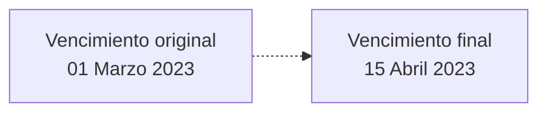
Además del vencimiento de la póliza, esta operación tiene el mismo comportamiento que un suplemento [indeterminado](#tip-spto-IN), por lo que no solo se limita al cambio del vencimiento, también se puede modificar la información permitida en un suplemento [indeterminado](#tip-spto-IN).

Este suplemento está pensado para extender la vigencia de pólizas temporales que no van a ser renovadas (ver [temporalidad](#temporalidad-de-poliza) de póliza). Para el caso de una póliza anual prorrogable, la forma natural de extender el vencimiento es mediante un suplemento de [renovación](#tip-spto-RF).

La extensión del vencimiento en condiciones normales (siempre dependerá de la [definición del ramo](#definicion-ramo)), provocará un incremento en la prima por lo que el cliente deberá satisfacer un incremento adicional de prima por dicha extensión. 

??? Example "Ejemplo:"  

    Teniendo el siguiente escenario:   

    | PÓLIZA | SUPLEMENTO | MOVIMIENTO |	TIPO | EFECTO<br>PÓLIZA	| VENCIMIENTO<br>PÓLIZA | NÚMERO<br>DE MESES | IMPORTE |
    | :---:  | :---:      | :---       | :---: | :---:            | :---:                 | :---:              | ---:    |
    | POL-1  | SPTO-0     | Emisión    | XX    | 01/01/2024	      | 01/06/2024            | 5                  | 100€    |

    Se ejecuta un suplemento de extensión de vigencia para aumentar 2 meses el vencimiento de la póliza, quedando la información de siguiente forma:  

    | PÓLIZA | SUPLEMENTO | MOVIMIENTO |	TIPO | EFECTO<br>PÓLIZA	| VENCIMIENTO<br>PÓLIZA | NÚMERO<br>DE MESES | IMPORTE |
    | :---:  | :---:      | :---       | :---: | :---:            | :---:                 | :---:              | ---:    |
    | POL-1  | SPTO-0     | Emisión    | XX    | 01/01/2024	      | 01/06/2024            | 5                  | 100€    |
    | POL-1  | SPTO-1     | Extensión  | MV    | 01/01/2024	      | 01/08/2024            | 7                  | 50€     |

    El movimiento genera un importe de 50€ equivalente a los 2 meses que se extiende la vigencia.  

## **Premisas**
Para poder realizar este suplemento es necesario que la póliza no esté anulada.

## **Proceso a seguir**
En este apartado se enumeran los bloques de información y el orden en el que aparecerán (siempre dependiendo de la definición del [ramo](#cod_ramo)).

### **INFORMACIÓN PREVIA**
:material-checkbox-blank: [**Selección de la póliza a modificar** (:material-text-box-plus-outline:)](#colapsador-seleccion-poliza)

### **INFORMACIÓN DE PÓLIZA (INICIAL)**
:material-checkbox-blank: [**Información básica de la póliza**    (:material-text-box-edit-outline:)](#colapsador-basica-poliza)  
:material-checkbox-blank: [**Información general de la póliza**   (:material-text-box-edit-outline:)](#colapsador-general-poliza)  
:material-checkbox-blank: [**Tomador**                            (:material-text-box-edit-outline:)](#colapsador-tomador)  
:material-checkbox-blank: [**Intervenciones de cliente**          (:material-text-box-edit-outline:)](#colapsador-Intervencion-cliente)  
:material-checkbox-blank: [**Atributos**                          (:material-text-box-edit-outline:)](#colapsador-atributo)  

### **INFORMACIÓN DE RIESGO**
:material-checkbox-blank: [**Intervenciones de cliente**          (:material-text-box-edit-outline:)](#colapsador-Intervencion-cliente)  
:material-checkbox-blank: [**Atributos**                          (:material-text-box-edit-outline:)](#colapsador-atributo)  
:material-checkbox-blank: [**Intervenciones de cliente**          (:material-text-box-edit-outline:)](#colapsador-Intervencion-cliente)  
:material-checkbox-blank: [**Accesorios**                         (:material-text-box-edit-outline:)](#colapsador-accesorio)  
:material-checkbox-blank: [**Coberturas**                         (:material-text-box-edit-outline:)](#colapsador-cobertura)  
:material-checkbox-blank: [**Textos anexos**                      (:material-text-box-edit-outline:)](#colapsador-texto-anexo)  

### **INFORMACIÓN DE PÓLIZA (FINAL)**
:material-checkbox-blank: [**Cláusulas**                          (:material-text-box-edit-outline:)](#colapsador-clausula)  
:material-checkbox-blank: [**Textos anexos**                      (:material-text-box-edit-outline:)](#colapsador-texto-anexo)   
:material-checkbox-blank: [**Observaciones**                      (:material-text-box-plus-outline:)](#colapsador-observacion)  

[//]: # (## **Vínculos**)
[//]: # (## **Preguntas frecuentes**)

[ref]: #nolink

[ref]: #alterar-poliza-01-seleccion-poliza

[ref]: #extender-poliza-vigencia-02-informacion-basica
[ref]: #extender-poliza-vigencia-03-informacion-general
[ref]: #emitir-alterar-poliza-05-tomador
[ref]: #emitir-alterar-poliza-07-intervencion-cliente
[ref]: #emitir-alterar-poliza-08-atributo
[ref]: #emitir-alterar-poliza-09-accesorio
[ref]: #emitir-alterar-poliza-10-cobertura
[ref]: #emitir-alterar-poliza-11-clausula
[ref]: #emitir-alterar-poliza-14-gestor-cobro
[ref]: #emitir-alterar-poliza-12-texto-anexo
[ref]: #emitir-alterar-poliza-15-observaciones

[ref]: #definicion-concepto-emision

---

# Selección de la póliza a modificar {#alterar-poliza-01-seleccion-poliza}

{ width="596" height="159" style="display: block; margin: 0 auto" }

[//]: # (---)
[//]: # (tags:)
[//]: # (  - negocio)
[//]: # (  - analista)
[//]: # (  - implementador)
[//]: # (  - desarrollador)
[//]: # (---)

## **¿En que consiste?**
En este apartado se identifica la póliza y/o aplicación que se va a modificar. Además, se determina la modificación (suplemento) que se pretende realizar.

## **Proceso a seguir**
A continuación detallan la información requerida.


### **Póliza** (:material-text-box-edit-outline: :material-magnify:) {#num_poliza_O}
Debe coincidir con un número de póliza que exista.

### **Aplicación** (:material-text-box-edit-outline:) {#num_apli_O}
Si el ramo está declarado con el [tratamiento](#cod-tratamiento) de transportes, se debe especificar a que [aplicación](#num-apli) afecta el cambio.

### **Suplemento** (:material-text-box-edit-outline: :material-magnify:) {#cod_spto_O}
Se debe especificar el tipo de modificación que se va a realizar indicando el [suplemento](#DEFINIR-suplemento).

[//]: # (## **Vínculos**)
[//]: # (## **Preguntas frecuentes**)

---

# EXTENDER vigencia - Información básica {#extender-poliza-vigencia-02-informacion-basica}

{ width="596" height="159" style="display: block; margin: 0 auto" }

[//]: # (---)
[//]: # (tags:)
[//]: # (  - negocio)
[//]: # (  - analista)
[//]: # (  - implementador)
[//]: # (  - desarrollador)
[//]: # (---)

## **¿En que consiste?**
En este apartado se identifica la nueva fecha de vencimiento de la póliza.

## **Proceso a seguir**
A continuación detalla la información requerida.


### **Póliza grupo** (:material-text-box:)  {#num_poliza_grupo_O}
Especifica si la póliza que se va a emitir se adhiere a un [grupo](#poliza-grupo) o no.

### **Contrato** (:material-text-box:)  {#num_contrato_O}
Identifica si la póliza tiene [condiciones](#num_contrato) especiales.

### **Subcontrato** (:material-text-box:)  {#num_subcontrato_O}
Establece si la póliza tiene [condiciones](#num_subcontrato) específicas para el [contrato](#num_contrato) dado. Esto es posible si se ha seleccionado un contrato.

### **Nº de póliza** (:material-text-box:) {#num_poliza_O}
Contiene el [identificador](#numero-de-poliza) de la póliza que se está emitiendo. Este número puede ser tomado de forma automática o puede haber sido reservado previamente.

### **Tipo de póliza** (:material-text-box:) {#tip_poliza_tr_O}
Este [tipo](#tip-poliza-tr) es un atributo específico del [tratamiento](#tratamiento) de trasportes. Para los ramos con un [tratamiento](#tratamiento) distinto, el valor es "FIJO".

### **Fecha de efecto** (:material-text-box:) {#fec_efec_poliza_O}
Especifica la fecha en la que comienza la cobertura al riesgo (o riesgos). Esta fecha puede limitarse mediante [definición](#dias-adelanto-atraso).

### **Fecha de vencimiento** (:material-text-box-edit-outline:) {#fec_vcto_poliza_O}
Esta fecha se tomará como la nueva fecha de vencimiento de la póliza.

[//]: # (## **Vínculos**)
[//]: # (## **Preguntas frecuentes**)

---

# EXTENDER vigencia - Información general {#extender-poliza-vigencia-03-informacion-general}

{ width="596" height="159" style="display: block; margin: 0 auto" }

[//]: # (---)
[//]: # (tags:)
[//]: # (  - negocio)
[//]: # (  - analista)
[//]: # (  - implementador)
[//]: # (  - desarrollador)
[//]: # (---)

## **¿En que consiste?**
Información requerida y que afecta a todos los riesgos que pueda contener la póliza.

## **Proceso a seguir**
A continuación detalla la información requerida.


### MONEDA
#### **Moneda** (:material-text-box:) {#cod_mon_O}
Establece la [divisa](#moneda) de la póliza. Este atributo afecta a varios conceptos:

- Capital de la cobertura: Las sumas aseguradas de las coberturas contratadas (y que dispongan de capital no fijado en otra moneda), se expresarán en la moneda elegida en este punto
- Franquicia de la cobertura: Se expresarán en esta moneda si han sido definidas cn esta característica  
- Conceptos de desglose: Se hallarán en la moneda declarada aquí  
- Comisiones: Se hallaran en esta moneda  
- Conceptos económicos: Se calcularán en de acuerdo a este valor  
- Recibos:  Serán generados en esta moneda

#### **Tipo de cambio** (:material-text-box:) {#tip_cambio_O}
Muestra el valor de la conversión entre la moneda elegida de la póliza respecto a la moneda del país. Este valor influye en toda la información económica de la póliza. El campo puede ser modificable o no por [definición](#tipo-cambio).

### RENOVACIÓN
En este apartado se determina la duración de la póliza y si será renovable o no, además de por cuanto tiempo se renovará la póliza.

#### **Renovable** (:material-text-box:) {#tip_duracion_1_O}
Determina si la [duración](#tip-duracion) de la póliza será [anual prorrogable](#anual-prorrogable).

#### **Renovable temporalidad** (:material-text-box:) {#tip_duracion_5_O}
Determina si la [duración](#tip-duracion) de la póliza será [Temporal renovable por su temporalidad](#temporal-temporalidad). Esto ocurre cuando  los días entre el efecto y el vencimiento de la póliza es menor a un año.

#### **Renovable periodicidad** (:material-text-box:) {#tip_duracion_4_O}
Determina si la [duración](#tip-duracion) de la póliza será [Temporal renovable por su periodicidad](#temporal-periodo). Esto ocurre cuando  los días entre el efecto y el vencimiento de la póliza es menor a un año.

!!! info "Resumen"
    Como sinopsis de lo visto sería:

    | RENOVABLE | RENOVABLE<br>TEMPORALIDAD | RENOVABLE<br>PERIODICIDAD | DURACIÓN |
    | :---:     | :---:                     | :---:                     | :---     |
    | SI        | NO                        | NO                        | Anual prorrogable |
    | NO        | NO                        | NO                        | Temporal no renovable |
    | NO        | NO                        | SI                        | Temporal renovable por su periodo |
    | NO        | SI                        | NO                        | Temporal renovable por su temporalidad |
    | SI        | NO                        | NO                        | Temporal renovable |

#### **Nº de renovaciones** (:material-text-box:) {#num_renovaciones_O}
Se puede fijar el número máximo de renovaciones que la póliza tendrá si se renueva. Si se deja con el valor por defecto (cero), la póliza se renovará indefinidamente hasta que se anule.

??? example "Ejemplo:"
     Suponiendo que la póliza tiene una [duración](#tip-duracion) que implica la renovación, el valor de este atributo indicará el número de renovaciones que tendrá la póliza.

     | Nº DE<br>RENOVACIONES | ACCIÓN |
     | :---:                 | :---   |
     | 0   | Se renovará hasta que se anule     |
     | 1   | Se renovará una vez y solo una vez |
     | 20  | Se renovará veinte veces           |
     | 100 | Se renovará cien veces             |

### REVALORIZACIÓN Y TIPO DE PRIMA
#### **Revaloriza** (:material-text-box:) {#mca_regulariza_O}
Se activa en el caso que la definición del ramo determine que alguna cobertura, la forma en la que revaloriza la suma asegurada, se decida en el momento de la emisión de la póliza. El tipo de revalorización elegido afectará a todas las coberturas contratadas que tengan esta definición.
En este punto se decide si se va a revalorizar (se activa la casilla) o si no va a revalorizar (no se activa la casilla).

#### **Tipo de revalorización del riesgo** (:material-text-box:) {#tip_regulariza_O}
Se determina de que forma las coberturas definidas como que la revalorización se elige en este momento lo harán. Para ello, existen distintas formas que se pueden consultar en el siguiente [enlace](#tip-regulariza). De los valores expuestos en el enlace no aplica el de la lógica de negocio

#### **Porcentaje de revalorización del riesgo** (:material-text-box:) {#pct_regulariza_O}
Si el tipo de revalorización afecta a la suma asegurada actual o inicial, en este campo se determina el porcentaje que se aplicará para realizar la revalorización.

#### **Índice de revalorización del riesgo** (:material-text-box:) {#cod_indice_O}
Si se indicó que el tipo de revalorización es por otro índice, en este punto se determina cual de los distintos índices definidos es el que aplica a esta emisión.

#### **Prima manual** (:material-text-box-edit-outline:) {#mca_prima_manual_O}
Determina si el cálculo (coberturas y conceptos de desglose) se realiza de forma automática o manual. El campo puede ser modificable o no por [definición](#tip_primas_manuales).

#### **Cálculo a prorrata** (:material-text-box:) {#mca_prorrata_O}
Determina si para los cálculos de importe de cobertura y conceptos de desglose se aplicará la proporcionalidad del tiempo de vigencia de la póliza ([prorrata](#prorrata)) o no ([escala](#escala)).

!!! info 
    El campo puede ser modificable o no por [definición](#mca_prorrata).

### DATOS GENERALES
#### **Nº de póliza cliente** (:material-text-box:) {#num_poliza_cliente_O}
Este campo se utiliza para agrupar bajo una clave (previamente [definida](#num_poliza_cliente)) varias pólizas de un cliente y/o unidad familiar por la que luego se pueda identificar y explotar información.

#### **Tipo de negocio** (:material-text-box:) {#cod_negocio_O}
Este campo es de información libre que no dispone de validación y que no recibe ningún tipo de explotación por parte de Reef.core. Se creó para identificar asociar un  identificador de MAPFRE Global Risks.

#### **Tipo de envío** (:material-text-box:) {#cod_envio_O}
Campo de índole informativa que especifica de qué forma le llega al Tomador los documentos. Reef.core no explota esta información. Esta funcionalidad se encuentra embebida dentro de los [documentos de salida](#documentos-de-salida).

### REASEGURO
#### **Tipo de reaseguro** (:material-text-box:) {#tip_rea_O}
Este campo contiene de qué forma MAPFRE participa en la póliza que se está emitiendo. Los valores posibles se determinan en la definición del ramo, definición que se puede ver accediendo al siguiente [enlace](#tip_rea_permitido).

#### **Reaseguro manual** (:material-text-box:) {#mca_reaseguro_manual_O}
Especifica si el reaseguro de la póliza/aplicación que se está emitiendo, la distribución del reaseguro se realizará de forma manual y no será acorde al contrato que esté vigente en ese momento.

#### **Reaseguro marco** (:material-text-box:) {#mca_reaseguro_marco_O}
Este campo es exclusivo para aplicaciones y lo que indica es si la distribución del reaseguro se realizará como se realizó en la póliza marco en la que se basará la emisión de la aplicación.

[//]: # (## **Vínculos**)
[//]: # (## **Preguntas frecuentes**)

[ref]: #definir-poliza-cliente
[ref]: #definicion-notificaciones

---

# DEFINICIÓN de póliza cliente {#definir-poliza-cliente}

{ width="596" height="159" style="display: block; margin: 0 auto" }

[//]: # (---)
[//]: # (tags:)
[//]: # (  - negocio)
[//]: # (  - analista)
[//]: # (  - implementador)
[//]: # (  - desarrollador)
[//]: # (---)

## **Objetivo**
Establece una clave que posteriormente será asignada a pólizas y/o aplicaciones con el fin de agruparlas. Esta clave está pensada para agrupar (familias, grupos empresariales, etc.).

-[Propiedades de definición](#de-definicion)

## **Propiedades de definición**{#de-definicion}
### **Número de póliza cliente** {#num_poliza_cliente}
Clave que identificará a la póliza cliente.

### **Descripción** {#nom_poliza_cliente}
Alias que identifica a la póliza cliente.

[//]: # (## **Vínculos**)
[//]: # (## **Preguntas frecuentes**)

---

# TOMADOR {#emitir-alterar-poliza-05-tomador}

{ width="596" height="159" style="display: block; margin: 0 auto" }

[//]: # (---)
[//]: # (tags:)
[//]: # (  - negocio)
[//]: # (  - analista)
[//]: # (  - implementador)
[//]: # (  - desarrollador)
[//]: # (---)

## **En que consiste**  
Identificar quien contrata la póliza. El tomador debe ser un tercero que ha sido dado de alta previamente a la creación de la póliza o, puede darse de alta en el momento de creación de la póliza.

## **Proceso a seguir**  
A continuación detalla la información requerida.


### **tip de documento del tercero** (:material-text-box-edit-outline: :material-magnify:) {#tip_docum_O}
En este punto se debe indicar el documento con el que se identificará al tomador. Los documentos deben estar previamente definidos según se indica en el siguiente [enlace](#tip_docum).

### **Documento** (:material-text-box-edit-outline: :material-magnify:) {#cod_docum_O}
Este campo alberga el número del documento que está relacionado con el campo anterior. 

!!! tip "Si el tomador no existe"

    Se puede utilizar la [consulta :material-magnify:](#CREAR-Asegurado) para, además de acceder a la consulta, modificarlo o incluso crearlo.

[//]: # (## **Vínculos**)
[//]: # (## **Preguntas frecuentes**)

[ref]: #crear-asegurado

---

# INTERVENCIONES DE CLIENTE {#emitir-alterar-poliza-07-intervencion-cliente}

{ width="596" height="159" style="display: block; margin: 0 auto" }

[//]: # (---)
[//]: # (tags:)
[//]: # (  - negocio)
[//]: # (  - analista)
[//]: # (  - implementador)
[//]: # (  - desarrollador)
[//]: # (---)

## **En que consiste**  
En este punto se determina qué personas y de qué forma intervienen en la póliza. Es decir, En la definición del ramo se declaró qué figuras podían ser declaradas en este punto y en el momento de emitir se determina cuales son esas personas.

## **Posibles acciones**  
:material-checkbox-blank: **CREAR**       (:material-text-box-plus-outline:)  
:material-checkbox-blank: **MODIFICAR**   (:material-text-box-edit-outline:)  
:material-checkbox-blank: **BORRAR**      (:material-text-box-remove-outline:)  
:material-checkbox-blank: **INHABILITAR** (:material-text-box-minus-outline:)  

## **Proceso a seguir**  
A continuación detalla la información requerida.


### INTERVINIENTE
### **Tipo beneficiario** (:material-text-box-edit-outline: :material-magnify:) {#tip_benef_O}
Se determina sobre qué figura de las definidas en el [ramo](#tip_benef) se van a incorporar los terceros.

### **Tipo de documento** (:material-text-box-edit-outline: :material-magnify:) {#tip_docum_O}
En este punto se debe indicar el documento con el que se identificará al interviniente. Los documentos deben estar previamente definidos según se indica en el siguiente [enlace](#tip_docum).

### **Documento** (:material-text-box-edit-outline: :material-magnify:) {#cod_docum_O}
Este campo alberga el número del documento que está relacionado con el campo anterior. 

!!! tip "Si el tercero no existe"
    Se puede utilizar la consulta [:material-magnify:](#CREAR-Asegurado) para, además de acceder a la propia consulta, poder modificarlo o incluso crearlo.

### **Principal** (:material-text-box-edit-outline:) {#mca_principal_O}
En caso que exista más de un tercero para una misma intervención, es posible ([bajo definición](#mca_principal)) que la persona que realiza la operación elija cual será el tercero que que se considera como principal.

### **Cálculo** (:material-text-box-edit-outline:) {#mca_calculo_O}
En caso que exista más de un tercero para una misma intervención, es posible ([bajo definición](#mca_calculo)) que la persona que realiza la operación elija cual será el tercero que utilizará Reef.core a la hora de realizar cálculos

### **Porcentaje de  participación** (:material-text-box-edit-outline:) {#pct_participacion_O}
Este campo será requerido según la [definición](#mca_pct) realizada y, es posible que la suma de porcentajes declarados deba ser el 100 por cien si así se ha [definido](#mca_suma_100)

[//]: # ( ### **Tipo de relación** (:material-text-box-edit-outline: :material-magnify:) {#tip_relac_O} )
[//]: # ( tipo de relacion )

### **Medio de pago/cobro** (:material-text-box-edit-outline: :material-magnify:) {#pcm_sqn_val_O}
En este punto es posible elegir de entre los distintos medios de pago o cobro declarados, cual es la que el tercero de la intervención quiere utilizar en la póliza/aplicación sobre la que se está realizando la operación.

### **Dirección** (:material-text-box-edit-outline: :material-magnify:) {#adr_sqn_val_O}
En este punto es posible elegir de entre las distintas direcciones declaradas, cual es la que el tercero de la intervención quiere utilizar en la póliza/aplicación sobre la que se está realizando la operación.

### **Medio de contacto** (:material-text-box-edit-outline: :material-magnify:) {#cnh_sqn_val_O}
En este punto es posible elegir de entre los distintos medios de contacto declarados, cual es el que el tercero de la intervención quiere utilizar en la póliza/aplicación sobre la que se está realizando la operación.

### **V.I.P.** (:material-text-box-edit-outline:) {#mca_vip_O}
Indicaría si el tercero se considera una persona importante.

### INTERVINIENTE
En el caso que se halla [configurado](#mca_cesion) en la intervención, se supone que se está indicando quien es el tercero que está financiando el riesgo asegurado y en este punto se solicita:

#### **Contrato** (:material-text-box-edit-outline:) {#num_prestamo_O}
El número de contrato.

#### **Fecha de vencimiento de la financiación** (:material-text-box-edit-outline:) {#fec_vcto_cesion_O}
La fecha de vencimiento del contrato.

#### **Importe financiado** (:material-text-box-edit-outline:) {#imp_cesion_O}
El importe que resta de la financiación.

[//]: # (**Vínculos**)
[//]: # (**Preguntas frecuentes**)

[ref]: #crear-asegurado

---

# ATRIBUTOS {#emitir-alterar-poliza-08-atributo}

{ width="596" height="159" style="display: block; margin: 0 auto" }

[//]: # (---)
[//]: # (tags:)
[//]: # (  - negocio)
[//]: # (  - analista)
[//]: # (  - implementador)
[//]: # (  - desarrollador)
[//]: # (---)

## **En que consiste**  
Cumplimentar el formulario que ha sido definido en el [ramo](#cod_campo). Los formularios pueden estar definidos en varios niveles. Estos son:

| FORMULARIO DE... | ÁMBITO DEL FORMULARIO QUE AFECTA A |
| :---             | :---                               |
| Póliza           | Todos los riesgos de la póliza                            |
| Riesgo           | Cada uno de los riesgos de la póliza                      |
| Cobertura        | Aquella cobertura del riesgo al que está asociado         |
| Ocurrencia       | Aquella cobertura, riesgo o póliza a la que está asociado |

## **Proceso a seguir**  
Dar respuesta al formulario que se presenta en pantalla. El número de atributos a los que hay que responder dependerá de las respuestas que se aporten ya que es posible que algún atributo no sea obligatorio dependiendo de respuestas dados a atributos anteriores. Es decir, no se tiene porque contestar a todos.


[//]: # (## **Vínculos**)
[//]: # (## **Preguntas frecuentes**)

[ref]: #definir-emision-atributo-ramo

---

# DEFINICIÓN de atributo {#definir-emision-atributo-ramo}

---
hide:
  - nav
  - toc
---

{ width="596" height="159" style="display: block; margin: 0 auto" }

[//]: # (---)
[//]: # (tags:)
[//]: # (  - negocio)
[//]: # (  - analista)
[//]: # (  - implementador)
[//]: # (  - desarrollador)
[//]: # (---)

## **Objetivo** {#objetivo}
Cuando Reef.core no dispone de información que sea necesaria registrar en una póliza o si dispone de esa información pero afecta a la tarifa, es necesario crean atributos.

??? Example "Ejemplo:"
    1. La información NO existe en Reef.core
    
      A continuación se muestran algunos atributos que serían definidos porque no existen en Reef.core:

      - Marca (de un vehículo, electrodoméstico, etc.)  
      - Modelo (de un vehículo, electrodoméstico, etc.)  
      - Número de serie (de un vehículo, electrodoméstico, etc.)  
      - Matrícula (placa) del vehículo  
      - País de destino (de a un viaje)  
      - Provincia de destino (de un viaje)  
      - Enfermedades sufridas (de una persona)  
      - Edad (de una persona)  
      - Etc.  

    1. La información SI existe en Reef.core, pero afecta a la tarifa y hay que declararlo como atributo

      A continuación se muestran algunos atributos que serían definidos porque existen en Reef.core pero son necesarios para determinar el coste del seguro:
    
      - Código postal (de una vivienda, del domicilio de una persona)  
      - Provincia (de una vivienda, del domicilio de una persona)  
      - País (de una vivienda, del domicilio de una persona)  
      - Fecha de nacimiento (de una persona)  
      - Etc.  

Los atributos deben agruparse en formularios y cada formulario puede ser de: 

| FORMULARIO DE... | ÁMBITO DEL FORMULARIO QUE AFECTA A |
| :---             | :---                               |
| Póliza           | Todos los riesgos de la póliza                            |
| Riesgo           | Cada uno de los riesgos de la póliza                      |
| Cobertura        | Aquella cobertura del riesgo al que está asociado         |
| Ocurrencia       | Aquella cobertura, riesgo o póliza a la que está asociado |

- [Propiedades de definición](#de-definicion)
- [Propiedades de defecto](#de-defecto)
- [Propiedades de ramo](#de-ramo)
- [Propiedades de ayuda](#de-ayuda)
- [Propiedades generales](#generales)
- [Propiedades de suma asegurada](#de-suma-asegurada)
- [Propiedades de inspección](#de-inspeccion)
- [Propiedades de validación](#de-validacion)
- [Propiedades varias](#varias)
- [Propiedades de visualización](#de-visualizacion)

## **Propiedades de definición** {#de-definicion}
### **Nombre del atributo** {#cod_campo}
En este punto se debe determinar cual es el nombre que recibirá (no confundir con la descripción).

!!! tip "Consejo"
    Para un mejor entendimiento es aconsejable que el atributo disponga de un prefijo que indique cual será el contenido que albergará. A continuación algunos ejemplos de prefijos:
    
    | PREFIJO | EL ATRIBUTO CONTENDRÁ... |
    | :---:   | :---                     |
    | COD_    | Un código cuya descripción se encuentra en una tabla de Reef.core o propia del ramo |
    | FEC_    | Una fecha                                                                           |
    | IMP_    | Un importe                                                                          |
    | MCA_    | Un SÍ o un NO                                                                       |
    | NOM_    | Un nombre                                                                           |
    | APE_    | Un apellido                                                                         |
    | PCT_    | Un porcentaje                                                                       |
    | TIP_    | Valores prefijados previamente en una tabla de Reef.core o propia del ramo          |
    | VAL_    | Un valor que NO sea alguno de los citados anteriormente                             |

### **Descripción del atributo** {#nom_campo}
Texto que se mostrará en pantalla al usuario que realiza la operación.

### **Tipo de campo** {#tip_campo}
Se especifica que tipo de información contendrá el campo cuando sea solicitado al usuario que realiza la operación. Los valores posibles son:

- Carácter
- Número
- Fecha

- #### Carácter
El atributo contendrá letras, números y otros caracteres.

- #### Número
El atributo solo contendrá números.

- #### Fecha
El atributo solo contendrá fechas.

!!! info "Formato"
    El formato de fecha por defecto es ddmmyyyy, donde:

    - dd es el día 
    - mm es el mes
    - yyyy es el año

    Este formato puede alterarse para adaptarse al estándar americano (mmddyyyy)

### **Longitud máxima** {#lng_campo}
Longitud maxima que aceptará el atributo.

## **Propiedades de ramo** {#de-ramo}
### **Ramo** {#cod_ramo}
Apunta al [ramo](#cod_ramo) al que afecta esta definición.

### **Modalidad de vida** {#cod_modalidad}
Determina la modalidad (solo para ramos con [tratamiento](#cod_tratamiento_emision) de vida) a la que pertenece el atributo.

### **Cobertura** {#cod_cob}
[Cobertura](#cod_cob) a la que pertenece.

### **Orden** {#num_secu}
Posición en el que aparecerá a la hora de ser solicitado.

### **Fecha de validez** {#fec_validez}
Determina cuando la definición estará disponible para ser utilizada.
Su correcto uso permite tener un registro histórico de los cambios efectuados en la definición.

### **Determina la modalidad (oferta comercial)** {#mca_modalidad}
El atributo forma parte a la hora de determinar la modalidad (oferta comercial). En la definición del ramo, si este trabaja con modalidades, puede existir uno o varios atributos que determinen la modalidad (oferta comercial) que se ofrecerá al cliente a la hora de crear o modificar una póliza/aplicación. El valor de este atributo depende de si el ramo trabaja o no con [modalidades](#tip_formacion_modalidad) (oferta comercial) y de que manera se forman.

## **Propiedades de ayuda** {#de-ayuda}
Los siguientes atributos determinan la ayuda que le aparecerá a la persona que realiza la operación si esta lo solicita.

### **Pantalla** {#nom_pgm_help}
Este atributo solicita la pantalla que mostrará a ayuda la persona que realiza la operación. Usualmente el valor de este atributo es "AL000010".

### **Tabla** {#nom_tabla_valida}
En este punto se solicita la tabla (Oracle) donde se encuentra la información de ayuda.

### **Versión** {#cod_version}
Versión de la ayuda de la Tabla seleccionada en el punto anterior.

### **Depósito con la selección** {#nom_global_pgm_help}
No es obligatorio, pero si es necesario, se requiere el nombre del lugar donde se deposita la información seleccionada de la ayuda mostrada.

## **Propiedades de defecto** {#de-defecto}
### **Lógica de negocio previa a la petición de información** {#nom_prg_pre_campo}
Esta lógica puede llegar a determinar el valor que toma el atributo y si este es modificable por parte de la persona que realiza la operación. Es decir, esta lógica puede determinar:

| ATRIBUTO CON VALOR<br>POR DEFECTO | EL VALOR SE<br>PUEDE MODIFICAR |
| :---:                             | :---:                          |
| SI | SI |
| SI | NO |
| NO | SI |
| NO | NO |

### **Valor por defecto** {#val_defecto}
Se puede especificar un valor que será el que el atributo dispondrá a la hora de realizar la operación (si el atributo carece de valor). Si el valor por defecto puede variar dependiendo de cualquier circunstancia, se debe utilizar además, el atributo anterior (Lógica de negocio previa a la petición de información).

!!! info "Importante"
    Un atributo que tiene definido un valor por defecto, solo lo tomará si el atributo no tiene valor. En cuanto tome un valor, ya sea el valor por defecto u otro, conservará el valor que tenga. Es decir, en ningún caso tomara el valor por defecto.

## **Propiedades generales** {#generales}
### **Afecta al cálculo** {#mca_calculo}
Se determina si el contenido del atributo afecta al importe del seguro.

!!! info "Importante"
    Esta característica es necesario que se rellene de forma correcta, ya que dependiendo del valor que se de, Reef.core va a determinar cuando se debe volver a calcular (en un suplemento) el riesgo o no.

### **Es único** {#mca_unico}
La información del atributo es única. Es decir, no puede existir otra póliza con el mismo valor en el mismo periodo de vigencia

??? Example "Ejemplo:"
    A continuación se muestra un caso que puede mostrar el uso de cuando un atributo puede ser único. Existe un atributo con esta característica:

    | ATRIBUTO | ES ÚNICO |
    | :---     | :---:    |
    | Código postal     | NO |
    | Matrícula (placa) | SI |

    Por otro lado existen las siguientes pólizas ya en cartera:

    | PÓLIZA | SUPLEMENTO | EFECTO | VENCIMIENTO | CÓDIGO POSTAL | MATRÍCULA<br>(PLACA) |
    | :---   | :---:      | :---   | :---        | :---:         | :---:               |
    | 1111111111111 | 0 | 01 Enero 2023   | 01 Enero 2024 | 28000 | AAA0000 |
    | 1111111111111 | 1 | 01 Febrero 2023 | 01 Enero 2024 | 28000 | BBB0000 |
    | 2222222222222 | 0 | 01 Enero 2023   | 01 Enero 2024 | 28000 | CCC0000 |
    
    Si ahora se intenta crear una póliza nueva (o realizar un suplemento a una póliza las matrículas registradas en la cartera), la disponibilidad de las placas sería:

    | DISPONIBILIDAD<br>DE USO DE <br>MATRÍCULA<br>(PLACA) | ENERO | FEBRERO | MARZO | ABRIL | MAYO  | JUNIO | JULIO | AGOSTO | SEPTIEMBRE | OCTUBRE | NOVIEMBRE | DICIEMBRE |
    | :---:                                               | :---: | :---:   | :---: | :---: | :---: | :---: | :---: | :---:  | :---:      | :---:   | :---:     | :---:     |
    | AAA0000                                             | NO    | SI      | SI    | SI    | SI    | SI    | SI    | SI     | SI         | SI      | SI        | SI        |
    | BBB0000                                             | SI    | NO      | NO    | NO    | NO    | NO    | NO    | NO     | NO         | NO      | NO        | NO        |
    | CCC0000                                             | NO    | NO      | NO    | NO    | NO    | NO    | NO    | NO     | NO         | NO      | NO        | NO        |

!!! info "Importante"
    Un atributo único, si tiene definido un valor por defecto, siempre que el contenido del atributo coincida con el valor por defecto, Reef.core NO realizará la búsqueda con el fin de encontrar en otro riesgo vigente de la cartera el contenido del atributo. En cuanto el atributo pierda el valor por defecto, Reef.core realizará la búsqueda del contenido en la cartera vigente.

### **Se solicita en presupuesto** {#mca_presupuesto}
Indica si el atributo se solicita cuando se realice un presupuesto. El propósito de esta característica es la de poder solicitar la mínima informción posible cuando un cliente quiere conocer el precio de un seguro.

!!! info "Importante"
    Todo atributo que se ha declarado que afecta al cálculo siempre se solicitará en un presupuesto, por lo que esta a característica no será posible determinar un valor.

### **Mostrar en la tramitación del siniestro** {#mca_sini}
Se especifica si el atributo será mostrado en la tramitación del siniestro. Es decir, la persona que tramita podrá ver el contenido del atributo sin tener que consultar la póliza.

### **Obligatorio** {#mca_obligatorio}
Se indica si el atributo es obligatorio que disponga de valor o no. Si el atributo es obligatorio, hasta que no tenga valor, el proceso no puede continuar.

### **Admite mayúsculas y/o minúsculas** {#mca_case_sensitive}
Por defecto, el contenido de un atributo se registra en mayúsculas, esta característica permite que el contenido de un atributo pueda ser en minúsculas.

??? Example "Ejemplo:"
    A continuación se muestra un ejemplo de esta característica:

    | NOMBRE DEL<br>ATRIBUTO | DESCRIPCIÓN<br>DEL ATRIBUTO | ADMITE MINÚSCULAS | CONTENIDO   |
    | :---                   | :---                        | :---:             | :---        |
    | NOM_ASEGURADO          | Nombre del asegurado        | NO                | MARÍA       |
    | APE_ASEGURADO          | Apellidos del asegurado     | SI                | Gómez Pérez |

## **Propiedades de validación** {#de-validacion}
### **Lógica de negocio que valida el atributo** {#nom_prg_campo}
Esta lógica se encarga de validar el contenido del atributo. La lógica determinará si el contenido es correcto o no, y en caso que no sea correcto se devolverá un error. La validación salta si el atributo tiene algún tipo de contenido.

### **Valida aunque el atributo no tenga valor** {#mca_valida_si_null}
La validación se realiza aunque el atributo carezca de algún valor. Es decir, se realiza la validación aunque el atributo esté vacío de contenido.

## **Propiedades generales** {#generales}
### **Grabar atributo en caso de rechazo** {#mca_graba_rechazo}
Si una operación de emisión queda retenida por control técnico y es rechazada, Reef.core almacena parte de la información del elemento rechazado y queda registrado. En este caso, se puede determinar si el atributo en el caso de rechazo es necesario que quede almacenado o no.

### **Exportar a RE21** {#mca_exportar_rea_ext}
En el caso que Reef.core se integre con RE21 (Módulo de reaseguro), se indica si el atributo se enviará a RE21.

### **Inhabilitado** {#mca_inh}
En este punto se determina si está activo o por el contrario ya no puede ser incluido en una nueva póliza. Es importante destacar que, aunque se inhabilite, todas las pólizas que dispongan de ello, seguirá aplicándose hasta que mediante un suplemento se cambie. En ese momento, al estar inhabilitado ya no será posible seleccionarlo.

## **Propiedades de inspección** {#de-inspeccion}
### **Forma parte del formulario de inspección** {#mca_inspec}
Indica que formará parte del formulario de inspección, ya sea mostrar el que tuviera y/o para informar un valor.

### **Clave en la búsqueda de inspecciones** {#mca_busca_insp}
Se indica si el atributo es importante a la hora de encontrar la inspección. Es relevante destacar que conviene elegir aquellos atributos cuya cardinalidad sea baja (los distintos valores del atributo es reducido) en la cartera de pólizas. A parte, estos atributos cuya cardinalidad sea baja deben ocupar las primeras posiciones en el formulario (ver propiedad [Orden](#num_secu_insp)).

### **La búsqueda de inspección se hace con el operador de comparación igual** {#mca_busca_por_igual_insp}
Cada atributo definido, cuando se emita la póliza tendrá un valor, y el sistema buscará una inspección. A la hora de buscar, se puede determinar que la búsqueda se haga por igual.

### **Orden** {#num_secu_insp}
Lugar en el que aparecerá en el formulario y por el además se realizará la búsqueda de la inspección.

??? Example "Ejemplo:"
    A continuación se muestra un ejemplo con algunos atributos cuya cardinalidad es distinta y se muestra cómo debería ser la definición para que la búsqueda de inspección sea más eficiente

    | NOMBRE DEL<br>ATRIBUTO | DESCRIPCIÓN<br>DEL ATRIBUTO    | Nº DE ATRIBUTOS | VALORES DISTINTOS<br>(CARDINALIDAD) |
    | :---                   | :---                           | ---:            | ---:                                |
    | MCA_GARAJE             | Vehículo aparcado en garaje    | 100.000         | 2                                   |
    | VAL_DIRECCIÓN          | Dirección                      | 100.000         | 10.000                              |
    | COD_POSTAL             | Código postal                  | 100.000         | 15.000                              |
    | COD_DOCUM              | Número del documento (tomador) | 100.000         | 95.000                              |
    | NUM_MATRICULA          | Matrícula (placa) del vehículo | 100.000         | 80.000                              |

    Según esta tabla y pensando que hay cuatro atributos que son clave para encontrar la inspección, la secuencia debería ser :

    | NOMBRE DEL<br>ATRIBUTO | DESCRIPCIÓN<br>DEL ATRIBUTO    | FORMULARIO<br>INSPECCIÓN | CLAVE | ORDEN | BÚSQUEDA<br>POR IGUAL |
    | :---                   | :---                           | :---:                    | :---: | :---: | :---:                 |
    | MCA_GARAJE             | Vehículo aparcado en garaje    | SI                       | NO    | N.A.  | N.A.                  |
    | VAL_DIRECCIÓN          | Dirección                      | SI                       | SI    | 4     | NO                    |
    | COD_POSTAL             | Código postal                  | SI                       | SI    | 3     | SI                    |
    | COD_DOCUM              | Número del documento (tomador) | SI                       | SI    | 1     | SI                    |
    | NUM_MATRICULA          | Matrícula (placa) del vehículo | SI                       | SI    | 2     | SI                    |

## **Propiedades de suma asegurada** {#de-suma-asegurada}
### **Es una suma asegurada** {#mca_suma_aseg}
Se indica si el contenido va a ser una suma asegurada que posteriormente, alguna cobertura va a tomar. Esto es muy común por ejemplo en ramos de automóviles en los que el valor del vehículo se registra como un atributo del riesgo y, posteriormente ese valor se va a convertir en suma asegurada de alguna cobertura del riesgo como puede ser la cobertura de Daños al propio vehículo.
En este caso, como se ha declarado que el contenido es una suma asegurada, se va a dar la oportunidad de que se valor se revalorice o no. Esto se consigue definir en las siguientes propiedades

### **Tipo de revalorización** {#tip_regulariza}
Se determina de que forma se va a revalorizar la suma asegurada. Para ello, existen distintas formas que se pueden consultar en el siguiente [enlace](#tip-regulariza). 

### **Como se revaloriza** {#tip_regulariza_esp}
Una vez que se determina que se desea revalorizar la suma asegurada, hay que decidir como se va a realizar la revalorización. En el siguiente [enlace](#tip-regulariza-esp) se encuentran las opciones de las que se dispone.

### **Porcentaje de revalorización** {#pct_regulariza_esp}
Si el tipo de revalorización afecta a la suma asegurada actual o inicial, en este punto se determina el porcentaje que se aplicará para realizar la revalorización.

### **Índice de revalorización** {#cod_indice}
Si se indicó que el tipo de revalorización es por otro índice, en este lugar se determina cual de los distintos índices definidos es el que aplicará.

### **Lógica de negocio que determina el nuevo capital** {#nom_prg_regulariza_esp}
Lógica que determinará cual es la nueva suma asegurada.

## **Propiedades de comportamiento en suplementos** {#de-comportamiento-en-suplementos}
En este punto se ha de decidir como se comportará la cobertura cuando se realice un suplemento y este comportamiento dependerá de si se ha modificado algo que afecta a la tarifa o no. 
## **Propiedades varias** {#varias}
### **Ocurrencia** {#cod_lista}
En este punto se determina cual será el [formulario](#cod_lista_T) que se va a utilizar asociado al atributo que se está definiendo.

### **Transportes, atributo asociado a...** {#cod_transportes}
Si el ramo tiene definido el [tratamiento](#cod_tratamiento_emision) de transportes, se puede elegir cuando el atributo va a ser modificable. Los valores posibles son:

- Póliza marco
- Aplicaciones
- Pólizas marco y aplicaciones

#######

#### Póliza marco
El atributo en el proceso de emisión será solicitado solo cuando se cree o modifique una póliza marco. En el caso de las aplicaciones, el atributo mostrará su valor pero no será posible alterar su valor.

#### Aplicaciones
El atributo en el proceso de emisión será solicitado solo cuando se cree o modifique una aplicación. En el caso de pólizas marco, el atributo mostrará su valor pero no será posible dar valores.

#### Pólizas marco y aplicaciones
En este caso, el atributo mostrará y permitirá crear y/o modificar valores tanto en el caso de póliza marco como aplicación.

[//]: # (## ## **Propiedades de visualización** {#de-visualizacion})
[//]: # (## ### **cod_panel** {#cod_panel})
[//]: # (## panel asociado)

[//]: # (## ### **tip_subnivel** {#tip_subnivel})
[//]: # (## subnivel de peticion)

[//]: # (## - (1)Común)
[//]: # (## - (2)Información general)
[//]: # (## - (3)Tomador)
[//]: # (## - (4)Intervenciones póliza)
[//]: # (## - (5)Agente)
[//]: # (## - (6)Coaseguro)
[//]: # (## - (7)Intervenciones de riesgo antes de atributos)
[//]: # (## - (8)Intervenciones de riesgo después de atributos)
[//]: # (## - (9)Accesorios)
[//]: # (## - (10)Antes de coberturas)
[//]: # (## - (11)Riesgo)
[//]: # (## ###)

[//]: # (## - #### (1)Común)

[//]: # (## - #### (2)Información general)

[//]: # (## - #### (3)Tomador)

[//]: # (## - #### (4)Intervenciones póliza)

[//]: # (## - #### (5)Agente)

[//]: # (## - #### (6)Coaseguro)

[//]: # (## - #### (7)Intervenciones de riesgo antes de atributos)

[//]: # (## - #### (8)Intervenciones de riesgo después de atributos)

[//]: # (## - #### (9)Accesorios)

[//]: # (## - #### (10)Antes de coberturas)

[//]: # (## - #### (11)Riesgo)

## **Propiedades varias** {#varias}
### **Tipo de contenido** {#tip_dato_fondo}
Esta característica determina qué tipo de contenido albergará el atributo que se está definiendo. Los contenidos permitidos son:

| CONTENIDO                      |
| :---                           | 
| Código fondo inversión         | 
| Edición fondo inversión        |
| Porcentaje inversión fondo     |
| Importe total inversión        |
| Importe inversión fondo        |
| Número de fondos de inversión  |
| Años duración póliza           |
| Plan aportación                |
| Suspensión plan aportación     |
| Importe prima inversión        |
| Importe prima aportación       |
| Importe prima total            |
| Importe aportación pactada     |
| Importe inversión aportación   |
| Tipo gestor aportación         |
| Código gestor aportación       |
| Código suplemento aportación   |
| Subcódigo suplemento aportación|
| Causa suplemento aportación    |
| Motivo suplemento aportación   |
| Agrupación sublímite           |
| Transaction id PLATEA          |

## **Propiedades de validación** {#de-validacion}
### **Validación en el momento** {#mca_vld_online}
La validación se realiza una vez que se ha introducido el valor sin esperar a que se pulse el botón "Aceptar".

[//]: # (## **Vínculos**)
[//]: # (## **Preguntas frecuentes**)

---

# ACCESORIOS {#emitir-alterar-poliza-09-accesorio}

{ width="596" height="159" style="display: block; margin: 0 auto" }

[//]: # (---)
[//]: # (tags:)
[//]: # (  - negocio)
[//]: # (  - analista)
[//]: # (  - implementador)
[//]: # (  - desarrollador)
[//]: # (---)

## **En que consiste**  
Registrar en el riesgo los accesorios que estarán asegurados en la póliza.  

Esta información estará accesible siempre que la definición de alguna cobertura indique que [requiere accesorios](#mca_accesorios), o bien, el [tipo de capital](#mca_tip_capital) de alguna cobertura contemple el importe de accesorios.  

Los accesorios a incluir en el riesgo deben estar [definidos previamente](#definir_accesorio). De la lista de accesorios definidos, se podrán seleccionar los que se quieran incluir en la póliza.   

## **Posibles acciones**  
:material-checkbox-blank: **CREAR**       (:material-text-box-plus-outline:)  
:material-checkbox-blank: **MODIFICAR**   (:material-text-box-edit-outline:)  
:material-checkbox-blank: **BORRAR**      (:material-text-box-remove-outline:)  
:material-checkbox-blank: **INHABILITAR** (:material-text-box-minus-outline:)  

## **Proceso a seguir**  
A continuación detalla la información requerida.


### ACCESORIOS
### **Accesorio** (:material-text-box-edit-outline:) {#cod_accesorio_O}
Muestra la [clave](#cod_accesorio) que identifica el accesorio seleccionado.  

### **Nombre accesorio** (:material-text-box:) {#nom_accesorio_O}
Contiene la [descripción](#nom_accesorio) que identifica el accesorio.   

### **Importe** (:material-text-box-edit-outline:) {#imp_accesorio_O}
Contiene el valor del accesorio, expresado en la moneda de la póliza.  

!!! info "¿se puede modificar?"  
    En este campo se muestra el [valor](#imp_accesorio) del accesorio, previamente definido, que podrá modificarse siempre que el nuevo valor se encuentre entre el [valor mínimo](#imp_accesorio_min) y [valor máximo](#imp_accesorio_max) permitido.  

### **Observación** (:material-text-box-edit-outline:) {#txt_accesorio_O}
Esta propiedad contiene cualquier información adicional que se quiera indicar para el accesorio.  

### **Baja** (:material-text-box-edit-outline:) {#mca_baja_O}
Indica si el accesorio sigue formando parte del riesgo asegurado, o por el contrario, ya no está amparado por la póliza.  

[//]: # (## ### **mca_vigente** (:material-text-box-edit-outline: :material-magnify:) {#mca_vigente_O})
[//]: # (## fila vigente)

[//]: # (## ### **mca_baja_riesgo** (:material-text-box-edit-outline: :material-magnify:) {#mca_baja_riesgo_O})
[//]: # (## el riesgo esta dado de baja)

[//]: # (## ### **tasa_accesorio** (:material-text-box-edit-outline: :material-magnify:) {#tasa_accesorio_O})
[//]: # (## tasa del accesorio)

[//]: # (## **Vínculos**)
[//]: # (## **Preguntas frecuentes**)

---

# COBERTURAS {#emitir-alterar-poliza-10-cobertura}

{ width="596" height="159" style="display: block; margin: 0 auto" }

[//]: # (---)
[//]: # (tags:)
[//]: # (  - negocio)
[//]: # (  - analista)
[//]: # (  - implementador)
[//]: # (  - desarrollador)
[//]: # (---)

## **En que consiste** {#en-que-consiste}  

## **Posibles acciones** {#posibles-acciones}  
:material-checkbox-blank: **MODIFICAR**   (:material-text-box-edit-outline:)  

## **Proceso a seguir** {#proceso-a-seguir}  


### **COBERTURA** (:material-text-box:) {#nom_cob_O}
Esta columna muestra el nombre de la cobertura.

### **OPCIONES** (:material-text-box:) {#cobertura-opciones_O}
Esta columna muestra si [existen atributos definidos](#cod_campo) en la cobertura. En ese caso, si se pulsa sobre el [icono ][colapsador-atributo].

### **CONTRATADA** (:material-text-box-edit-outline:) {#cobertura-contratada_O}
Esta casilla de verificación tiene dos funciones:

1. Indica si la cobertura está contratada ({width="64" height="64" style="vertical-align:middle";}) o no ({width="64" height="64" style="vertical-align:middle";}). Esto aplica a cualquier [tipo de cobertura](#mca_tip_cob). Es decir, aplica a coberturas que tienen suma asegurada o coberturas que no disponen de suma asegurada.
2. Para coberturas que NO disponen de suma asegurada (ver [tipo de cobertura](#mca_tip_cob)), esta caja de verificación es sobre la que actúa el usuario que está realizando la operación para indicar que la cobertura está contratada (o no). También aplica a coberturas que tienen suma asegurada y esta no puede ser modificada por el usuario que está realizando la operación.

### **CAPITAL**            (:material-text-box-edit-outline: :material-magnify:) {#suma_aseg_O}
En este punto si la cobertura dispone de [suma asegurada](#mca_tip_cob) y este se puede [modificar](#cod_cob-mca_mod_suma_aseg), el usuario que realiza la operación, puede alterar o incluir la suma asegurada.

### **FRANQUICIA**         (:material-text-box-edit-outline: :material-magnify:) {#cod_franquicia_O}
Aquí se determina cual será la [franquicia](#cod_franquicia) que aplicará a la cobertura. Siempre que la cobertura disponga de [franquicias](#cod_franquicia) y el usuario que realiza la operación, pueda modificarla.

### **MONEDA FRANQUICIA**  (:material-text-box-edit-outline: :material-magnify:) {#cod_mon_franquicia_O}
Muestra la moneda en la que está expresada la franquicia. En el caso que la moneda pueda ser modificada, el usuario que realiza la operación podrá alterarla.

### **IMPORTES MANUALES**
En el caso que el ramo permita [primas manuales](#tip_prima_manual) y la póliza/aplicación disponga de esta [carcterística](#colapsador-general-poliza_pmca_prima_manual_O), se podrán utilizar los siguientes campos. Es importante comentar que, aunque la póliza/aplicación se haya determinado que los importes son manuales, si los tres campos que se comentan a continuación, se encuentran sin valor, Reef.core aplicará la definición de la cobertura para hallar el importe de la prima.
También hay que tener en cuenta que se aplica una prioridad a la hora de determinar cual es el campo que se tomará como referencia si hubiera más de un campo con valor. El orden es el siguiente

1. Importe suplemento
1. Importe anual
1. Tasa

Esto quiere decir que, si el campo importe suplemento tiene valor, se tomará este y no otro para hallar el resto de campos. En cambio, si el importe del suplemento está vacío se evaluará el campo importe anual. Si este tiene valor, se utilizará este para hallar el resto de los campos. Si importe anual está vacío, se evaluará el campo tasa. Si este tiene valor, se tomará el campo tasa para hallar el resto de campos. En cambio, si tasa está vacío se aplicará la definición de la cobertura para hallar el importe.

A continuación se muestra el proceso que se sigue para, en caso que la póliza/aplicación tenga importes manuales hallar el importe

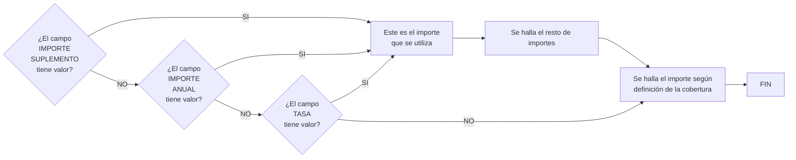

#### **IMPORTE SUPLEMENTO** (:material-text-box-edit-outline:) {#imp_spto_O}
Será el importe correspondiente al periodo de vigencia del movimiento. Para más información acceder a este [enlace](#imp_spto).

#### **IMPORTE ANUAL**      (:material-text-box-edit-outline:) {#imp_anual_O}
Corresponde al coste de la cobertura por un año. Para más información acceder a este [enlace](#imp_anual).

#### **TASA**               (:material-text-box-edit-outline:) {#tasa_cob_O}
Es el tanto por mil que representa el importe anual sobre la suma asegurada. Es decir:

```
tasa := importe anual / suma asegurada * 1000   
```

[//]: # (## **Vínculos**)
[//]: # (## **Preguntas frecuentes**)

[ref]: #emitir-alterar-poliza-08-atributo

---

# CLÁUSULAS {#emitir-alterar-poliza-11-clausula}

{ width="596" height="159" style="display: block; margin: 0 auto" }

[//]: # (---)
[//]: # (tags:)
[//]: # (  - negocio)
[//]: # (  - analista)
[//]: # (  - implementador)
[//]: # (  - desarrollador)
[//]: # (---)

## **En que consiste** {#en-que-consiste}  
Identificar en la póliza las condiciones que deben considerarse según las características del riesgo asegurado.  

Las [cláusulas](#DEFINIR-clausula) se definen de forma previa a la emisión de la póliza. En el proceso de emisión se seleccionan aquellas cláusulas que aplican para el seguro que se está contratando.  

Será la [definición del ramo](#mca_clausula_ramo), o la [definición del suplemento](#mca_clausula_suplemento) que se esté ejecutando, las que determinen si se deben asociar o no cláusulas al movimiento de la póliza.

## **Posibles acciones** {#posibles-acciones}  
:material-checkbox-blank: **MODIFICAR**   (:material-text-box-edit-outline:)  

## **Proceso a seguir** {#proceso-a-seguir}  
A continuación detalla la información requerida.

  

### **Riesgo** (:material-text-box:) {#num_riesgo_O}
Contiene el identificador del riesgo al que afecta la cláusula.  

Si la selección de la cláusula no depende de un riesgo, es a [nivel póliza](#mca_nivel_poliza), esta propiedad tendrá siempre valor 0.    

### **Descripción del riesgo** (:material-text-box:) {#nom_riesgo_O}
Muestra el nombre con el que se identifica el riesgo al que afecta la cláusula. Si la cláusula no se asocia a ningún riesgo concreto, es decir, afecta a toda la póliza, la descripción será siempre un asterisco (*).    

### **Cláusula** (:material-text-box:) {#cod_clausula_O}
Identifica la [clave](#cod_clausula) de la cláusula.  

### **Nombre cláusula** (:material-text-box:) {#nom_clausula_O}
Muestra el [título](#nom_clausula) definido para la cláusula.  

### **Selección** (:material-text-box-edit-outline:) {#mca_seleccion_O}  
Indica si la cláusula está o no seleccionada para ser incluida en el movimiento de la póliza.  

!!! info "Inclusión o exclusión de una cláusula"
    Esta propiedad, que permite incluir o excluir una cláusula, estará habilitada y se podrá modificar cuando la definición de la cláusula permita que el [usuario pueda actuar](#tip_act_clausula) sobre ella.  
    
### **Texto variable** (:material-text-box:) {#mca_txt_variable_O}
Esta propiedad muestra si el texto de la cláusula tiene o no [información variable](#mca_txt_variable), es decir, datos que dependen del movimiento de la póliza.   

### **Texto cláusula** (:material-text-box-edit-outline:) {#txt_clausula_O}  
Muestra el [texto](#txt_clausula) completo de la cláusula.   

!!! info "Modificación del texto de la cláusula"
    Cuando la cláusula tiene [texto variable](#txt_clausula), si esta información no se recupera de forma automática, es posible incluir el valor de forma manual. En cualquier otro caso, el texto de la cláusula no se puede modificar.     

[//]: # (## **Vínculos**)
[//]: # (## **Preguntas frecuentes**)

---

# GESTOR COBRO {#emitir-alterar-poliza-14-gestor-cobro}

{ width="596" height="159" style="display: block; margin: 0 auto" }

[//]: # (---)
[//]: # (tags:)
[//]: # (  - negocio)
[//]: # (  - analista)
[//]: # (  - implementador)
[//]: # (  - desarrollador)
[//]: # (---)

## **En que consiste** {#en-que-consiste}  
Permite  indicar el gestor de cobro, que es un tercero que se encargará de recibir el importe del recibo y entregarlo a MAPFRE mediante la operación [COBRAR recibo](#COBRAR-recibo).

## **Proceso a seguir** {#proceso-a-seguir}  
A continuación se detalla la información requerida.

  

#### **Tipo de gestor** (:material-text-box-edit-outline: :material-magnify:) {#tip_gestor_O}
Esta propiedad identifica como se va a gestionar el cobro de los recibos. El [tipo de gestor](#DEFINIR-gestor-cobro) que se indique en esta propiedad determinará el tipo de tercero que realizará la gestión.  
Según el [tipo de clase de gestor](#tip-clase-gestor) que lleve asociado, determinará las características que debe tener la póliza para que pueda ser utilizado como gestor de cobro.  

| TIPO  | CLASE | DESCRIPCIÓN                   | EN QUE CASO PUEDE UTILIZARSE                           |
| :---: | :---: | :---                          | :---                                                   |
| AG    | 1     | AGENTE                        | Siempre                                                |
| BA    | 2     | BANCO                         | Siempre que el pagador disponga de cuenta bancaria     |
| CO    | 3     | COBRADOR                      | Siempre que exista esta figura definida en la compañía |
| DB    | 4     | DÉBITO AUTOMÁTICO EN CUENTA   | Siempre que el pagador disponga de cuenta bancaria     |
| GC    | 5     | GESTOR DIRECTO                | Siempre                                                |
| GP    | 6     | GESTOR PILOTO COASEGURO       | Siempre que la póliza sea de coaseguro aceptado        |
| OF    | 7     | OFICINA COMERCIAL             | Siempre                                                |
| TA    | 8     | DÉBITO CON TARJETA DE CRÉDITO | Siempre que el pagador disponga de una tarjeta de crédito |
| IM    | 10    | GESTOR DE IMPAGOS             | Nunca. Este tipo de exclusivo del proceso de impagos |

#### **Gestor** (:material-text-box-edit-outline: :material-magnify:) {#cod_gestor_O}
En este campo se indica la clave del tercero que actuará como gestor atendiendo al [tipo de clase de gestor](#tip_clase_gestor). Es decir:

| CLASE | DESCRIPCIÓN                   | CLAVE QUE SE ASOCIA                     |
| :---: | :---                          | :---                         |
| 1     | AGENTE                        | clave del agente principal de la póliza |
| 2     | BANCO                         | Entidad junto a la oficina bancaria del tercero que se encarga de cobrar los recibos para MAPFRE |
| 3     | COBRADOR                      | Corresponde a la del cobrador que se encargará de recolectar los importes de los recibos |
| 4     | DÉBITO AUTOMÁTICO EN CUENTA   | Entidad junto a la oficina bancaria del tercero que se encarga de cobrar los recibos para MAPFRE |
| 5     | GESTOR DIRECTO                | Oficina MAPFRE (tercer nivel de la estructura comercial) |
| 6     | GESTOR PILOTO COASEGURO       | Entidad aseguradora que actúa como [líder](#cia_lider) en la póliza |
| 7     | OFICINA COMERCIAL             | Oficina MAPFRE (tercer nivel de la estructura comercial) |
| 8     | DÉBITO CON TARJETA DE CRÉDITO | Entidad junto a la oficina bancaria del tercero que se encarga de cobrar los recibos para MAPFRE |
| 10    | GESTOR DE IMPAGOS             | No aplica |

### **Cuenta de cobro** (:material-text-box-edit-outline: :material-magnify:) {#num_secu_cta_tar_O}
En esta propiedad se especifica el [medio de cobro o pago](#medio_cobro_pago) que va a utilizar el pagador, al que se le realizará el cargo correspondiente a los recibos, cuando estos entren en efecto.   

[//]: # (## Se debe especificar la cuenta bancaria o la tarjeta de crédito del pagador al que se le realizará el cargo correspondiente a los recibos, cuando estos entren en efecto )
Esta propiedad es obligatoria cuando el gestor de cobro es:

| CLASE | DESCRIPCIÓN                   |
| :---: | :---                          |
| 2     | BANCO                         |
| 4     | DÉBITO AUTOMÁTICO EN CUENTA   |
| 8     | DÉBITO CON TARJETA DE CRÉDITO |

[//]: # (## **Vínculos**)
[//]: # (## **Preguntas frecuentes**)

[ref]: #nolink

---

# TEXTO ANEXO {#emitir-alterar-poliza-12-texto-anexo}

{ width="596" height="159" style="display: block; margin: 0 auto" }

[//]: # (---)
[//]: # (tags:)
[//]: # (  - negocio)
[//]: # (  - analista)
[//]: # (  - implementador)
[//]: # (  - desarrollador)
[//]: # (---)

## **En que consiste** {#en-que-consiste}  
Permite incluir en la póliza un texto libre, con el fin de aclarar algún concepto o indicar algún aspecto específico que afecte a las condiciones del seguro. 

Serán la [definición del ramo](#mca_anexo_ramo), o la [definición del suplemento](#mca_anexo_suplemento) que se esté ejecutando, las que determinen si se permite incluir o no texto anexo.

El texto puede incluirse asociado a la póliza, o si la [definición del ramo](#mca_anexo_riesgo) lo permite, se pueden indicar textos distintos por cada riesgo de la póliza.  

## **Posibles acciones** {#posibles-acciones}  
:material-checkbox-blank: **CREAR**       (:material-text-box-plus-outline:)  
:material-checkbox-blank: **MODIFICAR**   (:material-text-box-edit-outline:)  
:material-checkbox-blank: **BORRAR**      (:material-text-box-remove-outline:)  

## **Proceso a seguir** {#proceso-a-seguir}  
A continuación detalla la información requerida.

  

### **Texto** (:material-text-box-edit-outline:) {#texto_O}
Contiene el texto libre que se quiere incluir en la emisión de la póliza o la modificación a la misma.     

### **Idioma** (:material-text-box-edit-outline: :material-magnify:) {#lng_val_O}
Cuando se requieren [textos anexos en varios idiomas](#mca_multi_idioma_anexo), esta propiedad identifica el idioma en el que se escribirá el texto.  

### **Texto por idioma** (:material-text-box-edit-outline:) {#lng_txt_val_O}
En esta propiedad el emisor debe incluir el texto en el idioma que se haya indicado en la propiedad anterior.  

!!! info "Texto enriquecido"
    Es posible incluir el texto en formato enriquecido, siempre que la entidad lo permita.  
    En esta caso, se mostrará la siguiente barra con las opciones disponibles:  
       

[//]: # (## **Vínculos**)
[//]: # (## **Preguntas frecuentes**)

---

# OBSERVACIONES {#emitir-alterar-poliza-15-observaciones}

{ width="596" height="159" style="display: block; margin: 0 auto" }

[//]: # (---)
[//]: # (tags:)
[//]: # (  - negocio)
[//]: # (  - analista)
[//]: # (  - implementador)
[//]: # (  - desarrollador)
[//]: # (---)

## **En que consiste** {#en-que-consiste}  
Permite incluir cualquier comentario asociado a la póliza o modificación que se esté realizando.  

## **Proceso a seguir** {#proceso-a-seguir}  
A continuación se detalla la información requerida.

  

### **Observaciones** (:material-text-box-edit-outline:) {#txt_motivo_spto_O}  
En esta propiedad se especifica el texto que se quiera asociar a la póliza o modificación.  

[//]: # (## **Vínculos**)
[//]: # (## **Preguntas frecuentes**)

---

# DOCUMENTACIÓN de OPERACIÓN de EMISIÓN (Automóvil) - REEMPLAZO {#operacion-emision-auto-reemplazo}

{ width="596" height="159" style="display: block; margin: 0 auto" }

[//]: # (---)
[//]: # (tags:)
[//]: # (  - negocio)
[//]: # (  - analista)
[//]: # (  - implementador)
[//]: # (  - desarrollador)
[//]: # (---)


<div class="grid cards" markdown>

- <span style="color:cadetblue; font-weight:700; font-size:30px;">REEMPLAZO</span>

  ---

  <span style="font-weight:700; font-size:20px;">Distintas posibilidades que permite tomar una póliza como información de partida para crear una nueva</span>

</div>

<div class="grid cards" markdown>

- **REEMPLAZAR póliza**

  ---

  Consiste en EMITIR póliza tomando como origen la información de otra póliza que sirve como base para la generación de la nueva póliza. La póliza que sirve como base debe estar anulada

  [:material-book-open-variant-outline:{ .lg .middle } **Accede al documento**](#reemplazar_poliza_d)  

- **REEMPLAZAR póliza renovando**

  ---

  Operación análoga a CONVERTIR RENOVACIÓN. La póliza que sirve como base debe estar anulada

  [:material-book-open-variant-outline:{ .lg .middle } **Accede al documento**](#reemplazar_poliza_renovando_d)  

</div>

[ref]: #nolink
[ref]: #nolink

---

# DOCUMENTACIÓN de OPERACIÓN de EMISIÓN (Automóvil) - CONTROL TÉCNICO {#operacion-emision-auto-control-tecnico}

{ width="596" height="159" style="display: block; margin: 0 auto" }

[//]: # (---)
[//]: # (tags:)
[//]: # (  - negocio)
[//]: # (  - analista)
[//]: # (  - implementador)
[//]: # (  - desarrollador)
[//]: # (---)


<div class="grid cards" markdown>

- <span style="color:cadetblue; font-weight:700; font-size:30px;">CONTROL TÉCNICO</span>

  ---

  <span style="font-weight:700; font-size:20px;">Distintas operaciones de autorización y rechazo de controles técnicos de auditoría</span>

</div>

<div class="grid cards" markdown>

- **AUTORIZAR presupuesto**

  ---

  Un presupuesto retenido por control técnico pasa a estar aprobado y por consiguiente, existe para el resto de Reef.core

  [:material-book-open-variant-outline:{ .lg .middle } **Accede al documento**](#autorizar_presupuesto_d)  

- **AUTORIZAR póliza**

  ---

  Una póliza retenida por control técnico pasa a estar aprobada y por consiguiente, hace que el resto de Reef.core la reconozca como póliza

  [:material-book-open-variant-outline:{ .lg .middle } **Accede al documento**](#autorizar_poliza_d)  

- **AUTORIZAR prerenovación**

  ---

  Una póliza que ha sido renovada previamente y que está retenida por control técnico pasa a estar aprobada y por consiguiente, hace que el resto de Reef.core la reconozca como póliza prerenovada

  [:material-book-open-variant-outline:{ .lg .middle } **Accede al documento**](#autorizar_prerenovacion_d)  

- **RECHAZAR presupuesto**

  ---

  Un presupuesto retenido por control técnico no es autorizado y por consiguiente desaparece de Reef.core

  [:material-book-open-variant-outline:{ .lg .middle } **Accede al documento**](#rechazar_presupuesto_d)  

- **RECHAZAR presupuesto suspendiendo**

  ---

  Un presupuesto retenido por control técnico no es autorizado y pasa convertirse en un presupuesto suspendido y así dar la oportunidad de modificar la información que generó el control técnico

  [:material-book-open-variant-outline:{ .lg .middle } **Accede al documento**](#rechazar_presupuesto_suspendiendo_d)  

- **RECHAZAR póliza**

  ---

  Una póliza retenida por control técnico no es autorizada y por consiguiente desaparece de Reef.core

  [:material-book-open-variant-outline:{ .lg .middle } **Accede al documento**](#rechazar_poliza_d)  

- **RECHAZAR póliza suspendiendo**

  ---

  Una póliza retenida por control técnico no es autorizada y pasa convertirse en un presupuesto suspendido y así dar la oportunidad de modificar la información que generó el control técnico

  [:material-book-open-variant-outline:{ .lg .middle } **Accede al documento**](#rechazar_poliza_suspendiendo_d)  

- **RECHAZAR póliza modificación**

  ---

  Un suplemento realizado a una póliza que quedó retenido por control técnico no es autorizado y por consiguiente desaparece de Reef.core

  [:material-book-open-variant-outline:{ .lg .middle } **Accede al documento**](#rechazar_poliza_modificacion_d)  

- **RECHAZAR póliza modificación suspendiendo**

  ---

  Un suplemento realizado a una póliza que quedó retenido por control técnico no es autorizado y pasa convertirse en un presupuesto suspendido y así dar la oportunidad de modificar la información que generó el control técnico

  [:material-book-open-variant-outline:{ .lg .middle } **Accede al documento**](#rechazar_poliza_modificacion_suspendiendo_d)  

- **RECHAZAR prerenovación**

  ---

  Una renovación previa a una póliza que quedó retenida por control técnico no es autorizada y por consiguiente desaparece de Reef.core

  [:material-book-open-variant-outline:{ .lg .middle } **Accede al documento**](#rechazar_prerenovacion_d)  

</div>

[ref]: #nolink
[ref]: #nolink
[ref]: #nolink
[ref]: #nolink
[ref]: #nolink
[ref]: #nolink
[ref]: #nolink
[ref]: #nolink
[ref]: #nolink
[ref]: #nolink

---

# DOCUMENTACIÓN de OPERACIÓN de EMISIÓN (Automóvil) - INSPECCIÓN {#operacion-emision-auto-inspeccion}

{ width="596" height="159" style="display: block; margin: 0 auto" }

[//]: # (---)
[//]: # (tags:)
[//]: # (  - negocio)
[//]: # (  - analista)
[//]: # (  - implementador)
[//]: # (  - desarrollador)
[//]: # (---)


<div class="grid cards" markdown>

- <span style="color:cadetblue; font-weight:700; font-size:30px;">INSPECCIÓN</span>

  ---

  <span style="font-weight:700; font-size:20px;">Operaciones relacionadas con las revisiones de riesgos</span>

</div>

<div class="grid cards" markdown>

- **MODIFICAR inspección**

  ---

  Se actualiza la solicitud de inspección si por cualquier motivo la información original no era totalmente correcta

  [:material-book-open-variant-outline:{ .lg .middle } **Accede al documento**](#modificar_inspeccion_d)  

- **AUTORIZAR inspección**

  ---

  Una vez realizada la inspección, esta se considera correcta y es posible la contratación de la póliza o suplemento

  [:material-book-open-variant-outline:{ .lg .middle } **Accede al documento**](#autorizar_inspeccion_d)  

- **RECHAZAR inspección**

  ---

  Una vez realizada la inspección, esta no se considera correcta y no se autoriza la emisión de la póliza o suplemento

  [:material-book-open-variant-outline:{ .lg .middle } **Accede al documento**](#rechazar_inspeccion_d)  

- **CONSULTAR inspección**

  ---

  Permite el acceso a la información almacenada acerca de una inspección

  [:material-book-open-variant-outline:{ .lg .middle } **Accede al documento**](#consultar_inspeccion_d)  

</div>

[ref]: #nolink
[ref]: #nolink
[ref]: #nolink
[ref]: #nolink

---

# DOCUMENTACIÓN de OPERACIÓN de EMISIÓN (Automóvil) - PROCESOS MASIVOS {#operacion-emision-auto-masivo}

{ width="596" height="159" style="display: block; margin: 0 auto" }

[//]: # (---)
[//]: # (tags:)
[//]: # (  - negocio)
[//]: # (  - analista)
[//]: # (  - implementador)
[//]: # (  - desarrollador)
[//]: # (---)


<div class="grid cards" markdown>

- <span style="color:cadetblue; font-weight:700; font-size:30px;">PROCESOS MASIVOS</span>

  ---

  <span style="font-weight:700; font-size:20px;">Operaciones relacionadas con procesos por lotes</span>

</div>

<div class="grid cards" markdown>

- **CREAR proceso masivo**

  ---

  Se define un proceso masivo que permita crear o alterar presupuestos, pólizas y/o aplicaciones

  [:material-book-open-variant-outline:{ .lg .middle } **Accede al documento**](#crear_proceso_masivo_d)  

- **FILTRAR proceso masivo**

  ---

  Permite la definición de qué pólizas o aplicaciones intervienen en un proceso masivo

  [:material-book-open-variant-outline:{ .lg .middle } **Accede al documento**](#filtrar_proceso_masivo_d)  

- **INDICAR CAMBIO proceso masivo**

  ---

  Se especifican los cambios a realizar en el proceso masivo y que sufrirán las pólizas y/o aplicaciones que participen en él

  [:material-book-open-variant-outline:{ .lg .middle } **Accede al documento**](#indicar_cambio_proceso_masivo_d)  

- **EXCEPCIONAR proceso masivo**

  ---

  Se determina qué presupuesto, pólizas o aplicaciones inicialmente seleccionadas pasan a estar excluidas del proceso masivo

  [:material-book-open-variant-outline:{ .lg .middle } **Accede al documento**](#excepcionar_proceso_masivo_d)  

- **LANZAR proceso masivo**

  ---

  Ejecución del proceso masivo donde una serie de presupuestos, póliza y/o aplicaciones serán creadas o alteradas, otras quedarán marcadas como que el movimiento no tuvo éxito y otras quedarán retenidas por control técnico

  [:material-book-open-variant-outline:{ .lg .middle } **Accede al documento**](#lanzar_proceso_masivo_d)  

- **CONSULTAR proceso masivo**

  ---

  Facilita el acceso a la información que existe relacionado con el proceso masivo

  [:material-book-open-variant-outline:{ .lg .middle } **Accede al documento**](#consultar_proceso_masivo_d)  

</div>

[ref]: #nolink
[ref]: #nolink
[ref]: #nolink
[ref]: #nolink
[ref]: #nolink
[ref]: #nolink

---

# DOCUMENTACIÓN de OPERACIÓN de EMISIÓN (Automóvil) - CONSULTA {#operacion-emision-auto-consulta}

{ width="596" height="159" style="display: block; margin: 0 auto" }

[//]: # (---)
[//]: # (tags:)
[//]: # (  - negocio)
[//]: # (  - analista)
[//]: # (  - implementador)
[//]: # (  - desarrollador)
[//]: # (---)


<div class="grid cards" markdown>

- <span style="color:cadetblue; font-weight:700; font-size:30px;">CONSULTAS</span>

  ---

  <span style="font-weight:700; font-size:20px;">Distintas opciones de consulta</span>

</div>

<div class="grid cards" markdown>

- **CONSULTAR presupuesto**

  ---

  Muestra la información relacionada con un presupuesto, previamente ubicado mediante distintos criterios de búsqueda

  [:material-book-open-variant-outline:{ .lg .middle } **Accede al documento**](#consultar_presupuesto_d)  

- **CONSULTAR póliza**

  ---

  Permite el acceso a la información de una póliza, donde previamente se ha facilitado la selección mediante distintos criterios de búsqueda

  [:material-book-open-variant-outline:{ .lg .middle } **Accede al documento**](#consultar_poliza_d)  

- **CONSULTAR prerenovacion**

  ---

  Facilita el acceso a la información que ha sido generada por una renovación previa

  [:material-book-open-variant-outline:{ .lg .middle } **Accede al documento**](#consultar_prerenovacion_d)  

- **CONSULTAR cotización póliza**

  ---

  Accede a la información almacenada relativa a una cotización

  [:material-book-open-variant-outline:{ .lg .middle } **Accede al documento**](#consultar_cotizacion_poliza_d)  

</div>

[ref]: #nolink
[ref]: #nolink
[ref]: #nolink
[ref]: #nolink

---

# DOCUMENTACIÓN de OPERACIÓN de EMISIÓN (Vida) {#operacion-emision-vida}

{ width="596" height="159" style="display: block; margin: 0 auto" }

{width="64" height="64" style="vertical-align:middle";} <span style="font-weight:700; font-size:18px; vertical-align:middle"> Documentación orientada a la operación y tipo de negocio.  </span>

## TIPOS DE OPERACIÓN

[](#operacion-emision-vida-presupuesto)
[](#operacion-emision-vida-nueva-produccion)
[](#operacion-emision-vida-suplemento)
[](#operacion-emision-vida-reemplazo)
[](#operacion-emision-vida-control-tecnico)
[](#operacion-emision-vida-inspeccion)
[](#operacion-emision-vida-masivo)
[](#operacion-emision-vida-consulta)

---

# DOCUMENTACIÓN de OPERACIÓN de EMISIÓN (Vida) - PRESUPUESTO {#operacion-emision-vida-presupuesto}

{ width="596" height="159" style="display: block; margin: 0 auto" }

[//]: # (---)
[//]: # (tags:)
[//]: # (  - negocio)
[//]: # (  - analista)
[//]: # (  - implementador)
[//]: # (  - desarrollador)
[//]: # (---)


<div class="grid cards" markdown>

- <span style="color:cadetblue; font-weight:700; font-size:30px;">PRESUPUESTO</span>

  ---

  <span style="font-weight:700; font-size:20px;">Operaciones relacionadas con los de seguro de un posible riesgo</span>

</div>

<div class="grid cards" markdown>

- **COTIZAR póliza**

  ---

  Ofrecer distintas opciones de un seguro junto con su coste y diferentes opciones de fraccionamiento de pago

  [:material-book-open-variant-outline:{ .lg .middle } **Accede al documento**](#cotizar_poliza_d)  

- **EMITIR presupuesto**

  ---

  Generar una proposición de seguro de uno varios riesgos

  [:material-book-open-variant-outline:{ .lg .middle } **Accede al documento**](#emitir_presupuesto_d)  

- **EMITIR presupuesto desde suspensión**

  ---

  Es la operación EMITIR presupuesto, habiendo retomado la operación que había sido previamente suspendida

  [:material-book-open-variant-outline:{ .lg .middle } **Accede al documento**](#emitir_presupuesto_desde_suspension_d)  

- **EMITIR presupuesto desde presupuesto**

  ---

  Consiste en EMITIR presupuesto tomando como origen la información de otro presupuesto que sirve como base para la generación del nuevo presupuesto

  [:material-book-open-variant-outline:{ .lg .middle } **Accede al documento**](#emitir_presupuesto_desde_presupuesto_d)  

- **EMITIR presupuestos desde póliza**

  ---

  Permite EMITIR presupuesto tomando como origen la información de una póliza que sire como base para la generación del nuevo presupuesto

  [:material-book-open-variant-outline:{ .lg .middle } **Accede al documento**](#emitir_presupuestos_desde_poliza_d)  

</div>

[ref]: #nolink
[ref]: #nolink
[ref]: #nolink
[ref]: #nolink
[ref]: #nolink

---

# DOCUMENTACIÓN de OPERACIÓN de EMISIÓN (Vida) - NUEVA PRODUCCIÓN {#operacion-emision-vida-nueva-produccion}

{ width="596" height="159" style="display: block; margin: 0 auto" }

[//]: # (---)
[//]: # (tags:)
[//]: # (  - negocio)
[//]: # (  - analista)
[//]: # (  - implementador)
[//]: # (  - desarrollador)
[//]: # (---)


<div class="grid cards" markdown>

- <span style="color:cadetblue; font-weight:700; font-size:30px;">NUEVA PRODUCCIÓN</span>

  ---

  <span style="font-weight:700; font-size:20px;">Distintas formas de crear nuevas pólizas o aplicaciones</span>

</div>

<div class="grid cards" markdown>

- **EMITIR póliza**

  ---

  Consiste en la generación del contrato por el que se establece el riesgo o riesgos cubiertos, las condiciones en las que se cubre y la cobertura que se dará cuando el riesgo sufra algún tipo de daño establecido

  [:material-book-open-variant-outline:{ .lg .middle } **Accede al documento**](#emitir_poliza_d)  

- **EMITIR póliza desde suspensión**

  ---

  Es la realización de la operación EMITIR póliza, habiendo retomado la operación que había sido previamente suspendida

  [:material-book-open-variant-outline:{ .lg .middle } **Accede al documento**](#emitir_poliza_desde_suspension_d)  

- **EMITIR póliza multiusuario**

  ---

  La finalidad de esta operación es la de EMITIR póliza pero, en la que varios usuarios se encuentran incluyendo riesgos de forma paralela. Una vez que todos los riesgos han sido incluidos, uno de los usuarios genera la póliza

  [:material-book-open-variant-outline:{ .lg .middle } **Accede al documento**](#emitir_poliza_multiusuario_d)  

- **EMITIR póliza desde presupuesto**

  ---

  Consiste en EMITIR póliza tomando como origen la información de un presupuesto que sirve como base para la generación de la nueva póliza

  [:material-book-open-variant-outline:{ .lg .middle } **Accede al documento**](#emitir_poliza_desde_presupuesto_d)  

</div>

[ref]: #nolink
[ref]: #nolink
[ref]: #nolink

---

# DOCUMENTACIÓN de OPERACIÓN de EMISIÓN (Vida) - SUPLEMENTO {#operacion-emision-vida-suplemento}

{ width="596" height="159" style="display: block; margin: 0 auto" }

[//]: # (---)
[//]: # (tags:)
[//]: # (  - negocio)
[//]: # (  - analista)
[//]: # (  - implementador)
[//]: # (  - desarrollador)
[//]: # (---)


<div class="grid cards" markdown>

- <span style="color:cadetblue; font-weight:700; font-size:30px;">SUPLEMENTO</span>

  ---

  <span style="font-weight:700; font-size:20px;">Operaciones relacionadas con la modificación de la información que contiene una póliza o aplicación</span>

</div>

<div class="grid cards" markdown>

- **ALTERAR póliza**

  ---

  Permite la modificación de la mayor parte de la información de la póliza. La información que no se permite modificar en este suplemento, se permite mediante otros suplementos. Los cambios identificados pueden afectar al coste del seguro, provocando un cobro o devolución al pagador del seguro

  [:material-book-open-variant-outline:{ .lg .middle } **Accede al documento**](#alterar_poliza_d)  

- **ALTERAR póliza desde suspensión**

  ---

  Consiste en realizar la operación ALTERAR póliza, habiendo retomado la operación que había sido previamente suspendida

  [:material-book-open-variant-outline:{ .lg .middle } **Accede al documento**](#alterar_poliza_desde_suspension_d)  

- **ALTERAR póliza temporalmente**

  ---

  Realiza una operación ALTERAR póliza cuyo vencimiento es anterior al vencimiento de la póliza. Es decir, se realiza un suplemento temporal

  [:material-book-open-variant-outline:{ .lg .middle } **Accede al documento**](#alterar_poliza_temporalmente_d)  

- **ALTERAR póliza anualidad anterior**

  ---

  Permite realizar una modificación de la póliza, pero a una fecha anterior a la última renovación vigente realizada. Puede afectar al coste del seguro

  [:material-book-open-variant-outline:{ .lg .middle } **Accede al documento**](#alterar_poliza_anualidad_anterior_d)  

- **ANULAR póliza modificación**

  ---

  Consiste en anular el último suplemento vigente realizado sobre la póliza. Es decir, se "deshace" la última modificación que haya sufrido la póliza. Puede afectar al coste del seguro

  [:material-book-open-variant-outline:{ .lg .middle } **Accede al documento**](#anular_poliza_modificacion_d)  

- **ANULAR póliza modificación temporal**

  ---

  Esta operación es análoga a ANULAR póliza modificación, pero anula el últimos suplemento temporal vigente

  [:material-book-open-variant-outline:{ .lg .middle } **Accede al documento**](#anular_poliza_modificacion_temporal_d)  

- **ALTERAR póliza plan pago**

  ---

  Realiza la anulación de uno o varios recibos pendientes y con ese importe se realiza una nueva distribución de recibos. Es decir, se vuelve a fraccionar el pago

  [:material-book-open-variant-outline:{ .lg .middle } **Accede al documento**](#alterar_poliza_plan_pago_d)  

- **ALTERAR póliza cambio agente**

  ---

  Realiza la anulación de las comisiones y recibos y regenera las comisiones y recibos para un nuevo agente. No afecta al coste del seguro

  [:material-book-open-variant-outline:{ .lg .middle } **Accede al documento**](#alterar_poliza_cambio_agente_d)  

- **DISMINUIR póliza por siniestro**

  ---

  Reduce la suma asegurada de una o varias coberturas afectadas en la tramitación de un siniestro. La reducción coincide con la liquidación realizada por la tramitación. No afecta al coste del seguro

  [:material-book-open-variant-outline:{ .lg .middle } **Accede al documento**](#disminuir_poliza_por_siniestro_d)  

- **RESTITUIR póliza capital**

  ---

  Restituye la suma asegurada que previamente ha sido reducida por la tramitación de un siniestro. La restitución afecta al coste del seguro

  [:material-book-open-variant-outline:{ .lg .middle } **Accede al documento**](#restituir_poliza_capital_d)  

- **EXTENDER póliza vigencia**

  ---

  Altera el vencimiento de la póliza llevándolo a una fecha posterior al vencimiento original. Esta alteración afecta al coste del seguro

  [:material-book-open-variant-outline:{ .lg .middle } **Accede al documento**](#extender_poliza_vigencia_d)  

- **REGULARIZAR póliza**

  ---

  Modificación de la póliza que afecta a la anualidad anterior. Es decir, al periodo previo a la última renovación vigente. Tiene la particularidad de que este suplemento no halla la cancelación por lo que es normal que afecte al coste del seguro

  [:material-book-open-variant-outline:{ .lg .middle } **Accede al documento**](#regularizar_poliza_d)  

- **CREAR aportación extraordinaria**

  ---

  Movimiento que es generado cuando se añade una cantidad económica extra y que se realiza de forma puntual, con el fin de incrementar las expectativas de rentabilidad

  [:material-book-open-variant-outline:{ .lg .middle } **Accede al documento**](#crear_aportacion_extraordinaria_d)  

- **CREAR anticipo**

  ---

  En el seguro de vida, y respecto a las modalidades de contratos en los que se ha previsto el derecho de rescate, es la cantidad que puede percibir el asegurado a cuenta del capital que en su momento le corresponda, cumplidas las condiciones establecidas en la póliza

  [:material-book-open-variant-outline:{ .lg .middle } **Accede al documento**](#crear_anticipo_d)  

- **CREAR cobro de anticipo**

  ---

  Consolidación de un anticipo

  [:material-book-open-variant-outline:{ .lg .middle } **Accede al documento**](#crear_cobro_de_anticipo_d)  

- **CREAR prorrogado**

  ---

  Es la transformación por reducción de la póliza en la que, si bien se reduce o incluso anula el capital asegurado para caso de vida, continúa en cambio en vigor el capital para caso de muerte durante un cierto tiempo

  [:material-book-open-variant-outline:{ .lg .middle } **Accede al documento**](#crear_prorrogado_d)  

- **CREAR reducción**

  ---

  Movimiento que se produce cuando, al dejar de pagar el contratante o asegurado las primas estipuladas, se rescinde la póliza original, surgiendo un nuevo seguro con   prima única representada por las reservas matemáticas que, a favor del asegurado, se habían constituido en el contrato primitivo, y con un capital asegurado disminuido, a tenor de las primas pagadas hasta ese momento

  [:material-book-open-variant-outline:{ .lg .middle } **Accede al documento**](#crear_reduccion_d)  

- **CREAR rescate**

  ---

  Modificación que por voluntad del asegurado, este percibe el importe que le corresponde (valor de rescate) de la provisión matemática constituida sobre el riesgo que tenía garantizado. Efectuado el rescate, la póliza rescatada queda automáticamente rescindida

  [:material-book-open-variant-outline:{ .lg .middle } **Accede al documento**](#crear_rescate_d)  

- **CREAR rescate parcial**

  ---

  Movimiento equivalente a CREAR rescate, pero el importe que recibe el asegurado no es el total

  [:material-book-open-variant-outline:{ .lg .middle } **Accede al documento**](#crear_rescate_parcial_d)  

- **ELIMINAR rescate parcial**

  ---

  Anulación de un rescate realizado parcialmente

  [:material-book-open-variant-outline:{ .lg .middle } **Accede al documento**](#eliminar_rescate_parcial_d)  

- **LIQUIDAR póliza**

  ---

  Modificación que permite regularizar la situación cuando hubo un cobro anticipado de prima (por ejemplo hubo una prima en depósito por parte del pagador). Este suplemento puede implicar un incremento o decremento del coste del seguro

  [:material-book-open-variant-outline:{ .lg .middle } **Accede al documento**](#liquidar_poliza_d)  

- **PRERENOVAR póliza**

  ---

  Realiza una renovación aplicando todos los criterios con el fin de determinar cual será el coste del seguro para el nuevo periodo de la póliza. Tiene la salvedad que la operación se registra de forma virtual por lo que el movimiento no es real

  [:material-book-open-variant-outline:{ .lg .middle } **Accede al documento**](#prerenovar_poliza_d)  

- **RENOVAR póliza**

  ---

  Realiza la renovación real de la póliza. Es decir, se determina las condiciones y el coste del seguro para un nuevo periodo de vigencia

  [:material-book-open-variant-outline:{ .lg .middle } **Accede al documento**](#renovar_poliza_d)  

- **RENOVAR póliza desde prerenovación**

  ---

  Realiza la operación RENOVAR póliza, pero la base es la renovación previa que se hizo. Es decir, toma la información generada por la operación PRERENOVAR póliza y renueva la póliza

  [:material-book-open-variant-outline:{ .lg .middle } **Accede al documento**](#renovar_poliza_desde_prerenovacion_d)  

- **RENOVAR póliza desde suspensión**

  ---

  Consiste en realizar la operación RENOVAR póliza, habiendo retomando la operación que había sido previamente suspendida

  [:material-book-open-variant-outline:{ .lg .middle } **Accede al documento**](#renovar_poliza_desde_suspension_d)  

- **CONVERTIR RENOVACIÓN (cargas en el sistema, renovando)**

  ---

  Consiste en realizar la operación RENOVAR póliza, salvo que el origen de la información no es una póliza de la cartera, la información parte de una migración de otro sistema. Es decir, con la información migrada desde otro sistema, se produce una renovación de póliza

  [:material-book-open-variant-outline:{ .lg .middle } **Accede al documento**][convertir_renovacion_(cargas_en_el_sistema__renovando)_d]  

- **ANULAR póliza modificación anualidad anterior**

  ---

  Es un movimiento análogo a ANULAR póliza modificación, pero el origen es un suplemento realizado a la anualidad anterior. Es decir se anula un movimiento generado con la peración ALTERAR póliza anualidad anterior. Este movimiento puede afectar al importe del seguro

  [:material-book-open-variant-outline:{ .lg .middle } **Accede al documento**](#anular_poliza_modificacion_anualidad_anterior_d)  

- **ANULAR póliza**

  ---

  Realiza la cancelación de la póliza, puede generar un importe a devolver al pagador

  [:material-book-open-variant-outline:{ .lg .middle } **Accede al documento**](#anular_poliza_d)  

- **ANULAR póliza extinción riesgo**

  ---

  Este movimiento se aplica cuando el riesgo ha sufrido tal daño que el deja de existir (como por ejemplo un siniestro total). Este movimiento no implica devolución de coste

  [:material-book-open-variant-outline:{ .lg .middle } **Accede al documento**](#anular_poliza_extincion_riesgo_d)  

- **REHABILITAR póliza**

  ---

  Es la anulación de una cancelación de póliza. Es decir, la póliza vuelve a estar vigente con la situación previa a la anulación. La Rehabilitación es efectiva el mismo día en el que se anuló la póliza

  [:material-book-open-variant-outline:{ .lg .middle } **Accede al documento**](#rehabilitar_poliza_d)  

- **REHABILITAR póliza extensión vigencia**

  ---

  Operación análoga a REHABILITAR póliza, salvo que la fecha de rehabilitación es posterior a la fecha de anulación de la póliza. Este cambio en la fecha, implica una extensión de la póliza (el vencimiento se mueve tanto tiempo como la póliza estuvo anulada) y no genera coste adicional del seguro

  [:material-book-open-variant-outline:{ .lg .middle } **Accede al documento**](#rehabilitar_poliza_extension_vigencia_d)  

- **REHABILITAR póliza sin extensión vigencia**

  ---

  Análoga a la operación REHABILITAR póliza extensión vigencia, salvo que el tiempo en el que la póliza estuvo anulada genera una reducción de coste a la hora de rehabilitar

  [:material-book-open-variant-outline:{ .lg .middle } **Accede al documento**](#rehabilitar_poliza_sin_extension_vigencia_d)  

- **REHABILITAR póliza modificando cualquier dato**

  ---

  Análoga a la operación REHABILITAR póliza, pero permite modificar cualquier información de esta

  [:material-book-open-variant-outline:{ .lg .middle } **Accede al documento**](#rehabilitar_poliza_modificando_cualquier_dato_d)  

</div>

[ref]: #nolink
[ref]: #nolink
[ref]: #nolink
[ref]: #nolink

[ref]: #nolink
[ref]: #nolink
[ref]: #nolink
[ref]: #nolink
[ref]: #nolink
[ref]: #nolink
[convertir_renovacion_(cargas_en_el_sistema__renovando)_d]: <../../../../../../01-TRON/NOLINK.md>
[ref]: #nolink
[ref]: #nolink
[ref]: #nolink
[ref]: #nolink
[ref]: #nolink
[ref]: #nolink
[ref]: #nolink
[ref]: #nolink
[ref]: #nolink
[ref]: #nolink
[ref]: #nolink
[ref]: #nolink
[ref]: #nolink
[ref]: #nolink
[ref]: #nolink
[ref]: #nolink
[ref]: #nolink
[ref]: #nolink
[ref]: #nolink
[ref]: #nolink
[ref]: #nolink

---

# DOCUMENTACIÓN de OPERACIÓN de EMISIÓN (Vida) - REEMPLAZO {#operacion-emision-vida-reemplazo}

{ width="596" height="159" style="display: block; margin: 0 auto" }

[//]: # (---)
[//]: # (tags:)
[//]: # (  - negocio)
[//]: # (  - analista)
[//]: # (  - implementador)
[//]: # (  - desarrollador)
[//]: # (---)


<div class="grid cards" markdown>

- <span style="color:cadetblue; font-weight:700; font-size:30px;">REEMPLAZO</span>

  ---

  <span style="font-weight:700; font-size:20px;">Distintas posibilidades que permite tomar una póliza como información de partida para crear una nueva</span>

</div>

<div class="grid cards" markdown>

- **REEMPLAZAR póliza**

  ---

  Consiste en EMITIR póliza tomando como origen la información de otra póliza que sirve como base para la generación de la nueva póliza. La póliza que sirve como base debe estar anulada

  [:material-book-open-variant-outline:{ .lg .middle } **Accede al documento**](#reemplazar_poliza_d)  

- **REEMPLAZAR póliza renovando**

  ---

  Operación análoga a CONVERTIR RENOVACIÓN. La póliza que sirve como base debe estar anulada

  [:material-book-open-variant-outline:{ .lg .middle } **Accede al documento**](#reemplazar_poliza_renovando_d)  

</div>

[ref]: #nolink
[ref]: #nolink

---

# DOCUMENTACIÓN de OPERACIÓN de EMISIÓN (Vida) - CONTROL TÉCNICO {#operacion-emision-vida-control-tecnico}

{ width="596" height="159" style="display: block; margin: 0 auto" }

[//]: # (---)
[//]: # (tags:)
[//]: # (  - negocio)
[//]: # (  - analista)
[//]: # (  - implementador)
[//]: # (  - desarrollador)
[//]: # (---)


<div class="grid cards" markdown>

- <span style="color:cadetblue; font-weight:700; font-size:30px;">CONTROL TÉCNICO</span>

  ---

  <span style="font-weight:700; font-size:20px;">Distintas operaciones de autorización y rechazo de controles técnicos de auditoría</span>

</div>

<div class="grid cards" markdown>

- **AUTORIZAR presupuesto**

  ---

  Un presupuesto retenido por control técnico pasa a estar aprobado y por consiguiente, existe para el resto de Reef.core

  [:material-book-open-variant-outline:{ .lg .middle } **Accede al documento**](#autorizar_presupuesto_d)  

- **AUTORIZAR póliza**

  ---

  Una póliza retenida por control técnico pasa a estar aprobada y por consiguiente, hace que el resto de Reef.core la reconozca como póliza

  [:material-book-open-variant-outline:{ .lg .middle } **Accede al documento**](#autorizar_poliza_d)  

- **AUTORIZAR prerenovación**

  ---

  Una póliza que ha sido renovada previamente y que está retenida por control técnico pasa a estar aprobada y por consiguiente, hace que el resto de Reef.core la reconozca como póliza prerenovada

  [:material-book-open-variant-outline:{ .lg .middle } **Accede al documento**](#autorizar_prerenovacion_d)  

- **RECHAZAR presupuesto**

  ---

  Un presupuesto retenido por control técnico no es autorizado y por consiguiente desaparece de Reef.core

  [:material-book-open-variant-outline:{ .lg .middle } **Accede al documento**](#rechazar_presupuesto_d)  

- **RECHAZAR presupuesto suspendiendo**

  ---

  Un presupuesto retenido por control técnico no es autorizado y pasa convertirse en un presupuesto suspendido y así dar la oportunidad de modificar la información que generó el control técnico

  [:material-book-open-variant-outline:{ .lg .middle } **Accede al documento**](#rechazar_presupuesto_suspendiendo_d)  

- **RECHAZAR póliza**

  ---

  Una póliza retenida por control técnico no es autorizada y por consiguiente desaparece de Reef.core

  [:material-book-open-variant-outline:{ .lg .middle } **Accede al documento**](#rechazar_poliza_d)  

- **RECHAZAR póliza suspendiendo**

  ---

  Una póliza retenida por control técnico no es autorizada y pasa convertirse en un presupuesto suspendido y así dar la oportunidad de modificar la información que generó el control técnico

  [:material-book-open-variant-outline:{ .lg .middle } **Accede al documento**](#rechazar_poliza_suspendiendo_d)  

- **RECHAZAR póliza modificación**

  ---

  Un suplemento realizado a una póliza que quedó retenido por control técnico no es autorizado y por consiguiente desaparece de Reef.core

  [:material-book-open-variant-outline:{ .lg .middle } **Accede al documento**](#rechazar_poliza_modificacion_d)  

- **RECHAZAR póliza modificación suspendiendo**

  ---

  Un suplemento realizado a una póliza que quedó retenido por control técnico no es autorizado y pasa convertirse en un presupuesto suspendido y así dar la oportunidad de modificar la información que generó el control técnico

  [:material-book-open-variant-outline:{ .lg .middle } **Accede al documento**](#rechazar_poliza_modificacion_suspendiendo_d)  

- **RECHAZAR prerenovación**

  ---

  Una renovación previa a una póliza que quedó retenida por control técnico no es autorizada y por consiguiente desaparece de Reef.core

  [:material-book-open-variant-outline:{ .lg .middle } **Accede al documento**](#rechazar_prerenovacion_d)  

</div>

[ref]: #nolink
[ref]: #nolink
[ref]: #nolink
[ref]: #nolink
[ref]: #nolink
[ref]: #nolink
[ref]: #nolink
[ref]: #nolink
[ref]: #nolink
[ref]: #nolink

---

# DOCUMENTACIÓN de OPERACIÓN de EMISIÓN (Vida) - INSPECCIÓN {#operacion-emision-vida-inspeccion}

{ width="596" height="159" style="display: block; margin: 0 auto" }

[//]: # (---)
[//]: # (tags:)
[//]: # (  - negocio)
[//]: # (  - analista)
[//]: # (  - implementador)
[//]: # (  - desarrollador)
[//]: # (---)


<div class="grid cards" markdown>

- <span style="color:cadetblue; font-weight:700; font-size:30px;">INSPECCIÓN</span>

  ---

  <span style="font-weight:700; font-size:20px;">Operaciones relacionadas con las revisiones de riesgos</span>

</div>

<div class="grid cards" markdown>

- **MODIFICAR inspección**

  ---

  Se actualiza la solicitud de inspección si por cualquier motivo la información original no era totalmente correcta

  [:material-book-open-variant-outline:{ .lg .middle } **Accede al documento**](#modificar_inspeccion_d)  

- **AUTORIZAR inspección**

  ---

  Una vez realizada la inspección, esta se considera correcta y es posible la contratación de la póliza o suplemento

  [:material-book-open-variant-outline:{ .lg .middle } **Accede al documento**](#autorizar_inspeccion_d)  

- **RECHAZAR inspección**

  ---

  Una vez realizada la inspección, esta no se considera correcta y no se autoriza la emisión de la póliza o suplemento

  [:material-book-open-variant-outline:{ .lg .middle } **Accede al documento**](#rechazar_inspeccion_d)  

- **CONSULTAR inspección**

  ---

  Permite el acceso a la información almacenada acerca de una inspección

  [:material-book-open-variant-outline:{ .lg .middle } **Accede al documento**](#consultar_inspeccion_d)  

</div>

[ref]: #nolink
[ref]: #nolink
[ref]: #nolink
[ref]: #nolink

---

# DOCUMENTACIÓN de OPERACIÓN de EMISIÓN (Vida) - PROCESOS MASIVOS {#operacion-emision-vida-masivo}

{ width="596" height="159" style="display: block; margin: 0 auto" }

[//]: # (---)
[//]: # (tags:)
[//]: # (  - negocio)
[//]: # (  - analista)
[//]: # (  - implementador)
[//]: # (  - desarrollador)
[//]: # (---)


<div class="grid cards" markdown>

- <span style="color:cadetblue; font-weight:700; font-size:30px;">PROCESOS MASIVOS</span>

  ---

  <span style="font-weight:700; font-size:20px;">Operaciones relacionadas con procesos por lotes</span>

</div>

<div class="grid cards" markdown>

- **CREAR proceso masivo**

  ---

  Se define un proceso masivo que permita crear o alterar presupuestos, pólizas y/o aplicaciones

  [:material-book-open-variant-outline:{ .lg .middle } **Accede al documento**](#crear_proceso_masivo_d)  

- **FILTRAR proceso masivo**

  ---

  Permite la definición de qué pólizas o aplicaciones intervienen en un proceso masivo

  [:material-book-open-variant-outline:{ .lg .middle } **Accede al documento**](#filtrar_proceso_masivo_d)  

- **INDICAR CAMBIO proceso masivo**

  ---

  Se especifican los cambios a realizar en el proceso masivo y que sufrirán las pólizas y/o aplicaciones que participen en él

  [:material-book-open-variant-outline:{ .lg .middle } **Accede al documento**](#indicar_cambio_proceso_masivo_d)  

- **EXCEPCIONAR proceso masivo**

  ---

  Se determina qué presupuesto, pólizas o aplicaciones inicialmente seleccionadas pasan a estar excluidas del proceso masivo

  [:material-book-open-variant-outline:{ .lg .middle } **Accede al documento**](#excepcionar_proceso_masivo_d)  

- **LANZAR proceso masivo**

  ---

  Ejecución del proceso masivo donde una serie de presupuestos, póliza y/o aplicaciones serán creadas o alteradas, otras quedarán marcadas como que el movimiento no tuvo éxito y otras quedarán retenidas por control técnico

  [:material-book-open-variant-outline:{ .lg .middle } **Accede al documento**](#lanzar_proceso_masivo_d)  

- **CONSULTAR proceso masivo**

  ---

  Facilita el acceso a la información que existe relacionado con el proceso masivo

  [:material-book-open-variant-outline:{ .lg .middle } **Accede al documento**](#consultar_proceso_masivo_d)  

</div>

[ref]: #nolink
[ref]: #nolink
[ref]: #nolink
[ref]: #nolink
[ref]: #nolink
[ref]: #nolink

---

# DOCUMENTACIÓN de OPERACIÓN de EMISIÓN (Vida) - CONSULTA {#operacion-emision-vida-consulta}

{ width="596" height="159" style="display: block; margin: 0 auto" }

[//]: # (---)
[//]: # (tags:)
[//]: # (  - negocio)
[//]: # (  - analista)
[//]: # (  - implementador)
[//]: # (  - desarrollador)
[//]: # (---)


<div class="grid cards" markdown>

- <span style="color:cadetblue; font-weight:700; font-size:30px;">CONSULTAS</span>

  ---

  <span style="font-weight:700; font-size:20px;">Distintas opciones de consulta</span>

</div>

<div class="grid cards" markdown>

- **CONSULTAR presupuesto**

  ---

  Muestra la información relacionada con un presupuesto, previamente ubicado mediante distintos criterios de búsqueda

  [:material-book-open-variant-outline:{ .lg .middle } **Accede al documento**](#consultar_presupuesto_d)  

- **CONSULTAR póliza**

  ---

  Permite el acceso a la información de una póliza, donde previamente se ha facilitado la selección mediante distintos criterios de búsqueda

  [:material-book-open-variant-outline:{ .lg .middle } **Accede al documento**](#consultar_poliza_d)  

- **CONSULTAR prerenovacion**

  ---

  Facilita el acceso a la información que ha sido generada por una renovación previa

  [:material-book-open-variant-outline:{ .lg .middle } **Accede al documento**](#consultar_prerenovacion_d)  

- **CONSULTAR cotización póliza**

  ---

  Accede a la información almacenada relativa a una cotización

  [:material-book-open-variant-outline:{ .lg .middle } **Accede al documento**](#consultar_cotizacion_poliza_d)  

</div>

[ref]: #nolink
[ref]: #nolink
[ref]: #nolink
[ref]: #nolink

---

# DOCUMENTACIÓN de OPERACIÓN de EMISIÓN (Transportes) {#operacion-emision-transporte}

{ width="596" height="159" style="display: block; margin: 0 auto" }

{width="64" height="64" style="vertical-align:middle";} <span style="font-weight:700; font-size:18px; vertical-align:middle"> Documentación orientada a la operación y tipo de negocio.  </span>

## TIPOS DE OPERACIÓN

[](#operacion-emision-transporte-presupuesto)
[](#operacion-emision-transporte-nueva-produccion)
[](#operacion-emision-transporte-suplemento)
[](#operacion-emision-transporte-reemplazo)
[](#operacion-emision-transporte-control-tecnico)
[](#operacion-emision-transporte-inspeccion)
[](#operacion-emision-transporte-masivo)
[](#operacion-emision-transporte-consulta)

---

# DOCUMENTACIÓN de OPERACIÓN de EMISIÓN (Transportes) - PRESUPUESTO {#operacion-emision-transporte-presupuesto}

{ width="596" height="159" style="display: block; margin: 0 auto" }

[//]: # (---)
[//]: # (tags:)
[//]: # (  - negocio)
[//]: # (  - analista)
[//]: # (  - implementador)
[//]: # (  - desarrollador)
[//]: # (---)


<div class="grid cards" markdown>

- <span style="color:cadetblue; font-weight:700; font-size:30px;">PRESUPUESTO</span>

  ---

  <span style="font-weight:700; font-size:20px;">Operaciones relacionadas con los de seguro de un posible riesgo</span>

</div>

<div class="grid cards" markdown>

- **COTIZAR póliza**

  ---

  Ofrecer distintas opciones de un seguro junto con su coste y diferentes opciones de fraccionamiento de pago

  [:material-book-open-variant-outline:{ .lg .middle } **Accede al documento**](#cotizar_poliza_d)  

- **EMITIR presupuesto**

  ---

  Generar una proposición de seguro de uno varios riesgos

  [:material-book-open-variant-outline:{ .lg .middle } **Accede al documento**](#emitir_presupuesto_d)  

- **EMITIR presupuesto desde suspensión**

  ---

  Es la operación EMITIR presupuesto, habiendo retomado la operación que había sido previamente suspendida

  [:material-book-open-variant-outline:{ .lg .middle } **Accede al documento**](#emitir_presupuesto_desde_suspension_d)  

- **EMITIR presupuesto desde presupuesto**

  ---

  Consiste en EMITIR presupuesto tomando como origen la información de otro presupuesto que sirve como base para la generación del nuevo presupuesto

  [:material-book-open-variant-outline:{ .lg .middle } **Accede al documento**](#emitir_presupuesto_desde_presupuesto_d)  

- **EMITIR presupuestos desde póliza**

  ---

  Permite EMITIR presupuesto tomando como origen la información de una póliza que sire como base para la generación del nuevo presupuesto

  [:material-book-open-variant-outline:{ .lg .middle } **Accede al documento**](#emitir_presupuestos_desde_poliza_d)  

- **EMITIR declaración**

  ---

  Esta operación es la misma que EMITIR presupuesto pero para el tipo de negocio de transportes

  [:material-book-open-variant-outline:{ .lg .middle } **Accede al documento**](#emitir_declaracion_d)  

</div>

[ref]: #nolink
[ref]: #nolink
[ref]: #nolink
[ref]: #nolink
[ref]: #nolink
[ref]: #nolink

---

# DOCUMENTACIÓN de OPERACIÓN de EMISIÓN (Transportes) - NUEVA PRODUCCIÓN {#operacion-emision-transporte-nueva-produccion}

{ width="596" height="159" style="display: block; margin: 0 auto" }

[//]: # (---)
[//]: # (tags:)
[//]: # (  - negocio)
[//]: # (  - analista)
[//]: # (  - implementador)
[//]: # (  - desarrollador)
[//]: # (---)


<div class="grid cards" markdown>

- <span style="color:cadetblue; font-weight:700; font-size:30px;">NUEVA PRODUCCIÓN</span>

  ---

  <span style="font-weight:700; font-size:20px;">Distintas formas de crear nuevas pólizas o aplicaciones</span>

</div>

<div class="grid cards" markdown>

- **EMITIR póliza**

  ---

  Consiste en la generación del contrato por el que se establece el riesgo o riesgos cubiertos, las condiciones en las que se cubre y la cobertura que se dará cuando el riesgo sufra algún tipo de daño establecido

  [:material-book-open-variant-outline:{ .lg .middle } **Accede al documento**](#emitir_poliza_d)  

- **EMITIR póliza desde suspensión**

  ---

  Es la realización de la operación EMITIR póliza, habiendo retomado la operación que había sido previamente suspendida

  [:material-book-open-variant-outline:{ .lg .middle } **Accede al documento**](#emitir_poliza_desde_suspension_d)  

- **EMITIR póliza multiusuario**

  ---

  La finalidad de esta operación es la de EMITIR póliza pero, en la que varios usuarios se encuentran incluyendo riesgos de forma paralela. Una vez que todos los riesgos han sido incluidos, uno de los usuarios genera la póliza

  [:material-book-open-variant-outline:{ .lg .middle } **Accede al documento**](#emitir_poliza_multiusuario_d)  

- **EMITIR póliza desde presupuesto**

  ---

  Consiste en EMITIR póliza tomando como origen la información de un presupuesto que sirve como base para la generación de la nueva póliza

  [:material-book-open-variant-outline:{ .lg .middle } **Accede al documento**](#emitir_poliza_desde_presupuesto_d)  

- **EMITIR aplicación**

  ---

  Realmente es la operación EMITIR póliza con una duración temporal (menor a un año), cuya información se basa en otra póliza llamada póliza marco

  [:material-book-open-variant-outline:{ .lg .middle } **Accede al documento**](#emitir_aplicacion_d)  

- **EMITIR aplicación desde suspensión**

  ---

  Es la realización de la operación EMITIR póliza, habiendo retomado la operación que había sido previamente suspendida

  [:material-book-open-variant-outline:{ .lg .middle } **Accede al documento**](#emitir_aplicacion_desde_suspension_d)  

- **EMITIR aplicación desde declaración**

  ---

  Consiste en EMITIR póliza tomando como origen la información de una declaración (para el tipo de negocio de transportes el presupuesto se llama declaración), que sirve como base para la generación de la nueva póliza

  [:material-book-open-variant-outline:{ .lg .middle } **Accede al documento**](#emitir_aplicacion_desde_declaracion_d)  

</div>

[ref]: #nolink
[ref]: #nolink
[ref]: #nolink

[ref]: #nolink
[ref]: #nolink
[ref]: #nolink

---

# DOCUMENTACIÓN de OPERACIÓN de EMISIÓN (Transportes) - SUPLEMENTO {#operacion-emision-transporte-suplemento}

{ width="596" height="159" style="display: block; margin: 0 auto" }

[//]: # (---)
[//]: # (tags:)
[//]: # (  - negocio)
[//]: # (  - analista)
[//]: # (  - implementador)
[//]: # (  - desarrollador)
[//]: # (---)


<div class="grid cards" markdown>

- <span style="color:cadetblue; font-weight:700; font-size:30px;">SUPLEMENTO</span>

  ---

  <span style="font-weight:700; font-size:20px;">Operaciones relacionadas con la modificación de la información que contiene una póliza o aplicación</span>

</div>

<div class="grid cards" markdown>

- **ALTERAR póliza**

  ---

  Permite la modificación de la mayor parte de la información de la póliza. La información que no se permite modificar en este suplemento, se permite mediante otros suplementos. Los cambios identificados pueden afectar al coste del seguro, provocando un cobro o devolución al pagador del seguro

  [:material-book-open-variant-outline:{ .lg .middle } **Accede al documento**](#alterar_poliza_d)  

- **ALTERAR póliza desde suspensión**

  ---

  Consiste en realizar la operación ALTERAR póliza, habiendo retomado la operación que había sido previamente suspendida

  [:material-book-open-variant-outline:{ .lg .middle } **Accede al documento**](#alterar_poliza_desde_suspension_d)  

- **ALTERAR póliza temporalmente**

  ---

  Realiza una operación ALTERAR póliza cuyo vencimiento es anterior al vencimiento de la póliza. Es decir, se realiza un suplemento temporal

  [:material-book-open-variant-outline:{ .lg .middle } **Accede al documento**](#alterar_poliza_temporalmente_d)  

- **ALTERAR póliza anualidad anterior**

  ---

  Permite realizar una modificación de la póliza, pero a una fecha anterior a la última renovación vigente realizada. Puede afectar al coste del seguro

  [:material-book-open-variant-outline:{ .lg .middle } **Accede al documento**](#alterar_poliza_anualidad_anterior_d)  

- **ALTERAR aplicación**

  ---

  Esta operación es igual a ALTERAR póliza, pero para el concepto de aplicación

  [:material-book-open-variant-outline:{ .lg .middle } **Accede al documento**](#alterar_aplicacion_d)  

- **ALTERAR aplicación desde suspensión**

  ---

  Consiste en realizar la operación ALTERAR aplicación, habiendo retomado la operación que había sido previamente suspendida

  [:material-book-open-variant-outline:{ .lg .middle } **Accede al documento**](#alterar_aplicacion_desde_suspension_d)  

- **ALTERAR aplicación temporalmente**

  ---

  Realiza una operación ALTERAR aplicación cuyo vencimiento es anterior al vencimiento de la aplicación. Es decir, se realiza un suplemento temporal

  [:material-book-open-variant-outline:{ .lg .middle } **Accede al documento**](#alterar_aplicacion_temporalmente_d)  

- **ANULAR póliza modificación**

  ---

  Consiste en anular el último suplemento vigente realizado sobre la póliza. Es decir, se "deshace" la última modificación que haya sufrido la póliza. Puede afectar al coste del seguro

  [:material-book-open-variant-outline:{ .lg .middle } **Accede al documento**](#anular_poliza_modificacion_d)  

- **ANULAR póliza modificación temporal**

  ---

  Esta operación es análoga a ANULAR póliza modificación, pero anula el últimos suplemento temporal vigente

  [:material-book-open-variant-outline:{ .lg .middle } **Accede al documento**](#anular_poliza_modificacion_temporal_d)  

- **ANULAR aplicación modificación**

  ---

  Operación análoga a ANULAR póliza modificación, pero afectando a una aplicación

  [:material-book-open-variant-outline:{ .lg .middle } **Accede al documento**](#anular_aplicacion_modificacion_d)  

- **ANULAR aplicación modificación temporal**

  ---

  Análoga a ANULAR póliza modificación temporal, pero afectando a una aplicación

  [:material-book-open-variant-outline:{ .lg .middle } **Accede al documento**](#anular_aplicacion_modificacion_temporal_d)  

- **ALTERAR póliza plan pago**

  ---

  Realiza la anulación de uno o varios recibos pendientes y con ese importe se realiza una nueva distribución de recibos. Es decir, se vuelve a fraccionar el pago

  [:material-book-open-variant-outline:{ .lg .middle } **Accede al documento**](#alterar_poliza_plan_pago_d)  

- **ALTERAR aplicación plan pago**

  ---

  Operación análoga a ALTERAR póliza plan pago, pero afectando a una aplicación

  [:material-book-open-variant-outline:{ .lg .middle } **Accede al documento**](#alterar_aplicacion_plan_pago_d)  

- **ALTERAR póliza cambio agente**

  ---

  Realiza la anulación de las comisiones y recibos y regenera las comisiones y recibos para un nuevo agente. No afecta al coste del seguro

  [:material-book-open-variant-outline:{ .lg .middle } **Accede al documento**](#alterar_poliza_cambio_agente_d)  

- **ALTERAR aplicación cambio agente**

  ---

  Operación idéntica a ALTERAR póliza cambio agente, pero afectando a una aplicación

  [:material-book-open-variant-outline:{ .lg .middle } **Accede al documento**](#alterar_aplicacion_cambio_agente_d)  

- **DISMINUIR póliza por siniestro**

  ---

  Reduce la suma asegurada de una o varias coberturas afectadas en la tramitación de un siniestro. La reducción coincide con la liquidación realizada por la tramitación. No afecta al coste del seguro

  [:material-book-open-variant-outline:{ .lg .middle } **Accede al documento**](#disminuir_poliza_por_siniestro_d)  

- **RESTITUIR póliza capital**

  ---

  Restituye la suma asegurada que previamente ha sido reducida por la tramitación de un siniestro. La restitución afecta al coste del seguro

  [:material-book-open-variant-outline:{ .lg .middle } **Accede al documento**](#restituir_poliza_capital_d)  

- **EXTENDER póliza vigencia**

  ---

  Altera el vencimiento de la póliza llevándolo a una fecha posterior al vencimiento original. Esta alteración afecta al coste del seguro

  [:material-book-open-variant-outline:{ .lg .middle } **Accede al documento**](#extender_poliza_vigencia_d)  

- **REGULARIZAR póliza**

  ---

  Modificación de la póliza que afecta a la anualidad anterior. Es decir, al periodo previo a la última renovación vigente. Tiene la particularidad de que este suplemento no halla la cancelación por lo que es normal que afecte al coste del seguro

  [:material-book-open-variant-outline:{ .lg .middle } **Accede al documento**](#regularizar_poliza_d)  

- **LIQUIDAR póliza**

  ---

  Modificación que permite regularizar la situación cuando hubo un cobro anticipado de prima (por ejemplo hubo una prima en depósito por parte del pagador). Este suplemento puede implicar un incremento o decremento del coste del seguro

  [:material-book-open-variant-outline:{ .lg .middle } **Accede al documento**](#liquidar_poliza_d)  

- **LIQUIDAR aplicación**

  ---

  Movimiento análogo a LIQUIDAR póliza, pero afectando a una aplicación

  [:material-book-open-variant-outline:{ .lg .middle } **Accede al documento**](#liquidar_aplicacion_d)  

- **PRERENOVAR póliza**

  ---

  Realiza una renovación aplicando todos los criterios con el fin de determinar cual será el coste del seguro para el nuevo periodo de la póliza. Tiene la salvedad que la operación se registra de forma virtual por lo que el movimiento no es real

  [:material-book-open-variant-outline:{ .lg .middle } **Accede al documento**](#prerenovar_poliza_d)  

- **RENOVAR póliza**

  ---

  Realiza la renovación real de la póliza. Es decir, se determina las condiciones y el coste del seguro para un nuevo periodo de vigencia

  [:material-book-open-variant-outline:{ .lg .middle } **Accede al documento**](#renovar_poliza_d)  

- **RENOVAR póliza desde prerenovación**

  ---

  Realiza la operación RENOVAR póliza, pero la base es la renovación previa que se hizo. Es decir, toma la información generada por la operación PRERENOVAR póliza y renueva la póliza

  [:material-book-open-variant-outline:{ .lg .middle } **Accede al documento**](#renovar_poliza_desde_prerenovacion_d)  

- **RENOVAR póliza desde suspensión**

  ---

  Consiste en realizar la operación RENOVAR póliza, habiendo retomando la operación que había sido previamente suspendida

  [:material-book-open-variant-outline:{ .lg .middle } **Accede al documento**](#renovar_poliza_desde_suspension_d)  

- **CONVERTIR RENOVACIÓN (cargas en el sistema, renovando)**

  ---

  Consiste en realizar la operación RENOVAR póliza, salvo que el origen de la información no es una póliza de la cartera, la información parte de una migración de otro sistema. Es decir, con la información migrada desde otro sistema, se produce una renovación de póliza

  [:material-book-open-variant-outline:{ .lg .middle } **Accede al documento**][convertir_renovacion_(cargas_en_el_sistema__renovando)_d]  

- **ANULAR póliza modificación anualidad anterior**

  ---

  Es un movimiento análogo a ANULAR póliza modificación, pero el origen es un suplemento realizado a la anualidad anterior. Es decir se anula un movimiento generado con la peración ALTERAR póliza anualidad anterior. Este movimiento puede afectar al importe del seguro

  [:material-book-open-variant-outline:{ .lg .middle } **Accede al documento**](#anular_poliza_modificacion_anualidad_anterior_d)  

- **ANULAR póliza**

  ---

  Realiza la cancelación de la póliza, puede generar un importe a devolver al pagador

  [:material-book-open-variant-outline:{ .lg .middle } **Accede al documento**](#anular_poliza_d)  

- **ANULAR póliza extinción riesgo**

  ---

  Este movimiento se aplica cuando el riesgo ha sufrido tal daño que el deja de existir (como por ejemplo un siniestro total). Este movimiento no implica devolución de coste

  [:material-book-open-variant-outline:{ .lg .middle } **Accede al documento**](#anular_poliza_extincion_riesgo_d)  

- **ANULAR aplicación**

  ---

  Movimiento análogo a ANULAR póliza, pero afectando a una aplicación

  [:material-book-open-variant-outline:{ .lg .middle } **Accede al documento**](#anular_aplicacion_d)  

- **REHABILITAR póliza**

  ---

  Es la anulación de una cancelación de póliza. Es decir, la póliza vuelve a estar vigente con la situación previa a la anulación. La Rehabilitación es efectiva el mismo día en el que se anuló la póliza

  [:material-book-open-variant-outline:{ .lg .middle } **Accede al documento**](#rehabilitar_poliza_d)  

- **REHABILITAR póliza extensión vigencia**

  ---

  Operación análoga a REHABILITAR póliza, salvo que la fecha de rehabilitación es posterior a la fecha de anulación de la póliza. Este cambio en la fecha, implica una extensión de la póliza (el vencimiento se mueve tanto tiempo como la póliza estuvo anulada) y no genera coste adicional del seguro

  [:material-book-open-variant-outline:{ .lg .middle } **Accede al documento**](#rehabilitar_poliza_extension_vigencia_d)  

- **REHABILITAR póliza sin extensión vigencia**

  ---

  Análoga a la operación REHABILITAR póliza extensión vigencia, salvo que el tiempo en el que la póliza estuvo anulada genera una reducción de coste a la hora de rehabilitar

  [:material-book-open-variant-outline:{ .lg .middle } **Accede al documento**](#rehabilitar_poliza_sin_extension_vigencia_d)  

- **REHABILITAR póliza modificando cualquier dato**

  ---

  Análoga a la operación REHABILITAR póliza, pero permite modificar cualquier información de esta

  [:material-book-open-variant-outline:{ .lg .middle } **Accede al documento**](#rehabilitar_poliza_modificando_cualquier_dato_d)  

- **REHABILITAR aplicación**

  ---

  Operación análoga a REHABILITAR póliza, pero afectando a una aplicación

  [:material-book-open-variant-outline:{ .lg .middle } **Accede al documento**](#rehabilitar_aplicacion_d)  

</div>

[ref]: #nolink
[ref]: #nolink
[ref]: #nolink

[ref]: #nolink
[ref]: #nolink
[ref]: #nolink
[ref]: #nolink
[ref]: #nolink

[ref]: #nolink
[ref]: #nolink
[ref]: #nolink
[ref]: #nolink
[ref]: #nolink
[ref]: #nolink
[ref]: #nolink
[ref]: #nolink
[ref]: #nolink
[convertir_renovacion_(cargas_en_el_sistema__renovando)_d]: <../../../../../../01-TRON/NOLINK.md>
[ref]: #nolink
[ref]: #nolink
[ref]: #nolink
[ref]: #nolink
[ref]: #nolink
[ref]: #nolink
[ref]: #nolink
[ref]: #nolink
[ref]: #nolink
[ref]: #nolink
[ref]: #nolink
[ref]: #nolink
[ref]: #nolink
[ref]: #nolink
[ref]: #nolink

---

# DOCUMENTACIÓN de OPERACIÓN de EMISIÓN (Transportes) - REEMPLAZO {#operacion-emision-transporte-reemplazo}

{ width="596" height="159" style="display: block; margin: 0 auto" }

[//]: # (---)
[//]: # (tags:)
[//]: # (  - negocio)
[//]: # (  - analista)
[//]: # (  - implementador)
[//]: # (  - desarrollador)
[//]: # (---)


<div class="grid cards" markdown>

- <span style="color:cadetblue; font-weight:700; font-size:30px;">REEMPLAZO</span>

  ---

  <span style="font-weight:700; font-size:20px;">Distintas posibilidades que permite tomar una póliza como información de partida para crear una nueva</span>

</div>

<div class="grid cards" markdown>

- **REEMPLAZAR póliza**

  ---

  Consiste en EMITIR póliza tomando como origen la información de otra póliza que sirve como base para la generación de la nueva póliza. La póliza que sirve como base debe estar anulada

  [:material-book-open-variant-outline:{ .lg .middle } **Accede al documento**](#reemplazar_poliza_d)  

- **REEMPLAZAR póliza renovando**

  ---

  Operación análoga a CONVERTIR RENOVACIÓN. La póliza que sirve como base debe estar anulada

  [:material-book-open-variant-outline:{ .lg .middle } **Accede al documento**](#reemplazar_poliza_renovando_d)  

</div>

[ref]: #nolink
[ref]: #nolink

---

# DOCUMENTACIÓN de OPERACIÓN de EMISIÓN (Transportes) - CONTROL TÉCNICO {#operacion-emision-transporte-control-tecnico}

{ width="596" height="159" style="display: block; margin: 0 auto" }

[//]: # (---)
[//]: # (tags:)
[//]: # (  - negocio)
[//]: # (  - analista)
[//]: # (  - implementador)
[//]: # (  - desarrollador)
[//]: # (---)


<div class="grid cards" markdown>

- <span style="color:cadetblue; font-weight:700; font-size:30px;">CONTROL TÉCNICO</span>

  ---

  <span style="font-weight:700; font-size:20px;">Distintas operaciones de autorización y rechazo de controles técnicos de auditoría</span>

</div>

<div class="grid cards" markdown>

- **AUTORIZAR presupuesto**

  ---

  Un presupuesto retenido por control técnico pasa a estar aprobado y por consiguiente, existe para el resto de Reef.core

  [:material-book-open-variant-outline:{ .lg .middle } **Accede al documento**](#autorizar_presupuesto_d)  

- **AUTORIZAR póliza**

  ---

  Una póliza retenida por control técnico pasa a estar aprobada y por consiguiente, hace que el resto de Reef.core la reconozca como póliza

  [:material-book-open-variant-outline:{ .lg .middle } **Accede al documento**](#autorizar_poliza_d)  

- **AUTORIZAR prerenovación**

  ---

  Una póliza que ha sido renovada previamente y que está retenida por control técnico pasa a estar aprobada y por consiguiente, hace que el resto de Reef.core la reconozca como póliza prerenovada

  [:material-book-open-variant-outline:{ .lg .middle } **Accede al documento**](#autorizar_prerenovacion_d)  

- **AUTORIZAR declaración**

  ---

  Una declaración retenida por control técnico pasa a estar aprobada y por consiguiente, existe para el resto de Reef.core

  [:material-book-open-variant-outline:{ .lg .middle } **Accede al documento**](#autorizar_declaracion_d)  

- **AUTORIZAR aplicación**

  ---

  Una aplicación retenida por control técnico pasa a estar aprobada y por consiguiente, hace que el resto de Reef.core la reconozca como aplicación

  [:material-book-open-variant-outline:{ .lg .middle } **Accede al documento**](#autorizar_aplicacion_d)  

- **RECHAZAR presupuesto**

  ---

  Un presupuesto retenido por control técnico no es autorizado y por consiguiente desaparece de Reef.core

  [:material-book-open-variant-outline:{ .lg .middle } **Accede al documento**](#rechazar_presupuesto_d)  

- **RECHAZAR presupuesto suspendiendo**

  ---

  Un presupuesto retenido por control técnico no es autorizado y pasa convertirse en un presupuesto suspendido y así dar la oportunidad de modificar la información que generó el control técnico

  [:material-book-open-variant-outline:{ .lg .middle } **Accede al documento**](#rechazar_presupuesto_suspendiendo_d)  

- **RECHAZAR póliza**

  ---

  Una póliza retenida por control técnico no es autorizada y por consiguiente desaparece de Reef.core

  [:material-book-open-variant-outline:{ .lg .middle } **Accede al documento**](#rechazar_poliza_d)  

- **RECHAZAR póliza suspendiendo**

  ---

  Una póliza retenida por control técnico no es autorizada y pasa convertirse en un presupuesto suspendido y así dar la oportunidad de modificar la información que generó el control técnico

  [:material-book-open-variant-outline:{ .lg .middle } **Accede al documento**](#rechazar_poliza_suspendiendo_d)  

- **RECHAZAR póliza modificación**

  ---

  Un suplemento realizado a una póliza que quedó retenido por control técnico no es autorizado y por consiguiente desaparece de Reef.core

  [:material-book-open-variant-outline:{ .lg .middle } **Accede al documento**](#rechazar_poliza_modificacion_d)  

- **RECHAZAR póliza modificación suspendiendo**

  ---

  Un suplemento realizado a una póliza que quedó retenido por control técnico no es autorizado y pasa convertirse en un presupuesto suspendido y así dar la oportunidad de modificar la información que generó el control técnico

  [:material-book-open-variant-outline:{ .lg .middle } **Accede al documento**](#rechazar_poliza_modificacion_suspendiendo_d)  

- **RECHAZAR prerenovación**

  ---

  Una renovación previa a una póliza que quedó retenida por control técnico no es autorizada y por consiguiente desaparece de Reef.core

  [:material-book-open-variant-outline:{ .lg .middle } **Accede al documento**](#rechazar_prerenovacion_d)  

- **RECHAZAR declaración**

  ---

  Una declaración retenida por control técnico no es autorizada y por consiguiente desaparece de Reef.core

  [:material-book-open-variant-outline:{ .lg .middle } **Accede al documento**](#rechazar_declaracion_d)  

- **RECHAZAR declaración suspendiendo**

  ---

  Una declaración retenida por control técnico no es autorizada y pasa convertirse en una declaración suspendida y así dar la oportunidad de modificar la información que generó el control técnico

  [:material-book-open-variant-outline:{ .lg .middle } **Accede al documento**](#rechazar_declaracion_suspendiendo_d)  

- **RECHAZAR aplicación**

  ---

  Una aplicación retenida por control técnico no es autorizada y por consiguiente desaparece de Reef.core

  [:material-book-open-variant-outline:{ .lg .middle } **Accede al documento**](#rechazar_aplicacion_d)  

- **RECHAZAR aplicación suspendiendo**

  ---

  Una aplicación retenida por control técnico no es autorizada y pasa convertirse en una declaración suspendida y así dar la oportunidad de modificar la información que generó el control técnico

  [:material-book-open-variant-outline:{ .lg .middle } **Accede al documento**](#rechazar_aplicacion_suspendiendo_d)  

- **RECHAZAR aplicación modificación**

  ---

  Un suplemento realizado a una aplicación que quedó retenido por control técnico no es autorizado y por consiguiente desaparece de Reef.core

  [:material-book-open-variant-outline:{ .lg .middle } **Accede al documento**](#rechazar_aplicacion_modificacion_d)  

- **RECHAZAR aplicación modificación suspendiendo**

  ---

  Un suplemento realizado a una aplicación que quedó retenido por control técnico no es autorizado y pasa convertirse en una declaración suspendida y así dar la oportunidad de modificar la información que generó el control técnico

  [:material-book-open-variant-outline:{ .lg .middle } **Accede al documento**](#rechazar_aplicacion_modificacion_suspendiendo_d)  

</div>

[ref]: #nolink
[ref]: #nolink
[ref]: #nolink
[ref]: #nolink
[ref]: #nolink
[ref]: #nolink
[ref]: #nolink
[ref]: #nolink
[ref]: #nolink
[ref]: #nolink
[ref]: #nolink
[ref]: #nolink
[ref]: #nolink
[ref]: #nolink
[ref]: #nolink
[ref]: #nolink
[ref]: #nolink
[ref]: #nolink

---

# DOCUMENTACIÓN de OPERACIÓN de EMISIÓN (Transportes) - INSPECCIÓN {#operacion-emision-transporte-inspeccion}

{ width="596" height="159" style="display: block; margin: 0 auto" }

[//]: # (---)
[//]: # (tags:)
[//]: # (  - negocio)
[//]: # (  - analista)
[//]: # (  - implementador)
[//]: # (  - desarrollador)
[//]: # (---)


<div class="grid cards" markdown>

- <span style="color:cadetblue; font-weight:700; font-size:30px;">INSPECCIÓN</span>

  ---

  <span style="font-weight:700; font-size:20px;">Operaciones relacionadas con las revisiones de riesgos</span>

</div>

<div class="grid cards" markdown>

- **CREAR inspección**

  ---

  Se genera una solicitud de inspección de riesgo con los datos básicos del riesgo, ubicación e inspector con el fin de que se evalúe el estado y pueda o no ser asegurado por la compañía

  [:material-book-open-variant-outline:{ .lg .middle } **Accede al documento**](#crear_inspeccion_d)  

- **MODIFICAR inspección**

  ---

  Se actualiza la solicitud de inspección si por cualquier motivo la información original no era totalmente correcta

  [:material-book-open-variant-outline:{ .lg .middle } **Accede al documento**](#modificar_inspeccion_d)  

- **AUTORIZAR inspección**

  ---

  Una vez realizada la inspección, esta se considera correcta y es posible la contratación de la póliza o suplemento

  [:material-book-open-variant-outline:{ .lg .middle } **Accede al documento**](#autorizar_inspeccion_d)  

- **RECHAZAR inspección**

  ---

  Una vez realizada la inspección, esta no se considera correcta y no se autoriza la emisión de la póliza o suplemento

  [:material-book-open-variant-outline:{ .lg .middle } **Accede al documento**](#rechazar_inspeccion_d)  

- **CONSULTAR inspección**

  ---

  Permite el acceso a la información almacenada acerca de una inspección

  [:material-book-open-variant-outline:{ .lg .middle } **Accede al documento**](#consultar_inspeccion_d)  

</div>

[ref]: #nolink
[ref]: #nolink
[ref]: #nolink
[ref]: #nolink
[ref]: #nolink

---

# DOCUMENTACIÓN de OPERACIÓN de EMISIÓN (Transportes) - PROCESOS MASIVOS {#operacion-emision-transporte-masivo}

{ width="596" height="159" style="display: block; margin: 0 auto" }

[//]: # (---)
[//]: # (tags:)
[//]: # (  - negocio)
[//]: # (  - analista)
[//]: # (  - implementador)
[//]: # (  - desarrollador)
[//]: # (---)


<div class="grid cards" markdown>

- <span style="color:cadetblue; font-weight:700; font-size:30px;">PROCESOS MASIVOS</span>

  ---

  <span style="font-weight:700; font-size:20px;">Operaciones relacionadas con procesos por lotes</span>

</div>

<div class="grid cards" markdown>

- **CREAR proceso masivo**

  ---

  Se define un proceso masivo que permita crear o alterar presupuestos, pólizas y/o aplicaciones

  [:material-book-open-variant-outline:{ .lg .middle } **Accede al documento**](#crear_proceso_masivo_d)  

- **FILTRAR proceso masivo**

  ---

  Permite la definición de qué pólizas o aplicaciones intervienen en un proceso masivo

  [:material-book-open-variant-outline:{ .lg .middle } **Accede al documento**](#filtrar_proceso_masivo_d)  

- **INDICAR CAMBIO proceso masivo**

  ---

  Se especifican los cambios a realizar en el proceso masivo y que sufrirán las pólizas y/o aplicaciones que participen en él

  [:material-book-open-variant-outline:{ .lg .middle } **Accede al documento**](#indicar_cambio_proceso_masivo_d)  

- **EXCEPCIONAR proceso masivo**

  ---

  Se determina qué presupuesto, pólizas o aplicaciones inicialmente seleccionadas pasan a estar excluidas del proceso masivo

  [:material-book-open-variant-outline:{ .lg .middle } **Accede al documento**](#excepcionar_proceso_masivo_d)  

- **LANZAR proceso masivo**

  ---

  Ejecución del proceso masivo donde una serie de presupuestos, póliza y/o aplicaciones serán creadas o alteradas, otras quedarán marcadas como que el movimiento no tuvo éxito y otras quedarán retenidas por control técnico

  [:material-book-open-variant-outline:{ .lg .middle } **Accede al documento**](#lanzar_proceso_masivo_d)  

- **CONSULTAR proceso masivo**

  ---

  Facilita el acceso a la información que existe relacionado con el proceso masivo

  [:material-book-open-variant-outline:{ .lg .middle } **Accede al documento**](#consultar_proceso_masivo_d)  

</div>

[ref]: #nolink
[ref]: #nolink
[ref]: #nolink
[ref]: #nolink
[ref]: #nolink
[ref]: #nolink

---

# DOCUMENTACIÓN de OPERACIÓN de EMISIÓN (Transportes) - CONSULTA {#operacion-emision-transporte-consulta}

{ width="596" height="159" style="display: block; margin: 0 auto" }

[//]: # (---)
[//]: # (tags:)
[//]: # (  - negocio)
[//]: # (  - analista)
[//]: # (  - implementador)
[//]: # (  - desarrollador)
[//]: # (---)


<div class="grid cards" markdown>

- <span style="color:cadetblue; font-weight:700; font-size:30px;">CONSULTAS</span>

  ---

  <span style="font-weight:700; font-size:20px;">Distintas opciones de consulta</span>

</div>

<div class="grid cards" markdown>

- **CONSULTAR presupuesto**

  ---

  Muestra la información relacionada con un presupuesto, previamente ubicado mediante distintos criterios de búsqueda

  [:material-book-open-variant-outline:{ .lg .middle } **Accede al documento**](#consultar_presupuesto_d)  

- **CONSULTAR póliza**

  ---

  Permite el acceso a la información de una póliza, donde previamente se ha facilitado la selección mediante distintos criterios de búsqueda

  [:material-book-open-variant-outline:{ .lg .middle } **Accede al documento**](#consultar_poliza_d)  

- **CONSULTAR prerenovacion**

  ---

  Facilita el acceso a la información que ha sido generada por una renovación previa

  [:material-book-open-variant-outline:{ .lg .middle } **Accede al documento**](#consultar_prerenovacion_d)  

- **CONSULTAR cotización póliza**

  ---

  Accede a la información almacenada relativa a una cotización

  [:material-book-open-variant-outline:{ .lg .middle } **Accede al documento**](#consultar_cotizacion_poliza_d)  

- **CONSULTAR aplicación**

  ---

  Visualiza la información que existe relativa a una aplicación

  [:material-book-open-variant-outline:{ .lg .middle } **Accede al documento**](#consultar_aplicacion_d)  

</div>

[ref]: #nolink
[ref]: #nolink
[ref]: #nolink
[ref]: #nolink
[ref]: #nolink

---

# DOCUMENTACIÓN de OPERACIÓN de EMISIÓN (Salud) {#operacion-emision-salud}

{ width="596" height="159" style="display: block; margin: 0 auto" }

{width="64" height="64" style="vertical-align:middle";} <span style="font-weight:700; font-size:18px; vertical-align:middle"> Documentación orientada a la operación y tipo de negocio.  </span>

## TIPOS DE OPERACIÓN

[](#operacion-emision-salud-presupuesto)
[](#operacion-emision-salud-nueva-produccion)
[](#operacion-emision-salud-suplemento)
[](#operacion-emision-salud-reemplazo)
[](#operacion-emision-salud-control-tecnico)
[](#operacion-emision-salud-inspeccion)
[](#operacion-emision-salud-masivo)
[](#operacion-emision-salud-consulta)

---

# DOCUMENTACIÓN de OPERACIÓN de EMISIÓN (Salud) - PRESUPUESTO {#operacion-emision-salud-presupuesto}

{ width="596" height="159" style="display: block; margin: 0 auto" }

[//]: # (---)
[//]: # (tags:)
[//]: # (  - negocio)
[//]: # (  - analista)
[//]: # (  - implementador)
[//]: # (  - desarrollador)
[//]: # (---)


<div class="grid cards" markdown>

- <span style="color:cadetblue; font-weight:700; font-size:30px;">PRESUPUESTO</span>

  ---

  <span style="font-weight:700; font-size:20px;">Operaciones relacionadas con los de seguro de un posible riesgo</span>

</div>

<div class="grid cards" markdown>

- **COTIZAR póliza**

  ---

  Ofrecer distintas opciones de un seguro junto con su coste y diferentes opciones de fraccionamiento de pago

  [:material-book-open-variant-outline:{ .lg .middle } **Accede al documento**](#cotizar_poliza_d)  

- **EMITIR presupuesto**

  ---

  Generar una proposición de seguro de uno varios riesgos

  [:material-book-open-variant-outline:{ .lg .middle } **Accede al documento**](#emitir_presupuesto_d)  

- **EMITIR presupuesto desde suspensión**

  ---

  Es la operación EMITIR presupuesto, habiendo retomado la operación que había sido previamente suspendida

  [:material-book-open-variant-outline:{ .lg .middle } **Accede al documento**](#emitir_presupuesto_desde_suspension_d)  

- **EMITIR presupuesto desde presupuesto**

  ---

  Consiste en EMITIR presupuesto tomando como origen la información de otro presupuesto que sirve como base para la generación del nuevo presupuesto

  [:material-book-open-variant-outline:{ .lg .middle } **Accede al documento**](#emitir_presupuesto_desde_presupuesto_d)  

- **EMITIR presupuestos desde póliza**

  ---

  Permite EMITIR presupuesto tomando como origen la información de una póliza que sire como base para la generación del nuevo presupuesto

  [:material-book-open-variant-outline:{ .lg .middle } **Accede al documento**](#emitir_presupuestos_desde_poliza_d)  

</div>

[ref]: #nolink
[ref]: #nolink
[ref]: #nolink
[ref]: #nolink
[ref]: #nolink

---

# DOCUMENTACIÓN de OPERACIÓN de EMISIÓN (Salud) - NUEVA PRODUCCIÓN {#operacion-emision-salud-nueva-produccion}

{ width="596" height="159" style="display: block; margin: 0 auto" }

[//]: # (---)
[//]: # (tags:)
[//]: # (  - negocio)
[//]: # (  - analista)
[//]: # (  - implementador)
[//]: # (  - desarrollador)
[//]: # (---)


<div class="grid cards" markdown>

- <span style="color:cadetblue; font-weight:700; font-size:30px;">NUEVA PRODUCCIÓN</span>

  ---

  <span style="font-weight:700; font-size:20px;">Distintas formas de crear nuevas pólizas o aplicaciones</span>

</div>

<div class="grid cards" markdown>

- **EMITIR póliza**

  ---

  Consiste en la generación del contrato por el que se establece el riesgo o riesgos cubiertos, las condiciones en las que se cubre y la cobertura que se dará cuando el riesgo sufra algún tipo de daño establecido

  [:material-book-open-variant-outline:{ .lg .middle } **Accede al documento**](#emitir_poliza_d)  

- **EMITIR póliza desde suspensión**

  ---

  Es la realización de la operación EMITIR póliza, habiendo retomado la operación que había sido previamente suspendida

  [:material-book-open-variant-outline:{ .lg .middle } **Accede al documento**](#emitir_poliza_desde_suspension_d)  

- **EMITIR póliza multiusuario**

  ---

  La finalidad de esta operación es la de EMITIR póliza pero, en la que varios usuarios se encuentran incluyendo riesgos de forma paralela. Una vez que todos los riesgos han sido incluidos, uno de los usuarios genera la póliza

  [:material-book-open-variant-outline:{ .lg .middle } **Accede al documento**](#emitir_poliza_multiusuario_d)  

- **EMITIR póliza desde presupuesto**

  ---

  Consiste en EMITIR póliza tomando como origen la información de un presupuesto que sirve como base para la generación de la nueva póliza

  [:material-book-open-variant-outline:{ .lg .middle } **Accede al documento**](#emitir_poliza_desde_presupuesto_d)  

</div>

[ref]: #nolink
[ref]: #nolink
[ref]: #nolink

---

# DOCUMENTACIÓN de OPERACIÓN de EMISIÓN (Salud) - SUPLEMENTO {#operacion-emision-salud-suplemento}

{ width="596" height="159" style="display: block; margin: 0 auto" }

[//]: # (---)
[//]: # (tags:)
[//]: # (  - negocio)
[//]: # (  - analista)
[//]: # (  - implementador)
[//]: # (  - desarrollador)
[//]: # (---)


<div class="grid cards" markdown>

- <span style="color:cadetblue; font-weight:700; font-size:30px;">SUPLEMENTO</span>

  ---

  <span style="font-weight:700; font-size:20px;">Operaciones relacionadas con la modificación de la información que contiene una póliza o aplicación</span>

</div>

<div class="grid cards" markdown>

- **ALTERAR póliza**

  ---

  Permite la modificación de la mayor parte de la información de la póliza. La información que no se permite modificar en este suplemento, se permite mediante otros suplementos. Los cambios identificados pueden afectar al coste del seguro, provocando un cobro o devolución al pagador del seguro

  [:material-book-open-variant-outline:{ .lg .middle } **Accede al documento**](#alterar_poliza_d)  

- **ALTERAR póliza desde suspensión**

  ---

  Consiste en realizar la operación ALTERAR póliza, habiendo retomado la operación que había sido previamente suspendida

  [:material-book-open-variant-outline:{ .lg .middle } **Accede al documento**](#alterar_poliza_desde_suspension_d)  

- **ALTERAR póliza temporalmente**

  ---

  Realiza una operación ALTERAR póliza cuyo vencimiento es anterior al vencimiento de la póliza. Es decir, se realiza un suplemento temporal

  [:material-book-open-variant-outline:{ .lg .middle } **Accede al documento**](#alterar_poliza_temporalmente_d)  

- **ALTERAR póliza anualidad anterior**

  ---

  Permite realizar una modificación de la póliza, pero a una fecha anterior a la última renovación vigente realizada. Puede afectar al coste del seguro

  [:material-book-open-variant-outline:{ .lg .middle } **Accede al documento**](#alterar_poliza_anualidad_anterior_d)  

- **ANULAR póliza modificación**

  ---

  Consiste en anular el último suplemento vigente realizado sobre la póliza. Es decir, se "deshace" la última modificación que haya sufrido la póliza. Puede afectar al coste del seguro

  [:material-book-open-variant-outline:{ .lg .middle } **Accede al documento**](#anular_poliza_modificacion_d)  

- **ANULAR póliza modificación temporal**

  ---

  Esta operación es análoga a ANULAR póliza modificación, pero anula el últimos suplemento temporal vigente

  [:material-book-open-variant-outline:{ .lg .middle } **Accede al documento**](#anular_poliza_modificacion_temporal_d)  

- **ALTERAR póliza plan pago**

  ---

  Realiza la anulación de uno o varios recibos pendientes y con ese importe se realiza una nueva distribución de recibos. Es decir, se vuelve a fraccionar el pago

  [:material-book-open-variant-outline:{ .lg .middle } **Accede al documento**](#alterar_poliza_plan_pago_d)  

- **ALTERAR póliza cambio agente**

  ---

  Realiza la anulación de las comisiones y recibos y regenera las comisiones y recibos para un nuevo agente. No afecta al coste del seguro

  [:material-book-open-variant-outline:{ .lg .middle } **Accede al documento**](#alterar_poliza_cambio_agente_d)  

- **DISMINUIR póliza por siniestro**

  ---

  Reduce la suma asegurada de una o varias coberturas afectadas en la tramitación de un siniestro. La reducción coincide con la liquidación realizada por la tramitación. No afecta al coste del seguro

  [:material-book-open-variant-outline:{ .lg .middle } **Accede al documento**](#disminuir_poliza_por_siniestro_d)  

- **RESTITUIR póliza capital**

  ---

  Restituye la suma asegurada que previamente ha sido reducida por la tramitación de un siniestro. La restitución afecta al coste del seguro

  [:material-book-open-variant-outline:{ .lg .middle } **Accede al documento**](#restituir_poliza_capital_d)  

- **EXTENDER póliza vigencia**

  ---

  Altera el vencimiento de la póliza llevándolo a una fecha posterior al vencimiento original. Esta alteración afecta al coste del seguro

  [:material-book-open-variant-outline:{ .lg .middle } **Accede al documento**](#extender_poliza_vigencia_d)  

- **REGULARIZAR póliza**

  ---

  Modificación de la póliza que afecta a la anualidad anterior. Es decir, al periodo previo a la última renovación vigente. Tiene la particularidad de que este suplemento no halla la cancelación por lo que es normal que afecte al coste del seguro

  [:material-book-open-variant-outline:{ .lg .middle } **Accede al documento**](#regularizar_poliza_d)  

- **LIQUIDAR póliza**

  ---

  Modificación que permite regularizar la situación cuando hubo un cobro anticipado de prima (por ejemplo hubo una prima en depósito por parte del pagador). Este suplemento puede implicar un incremento o decremento del coste del seguro

  [:material-book-open-variant-outline:{ .lg .middle } **Accede al documento**](#liquidar_poliza_d)  

- **PRERENOVAR póliza**

  ---

  Realiza una renovación aplicando todos los criterios con el fin de determinar cual será el coste del seguro para el nuevo periodo de la póliza. Tiene la salvedad que la operación se registra de forma virtual por lo que el movimiento no es real

  [:material-book-open-variant-outline:{ .lg .middle } **Accede al documento**](#prerenovar_poliza_d)  

- **RENOVAR póliza**

  ---

  Realiza la renovación real de la póliza. Es decir, se determina las condiciones y el coste del seguro para un nuevo periodo de vigencia

  [:material-book-open-variant-outline:{ .lg .middle } **Accede al documento**](#renovar_poliza_d)  

- **RENOVAR póliza desde prerenovación**

  ---

  Realiza la operación RENOVAR póliza, pero la base es la renovación previa que se hizo. Es decir, toma la información generada por la operación PRERENOVAR póliza y renueva la póliza

  [:material-book-open-variant-outline:{ .lg .middle } **Accede al documento**](#renovar_poliza_desde_prerenovacion_d)  

- **RENOVAR póliza desde suspensión**

  ---

  Consiste en realizar la operación RENOVAR póliza, habiendo retomando la operación que había sido previamente suspendida

  [:material-book-open-variant-outline:{ .lg .middle } **Accede al documento**](#renovar_poliza_desde_suspension_d)  

- **CONVERTIR RENOVACIÓN (cargas en el sistema, renovando)**

  ---

  Consiste en realizar la operación RENOVAR póliza, salvo que el origen de la información no es una póliza de la cartera, la información parte de una migración de otro sistema. Es decir, con la información migrada desde otro sistema, se produce una renovación de póliza

  [:material-book-open-variant-outline:{ .lg .middle } **Accede al documento**][convertir_renovacion_(cargas_en_el_sistema__renovando)_d]  

- **ANULAR póliza modificación anualidad anterior**

  ---

  Es un movimiento análogo a ANULAR póliza modificación, pero el origen es un suplemento realizado a la anualidad anterior. Es decir se anula un movimiento generado con la peración ALTERAR póliza anualidad anterior. Este movimiento puede afectar al importe del seguro

  [:material-book-open-variant-outline:{ .lg .middle } **Accede al documento**](#anular_poliza_modificacion_anualidad_anterior_d)  

- **ANULAR póliza**

  ---

  Realiza la cancelación de la póliza, puede generar un importe a devolver al pagador

  [:material-book-open-variant-outline:{ .lg .middle } **Accede al documento**](#anular_poliza_d)  

- **ANULAR póliza extinción riesgo**

  ---

  Este movimiento se aplica cuando el riesgo ha sufrido tal daño que el deja de existir (como por ejemplo un siniestro total). Este movimiento no implica devolución de coste

  [:material-book-open-variant-outline:{ .lg .middle } **Accede al documento**](#anular_poliza_extincion_riesgo_d)  

- **REHABILITAR póliza**

  ---

  Es la anulación de una cancelación de póliza. Es decir, la póliza vuelve a estar vigente con la situación previa a la anulación. La Rehabilitación es efectiva el mismo día en el que se anuló la póliza

  [:material-book-open-variant-outline:{ .lg .middle } **Accede al documento**](#rehabilitar_poliza_d)  

- **REHABILITAR póliza extensión vigencia**

  ---

  Operación análoga a REHABILITAR póliza, salvo que la fecha de rehabilitación es posterior a la fecha de anulación de la póliza. Este cambio en la fecha, implica una extensión de la póliza (el vencimiento se mueve tanto tiempo como la póliza estuvo anulada) y no genera coste adicional del seguro

  [:material-book-open-variant-outline:{ .lg .middle } **Accede al documento**](#rehabilitar_poliza_extension_vigencia_d)  

- **REHABILITAR póliza sin extensión vigencia**

  ---

  Análoga a la operación REHABILITAR póliza extensión vigencia, salvo que el tiempo en el que la póliza estuvo anulada genera una reducción de coste a la hora de rehabilitar

  [:material-book-open-variant-outline:{ .lg .middle } **Accede al documento**](#rehabilitar_poliza_sin_extension_vigencia_d)  

- **REHABILITAR póliza modificando cualquier dato**

  ---

  Análoga a la operación REHABILITAR póliza, pero permite modificar cualquier información de esta

  [:material-book-open-variant-outline:{ .lg .middle } **Accede al documento**](#rehabilitar_poliza_modificando_cualquier_dato_d)  

</div>

[ref]: #nolink
[ref]: #nolink
[ref]: #nolink
[ref]: #nolink

[ref]: #nolink
[ref]: #nolink
[ref]: #nolink
[ref]: #nolink
[ref]: #nolink
[ref]: #nolink
[convertir_renovacion_(cargas_en_el_sistema__renovando)_d]: <../../../../../../01-TRON/NOLINK.md>
[ref]: #nolink
[ref]: #nolink
[ref]: #nolink
[ref]: #nolink
[ref]: #nolink
[ref]: #nolink
[ref]: #nolink
[ref]: #nolink
[ref]: #nolink
[ref]: #nolink
[ref]: #nolink
[ref]: #nolink
[ref]: #nolink

---

# DOCUMENTACIÓN de OPERACIÓN de EMISIÓN (Salud) - REEMPLAZO {#operacion-emision-salud-reemplazo}

{ width="596" height="159" style="display: block; margin: 0 auto" }

[//]: # (---)
[//]: # (tags:)
[//]: # (  - negocio)
[//]: # (  - analista)
[//]: # (  - implementador)
[//]: # (  - desarrollador)
[//]: # (---)


<div class="grid cards" markdown>

- <span style="color:cadetblue; font-weight:700; font-size:30px;">REEMPLAZO</span>

  ---

  <span style="font-weight:700; font-size:20px;">Distintas posibilidades que permite tomar una póliza como información de partida para crear una nueva</span>

</div>

<div class="grid cards" markdown>

- **REEMPLAZAR póliza**

  ---

  Consiste en EMITIR póliza tomando como origen la información de otra póliza que sirve como base para la generación de la nueva póliza. La póliza que sirve como base debe estar anulada

  [:material-book-open-variant-outline:{ .lg .middle } **Accede al documento**](#reemplazar_poliza_d)  

- **REEMPLAZAR póliza renovando**

  ---

  Operación análoga a CONVERTIR RENOVACIÓN. La póliza que sirve como base debe estar anulada

  [:material-book-open-variant-outline:{ .lg .middle } **Accede al documento**](#reemplazar_poliza_renovando_d)  

</div>

[ref]: #nolink
[ref]: #nolink

---

# DOCUMENTACIÓN de OPERACIÓN de EMISIÓN (Salud) - CONTROL TÉCNICO {#operacion-emision-salud-control-tecnico}

{ width="596" height="159" style="display: block; margin: 0 auto" }

[//]: # (---)
[//]: # (tags:)
[//]: # (  - negocio)
[//]: # (  - analista)
[//]: # (  - implementador)
[//]: # (  - desarrollador)
[//]: # (---)


<div class="grid cards" markdown>

- <span style="color:cadetblue; font-weight:700; font-size:30px;">CONTROL TÉCNICO</span>

  ---

  <span style="font-weight:700; font-size:20px;">Distintas operaciones de autorización y rechazo de controles técnicos de auditoría</span>

</div>

<div class="grid cards" markdown>

- **AUTORIZAR presupuesto**

  ---

  Un presupuesto retenido por control técnico pasa a estar aprobado y por consiguiente, existe para el resto de Reef.core

  [:material-book-open-variant-outline:{ .lg .middle } **Accede al documento**](#autorizar_presupuesto_d)  

- **AUTORIZAR póliza**

  ---

  Una póliza retenida por control técnico pasa a estar aprobada y por consiguiente, hace que el resto de Reef.core la reconozca como póliza

  [:material-book-open-variant-outline:{ .lg .middle } **Accede al documento**](#autorizar_poliza_d)  

- **AUTORIZAR prerenovación**

  ---

  Una póliza que ha sido renovada previamente y que está retenida por control técnico pasa a estar aprobada y por consiguiente, hace que el resto de Reef.core la reconozca como póliza prerenovada

  [:material-book-open-variant-outline:{ .lg .middle } **Accede al documento**](#autorizar_prerenovacion_d)  

- **RECHAZAR presupuesto**

  ---

  Un presupuesto retenido por control técnico no es autorizado y por consiguiente desaparece de Reef.core

  [:material-book-open-variant-outline:{ .lg .middle } **Accede al documento**](#rechazar_presupuesto_d)  

- **RECHAZAR presupuesto suspendiendo**

  ---

  Un presupuesto retenido por control técnico no es autorizado y pasa convertirse en un presupuesto suspendido y así dar la oportunidad de modificar la información que generó el control técnico

  [:material-book-open-variant-outline:{ .lg .middle } **Accede al documento**](#rechazar_presupuesto_suspendiendo_d)  

- **RECHAZAR póliza**

  ---

  Una póliza retenida por control técnico no es autorizada y por consiguiente desaparece de Reef.core

  [:material-book-open-variant-outline:{ .lg .middle } **Accede al documento**](#rechazar_poliza_d)  

- **RECHAZAR póliza suspendiendo**

  ---

  Una póliza retenida por control técnico no es autorizada y pasa convertirse en un presupuesto suspendido y así dar la oportunidad de modificar la información que generó el control técnico

  [:material-book-open-variant-outline:{ .lg .middle } **Accede al documento**](#rechazar_poliza_suspendiendo_d)  

- **RECHAZAR póliza modificación**

  ---

  Un suplemento realizado a una póliza que quedó retenido por control técnico no es autorizado y por consiguiente desaparece de Reef.core

  [:material-book-open-variant-outline:{ .lg .middle } **Accede al documento**](#rechazar_poliza_modificacion_d)  

- **RECHAZAR póliza modificación suspendiendo**

  ---

  Un suplemento realizado a una póliza que quedó retenido por control técnico no es autorizado y pasa convertirse en un presupuesto suspendido y así dar la oportunidad de modificar la información que generó el control técnico

  [:material-book-open-variant-outline:{ .lg .middle } **Accede al documento**](#rechazar_poliza_modificacion_suspendiendo_d)  

- **RECHAZAR prerenovación**

  ---

  Una renovación previa a una póliza que quedó retenida por control técnico no es autorizada y por consiguiente desaparece de Reef.core

  [:material-book-open-variant-outline:{ .lg .middle } **Accede al documento**](#rechazar_prerenovacion_d)  

</div>

[ref]: #nolink
[ref]: #nolink
[ref]: #nolink
[ref]: #nolink
[ref]: #nolink
[ref]: #nolink
[ref]: #nolink
[ref]: #nolink
[ref]: #nolink
[ref]: #nolink

---

# DOCUMENTACIÓN de OPERACIÓN de EMISIÓN (Salud) - INSPECCIÓN {#operacion-emision-salud-inspeccion}

{ width="596" height="159" style="display: block; margin: 0 auto" }

[//]: # (---)
[//]: # (tags:)
[//]: # (  - negocio)
[//]: # (  - analista)
[//]: # (  - implementador)
[//]: # (  - desarrollador)
[//]: # (---)


<div class="grid cards" markdown>

- <span style="color:cadetblue; font-weight:700; font-size:30px;">INSPECCIÓN</span>

  ---

  <span style="font-weight:700; font-size:20px;">Operaciones relacionadas con las revisiones de riesgos</span>

</div>

<div class="grid cards" markdown>

- **MODIFICAR inspección**

  ---

  Se actualiza la solicitud de inspección si por cualquier motivo la información original no era totalmente correcta

  [:material-book-open-variant-outline:{ .lg .middle } **Accede al documento**](#modificar_inspeccion_d)  

- **AUTORIZAR inspección**

  ---

  Una vez realizada la inspección, esta se considera correcta y es posible la contratación de la póliza o suplemento

  [:material-book-open-variant-outline:{ .lg .middle } **Accede al documento**](#autorizar_inspeccion_d)  

- **RECHAZAR inspección**

  ---

  Una vez realizada la inspección, esta no se considera correcta y no se autoriza la emisión de la póliza o suplemento

  [:material-book-open-variant-outline:{ .lg .middle } **Accede al documento**](#rechazar_inspeccion_d)  

- **CONSULTAR inspección**

  ---

  Permite el acceso a la información almacenada acerca de una inspección

  [:material-book-open-variant-outline:{ .lg .middle } **Accede al documento**](#consultar_inspeccion_d)  

</div>

[ref]: #nolink
[ref]: #nolink
[ref]: #nolink
[ref]: #nolink

---

# DOCUMENTACIÓN de OPERACIÓN de EMISIÓN (Salud) - PROCESOS MASIVOS {#operacion-emision-salud-masivo}

{ width="596" height="159" style="display: block; margin: 0 auto" }

[//]: # (---)
[//]: # (tags:)
[//]: # (  - negocio)
[//]: # (  - analista)
[//]: # (  - implementador)
[//]: # (  - desarrollador)
[//]: # (---)


<div class="grid cards" markdown>

- <span style="color:cadetblue; font-weight:700; font-size:30px;">PROCESOS MASIVOS</span>

  ---

  <span style="font-weight:700; font-size:20px;">Operaciones relacionadas con procesos por lotes</span>

</div>

<div class="grid cards" markdown>

- **CREAR proceso masivo**

  ---

  Se define un proceso masivo que permita crear o alterar presupuestos, pólizas y/o aplicaciones

  [:material-book-open-variant-outline:{ .lg .middle } **Accede al documento**](#crear_proceso_masivo_d)  

- **FILTRAR proceso masivo**

  ---

  Permite la definición de qué pólizas o aplicaciones intervienen en un proceso masivo

  [:material-book-open-variant-outline:{ .lg .middle } **Accede al documento**](#filtrar_proceso_masivo_d)  

- **INDICAR CAMBIO proceso masivo**

  ---

  Se especifican los cambios a realizar en el proceso masivo y que sufrirán las pólizas y/o aplicaciones que participen en él

  [:material-book-open-variant-outline:{ .lg .middle } **Accede al documento**](#indicar_cambio_proceso_masivo_d)  

- **EXCEPCIONAR proceso masivo**

  ---

  Se determina qué presupuesto, pólizas o aplicaciones inicialmente seleccionadas pasan a estar excluidas del proceso masivo

  [:material-book-open-variant-outline:{ .lg .middle } **Accede al documento**](#excepcionar_proceso_masivo_d)  

- **LANZAR proceso masivo**

  ---

  Ejecución del proceso masivo donde una serie de presupuestos, póliza y/o aplicaciones serán creadas o alteradas, otras quedarán marcadas como que el movimiento no tuvo éxito y otras quedarán retenidas por control técnico

  [:material-book-open-variant-outline:{ .lg .middle } **Accede al documento**](#lanzar_proceso_masivo_d)  

- **CONSULTAR proceso masivo**

  ---

  Facilita el acceso a la información que existe relacionado con el proceso masivo

  [:material-book-open-variant-outline:{ .lg .middle } **Accede al documento**](#consultar_proceso_masivo_d)  

</div>

[ref]: #nolink
[ref]: #nolink
[ref]: #nolink
[ref]: #nolink
[ref]: #nolink
[ref]: #nolink

---

# DOCUMENTACIÓN de OPERACIÓN de EMISIÓN (Salud) - CONSULTA {#operacion-emision-salud-consulta}

{ width="596" height="159" style="display: block; margin: 0 auto" }

[//]: # (---)
[//]: # (tags:)
[//]: # (  - negocio)
[//]: # (  - analista)
[//]: # (  - implementador)
[//]: # (  - desarrollador)
[//]: # (---)


<div class="grid cards" markdown>

- <span style="color:cadetblue; font-weight:700; font-size:30px;">CONSULTAS</span>

  ---

  <span style="font-weight:700; font-size:20px;">Distintas opciones de consulta</span>

</div>

<div class="grid cards" markdown>

- **CONSULTAR presupuesto**

  ---

  Muestra la información relacionada con un presupuesto, previamente ubicado mediante distintos criterios de búsqueda

  [:material-book-open-variant-outline:{ .lg .middle } **Accede al documento**](#consultar_presupuesto_d)  

- **CONSULTAR póliza**

  ---

  Permite el acceso a la información de una póliza, donde previamente se ha facilitado la selección mediante distintos criterios de búsqueda

  [:material-book-open-variant-outline:{ .lg .middle } **Accede al documento**](#consultar_poliza_d)  

- **CONSULTAR prerenovacion**

  ---

  Facilita el acceso a la información que ha sido generada por una renovación previa

  [:material-book-open-variant-outline:{ .lg .middle } **Accede al documento**](#consultar_prerenovacion_d)  

- **CONSULTAR cotización póliza**

  ---

  Accede a la información almacenada relativa a una cotización

  [:material-book-open-variant-outline:{ .lg .middle } **Accede al documento**](#consultar_cotizacion_poliza_d)  

</div>

[ref]: #nolink
[ref]: #nolink
[ref]: #nolink
[ref]: #nolink

---

# DOCUMENTACIÓN de OPERACIÓN de EMISIÓN (Generales) {#operacion-emision-generales}

{ width="596" height="159" style="display: block; margin: 0 auto" }

{width="64" height="64" style="vertical-align:middle";} <span style="font-weight:700; font-size:18px; vertical-align:middle"> Documentación orientada a la operación y tipo de negocio.  </span>

## TIPOS DE OPERACIÓN

[](#operacion-emision-generales-presupuesto)
[](#operacion-emision-generales-nueva-produccion)
[](#operacion-emision-generales-suplemento)
[](#operacion-emision-generales-reemplazo)
[](#operacion-emision-generales-control-tecnico)
[](#operacion-emision-generales-inspeccion)
[](#operacion-emision-generales-masivo)
[](#operacion-emision-generales-consulta)

---

# DOCUMENTACIÓN de OPERACIÓN de EMISIÓN (Generales) - PRESUPUESTO {#operacion-emision-generales-presupuesto}

{ width="596" height="159" style="display: block; margin: 0 auto" }

[//]: # (---)
[//]: # (tags:)
[//]: # (  - negocio)
[//]: # (  - analista)
[//]: # (  - implementador)
[//]: # (  - desarrollador)
[//]: # (---)


<div class="grid cards" markdown>

- <span style="color:cadetblue; font-weight:700; font-size:30px;">PRESUPUESTO</span>

  ---

  <span style="font-weight:700; font-size:20px;">Operaciones relacionadas con los de seguro de un posible riesgo</span>

</div>

<div class="grid cards" markdown>

- **COTIZAR póliza**

  ---

  Ofrecer distintas opciones de un seguro junto con su coste y diferentes opciones de fraccionamiento de pago

  [:material-book-open-variant-outline:{ .lg .middle } **Accede al documento**](#cotizar_poliza_d)  

- **EMITIR presupuesto**

  ---

  Generar una proposición de seguro de uno varios riesgos

  [:material-book-open-variant-outline:{ .lg .middle } **Accede al documento**](#emitir_presupuesto_d)  

- **EMITIR presupuesto desde suspensión**

  ---

  Es la operación EMITIR presupuesto, habiendo retomado la operación que había sido previamente suspendida

  [:material-book-open-variant-outline:{ .lg .middle } **Accede al documento**](#emitir_presupuesto_desde_suspension_d)  

- **EMITIR presupuesto desde presupuesto**

  ---

  Consiste en EMITIR presupuesto tomando como origen la información de otro presupuesto que sirve como base para la generación del nuevo presupuesto

  [:material-book-open-variant-outline:{ .lg .middle } **Accede al documento**](#emitir_presupuesto_desde_presupuesto_d)  

- **EMITIR presupuestos desde póliza**

  ---

  Permite EMITIR presupuesto tomando como origen la información de una póliza que sire como base para la generación del nuevo presupuesto

  [:material-book-open-variant-outline:{ .lg .middle } **Accede al documento**](#emitir_presupuestos_desde_poliza_d)  

</div>

[ref]: #nolink
[ref]: #nolink
[ref]: #nolink
[ref]: #nolink
[ref]: #nolink

---

# DOCUMENTACIÓN de OPERACIÓN de EMISIÓN (Generales) - NUEVA PRODUCCIÓN {#operacion-emision-generales-nueva-produccion}

{ width="596" height="159" style="display: block; margin: 0 auto" }

[//]: # (---)
[//]: # (tags:)
[//]: # (  - negocio)
[//]: # (  - analista)
[//]: # (  - implementador)
[//]: # (  - desarrollador)
[//]: # (---)


<div class="grid cards" markdown>

- <span style="color:cadetblue; font-weight:700; font-size:30px;">NUEVA PRODUCCIÓN</span>

  ---

  <span style="font-weight:700; font-size:20px;">Distintas formas de crear nuevas pólizas o aplicaciones</span>

</div>

<div class="grid cards" markdown>

- **EMITIR póliza**

  ---

  Consiste en la generación del contrato por el que se establece el riesgo o riesgos cubiertos, las condiciones en las que se cubre y la cobertura que se dará cuando el riesgo sufra algún tipo de daño establecido

  [:material-book-open-variant-outline:{ .lg .middle } **Accede al documento**](#emitir_poliza_d)  

- **EMITIR póliza desde suspensión**

  ---

  Es la realización de la operación EMITIR póliza, habiendo retomado la operación que había sido previamente suspendida

  [:material-book-open-variant-outline:{ .lg .middle } **Accede al documento**](#emitir_poliza_desde_suspension_d)  

- **EMITIR póliza multiusuario**

  ---

  La finalidad de esta operación es la de EMITIR póliza pero, en la que varios usuarios se encuentran incluyendo riesgos de forma paralela. Una vez que todos los riesgos han sido incluidos, uno de los usuarios genera la póliza

  [:material-book-open-variant-outline:{ .lg .middle } **Accede al documento**](#emitir_poliza_multiusuario_d)  

- **EMITIR póliza desde presupuesto**

  ---

  Consiste en EMITIR póliza tomando como origen la información de un presupuesto que sirve como base para la generación de la nueva póliza

  [:material-book-open-variant-outline:{ .lg .middle } **Accede al documento**](#emitir_poliza_desde_presupuesto_d)  

</div>

[ref]: #nolink
[ref]: #nolink
[ref]: #nolink

---

# DOCUMENTACIÓN de OPERACIÓN de EMISIÓN (Generales) - SUPLEMENTO {#operacion-emision-generales-suplemento}

{ width="596" height="159" style="display: block; margin: 0 auto" }

[//]: # (---)
[//]: # (tags:)
[//]: # (  - negocio)
[//]: # (  - analista)
[//]: # (  - implementador)
[//]: # (  - desarrollador)
[//]: # (---)


<div class="grid cards" markdown>

- <span style="color:cadetblue; font-weight:700; font-size:30px;">SUPLEMENTO</span>

  ---

  <span style="font-weight:700; font-size:20px;">Operaciones relacionadas con la modificación de la información que contiene una póliza o aplicación</span>

</div>

<div class="grid cards" markdown>

- **ALTERAR póliza**

  ---

  Permite la modificación de la mayor parte de la información de la póliza. La información que no se permite modificar en este suplemento, se permite mediante otros suplementos. Los cambios identificados pueden afectar al coste del seguro, provocando un cobro o devolución al pagador del seguro

  [:material-book-open-variant-outline:{ .lg .middle } **Accede al documento**](#alterar_poliza_d)  

- **ALTERAR póliza desde suspensión**

  ---

  Consiste en realizar la operación ALTERAR póliza, habiendo retomado la operación que había sido previamente suspendida

  [:material-book-open-variant-outline:{ .lg .middle } **Accede al documento**](#alterar_poliza_desde_suspension_d)  

- **ALTERAR póliza temporalmente**

  ---

  Realiza una operación ALTERAR póliza cuyo vencimiento es anterior al vencimiento de la póliza. Es decir, se realiza un suplemento temporal

  [:material-book-open-variant-outline:{ .lg .middle } **Accede al documento**](#alterar_poliza_temporalmente_d)  

- **ALTERAR póliza anualidad anterior**

  ---

  Permite realizar una modificación de la póliza, pero a una fecha anterior a la última renovación vigente realizada. Puede afectar al coste del seguro

  [:material-book-open-variant-outline:{ .lg .middle } **Accede al documento**](#alterar_poliza_anualidad_anterior_d)  

- **ANULAR póliza modificación**

  ---

  Consiste en anular el último suplemento vigente realizado sobre la póliza. Es decir, se "deshace" la última modificación que haya sufrido la póliza. Puede afectar al coste del seguro

  [:material-book-open-variant-outline:{ .lg .middle } **Accede al documento**](#anular_poliza_modificacion_d)  

- **ANULAR póliza modificación temporal**

  ---

  Esta operación es análoga a ANULAR póliza modificación, pero anula el últimos suplemento temporal vigente

  [:material-book-open-variant-outline:{ .lg .middle } **Accede al documento**](#anular_poliza_modificacion_temporal_d)  

- **ALTERAR póliza plan pago**

  ---

  Realiza la anulación de uno o varios recibos pendientes y con ese importe se realiza una nueva distribución de recibos. Es decir, se vuelve a fraccionar el pago

  [:material-book-open-variant-outline:{ .lg .middle } **Accede al documento**](#alterar_poliza_plan_pago_d)  

- **ALTERAR póliza cambio agente**

  ---

  Realiza la anulación de las comisiones y recibos y regenera las comisiones y recibos para un nuevo agente. No afecta al coste del seguro

  [:material-book-open-variant-outline:{ .lg .middle } **Accede al documento**](#alterar_poliza_cambio_agente_d)  

- **DISMINUIR póliza por siniestro**

  ---

  Reduce la suma asegurada de una o varias coberturas afectadas en la tramitación de un siniestro. La reducción coincide con la liquidación realizada por la tramitación. No afecta al coste del seguro

  [:material-book-open-variant-outline:{ .lg .middle } **Accede al documento**](#disminuir_poliza_por_siniestro_d)  

- **RESTITUIR póliza capital**

  ---

  Restituye la suma asegurada que previamente ha sido reducida por la tramitación de un siniestro. La restitución afecta al coste del seguro

  [:material-book-open-variant-outline:{ .lg .middle } **Accede al documento**](#restituir_poliza_capital_d)  

- **EXTENDER póliza vigencia**

  ---

  Altera el vencimiento de la póliza llevándolo a una fecha posterior al vencimiento original. Esta alteración afecta al coste del seguro

  [:material-book-open-variant-outline:{ .lg .middle } **Accede al documento**](#extender_poliza_vigencia_d)  

- **REGULARIZAR póliza**

  ---

  Modificación de la póliza que afecta a la anualidad anterior. Es decir, al periodo previo a la última renovación vigente. Tiene la particularidad de que este suplemento no halla la cancelación por lo que es normal que afecte al coste del seguro

  [:material-book-open-variant-outline:{ .lg .middle } **Accede al documento**](#regularizar_poliza_d)  

- **LIQUIDAR póliza**

  ---

  Modificación que permite regularizar la situación cuando hubo un cobro anticipado de prima (por ejemplo hubo una prima en depósito por parte del pagador). Este suplemento puede implicar un incremento o decremento del coste del seguro

  [:material-book-open-variant-outline:{ .lg .middle } **Accede al documento**](#liquidar_poliza_d)  

- **PRERENOVAR póliza**

  ---

  Realiza una renovación aplicando todos los criterios con el fin de determinar cual será el coste del seguro para el nuevo periodo de la póliza. Tiene la salvedad que la operación se registra de forma virtual por lo que el movimiento no es real

  [:material-book-open-variant-outline:{ .lg .middle } **Accede al documento**](#prerenovar_poliza_d)  

- **RENOVAR póliza**

  ---

  Realiza la renovación real de la póliza. Es decir, se determina las condiciones y el coste del seguro para un nuevo periodo de vigencia

  [:material-book-open-variant-outline:{ .lg .middle } **Accede al documento**](#renovar_poliza_d)  

- **RENOVAR póliza desde prerenovación**

  ---

  Realiza la operación RENOVAR póliza, pero la base es la renovación previa que se hizo. Es decir, toma la información generada por la operación PRERENOVAR póliza y renueva la póliza

  [:material-book-open-variant-outline:{ .lg .middle } **Accede al documento**](#renovar_poliza_desde_prerenovacion_d)  

- **RENOVAR póliza desde suspensión**

  ---

  Consiste en realizar la operación RENOVAR póliza, habiendo retomando la operación que había sido previamente suspendida

  [:material-book-open-variant-outline:{ .lg .middle } **Accede al documento**](#renovar_poliza_desde_suspension_d)  

- **CONVERTIR RENOVACIÓN (cargas en el sistema, renovando)**

  ---

  Consiste en realizar la operación RENOVAR póliza, salvo que el origen de la información no es una póliza de la cartera, la información parte de una migración de otro sistema. Es decir, con la información migrada desde otro sistema, se produce una renovación de póliza

  [:material-book-open-variant-outline:{ .lg .middle } **Accede al documento**][convertir_renovacion_(cargas_en_el_sistema__renovando)_d]  

- **ANULAR póliza modificación anualidad anterior**

  ---

  Es un movimiento análogo a ANULAR póliza modificación, pero el origen es un suplemento realizado a la anualidad anterior. Es decir se anula un movimiento generado con la peración ALTERAR póliza anualidad anterior. Este movimiento puede afectar al importe del seguro

  [:material-book-open-variant-outline:{ .lg .middle } **Accede al documento**](#anular_poliza_modificacion_anualidad_anterior_d)  

- **ANULAR póliza**

  ---

  Realiza la cancelación de la póliza, puede generar un importe a devolver al pagador

  [:material-book-open-variant-outline:{ .lg .middle } **Accede al documento**](#anular_poliza_d)  

- **ANULAR póliza extinción riesgo**

  ---

  Este movimiento se aplica cuando el riesgo ha sufrido tal daño que el deja de existir (como por ejemplo un siniestro total). Este movimiento no implica devolución de coste

  [:material-book-open-variant-outline:{ .lg .middle } **Accede al documento**](#anular_poliza_extincion_riesgo_d)  

- **REHABILITAR póliza**

  ---

  Es la anulación de una cancelación de póliza. Es decir, la póliza vuelve a estar vigente con la situación previa a la anulación. La Rehabilitación es efectiva el mismo día en el que se anuló la póliza

  [:material-book-open-variant-outline:{ .lg .middle } **Accede al documento**](#rehabilitar_poliza_d)  

- **REHABILITAR póliza extensión vigencia**

  ---

  Operación análoga a REHABILITAR póliza, salvo que la fecha de rehabilitación es posterior a la fecha de anulación de la póliza. Este cambio en la fecha, implica una extensión de la póliza (el vencimiento se mueve tanto tiempo como la póliza estuvo anulada) y no genera coste adicional del seguro

  [:material-book-open-variant-outline:{ .lg .middle } **Accede al documento**](#rehabilitar_poliza_extension_vigencia_d)  

- **REHABILITAR póliza sin extensión vigencia**

  ---

  Análoga a la operación REHABILITAR póliza extensión vigencia, salvo que el tiempo en el que la póliza estuvo anulada genera una reducción de coste a la hora de rehabilitar

  [:material-book-open-variant-outline:{ .lg .middle } **Accede al documento**](#rehabilitar_poliza_sin_extension_vigencia_d)  

- **REHABILITAR póliza modificando cualquier dato**

  ---

  Análoga a la operación REHABILITAR póliza, pero permite modificar cualquier información de esta

  [:material-book-open-variant-outline:{ .lg .middle } **Accede al documento**](#rehabilitar_poliza_modificando_cualquier_dato_d)  

</div>

[ref]: #nolink
[ref]: #nolink
[ref]: #nolink
[ref]: #nolink

[ref]: #nolink
[ref]: #nolink
[ref]: #nolink
[ref]: #nolink
[ref]: #nolink
[ref]: #nolink
[convertir_renovacion_(cargas_en_el_sistema__renovando)_d]: <../../../../../../01-TRON/NOLINK.md>
[ref]: #nolink
[ref]: #nolink
[ref]: #nolink
[ref]: #nolink
[ref]: #nolink
[ref]: #nolink
[ref]: #nolink
[ref]: #nolink
[ref]: #nolink
[ref]: #nolink
[ref]: #nolink
[ref]: #nolink
[ref]: #nolink

---

# DOCUMENTACIÓN de OPERACIÓN de EMISIÓN (Generales) - REEMPLAZO {#operacion-emision-generales-reemplazo}

{ width="596" height="159" style="display: block; margin: 0 auto" }

[//]: # (---)
[//]: # (tags:)
[//]: # (  - negocio)
[//]: # (  - analista)
[//]: # (  - implementador)
[//]: # (  - desarrollador)
[//]: # (---)


<div class="grid cards" markdown>

- <span style="color:cadetblue; font-weight:700; font-size:30px;">REEMPLAZO</span>

  ---

  <span style="font-weight:700; font-size:20px;">Distintas posibilidades que permite tomar una póliza como información de partida para crear una nueva</span>

</div>

<div class="grid cards" markdown>

- **REEMPLAZAR póliza**

  ---

  Consiste en EMITIR póliza tomando como origen la información de otra póliza que sirve como base para la generación de la nueva póliza. La póliza que sirve como base debe estar anulada

  [:material-book-open-variant-outline:{ .lg .middle } **Accede al documento**](#reemplazar_poliza_d)  

- **REEMPLAZAR póliza renovando**

  ---

  Operación análoga a CONVERTIR RENOVACIÓN. La póliza que sirve como base debe estar anulada

  [:material-book-open-variant-outline:{ .lg .middle } **Accede al documento**](#reemplazar_poliza_renovando_d)  

</div>

[ref]: #nolink
[ref]: #nolink

---

# DOCUMENTACIÓN de OPERACIÓN de EMISIÓN (Generales) - CONTROL TÉCNICO {#operacion-emision-generales-control-tecnico}

{ width="596" height="159" style="display: block; margin: 0 auto" }

[//]: # (---)
[//]: # (tags:)
[//]: # (  - negocio)
[//]: # (  - analista)
[//]: # (  - implementador)
[//]: # (  - desarrollador)
[//]: # (---)


<div class="grid cards" markdown>

- <span style="color:cadetblue; font-weight:700; font-size:30px;">CONTROL TÉCNICO</span>

  ---

  <span style="font-weight:700; font-size:20px;">Distintas operaciones de autorización y rechazo de controles técnicos de auditoría</span>

</div>

<div class="grid cards" markdown>

- **AUTORIZAR presupuesto**

  ---

  Un presupuesto retenido por control técnico pasa a estar aprobado y por consiguiente, existe para el resto de Reef.core

  [:material-book-open-variant-outline:{ .lg .middle } **Accede al documento**](#autorizar_presupuesto_d)  

- **AUTORIZAR póliza**

  ---

  Una póliza retenida por control técnico pasa a estar aprobada y por consiguiente, hace que el resto de Reef.core la reconozca como póliza

  [:material-book-open-variant-outline:{ .lg .middle } **Accede al documento**](#autorizar_poliza_d)  

- **AUTORIZAR prerenovación**

  ---

  Una póliza que ha sido renovada previamente y que está retenida por control técnico pasa a estar aprobada y por consiguiente, hace que el resto de Reef.core la reconozca como póliza prerenovada

  [:material-book-open-variant-outline:{ .lg .middle } **Accede al documento**](#autorizar_prerenovacion_d)  

- **RECHAZAR presupuesto**

  ---

  Un presupuesto retenido por control técnico no es autorizado y por consiguiente desaparece de Reef.core

  [:material-book-open-variant-outline:{ .lg .middle } **Accede al documento**](#rechazar_presupuesto_d)  

- **RECHAZAR presupuesto suspendiendo**

  ---

  Un presupuesto retenido por control técnico no es autorizado y pasa convertirse en un presupuesto suspendido y así dar la oportunidad de modificar la información que generó el control técnico

  [:material-book-open-variant-outline:{ .lg .middle } **Accede al documento**](#rechazar_presupuesto_suspendiendo_d)  

- **RECHAZAR póliza**

  ---

  Una póliza retenida por control técnico no es autorizada y por consiguiente desaparece de Reef.core

  [:material-book-open-variant-outline:{ .lg .middle } **Accede al documento**](#rechazar_poliza_d)  

- **RECHAZAR póliza suspendiendo**

  ---

  Una póliza retenida por control técnico no es autorizada y pasa convertirse en un presupuesto suspendido y así dar la oportunidad de modificar la información que generó el control técnico

  [:material-book-open-variant-outline:{ .lg .middle } **Accede al documento**](#rechazar_poliza_suspendiendo_d)  

- **RECHAZAR póliza modificación**

  ---

  Un suplemento realizado a una póliza que quedó retenido por control técnico no es autorizado y por consiguiente desaparece de Reef.core

  [:material-book-open-variant-outline:{ .lg .middle } **Accede al documento**](#rechazar_poliza_modificacion_d)  

- **RECHAZAR póliza modificación suspendiendo**

  ---

  Un suplemento realizado a una póliza que quedó retenido por control técnico no es autorizado y pasa convertirse en un presupuesto suspendido y así dar la oportunidad de modificar la información que generó el control técnico

  [:material-book-open-variant-outline:{ .lg .middle } **Accede al documento**](#rechazar_poliza_modificacion_suspendiendo_d)  

- **RECHAZAR prerenovación**

  ---

  Una renovación previa a una póliza que quedó retenida por control técnico no es autorizada y por consiguiente desaparece de Reef.core

  [:material-book-open-variant-outline:{ .lg .middle } **Accede al documento**](#rechazar_prerenovacion_d)  

</div>

[ref]: #nolink
[ref]: #nolink
[ref]: #nolink
[ref]: #nolink
[ref]: #nolink
[ref]: #nolink
[ref]: #nolink
[ref]: #nolink
[ref]: #nolink
[ref]: #nolink

---

# DOCUMENTACIÓN de OPERACIÓN de EMISIÓN (Generales) - INSPECCIÓN {#operacion-emision-generales-inspeccion}

{ width="596" height="159" style="display: block; margin: 0 auto" }

[//]: # (---)
[//]: # (tags:)
[//]: # (  - negocio)
[//]: # (  - analista)
[//]: # (  - implementador)
[//]: # (  - desarrollador)
[//]: # (---)


<div class="grid cards" markdown>

- <span style="color:cadetblue; font-weight:700; font-size:30px;">INSPECCIÓN</span>

  ---

  <span style="font-weight:700; font-size:20px;">Operaciones relacionadas con las revisiones de riesgos</span>

</div>

<div class="grid cards" markdown>

- **MODIFICAR inspección**

  ---

  Se actualiza la solicitud de inspección si por cualquier motivo la información original no era totalmente correcta

  [:material-book-open-variant-outline:{ .lg .middle } **Accede al documento**](#modificar_inspeccion_d)  

- **AUTORIZAR inspección**

  ---

  Una vez realizada la inspección, esta se considera correcta y es posible la contratación de la póliza o suplemento

  [:material-book-open-variant-outline:{ .lg .middle } **Accede al documento**](#autorizar_inspeccion_d)  

- **RECHAZAR inspección**

  ---

  Una vez realizada la inspección, esta no se considera correcta y no se autoriza la emisión de la póliza o suplemento

  [:material-book-open-variant-outline:{ .lg .middle } **Accede al documento**](#rechazar_inspeccion_d)  

- **CONSULTAR inspección**

  ---

  Permite el acceso a la información almacenada acerca de una inspección

  [:material-book-open-variant-outline:{ .lg .middle } **Accede al documento**](#consultar_inspeccion_d)  

</div>

[ref]: #nolink
[ref]: #nolink
[ref]: #nolink
[ref]: #nolink

---

# DOCUMENTACIÓN de OPERACIÓN de EMISIÓN (Generales) - PROCESOS MASIVOS {#operacion-emision-generales-masivo}

{ width="596" height="159" style="display: block; margin: 0 auto" }

[//]: # (---)
[//]: # (tags:)
[//]: # (  - negocio)
[//]: # (  - analista)
[//]: # (  - implementador)
[//]: # (  - desarrollador)
[//]: # (---)


<div class="grid cards" markdown>

- <span style="color:cadetblue; font-weight:700; font-size:30px;">PROCESOS MASIVOS</span>

  ---

  <span style="font-weight:700; font-size:20px;">Operaciones relacionadas con procesos por lotes</span>

</div>

<div class="grid cards" markdown>

- **CREAR proceso masivo**

  ---

  Se define un proceso masivo que permita crear o alterar presupuestos, pólizas y/o aplicaciones

  [:material-book-open-variant-outline:{ .lg .middle } **Accede al documento**](#crear_proceso_masivo_d)  

- **FILTRAR proceso masivo**

  ---

  Permite la definición de qué pólizas o aplicaciones intervienen en un proceso masivo

  [:material-book-open-variant-outline:{ .lg .middle } **Accede al documento**](#filtrar_proceso_masivo_d)  

- **INDICAR CAMBIO proceso masivo**

  ---

  Se especifican los cambios a realizar en el proceso masivo y que sufrirán las pólizas y/o aplicaciones que participen en él

  [:material-book-open-variant-outline:{ .lg .middle } **Accede al documento**](#indicar_cambio_proceso_masivo_d)  

- **EXCEPCIONAR proceso masivo**

  ---

  Se determina qué presupuesto, pólizas o aplicaciones inicialmente seleccionadas pasan a estar excluidas del proceso masivo

  [:material-book-open-variant-outline:{ .lg .middle } **Accede al documento**](#excepcionar_proceso_masivo_d)  

- **LANZAR proceso masivo**

  ---

  Ejecución del proceso masivo donde una serie de presupuestos, póliza y/o aplicaciones serán creadas o alteradas, otras quedarán marcadas como que el movimiento no tuvo éxito y otras quedarán retenidas por control técnico

  [:material-book-open-variant-outline:{ .lg .middle } **Accede al documento**](#lanzar_proceso_masivo_d)  

- **CONSULTAR proceso masivo**

  ---

  Facilita el acceso a la información que existe relacionado con el proceso masivo

  [:material-book-open-variant-outline:{ .lg .middle } **Accede al documento**](#consultar_proceso_masivo_d)  

</div>

[ref]: #nolink
[ref]: #nolink
[ref]: #nolink
[ref]: #nolink
[ref]: #nolink
[ref]: #nolink

---

# DOCUMENTACIÓN de OPERACIÓN de EMISIÓN (Generales) - CONSULTA {#operacion-emision-generales-consulta}

{ width="596" height="159" style="display: block; margin: 0 auto" }

[//]: # (---)
[//]: # (tags:)
[//]: # (  - negocio)
[//]: # (  - analista)
[//]: # (  - implementador)
[//]: # (  - desarrollador)
[//]: # (---)


<div class="grid cards" markdown>

- <span style="color:cadetblue; font-weight:700; font-size:30px;">CONSULTAS</span>

  ---

  <span style="font-weight:700; font-size:20px;">Distintas opciones de consulta</span>

</div>

<div class="grid cards" markdown>

- **CONSULTAR presupuesto**

  ---

  Muestra la información relacionada con un presupuesto, previamente ubicado mediante distintos criterios de búsqueda

  [:material-book-open-variant-outline:{ .lg .middle } **Accede al documento**](#consultar_presupuesto_d)  

- **CONSULTAR póliza**

  ---

  Permite el acceso a la información de una póliza, donde previamente se ha facilitado la selección mediante distintos criterios de búsqueda

  [:material-book-open-variant-outline:{ .lg .middle } **Accede al documento**](#consultar_poliza_d)  

- **CONSULTAR prerenovacion**

  ---

  Facilita el acceso a la información que ha sido generada por una renovación previa

  [:material-book-open-variant-outline:{ .lg .middle } **Accede al documento**](#consultar_prerenovacion_d)  

- **CONSULTAR cotización póliza**

  ---

  Accede a la información almacenada relativa a una cotización

  [:material-book-open-variant-outline:{ .lg .middle } **Accede al documento**](#consultar_cotizacion_poliza_d)  

</div>

[ref]: #nolink
[ref]: #nolink
[ref]: #nolink
[ref]: #nolink

---

# VERSUS en EMISIÓN {#enfrentamiento-emision}

{ width="596" height="159" style="display: block; margin: 0 auto" }

{width="64" height="64" style="vertical-align:middle";} <span style="font-weight:700; font-size:18px; vertical-align:middle">Documentos orientados a enfrentar distintos elementos cuando no se tiene una decisión clara a la hora de afrontar una necesidad</span>

## PÓLIZA
[:material-checkbox-blank: **Póliza multi-riesgo vs Póliza grupo**](#enfrentar-emision-poliza-multi-riesgo-y-poliza-grupo)

---

# PÓLIZA MULTI-RIESGO vs PÓLIZA GRUPO {#enfrentar-emision-poliza-multi-riesgo-y-poliza-grupo}

{ width="596" height="159" style="display: block; margin: 0 auto" }

En este documento se van a enfrentar las distintas características que tiene una [póliza multi-riesgo](#poliza-multi-riesgo) y una [póliza grupo](#poliza-grupo) con el fin de, cuando no se tiene claro por cual decidirse, poder tomar la mejor decisión

## NÚMERO DE PÓLIZA
- PÓLIZA MULTI-RIESGO

    Un número de póliza para todos los riesgos

- PÓLIZA GRUPO

    Múltiples números de póliza (una para cada riesgo), un número de póliza grupo

## VENCIMIENTO DE LA PÓLIZA
- PÓLIZA MULTI-RIESGO

    Vencimiento unificado de cada uno de los riesgos (el vencimiento es el de la póliza) 

- PÓLIZA GRUPO

    Al ser pólizas independientes, el vencimiento de cada una de las pólizas puede ser distinto (aunque se puede unificar por definición)

## MONEDA
- PÓLIZA MULTI-RIESGO

    Una póliza, una moneda 

- PÓLIZA GRUPO

    Múltiples pólizas, permitirían múltiples monedas si no se controla adecuadamente

## TIPO DE CAMBIO
- PÓLIZA MULTI-RIESGO

    Una póliza, un tipo de cambio 

- PÓLIZA GRUPO

    Múltiples pólizas, múltiples tipos de cambio

## PLAN DE PAGO
- PÓLIZA MULTI-RIESGO

    Una póliza, un plan de pago 

- PÓLIZA GRUPO

    Múltiples pólizas, permitirían múltiples planes de pago si no se controla adecuadamente

## RECIBOS
- PÓLIZA MULTI-RIESGO

    Un recibo por póliza            

- PÓLIZA GRUPO

    Un recibo por póliza (Es decir, tantos recibos como pólizas independientes forman la póliza grupo)

## TIPO DE REASEGURO
- PÓLIZA MULTI-RIESGO

    Una póliza, un tipo de reaseguro 

- PÓLIZA GRUPO

    Múltiples pólizas, múltiples tipos de reaseguro

## COASEGURO
- PÓLIZA MULTI-RIESGO

    Una póliza, un tipo de coaseguro 

- PÓLIZA GRUPO

    Múltiples pólizas, múltiples tipos de coaseguro si no se controla adecuadamente

## TOMADOR
- PÓLIZA MULTI-RIESGO

    Una póliza, un tomador 

- PÓLIZA GRUPO

    Múltiples pólizas, múltiples tomadores si no se controla adecuadamente

## INTERVENCIONES DE CLIENTE EN PÓLIZA
- PÓLIZA MULTI-RIESGO

    Una póliza, mismos terceros para cada intervención 

- PÓLIZA GRUPO

    Múltiples pólizas, múltiples terceros en cada intervención si no se controla adecuadamente

## ATRIBUTOS DE PÓLIZA
- PÓLIZA MULTI-RIESGO

    Una póliza, valores únicos 

- PÓLIZA GRUPO

    Múltiples pólizas, múltiples valores si no se controla adecuadamente

## GESTOR DE COBRO
- PÓLIZA MULTI-RIESGO

    Una póliza, un gestor 

- PÓLIZA GRUPO

    Múltiples pólizas, múltiples gestores si no se controla adecuadamente

## TEXTOS ANEXOS
- PÓLIZA MULTI-RIESGO

    Una póliza, un texto 

- PÓLIZA GRUPO

    Múltiples pólizas, múltiples textos

## CLÁUSULAS DE PÓLIZA
- PÓLIZA MULTI-RIESGO

    Una póliza, unas cláusulas 

- PÓLIZA GRUPO

    Múltiples pólizas, múltiples cláusulas si no se controla adecuadamente

## COMISIONES    
- PÓLIZA MULTI-RIESGO

    Al ser una única póliza, las comisiones afectan a la póliza según definición 

- PÓLIZA GRUPO

    Hay que tener en cuenta que al ser pólizas independientes, cada una podría disponer de una comisión distinta si no se controla adecuadamente

## IMPORTES QUE AFECTAN A LA PÓLIZA

??? example "Ejemplo:"
    Cada póliza que se crea, se debe cobrar 10€.

- PÓLIZA MULTI-RIESGO

    Este tipo de cálculo que no puede afectar a los riesgos y sí a la póliza se realiza sin problema 

- PÓLIZA GRUPO

    Para este tipo de póliza, realizar un cálculo que afecte a la póliza y no a sus riesgos (pólizas independientes), es una labor muy compleja ya que hay que asignar el importe a una de las pólizas que forman el grupo, teniendo en cuenta que esa póliza puede salir del grupo, por lo que sería necesario asignar ese importe a otra de las pólizas del grupo

## RIESGOS DE LA PÓLIZA
- PÓLIZA MULTI-RIESGO

    Múltiples riesgos en una póliza 

- PÓLIZA GRUPO

    Un riesgo en alguna de las pólizas independientes, múltiples riesgos en otras pólizas independientes (si la definición lo permite)

## ORDEN EN LA COMUNICACIÓN DE MODIFICACIONES

!!! info "Información"
    En Reef.core, para realizar un suplemento a una fecha anterior al último suplemento realizado, se debe anular aquellos suplementos hasta llegar a la fecha en la que se necesita crear el suplemento. Posteriormente y una vez realizado el suplemento, se ha de rehacer aquellos suplementos anulados.

- PÓLIZA MULTI-RIESGO

    Si la comunicación no llega en el orden adecuado, la operación se puede complicar al tener que recurrir a la anulación de suplementos en algunos casos, algo que se puede minimizar si se utiliza el modelo de un riesgo, una póliza. Es decir, se hace un suplemento por riesgo 

- PÓLIZA GRUPO

    Al ser Múltiples pólizas, la comunicación de modificaciones en órdenes distintos, puede que no afecte al mismo riesgo

## SUPLEMENTOS (ENDOSOS) QUE AFECTAN A INFORMACIÓN DE PÓLIZA

??? example "Ejemplo:"
    Se ha de cambiar el plan de pago de la póliza de semestral a trimestral.

- PÓLIZA MULTI-RIESGO

    Si es necesario realizar cualquier modificación a la información de la póliza o a la póliza completa (cambio de plan de pago, cambio de agente, cambio de tomador, cambio en atributos de póliza, anulación, rehabilitación, renovación, etc.), con un suplemento se realiza en cambio

- PÓLIZA GRUPO

    En los casos anteriores es necesario realizar un suplemento por cada una de las pólizas independientes que forman la póliza grupo

---

# DOCUMENTACIÓN de los distintos esquemas de modelo de datos {#documentacion-emision-modelo-de-datos}

{ width="596" height="159" style="display: block; margin: 0 auto" }

==EN CONSTRUCCIÓN==

[//]: # (---)
[//]: # (tags:)
[//]: # (  - negocio)
[//]: # (  - analista)
[//]: # (  - implementador)
[//]: # (  - desarrollador)
[//]: # (---)

{width="64" height="64" style="vertical-align:middle";} <span style="font-weight:700; font-size:18px; vertical-align:middle">En este apartado se muestran los distintos diagramas del modelo de datos relacionados con el módulo de EMISIÓN:</span>

:material-checkbox-blank: [**RAMO (DEFINICIÓN)**](#esquema-ramo-definicion)  

:material-checkbox-blank: [**PÓLIZA (REAL)**](#esquema-poliza-real)  

[ref]: #documentacion-emision-def-ramo
[ref]: #documentacion-emision-poliza-real

---

# ESTRUCTURA del diagrama MODELO DE DEFINICIÓN DE RAMO {#documentacion-emision-def-ramo}

{ width="596" height="159" style="display: block; margin: 0 auto" }

==EN CONSTRUCCIÓN==

[//]: # (---)
[//]: # (tags:)
[//]: # (  - negocio)
[//]: # (  - analista)
[//]: # (  - implementador)
[//]: # (  - desarrollador)
[//]: # (---)

## **Objetivo** {#objetivo}
A continuación se muestran las tablas que pertenecen al diagrama indicado en formato [árbol](#arbol) y en [esquema](#esquema).

### **ÁRBOL** {#arbol}

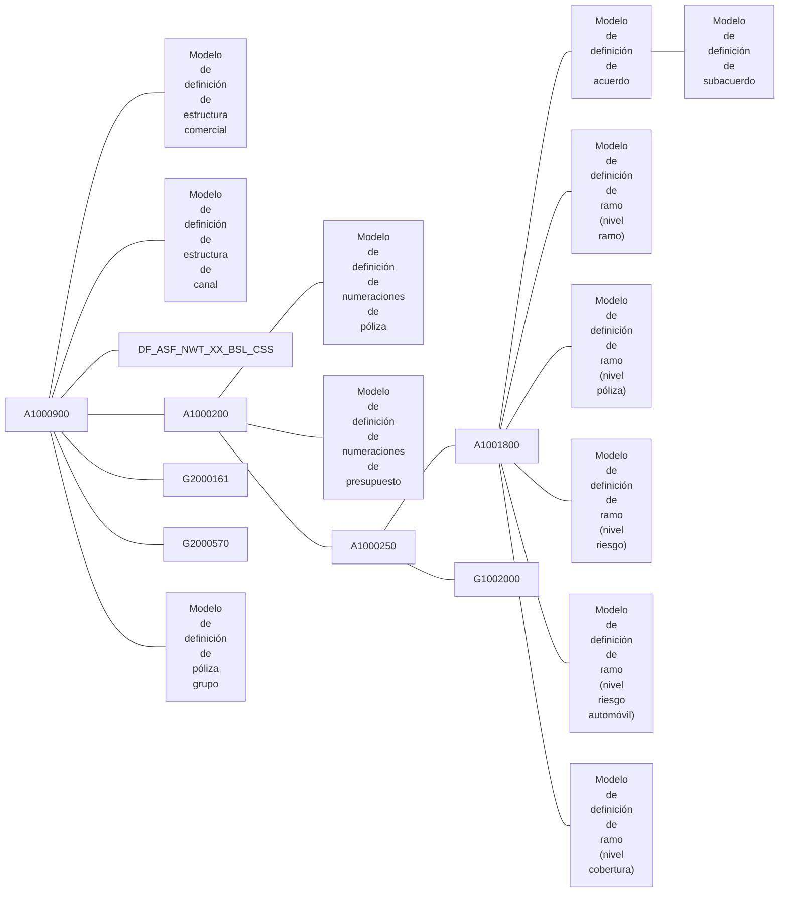

### **ESQUEMA** {#esquema}

1 **[A1000900](#A1000900)** Compañías  
1.1 **[Modelo de definición de estructura comercial](#DEF-DC-ESTRUCTURA-COMERCIAL)**  
1.2 **[Modelo de definición de estructura de canal](#DEF-DC-ESTRUCTURA-CANAL)**  
1.3 **[DF_ASF_NWT_XX_BSL_CSS](#DF_ASF_NWT_XX_BSL_CSS)** Clases de negocio  
1.4 **[A1000200](#A1000200)** Estructura de producto - sectores  
1.4.1 **[Modelo de definición de numeraciones de póliza](#DEF-EM-NUMERACION-POLIZA)**  
1.4.2 **[Modelo de definición de numeraciones de presupuesto](#DEF-EM-NUMERACION-PRESUPUESTO)**  
1.4.3 **[A1000250](#A1000250)** Estructura de producto - subsectores  
1.4.3.1 **[A1001800](#A1001800)** Estructura de producto - ramos  
1.4.3.1.1 **[Modelo de definición de acuerdo](#DEF-EM-CONTRATO)**  
1.4.3.1.1.1 **[Modelo de definición de subacuerdo](#DEF-EM-SUBCONTRATO)**  
1.4.3.1.2 **[Modelo de definición de ramo (nivel ramo)](#DEF-EM-RAMO-RAMO)**  
1.4.3.1.3 **[Modelo de definición de ramo (nivel póliza)](#DEF-EM-RAMO-POLIZA)**  
1.4.3.1.4 **[Modelo de definición de ramo (nivel riesgo)](#DEF-EM-RAMO-RIESGO)**  
1.4.3.1.5 **[Modelo de definición de ramo (nivel riesgo automóvil)](#DEF-EM-RAMO-RIESGO-AUTO)**  
1.4.3.1.6 **[Modelo de definición de ramo (nivel cobertura)](#DEF-EM-RAMO-COBERTURA)**  
1.4.3.2 **[G1002000](#G1002000)** Ramos contables  
1.5 **[G2000161](#G2000161)** Conceptos económicos de recibo  
1.6 **[G2000570](#G2000570)** Parámetros para proceso de anulación de póliza por falta de pago  
1.7 **[Modelo de definición de póliza grupo](#DEF-EM-POLIZA-GRUPO)**  

[ref]: #documentar-a1000200
[ref]: #documentar-a1000250
[ref]: #documentar-a1000900
[ref]: #documentar-a1001800
[ref]: #documentacion-comunes-def-estructura-canal
[ref]: #documentacion-comunes-def-estructura-comercial
[ref]: #documentacion-emision-def-contrato
[ref]: #documentacion-emision-def-numeracion-poliza
[ref]: #documentacion-emision-def-numeracion-presupuesto
[ref]: #documentacion-emision-def-poliza-grupo
[ref]: #documentacion-emision-def-ramo-cobertura
[ref]: #documentacion-emision-def-ramo-poliza
[ref]: #documentacion-emision-def-ramo-ramo
[ref]: #documentacion-emision-def-ramo-riesgo
[ref]: #documentacion-emision-def-ramo-riesgo-auto
[ref]: #documentacion-emision-def-subcontrato
[ref]: #documentar-df-asf-nwt-xx-bsl-css
[ref]: #documentar-g1002000
[ref]: #documentar-g2000161
[ref]: #documentar-g2000570

[//]: # (## **Vínculos**)
[//]: # (## **Preguntas frecuentes**)

---

# ESTRUCTURA del diagrama MODELO DE DEFINICIÓN DE CONTRATO {#documentacion-emision-def-contrato}

{ width="596" height="159" style="display: block; margin: 0 auto" }

==EN CONSTRUCCIÓN==

[//]: # (---)
[//]: # (tags:)
[//]: # (  - negocio)
[//]: # (  - analista)
[//]: # (  - implementador)
[//]: # (  - desarrollador)
[//]: # (---)

## **Objetivo** {#objetivo}
A continuación se muestran las tablas que pertenecen al diagrama indicado en formato [árbol](#arbol) y en [esquema](#esquema).

### **ÁRBOL** {#arbol}

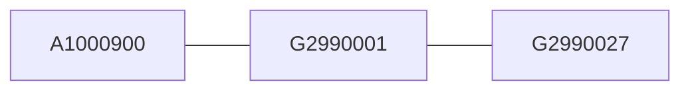

### **ESQUEMA** {#esquema}

1 **[A1000900](#A1000900)** Compañías  
1.1 **[G2990001](#G2990001)** Contratos  
1.1.1 **[G2990027](#G2990027)** Contratos por ramo  

[ref]: #documentar-a1000900
[ref]: #documentar-g2990001
[ref]: #documentar-g2990027

[//]: # (## **Vínculos**)
[//]: # (## **Preguntas frecuentes**)

---

# ESTRUCTURA del diagrama MODELO DE DEFINICIÓN DE NUMERACIONES DE PÓLIZA {#documentacion-emision-def-numeracion-poliza}

{ width="596" height="159" style="display: block; margin: 0 auto" }

==EN CONSTRUCCIÓN==

[//]: # (---)
[//]: # (tags:)
[//]: # (  - negocio)
[//]: # (  - analista)
[//]: # (  - implementador)
[//]: # (  - desarrollador)
[//]: # (---)

## **Objetivo** {#objetivo}
A continuación se muestran las tablas que pertenecen al diagrama indicado en formato [árbol](#arbol) y en [esquema](#esquema).

### **ÁRBOL** {#arbol}

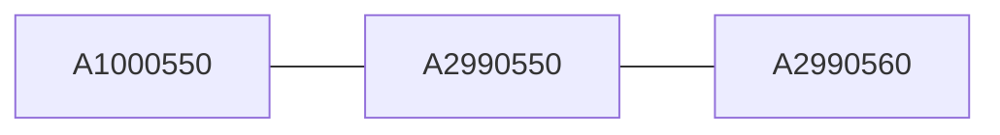

### **ESQUEMA** {#esquema}

1 **[A1000550](#A1000550)** Componentes para formar número de póliza y presupuesto  
1.1 **[A2990550](#A2990550)** Composición del número de póliza  
1.1.1 **[A2990560](#A2990560)** Reservas de números de póliza  

[ref]: #documentar-a1000550
[ref]: #documentar-a2990550
[ref]: #documentar-a2990560

[//]: # (## **Vínculos**)
[//]: # (## **Preguntas frecuentes**)

---

# ESTRUCTURA del diagrama MODELO DE DEFINICIÓN DE NUMERACIONES DE PRESUPUESTO {#documentacion-emision-def-numeracion-presupuesto}

{ width="596" height="159" style="display: block; margin: 0 auto" }

==EN CONSTRUCCIÓN==

[//]: # (---)
[//]: # (tags:)
[//]: # (  - negocio)
[//]: # (  - analista)
[//]: # (  - implementador)
[//]: # (  - desarrollador)
[//]: # (---)

## **Objetivo** {#objetivo}
A continuación se muestran las tablas que pertenecen al diagrama indicado en formato [árbol](#arbol) y en [esquema](#esquema).

### **ÁRBOL** {#arbol}


### **ESQUEMA** {#esquema}

1 **[A1000550](#A1000550)** Componentes para formar número de póliza y presupuesto  
1.1 **[A2990555](#A2990555)** Composición del número de presupuesto  
1.1.1 **[A2990565](#A2990565)** Reservas de números de presupuesto  

[ref]: #documentar-a1000550
[ref]: #documentar-a2990555
[ref]: #documentar-a2990565

[//]: # (## **Vínculos**)
[//]: # (## **Preguntas frecuentes**)

---

# ESTRUCTURA del diagrama MODELO DE DEFINICIÓN DE PÓLIZA GRUPO {#documentacion-emision-def-poliza-grupo}

{ width="596" height="159" style="display: block; margin: 0 auto" }

==EN CONSTRUCCIÓN==

[//]: # (---)
[//]: # (tags:)
[//]: # (  - negocio)
[//]: # (  - analista)
[//]: # (  - implementador)
[//]: # (  - desarrollador)
[//]: # (---)

## **Objetivo** {#objetivo}
A continuación se muestran las tablas que pertenecen al diagrama indicado en formato [árbol](#arbol) y en [esquema](#esquema).

### **ÁRBOL** {#arbol}

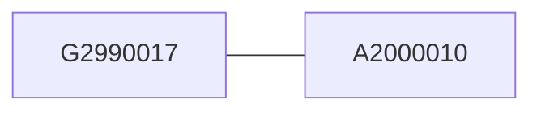

### **ESQUEMA** {#esquema}

1 **[G2990017](#G2990017)** Pólizas grupo  
1.1 **[A2000010](#A2000010)** Acuerdos para póliza grupo  

[ref]: #documentar-a2000010
[ref]: #documentar-g2990017

[//]: # (## **Vínculos**)
[//]: # (## **Preguntas frecuentes**)

---

# ESTRUCTURA del diagrama MODELO DE DEFINICIÓN DE RAMO (NIVEL COBERTURA) {#documentacion-emision-def-ramo-cobertura}

{ width="596" height="159" style="display: block; margin: 0 auto" }

==EN CONSTRUCCIÓN==

[//]: # (---)
[//]: # (tags:)
[//]: # (  - negocio)
[//]: # (  - analista)
[//]: # (  - implementador)
[//]: # (  - desarrollador)
[//]: # (---)

## **Objetivo** {#objetivo}
A continuación se muestran las tablas que pertenecen al diagrama indicado en formato [árbol](#arbol) y en [esquema](#esquema).

### **ÁRBOL** {#arbol}

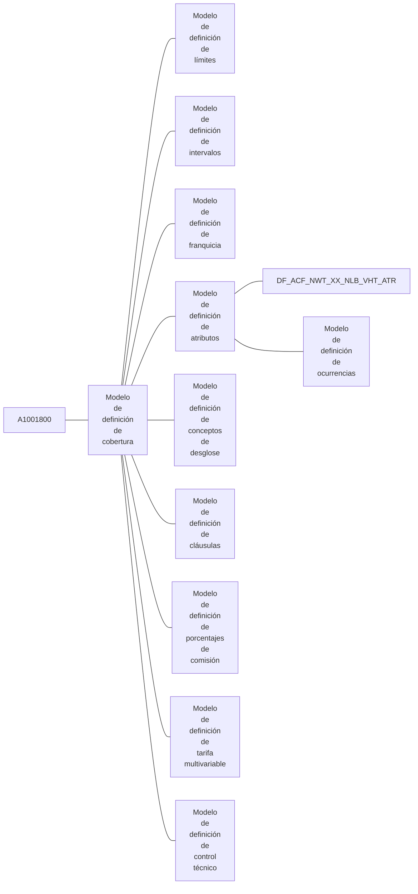

### **ESQUEMA** {#esquema}

1 **[A1001800](#A1001800)** Estructura de producto - ramos  
1.1 **[Modelo de definición de cobertura](#DEF-EM-COBERTURA)**  
1.1.1 **[Modelo de definición de límites](#DEF-EM-LIMITE)**  
1.1.2 **[Modelo de definición de intervalos](#DEF-EM-INTERVALO)**  
1.1.3 **[Modelo de definición de franquicia](#DEF-EM-FRANQUICIA)**  
1.1.4 **[Modelo de definición de atributos](#DEF-EM-ATRIBUTO)**  
1.1.4.1 **[DF_ACF_NWT_XX_NLB_VHT_ATR](#DF_ACF_NWT_XX_NLB_VHT_ATR)** Ramos contables múltiples  
1.1.4.2 **[Modelo de definición de ocurrencias](#DEF-EM-OCURRENCIA)**  
1.1.5 **[Modelo de definición de conceptos de desglose](#DEF-EM-DESGLOSE)**  
1.1.6 **[Modelo de definición de cláusulas](#DEF-EM-CLAUSULA)**  
1.1.7 **[Modelo de definición de porcentajes de comisión](#DEF-DC-COMISION)**  
1.1.8 **[Modelo de definición de tarifa multivariable](#DEF-EM-MULTIVARIABLE)**  
1.1.9 **[Modelo de definición de control técnico](#DEF-DC-CONTROL-TECNICO)**  

[ref]: #documentar-a1001800
[ref]: #documentacion-comunes-def-comision
[ref]: #documentacion-comunes-def-control-tecnico
[ref]: #documentacion-emision-def-atributo
[ref]: #documentacion-emision-def-clausula
[ref]: #documentacion-emision-def-cobertura
[ref]: #documentacion-emision-def-desglose
[ref]: #documentacion-emision-def-franquicia
[ref]: #documentacion-emision-def-intervalo
[ref]: #documentacion-emision-def-limite
[ref]: #documentacion-emision-def-multivariable
[ref]: #documentacion-emision-def-ocurrencia
[ref]: #documentar-df-acf-nwt-xx-nlb-vht-atr

[//]: # (## **Vínculos**)
[//]: # (## **Preguntas frecuentes**)

---

# ESTRUCTURA del diagrama MODELO DE DEFINICIÓN DE ATRIBUTOS {#documentacion-emision-def-atributo}

{ width="596" height="159" style="display: block; margin: 0 auto" }

==EN CONSTRUCCIÓN==

[//]: # (---)
[//]: # (tags:)
[//]: # (  - negocio)
[//]: # (  - analista)
[//]: # (  - implementador)
[//]: # (  - desarrollador)
[//]: # (---)

## **Objetivo** {#objetivo}
A continuación se muestran las tablas que pertenecen al diagrama indicado en formato [árbol](#arbol) y en [esquema](#esquema).

### **ÁRBOL** {#arbol}

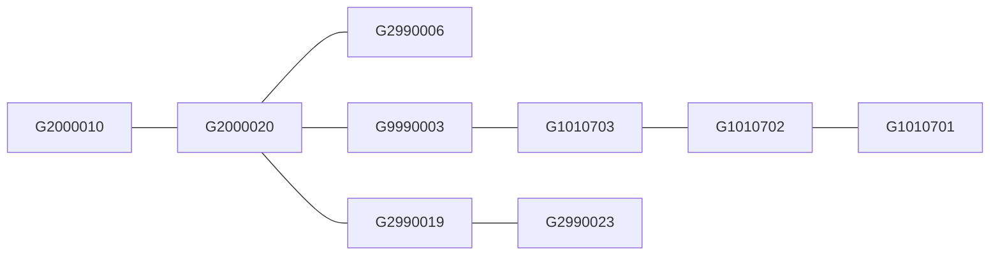

### **ESQUEMA** {#esquema}

1 **[G2000010](#G2000010)** Atributos  
1.1 **[G2000020](#G2000020)** Atributos del ramo  
1.1.1 **[G2990006](#G2990006)** Atributos - valores posibles  
1.1.2 **[G9990003](#G9990003)** Definición de estructuras  
1.1.2.1 **[G1010703](#G1010703)** Atributos - estructuras de atributos  
1.1.2.1.1 **[G1010702](#G1010702)** Atributos - paneles por estructura  
1.1.2.1.1.1 **[G1010701](#G1010701)** Atributos - estructuras de información por paneles  
1.1.3 **[G2990019](#G2990019)** Modificación de atributos del ramo para un contrato  
1.1.3.1 **[G2990023](#G2990023)** Modificación de atributos del ramo para un subcontrato  

[ref]: #documentar-g1010701
[ref]: #documentar-g1010702
[ref]: #documentar-g1010703
[ref]: #documentar-g2000010
[ref]: #documentar-g2000020
[ref]: #documentar-g2990006
[ref]: #documentar-g2990019
[ref]: #documentar-g2990023
[ref]: #documentar-g9990003

[//]: # (## **Vínculos**)
[//]: # (## **Preguntas frecuentes**)

---

# ESTRUCTURA del diagrama MODELO DE DEFINICIÓN DE CLÁUSULAS {#documentacion-emision-def-clausula}

{ width="596" height="159" style="display: block; margin: 0 auto" }

==EN CONSTRUCCIÓN==

[//]: # (---)
[//]: # (tags:)
[//]: # (  - negocio)
[//]: # (  - analista)
[//]: # (  - implementador)
[//]: # (  - desarrollador)
[//]: # (---)

## **Objetivo** {#objetivo}
A continuación se muestran las tablas que pertenecen al diagrama indicado en formato [árbol](#arbol) y en [esquema](#esquema).

### **ÁRBOL** {#arbol}

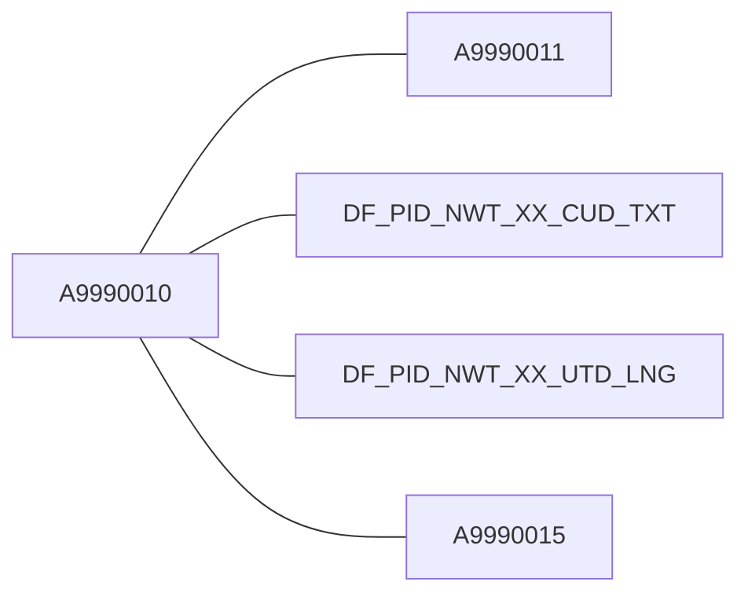

### **ESQUEMA** {#esquema}

1 **[A9990010](#A9990010)** Cláusulas  
1.1 **[A9990011](#A9990011)** Textos de cláusulas  
1.2 **[DF_PID_NWT_XX_CUD_TXT](#DF_PID_NWT_XX_CUD_TXT)** Textos de cláusula (enriquecido)  
1.3 **[DF_PID_NWT_XX_UTD_LNG](#DF_PID_NWT_XX_UTD_LNG)** Textos de cláusulas por idioma (enriquecido)  
1.4 **[A9990015](#A9990015)** Cláusulas del ramo  

[ref]: #documentar-a9990010
[ref]: #documentar-a9990011
[ref]: #documentar-a9990015
[ref]: #documentar-df-pid-nwt-xx-cud-txt
[ref]: #documentar-df-pid-nwt-xx-utd-lng

[//]: # (## **Vínculos**)
[//]: # (## **Preguntas frecuentes**)

---

# ESTRUCTURA del diagrama MODELO DE DEFINICIÓN DE COBERTURA {#documentacion-emision-def-cobertura}

{ width="596" height="159" style="display: block; margin: 0 auto" }

==EN CONSTRUCCIÓN==

[//]: # (---)
[//]: # (tags:)
[//]: # (  - negocio)
[//]: # (  - analista)
[//]: # (  - implementador)
[//]: # (  - desarrollador)
[//]: # (---)

## **Objetivo** {#objetivo}
A continuación se muestran las tablas que pertenecen al diagrama indicado en formato [árbol](#arbol) y en [esquema](#esquema).

### **ÁRBOL** {#arbol}

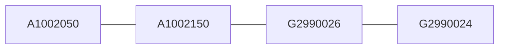

### **ESQUEMA** {#esquema}

1 **[A1002050](#A1002050)** Coberturas  
1.1 **[A1002150](#A1002150)** Coberturas del ramo  
1.1.1 **[G2990026](#G2990026)** Coberturas - modificación para un contrato del ramo  
1.1.1.1 **[G2990024](#G2990024)** Coberturas - modificación para un subcontrato de un contrato del ramo  

[ref]: #documentar-a1002050
[ref]: #documentar-a1002150
[ref]: #documentar-g2990024
[ref]: #documentar-g2990026

[//]: # (## **Vínculos**)
[//]: # (## **Preguntas frecuentes**)

---

# ESTRUCTURA del diagrama MODELO DE DEFINICIÓN DE CONCEPTOS DE DESGLOSE {#documentacion-emision-def-desglose}

{ width="596" height="159" style="display: block; margin: 0 auto" }

==EN CONSTRUCCIÓN==

[//]: # (---)
[//]: # (tags:)
[//]: # (  - negocio)
[//]: # (  - analista)
[//]: # (  - implementador)
[//]: # (  - desarrollador)
[//]: # (---)

## **Objetivo** {#objetivo}
A continuación se muestran las tablas que pertenecen al diagrama indicado en formato [árbol](#arbol) y en [esquema](#esquema).

### **ÁRBOL** {#arbol}

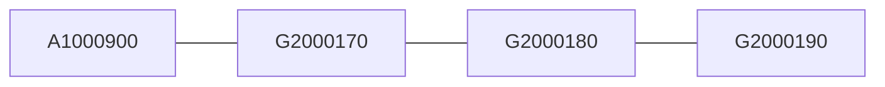

### **ESQUEMA** {#esquema}

1 **[A1000900](#A1000900)** Compañías  
1.1 **[G2000170](#G2000170)** Conceptos de desglose  
1.1.1 **[G2000180](#G2000180)** Conceptos de desglose de la cobertura  
1.1.1.1 **[G2000190](#G2000190)** Modificación a conceptos de desglose de la cobertura  

[ref]: #documentar-a1000900
[ref]: #documentar-g2000170
[ref]: #documentar-g2000180
[ref]: #documentar-g2000190

[//]: # (## **Vínculos**)
[//]: # (## **Preguntas frecuentes**)

---

# ESTRUCTURA del diagrama MODELO DE DEFINICIÓN DE FRANQUICIA {#documentacion-emision-def-franquicia}

{ width="596" height="159" style="display: block; margin: 0 auto" }

==EN CONSTRUCCIÓN==

[//]: # (---)
[//]: # (tags:)
[//]: # (  - negocio)
[//]: # (  - analista)
[//]: # (  - implementador)
[//]: # (  - desarrollador)
[//]: # (---)

## **Objetivo** {#objetivo}
A continuación se muestran las tablas que pertenecen al diagrama indicado en formato [árbol](#arbol) y en [esquema](#esquema).

### **ÁRBOL** {#arbol}

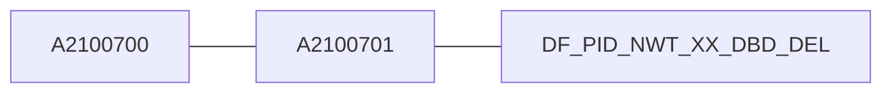

### **ESQUEMA** {#esquema}

1 **[A2100700](#A2100700)** Franquicias  
1.1 **[A2100701](#A2100701)** Franquicias de la cobertura  
1.1.1 **[DF_PID_NWT_XX_DBD_DEL](#DF_PID_NWT_XX_DBD_DEL)** Franquicias - modificación para contrato/subcontrato  

[ref]: #documentar-a2100700
[ref]: #documentar-a2100701
[ref]: #documentar-df-pid-nwt-xx-dbd-del

[//]: # (## **Vínculos**)
[//]: # (## **Preguntas frecuentes**)

---

# ESTRUCTURA del diagrama MODELO DE DEFINICIÓN DE INTERVALOS {#documentacion-emision-def-intervalo}

{ width="596" height="159" style="display: block; margin: 0 auto" }

==EN CONSTRUCCIÓN==

[//]: # (---)
[//]: # (tags:)
[//]: # (  - negocio)
[//]: # (  - analista)
[//]: # (  - implementador)
[//]: # (  - desarrollador)
[//]: # (---)

## **Objetivo** {#objetivo}
A continuación se muestran las tablas que pertenecen al diagrama indicado en formato [árbol](#arbol) y en [esquema](#esquema).

### **ÁRBOL** {#arbol}

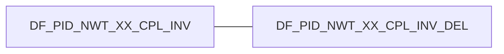

### **ESQUEMA** {#esquema}

1 **[DF_PID_NWT_XX_CPL_INV](#DF_PID_NWT_XX_CPL_INV)** Cobertura - intervalos de suma asegurada  
1.1 **[DF_PID_NWT_XX_CPL_INV_DEL](#DF_PID_NWT_XX_CPL_INV_DEL)** Cobertura - intervalos de suma asegurada de un acuerdo/subacuerdo  

[ref]: #documentar-df-pid-nwt-xx-cpl-inv
[ref]: #documentar-df-pid-nwt-xx-cpl-inv-del

[//]: # (## **Vínculos**)
[//]: # (## **Preguntas frecuentes**)

---

# ESTRUCTURA del diagrama MODELO DE DEFINICIÓN DE LÍMITES {#documentacion-emision-def-limite}

{ width="596" height="159" style="display: block; margin: 0 auto" }

==EN CONSTRUCCIÓN==

[//]: # (---)
[//]: # (tags:)
[//]: # (  - negocio)
[//]: # (  - analista)
[//]: # (  - implementador)
[//]: # (  - desarrollador)
[//]: # (---)

## **Objetivo** {#objetivo}
A continuación se muestran las tablas que pertenecen al diagrama indicado en formato [árbol](#arbol) y en [esquema](#esquema).

### **ÁRBOL** {#arbol}

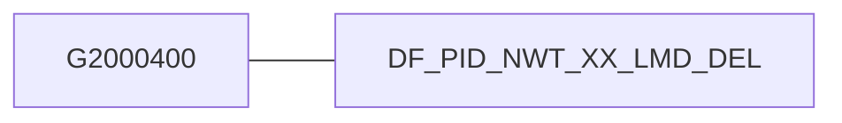

### **ESQUEMA** {#esquema}

1 **[G2000400](#G2000400)** Cobertura - límites de suma asegurada  
1.1 **[DF_PID_NWT_XX_LMD_DEL](#DF_PID_NWT_XX_LMD_DEL)** Cobertura - limites de suma asegurada por acuerdo/subacuerdo  

[ref]: #documentar-df-pid-nwt-xx-lmd-del
[ref]: #documentar-g2000400

[//]: # (## **Vínculos**)
[//]: # (## **Preguntas frecuentes**)

---

# ESTRUCTURA del diagrama MODELO DE DEFINICIÓN DE TARIFA MULTIVARIABLE {#documentacion-emision-def-multivariable}

{ width="596" height="159" style="display: block; margin: 0 auto" }

==EN CONSTRUCCIÓN==

[//]: # (---)
[//]: # (tags:)
[//]: # (  - negocio)
[//]: # (  - analista)
[//]: # (  - implementador)
[//]: # (  - desarrollador)
[//]: # (---)

## **Objetivo** {#objetivo}
A continuación se muestran las tablas que pertenecen al diagrama indicado en formato [árbol](#arbol) y en [esquema](#esquema).

### **ÁRBOL** {#arbol}

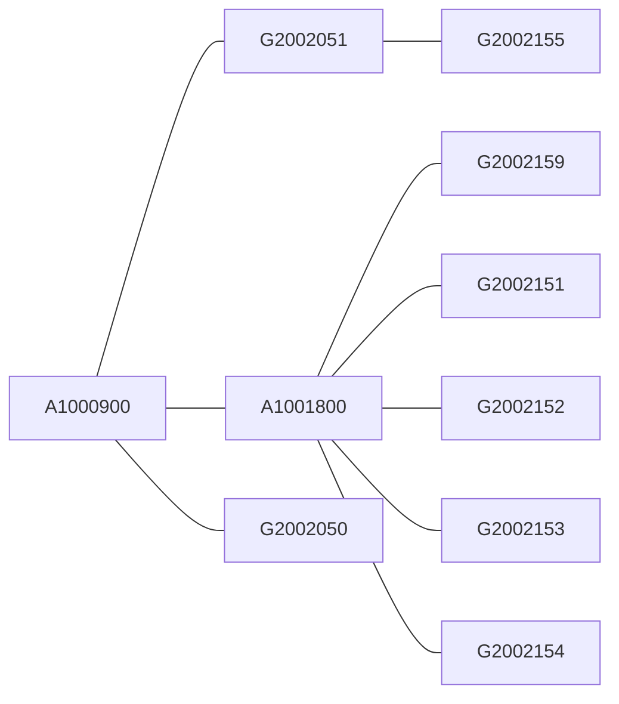

### **ESQUEMA** {#esquema}

1 **[A1000900](#A1000900)** Compañías  
1.1 **[G2002051](#G2002051)** Factores  
1.1.1 **[G2002155](#G2002155)** Factores individuales asociados a factor compuesto  
1.2 **[A1001800](#A1001800)** Estructura de producto - ramos  
1.2.1 **[G2002159](#G2002159)** Tarifa por ramo/cobertura  
1.2.2 **[G2002151](#G2002151)** Factores por ramo  
1.2.3 **[G2002152](#G2002152)** Factores por ramo/cobertura  
1.2.4 **[G2002153](#G2002153)** Tarifa base por código de tarifa  
1.2.5 **[G2002154](#G2002154)** Tarifa por factor  
1.3 **[G2002050](#G2002050)** Tarifas  

[ref]: #documentar-a1000900
[ref]: #documentar-a1001800
[ref]: #documentar-g2002050
[ref]: #documentar-g2002051
[ref]: #documentar-g2002151
[ref]: #documentar-g2002152
[ref]: #documentar-g2002153
[ref]: #documentar-g2002154
[ref]: #documentar-g2002155
[ref]: #documentar-g2002159

[//]: # (## **Vínculos**)
[//]: # (## **Preguntas frecuentes**)

---

# ESTRUCTURA del diagrama MODELO DE DEFINICIÓN DE OCURRENCIAS {#documentacion-emision-def-ocurrencia}

{ width="596" height="159" style="display: block; margin: 0 auto" }

==EN CONSTRUCCIÓN==

[//]: # (---)
[//]: # (tags:)
[//]: # (  - negocio)
[//]: # (  - analista)
[//]: # (  - implementador)
[//]: # (  - desarrollador)
[//]: # (---)

## **Objetivo** {#objetivo}
A continuación se muestran las tablas que pertenecen al diagrama indicado en formato [árbol](#arbol) y en [esquema](#esquema).

### **ÁRBOL** {#arbol}

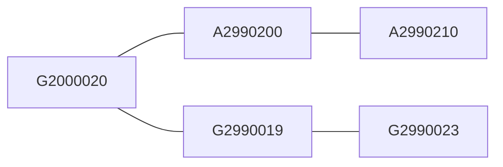

### **ESQUEMA** {#esquema}

1 **[G2000020](#G2000020)** Atributos del ramo  
1.1 **[A2990200](#A2990200)** Ocurrencias  
1.1.1 **[A2990210](#A2990210)** Atributos asociados a ocurrencias  
1.2 **[G2990019](#G2990019)** Modificación de atributos del ramo para un contrato  
1.2.1 **[G2990023](#G2990023)** Modificación de atributos del ramo para un subcontrato  

[ref]: #documentar-a2990200
[ref]: #documentar-a2990210
[ref]: #documentar-g2000020
[ref]: #documentar-g2990019
[ref]: #documentar-g2990023

[//]: # (## **Vínculos**)
[//]: # (## **Preguntas frecuentes**)

---

# ESTRUCTURA del diagrama MODELO DE DEFINICIÓN DE RAMO (NIVEL PÓLIZA) {#documentacion-emision-def-ramo-poliza}

{ width="596" height="159" style="display: block; margin: 0 auto" }

==EN CONSTRUCCIÓN==

[//]: # (---)
[//]: # (tags:)
[//]: # (  - negocio)
[//]: # (  - analista)
[//]: # (  - implementador)
[//]: # (  - desarrollador)
[//]: # (---)

## **Objetivo** {#objetivo}
A continuación se muestran las tablas que pertenecen al diagrama indicado en formato [árbol](#arbol) y en [esquema](#esquema).

### **ÁRBOL** {#arbol}

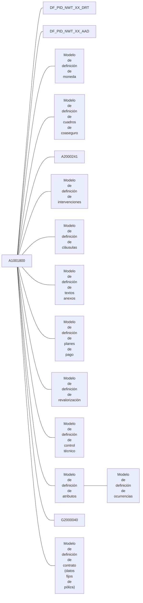

### **ESQUEMA** {#esquema}

1 **[A1001800](#A1001800)** Estructura de producto - ramos  
1.1 **[DF_PID_NWT_XX_DRT](#DF_PID_NWT_XX_DRT)** Duración mínima y máxima de una póliza  
1.2 **[DF_PID_NWT_XX_AAD](#DF_PID_NWT_XX_AAD)** Días de adelanto y atraso movimientos de póliza  
1.3 **[Modelo de definición de moneda](#DEF-DC-MONEDA)**  
1.4 **[Modelo de definición de cuadros de coaseguro](#DEF-EM-CUADRO-COASEGURO)**  
1.5 **[A2000241](#A2000241)** Porcentajes de prima para pólizas temporales  
1.6 **[Modelo de definición de intervenciones](#DEF-EM-INTERVENCION)**  
1.7 **[Modelo de definición de cláusulas](#DEF-EM-CLAUSULA)**  
1.8 **[Modelo de definición de textos anexos](#DEF-EM-TEXTO-ANEXO)**  
1.9 **[Modelo de definición de planes de pago](#DEF-EM-PLAN-PAGO)**  
1.10 **[Modelo de definición de revalorización](#DEF-EM-REVALORIZACION)**  
1.11 **[Modelo de definición de control técnico](#DEF-DC-CONTROL-TECNICO)**  
1.12 **[Modelo de definición de atributos](#DEF-EM-ATRIBUTO)**  
1.12.1 **[Modelo de definición de ocurrencias](#DEF-EM-OCURRENCIA)**  
1.13 **[G2000040](#G2000040)** Campos modificables en una aplicación de la póliza marco  
1.14 **[Modelo de definición de contrato (datos fijos de póliza)](#DEF-EM-CONTRATO-POLIZA-DATOS-FIJOS)**  

[ref]: #documentar-a1001800
[ref]: #documentar-a2000241
[ref]: #documentacion-comunes-def-control-tecnico
[ref]: #documentacion-comunes-def-moneda
[ref]: #documentacion-emision-def-atributo
[ref]: #documentacion-emision-def-clausula
[ref]: #documentacion-emision-def-contrato-poliza-datos-fijos
[ref]: #documentacion-emision-def-cuadro-coaseguro
[ref]: #documentacion-emision-def-intervencion
[ref]: #documentacion-emision-def-ocurrencia
[ref]: #documentacion-emision-def-plan-pago
[ref]: #documentacion-emision-def-revalorizacion
[ref]: #documentacion-emision-def-texto-anexo
[ref]: #documentar-df-pid-nwt-xx-aad
[ref]: #documentar-df-pid-nwt-xx-drt
[ref]: #documentar-g2000040

[//]: # (## **Vínculos**)
[//]: # (## **Preguntas frecuentes**)

---

# ESTRUCTURA del diagrama MODELO DE DEFINICIÓN DE CONTRATO (DATOS FIJOS DE PÓLIZA) {#documentacion-emision-def-contrato-poliza-datos-fijos}

{ width="596" height="159" style="display: block; margin: 0 auto" }

==EN CONSTRUCCIÓN==

[//]: # (---)
[//]: # (tags:)
[//]: # (  - negocio)
[//]: # (  - analista)
[//]: # (  - implementador)
[//]: # (  - desarrollador)
[//]: # (---)

## **Objetivo** {#objetivo}
A continuación se muestran las tablas que pertenecen al diagrama indicado en formato [árbol](#arbol) y en [esquema](#esquema).

### **ÁRBOL** {#arbol}

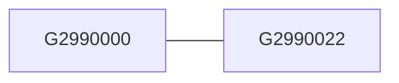

### **ESQUEMA** {#esquema}

1 **[G2990000](#G2990000)** Modificación de datos fijos para un acuerdo  
1.1 **[G2990022](#G2990022)** Modificación de datos fijos para un subacuerdo  

[ref]: #documentar-g2990000
[ref]: #documentar-g2990022

[//]: # (## **Vínculos**)
[//]: # (## **Preguntas frecuentes**)

---

# ESTRUCTURA del diagrama MODELO DE DEFINICIÓN DE CUADROS DE COASEGURO {#documentacion-emision-def-cuadro-coaseguro}

{ width="596" height="159" style="display: block; margin: 0 auto" }

==EN CONSTRUCCIÓN==

[//]: # (---)
[//]: # (tags:)
[//]: # (  - negocio)
[//]: # (  - analista)
[//]: # (  - implementador)
[//]: # (  - desarrollador)
[//]: # (---)

## **Objetivo** {#objetivo}
A continuación se muestran las tablas que pertenecen al diagrama indicado en formato [árbol](#arbol) y en [esquema](#esquema).

### **ÁRBOL** {#arbol}

```mermaid
graph LR
  G2000101_1_1["G2000101"]
  G2000102_2_1["G2000102"]
  G2000101_1_1 --- G2000102_2_1;
```

### **ESQUEMA** {#esquema}

1 **[G2000101](#G2000101)** Cuadros de coaseguro  
1.1 **[G2000102](#G2000102)** Compañías coaseguradoras de un cuadro de coaseguro  

[ref]: #documentar-g2000101
[ref]: #documentar-g2000102

[//]: # (## **Vínculos**)
[//]: # (## **Preguntas frecuentes**)

---

# ESTRUCTURA del diagrama MODELO DE DEFINICIÓN DE INTERVENCIONES {#documentacion-emision-def-intervencion}

{ width="596" height="159" style="display: block; margin: 0 auto" }

==EN CONSTRUCCIÓN==

[//]: # (---)
[//]: # (tags:)
[//]: # (  - negocio)
[//]: # (  - analista)
[//]: # (  - implementador)
[//]: # (  - desarrollador)
[//]: # (---)

## **Objetivo** {#objetivo}
A continuación se muestran las tablas que pertenecen al diagrama indicado en formato [árbol](#arbol) y en [esquema](#esquema).

### **ÁRBOL** {#arbol}

```mermaid
graph LR
  G2001801_1_1["G2001801"]
  A1001801_2_1["A1001801"]
  A2990060_3_1["A2990060"]
  DF_PID_NWT_XX_ITD_MDF_3_1["DF_PID_NWT_XX_ITD_MDF"]
  DF_PID_NWT_XX_ITD_VLD_4_1["DF_PID_NWT_XX_ITD_VLD"]
  G2001801_1_1 --- A1001801_2_1;
  A1001801_2_1 --- A2990060_3_1;
  A1001801_2_1 --- DF_PID_NWT_XX_ITD_MDF_3_1;
  DF_PID_NWT_XX_ITD_MDF_3_1 --- DF_PID_NWT_XX_ITD_VLD_4_1;
```

### **ESQUEMA** {#esquema}

1 **[G2001801](#G2001801)** Intervenciones por compañía  
1.1 **[A1001801](#A1001801)** Intervenciones ramo  
1.1.1 **[A2990060](#A2990060)** Columnas obligatorias de terceros por intervención  
1.1.2 **[DF_PID_NWT_XX_ITD_MDF](#DF_PID_NWT_XX_ITD_MDF)** Intervenciones modificables por acuerdo/subacuerdo  
1.1.2.1 **[DF_PID_NWT_XX_ITD_VLD](#DF_PID_NWT_XX_ITD_VLD)** Terceros permitidos por intervención para un acuerdo/subacuerdo  

[ref]: #documentar-a1001801
[ref]: #documentar-a2990060
[ref]: #documentar-df-pid-nwt-xx-itd-mdf
[ref]: #documentar-df-pid-nwt-xx-itd-vld
[ref]: #documentar-g2001801

[//]: # (## **Vínculos**)
[//]: # (## **Preguntas frecuentes**)

---

# ESTRUCTURA del diagrama MODELO DE DEFINICIÓN DE PLANES DE PAGO {#documentacion-emision-def-plan-pago}

{ width="596" height="159" style="display: block; margin: 0 auto" }

==EN CONSTRUCCIÓN==

[//]: # (---)
[//]: # (tags:)
[//]: # (  - negocio)
[//]: # (  - analista)
[//]: # (  - implementador)
[//]: # (  - desarrollador)
[//]: # (---)

## **Objetivo** {#objetivo}
A continuación se muestran las tablas que pertenecen al diagrama indicado en formato [árbol](#arbol) y en [esquema](#esquema).

### **ÁRBOL** {#arbol}

```mermaid
graph LR
  A1001402_1_1["A1001402"]
  A1001410_2_1["A1001410"]
  A1001420_3_1["A1001420"]
  A1001460_4_1["A1001460"]
  A1001450_4_1["A1001450"]
  A1001430_3_1["A1001430"]
  A1001403_3_1["A1001403"]
  A1001404_3_1["A1001404"]
  DF_PSF_NWT_XX_PSF_PMS_SBL_3_1["DF_PSF_NWT_XX_PSF_PMS_SBL"]
  A1001402_1_1 --- A1001410_2_1;
  A1001410_2_1 --- A1001420_3_1;
  A1001420_3_1 --- A1001460_4_1;
  A1001420_3_1 --- A1001450_4_1;
  A1001410_2_1 --- A1001430_3_1;
  A1001410_2_1 --- A1001403_3_1;
  A1001410_2_1 --- A1001404_3_1;
  A1001410_2_1 --- DF_PSF_NWT_XX_PSF_PMS_SBL_3_1;
```

### **ESQUEMA** {#esquema}

1 **[A1001402](#A1001402)** Planes de pago/formas de pago  
1.1 **[A1001410](#A1001410)** Planes de pago  
1.1.1 **[A1001420](#A1001420)** Cuotas de un plan de pago  
1.1.1.1 **[A1001460](#A1001460)** Distribución de comisiones por cuotas/intervención  
1.1.1.2 **[A1001450](#A1001450)** Forma de distribución del exceso de comisión por cuota/intervención  
1.1.2 **[A1001430](#A1001430)** Unificación en los días de efecto para planes de pago  
1.1.3 **[A1001403](#A1001403)** Planes de pago del ramo  
1.1.4 **[A1001404](#A1001404)** Planes de pago de un tercero  
1.1.5 **[DF_PSF_NWT_XX_PSF_PMS_SBL](#DF_PSF_NWT_XX_PSF_PMS_SBL)** Planes de pago por acuerdo/subacuerdo  

[ref]: #documentar-a1001402
[ref]: #documentar-a1001403
[ref]: #documentar-a1001404
[ref]: #documentar-a1001410
[ref]: #documentar-a1001420
[ref]: #documentar-a1001430
[ref]: #documentar-a1001450
[ref]: #documentar-a1001460
[ref]: #documentar-df-psf-nwt-xx-psf-pms-sbl

[//]: # (## **Vínculos**)
[//]: # (## **Preguntas frecuentes**)

---

# ESTRUCTURA del diagrama MODELO DE DEFINICIÓN DE REVALORIZACIÓN {#documentacion-emision-def-revalorizacion}

{ width="596" height="159" style="display: block; margin: 0 auto" }

==EN CONSTRUCCIÓN==

[//]: # (---)
[//]: # (tags:)
[//]: # (  - negocio)
[//]: # (  - analista)
[//]: # (  - implementador)
[//]: # (  - desarrollador)
[//]: # (---)

## **Objetivo** {#objetivo}
A continuación se muestran las tablas que pertenecen al diagrama indicado en formato [árbol](#arbol) y en [esquema](#esquema).

### **ÁRBOL** {#arbol}

```mermaid
graph LR
  G1002400_1_1["G1002400"]
  G1002300_2_1["G1002300"]
  G2100010_2_1["G2100010"]
  G1002400_1_1 --- G1002300_2_1;
  G1002400_1_1 --- G2100010_2_1;
```

### **ESQUEMA** {#esquema}

1 **[G1002400](#G1002400)** Índices de revalorización  
1.1 **[G1002300](#G1002300)** Valores de los índices de revalorización  
1.2 **[G2100010](#G2100010)** Revalorización/depreciación de vehículos/accesorios por ramo  

[ref]: #documentar-g1002300
[ref]: #documentar-g1002400
[ref]: #documentar-g2100010

[//]: # (## **Vínculos**)
[//]: # (## **Preguntas frecuentes**)

---

# ESTRUCTURA del diagrama MODELO DE DEFINICIÓN DE TEXTOS ANEXOS {#documentacion-emision-def-texto-anexo}

{ width="596" height="159" style="display: block; margin: 0 auto" }

==EN CONSTRUCCIÓN==

[//]: # (---)
[//]: # (tags:)
[//]: # (  - negocio)
[//]: # (  - analista)
[//]: # (  - implementador)
[//]: # (  - desarrollador)
[//]: # (---)

## **Objetivo** {#objetivo}
A continuación se muestran las tablas que pertenecen al diagrama indicado en formato [árbol](#arbol) y en [esquema](#esquema).

### **ÁRBOL** {#arbol}

```mermaid
graph LR
  A9990040_1_1["A9990040"]
  A9990041_2_1["A9990041"]
  DF_PID_NWT_XX_AXD_TXT_2_1["DF_PID_NWT_XX_AXD_TXT"]
  A9990040_1_1 --- A9990041_2_1;
  A9990040_1_1 --- DF_PID_NWT_XX_AXD_TXT_2_1;
```

### **ESQUEMA** {#esquema}

1 **[A9990040](#A9990040)** Textos anexos  
1.1 **[A9990041](#A9990041)** Texto de los textos anexos  
1.2 **[DF_PID_NWT_XX_AXD_TXT](#DF_PID_NWT_XX_AXD_TXT)** Texto de los textos anexos (enriquecido)  

[ref]: #documentar-a9990040
[ref]: #documentar-a9990041
[ref]: #documentar-df-pid-nwt-xx-axd-txt

[//]: # (## **Vínculos**)
[//]: # (## **Preguntas frecuentes**)

---

# ESTRUCTURA del diagrama MODELO DE DEFINICIÓN DE RAMO (NIVEL RAMO) {#documentacion-emision-def-ramo-ramo}

{ width="596" height="159" style="display: block; margin: 0 auto" }

==EN CONSTRUCCIÓN==

[//]: # (---)
[//]: # (tags:)
[//]: # (  - negocio)
[//]: # (  - analista)
[//]: # (  - implementador)
[//]: # (  - desarrollador)
[//]: # (---)

## **Objetivo** {#objetivo}
A continuación se muestran las tablas que pertenecen al diagrama indicado en formato [árbol](#arbol) y en [esquema](#esquema).

### **ÁRBOL** {#arbol}

```mermaid
graph LR
  A1001800_1_1["A1001800"]
  EM-DEF-SUPLEMENTO_2_1["Modelo<br>de<br>definición<br>de<br>suplemento"]
  G2990002_2_1["G2990002"]
  DF_RCD_NWT_XX_EXD_DEL_SBL_2_1["DF_RCD_NWT_XX_EXD_DEL_SBL"]
  EM-DEF-COTIZACION_2_1["Modelo<br>de<br>definición<br>de<br>cotización"]
  EM-DEF-CONTEXTO_2_1["Modelo<br>de<br>definición<br>de<br>contexto"]
  DC-DEF-DOCUMENTO-ENTRADA-SALIDA_2_1["Modelo<br>de<br>definición<br>de<br>documentos<br>de<br>entrada/salida"]
  DF_TRN_NWT_XX_NTF_IOM_3_1["DF_TRN_NWT_XX_NTF_IOM"]
  EM-DEF-INSPECCION_2_1["Modelo<br>de<br>definición<br>de<br>inspecciones"]
  A1001800_1_1 --- EM-DEF-SUPLEMENTO_2_1;
  A1001800_1_1 --- G2990002_2_1;
  A1001800_1_1 --- DF_RCD_NWT_XX_EXD_DEL_SBL_2_1;
  A1001800_1_1 --- EM-DEF-COTIZACION_2_1;
  A1001800_1_1 --- EM-DEF-CONTEXTO_2_1;
  A1001800_1_1 --- DC-DEF-DOCUMENTO-ENTRADA-SALIDA_2_1;
  DC-DEF-DOCUMENTO-ENTRADA-SALIDA_2_1 --- DF_TRN_NWT_XX_NTF_IOM_3_1;
  A1001800_1_1 --- EM-DEF-INSPECCION_2_1;
```

### **ESQUEMA** {#esquema}

1 **[A1001800](#A1001800)** Estructura de producto - ramos  
1.1 **[Modelo de definición de suplemento](#EM-DEF-SUPLEMENTO)**  
1.2 **[G2990002](#G2990002)** Pólizas cliente  
1.3 **[DF_RCD_NWT_XX_EXD_DEL_SBL](#DF_RCD_NWT_XX_EXD_DEL_SBL)** Días de gracia de los recibos por ramo, contrato y subcontrato  
1.4 **[Modelo de definición de cotización](#EM-DEF-COTIZACION)**  
1.5 **[Modelo de definición de contexto](#EM-DEF-CONTEXTO)**  
1.6 **[Modelo de definición de documentos de entrada/salida](#DC-DEF-DOCUMENTO-ENTRADA-SALIDA)**  
1.6.1 **[DF_TRN_NWT_XX_NTF_IOM](#DF_TRN_NWT_XX_NTF_IOM)** Documentos por ramo y operación  
1.7 **[Modelo de definición de inspecciones](#EM-DEF-INSPECCION)**  

[ref]: #documentar-a1001800
[ref]: #documentacion-comunes-def-documento-entrada-salida
[ref]: #documentar-df-rcd-nwt-xx-exd-del-sbl
[ref]: #documentar-df-trn-nwt-xx-ntf-iom
[ref]: #documentacion-emision-def-contexto
[ref]: #documentacion-emision-def-cotizacion
[ref]: #documentacion-emision-def-inspeccion
[ref]: #documentacion-emision-def-suplemento
[ref]: #documentar-g2990002

[//]: # (## **Vínculos**)
[//]: # (## **Preguntas frecuentes**)

---

# ESTRUCTURA del diagrama MODELO DE DEFINICIÓN DE CONTEXTO {#documentacion-emision-def-contexto}

{ width="596" height="159" style="display: block; margin: 0 auto" }

==EN CONSTRUCCIÓN==

[//]: # (---)
[//]: # (tags:)
[//]: # (  - negocio)
[//]: # (  - analista)
[//]: # (  - implementador)
[//]: # (  - desarrollador)
[//]: # (---)

## **Objetivo** {#objetivo}
A continuación se muestran las tablas que pertenecen al diagrama indicado en formato [árbol](#arbol) y en [esquema](#esquema).

### **ÁRBOL** {#arbol}

```mermaid
graph LR
  DF_ARD_NWT_XX_ARD_CNX_1_1["DF_ARD_NWT_XX_ARD_CNX"]
  DF_PLY_NWT_XX_ATC_CNX_2_1["DF_PLY_NWT_XX_ATC_CNX"]
  DF_ARD_NWT_XX_ARD_CNX_1_1 --- DF_PLY_NWT_XX_ATC_CNX_2_1;
```

### **ESQUEMA** {#esquema}

1 **[DF_ARD_NWT_XX_ARD_CNX](#DF_ARD_NWT_XX_ARD_CNX)** Contexto  
1.1 **[DF_PLY_NWT_XX_ATC_CNX](#DF_PLY_NWT_XX_ATC_CNX)** Atributos que no serán visibles por contexto  

[ref]: #documentar-df-ard-nwt-xx-ard-cnx
[ref]: #documentar-df-ply-nwt-xx-atc-cnx

[//]: # (## **Vínculos**)
[//]: # (## **Preguntas frecuentes**)

---

# ESTRUCTURA del diagrama MODELO DE DEFINICIÓN DE COTIZACIÓN {#documentacion-emision-def-cotizacion}

{ width="596" height="159" style="display: block; margin: 0 auto" }

==EN CONSTRUCCIÓN==

[//]: # (---)
[//]: # (tags:)
[//]: # (  - negocio)
[//]: # (  - analista)
[//]: # (  - implementador)
[//]: # (  - desarrollador)
[//]: # (---)

## **Objetivo** {#objetivo}
A continuación se muestran las tablas que pertenecen al diagrama indicado en formato [árbol](#arbol) y en [esquema](#esquema).

### **ÁRBOL** {#arbol}

```mermaid
graph LR
  G2000000_1_1["G2000000"]
  C2000500_2_1["C2000500"]
  C2000030_2_1["C2000030"]
  C2000032_2_1["C2000032"]
  C2000020_2_1["C2000020"]
  C2000040_2_1["C2000040"]
  C2990800_2_1["C2990800"]
  C2100170_2_1["C2100170"]
  G2000000_1_1 --- C2000500_2_1;
  G2000000_1_1 --- C2000030_2_1;
  G2000000_1_1 --- C2000032_2_1;
  G2000000_1_1 --- C2000020_2_1;
  G2000000_1_1 --- C2000040_2_1;
  G2000000_1_1 --- C2990800_2_1;
  G2000000_1_1 --- C2100170_2_1;
```

### **ESQUEMA** {#esquema}

1 **[G2000000](#G2000000)** Cotización - descripción de simulaciones  
1.1 **[C2000500](#C2000500)** Cotización - valores generales  
1.2 **[C2000030](#C2000030)** Cotización - valores de datos fijos  
1.3 **[C2000032](#C2000032)** Cotización - planes de pago  
1.4 **[C2000020](#C2000020)** Cotización - valores de atributos  
1.5 **[C2000040](#C2000040)** Cotización - valores de coberturas  
1.6 **[C2990800](#C2990800)** Cotización - valores de agravantes  
1.7 **[C2100170](#C2100170)** Cotización - valores de conceptos de desglose  

[ref]: #documentar-c2000020
[ref]: #documentar-c2000030
[ref]: #documentar-c2000032
[ref]: #documentar-c2000040
[ref]: #documentar-c2000500
[ref]: #documentar-c2100170
[ref]: #documentar-c2990800
[ref]: #documentar-g2000000

[//]: # (## **Vínculos**)
[//]: # (## **Preguntas frecuentes**)

---

# ESTRUCTURA del diagrama MODELO DE DEFINICIÓN DE INSPECCIONES {#documentacion-emision-def-inspeccion}

{ width="596" height="159" style="display: block; margin: 0 auto" }

==EN CONSTRUCCIÓN==

[//]: # (---)
[//]: # (tags:)
[//]: # (  - negocio)
[//]: # (  - analista)
[//]: # (  - implementador)
[//]: # (  - desarrollador)
[//]: # (---)

## **Objetivo** {#objetivo}
A continuación se muestran las tablas que pertenecen al diagrama indicado en formato [árbol](#arbol) y en [esquema](#esquema).

### **ÁRBOL** {#arbol}

```mermaid
graph LR
  A1000900_1_1["A1000900"]
  G2000860_2_1["G2000860"]
  G2000870_2_1["G2000870"]
  A1000900_1_1 --- G2000860_2_1;
  A1000900_1_1 --- G2000870_2_1;
```

### **ESQUEMA** {#esquema}

1 **[A1000900](#A1000900)** Compañías  
1.1 **[G2000860](#G2000860)** Situaciones en inspecciones de riesgo  
1.2 **[G2000870](#G2000870)** Parámetros de inspecciones de riesgo  

[ref]: #documentar-a1000900
[ref]: #documentar-g2000860
[ref]: #documentar-g2000870

[//]: # (## **Vínculos**)
[//]: # (## **Preguntas frecuentes**)

---

# ESTRUCTURA del diagrama MODELO DE DEFINICIÓN DE SUPLEMENTO {#documentacion-emision-def-suplemento}

{ width="596" height="159" style="display: block; margin: 0 auto" }

==EN CONSTRUCCIÓN==

[//]: # (---)
[//]: # (tags:)
[//]: # (  - negocio)
[//]: # (  - analista)
[//]: # (  - implementador)
[//]: # (  - desarrollador)
[//]: # (---)

## **Objetivo** {#objetivo}
A continuación se muestran las tablas que pertenecen al diagrama indicado en formato [árbol](#arbol) y en [esquema](#esquema).

### **ÁRBOL** {#arbol}

```mermaid
graph LR
  A2991800_1_1["A2991800"]
  G2000275_2_1["G2000275"]
  G2990011_2_1["G2990011"]
  A2991801_2_1["A2991801"]
  A2000400_2_1["A2000400"]
  G2990300_3_1["G2990300"]
  G2992700_2_1["G2992700"]
  A2300010_2_1["A2300010"]
  A2991800_1_1 --- G2000275_2_1;
  A2991800_1_1 --- G2990011_2_1;
  A2991800_1_1 --- A2991801_2_1;
  A2991800_1_1 --- A2000400_2_1;
  A2000400_2_1 --- G2990300_3_1;
  A2991800_1_1 --- G2992700_2_1;
  A2991800_1_1 --- A2300010_2_1;
```

### **ESQUEMA** {#esquema}

1 **[A2991800](#A2991800)** Suplementos  
1.1 **[G2000275](#G2000275)** Columnas modificables por suplemento  
1.2 **[G2990011](#G2990011)** Menú de opciones por suplemento  
1.3 **[A2991801](#A2991801)** Exclusión de suplementos por ramo  
1.4 **[A2000400](#A2000400)** Causas de suplemento de la póliza  
1.4.1 **[G2990300](#G2990300)** Motivos de suplemento  
1.5 **[G2992700](#G2992700)** Movimientos de emisión no permitidos por usuario  
1.6 **[A2300010](#A2300010)** Intereses de vida  

[ref]: #documentar-a2000400
[ref]: #documentar-a2300010
[ref]: #documentar-a2991800
[ref]: #documentar-a2991801
[ref]: #documentar-g2000275
[ref]: #documentar-g2990011
[ref]: #documentar-g2990300
[ref]: #documentar-g2992700

[//]: # (## **Vínculos**)
[//]: # (## **Preguntas frecuentes**)

---

# ESTRUCTURA del diagrama MODELO DE DEFINICIÓN DE RAMO (NIVEL RIESGO) {#documentacion-emision-def-ramo-riesgo}

{ width="596" height="159" style="display: block; margin: 0 auto" }

==EN CONSTRUCCIÓN==

[//]: # (---)
[//]: # (tags:)
[//]: # (  - negocio)
[//]: # (  - analista)
[//]: # (  - implementador)
[//]: # (  - desarrollador)
[//]: # (---)

## **Objetivo** {#objetivo}
A continuación se muestran las tablas que pertenecen al diagrama indicado en formato [árbol](#arbol) y en [esquema](#esquema).

### **ÁRBOL** {#arbol}

```mermaid
graph LR
  A1001800_1_1["A1001800"]
  DEF-EM-INTERVENCION_2_1["Modelo<br>de<br>definición<br>de<br>intervenciones"]
  DEF-DC-CONTROL-TECNICO_3_1["Modelo<br>de<br>definición<br>de<br>control<br>técnico"]
  DEF-EM-ATRIBUTO_2_1["Modelo<br>de<br>definición<br>de<br>atributos"]
  DEF-EM-OCURRENCIA_3_1["Modelo<br>de<br>definición<br>de<br>ocurrencias"]
  DEF-EM-MODALIDAD_3_1["Modelo<br>de<br>definición<br>de<br>modalidad"]
  DEF-DC-CONTROL-TECNICO_3_2["Modelo<br>de<br>definición<br>de<br>control<br>técnico"]
  DEF-EM-CLAUSULA_2_1["Modelo<br>de<br>definición<br>de<br>cláusulas"]
  DEF-EM-TEXTO-ANEXO_2_1["Modelo<br>de<br>definición<br>de<br>textos<br>anexos"]
  G2000850_2_1["G2000850"]
  DEF-DC-PLATEA_2_1["Modelo<br>de<br>definición<br>de<br>platea"]
  DEF-EM-PLATEA_3_1["Modelo<br>de<br>definición<br>de<br>platea<br>(emisión)"]
  DEF-EM-MARCA_2_1["Modelo<br>de<br>definición<br>de<br>marca"]
  A1001800_1_1 --- DEF-EM-INTERVENCION_2_1;
  DEF-EM-INTERVENCION_2_1 --- DEF-DC-CONTROL-TECNICO_3_1;
  A1001800_1_1 --- DEF-EM-ATRIBUTO_2_1;
  DEF-EM-ATRIBUTO_2_1 --- DEF-EM-OCURRENCIA_3_1;
  DEF-EM-ATRIBUTO_2_1 --- DEF-EM-MODALIDAD_3_1;
  DEF-EM-ATRIBUTO_2_1 --- DEF-DC-CONTROL-TECNICO_3_2;
  A1001800_1_1 --- DEF-EM-CLAUSULA_2_1;
  A1001800_1_1 --- DEF-EM-TEXTO-ANEXO_2_1;
  A1001800_1_1 --- G2000850_2_1;
  A1001800_1_1 --- DEF-DC-PLATEA_2_1;
  DEF-DC-PLATEA_2_1 --- DEF-EM-PLATEA_3_1;
  A1001800_1_1 --- DEF-EM-MARCA_2_1;
```

### **ESQUEMA** {#esquema}

1 **[A1001800](#A1001800)** Estructura de producto - ramos  
1.1 **[Modelo de definición de intervenciones](#DEF-EM-INTERVENCION)**  
1.1.1 **[Modelo de definición de control técnico](#DEF-DC-CONTROL-TECNICO)**  
1.2 **[Modelo de definición de atributos](#DEF-EM-ATRIBUTO)**  
1.2.1 **[Modelo de definición de ocurrencias](#DEF-EM-OCURRENCIA)**  
1.2.2 **[Modelo de definición de modalidad](#DEF-EM-MODALIDAD)**  
1.2.3 **[Modelo de definición de control técnico](#DEF-DC-CONTROL-TECNICO)**  
1.3 **[Modelo de definición de cláusulas](#DEF-EM-CLAUSULA)**  
1.4 **[Modelo de definición de textos anexos](#DEF-EM-TEXTO-ANEXO)**  
1.5 **[G2000850](#G2000850)** Terceros habilitados por ramo para inspecciones de riesgo  
1.6 **[Modelo de definición de platea](#DEF-DC-PLATEA)**  
1.6.1 **[Modelo de definición de platea (emisión)](#DEF-EM-PLATEA)**  
1.7 **[Modelo de definición de marca](#DEF-EM-MARCA)**  

[ref]: #documentar-a1001800
[ref]: #documentacion-comunes-def-control-tecnico
[ref]: #documentacion-comunes-def-platea
[ref]: #documentacion-emision-def-atributo
[ref]: #documentacion-emision-def-clausula
[ref]: #documentacion-emision-def-intervencion
[ref]: #documentacion-emision-def-marca
[ref]: #documentacion-emision-def-modalidad
[ref]: #documentacion-emision-def-ocurrencia
[ref]: #documentacion-emision-def-platea
[ref]: #documentacion-emision-def-texto-anexo
[ref]: #documentar-g2000850

[//]: # (## **Vínculos**)
[//]: # (## **Preguntas frecuentes**)

---

# ESTRUCTURA del diagrama MODELO DE DEFINICIÓN DE MARCA {#documentacion-emision-def-marca}

{ width="596" height="159" style="display: block; margin: 0 auto" }

==EN CONSTRUCCIÓN==

[//]: # (---)
[//]: # (tags:)
[//]: # (  - negocio)
[//]: # (  - analista)
[//]: # (  - implementador)
[//]: # (  - desarrollador)
[//]: # (---)

## **Objetivo** {#objetivo}
A continuación se muestran las tablas que pertenecen al diagrama indicado en formato [árbol](#arbol) y en [esquema](#esquema).

### **ÁRBOL** {#arbol}

```mermaid
graph LR
  A1000900_1_1["A1000900"]
  DF_CMN_NWT_XX_MKT_2_1["DF_CMN_NWT_XX_MKT"]
  DF_CMN_NWT_XX_MKD_3_1["DF_CMN_NWT_XX_MKD"]
  DF_CMN_NWT_XX_GTT_2_1["DF_CMN_NWT_XX_GTT"]
  DF_CMN_NWT_XX_APM_3_1["DF_CMN_NWT_XX_APM"]
  DF_CMN_NWT_XX_MKD_LOB_4_1["DF_CMN_NWT_XX_MKD_LOB"]
  DF_CMN_NWT_XX_MAC_5_1["DF_CMN_NWT_XX_MAC"]
  DF_CMN_NWT_XX_APM_DTL_6_1["DF_CMN_NWT_XX_APM_DTL"]
  A1000900_1_1 --- DF_CMN_NWT_XX_MKT_2_1;
  DF_CMN_NWT_XX_MKT_2_1 --- DF_CMN_NWT_XX_MKD_3_1;
  A1000900_1_1 --- DF_CMN_NWT_XX_GTT_2_1;
  DF_CMN_NWT_XX_GTT_2_1 --- DF_CMN_NWT_XX_APM_3_1;
  DF_CMN_NWT_XX_APM_3_1 --- DF_CMN_NWT_XX_MKD_LOB_4_1;
  DF_CMN_NWT_XX_MKD_LOB_4_1 --- DF_CMN_NWT_XX_MAC_5_1;
  DF_CMN_NWT_XX_MAC_5_1 --- DF_CMN_NWT_XX_APM_DTL_6_1;
```

### **ESQUEMA** {#esquema}

1 **[A1000900](#A1000900)** Compañías  
1.1 **[DF_CMN_NWT_XX_MKT](#DF_CMN_NWT_XX_MKT)** Tipos de marca  
1.1.1 **[DF_CMN_NWT_XX_MKD](#DF_CMN_NWT_XX_MKD)** Marcas  
1.2 **[DF_CMN_NWT_XX_GTT](#DF_CMN_NWT_XX_GTT)** Tipo de gravedad de marcas  
1.2.1 **[DF_CMN_NWT_XX_APM](#DF_CMN_NWT_XX_APM)** Hechos de marcas  
1.2.1.1 **[DF_CMN_NWT_XX_MKD_LOB](#DF_CMN_NWT_XX_MKD_LOB)** Marcas obligatorias por ramo  
1.2.1.1.1 **[DF_CMN_NWT_XX_MAC](#DF_CMN_NWT_XX_MAC)** Acciones anticipadas de marcas  
1.2.1.1.1.1 **[DF_CMN_NWT_XX_APM_DTL](#DF_CMN_NWT_XX_APM_DTL)** Detalle hechos de marcas  

[ref]: #documentar-a1000900
[ref]: #documentar-df-cmn-nwt-xx-apm
[ref]: #documentar-df-cmn-nwt-xx-apm-dtl
[ref]: #documentar-df-cmn-nwt-xx-gtt
[ref]: #documentar-df-cmn-nwt-xx-mac
[ref]: #documentar-df-cmn-nwt-xx-mkd
[ref]: #documentar-df-cmn-nwt-xx-mkd-lob
[ref]: #documentar-df-cmn-nwt-xx-mkt

[//]: # (## **Vínculos**)
[//]: # (## **Preguntas frecuentes**)

---

# ESTRUCTURA del diagrama MODELO DE DEFINICIÓN DE MODALIDAD {#documentacion-emision-def-modalidad}

{ width="596" height="159" style="display: block; margin: 0 auto" }

==EN CONSTRUCCIÓN==

[//]: # (---)
[//]: # (tags:)
[//]: # (  - negocio)
[//]: # (  - analista)
[//]: # (  - implementador)
[//]: # (  - desarrollador)
[//]: # (---)

## **Objetivo** {#objetivo}
A continuación se muestran las tablas que pertenecen al diagrama indicado en formato [árbol](#arbol) y en [esquema](#esquema).

### **ÁRBOL** {#arbol}

```mermaid
graph LR
  A1001800_1_1["A1001800"]
  A1002091_2_1["A1002091"]
  A1002090_3_1["A1002090"]
  A1001800_1_1 --- A1002091_2_1;
  A1002091_2_1 --- A1002090_3_1;
```

### **ESQUEMA** {#esquema}

1 **[A1001800](#A1001800)** Estructura de producto - ramos  
1.1 **[A1002091](#A1002091)** Modalidades por ramo  
1.1.1 **[A1002090](#A1002090)** Coberturas de la modalidad por ramo  

[ref]: #documentar-a1001800
[ref]: #documentar-a1002090
[ref]: #documentar-a1002091

[//]: # (## **Vínculos**)
[//]: # (## **Preguntas frecuentes**)

---

# ESTRUCTURA del diagrama MODELO DE DEFINICIÓN DE PLATEA (EMISIÓN) {#documentacion-emision-def-platea}

{ width="596" height="159" style="display: block; margin: 0 auto" }

==EN CONSTRUCCIÓN==

[//]: # (---)
[//]: # (tags:)
[//]: # (  - negocio)
[//]: # (  - analista)
[//]: # (  - implementador)
[//]: # (  - desarrollador)
[//]: # (---)

## **Objetivo** {#objetivo}
A continuación se muestran las tablas que pertenecen al diagrama indicado en formato [árbol](#arbol) y en [esquema](#esquema).

### **ÁRBOL** {#arbol}

```mermaid
graph LR
  A1000900_1_1["A1000900"]
  DF_FDF_NWT_XX_AFA_2_1["DF_FDF_NWT_XX_AFA"]
  DF_FDF_NWT_XX_AAL_3_1["DF_FDF_NWT_XX_AAL"]
  A1000900_1_1 --- DF_FDF_NWT_XX_AFA_2_1;
  DF_FDF_NWT_XX_AFA_2_1 --- DF_FDF_NWT_XX_AAL_3_1;
```

### **ESQUEMA** {#esquema}

1 **[A1000900](#A1000900)** Compañías  
1.1 **[DF_FDF_NWT_XX_AFA](#DF_FDF_NWT_XX_AFA)** Indicadores por operación  
1.1.1 **[DF_FDF_NWT_XX_AAL](#DF_FDF_NWT_XX_AAL)** Acciones por indicador y operación  

[ref]: #documentar-a1000900
[ref]: #documentar-df-fdf-nwt-xx-aal
[ref]: #documentar-df-fdf-nwt-xx-afa

[//]: # (## **Vínculos**)
[//]: # (## **Preguntas frecuentes**)

---

# ESTRUCTURA del diagrama MODELO DE DEFINICIÓN DE RAMO (NIVEL RIESGO AUTOMÓVIL) {#documentacion-emision-def-ramo-riesgo-auto}

{ width="596" height="159" style="display: block; margin: 0 auto" }

==EN CONSTRUCCIÓN==

[//]: # (---)
[//]: # (tags:)
[//]: # (  - negocio)
[//]: # (  - analista)
[//]: # (  - implementador)
[//]: # (  - desarrollador)
[//]: # (---)

## **Objetivo** {#objetivo}
A continuación se muestran las tablas que pertenecen al diagrama indicado en formato [árbol](#arbol) y en [esquema](#esquema).

### **ÁRBOL** {#arbol}

```mermaid
graph LR
  A1001800_1_1["A1001800"]
  DEF-EM-RAMO-RIESGO-AUTO-GENERAL_2_1["Modelo<br>de<br>definición<br>de<br>ramo<br>(nivel<br>riesgo<br>automóvil<br>general)"]
  DEF-EM-RAMO-RIESGO-AUTO-CATALOGO_2_1["Modelo<br>de<br>definición<br>de<br>ramo<br>(nivel<br>riesgo<br>automóvil<br>catálogo)"]
  DEF-EM-RAMO-RIESGO-AUTO-ACCESORIO_2_1["Modelo<br>de<br>definición<br>de<br>ramo<br>(nivel<br>riesgo<br>automóvil<br>accesorios)"]
  A1001800_1_1 --- DEF-EM-RAMO-RIESGO-AUTO-GENERAL_2_1;
  A1001800_1_1 --- DEF-EM-RAMO-RIESGO-AUTO-CATALOGO_2_1;
  A1001800_1_1 --- DEF-EM-RAMO-RIESGO-AUTO-ACCESORIO_2_1;
```

### **ESQUEMA** {#esquema}

1 **[A1001800](#A1001800)** Estructura de producto - ramos  
1.1 **[Modelo de definición de ramo (nivel riesgo automóvil general)](#DEF-EM-RAMO-RIESGO-AUTO-GENERAL)**  
1.2 **[Modelo de definición de ramo (nivel riesgo automóvil catálogo)](#DEF-EM-RAMO-RIESGO-AUTO-CATALOGO)**  
1.3 **[Modelo de definición de ramo (nivel riesgo automóvil accesorios)](#DEF-EM-RAMO-RIESGO-AUTO-ACCESORIO)**  

[ref]: #documentar-a1001800
[ref]: #documentacion-emision-def-ramo-riesgo-auto-accesorios
[ref]: #documentacion-emision-def-ramo-riesgo-auto-catalogo
[ref]: #documentacion-emision-def-ramo-riesgo-auto-general

[//]: # (## **Vínculos**)
[//]: # (## **Preguntas frecuentes**)

---

# ESTRUCTURA del diagrama MODELO DE DEFINICIÓN DE RAMO (NIVEL RIESGO AUTOMÓVIL ACCESORIOS) {#documentacion-emision-def-ramo-riesgo-auto-accesorios}

{ width="596" height="159" style="display: block; margin: 0 auto" }

==EN CONSTRUCCIÓN==

[//]: # (---)
[//]: # (tags:)
[//]: # (  - negocio)
[//]: # (  - analista)
[//]: # (  - implementador)
[//]: # (  - desarrollador)
[//]: # (---)

## **Objetivo** {#objetivo}
A continuación se muestran las tablas que pertenecen al diagrama indicado en formato [árbol](#arbol) y en [esquema](#esquema).

### **ÁRBOL** {#arbol}

```mermaid
graph LR
  A1000900_1_1["A1000900"]
  G2100600_2_1["G2100600"]
  G2100610_2_1["G2100610"]
  A2100600_2_1["A2100600"]
  A2100601_3_1["A2100601"]
  A1000900_1_1 --- G2100600_2_1;
  A1000900_1_1 --- G2100610_2_1;
  A1000900_1_1 --- A2100600_2_1;
  A2100600_2_1 --- A2100601_3_1;
```

### **ESQUEMA** {#esquema}

1 **[A1000900](#A1000900)** Compañías  
1.1 **[G2100600](#G2100600)** Agrupamiento de accesorios  
1.2 **[G2100610](#G2100610)** Tipos de accesorios  
1.3 **[A2100600](#A2100600)** Accesorios de vehículo  
1.3.1 **[A2100601](#A2100601)** Accesorios de vehículo por tipo  

[ref]: #documentar-a1000900
[ref]: #documentar-a2100600
[ref]: #documentar-a2100601
[ref]: #documentar-g2100600
[ref]: #documentar-g2100610

[//]: # (## **Vínculos**)
[//]: # (## **Preguntas frecuentes**)

---

# ESTRUCTURA del diagrama MODELO DE DEFINICIÓN DE RAMO (NIVEL RIESGO AUTOMÓVIL CATÁLOGO) {#documentacion-emision-def-ramo-riesgo-auto-catalogo}

{ width="596" height="159" style="display: block; margin: 0 auto" }

==EN CONSTRUCCIÓN==

[//]: # (---)
[//]: # (tags:)
[//]: # (  - negocio)
[//]: # (  - analista)
[//]: # (  - implementador)
[//]: # (  - desarrollador)
[//]: # (---)

## **Objetivo** {#objetivo}
A continuación se muestran las tablas que pertenecen al diagrama indicado en formato [árbol](#arbol) y en [esquema](#esquema).

### **ÁRBOL** {#arbol}

```mermaid
graph LR
  A1000900_1_1["A1000900"]
  G2100030_2_1["G2100030"]
  DF_ABD_NWT_XX_SBM_CTG_2_1["DF_ABD_NWT_XX_SBM_CTG"]
  DF_ABD_NWT_XX_SBM_CRB_2_1["DF_ABD_NWT_XX_SBM_CRB"]
  A2100800_2_1["A2100800"]
  A2100400_2_1["A2100400"]
  A2100410_3_1["A2100410"]
  A2100420_4_1["A2100420"]
  A2100430_5_1["A2100430"]
  DF_ABD_NWT_XX_YER_SBL_6_1["DF_ABD_NWT_XX_YER_SBL"]
  A1000900_1_1 --- G2100030_2_1;
  A1000900_1_1 --- DF_ABD_NWT_XX_SBM_CTG_2_1;
  A1000900_1_1 --- DF_ABD_NWT_XX_SBM_CRB_2_1;
  A1000900_1_1 --- A2100800_2_1;
  A1000900_1_1 --- A2100400_2_1;
  A2100400_2_1 --- A2100410_3_1;
  A2100410_3_1 --- A2100420_4_1;
  A2100420_4_1 --- A2100430_5_1;
  A2100430_5_1 --- DF_ABD_NWT_XX_YER_SBL_6_1;
```

### **ESQUEMA** {#esquema}

1 **[A1000900](#A1000900)** Compañías  
1.1 **[G2100030](#G2100030)** Tipos de tracción  
1.2 **[DF_ABD_NWT_XX_SBM_CTG](#DF_ABD_NWT_XX_SBM_CTG)** Categorías de vehículo  
1.3 **[DF_ABD_NWT_XX_SBM_CRB](#DF_ABD_NWT_XX_SBM_CRB)** Carrocerías de vehículo  
1.4 **[A2100800](#A2100800)** Colores  
1.5 **[A2100400](#A2100400)** Marcas de vehículo  
1.5.1 **[A2100410](#A2100410)** Modelos de vehículo  
1.5.1.1 **[A2100420](#A2100420)** Submodelos de vehículo  
1.5.1.1.1 **[A2100430](#A2100430)** Valores de vehículo  
1.5.1.1.1.1 **[DF_ABD_NWT_XX_YER_SBL](#DF_ABD_NWT_XX_YER_SBL)** Valores de vehículo por acuerdo/subacuerdo  

[ref]: #documentar-a1000900
[ref]: #documentar-a2100400
[ref]: #documentar-a2100410
[ref]: #documentar-a2100420
[ref]: #documentar-a2100430
[ref]: #documentar-a2100800
[ref]: #documentar-df-abd-nwt-xx-sbm-crb
[ref]: #documentar-df-abd-nwt-xx-sbm-ctg
[ref]: #documentar-df-abd-nwt-xx-yer-sbl
[ref]: #documentar-g2100030

[//]: # (## **Vínculos**)
[//]: # (## **Preguntas frecuentes**)

---

# ESTRUCTURA del diagrama MODELO DE DEFINICIÓN DE RAMO (NIVEL RIESGO AUTOMÓVIL GENERAL) {#documentacion-emision-def-ramo-riesgo-auto-general}

{ width="596" height="159" style="display: block; margin: 0 auto" }

==EN CONSTRUCCIÓN==

[//]: # (---)
[//]: # (tags:)
[//]: # (  - negocio)
[//]: # (  - analista)
[//]: # (  - implementador)
[//]: # (  - desarrollador)
[//]: # (---)

## **Objetivo** {#objetivo}
A continuación se muestran las tablas que pertenecen al diagrama indicado en formato [árbol](#arbol) y en [esquema](#esquema).

### **ÁRBOL** {#arbol}

```mermaid
graph LR
  A1000900_1_1["A1000900"]
  A2100100_2_1["A2100100"]
  DF_ABD_NWT_XX_VHT_SBL_3_1["DF_ABD_NWT_XX_VHT_SBL"]
  A2100200_2_1["A2100200"]
  A2100210_3_1["A2100210"]
  DF_ABD_NWT_XX_VHU_SBL_3_1["DF_ABD_NWT_XX_VHU_SBL"]
  G2100004_2_1["G2100004"]
  A1000900_1_1 --- A2100100_2_1;
  A2100100_2_1 --- DF_ABD_NWT_XX_VHT_SBL_3_1;
  A1000900_1_1 --- A2100200_2_1;
  A2100200_2_1 --- A2100210_3_1;
  A2100200_2_1 --- DF_ABD_NWT_XX_VHU_SBL_3_1;
  A1000900_1_1 --- G2100004_2_1;
```

### **ESQUEMA** {#esquema}

1 **[A1000900](#A1000900)** Compañías  
1.1 **[A2100100](#A2100100)** Tipos de vehículo  
1.1.1 **[DF_ABD_NWT_XX_VHT_SBL](#DF_ABD_NWT_XX_VHT_SBL)** Tipos de vehículo por acuerdo/subacuerdo  
1.2 **[A2100200](#A2100200)** Usos de vehículo  
1.2.1 **[A2100210](#A2100210)** Tipos por uso de vehículo  
1.2.2 **[DF_ABD_NWT_XX_VHU_SBL](#DF_ABD_NWT_XX_VHU_SBL)** Usos de vehículo por acuerdo/subacuerdo  
1.3 **[G2100004](#G2100004)** Formatos de matrícula  

[ref]: #documentar-a1000900
[ref]: #documentar-a2100100
[ref]: #documentar-a2100200
[ref]: #documentar-a2100210
[ref]: #documentar-df-abd-nwt-xx-vht-sbl
[ref]: #documentar-df-abd-nwt-xx-vhu-sbl
[ref]: #documentar-g2100004

[//]: # (## **Vínculos**)
[//]: # (## **Preguntas frecuentes**)

---

# ESTRUCTURA del diagrama MODELO DE DEFINICIÓN DE SUBCONTRATO {#documentacion-emision-def-subcontrato}

{ width="596" height="159" style="display: block; margin: 0 auto" }

==EN CONSTRUCCIÓN==

[//]: # (---)
[//]: # (tags:)
[//]: # (  - negocio)
[//]: # (  - analista)
[//]: # (  - implementador)
[//]: # (  - desarrollador)
[//]: # (---)

## **Objetivo** {#objetivo}
A continuación se muestran las tablas que pertenecen al diagrama indicado en formato [árbol](#arbol) y en [esquema](#esquema).

### **ÁRBOL** {#arbol}

```mermaid
graph LR
  G2990001_1_1["G2990001"]
  G2990018_2_1["G2990018"]
  G2990021_3_1["G2990021"]
  G2990001_1_1 --- G2990018_2_1;
  G2990018_2_1 --- G2990021_3_1;
```

### **ESQUEMA** {#esquema}

1 **[G2990001](#G2990001)** Contratos  
1.1 **[G2990018](#G2990018)** Subcontrato  
1.1.1 **[G2990021](#G2990021)** Subcontratos de un contrato  

[ref]: #documentar-g2990001
[ref]: #documentar-g2990018
[ref]: #documentar-g2990021

[//]: # (## **Vínculos**)
[//]: # (## **Preguntas frecuentes**)

---

# ESTRUCTURA del diagrama MODELO DE PÓLIZA (REAL) {#documentacion-emision-poliza-real}

{ width="596" height="159" style="display: block; margin: 0 auto" }

==EN CONSTRUCCIÓN==

[//]: # (---)
[//]: # (tags:)
[//]: # (  - negocio)
[//]: # (  - analista)
[//]: # (  - implementador)
[//]: # (  - desarrollador)
[//]: # (---)

## **Objetivo** {#objetivo}
A continuación se muestran las tablas que pertenecen al diagrama indicado en formato [árbol](#arbol) y en [esquema](#esquema).

## **Premisas** {#premisa}  
Estas son algunas consideraciones que hay que tener en cuenta:  

- No todas las tablas se graban en todos los suplementos  
- Existen tablas que tienen dependencia de la definición del ramo para poder ser grabada. Por ejemplo, para que una póliza disponga de coaseguro, debe definirse que el ramo va a contener pólizas con coaseguro  
- Las columnas se graban siempre aunque para una tabla haya cambiado alguna (no todas) de sus columnas  

### **ÁRBOL** {#arbol}

```mermaid
graph LR
  A2000030_1_1["A2000030"]
  A2000100_2_1["A2000100"]
  A1000802_2_1["A1000802"]
  A2000060_2_1["A2000060"]
  A1000802_3_2["A1000802"]
  A1001397_3_1["A1001397"]
  A2000020_2_1["A2000020"]
  A2000025_3_1["A2000025"]
  A2000221_3_1["A2000221"]
  A2000040_2_1["A2000040"]
  A2000020_3_2["A2000020"]
  A2000025_4_2["A2000025"]
  A2000221_4_2["A2000221"]
  A2100170_3_1["A2100170"]
  A2000221_3_3["A2000221"]
  RL_PLY_NWT_XX_SBN_3_1["RL_PLY_NWT_XX_SBN"]
  A2000221_2_4["A2000221"]
  A2000265_2_1["A2000265"]
  A2990320_3_1["A2990320"]
  RL_PLY_NWT_XX_CET_VRB_3_1["RL_PLY_NWT_XX_CET_VRB"]
  RL_PLY_NWT_XX_CET_ENH_3_1["RL_PLY_NWT_XX_CET_ENH"]
  A2000260_2_1["A2000260"]
  RL_PLY_NWT_XX_ANX_LNG_TXT_2_1["RL_PLY_NWT_XX_ANX_LNG_TXT"]
  A2000031_2_1["A2000031"]
  A2000020_3_3["A2000020"]
  A2000025_4_3["A2000025"]
  A2000221_4_5["A2000221"]
  A2000060_3_2["A2000060"]
  A1000802_4_3["A1000802"]
  A1001397_4_2["A1001397"]
  A2100610_3_1["A2100610"]
  A2000040_3_2["A2000040"]
  A2000020_4_4["A2000020"]
  A2000025_5_4["A2000025"]
  A2000221_5_6["A2000221"]
  A2100170_4_2["A2100170"]
  A2000221_4_7["A2000221"]
  RL_PLY_NWT_XX_SBN_4_2["RL_PLY_NWT_XX_SBN"]
  A2000265_3_2["A2000265"]
  A2990320_4_2["A2990320"]
  RL_PLY_NWT_XX_CET_VRB_4_2["RL_PLY_NWT_XX_CET_VRB"]
  RL_PLY_NWT_XX_CET_ENH_4_2["RL_PLY_NWT_XX_CET_ENH"]
  A2000260_3_2["A2000260"]
  RL_PLY_NWT_XX_ANX_LNG_TXT_3_2["RL_PLY_NWT_XX_ANX_LNG_TXT"]
  A2000221_3_8["A2000221"]
  A2000251_2_1["A2000251"]
  A2000252_2_1["A2000252"]
  A2000253_2_1["A2000253"]
  RL_PLY_NWT_XX_PIC_2_1["RL_PLY_NWT_XX_PIC"]
  A2000161_2_1["A2000161"]
  A2990700_3_1["A2990700"]
  A2990701_3_1["A2990701"]
  A2990702_3_1["A2990702"]
  A2300205_2_1["A2300205"]
  T0000000_2_1["T0000000"]
  A2000032_2_1["A2000032"]
  A2000033_2_1["A2000033"]
  A2300335_2_1["A2300335"]
  A2000030_1_1 --- A2000100_2_1;
  A2000030_1_1 --- A1000802_2_1;
  A2000030_1_1 --- A2000060_2_1;
  A2000060_2_1 --- A1000802_3_2;
  A2000060_2_1 --- A1001397_3_1;
  A2000030_1_1 --- A2000020_2_1;
  A2000020_2_1 --- A2000025_3_1;
  A2000020_2_1 --- A2000221_3_1;
  A2000030_1_1 --- A2000040_2_1;
  A2000040_2_1 --- A2000020_3_2;
  A2000020_3_2 --- A2000025_4_2;
  A2000020_3_2 --- A2000221_4_2;
  A2000040_2_1 --- A2100170_3_1;
  A2000040_2_1 --- A2000221_3_3;
  A2000040_2_1 --- RL_PLY_NWT_XX_SBN_3_1;
  A2000030_1_1 --- A2000221_2_4;
  A2000030_1_1 --- A2000265_2_1;
  A2000265_2_1 --- A2990320_3_1;
  A2000265_2_1 --- RL_PLY_NWT_XX_CET_VRB_3_1;
  A2000265_2_1 --- RL_PLY_NWT_XX_CET_ENH_3_1;
  A2000030_1_1 --- A2000260_2_1;
  A2000030_1_1 --- RL_PLY_NWT_XX_ANX_LNG_TXT_2_1;
  A2000030_1_1 --- A2000031_2_1;
  A2000031_2_1 --- A2000020_3_3;
  A2000020_3_3 --- A2000025_4_3;
  A2000020_3_3 --- A2000221_4_5;
  A2000031_2_1 --- A2000060_3_2;
  A2000060_3_2 --- A1000802_4_3;
  A2000060_3_2 --- A1001397_4_2;
  A2000031_2_1 --- A2100610_3_1;
  A2000031_2_1 --- A2000040_3_2;
  A2000040_3_2 --- A2000020_4_4;
  A2000020_4_4 --- A2000025_5_4;
  A2000020_4_4 --- A2000221_5_6;
  A2000040_3_2 --- A2100170_4_2;
  A2000040_3_2 --- A2000221_4_7;
  A2000040_3_2 --- RL_PLY_NWT_XX_SBN_4_2;
  A2000031_2_1 --- A2000265_3_2;
  A2000265_3_2 --- A2990320_4_2;
  A2000265_3_2 --- RL_PLY_NWT_XX_CET_VRB_4_2;
  A2000265_3_2 --- RL_PLY_NWT_XX_CET_ENH_4_2;
  A2000031_2_1 --- A2000260_3_2;
  A2000031_2_1 --- RL_PLY_NWT_XX_ANX_LNG_TXT_3_2;
  A2000031_2_1 --- A2000221_3_8;
  A2000030_1_1 --- A2000251_2_1;
  A2000030_1_1 --- A2000252_2_1;
  A2000030_1_1 --- A2000253_2_1;
  A2000030_1_1 --- RL_PLY_NWT_XX_PIC_2_1;
  A2000030_1_1 --- A2000161_2_1;
  A2000161_2_1 --- A2990700_3_1;
  A2000161_2_1 --- A2990701_3_1;
  A2000161_2_1 --- A2990702_3_1;
  A2000030_1_1 --- A2300205_2_1;
  A2000030_1_1 --- T0000000_2_1;
  A2000030_1_1 --- A2000032_2_1;
  A2000030_1_1 --- A2000033_2_1;
  A2000030_1_1 --- A2300335_2_1;
```

### **ESQUEMA** {#esquema}

1 **[A2000030](#A2000030)** Datos fijos de la póliza  
1.1 **[A2000100](#A2000100)** Coaseguro de la póliza  
1.2 **[A1000802](#A1000802)** Modificaciones locales de terceros de la póliza  
1.3 **[A2000060](#A2000060)** Intervenciones de cliente de la póliza  
1.3.1 **[A1000802](#A1000802)** Modificaciones locales de terceros de la póliza  
1.3.2 **[A1001397](#A1001397)** Consentimiento de terceros de la póliza  
1.4 **[A2000020](#A2000020)** Atributos de la póliza  
1.4.1 **[A2000025](#A2000025)** Ocurrencias de la póliza  
1.4.2 **[A2000221](#A2000221)** Control técnico de la póliza  
1.5 **[A2000040](#A2000040)** Coberturas de la póliza  
1.5.1 **[A2000020](#A2000020)** Atributos de la póliza  
1.5.1.1 **[A2000025](#A2000025)** Ocurrencias de la póliza  
1.5.1.2 **[A2000221](#A2000221)** Control técnico de la póliza  
1.5.2 **[A2100170](#A2100170)** Conceptos de desglose de la póliza  
1.5.3 **[A2000221](#A2000221)** Control técnico de la póliza  
1.5.4 **[RL_PLY_NWT_XX_SBN](#RL_PLY_NWT_XX_SBN)** Suscripción por cobertura de la póliza  
1.6 **[A2000221](#A2000221)** Control técnico de la póliza  
1.7 **[A2000265](#A2000265)** Cláusulas de la póliza  
1.7.1 **[A2990320](#A2990320)** Lineas de cláusulas con texto variable de la póliza  
1.7.2 **[RL_PLY_NWT_XX_CET_VRB](#RL_PLY_NWT_XX_CET_VRB)** Cláusulas con texto variable por idioma de la póliza (texto en html)  
1.7.3 **[RL_PLY_NWT_XX_CET_ENH](#RL_PLY_NWT_XX_CET_ENH)** Cláusulas con texto enriquecido variable de la póliza (texto en html)  
1.8 **[A2000260](#A2000260)** Textos de la póliza  
1.9 **[RL_PLY_NWT_XX_ANX_LNG_TXT](#RL_PLY_NWT_XX_ANX_LNG_TXT)** Anexos por idioma de la póliza (texto en html)  
1.10 **[A2000031](#A2000031)** Riesgos de la póliza  
1.10.1 **[A2000020](#A2000020)** Atributos de la póliza  
1.10.1.1 **[A2000025](#A2000025)** Ocurrencias de la póliza  
1.10.1.2 **[A2000221](#A2000221)** Control técnico de la póliza  
1.10.2 **[A2000060](#A2000060)** Intervenciones de cliente de la póliza  
1.10.2.1 **[A1000802](#A1000802)** Modificaciones locales de terceros de la póliza  
1.10.2.2 **[A1001397](#A1001397)** Consentimiento de terceros de la póliza  
1.10.3 **[A2100610](#A2100610)** Accesorios de la póliza  
1.10.4 **[A2000040](#A2000040)** Coberturas de la póliza  
1.10.4.1 **[A2000020](#A2000020)** Atributos de la póliza  
1.10.4.1.1 **[A2000025](#A2000025)** Ocurrencias de la póliza  
1.10.4.1.2 **[A2000221](#A2000221)** Control técnico de la póliza  
1.10.4.2 **[A2100170](#A2100170)** Conceptos de desglose de la póliza  
1.10.4.3 **[A2000221](#A2000221)** Control técnico de la póliza  
1.10.4.4 **[RL_PLY_NWT_XX_SBN](#RL_PLY_NWT_XX_SBN)** Suscripción por cobertura de la póliza  
1.10.5 **[A2000265](#A2000265)** Cláusulas de la póliza  
1.10.5.1 **[A2990320](#A2990320)** Lineas de cláusulas con texto variable de la póliza  
1.10.5.2 **[RL_PLY_NWT_XX_CET_VRB](#RL_PLY_NWT_XX_CET_VRB)** Cláusulas con texto variable por idioma de la póliza (texto en html)  
1.10.5.3 **[RL_PLY_NWT_XX_CET_ENH](#RL_PLY_NWT_XX_CET_ENH)** Cláusulas con texto enriquecido variable de la póliza (texto en html)  
1.10.6 **[A2000260](#A2000260)** Textos de la póliza  
1.10.7 **[RL_PLY_NWT_XX_ANX_LNG_TXT](#RL_PLY_NWT_XX_ANX_LNG_TXT)** Anexos por idioma de la póliza (texto en html)  
1.10.8 **[A2000221](#A2000221)** Control técnico de la póliza  
1.11 **[A2000251](#A2000251)** Comisiones de la póliza (versión original cuando no se podía recalcular comisiones)  
1.12 **[A2000252](#A2000252)** Comisiones externas de la póliza  
1.13 **[A2000253](#A2000253)** Comisiones de la póliza (nueva versión donde se puede recalcular comisiones y preparada para cálculo por riesgo)  
1.14 **[RL_PLY_NWT_XX_PIC](#RL_PLY_NWT_XX_PIC)** Control póliza inversión  
1.15 **[A2000161](#A2000161)** Conceptos económicos de recibo de la póliza  
1.15.1 **[A2990700](#A2990700)** Recibos de la póliza  
1.15.2 **[A2990701](#A2990701)** Comisiones del recibo de la póliza  
1.15.3 **[A2990702](#A2990702)** Comisiones externas del recibo de la póliza  
1.16 **[A2300205](#A2300205)** Formularios de la póliza  
1.17 **[T0000000](#T0000000)** Tiempos de los suplementos de la póliza  
1.18 **[A2000032](#A2000032)** Cambios de plan de pago de la póliza  
1.19 **[A2000033](#A2000033)** Motivos de suplemento de la póliza  
1.20 **[A2300335](#A2300335)** Suplementos especiales para vencimiento de póliza  

[ref]: #documentar-a1000802
[ref]: #documentar-a1001397
[ref]: #documentar-a2000020
[ref]: #documentar-a2000025
[ref]: #documentar-a2000030
[ref]: #documentar-a2000031
[ref]: #documentar-a2000032
[ref]: #documentar-a2000033
[ref]: #documentar-a2000040
[ref]: #documentar-a2000060
[ref]: #documentar-a2000100
[ref]: #documentar-a2000161
[ref]: #documentar-a2000221
[ref]: #documentar-a2000251
[ref]: #documentar-a2000252
[ref]: #documentar-a2000253
[ref]: #documentar-a2000260
[ref]: #documentar-a2000265
[ref]: #documentar-a2100170
[ref]: #documentar-a2100610
[ref]: #documentar-a2300205
[ref]: #documentar-a2300335
[ref]: #documentar-a2990320
[ref]: #documentar-a2990700
[ref]: #documentar-a2990701
[ref]: #documentar-a2990702
[ref]: #documentar-rl-ply-nwt-xx-anx-lng-txt
[ref]: #documentar-rl-ply-nwt-xx-cet-enh
[ref]: #documentar-rl-ply-nwt-xx-cet-vrb
[ref]: #documentar-rl-ply-nwt-xx-pic
[ref]: #documentar-rl-ply-nwt-xx-sbn
[ref]: #documentar-t0000000

[//]: # (## **Vínculos**)
[//]: # (## **Preguntas frecuentes**)

---

# ALTERAR Póliza plan pago ([enlace con visión técnica][tecnica]) {#alterar-plan-pago}

{ width="596" height="159" style="display: block; margin: 0 auto" }

[//]: # (---)
[//]: # (tags:)
[//]: # (  - negocio)
[//]: # (  - analista)
[//]: # (  - implementador)
[//]: # (  - desarrollador)
[//]: # (---)

## **¿En qué consiste?**
Esta operación permite la refinanciación y/o cambio en el plan de pago de una póliza o aplicación. No es posible modificar otro tipo de información de la póliza (salvo el gestor de cobro). Además, realiza la cancelación de los recibos pertenecientes al anterior plan de pago que hayan sido seleccionados y la generación de los nuevos recibos atendiendo a la [definición del plan de pago](#DEFINICION-plan-pago) nuevo. Los nuevos recibos los genera en el último suplemento vigente que generó información económica. Esta operación se realiza sobre los recibos que el usuario seleccione. Es decir, hay libertad en la elección de recibos, cuyos importes pasarán al nuevo plan de pago. Puede que haya recibos del actual plan de pago que no intervengan en la operación, ya que la idea es que exista la posibilidad de financiar parte o la totalidad de la deuda.

## **Premisas**
Para que un recibo pueda intervenir, debe encontrarse en situación emitido pendiente. Es decir, el recibo debe encontrarse en MAPFRE. Si la situación es distinta, ese recibo no podrá participar en la operación.

??? Example "Ejemplo:"
    Existe una póliza con la siguiente información:

    | MOVIMIENTO |
    | :---       |
    | Emisión    |
    
    ######
    
    | EFECTO | VENCIMIENTO | PLAN DE PAGO | Nº DE FRACCIONES | TIEMPO DE VIGENCIA (FRACCIÓN) |
    | :---   | :---        | :---         | :---:            | :---:                         |
    | 01 Enero 2023 | 01 Enero 2024 | Trimestral | 4 | 3 meses|
    
    ######
    
    | RECIBO | EFECTO | VENCIMIENTO | SITUACIÓN | IMPORTE |
    | :---   | :---   | :---        | :---      | ---:    |
    | R-1    | 01 Enero 2023   | 01 Abril 2023   | Cobrado   | 400,00 |
    | R-2    | 01 Abril 2023   | 01 Julio 2023   | Remesado  | 400,00 |
    | R-3    | 01 Julio 2023   | 01 Octubre 2023 | Emitido pendiente | 400,00 |
    | R-4    | 01 Octubre 2023 | 01 Enero 2024   | Emitido pendiente | 400,00 |
    
    La información detallada a continuación muestra el movimiento que se pretende realizar
    
    | MOVIMIENTO |
    | :---       |
    | Cambio plan de pago |
    
    ######
    
    | EFECTO | VENCIMIENTO | PLAN DE PAGO | Nº DE FRACCIONES | TIEMPO DE VIGENCIA (FRACCIÓN) | COMENTARIOS |
    | :---   | :---        | :---         | :---:            | :---:                         | :---        |
    | 01 Julio 2023 | 01 Enero 2024 | Mensual | 12  | 1 mes | Aunque el nuevo plan de pago sea de 12 cuotas, como <br> solo quedan 6 meses de vigencia (de 01 Julio 2023 <br> hasta 01 Enero 2024), en este caso el plan de pago <br> generará 6 recibos, aunque en realidad, esto lo <br> determina la [definición del plan de pago](#DEFINICION-plan-pago) |
    
    Para cambiar el plan de pago es necesario determinar los recibos que intervienen en el cambio. En este caso, el cambio de plan de pago de la póliza del ejemplo aplican los siguientes escenarios:
    
    #### Escenario 1
    | INTERVIENE EN EL CAMBIO | RECIBO | EFECTO | VENCIMIENTO | SITUACIÓN | IMPORTE |
    | :---:                   | :---   | :---   | :---        | :---      | ---:    |
    | SI  | R-3    | 01 Julio 2023   | 01 Octubre 2023 | Emitido pendiente | 400,00 |
    | SI  | R-4    | 01 Octubre 2023 | 01 Enero 2024   | Emitido pendiente | 400,00 |
    
    Para el nuevo plan de pago el usuario ha decidido que intervengan los dos recibos pendientes que tiene la póliza. Por lo tanto, el nuevo plan de pago se generará por un importe de **800,00**.
    
    El resultado (la información generada por el cambio de plan de pago se marca en <span style="color:indianred">rojo</span> la cancelación y en <span style="color:cadetblue">verde</span> la constitución) es:
    
    | RECIBO | EFECTO | VENCIMIENTO | SITUACIÓN | IMPORTE |
    | :---   | :---   | :---        | :---      | ---:    |
    | R-1   | 01 Enero 2023        | 01 Abril 2023        | Cobrado             | 400,00    |
    | R-2   | 01 Abril 2023        | 01 Julio 2023        | Remesado            | 400,00    |
    | R-3   | 01 Julio 2023        | 01 Octubre 2023      | Emitido pendiente   | 400,00    |
    | <span style="color:indianred">R-3</span>  | <span style="color:indianred">01 Julio 2023</span>      | <span style="color:indianred">01 Octubre 2023</span>    | <span style="color:indianred">Emitido pendiente</span> | <span style="color:indianred">-400,00</span> |
    | R-4   | 01 Octubre 2023      | 01 Enero 2024        | Emitido pendiente   | 400,00    |
    | <span style="color:indianred">R-4</span>  | <span style="color:indianred">01 Octubre 2023</span>    | <span style="color:indianred">01 Enero 2024</span>      | <span style="color:indianred">Emitido pendiente</span> | <span style="color:indianred">-400,00</span> |
    | <span style="color:cadetblue">R-5</span>  | <span style="color:cadetblue">01 Julio 2023</span>      | <span style="color:cadetblue">01 Agosto 2023</span>     | <span style="color:cadetblue">Emitido pendiente</span> | <span style="color:cadetblue">133,35</span>  |
    | <span style="color:cadetblue">R-6</span>  | <span style="color:cadetblue">01 Agosto 2023</span>     | <span style="color:cadetblue">01 Septiembre 2023</span> | <span style="color:cadetblue">Emitido pendiente</span> | <span style="color:cadetblue">133,33</span>  |
    | <span style="color:cadetblue">R-7</span>  | <span style="color:cadetblue">01 Septiembre 2023</span> | <span style="color:cadetblue">01 Octubre 2023</span>    | <span style="color:cadetblue">Emitido pendiente</span> | <span style="color:cadetblue">133,33</span>  |
    | <span style="color:cadetblue">R-8</span>  | <span style="color:cadetblue">01 Octubre 2023</span>    | <span style="color:cadetblue">01 Noviembre 2023</span>  | <span style="color:cadetblue">Emitido pendiente</span> | <span style="color:cadetblue">133,33</span>  |
    | <span style="color:cadetblue">R-9</span>  | <span style="color:cadetblue">01 Noviembre 2023</span>  | <span style="color:cadetblue">01 Diciembre 2023</span>  | <span style="color:cadetblue">Emitido pendiente</span> | <span style="color:cadetblue">133,33</span>  |
    | <span style="color:cadetblue">R-10</span> | <span style="color:cadetblue">01 Diciembre 2023</span>  | <span style="color:cadetblue">01 Enero 2024</span>      | <span style="color:cadetblue">Emitido pendiente</span> | <span style="color:cadetblue">133,33</span>  |
    
    Como se puede observar, el recibo "R-3" y el recibo "R-4" han sido cancelados generando nuevas cuotas con importe negativo. Es decir, el recibo "R-3" y "R-4" quedan con importe **0,00**. Una vez cancelados los recibos seleccionados ("R-3" y "R-4"), se procede a la creación del nuevo plan de pago por el importe cancelado (**800,00**). En este proceso de constitución de recibos se han creado desde el recibo "R-5" hasta el recibo "R-10" que corresponden al nuevo plan de pago. Cabe destacar que como el cambio de plan de pago es por 6 meses (del 01 de Julio de 2023 a 01 de Enero de 2024), no se han podido crear los 12 recibos que indica la definición del nuevo plan de pago.
    
    #### Escenario 2
    | INTERVIENE EN EL CAMBIO | RECIBO | EFECTO | VENCIMIENTO | SITUACIÓN | IMPORTE |
    | :---:                   | :---   | :---   | :---        | :---      | ---:    |
    | SI  | R-3    | 01 Julio 2023   | 01 Octubre 2023 | Emitido pendiente | 400,00 |
    | NO  | R-4    | 01 Octubre 2023 | 01 Enero 2024   | Emitido pendiente | 400,00 |
    
    Para el nuevo plan de pago el usuario ha decidido que el segundo recibo pendiente **no** intervenga. Por lo tanto, el nuevo plan de pago se generará por un importe de **400,00**.
    
    El resultado (la información generada por el cambio de plan de pago se marca en <span style="color:indianred">rojo</span> la cancelación y en <span style="color:cadetblue">verde</span> la constitución) es:
    
    | RECIBO | EFECTO | VENCIMIENTO | SITUACIÓN | IMPORTE |
    | :---   | :---   | :---        | :---      | ---:    |
    | R-1   | 01 Enero 2023        | 01 Abril 2023        | Cobrado             | 400,00    |
    | R-2   | 01 Abril 2023        | 01 Julio 2023        | Remesado            | 400,00    |
    | R-3   | 01 Julio 2023        | 01 Octubre 2023      | Emitido pendiente   | 400,00    |
    | <span style="color:indianred">R-3</span>   | <span style="color:indianred">01 Julio 2023</span>    | <span style="color:indianred">01 Octubre 2023</span>    | <span style="color:indianred">Emitido pendiente</span> | <span style="color:indianred">-400,00</span> |
    | R-4   | 01 Octubre 2023      | 01 Enero 2024        | Emitido pendiente   | 400,00    |
    |<span style="color:cadetblue">R-5</span>  | <span style="color:cadetblue">01 Julio 2023</span>      | <span style="color:cadetblue">01 Agosto 2023</span>     | <span style="color:cadetblue">Emitido pendiente</span> | <span style="color:cadetblue">66,68</span>   |
    |<span style="color:cadetblue">R-6</span>  | <span style="color:cadetblue">01 Agosto 2023</span>     | <span style="color:cadetblue">01 Septiembre 2023</span> | <span style="color:cadetblue">Emitido pendiente</span> | <span style="color:cadetblue">66,66</span>   |
    |<span style="color:cadetblue">R-7</span>  | <span style="color:cadetblue">01 Septiembre 2023</span> | <span style="color:cadetblue">01 Octubre 2023</span>    | <span style="color:cadetblue">Emitido pendiente</span> | <span style="color:cadetblue">66,66</span>   |
    |<span style="color:cadetblue">R-8</span>  | <span style="color:cadetblue">01 Octubre 2023</span>    | <span style="color:cadetblue">01 Noviembre 2023</span>  | <span style="color:cadetblue">Emitido pendiente</span> | <span style="color:cadetblue">66,66</span>   |
    |<span style="color:cadetblue">R-9</span>  | <span style="color:cadetblue">01 Noviembre 2023</span>  | <span style="color:cadetblue">01 Diciembre 2023</span>  | <span style="color:cadetblue">Emitido pendiente</span> | <span style="color:cadetblue">66,66</span>   |
    |<span style="color:cadetblue">R-10</span> | <span style="color:cadetblue">01 Diciembre 2023</span>  | <span style="color:cadetblue">01 Enero 2024</span>      | <span style="color:cadetblue">Emitido pendiente</span> | <span style="color:cadetblue">66,66</span>   |
    
    Como se puede observar, el recibo "R-3" ha sido cancelado generando nueva cuota con importe negativo. Es decir, el recibo "R-3" quedan con importe **0,00**. Una vez cancelado el recibo seleccionado ("R-3"), se procede a la creación del nuevo plan de pago por el importe cancelado (**400,00**). En este proceso de constitución de recibos se han creado desde el recibo "R-5" hasta el recibo "R-10" que corresponden al nuevo plan de pago. Cabe destacar que como el cambio de plan de pago es por 6 meses (del 01 de Julio de 2023 a 01 de Enero de 2024), no se han podido crear los 12 recibos que indica la definición del nuevo plan de pago.
    
    #### Escenario 3
    | INTERVIENE EN EL CAMBIO | RECIBO | EFECTO | VENCIMIENTO | SITUACIÓN | IMPORTE |
    | :---:                   | :---   | :---   | :---        | :---      | ---:    |
    | NO  | R-3    | 01 Julio 2023   | 01 Octubre 2023 | Emitido pendiente | 400,00 |
    | SI  | R-4    | 01 Octubre 2023 | 01 Enero 2024   | Emitido pendiente | 400,00 |
    
    Para el nuevo plan de pago el usuario ha decidido que el primer recibo pendiente **no** intervenga. Por lo tanto, el nuevo plan de pago se generará por un importe de **400,00**.
    
    El resultado (la información generada por el cambio de plan de pago se marca en <span style="color:indianred">rojo</span> la cancelación y en <span style="color:cadetblue">verde</span> la constitución) es:
    
    | RECIBO | EFECTO | VENCIMIENTO | SITUACIÓN | IMPORTE |
    | :---   | :---   | :---        | :---      | ---:    |
    | R-1   | 01 Enero 2023        | 01 Abril 2023        | Cobrado             | 400,00    |
    | R-2   | 01 Abril 2023        | 01 Julio 2023        | Remesado            | 400,00    |
    | R-3   | 01 Julio 2023        | 01 Octubre 2023      | Emitido pendiente   | 400,00    |
    | R-4   | 01 Octubre 2023      | 01 Enero 2024        | Emitido pendiente   | 400,00    |
    | <span style="color:indianred">R-4</span>  | <span style="color:indianred">01 Octubre 2023</span>    | <span style="color:indianred">01 Enero 2024</span>      | <span style="color:indianred">Emitido pendiente</span> | <span style="color:indianred">-400,00</span> |
    | <span style="color:cadetblue">R-5</span>  | <span style="color:cadetblue">01 Julio 2023</span>      | <span style="color:cadetblue">01 Agosto 2023</span>     | <span style="color:cadetblue">Emitido pendiente</span> | <span style="color:cadetblue">66,68</span>   |
    | <span style="color:cadetblue">R-6</span>  | <span style="color:cadetblue">01 Agosto 2023</span>     | <span style="color:cadetblue">01 Septiembre 2023</span> | <span style="color:cadetblue">Emitido pendiente</span> | <span style="color:cadetblue">66,66</span>   |
    | <span style="color:cadetblue">R-7</span>  | <span style="color:cadetblue">01 Septiembre 2023</span> | <span style="color:cadetblue">01 Octubre 2023</span>    | <span style="color:cadetblue">Emitido pendiente</span> | <span style="color:cadetblue">66,66</span>   |
    | <span style="color:cadetblue">R-8</span>  | <span style="color:cadetblue">01 Octubre 2023</span>    | <span style="color:cadetblue">01 Noviembre 2023</span>  | <span style="color:cadetblue">Emitido pendiente</span> | <span style="color:cadetblue">66,66</span>   |
    | <span style="color:cadetblue">R-9</span>  | <span style="color:cadetblue">01 Noviembre 2023</span>  | <span style="color:cadetblue">01 Diciembre 2023</span>  | <span style="color:cadetblue">Emitido pendiente</span> | <span style="color:cadetblue">66,66</span>   |
    | <span style="color:cadetblue">R-10</span> | <span style="color:cadetblue">01 Diciembre 2023</span>  | <span style="color:cadetblue">01 Enero 2024</span>      | <span style="color:cadetblue">Emitido pendiente</span> | <span style="color:cadetblue">66,66</span>   |
    
    Como se puede observar, el recibo "R-4" ha sido cancelado generando nueva cuota con importe negativo. Es decir, el recibo "R-4" quedan con importe **0,00**. Una vez cancelado el recibo seleccionado ("R-4"), se procede a la creación del nuevo plan de pago por el importe cancelado (**400,00**). En este proceso de constitución de recibos se han creado desde el recibo "R-5" hasta el recibo "R-10" que corresponden al nuevo plan de pago. Cabe destacar que como el cambio de plan de pago es por 6 meses (del 01 de Julio de 2023 a 01 de Enero de 2024), no se han podido crear los 12 recibos que indica la definición del nuevo plan de pago.

## **Proceso a seguir**
En este apartado se enumeran los bloques de información y el orden en el que aparecerán.  

### **INFORMACIÓN PREVIA**
:material-checkbox-blank: [**Selección de la póliza a modificar** (:material-text-box-edit-outline:)](#colapsador-seleccion-poliza)

### **INFORMACIÓN DE PÓLIZA (INICIAL)**
:material-checkbox-blank: [**Información básica de la póliza**    (:material-text-box-edit-outline:)](#colapsador-basica-poliza)  

### **INFORMACIÓN DE PÓLIZA (FINAL)**
:material-checkbox-blank: [**Plan de pago**                       (:material-text-box-edit-outline:)](#colapsador-plan-pago)  
:material-checkbox-blank: [**Gestor de cobro**                    (:material-text-box-edit-outline:)](#colapsador-gestor)  
:material-checkbox-blank: [**Recibos**                            (:material-text-box-edit-outline:)](#colapsador-recibos)  
:material-checkbox-blank: [**Cláusulas**                          (:material-text-box-edit-outline:)](#colapsador-clausula)  
:material-checkbox-blank: [**Textos anexos**                      (:material-text-box-plus-outline:)](#colapsador-texto-anexo)   
:material-checkbox-blank: [**Observaciones**                      (:material-text-box-plus-outline:)](#colapsador-observacion)  
:material-checkbox-blank: [**Motivos**                            (:material-text-box-plus-outline:)](#colapsador-motivo)  

[//]: # (## **Vínculos**)
[//]: # (## **Preguntas frecuentes**)

[ref]: #alterar-plan-pago-tecnica
[ref]: #definicion-emision-plan-pago

[ref]: #alterar-poliza-01-seleccion-poliza

[ref]: #alterar-plan-pago-02-informacion-basica

[ref]: #alterar-plan-pago-03-plan-pago
[ref]: #emitir-alterar-poliza-14-gestor-cobro
[ref]: #alterar-plan-pago-04-recibos
[ref]: #emitir-alterar-poliza-11-clausula
[ref]: #emitir-alterar-poliza-12-texto-anexo
[ref]: #emitir-alterar-poliza-15-observaciones
[ref]: #alterar-poliza-16-motivo-suplemento

---

# ALTERAR plan pago (visión técnica) {#alterar-plan-pago-tecnica}

{ width="596" height="159" style="display: block; margin: 0 auto" }

[//]: # (---)
[//]: # (tags:)
[//]: # (  - negocio)
[//]: # (  - analista)
[//]: # (  - implementador)
[//]: # (  - desarrollador)
[//]: # (---)

## **Tablas que intervienen**

<span style="color:cadetblue; font-weight:700; font-size:30px;">PÓLIZA</span>

<div class="grid cards" markdown>
- :material-table: **A2000030:** DATOS FIJOS DE LA PÓLIZA

  ---

  :material-content-save: CUANDO a1001800.mca_spto_en_plan_pago = 'S'

  ---

  [:material-table-row: Movimiento de filas](#A2000030-F)  
  [:material-table-column: Movimiento de columnas](#A2000030-C)  

- :material-table: **A2000033:** MOTIVOS DE SPTO DE LA POLIZA

  ---

  :material-content-save: CUANDO hay definición en a2000400

  ---

  [:material-table-row: Movimiento de filas](#A2000033-F)  
  [:material-table-column: Movimiento de columnas](#A2000033-C)  

- :material-table: **A2000032:** CAMBIOS DE PLAN DE PAGO DE LA PÓLIZA

  ---

  :material-content-save: SIEMPRE

  ---

  [:material-table-row: Movimiento de filas](#A2000032-F)  
  [:material-table-column: Movimiento de columnas](#A2000032-C)  

- :material-table: **A2000161:** CONCEPTOS ECONÓMICOS DE RECIBO DE LA PÓLIZA

  ---

  :material-content-save: SIEMPRE. Genera dos juegos de filas, uno con la anulación de las cuotas del plan de pago anterior y otro con la constitución de las cuotas del nuevo plan de pago

  ---

  [:material-table-row: Movimiento de filas](#A2000161-F)  
  [:material-table-column: Movimiento de columnas](#A2000161-C)  

- :material-table: **A2990700:** RECIBOS/CUOTAS DE LA PÓLIZA

  ---

  :material-content-save: SIEMPRE. Genera dos juegos de filas, uno con la anulación de las cuotas del plan de pago anterior y otro con la constitución de las cuotas del nuevo plan de pago

  ---

  [:material-table-row: Movimiento de filas](#A2990700-F)  
  [:material-table-column: Movimiento de columnas](#A2990700-C)  

- :material-table: **A2990701:** COMISIONES POR CUOTA DE LA PÓLIZA

  ---

  :material-content-save: SIEMPRE. Genera dos juegos de filas, uno con la anulación de las cuotas del plan de pago anterior y otro con la constitución de las cuotas del nuevo plan de pago

  ---

  [:material-table-row: Movimiento de filas](#A2990701-F)  
  [:material-table-column: Movimiento de columnas](#A2990701-C)  

- :material-table: **A2990702:** COMISIONES EXTERNAS POR CUOTA DE LA PÓLIZA

  ---

  :material-content-save: SIEMPRE. Genera dos juegos de filas, uno con la anulación de las cuotas del plan de pago anterior y otro con la constitución de las cuotas del nuevo plan de pago

  ---

  [:material-table-row: Movimiento de filas](#A2990702-F)  
  [:material-table-column: Movimiento de columnas](#A2990702-C)  

- :material-table: **A5020301:** MOVIMIENTOS O HISTÓRICO DE CUOTAS

  ---

  :material-content-save: SIEMPRE. Genera dos juegos de filas, uno con la anulación de las cuotas del plan de pago anterior y otro con la constitución de las cuotas del nuevo plan de pago

  ---

  [:material-table-row: Movimiento de filas](#A5020301-F)  
  [:material-table-column: Movimiento de columnas](#A5020301-C)  

</div>

## **A2000030 - DATOS FIJOS DE LA PÓLIZA**

### A2000030 - Movimiento de filas {#A2000030-F}

**Situación anterior al movimiento**

[](./00-Descarga/ALTERAR-plan-pago-TECNICA.xlsx){:download}

**Situación posterior al movimiento**

[](./00-Descarga/ALTERAR-plan-pago-TECNICA.xlsx){:download}

### A2000030 - Columnas significativas en el movimiento {#A2000030-C}

| COLUMNA | COMENTARIO |
| :---    | :---       |
| COD_FRACC_PAGO | Nuevo plan de pago | 
| TIP_SPTO | Se graba como suplemento nominativo (SM) | 

[Volver al comienzo](#titulo)

## **A2000033 - MOTIVOS DE SPTO DE LA POLIZA**

### A2000033 - Movimiento de filas {#A2000033-F}

**Situación anterior al movimiento**

[](./00-Descarga/ALTERAR-plan-pago-TECNICA.xlsx){:download}

**Situación posterior al movimiento**

[](./00-Descarga/ALTERAR-plan-pago-TECNICA.xlsx){:download}

### A2000033 - Columnas significativas en el movimiento {#A2000033-C}

| COLUMNA | COMENTARIO |
| :---    | :---       |
| COD_TIP_SPTO | Motivos por los que se realizó el movimiento | 

[Volver al comienzo](#titulo)

## **A2000032 - CAMBIOS DE PLAN DE PAGO DE LA PÓLIZA**

### A2000032 - Movimiento de filas {#A2000032-F}

**Situación anterior al movimiento**

[](./00-Descarga/ALTERAR-plan-pago-TECNICA.xlsx){:download}

**Situación posterior al movimiento**

[](./00-Descarga/ALTERAR-plan-pago-TECNICA.xlsx){:download}

### A2000032 - Columnas significativas en el movimiento {#A2000032-C}

| COLUMNA | COMENTARIO |
| :---    | :---       |
| NUM_MVTO_CV | El valor identifica las filas generadas por el cambio de plan de pago en las tablas con la comumna del mismo nombre | 
| COD_FRACC_PAGO | Nuevo plan de pago | 
| COD_FRACC_PAGO_ANT | Anterior plan de pago | 
| MCA_VIGENTE | La nueva fila toma el valor 'S', la anterior con valor 'S' pasa a valor 'N' | 

[Volver al comienzo](#titulo)

## **A2000161 - CONCEPTOS ECONÓMICOS DE RECIBO DE LA PÓLIZA**

### A2000161 - Movimiento de filas {#A2000161-F}

**Situación anterior al movimiento**

[](./00-Descarga/ALTERAR-plan-pago-TECNICA.xlsx){:download}

**Situación posterior al movimiento**

[](./00-Descarga/ALTERAR-plan-pago-TECNICA.xlsx){:download}

### A2000161 - Columnas significativas en el movimiento {#A2000161-C}

| COLUMNA | COMENTARIO |
| :---    | :---       |
| MCA_CV | Contiene el valor 'S' cuando la fila está anulando a una cuota del plan de pago anterior. Si la fila pertenece al nuevo plan de pago, el valor es 'N' | 

[Volver al comienzo](#titulo)

## **A2990700 - RECIBOS/CUOTAS DE LA PÓLIZA**

### A2990700 - Movimiento de filas {#A2990700-F}

**Situación anterior al movimiento**

[](./00-Descarga/ALTERAR-plan-pago-TECNICA.xlsx){:download}

**Situación posterior al movimiento**

[](./00-Descarga/ALTERAR-plan-pago-TECNICA.xlsx){:download}

### A2990700 - Columnas significativas en el movimiento {#A2990700-C}

| COLUMNA | COMENTARIO |
| :---    | :---       |
| MCA_CV | Contiene el valor 'S' cuando la fila está anulando a una cuota del plan de pago anterior. Si la fila pertenece al nuevo plan de pago, el valor es 'N' | 
| NUM_MVTO_CV | Identifica la filas generadas en el cambio de plan de pago y corresponde al valor de a2000032.num_mvto_cv | 

[Volver al comienzo](#titulo)

## **A2990701 - COMISIONES POR CUOTA DE LA PÓLIZA**

### A2990701 - Movimiento de filas {#A2990701-F}

**Situación anterior al movimiento**

[](./00-Descarga/ALTERAR-plan-pago-TECNICA.xlsx){:download}

**Situación posterior al movimiento**

[](./00-Descarga/ALTERAR-plan-pago-TECNICA.xlsx){:download}

### A2990701 - Columnas significativas en el movimiento {#A2990701-C}

| COLUMNA | COMENTARIO |
| :---    | :---       |
| MCA_CV | Contiene el valor 'S' cuando la fila está anulando a una cuota del plan de pago anterior. Si la fila pertenece al nuevo plan de pago, el valor es 'N' | 

[Volver al comienzo](#titulo)

## **A2990702 - COMISIONES EXTERNAS POR CUOTA DE LA PÓLIZA**

### A2990702 - Movimiento de filas {#A2990702-F}

**Situación anterior al movimiento**

[](./00-Descarga/ALTERAR-plan-pago-TECNICA.xlsx){:download}

**Situación posterior al movimiento**

[](./00-Descarga/ALTERAR-plan-pago-TECNICA.xlsx){:download}

### A2990702 - Columnas significativas en el movimiento {#A2990702-C}

| COLUMNA | COMENTARIO |
| :---    | :---       |
| MCA_CV | Contiene el valor 'S' cuando la fila está anulando a una cuota del plan de pago anterior. Si la fila pertenece al nuevo plan de pago, el valor es 'N' | 

[Volver al comienzo](#titulo)

## **A5020301 - MOVIMIENTOS O HISTÓRICO DE CUOTAS**

### A5020301 - Movimiento de filas {#A5020301-F}

**Situación anterior al movimiento**

[](./00-Descarga/ALTERAR-plan-pago-TECNICA.xlsx){:download}

**Situación posterior al movimiento**

[](./00-Descarga/ALTERAR-plan-pago-TECNICA.xlsx){:download}

### A5020301 - Columnas significativas en el movimiento {#A5020301-C}

| COLUMNA | COMENTARIO |
| :---    | :---       |
| MCA_CV | Contiene el valor 'S' cuando la fila está anulando a una cuota del plan de pago anterior. Si la fila pertenece al nuevo plan de pago, el valor es 'N' | 
| NUM_MVTO_CV | Identifica la filas generadas en el cambio de plan de pago y corresponde al valor de a2000032.num_mvto_cv | 

[Volver al comienzo](#titulo)

[//]: # (## **Vínculos**)
[//]: # (## **Preguntas frecuentes**)

---

# DEFINICIÓN de plan de pago {#definicion-emision-plan-pago}

{ width="596" height="159" style="display: block; margin: 0 auto" }

[//]: # (---)
[//]: # (tags:)
[//]: # (  - negocio)
[//]: # (  - analista)
[//]: # (  - implementador)
[//]: # (  - desarrollador)
[//]: # (---)

## **Objetivo**
Realizar una definición completa de como distribuir el importe generado por una emisión o suplemento.

## **¿En que consiste?**
Un plan de pago es la forma en la que se distribuye en fracciones el importe generado por la creación o modificación de una póliza/aplicación. A cada fracción se la denomina [cuota](#num_cuota).

##  **Características generales**
### Número de cuotas
- Es libre. un plan de pago puede tener 1 o 99 cuotas. Es decir, no tiene porque atender al criterio de una distribución estándar como puede ser semestral, trimestral, etc. Un plan de pago puede ser de 5 cuotas

### Importes (primas, impuestos, recargos...)
- No es obligatorio que el importe y/o comisión de la cuota sea proporcional al efecto/vencimiento.

??? example "Ejemplo:"

    | CUOTA | VIGENCIA    | % DE IMPORTE | % DE COMISIÓN |
    | :---: | :---        | :---:        | :---:         |
    | 1     | 1 trimestre | 10,00        | 40,00         |
    | 2     | 1 trimestre | 20,00        | 30,00         |
    | 3     | 1 trimestre | 30,00        | 20,00         |
    | 4     | 1 trimestre | 40,00        | 10,00         |

    Como se puede apreciar, la vigencia de las cuotas de esta distribución es trimestral, pero el importe de la cuota y comisión no corresponde al trimestre.

- Los planes de pago pueden calcular importes como por ejemplo recargos por fraccionamiento, junto con sus impuestos si fuera necesario. Es decir, un plan de pago no es la distribución de los importes calculados en la póliza, un plan de pago puede disponer de conceptos propios hallados en el momento de la distribución del mismo
- Siempre, la primera cuota se halla por diferencia. Esto asegura que el plan de pago distribuya correctamente los importes en las cuotas si hubiera algún problema en la definición. Es decir:

```
cuota_1 := importe_total - SUMA(cuota_2..cuota_n)
```

- En caso de anulación total de la póliza, no se generan cuotas según el plan de pago. En este caso, el objetivo es con el importe a devolver resultante de la anulación total de la póliza, se toman recibos ya generados en la póliza y que tengan importe positivo para cancelarlos con el importe de la anulación total. Hay que tener en cuenta que para poder cancelar un recibo con el importe de la anulación total, todos los conceptos económicos del recibo candidato a cancelar, deben superar el importe que queda de la anulación total. 

  Los pasos que se siguen son los siguientes:

```mermaid
graph LR
  A{"¿EXISTE un recibo
     con fecha de 
     efecto igual 
     o superior 
     al suplemento
     con importe
     positivo
     comenzando por
     el vencimiento?"}
  B{"¿El importe de
      la anulación
      supera al
      importe del
      recibo 
      (concepto económico
      a concepto económico)?"}
  C["GENERAR cuota
     con los 
     importes en
     negativo"]
  D["RESTAR el
     importe de
     la cuota
     al importe
     del suplemento"]
  E{"¿Queda importe
     del suplemento?"}
  F{"¿Hay más
     recibos?"}
  G["GENERAR cuota
     con el
     importe que
     resta del
     suplemento"]
  H["FIN"]
  A --> |SI| B;
  A --> |NO| E;
  B --> |SI| C;
  B --> |NO| E;
  C --> D;
  D --> E;
  E --> |SI| F;
  E --> |NO| H;
  F --> |SI| A;
  F --> |NO| G;
  G --> H;
```

??? Example "Ejemplo:"
    Se dispone de la siguiente información para emitir una nueva póliza: 

    | MOVIMIENTO   | SUPLEMENTO | EFECTO        | VENCIMIENTO   | PRIMA    | RECARGOS | IMPUESTOS | PLAN DE PAGO | Nº DE FRACCIONES | DÍAS DE VIGENCIA (FRACCIÓN) |
    | :---         | :---:      | :---          | :---          | ---:     | ---:     | ---:      | :---         | :---:            | :---                        |
    | Nueva póliza | 0          | 01 Enero 2023 | 01 Enero 2024 | 1.000,00 | 20,00    | 102,00    | TRIMESTRAL   | 4                | Un trimestre                |

    La distribución, donde el número de recibo corresponde a la columna (R-0001, R-0002, etc.), quedaría como:

    | CONCEPTO ECONÓMICO | R-0001 | R-0002 | R-0003 | R-0004 |
    | :---               | ---:   | ---:   | ---:   | ---:   |
    | Prima              | 250,00 | 250,00 | 250,00 | 250,00 |
    | Recargos           |   5,00 |   5,00 |   5,00 |   5,00 |
    | Impuestos          |  25,50 |  25,50 |  25,50 |  25,50 |
    | Total              | 280,50 | 280,50 | 280,50 | 280,50 |

    Ahora se realiza una anulación total de la póliza con la siguiente información:

    | MOVIMIENTO   | SUPLEMENTO | EFECTO        | VENCIMIENTO   | PRIMA    | RECARGOS | IMPUESTOS | PLAN DE PAGO | Nº DE FRACCIONES | DÍAS DE VIGENCIA (FRACCIÓN) |
    | :---         | :---:      | :---          | :---          | ---:     | ---:     | ---:      | :---         | :---:            | :---                        |
    | Suplemento   | 1          | 15 Enero 2023 | 01 Enero 2024 | -950,00  | -10,00   | -96,00    | TRIMESTRAL   | 4                | Un trimestre                |

    Antes de nada, recordar que a partir de este momento, la definición del plan de pago no tiene efecto alguno, ya que el comportamiento es el que se describe ahora. A continuación se muestra paso a paso el proceso que se sigue.
    En primer lugar, se dispone de una cuota (ficticia) que contiene el importe total a devolver (columna AT que significa Anulación Total), que corresponde con el importe que queda por distribuir en recibos:

    | CONCEPTO ECONÓMICO | AT       |
    | :---               | ---:     |
    | Prima              |  -950,00 |
    | Recargos           |   -10,00 |
    | Impuestos          |   -96,00 |
    | Total              | -1056,00 |

    Comenzando por el último recibo que tenga importe, que en este caso corresponde con el recibo número R-0004, se realiza una comparación entre la cuota ficticia (AT) contra el recibo candidato (R-0004). La comparación se realiza concepto económico a concepto económico (obviando el importe total). Si todos los concepto económicos de la anulación total (AT), superan o igualan (en valor absoluto) a los conceptos económicos del recibo candidato (R-0004), el recibo candidato se puede anular. En este caso, se toman los importes de los conceptos económicos del recibo candidato (R-0004) y se genera una cuota con los valores y con signo contrario. Es decir, si la prima del recibo candidato (R-0004) es 250,00, la prima de la cuota de la cancelación será -250,00. 

    A continuación se muestra el proceso de comparación concepto económico a concepto económico y el resultado (última columna):

    | CONCEPTO ECONÓMICO | AT       | R-0004 | AT SUPERA A R-0004 (VALORES ABSOLUTOS) |
    | :---               | ---:     | ---:   | :---:                                  |
    | Prima              |  -950,00 | 250,00 | SI                                     |
    | Recargos           |   -10,00 |   5,00 | SI                                     |
    | Impuestos          |   -96,00 |  25,25 | SI                                     |
    | Total              | -1056,00 | 280,25 | N.A.                                   |

    En este punto, se generaría la cuota correspondiente a la anulación del recibo R-0004, quedando de la siguiente forma:

    | CONCEPTO ECONÓMICO | CUOTA 4 |
    | :---               | ---:    |
    | Prima              | -250,00 |
    | Recargos           |   -5,00 |
    | Impuestos          |  -25,25 |
    | Total              | -280,25 |

    Ahora, hay que reducir de la cuota ficticia (AT) el monto que corresponde al recibo que se anuló (R-0004), que quedaría como:

    | CONCEPTO ECONÓMICO | AT       |
    | :---               | ---:     |
    | Prima              |  -700,00 |
    | Recargos           |    -5,00 |
    | Impuestos          |   -70,75 |
    | Total              |  -775,75 |
 
    En este punto, se vuelve a tomar un recibo candidato con importe continuando desde el final. En este caso corresponde con el recibo R-0003 y se compara concepto económico a concepto económico entre la cuota ficticia (AT) con el recibo candidato (R-0002). Es decir, se realiza la siguiente comparación y resultado de la comparación es;

    | CONCEPTO ECONÓMICO | AT       | R-0003 | AT SUPERA A R-0003 (VALORES ABSOLUTOS) |
    | :---               | ---:     | ---:   | :---:                                  |
    | Prima              |  -700,00 | 250,00 | SI                                     |
    | Recargos           |    -5,00 |   5,00 | SI                                     |
    | Impuestos          |   -70,75 |  25,25 | SI                                     |
    | Total              |  -775,75 | 280,25 | N.A.                                   |

    Como todos los conceptos económicos de la cuota ficticia (AT) superan o son iguales al recibo candidato (R-0003), el recibo se puede cancelar por lo que se crea una cuota de la siguiente forma:

    | CONCEPTO ECONÓMICO | CUOTA 3 |
    | :---               | ---:    |
    | Prima              | -250,00 |
    | Recargos           |   -5,00 |
    | Impuestos          |  -25,25 |
    | Total              | -280,25 |

    Ahora, como en el paso anterior, a la cuota ficticia (AT) hay que reducirla con los importes del recibo candidato (R-0003) quedando:

    | CONCEPTO ECONÓMICO | AT       |
    | :---               | ---:     |
    | Prima              |  -450,00 |
    | Recargos           |     0,00 |
    | Impuestos          |   -45,50 |
    | Total              |  -495,50 |
 
    El siguiente paso, volver a tomar un recibo candidato, con importe continuando desde el final. Ahora tocaría el recibo R-0002 comparando como en las otras ocasiones concepto económico a concepto económico la cuota ficticia (AT) con el recibo candidato (R-0002). La comparación quedaría como:

    | CONCEPTO ECONÓMICO | AT       | R-0002 | AT SUPERA A R-0002 (VALORES ABSOLUTOS) |
    | :---               | ---:     | ---:   | :---:                                  |
    | Prima              |  -450,00 | 250,00 | SI                                     |
    | Recargos           |     0,00 |   5,00 | NO                                     |
    | Impuestos          |   -45,50 |  25,25 | SI                                     |
    | Total              |  -495,50 | 280,25 | N.A.                                   |

    En este caso, los recargos de la cuota ficticia (AT) no superan o igualan al recibo candidato (R-0002), por lo que no se puede cancelar el recibo R-0002 y se buscaría el siguiente recibo, que en este caso NO hay ya que el efecto del suplemento es 15 de Enero de 2023 y el recibo que queda, su efecto es anterior al suplemento (01 de Enero de 2023). Al no existir recibos candidatos y quedar importe en la cuota ficticia (AT), se crea una cuota por el importe que queda en la cuota ficticia (AT), quedando la cuota como:

    | CONCEPTO ECONÓMICO | CUOTA 2  |
    | :---               | ---:     |
    | Prima              |  -450,00 |
    | Recargos           |     0,00 |
    | Impuestos          |   -45,50 |
    | Total              |  -495,50 |

    En resumen, las cuotas generadas en la anulación total serían:

    | CONCEPTO ECONÓMICO | CUOTA 2  | CUOTA 3 | CUOTA 4 |
    | :---               | ---:     | ---:    | ---:    |
    | Prima              |  -450,00 | -250,00 | -250,00 |
    | Recargos           |     0,00 |   -5,00 |   -5,00 |
    | Impuestos          |   -45,50 |  -25,25 |  -25,25 |
    | Total              |  -495,50 | -280,25 | -280,25 |

### Comisiones
- No es obligatorio que sea proporcional al efecto/vencimiento de la cuota. Incluso es posible que una cuota no disponga de comisión
- No todas las intervenciones de agente están obligadas a disponer de la misma proporción. Es decir, el agente principal puede disponer de una distribución de sus comisiones y el organizador (u otra figura), puede disponer de otra distribución distinta

## **Proceso a seguir**
La definición de un plan de pago se realiza completando los pasos mostrados a continuación aunque todos no son obligatorios.

```mermaid
graph LR
  A["DEFINIR 
     plan pago
     (1)"]
  B["DEFINIR 
     cuotas del 
     plan pago
     (2)"]
  C{"¿Hay días
     de efecto
     unificados?"}
  D["DEFINIR 
     días de efecto 
     unificados
     (3)"]
  E{"¿Hay distribución
     de comisiones
     por intervención?"}
  F["DEFINIR 
     distribución de
     comisiones por 
     intervención de
     agente
     (4)"]
  G["DEFINIR 
     distribución de
     comisiones cuando
     excede el número
     de cuotas
     (5)"]
  H["FIN"]
  A --> B;
  B --> C;
  C --> |SI| D;
  C --> |NO| E;
  D --> E;
  E --> |SI| F;
  E --> |NO| G;
  F --> G;
  G --> H;
```

1. [DEFINIR plan pago                                                   ](#definir-emision-plan-pago)  
1. [DEFINIR cuotas del plan de pago                                     ](#definir-emision-plan-pago-cuotas)  
1. [DEFINIR días de efecto unificados                                   ](#definir-emision-plan-pago-dias-efecto)  
1. [DEFINIR distribución de comisiones por intervención de agente       ](#definir-emision-plan-pago-intervencion-agente)  
1. [DEFINIR distribución de comisiones cuando excede el número de cuotas](#definir-emision-plan-pago-exceso-comisiones)  

[//]: # (## **Vínculos**)
[//]: # (## **Preguntas frecuentes**)

---

# DEFINICIÓN de plan de pago {#definir-emision-plan-pago}

{ width="596" height="159" style="display: block; margin: 0 auto" }

[//]: # (---)
[//]: # (tags:)
[//]: # (  - negocio)
[//]: # (  - analista)
[//]: # (  - implementador)
[//]: # (  - desarrollador)
[//]: # (---)

## **Objetivo**
Definir el comportamiento general del plan de pago. Es decir, se establecen criterios que determinarán la pauta a seguir.

- [Propiedades generales](#propiedades-generales)
- [Propiedades que afectan al modo en el que se generan las cuotas](#propiedades-cuotas)
- [Propiedades que que contienen lógica de negocio](#propiedades-logicas)

## **Propiedades generales**{#propiedades-generales}
### **Plan de pago** {#cod_fracc_pago}
Clave por la que se identifica el plan de pago.

### **Nombre** {#nom_fracc_pago}
Especifica la descripción que se asigna con el fin de identificarlo.

### **Abreviatura** {#abr_fracc_pago}
Nombre corto.

### **Válido en aplicaciones** {#mca_aplicacion}
Indica que el plan de pago es aplicable en aplicaciones además de en pólizas.

### **Pago único** {#mca_pago_unico}
Especifica si el plan de pago es ÚNICO. Este atributo atributo existe para diferenciar del pago ANUAL, ya que ambos son planes de pago de una sola cuota. Se utiliza en ramos con tratamiento de vida.

### **Número de cuotas** {#num_cuotas}
Número máximo de cuotas que se generarán al seleccionar el plan de pago. Es importante destacar que dependiendo de las fechas de la emisión o suplemento puede ser que una o varias cuotas superen el [periodo de vigencia](#periodo-vigencia) de la póliza. En este caso, es posible que el número de cuotas se reduzcan.

??? Example "Ejemplo:"
    Para una  póliza con una vigencia:

    

    Se desea utilizar un plan de pago de 7 cuotas:

    

    Como se puede apreciar, las cuotas a generar según el plan de pago exceden el vencimiento de la póliza. Este sería un ejemplo en el que el plan de pago "podría" (el comportamiento se puede determinar en la definición del plan de pago), ver reducido el número de cuotas al no entrar en el [periodo de vigencia](#periodo-vigencia) de la póliza. Este escenario se puede dar tanto en nuevas emisiones como en suplementos.

### **Inhabilitado** {#mca_inh}
En este punto se determina si está activo o por el contrario ya no puede ser incluido en una nueva póliza. Es importante destacar que, aunque se inhabilite, todas las pólizas que dispongan de ello, seguirá aplicándose hasta que mediante un suplemento se cambie. En ese momento, al estar inhabilitado ya no será posible seleccionarlo.

## **Propiedades que afectan al modo de generación de cuotas**{#propiedades-cuotas}
### **Distribución proporcional** {#mca_prorrata}
Determina que la distribución de importes del plan de pago no se realiza acorde a la definición, se realiza de forma proporcional atendiendo a la vigencia de cada cuota.

??? Example "Ejemplo:"
    Existe un plan de pago cuyas cuotas tienen la siguiente distribución:

    | CUOTA | VIGENCIA    | % DE IMPORTE | % DE COMISIÓN |
    | :---: | :---        | :---:        | :---:         |
    | 1     | 1 trimestre | 10,00        | 40,00         |
    | 2     | 1 trimestre | 20,00        | 30,00         |
    | 3     | 1 trimestre | 30,00        | 20,00         |
    | 4     | 1 trimestre | 40,00        | 10,00         |

    En la definición anterior, la distribución de los importes y comisiones no atiende a la vigencia, ya que por ejemplo la primera cuota tiene vigencia de un trimestre, en cambio, los importes corresponden al 10% del total y la comisión es el 40% del total.

    Aunque lo anterior sea la definición, si este atributo determina que la distribución es proporcional, realmente la distribución que realizará atenderá al siguiente cuadro:

    | CUOTA | VIGENCIA    | % DE IMPORTE | % DE COMISIÓN |
    | :---: | :---        | :---:        | :---:         |
    | 1     | 1 trimestre | 25,00        | 25,00         |
    | 2     | 1 trimestre | 25,00        | 25,00         |
    | 3     | 1 trimestre | 25,00        | 25,00         |
    | 4     | 1 trimestre | 25,00        | 25,00         |

### **Sentido en la generación de cuotas** {#tip_dst_cuotas}
Se puede determinar la orientación a la hora de crear las cuotas de un plan de pago. Es decir, las cuotas pueden generarse en sentido:
 
- Desde el inicio hacia el fin de vigencia
- Desde el fin hacia el inicio de vigencia

Es decir, tomando la póliza con vigencia:


Si se elige la primera opción (de inicio a fin), la fecha de partida es "A" y la fecha de llegada es "B", tal y como se muestra en la siguiente figura:


En cambio, si se elige la segunda opción (de fin a inicio), la fecha de partida es "B" y la fecha de llegada es "A"", tal y como se muestra en la siguiente figura:


??? Example "Ejemplo:"
    La elección del sentido en el que se generan las cuotas determina el comportamiento en los suplementos. Se dispone del siguiente caso:

    | MOVIMIENTO   | SUPLEMENTO | EFECTO             | VENCIMIENTO   | PLAN DE PAGO | Nº DE FRACCIONES | DÍAS DE VIGENCIA (FRACCIÓN) |
    | :---         | :---:      | :---               | :---          | :---         | :---:            | :---                        |
    | Nueva póliza | 0          | 01 Enero      2023 | 01 Enero 2024 | SEMESTRAL    | 2                | Un semestre                 |
    | Suplemento   | 1          | 01 Febrero    2023 | 01 Enero 2024 | SEMESTRAL    | 2                | Un semestre                 |
    | Suplemento   | 2          | 01 Marzo      2023 | 01 Enero 2024 | SEMESTRAL    | 2                | Un semestre                 |
    | Suplemento   | 3          | 01 Agosto     2023 | 01 Enero 2024 | SEMESTRAL    | 2                | Un semestre                 |

    Ahora se muestra como se generan las cuotas cuando se elije un sentido u otro

    ##### De inicio a fin

    

    ##### De fin a inicio

    

### **Fecha de inicio** {#tip_fec_ini}
Una vez que se ha elegido el sentido en el que se crean las cuotas en el plan de pago, se debe elegir cual será la fecha concreta de partida. Existen las siguientes opciones:

1. Fecha de vencimiento
1. Fecha de efecto de la póliza o suplemento
1. Fecha del día
1. Fecha mayor entre efecto de la póliza/suplemento y el día
1. Lógica de negocio

###
1. #### Fecha de vencimiento
La fecha de partida es el vencimiento de la póliza. Esta opción es exclusiva en la orientación de fin a inicio.

1. #### Fecha de efecto de la póliza o suplemento
Corresponde con el efecto de la póliza o el suplemento, dependiendo de si es una nueva emisión (toma efecto de póliza), o un suplemento (toma efecto de suplemento). Esta opción es exclusiva en la orientación de inicio a fin.

1. #### Fecha del día
Es la fecha que tenga el equipo registrada. Esta opción suele utilizarse para, en caso de emisiones con retraso o adelanto, tomaría como partida el día en el que se realiza el movimiento.

??? Example "Ejemplo:"

    | HOY                | EFECTO           | FECHA DE PARTIDA   |
    | :---               | :---             | :---               |
    | 15 de Febrero 2023 | 20 de Enero 2023 | 15 de Febrero 2023 |
    | 15 de Febrero 2023 | 22 de Abril 2023 | 15 de Febrero 2023 |

Esta opción es exclusiva en la orientación de inicio a fin.

1. #### Fecha mayor entre efecto de la póliza/suplemento y el día
Toma como fecha de partida aquella que sea la mayor comparando el efecto/vencimiento de la póliza con la fecha del día.

??? Example "Ejemplo:"

    | HOY                | EFECTO           | FECHA DE PARTIDA   |
    | :---               | :---             | :---               |
    | 15 de Febrero 2023 | 20 de Enero 2023 | 15 de Febrero 2023 |
    | 15 de Febrero 2023 | 22 de Abril 2023 | 22 de Abril   2023 |

Esta opción es exclusiva en la orientación de inicio a fin.

1. #### Lógica de negocio
Corresponde con una lógica de negocio cuyo cometido es devolver cual de las fechas de partida anteriores es la elegida. Es decir, la lógica no devuelve una fecha, devuelve cual de las opciones anteriores se aplica (fecha de vencimiento, fecha de efecto de la póliza o suplemento o fecha del día, fecha mayor entre efecto de la póliza/suplemento y el día). Su uso es para que la fecha de partida sea dinámica dependiendo de las circunstancias de la póliza o suplemento que se está realizando.

### 
Como resumen:

| OPCIÓN | INICIO A FIN | FIN A INICIO |
| :---   | :---:        | :---:        |
| Fecha de vencimiento                                      | NO | SI |
| Fecha de efecto de la póliza o suplemento                 | SI | NO |
| Fecha del día                                             | SI | NO |
| Fecha mayor entre efecto de la póliza/suplemento y el día | SI | NO |
| Lógica de negocio                                         | SI | SI |

### **Nombre de la lógica de negocio que determina el tipo de fecha inicio** {#nom_prg_fec_ini}
Cuando se ha elegido que el tipo de la fecha de inicio se determinará por una lógica, en este punto se ha de incluir el nombre de la lógica de negocio.

### **Fecha de fin** {#tip_fec_fin}
Ahora es el momento de determinar cual será la fecha en la que finalizará la generación de cuotas. Existen las siguientes opciones:

1. Fecha de vencimiento
1. Fecha de efecto
1. Lógica de negocio

###
1. #### Fecha de vencimiento
Es la fecha de vencimiento del suplemento. Esta opción es exclusiva en la orientación de inicio a fin.

1. #### Fecha de efecto
Es la fecha de efecto del suplemento. Esta opción es exclusiva de la orientación de fin a inicio.

1. #### Lógica de negocio
Corresponde con una lógica de negocio cuyo cometido es devolver cual de las fechas de inicio anteriores es la elegida. Es decir, la lógica no devuelve una fecha, devuelve cual de las opciones anteriores se aplica (fecha de de vencimiento o fecha de efecto). Su uso es para que la fecha de inicio pueda ser dinámica dependiendo de las circunstancias de la póliza o suplemento que se está realizando.

### 
Como resumen:

| OPCIÓN | INICIO A FIN | FIN A INICIO |
| :---   | :---:        | :---:        |
| Fecha de vencimiento | SI | NO |
| Fecha de efecto      | NO | SI |
| Lógica de negocio    | SI | SI |

### **Nombre de la lógica de negocio que determina el tipo de fecha fin** {#nom_prg_fec_fin}
Cuando se ha elegido que el tipo de la fecha de fin se determinará por una lógica, en este punto se ha de incluir el nombre de la lógica de negocio.

### **Cuotas fuera del periodo de vigencia** {#tip_dst_vcto}
En este punto se debe decidir que hacer si el plan de pago genera cuotas y alguna se encuentra fuera del [periodo de vigencia](#periodo-vigencia).

??? Example "Ejemplo:"
    Se va a emitir una nueva póliza con la siguiente información:

    | MOVIMIENTO   | SUPLEMENTO | EFECTO             | VENCIMIENTO   | VIGENCIA DE LA PÓLIZA | PLAN DE PAGO | Nº DE FRACCIONES | DÍAS DE VIGENCIA (FRACCIÓN) |
    | :---         | :---:      | :---               | :---          | :---:                 | :---         | :---:            | :---                        |
    | Nueva póliza | 0          | 01 Enero      2023 | 01 Julio 2023 | 6 meses               | TRIMESTRAL   | 4                | Un trimestre                |

    Esto quiere decir que la póliza tiene una vigencia de 6 meses y el plan de pago está diseñado para un año. En el gráfico, la póliza se representa con el trazo azul y el plan de pago con el trazo naranja.

    

    En el ejemplo, dos cuotas se encuentran fuera del [periodo de vigencia](#periodo-vigencia) y hay que decidir que hacer con los importes de estas.

Las posibilidades que existen son:

1. Proporcional
1. Primera cuota
1. Generar una cuota
1. Sobrepasar periodo de vigencia de póliza

###
1. #### Proporcional
El importe de las cuotas que quedaron fuera del [periodo de vigencia](#periodo-vigencia) se reparten de forma proporcional entre las cuotas que si entraron.

??? Example "Ejemplo:"
    | MOVIMIENTO   | SUPLEMENTO | EFECTO             | VENCIMIENTO   | VIGENCIA DE LA PÓLIZA | PRIMA    | PLAN DE PAGO | Nº DE FRACCIONES | DÍAS DE VIGENCIA (FRACCIÓN) |
    | :---         | :---:      | :---               | :---          | :---:                 | ---:     | :---         | :---:            | :---                        |
    | Nueva póliza | 0          | 01 Enero      2023 | 01 Junio 2023 | 5 meses               | 1.200,00 | MENSUAL      | 12               | Un mes                      |

    El reparto original quedaría:

    | CUOTA | EFECTO             | VENCIMIENTO        | IMPORTE | EN PERIODO DE VIGENCIA |
    | :---: | :---               | :---               | ---:    | :---:                  |
    | 1     | 01 Enero      2023 | 01 Febrero    2023 | 100,00  | SI |
    | 2     | 01 Febrero    2023 | 01 Marzo      2023 | 100,00  | SI |
    | 3     | 01 Marzo      2023 | 01 Abril      2023 | 100,00  | SI |
    | 4     | 01 Abril      2023 | 01 Mayo       2023 | 100,00  | SI |
    | 5     | 01 Mayo       2023 | 01 Junio      2023 | 100,00  | SI |
    | 6     | 01 Junio      2023 | 01 Julio      2023 | 100,00  | NO |
    | 7     | 01 Julio      2023 | 01 Agosto     2023 | 100,00  | NO |
    | 8     | 01 Agosto     2023 | 01 Septiembre 2023 | 100,00  | NO |
    | 9     | 01 Septiembre 2023 | 01 Octubre    2023 | 100,00  | NO |
    | 10    | 01 Octubre    2023 | 01 Noviembre  2023 | 100,00  | NO |
    | 11    | 01 Noviembre  2023 | 01 Diciembre  2023 | 100,00  | NO |
    | 12    | 01 Diciembre  2023 | 01 Enero      2024 | 100,00  | NO |

    Esto quiere decir que desde la cuota 6 en adelante se encuentran fuera del [periodo de vigencia](#periodo-vigencia) y se eliminarán. Ahora, el importe que representan esas cuotas (700,00) se van a repartir proporcionalmente entre las cuotas que SI entraron en el [periodo de vigencia](#periodo-vigencia). En este caso queda de la siguiente forma:

    | CUOTA | EFECTO             | VENCIMIENTO        | IMPORTE |
    | :---: | :---               | :---               | ---:    |
    | 1     | 01 Enero      2023 | 01 Febrero    2023 | 240,00  |
    | 2     | 01 Febrero    2023 | 01 Marzo      2023 | 240,00  |
    | 3     | 01 Marzo      2023 | 01 Abril      2023 | 240,00  |
    | 4     | 01 Abril      2023 | 01 Mayo       2023 | 240,00  |
    | 5     | 01 Mayo       2023 | 01 Junio      2023 | 240,00  |

1. #### Primera cuota
El importe de las cuotas que quedaron fuera del [periodo de vigencia](#periodo-vigencia) pasan directamente a la primera cuota.

??? Example "Ejemplo:"
    | MOVIMIENTO   | SUPLEMENTO | EFECTO             | VENCIMIENTO   | VIGENCIA DE LA PÓLIZA | PRIMA    | PLAN DE PAGO | Nº DE FRACCIONES | DÍAS DE VIGENCIA (FRACCIÓN) |
    | :---         | :---:      | :---               | :---          | :---:                 | ---:     | :---         | :---:            | :---                        |
    | Nueva póliza | 0          | 01 Enero      2023 | 01 Junio 2023 | 5 meses               | 1.200,00 | MENSUAL      | 12               | Un mes                      |

    El reparto original quedaría:

    | CUOTA | EFECTO             | VENCIMIENTO        | IMPORTE | EN PERIODO DE VIGENCIA |
    | :---: | :---               | :---               | ---:    | :---:                  |
    | 1     | 01 Enero      2023 | 01 Febrero    2023 | 100,00  | SI |
    | 2     | 01 Febrero    2023 | 01 Marzo      2023 | 100,00  | SI |
    | 3     | 01 Marzo      2023 | 01 Abril      2023 | 100,00  | SI |
    | 4     | 01 Abril      2023 | 01 Mayo       2023 | 100,00  | SI |
    | 5     | 01 Mayo       2023 | 01 Junio      2023 | 100,00  | SI |
    | 6     | 01 Junio      2023 | 01 Julio      2023 | 100,00  | NO |
    | 7     | 01 Julio      2023 | 01 Agosto     2023 | 100,00  | NO |
    | 8     | 01 Agosto     2023 | 01 Septiembre 2023 | 100,00  | NO |
    | 9     | 01 Septiembre 2023 | 01 Octubre    2023 | 100,00  | NO |
    | 10    | 01 Octubre    2023 | 01 Noviembre  2023 | 100,00  | NO |
    | 11    | 01 Noviembre  2023 | 01 Diciembre  2023 | 100,00  | NO |
    | 12    | 01 Diciembre  2023 | 01 Enero      2024 | 100,00  | NO |

    Esto quiere decir que desde la cuota 6 en adelante se encuentran fuera del [periodo de vigencia](#periodo-vigencia) y se eliminarán. Ahora, el importe que representan esas cuotas (700,00) pasa directamente a sumarse a la primera cuota. En este caso queda de la siguiente forma:

    | CUOTA | EFECTO             | VENCIMIENTO        | IMPORTE |
    | :---: | :---               | :---               | ---:    |
    | 1     | 01 Enero      2023 | 01 Febrero    2023 | 800,00  |
    | 2     | 01 Febrero    2023 | 01 Marzo      2023 | 100,00  |
    | 3     | 01 Marzo      2023 | 01 Abril      2023 | 100,00  |
    | 4     | 01 Abril      2023 | 01 Mayo       2023 | 100,00  |
    | 5     | 01 Mayo       2023 | 01 Junio      2023 | 100,00  |
1. #### Generar una cuota
En este caso, se genera una única cuota por el periodo de vigencia de la póliza. Es decir, se pasa a una única cuota.

??? Example "Ejemplo:"
    | MOVIMIENTO   | SUPLEMENTO | EFECTO             | VENCIMIENTO   | VIGENCIA DE LA PÓLIZA | PRIMA    | PLAN DE PAGO | Nº DE FRACCIONES | DÍAS DE VIGENCIA (FRACCIÓN) |
    | :---         | :---:      | :---               | :---          | :---:                 | ---:     | :---         | :---:            | :---                        |
    | Nueva póliza | 0          | 01 Enero      2023 | 01 Junio 2023 | 5 meses               | 1.200,00 | MENSUAL      | 12               | Un mes                      |

    El reparto original quedaría:

    | CUOTA | EFECTO             | VENCIMIENTO        | IMPORTE | EN PERIODO DE VIGENCIA |
    | :---: | :---               | :---               | ---:    | :---:                  |
    | 1     | 01 Enero      2023 | 01 Febrero    2023 | 100,00  | SI |
    | 2     | 01 Febrero    2023 | 01 Marzo      2023 | 100,00  | SI |
    | 3     | 01 Marzo      2023 | 01 Abril      2023 | 100,00  | SI |
    | 4     | 01 Abril      2023 | 01 Mayo       2023 | 100,00  | SI |
    | 5     | 01 Mayo       2023 | 01 Junio      2023 | 100,00  | SI |
    | 6     | 01 Junio      2023 | 01 Julio      2023 | 100,00  | NO |
    | 7     | 01 Julio      2023 | 01 Agosto     2023 | 100,00  | NO |
    | 8     | 01 Agosto     2023 | 01 Septiembre 2023 | 100,00  | NO |
    | 9     | 01 Septiembre 2023 | 01 Octubre    2023 | 100,00  | NO |
    | 10    | 01 Octubre    2023 | 01 Noviembre  2023 | 100,00  | NO |
    | 11    | 01 Noviembre  2023 | 01 Diciembre  2023 | 100,00  | NO |
    | 12    | 01 Diciembre  2023 | 01 Enero      2024 | 100,00  | NO |

    Esto quiere decir que desde la cuota 6 en adelante se encuentran fuera del [periodo de vigencia](#periodo-vigencia) y se eliminarán. Ahora, el importe que representan esas cuotas (700,00) pasa directamente a sumarse a la primera cuota. En este caso queda de la siguiente forma:

    | CUOTA | EFECTO             | VENCIMIENTO        | IMPORTE  |
    | :---: | :---               | :---               | ---:     |
    | 1     | 01 Enero      2023 | 01 Junio      2023 | 1.200,00 |
1. #### Sobrepasar periodo de vigencia de póliza
Hace que se respete la distribución y, aunque haya cuotas fuera del [periodo de vigencia](#periodo-vigencia) de la póliza, quedan fuera del [periodo de vigencia](#periodo-vigencia).

??? Example "Ejemplo:"
    | MOVIMIENTO   | SUPLEMENTO | EFECTO             | VENCIMIENTO   | VIGENCIA DE LA PÓLIZA | PRIMA    | PLAN DE PAGO | Nº DE FRACCIONES | DÍAS DE VIGENCIA (FRACCIÓN) |
    | :---         | :---:      | :---               | :---          | :---:                 | ---:     | :---         | :---:            | :---                        |
    | Nueva póliza | 0          | 01 Enero      2023 | 01 Junio 2023 | 5 meses               | 1.200,00 | MENSUAL      | 12               | Un mes                      |

    El reparto original quedaría:

    | CUOTA | EFECTO             | VENCIMIENTO        | IMPORTE | EN PERIODO DE VIGENCIA |
    | :---: | :---               | :---               | ---:    | :---:                  |
    | 1     | 01 Enero      2023 | 01 Febrero    2023 | 100,00  | SI |
    | 2     | 01 Febrero    2023 | 01 Marzo      2023 | 100,00  | SI |
    | 3     | 01 Marzo      2023 | 01 Abril      2023 | 100,00  | SI |
    | 4     | 01 Abril      2023 | 01 Mayo       2023 | 100,00  | SI |
    | 5     | 01 Mayo       2023 | 01 Junio      2023 | 100,00  | SI |
    | 6     | 01 Junio      2023 | 01 Julio      2023 | 100,00  | NO |
    | 7     | 01 Julio      2023 | 01 Agosto     2023 | 100,00  | NO |
    | 8     | 01 Agosto     2023 | 01 Septiembre 2023 | 100,00  | NO |
    | 9     | 01 Septiembre 2023 | 01 Octubre    2023 | 100,00  | NO |
    | 10    | 01 Octubre    2023 | 01 Noviembre  2023 | 100,00  | NO |
    | 11    | 01 Noviembre  2023 | 01 Diciembre  2023 | 100,00  | NO |
    | 12    | 01 Diciembre  2023 | 01 Enero      2024 | 100,00  | NO |

    Esta opción hace que la distribución quede exactamente igual a la distribución original aunque haya cuotas fuera de la vigencia

    | CUOTA | EFECTO             | VENCIMIENTO        | IMPORTE |
    | :---: | :---               | :---               | ---:    |
    | 1     | 01 Enero      2023 | 01 Febrero    2023 | 100,00  |
    | 2     | 01 Febrero    2023 | 01 Marzo      2023 | 100,00  |
    | 3     | 01 Marzo      2023 | 01 Abril      2023 | 100,00  |
    | 4     | 01 Abril      2023 | 01 Mayo       2023 | 100,00  |
    | 5     | 01 Mayo       2023 | 01 Junio      2023 | 100,00  |
    | 6     | 01 Junio      2023 | 01 Julio      2023 | 100,00  |
    | 7     | 01 Julio      2023 | 01 Agosto     2023 | 100,00  |
    | 8     | 01 Agosto     2023 | 01 Septiembre 2023 | 100,00  |
    | 9     | 01 Septiembre 2023 | 01 Octubre    2023 | 100,00  |
    | 10    | 01 Octubre    2023 | 01 Noviembre  2023 | 100,00  |
    | 11    | 01 Noviembre  2023 | 01 Diciembre  2023 | 100,00  |
    | 12    | 01 Diciembre  2023 | 01 Enero      2024 | 100,00  |

### **Nombre de la lógica de negocio que determina como se distribuyen las cuotas fuera del periodo de vigencia** {#nom_prg_tip_dst_vcto}
Corresponde con una lógica de negocio cuyo cometido es devolver cual es la opción de las anteriores se utilizará con el fin de determinar el comportamiento de aquellas cuotas que no entran en el [periodo de vigencia](#periodo-vigencia).

### **Acciones cuando el importe no llega al mínimo** {#tip_cuota_minima}
En este punto se determina el comportamiento cuando el importe de uno o varios recibos no llegan al [mínimo](#importe-minimo) declarado. Ante esta situación se dispone de las siguientes opciones:

1. Sin cuota minima
1. Reducir el número de cuotas
1. Generar una cuota
1. Devolver error
1. Reducir el número de cuotas / generar una cuota 

###
1. #### Sin cuota mínima
Es decir, no se toma acción alguna. Si hay uno o varios recibos cuyo importe no llega al mínimo declarado, se crean sin llegar al importe mínimo.

1. #### Reducir el número de cuotas
En caso de no llegar al importe mínimo, al número de recibos originalmente creados, se reduce en uno. Si algún recibo sigue sin llegar al mínimo, se vuelve a reducir el número de recibos. Este proceso se repite hasta llegar a un recibo. Si el único recibo que queda no llega al mínimo, se devuelve error.

1. #### Generar una cuota
Si algún recibo no llega al mínimo, se genera una único recibo. Es decir, si se han generado 4 recibos y alguno no llega al importe mínimo, la consecuencia es generar un único recibo. Es decir, se pasa de 4 a 1. Si el recibo generado no llega al mínimo, se devuelve error.

1. #### Devolver error
En caso de que algún recibo no llegue al mínimo, se devuelve un error.

1. #### Reducir el número de cuotas / generar una cuota 
Esta opción es exactamente igual que "Reducir el número de cuotas", salvo que si la reducción llega a un recibo y este no llega al importe mínimo, no se devuelve error.

### **Todos los decimales pasan a la última cuota** {#mca_decimales_ultima_cuota}
Esta propiedad (si está activada), hace que todas las cuotas NO dispongan de decimales, salvo la ultima. Es decir, todas las cuotas irán truncadas a cero decimales y la última cuota será la que albergue esos decimales no distribuidos entre las cuotas previas.

??? Example "Ejemplo:"
    Se dispone de la siguiente información para emitir una nueva póliza:

    | MOVIMIENTO   | SUPLEMENTO | EFECTO        | VENCIMIENTO   | PRIMA    | IMPUESTOS | PLAN DE PAGO | Nº DE FRACCIONES | DÍAS DE VIGENCIA (FRACCIÓN) |
    | :---         | :---:      | :---          | :---          | ---:     | ---:      | :---         | :---:            | :---                        |
    | Nueva póliza | 0          | 01 Enero 2023 | 01 Enero 2024 | 1.000,80 | 100,08    | TRIMESTRAL   | 4                | Un trimestre                |

    Si este atributo NO se encuentra activo, la distribución sería:

    | CONCEPTO ECONÓMICO | CUOTA 1 | CUOTA 2 | CUOTA 3 | CUOTA 4 |
    | :---               | ---:    | ---:    | ---:    | ---:    |
    | Prima              | 250,20  | 250,20  | 250,20  | 250,20  |
    | Impuestos          |  25,02  |  25,02  |  25,02  |  25,02  |
    | Total              | 275,22  | 275,22  | 275,22  | 275,22  |

    En cambio, si el atributo SI se encuentra activo, la distribución sería:

    | CONCEPTO ECONÓMICO | CUOTA 1 | CUOTA 2 | CUOTA 3 | CUOTA 4 |
    | :---               | ---:    | ---:    | ---:    | ---:    |
    | Prima              | 250,00  | 250,00  | 250,00  | 250,80  |
    | Impuestos          |  25,00  |  25,00  |  25,00  |  25,08  |
    | Total              | 275,00  | 275,00  | 275,00  | 275,88  |

    Es decir, todos los decimales pasan a concentrarse en una cuota.

### **Comportamiento en anulaciones parciales** {#tip_dst_ap}
En este apartado se determina como se comportará el plan de pago cuando se realice un suplemento y el resultado sea que hay que realizar una devolución al cliente. Las opciones disponibles son:

1. Plan de pago
1. Anulación total
1. Proporcional sobre los recibos ya generados

###
1. #### Plan de pago
Esta opción significa que la devolución se realizará según la definición del plan de pago, por lo que generará tantas cuotas como indique el plan de pago y los importes de estas cuotas corresponderán a lo definido en apartado de cuotas del plan de pago.

1. #### Anulación total
En este caso, el comportamiento será exactamente igual que si se anulara una póliza. Es decir, el objetivo es cancelar aquellos recibos que ya existen con el monto resultante de la anulación parcial. Mientras exista monto del suplemento, se irán cancelando recibos pendientes, cuando no exista ya monto suficiente del suplemento para cancelar un recibo, se genera una cuota con el importe que queda.

??? Example "Ejemplo:"
    Se dispone de una póliza con la siguiente información:

    | MOVIMIENTO   | SUPLEMENTO | EFECTO             | VENCIMIENTO   | PRIMA    | PLAN DE PAGO | Nº DE FRACCIONES | DÍAS DE VIGENCIA (FRACCIÓN) |
    | :---         | :---:      | :---               | :---          | ---:     | :---         | :---:            | :---                        |
    | Nueva póliza | 0          | 01 Enero      2023 | 01 Enero 2024 | 1.000,00 | TRIMESTRAL   | 4                | Un trimestre                |

    Con esta información, se han generado los recibos que corresponden a la siguiente figura:

    

    Se realiza un nuevo movimiento. En este caso consiste en un suplemento cuyo resultado es devolver prima. La información es la siguiente:

    | MOVIMIENTO   | SUPLEMENTO | EFECTO             | VENCIMIENTO   | PRIMA   | PLAN DE PAGO | Nº DE FRACCIONES | DÍAS DE VIGENCIA (FRACCIÓN) |
    | :---         | :---:      | :---               | :---          | ---:    | :---         | :---:            | :---                        |
    | Suplemento   | 1          | 01 Enero      2023 | 01 Enero 2024 | -620,00 | TRIMESTRAL   | 4                | Un trimestre                |

    Con esta información, se han generado los recibos que corresponden a la siguiente figura:

    

1. #### Proporcional sobre los recibos ya generados
En este caso, el importe a devolver calculado en el suplemento se divide entre las cuotas generadas.

??? Example "Ejemplo:"
    Se dispone de una póliza con la siguiente información:

    | MOVIMIENTO   | SUPLEMENTO | EFECTO             | VENCIMIENTO   | PRIMA    | PLAN DE PAGO | Nº DE FRACCIONES | DÍAS DE VIGENCIA (FRACCIÓN) |
    | :---         | :---:      | :---               | :---          | ---:     | :---         | :---:            | :---                        |
    | Nueva póliza | 0          | 01 Enero      2023 | 01 Enero 2024 | 1.000,00 | TRIMESTRAL   | 4                | Un trimestre                |

    Con esta información, se han generado los recibos que corresponden a la siguiente figura:

    

    Se realiza un nuevo movimiento. En este caso consiste en un suplemento cuyo resultado es devolver prima. La información es la siguiente:

    | MOVIMIENTO   | SUPLEMENTO | EFECTO             | VENCIMIENTO   | PRIMA   | PLAN DE PAGO | Nº DE FRACCIONES | DÍAS DE VIGENCIA (FRACCIÓN) |
    | :---         | :---:      | :---               | :---          | ---:    | :---         | :---:            | :---                        |
    | Suplemento   | 1          | 01 Enero      2023 | 01 Enero 2024 | -620,00 | TRIMESTRAL   | 4                | Un trimestre                |

    Con esta información, se han generado los recibos que corresponden a la siguiente figura:

    

### **La cuota por diferencia en una anulación total se integra en un recibo existente o no** {#tip_dst_at}
Como se ha comentado, cuando se trata de una anulación total, Reef.core no utiliza la definición del plan de pago. En vez de la definición, toma el importe total a devolver y lo utiliza para anular recibos ya generados en movimientos previos. Es decir, la función principal es la de generar cuotas para que integradas con los recibos que ya existen, la suma sea cero (0). Hay veces que queda importe a devolver, y ya no quedan recibos en los que se pueda integrar ese importe. En este caso, Reef.core no tiene más remedio que generar un recibo con este importe no distribuido cuyo efecto y vencimiento corresponde con el día de efecto de la anulación.

Este atributo determina que hacer si queda importe y hay un recibo candidato donde se podría integrar.

??? Example "Ejemplo:"
    Una póliza ha generado los siguientes recibos

    | MOVIMIENTO | CUOTA | EFECTO          | VENCIMIENTO     | IMPORTE | RECIBO |
    | :---       | :---: | :---:           | :---:           | ---:    | :---:  |
    | Emisión    | 1     | 01 Enero   2023 | 01 Abril   2023 | 250,15  | R-01   |
    | Emisión    | 2     | 01 Abril   2023 | 01 Julio   2023 | 250,15  | R-02   |
    | Emisión    | 3     | 01 Julio   2023 | 01 Octubre 2023 | 250,15  | R-03   |
    | Emisión    | 4     | 01 Octubre 2023 | 01 Enero   2024 | 250,15  | R-04   |

    Ahora, se realiza una anulación total donde el importe a devolver es de 800,00. Como se ha comentado, Reef.core intenta con el importe a devolver (800,00), cancelar el mayor número de recibos que existan. En este ejemplo, no va a poder cancelar el 100% de recibos ya que el importe a devolver es inferior al importe de los recibos (800,00 a devolver frente a los 1.000,00 que representan los recibos). El proceso de generación de cuotas en una anulación parcial siempre comienza desde el recibo más lejano al efecto de la póliza (Recibo R-04) y llegaría hasta el más cercano al efecto de la póliza (R-01), siempre y cuando quede importe a devolver.
    
El proceso es el siguiente:

```mermaid
    graph LR
      A{"¿El importe de
         la anulación
         supera al 
         importe del
         recibo?"}
      B["TOMAR un recibo
         que pueda ser
         candidato para
         generar una cuota
         que integrada en
         él, el importe
         sea cero"]
      C["GENERAR una cuota
         con el importe
         del recibo en
         negativo que
         se integre
         en el recibo
         candidato"]
      D{"¿Hay más
         recibos?"}
      E{"¿Queda
         importe a
         devolver?"}
      F{"¿Se puede 
          integrar 
          en un 
          recibo
          existente?"}
      G["GENERAR
         cuota
        integrada"]
      H["GENERAR cuota
        NO integrada"]
      I["FIN"]
      A --> |SI| B;
      A --> |NO| E;
      B --> C;
      C --> D;
      D --> |SI| A;
      D --> |NO| E;
      E --> |SI| F;
      E --> |NO| I;
      F --> |SI| G;
      F --> |NO| H;
      G --> I;
      H --> I;
```

Este atributo permite los siguientes valores:

1. Cuota por diferencia NO integrada en recibo existente
1. Cuota por diferencia integrada en recibo existente

###
1. #### Cuota por diferencia NO integrada en recibo existente
En este caso, el importe que resta se lleva a un recibo nuevo.

1. #### Cuota por diferencia integrada en recibo existente
En este caso, el importe se lleva a un recibo que, aunque el efecto no coincida con el efecto de la anulación, pero por el contrario tiene un importe mayor que lo que queda de la anulación.

### **Generación del plan de pago en rehabilitaciones** {#tip_cal_re}
Este atributo especifica como se generará el plan de pago. Existen las siguientes opciones:

1. Rehabilitación
1. Plan de pago

###
1. #### Rehabilitación
El comportamiento es tomar todos los recibos con situación "emitido pendiente" y utilizarlos para realizar la rehabilitación. Es decir, al igual que un suplemento de anulación de póliza que no toma la definición del plan de pago, esta opción en la rehabilitación, tampoco toma la definición del plan de pago.

1. #### Plan de pago
Esta opción determina que la rehabilitación tomará la definición del plan de pago a la hora de crear los recibos.

### **Nueva fecha en anulación de suplemento** {#mca_fec_efec_nueva_as}
Esta opción permite en el caso se realice una anulación de suplemento que se tomen las fechas utilizadas en el momento de la creación del suplemento que se está ahora anulando, o por el contrario, toma las fechas actuales. Este parámetro cobra importancia cuando la fecha de partida es la del día, ya que es muy probable que la anulación de suplemento se realice en otra fecha distinta.

??? Example "Ejemplo:"
    Disponiendo de un plan de pago con la siguiente configuración

    | PLAN DE PAGO | FECHA DE INICIO | FECHA DE FIN         | Nº DE FRACCIONES | DÍAS DE VIGENCIA (FRACCIÓN) | NUEVA FECHA EN ANULACIÓN DE SUPLEMENTO |
    | :---         | :---            | :---                 | :---:            | :---                        | :---                                   |
    | UN PAGO      | Fecha del día   | Fecha de Vencimiento | 1                | Un año                      | S                                      |

    Se realiza un suplemento a  una póliza con la siguiente información

    | FECHA DEL DÍA  | MOVIMIENTO   | SUPLEMENTO | EFECTO             | VENCIMIENTO   | PRIMA    |
    | :---           | :---         | :---:      | :---               | :---          | ---:     |
    | 01 Agosto 2023 | Suplemento   | 5          | 01 Agosto     2023 | 01 Enero 2024 | 1.000,00 |

    En este caso, el efecto del recibo que se genera por el suplemento es:

    | EFECTO DEL RECIBO |
    | :---              |
    | 01 Agosto 2023    |

    que corresponde con el día en el que se hizo el movimiento.

    Si por cualquier motivo hay que anular este suplemento, pero la anulación del suplemento se produce el día 05 de Agosto de 2023 y atendiendo a la definición de este plan de pago, el recibo saldría con fecha:

    | EFECTO DEL RECIBO |
    | :---              |
    | 05 Agosto 2023    |

    que corresponde al día en que se hizo el movimiento.

    Es decir, esta sería la figura que representan los recibos generados por los dos suplementos:

    

    En cambio, si la definición del plan de pago es la siguiente:

    | PLAN DE PAGO | FECHA DE INICIO | FECHA DE FIN         | Nº DE FRACCIONES | DÍAS DE VIGENCIA (FRACCIÓN) | NUEVA FECHA EN ANULACIÓN DE SUPLEMENTO |
    | :---         | :---            | :---                 | :---:            | :---                        | :---                                   |
    | UN PAGO      | Fecha del día   | Fecha de Vencimiento | 1                | Un año                      | N                                      |

    El resultado de la anulación de suplemento correspondería a la siguiente figura:

    

## **Propiedades que que contienen lógica de negocio**{#propiedades-logicas}
### **Lógica de negocio que altera la distribución de importes de una cuota** {#nom_prg_altera_cuota}
Es posible alterar los importes que han sido hallados según la definición del plan de pago. Es decir, sería posible alterar los importes de cada uno de los conceptos económicos que forman cada una de las cuotas. Esta lógica podría alterar, en el caso que exista pago fraccionado todas las cuotas menos la primera. La primera cuota contiene la diferencia entre el total del movimiento menos la suma de todas las cuotas excepto la primera. Es decir:

```
cuota_1 = importe_del_movimiento - (cuota_2 + ... + cuota_n)
```

Esta lógica se utiliza por ejemplo, cuando en el proceso de emisión, se solicita el importe o el porcentaje de la primera cuota. Esto es, en el proceso de emisión es posible determinar cual será el importe de la primera cuota. En este caso, esta lógica es la que permite esto.

??? Example "Ejemplo:"
    Se dispone de la siguiente información para emitir una nueva póliza:

    | MOVIMIENTO   | SUPLEMENTO | EFECTO        | VENCIMIENTO   | PRIMA    | IMPUESTOS | PRIMERA CUOTA | PLAN DE PAGO | Nº DE FRACCIONES | DÍAS DE VIGENCIA (FRACCIÓN) |
    | :---         | :---:      | :---          | :---          | ---:     | ---:      | ---:          | :---         | :---:            | :---                        |
    | Nueva póliza | 0          | 01 Enero 2023 | 01 Enero 2024 | 1.000,00 | 100,00    | 110,00        | TRIMESTRAL   | 4                | Un trimestre                |

    La distribución inicial sin tener en cuenta el importe de primera cuota sería:

    | CONCEPTO ECONÓMICO | CUOTA 1 | CUOTA 2 | CUOTA 3 | CUOTA 4 |
    | :---               | ---:    | ---:    | ---:    | ---:    |
    | Prima              | 250,00  | 250,00  | 250,00  | 250,00  |
    | Impuestos          |  25,00  |  25,00  |  25,00  |  25,00  |
    | Total              | 275,00  | 275,00  | 275,00  | 275,00  |

    En este caso, la lógica de negocio podrá altear las cuotas 2,3 y 4, ya que la cuota 1, será la diferencia (de esta forma siempre las cuotas cuadrarán con la información económica del movimiento). Esto haría que,

    La cuota 2 queda:

    | CONCEPTO ECONÓMICO | CUOTA 2 |
    | :---               | ---:    |
    | Prima              | 300,00  |
    | Impuestos          |  30,00  |
    | Total              | 330,00  |

    La cuota 3 queda:

    | CONCEPTO ECONÓMICO | CUOTA 3 |
    | :---               | ---:    |
    | Prima              | 300,00  |
    | Impuestos          |  30,00  |
    | Total              | 330,00  |

    La cuota 4 queda:

    | CONCEPTO ECONÓMICO | CUOTA 4 |
    | :---               | ---:    |
    | Prima              | 300,00  |
    | Impuestos          |  30,00  |
    | Total              | 330,00  |

    Como la cuota 1 sale por diferencia, la distribución quedaría como:

    | CONCEPTO ECONÓMICO | CUOTA 1 | CUOTA 2 | CUOTA 3 | CUOTA 4 |
    | :---               | ---:    | ---:    | ---:    | ---:    |
    | Prima              | 100,00  | 300,00  | 300,00  | 300,00  |
    | Impuestos          |  10,00  |  30,00  |  30,00  |  30,00  |
    | Total              | 110,00  | 330,00  | 330,00  | 330,00  |

### **Lógica de negocio que altera la distribución de las cuotas** {#nom_prg_altera_pct}
Esta lógica permite alterar la distribución que se ha definido en el plan de pago de las cuotas, modificando el porcentaje de importes y/o de comisiones. Es parecido a la lógica que altera una cuota, salvo que aquí se altera la definición realizada, no la cuota generada previamente.

??? Example "Ejemplo:"
    Hay un plan de pago que tiene la siguiente distribución de cuotas:

    | CUOTA | % DE IMPORTE | % DE COMISIÓN |
    | :---: | :---:        | :---:         |
    | 1     | 25,00        | 25,00         |
    | 2     | 25,00        | 25,00         |
    | 3     | 25,00        | 25,00         |
    | 4     | 25,00        | 25,00         |

    Esta lógica de negocio, una vez ejecutada puede hacer que el plan de pago tenga cambie la distribución original y quede:

    | CUOTA | % DE IMPORTE | % DE COMISIÓN |
    | :---: | :---:        | :---:         |
    | 1     | 10,00        | 40,00         |
    | 2     | 20,00        | 30,00         |
    | 3     | 30,00        | 20,00         |
    | 4     | 40,00        | 10,00         |

### **Lógica de negocio que halla intereses por fraccionamiento** {#nom_prg_interes}
Esta lógica (si se declara), se encarga de hallar el importe que se aplicará en concepto de interés (también conocido como recargo por fraccionamiento). Esta lógica debe hallar el interés y el importe correspondiente al impuesto si aplicase.

El cálculo de los intereses (recargo por fraccionamiento) en este punto, posibilita que este importe no esté asociado al riesgo, sino está asociado al recibo. Por lo tanto, un cambio en el fraccionamiento de pago de la póliza  se puede realizar sin necesidad de generar un suplemento. Algo que hasta la aparición de los planes de pago no era posible. Al no generarse un suplemento, implica que ya no existe la restricción de la imposibilidad de anular un cambio en el fraccionamiento de pago. Es decir, hasta la llegada de los planes de pago, un cambio en el fraccionamiento de pago de la póliza suponía un suplemento y este suplemento era imposible de anular. En la actualidad, al no ser un suplemento, esta restricción deja de aplicarse.

Para aquellos países que la autoridad exija que un cambio en el fraccionamiento de pago sea un suplemento, Reef.core generará un suplemento pero este será nominativo (SM) y si podrá ser anulado.

### **Lógica de negocio que halla intereses por fraccionamiento en caso de anulación de póliza/aplicación** {#nom_prg_interes_at}
Esta lógica se lanza cuando se realiza la anulación total (AT) de la póliza. Esta lógica se encarga de determinar cuanto de los intereses generados se devuelve (o no).

[//]: # (## **Vínculos**)
[//]: # (## **Preguntas frecuentes**)

---

# DEFINICIÓN de plan de pago - cuotas {#definir-emision-plan-pago-cuotas}

{ width="596" height="159" style="display: block; margin: 0 auto" }

[//]: # (---)
[//]: # (tags:)
[//]: # (  - negocio)
[//]: # (  - analista)
[//]: # (  - implementador)
[//]: # (  - desarrollador)
[//]: # (---)

## **Objetivo**
Definir el comportamiento de cada una de las cuotas que forman el plan de pago. Es decir, en el paso anterior se definió el comportamiento general del plan de pago (entre otras características se determinó cuantas cuotas se generarán), en este paso se define cada una de las cuotas de forma individualizada.

-[Propiedades que determinan la fecha de efecto de la cuota](#propiedades-efecto)  
-[Propiedades que determinan el importe de la cuota](#propiedades-importe)  
-[Propiedades que determinan la comisión de la cuota](#propiedades-comision)  

## **Propiedades que determinan la fecha de efecto de la cuota** {#propiedades-efecto}
### **Número de cuota** {#num_cuota}
En este punto se determina como será la definición de la cuota indicada en este atributo

### **Unidades para generación de cuota** {#tip_unidad}
Medida que se utilizará para la creación de la fecha de efecto de la cuota. Existen las siguientes opciones:

1. Días
1. Meses

###
1. #### Días
Para determinar la fecha de efecto de la cuota, a la [fecha de inicio](#tip_fec_ini) declarada en la definición general del plan de pago, se le añadirán días.

1. #### Meses
Para determinar la fecha de efecto de la cuota, a la [fecha de inicio](#tip_fec_ini) declarada en la definición general del plan de pago, se le añadirán meses.

??? Example "Ejemplo:"
    A continuación se muestra un ejemplo de cada unidad

    | FECHA DE INICIO | UNIDADES | Nº DE UNIDADES | FECHA DE EFECTO   |
    | :---            | :---:    | :---:          | :---              |
    | 15 Enero 2023   | Días     | 10             | 25 Enero 2023     |
    | 15 Enero 2023   | Meses    | 10             | 15 Noviembre 2023 |

### **Número de unidades** {#num_unidades}
Este atributo determina el número de unidades que se añadirán del tipo unidades definido anteriormente a la [fecha de inicio](#tip_fec_ini) declarada en la definición general del plan de pago. Es importante destacar que el número de unidades se aplica ^^siempre^^ sobre la [fecha de inicio](#tip_fec_ini). Es decir, si dos cuotas tienen el mismo tipo y número de unidades, el resultado es que ambas tendrán el mismo día de efecto.

??? Example "Ejemplo:"
    A continuación se muestra un ejemplo de un plan de pago de 4 cuotas donde dos cuotas tienen el mismo número y tipo de unidades

    | CUOTA | UNIDADES | Nº DE UNIDADES | FECHA DE INICIO | FECHA DE EFECTO |
    | :---: | :---:    | :---:          | :---            | :---            |
    | 1     | Meses    | 1              | 01 Enero 2023   | 01 Febrero 2023 |
    | 2     | Meses    | 3              | 01 Enero 2023   | 01 Abril 2023   |
    | 3     | Meses    | 3              | 01 Enero 2023   | 01 Abril 2023   |
    | 4     | Meses    | 6              | 01 Enero 2023   | 01 Julio 2023   |

También es posible que el número de unidades sea cero (0). Esto quiere decir que el efecto de la cuota será la [fecha de inicio](#tip_fec_ini) más cero días/meses y el efecto de la cuota será la misma [fecha de inicio](#tip_fec_ini).

??? Example "Ejemplo:"
    | CUOTA | UNIDADES | Nº DE UNIDADES | FECHA DE INICIO | FECHA DE EFECTO |
    | :---: | :---:    | :---:          | :---            | :---            |
    | 1     | Meses    | 0              | 01 Enero 2023   | 01 Enero 2023   |
    | 2     | Meses    | 3              | 01 Enero 2023   | 01 Abril 2023   |
    | 3     | Meses    | 6              | 01 Enero 2023   | 01 Julio 2023   |
    | 4     | Meses    | 9              | 01 Enero 2023   | 01 Octubre 2023 |

Es factible que el número de unidades sea negativo. Realmente es importante que sea negativo cuando el [sentido de la generación de cuotas](#tip_dst_cuotas) sea de vencimiento a efecto, ya que como la fecha de inicio [fecha de inicio](#tip_fec_ini) es el vencimiento de la póliza, si las unidades no son negativas, el efecto de la cuota sobrepasaría el vencimiento de la póliza.

??? Example "Ejemplo:"
    | CUOTA | UNIDADES | Nº DE UNIDADES | FECHA DE INICIO | FECHA DE EFECTO |
    | :---: | :---:    | :---:          | :---            | :---            |
    | 1     | Meses    | -12            | 01 Enero 2023   | 01 Enero 2022   |
    | 2     | Meses    | -9             | 01 Enero 2023   | 01 Abril 2022   |
    | 3     | Meses    | -6             | 01 Enero 2023   | 01 Julio 2022   |
    | 4     | Meses    | -3             | 01 Enero 2023   | 01 Octubre 2022 |

También hay que destacar que dependiendo del tipo de unidad elegida (días o meses), el comportamiento es distinto. A continuación se comentan alguno de estos y que se debe tener en cuenta a la hora de definir un plan de pago:

??? Example "Ejemplo:"
    - No es lo mismo que las unidades sean días que meses:

    | FECHA DE INICIO | UNIDADES | Nº DE UNIDADES | FECHA DE EFECTO   |
    | :---            | :---:    | :---:          | :---              |
    | 01 Febrero 2023 | Días     | 28             | 01 Marzo 2023     |
    | 01 Febrero 2023 | Días     | 29             | 02 Marzo 2023     |
    | 01 Febrero 2023 | Días     | 30             | 03 Marzo 2023     |
    | 01 Febrero 2023 | Días     | 31             | 04 Marzo 2023     |
    | 01 Febrero 2023 | Meses    | 1              | 01 Marzo 2023     |

    - Si las unidades son meses y la [fecha de inicio](#tip_fec_ini) es el último día del mes:

    | FECHA DE INICIO | UNIDADES | Nº DE UNIDADES | FECHA DE EFECTO   |
    | :---            | :---:    | :---:          | :---              |
    | 31 Enero 2023   | Meses    | 1              | 28 Febrero 2023   |
    | 28 Febrero 2023 | Meses    | 1              | 28 Marzo 2023     |
    | 30 Abril 2023   | Meses    | 1              | 30 Mayo 2023      |
    | 31 Enero 2024   | Meses    | 1              | 29 Febrero 2024   |

Por último, comentar que el tipo de unidad se puede combinar. Es decir, sería factible disponer de la siguiente definición:

??? Example "Ejemplo:"
    | CUOTA | UNIDADES | Nº DE UNIDADES | FECHA DE INICIO | FECHA DE EFECTO |
    | :---: | :---:    | :---:          | :---            | :---            |
    | 1     | Meses    | 0              | 01 Enero 2023   | 01 Enero 2023   |
    | 2     | Días     | 3              | 01 Enero 2023   | 05 Enero 2023   |
    | 3     | Meses    | 6              | 01 Enero 2023   | 01 Julio 2023   |
    | 4     | Días     | 200            | 01 Enero 2023   | 20 Julio 2023   |

### **Nombre de la lógica de negocio que determina el número de unidades** {#nom_prg_num_unidades}
Corresponde con una lógica de negocio cuyo cometido es devolver cual es el número de unidades a aplicar en la cuota definida. Se utiliza cuando el número de unidades no es una constante y varía dependiendo de circunstancias que no están definidas en Reef.core.

## **Propiedades que determinan el importe de la cuota** {#propiedades-importe}
### **Porcentaje del importe total en la cuota** {#pct_imp}
En esta propiedad se determina, del importe hallado en el proceso de cálculo, qué porcentaje se aplica a la cuota que se está definiendo. 

Hay una serie de consideraciones que hay que tener en cuenta relacionadas con este atributo.

1. La suma de los porcentajes de todas las cuotas del plan de pago debe sumar 100, pero hay que recordar que el sistema, por seguridad tiene una cuota que se siempre halla por diferencia, por lo que si la definición no suma 100, la distribución garantizará que sea correcta. 

??? Example "Ejemplo:"

    Esto quiere decir que si existe una definición como la siguiente:

    | CUOTA     | % DE IMPORTE |
    | :---:     | :---:        |
    | 1         | 10           |
    | 2         | 25           |
    | 3         | 15           |
    | 4         | 35           |
    | **TOTAL** | **85**       |

    La distribución de la primera cuota, no será por el 10% que tiene la definición, pasará al 25% que es lo necesario para llegar 100%. Es decir, aplicará esta distribución:

    | CUOTA     | % DE IMPORTE |
    | :---:     | :---:        |
    | 1         | 25           |
    | 2         | 25           |
    | 3         | 15           |
    | 4         | 35           |
    | **TOTAL** | **100**      |

2. Este porcentaje afecta a todos los [conceptos económicos](#cod_eco) de recibo definidos, salvo a aquellos que NO fraccionan. En este caso, se reflejan solo en la primera cuota.

??? Example "Ejemplo:"
    Existe la siguiente definición de conceptos económicos:
 
    | CONCEPTO ECONÓMICO | FRACCIONA |
    | :---               | :---:     |
    | Prima              | SI        |
    | Recargos           | NO        |
    
    Por otro lado existe un plan de pago con la siguiente definición de cuotas:

    | CUOTA | % DE IMPORTE |
    | :---: | :---:        |
    | 1     | 25           |
    | 2     | 25           |
    | 3     | 25           |
    | 4     | 25           |

    Se dispone de la siguiente información para emitir una nueva póliza:
    
    | MOVIMIENTO   | SUPLEMENTO | EFECTO        | VENCIMIENTO   | PRIMA    | RECARGOS |
    | :---         | :---:      | :---          | :---          | ---:     | ---:     |
    | Nueva póliza | 0          | 01 Enero 2023 | 01 Enero 2024 | 1.000,00 | 20,00    |

    La distribución, donde el número de recibo corresponde a la columna (R-0001, R-0002, etc.), quedaría como:

    | CONCEPTO ECONÓMICO | R-0001 | R-0002 | R-0003 | R-0004 |
    | :---               | ---:   | ---:   | ---:   | ---:   |
    | Prima              | 250,00 | 250,00 | 250,00 | 250,00 |
    | Recargos           |  20,00 |   0,00 |   0,00 |   0,00 |
    | Total              | 270,00 | 250,00 | 250,00 | 250,00 |
    Como se puede observar, el concepto económico Prima se ha distribuido un 25% del importe total en cada una de las cuatro cuotas del plan de pago. En cambio, el concepto económico Recargos, no se aplicó la definición debido a que es un concepto que no fracciona.

### **Nombre de la lógica de negocio que determina el porcentaje de importe** {#nom_prg_pct_imp}
Corresponde con una lógica de negocio cuyo cometido es devolver cual es el porcentaje de importe a aplicar a la cuota definida. Se utiliza cuando el porcentaje no es una constante y varía dependiendo de circunstancias que no están definidas en Reef.core.

## **Propiedades que determinan la comisión de la cuota** {#propiedades-comision}
### **Porcentaje de la comisión total en la cuota** {#pct_comis}
En esta propiedad se determina, del importe total de comisión hallado, qué porcentaje se aplica a la cuota que se está definiendo. 

Hay una serie de consideraciones que hay que tener en cuenta relacionadas con este atributo.

1. Al igual que el porcentaje de importe visto en el atributo "**Porcentaje del importe total en la cuota**", la primera cuota se halla por diferencia, por lo que si hay cualquier problema en la definición, esta acción hace que no se produzcan problemas en la distribución de las comisiones en este caso.
2. Este porcentaje se aplica a todas las figuras que existan en la póliza. A continuación se muestra un ejemplo:

??? Example "Ejemplo:"
        
    Existe un plan de pago con la siguiente definición de cuotas:

    | CUOTA | % DE COMISIÓN |
    | :---: | :---:         |
    | 1     | 15            |
    | 2     | 25            |
    | 3     | 25            |
    | 4     | 35            |

    Se dispone de la siguiente información para emitir una nueva póliza:

    | MOVIMIENTO   | SUPLEMENTO | EFECTO        | VENCIMIENTO   | PLAN<br>DE<br>PAGO | Nº<br>DE<br>FRACCIONES | DÍAS DE<br>VIGENCIA<br>(FRACCIÓN) | COMISIÓN<br>AGENTE<br>PRINCIPAL | COMISIÓN<br>SEGUNDO<br>AGENTE | COMISIÓN<br>TERCER<br>AGENTE | COMISIÓN<br>CUARTO<br>AGENTE | COMISIÓN<br>ORGANIZADOR | COMISIÓN<br>ASESOR | 
    | :---         | :---:      | :---          | :---          | :---         | :---:            | :---                        | ---:   | ---:  | ---:  | ---:  | ---:   | ---:   |
    | Nueva póliza | 0          | 01 Enero 2023 | 01 Enero 2024 | TRIMESTRAL   | 4                | Un trimestre                | 500,00 | 20,00 | 30,00 | 40,00 | 200,00 | 100,00 |
    La distribución, donde el número de recibo corresponde a la columna (R-0001, R-0002, etc.), quedaría como:

    | INTERVENCIÓN DE AGENTE | R-0001 | R-0002 | R-0003 | R-0004 |
    | :---                   | ---:   | ---:   | ---:   | ---:   |
    | Principal              |  75,00 | 125,00 | 125,00 | 175,00 |
    | 2do. agente            |   3,00 |   5,00 |   5,00 |   7,00 |
    | 3er. agente            |   4,50 |   7,50 |   7,50 |  10,50 |
    | 4to. agente            |   6,00 |  10,00 |  10,00 |  14,00 |
    | Organizador            |  30,00 |  50,00 |  50,00 |  70,00 |
    | Asesor                 |  15,00 |  25,00 |  25,00 |  35,00 |

    Como se puede observar, se aplica por igual la definición a todas las figuras que reciben comisión.  

### **Nombre de la lógica de negocio que determina el porcentaje de comisiones** {#nom_prg_pct_comis}
Corresponde con una lógica de negocio cuyo cometido es devolver cual es el porcentaje de comisión a aplicar a la cuota definida. Se utiliza cuando el porcentaje no es una constante y varía dependiendo de circunstancias que no están definidas en Reef.core.

[//]: # (## **Vínculos**)
[//]: # (## **Preguntas frecuentes**)

[ref]: #definir-conceptos-economicos

---

# DEFINICIÓN de plan de pago - días de efecto {#definir-emision-plan-pago-dias-efecto}

{ width="596" height="159" style="display: block; margin: 0 auto" }

[//]: # (---)
[//]: # (tags:)
[//]: # (  - negocio)
[//]: # (  - analista)
[//]: # (  - implementador)
[//]: # (  - desarrollador)
[//]: # (---)

## **Objetivo**
Esta definición es opcional y permite establecer días concretos de efecto de los recibos asociados al plan de pago. Esto quiere decir que, todo plan de pago tiene una definición, entre ellas se determina para cada cuota cual es el efecto que tendrá el recibo. Una vez hallado este efecto, puede ser alterado por esta definición. Es decir, el plan de pago determina cual es el día de efecto, y esta definición puede alterar ese día de efecto.

??? Example "Ejemplo:"
    Se va a suponer que la compañía determina que los posibles días de efecto de los recibos son los días 5, 10, 15, 20 y 25. Esto quiere decir que una vez hallado el día de efecto de un recibo según indica la definición del plan de pago, se evalúa cual es el día de efecto definido bajo esta funcionalidad (si hubiera definición), y el día de efecto original podría cambiar. Bajo este ejemplo, la siguiente tabla determina para cada día de efecto hallado por el plan de pago, cual sería el resultado aplicando esta funcionalidad:

    | DÍA DE EFECTO<br>HALLADO POR EL<br>PLAN DE PAGO | DÍA DE EFECTO DEL RECIBO |
    | :---:                                           | :---:                    |
    | 01 | 05 |
    | 02 | 05 |
    | 03 | 05 |
    | 04 | 05 |
    | 05 | 05 |
    | 06 | 10 |
    | 07 | 10 |
    | 08 | 10 |
    | 09 | 10 |
    | 10 | 10 |
    | 11 | 15 |
    | 12 | 15 |
    | 13 | 15 |
    | 14 | 15 |
    | 15 | 15 |
    | 16 | 20 |
    | 17 | 20 |
    | 18 | 20 |
    | 19 | 20 |
    | 20 | 20 |
    | 21 | 25 |
    | 22 | 25 |
    | 23 | 25 |
    | 24 | 25 |
    | 25 | 25 |
    | 26 | 05 |
    | 27 | 05 |
    | 28 | 05 |
    | 29 | 05 |
    | 30 | 05 |
    | 31 | 05 |

    De una forma resumida, quedaría:

    | DÍA DE EFECTO<br>HALLADO POR EL<br>PLAN DE PAGO | DÍA DE EFECTO DEL RECIBO |
    | :---:                                           | :---:                    |
    | Entre el día 01 y el día 05 | 05 |
    | Entre el día 06 y el día 10 | 10 |
    | Entre el día 11 y el día 15 | 15 |
    | Entre el día 16 y el día 20 | 20 |
    | Entre el día 21 y el día 25 | 25 |
    | Entre el día 26 y el día 31 | 05 |
    
    Se añade algún ejemplo más concreto:
    
    | FECHA DE EFECTO<br>HALLADA POR<br>EL PLAN DE PAGO | FECHA DE EFECTO DEFINITIVA |
    | :---                                              | :---                       |
    | 18 de Enero de 2023   | 20 de Enero de 2023   |
    | 06 de Febrero de 2023 | 10 de Febrero de 2023 |
    | 16 de Marzo de 2023   | 20 de Marzo de 2023   |
    | 23 de Abril de 2023   | 25 de Abril de 2023   |
    | 30 de Mayo de 2023    | 05 de Mayo de 2023    |
    | 02 de Junio de 2023   | 05 de Junio de 2023   |
    | 05 de Julio de 2023   | 05 de Julio de 2023   |

-[Propiedades](#propiedades)

## **Propiedades**{#propiedades}
### **Ramo** {#cod_ramo}
Apunta al [ramo](#cod_ramo) al que afecta esta definición.

### **Plan de pago** {#cod_plan_pago}
Determina a qué plan de pago afectado por la definición.

### **Tipo de gestor** {#tip_gestor}
Esta propiedad identifica como se va a gestionar el cobro de los recibos. El [tipo de gestor](#DEFINIR-gestor-cobro) que se indique en esta propiedad determinará el tipo de tercero que realizará la gestión.  
Según el [tipo de clase de gestor](#tip-clase-gestor) que lleve asociado, determinará las características que debe tener la póliza para que pueda ser utilizado como gestor de cobro.  

| TIPO  | CLASE | DESCRIPCIÓN                   | EN QUE CASO PUEDE UTILIZARSE                           |
| :---: | :---: | :---                          | :---                                                   |
| AG    | 1     | AGENTE                        | Siempre                                                |
| BA    | 2     | BANCO                         | Siempre que el pagador disponga de cuenta bancaria     |
| CO    | 3     | COBRADOR                      | Siempre que exista esta figura definida en la compañía |
| DB    | 4     | DÉBITO AUTOMÁTICO EN CUENTA   | Siempre que el pagador disponga de cuenta bancaria     |
| GC    | 5     | GESTOR DIRECTO                | Siempre                                                |
| GP    | 6     | GESTOR PILOTO COASEGURO       | Siempre que la póliza sea de coaseguro aceptado        |
| OF    | 7     | OFICINA COMERCIAL             | Siempre                                                |
| TA    | 8     | DÉBITO CON TARJETA DE CRÉDITO | Siempre que el pagador disponga de una tarjeta de crédito |
| IM    | 10    | GESTOR DE IMPAGOS             | Nunca. Este tipo de exclusivo del proceso de impagos |

Si la definición no se establece para un gestor concreto, puede tener un valor genérico, indicando que es para cualquier gestor.   

### **Gestor** {#cod_gestor}
En este punto se indica la clave del tercero que actuará como gestor atendiendo al [tipo de clase de gestor](#tip-clase-gestor). Es decir:

| TIPO  | DESCRIPCIÓN | CLAVE QUE SE ASOCIA |
| :---: | :---        | :---                         |
| 1 | AGENTE                        | Será la clave del agente principal de la póliza |
| 2 | BANCO                         | Entidad junto a la oficina bancaria del tercero que se encarga de cobrar los recibos para MAPFRE |
| 3 | COBRADOR                      | Corresponde a la del cobrador que se encargará de recolectar los importes de los recibos |
| 4 | DÉBITO AUTOMÁTICO EN CUENTA   | Entidad junto a la oficina bancaria del tercero que se encarga de cobrar los recibos para MAPFRE |
| 5 | GESTOR DIRECTO                | Oficina (nivel 3) |
| 6 | GESTOR PILOTO COASEGURO       | Entidad aseguradora que actúa como [líder](#cia_lider) en la póliza |
| 7 | OFICINA COMERCIAL             | Oficina (nivel 3) |
| 8 | DÉBITO CON TARJETA DE CRÉDITO | Entidad junto a la oficina bancaria del tercero que se encarga de cobrar los recibos para MAPFRE |
| 10 | GESTOR DE IMPAGOS            | No aplica |

Cuando la definición no afecta a un gestor concreto, esta propiedad puede tener un valor genérico.   

### **Día de efecto hasta / día de efecto definitivo**
Los dos atributos siguientes sirven para establecer los valores desde/hasta y  el día de efecto definitivo.

??? Example "Ejemplo:"
    Este ejemplo coincide con el ejemplo anterior que se representaba con la siguiente tabla:
    
    | DÍA DE EFECTO HASTA | DÍA DE EFECTO DEFINITIVO |
    | :---:               | :---:                    |
    | 05 | 05 |
    | 10 | 10 |
    | 15 | 15 |
    | 20 | 20 |
    | 25 | 25 |
    | 31 | 05 |

#### **Día de efecto hasta** {#num_dias_hasta}
En este punto se determina hasta qué día de efecto hallado por el plan de pago.

#### **Día de efecto definitivo** {#num_dia_efecto}
Aquí se determina el día de efecto definitivo.

[//]: # (## **Vínculos**)
[//]: # (## **Preguntas frecuentes**)

[ref]: #definir-tesoreria-gestor-cobro

---

# DEFINICIÓN de plan de pago - intervención agente {#definir-emision-plan-pago-intervencion-agente}

{ width="596" height="159" style="display: block; margin: 0 auto" }

[//]: # (---)
[//]: # (tags:)
[//]: # (  - negocio)
[//]: # (  - analista)
[//]: # (  - implementador)
[//]: # (  - desarrollador)
[//]: # (---)

## **Objetivo**
Esta definición es opcional ya que con la definición por defecto del plan de pago se consigue distribuir las comisiones de las distintas figuras de agente en los recibos que se generarán. Esta definición aplicaría cuando se desea que no todas las intervenciones de agente lleven la misma distribución de sus comisiones en los recibos de un plan de pago. Esto quiere decir que, por ejemplo el agente principal de la póliza tenga una distribución de sus comisiones totalmente distinta a otra figura de la póliza como podría ser el organizador.

??? Example "Ejemplo:"
    Existe un plan de pago que tiene la siguiente definición de sus cuotas respecto a la comisión:
    
    | CUOTA | % DE COMISIÓN |
    | :---: | :---:         |
    | 1     | 25            |
    | 2     | 25            |
    | 3     | 25            |
    | 4     | 25            |
    
    Esta definición afecta a todas las intervenciones de agente que estén en una póliza que disponga de este plan de pago. Esto quiere decir que todas las intervenciones de agente recibirán un 25% del total de su comisión por cada recibo. Si es necesario que alguna intervención de agente disponga de una distribución distinta, entonces se puede utilizar esta funcionalidad. Cuando se utiliza esta funcionalidad, no es necesario definir todas las intervenciones. Las intervenciones de agente definidas aquí tomarán esta definición y aquellas intervenciones de agente no definidas aquí, tomarán la definición del plan de pago.
    
    Con esta funcionalidad se conseguiría lo expuesto en la siguiente figura:
    
    | CUOTA | % DE COMISIÓN<br>(PLAN DE PAGO) | % DE COMISIÓN<br>(PRINCIPAL) | % DE COMISIÓN<br>(ASESOR) |
    | :---: | :---:                           | :---:                        | :---:                     |
    | 1     | 25                              | 30                           | 100                       |
    | 2     | 25                              | 30                           | 0                         |
    | 3     | 25                              | 30                           | 0                         |
    | 4     | 25                              | 10                           | 0                         |
    
    Esto quiere decir que si se emite una póliza con todas las intervenciones de agente (principal, segundo, tercero, cuarto, organizador y asesor), la distribución por intervención quedaría:
    
    | CUOTA | AGENTE<br>PRINCIPAL | SEGUNDO<br>AGENTE | TERCER<br>AGENTE | CUARTO<br>AGENTE | ORGANIZADOR | ASESOR |
    | :---: | :---:               | :---:             | :---:            | :---:            | :---:       | :---:  |
    | 1     | 30                  | 25                | 25               | 25               | 25          | 100    |
    | 2     | 30                  | 25                | 25               | 25               | 25          | 0      |
    | 3     | 30                  | 25                | 25               | 25               | 25          | 0      |
    | 4     | 10                  | 25                | 25               | 25               | 25          | 0      |

-[Propiedades](#propiedades)

## **Propiedades**{#propiedades}
### **Ramo** {#cod_ramo}
Apunta al [ramo](#cod_ramo) al que afecta esta definición.

### **Plan de pago** {#cod_plan_pago}
Determina a qué plan de pago afectado por la definición.

### **Número de cuota** {#num_cuota}
En este punto se determina como será la definición de la cuota indicada en este atributo

### **Forma en la que interviene el agente** {#for_actuacion}
En este punto se determina la forma en la que [interviene](#for_actuacion) el agente a la que se alterará la distribución de sus comisiones.

### **Porcentaje de la comisión total en la cuota** {#pct_comis}
En esta propiedad se determina, del importe total de comisión hallado, qué porcentaje se aplica a la cuota que se está definiendo. Para obtener un detalle mayor, el siguiente [enlace](#pct_comis) muestra la definición de esta propiedad en el plan de pago-

### **Nombre de la lógica de negocio que determina el porcentaje de comisiones** {#nom_prg_pct_comis}
Corresponde con una lógica de negocio cuyo cometido es devolver cual es el porcentaje de comisión a aplicar a la cuota definida. Se utiliza cuando el porcentaje no es una constante y varía dependiendo de circunstancias que no están definidas en Reef.core.

### **Fecha de validez** {#fec_validez}
Determina cuando la definición estará disponible para ser utilizada.
Su correcto uso permite tener un registro histórico de los cambios efectuados en la definición.

[//]: # (## **Vínculos**)
[//]: # (## **Preguntas frecuentes**)

---

# DEFINICIÓN de plan de pago - Exceso de comisiones {#definir-emision-plan-pago-exceso-comisiones}

{ width="596" height="159" style="display: block; margin: 0 auto" }

[//]: # (---)
[//]: # (tags:)
[//]: # (  - negocio)
[//]: # (  - analista)
[//]: # (  - implementador)
[//]: # (  - desarrollador)
[//]: # (---)

## **Objetivo**
Cuando las cuotas de un plan de pago superan el vencimiento de la póliza, se puede actuar sobre estas en las que se ofrecen distintas [opciones](#tip_dst_vcto). En esta definición, se decide como distribuir las comisiones de las cuotas que exceden el vencimiento de la póliza o aplicación.

-[Propiedades](#propiedades)

## **Propiedades**{#propiedades}
### **Ramo** {#cod_ramo}
Apunta al [ramo](#cod_ramo) al que afecta esta definición.

### **Plan de pago** {#cod_plan_pago}
Determina a qué plan de pago afectado por la definición.

### **Fecha de validez** {#fec_validez}
Determina cuando la definición estará disponible para ser utilizada.
Su correcto uso permite tener un registro histórico de los cambios efectuados en la definición.

### **Inhabilitado** {#mca_inh}
En este punto se determina si está activo o por el contrario ya no puede ser incluido en una nueva póliza. Es importante destacar que, aunque se inhabilite, todas las pólizas que dispongan de ello, seguirá aplicándose hasta que mediante un suplemento se cambie. En ese momento, al estar inhabilitado ya no será posible seleccionarlo.

### **tip_dst_exceso_pct** {#tip_dst_exceso_pct}
En este punto se determina como actuar con las comisiones en caso que las cuota excedan el vencimiento de la póliza o aplicación. Existen las opciones que se muestran a continuación:

??? Example "Ejemplo:"
    Se emite una póliza con las siguientes características:
    
    | MOVIMIENTO   | SUPLEMENTO | EFECTO        | VENCIMIENTO   | VIGENCIA DE LA PÓLIZA | PLAN DE PAGO | Nº DE FRACCIONES | DÍAS DE VIGENCIA (FRACCIÓN) | CUOTAS SUPERAN EL VENCIMIENTO DE LA PÓLIZA |
    | :---         | :---:      | :---          | :---          | :---:                 | :---         | :---:            | :---                        | :---:                                      |
    | Nueva póliza | 0          | 01 Enero 2023 | 01 Julio 2023 | 6 meses               | TRIMESTRAL   | 4                | Un trimestre                | NO                                         |
    
    El plan de pago elegido dispone de la siguiente distribución de comisiones :
    
    | CUOTA | % DE COMISIÓN |
    | :---: | :---:         |
    | 1     | 20            |
    | 2     | 30            |
    | 3     | 30            |
    | 4     | 20            |
    
    Como se puede observar la póliza tiene una duración de seis meses por lo que no va a ser posible crear las dos últimas cuotas (3 y 4).

1. Primera cuota
1. Proporcional al número de cuotas
1. Proporcional al porcentaje de comisión

###
1. #### Primera cuota
El porcentaje total de las comisiones que no se han podido distribuir pasan a la primera cuota.

??? Example "Ejemplo:"
    Esto quiere decir que la distribución de las comisiones quedaría de la siguiente forma:
    
    | CUOTA | % DE COMISIÓN |
    | :---: | :---:         |
    | 1     | 70            |
    | 2     | 30            |

1. #### Proporcional al número de cuotas
El porcentaje total de las comisiones que no se han podido distribuir pasan a repartirse de forma proporcional al número de cuotas que si se han podido distribuir. En este caso no se puede distribuir el 50% de las comisiones, por lo que ese 50% se repartirán en las dos cuotas que si se pudieron crear. Para este caso se aplica la siguiente fórmula:

```
% de comisión de cuota = % de comisión de cuota + (suma de % de comisión que NO se pudo distribuir / Nº de cuotas que SI se pudo distribuir)
```
??? Example "Ejemplo:"
    | CUOTA | % DE COMISIÓN | FÓRMULA       | RESULTADO |
    | :---: | :---:         | :---          | :---:     |
    | 1     | 20            | 20 + (50 / 2) | 45%       |
    | 2     | 30            | 30 + (50 / 2) | 55%       |

1. #### Proporcional al porcentaje de comisión
El porcentaje de las comisiones no distribuidas se repartirán según lo que representa el porcentaje de comisión de cada cuota que si se ha podido distribuir, sobre el total del porcentaje de comisión que no se han podido distribuir. Es decir, se aplica la siguiente fórmula:

```
% de comisión de cuota = % de comisión de cuota + (% de comisión de cuota / suma de % de comisión que NO se pudo distribuir * 100)
```
??? Example "Ejemplo:"
    | CUOTA | % DE COMISIÓN | FÓRMULA              | RESULTADO |
    | :---: | :---:         | :---                 | :---:     |
    | 1     | 20            | 20 + (20 / 50 * 100) | 40%       |
    | 2     | 30            | 30 + (30 / 50 * 100) | 60%       |

### **Lógica de negocio que determina la forma en la que se distribuirá las comisiones de las cuotas no generadas** {#nom_prg_tip_dst_exceso_pct}
Corresponde con una lógica de negocio cuyo cometido es devolver cual es la forma en la que se debe distribuir las comisiones de las cuotas que no se generaron. Debe devolver cualquiera de los tipos vistos anteriormente. Es decir:

1. Primera cuota
1. Proporcional al número de cuotas
1. Proporcional al porcentaje de comisión

[//]: # (## **Vínculos**)
[//]: # (## **Preguntas frecuentes**)

---

# ALTERAR plan pago - Información básica {#alterar-plan-pago-02-informacion-basica}

{ width="596" height="159" style="display: block; margin: 0 auto" }

[//]: # (---)
[//]: # (tags:)
[//]: # (  - negocio)
[//]: # (  - analista)
[//]: # (  - implementador)
[//]: # (  - desarrollador)
[//]: # (---)

## **¿En que consiste?**
En este apartado se identifica la fecha que será la de partida para la generación de los recibos del nuevo plan de pago. Siempre el proceso atenderá la [definición](#DEFINIR-plan-pago) del nuevo plan de pago.

## **Proceso a seguir**
A continuación detalla la información requerida.


### **Póliza grupo** (:material-text-box:)  {#num_poliza_grupo_O}
Especifica si la póliza que se va a emitir se adhiere a un [grupo](#poliza-grupo) o no.

### **Contrato** (:material-text-box:)  {#num_contrato_O}
Identifica si la póliza tiene [condiciones](#num_contrato) especiales.

### **Subcontrato** (:material-text-box:)  {#num_subcontrato_O}
Establece si la póliza tiene [condiciones](#num_subcontrato) específicas para el [contrato](#num_contrato) dado. Esto es posible si se ha seleccionado un contrato.

### **Nº de póliza** (:material-text-box:) {#num_poliza_O}
Contiene el [identificador](#numero-de-poliza) de la póliza que se está emitiendo. Este número puede ser tomado de forma automática o puede haber sido reservado previamente.

### **Tipo de póliza** (:material-text-box:) {#tip_poliza_tr_O}
Este [tipo](#tip-poliza-tr) es un atributo específico del [tratamiento](#tratamiento) de trasportes. Para los ramos con un [tratamiento](#tratamiento) distinto, el valor es "FIJO".

### **Fecha de efecto** (:material-text-box-edit-outline:) {#fec_efec_poliza_O}
El efecto se tomará como base para la generación de los nuevos recibos atendiendo a la [definición del plan de pago](#DEFINIR-plan-pago) elegido posteriormente.

### **Fecha de vencimiento** (:material-text-box:) {#fec_vcto_poliza_O}
Contiene la fecha en la que la póliza vence. Adicionalmente, esta fecha influye en la [duración](#tip-duracion) de la póliza.

[//]: # (## **Vínculos**)
[//]: # (## **Preguntas frecuentes**)

[ref]: #definir-plan-pago

---

# PLAN DE PAGO {#alterar-plan-pago-03-plan-pago}

{ width="596" height="159" style="display: block; margin: 0 auto" }

[//]: # (---)
[//]: # (tags:)
[//]: # (  - negocio)
[//]: # (  - analista)
[//]: # (  - implementador)
[//]: # (  - desarrollador)
[//]: # (---)

## **¿En que consiste?**
En este punto se identifica el plan de pago que se utilizará.

## **Proceso a seguir** {#proceso-a-seguir}  
A continuación se detalla la información requerida.


### **Plan de pago** (:material-text-box-edit-outline: :material-magnify:) {#cod_plan_pago_O}
Se debe especificar el plan de pago que se asociará a la póliza. Este plan de pago puede ser distinto o el mismo que el que la póliza ya dispone. El sentido de que el plan de pago no varíe, es que se puede realizar una refinanciación de uno, varios o la totalidad de recibos pendientes de cobro.

??? Example "Ejemplo:"
    Una póliza tiene la siguiente información:
    
    | MOVIMIENTO |
    | :---       |
    | Emisión    |
    
    ######
           
    | EFECTO | VENCIMIENTO | PLAN DE PAGO | Nº DE FRACCIONES | TIEMPO DE VIGENCIA (FRACCIÓN) |
    | :---   | :---        | :---         | :---:            | :---:                         |
    | 01 Enero 2023 | 01 Enero 2024 | Trimestral | 4 | 3 meses|
    
    ######
    
    | RECIBO | EFECTO | VENCIMIENTO | SITUACIÓN | IMPORTE |
    | :---   | :---   | :---        | :---      | ---:    |
    | R-1  | 01 Enero 2023      | 01 Abril 2023      | Emitido pendiente | 400,00 |
    | R-2  | 01 Abril 2023      | 01 Julio 2023      | Emitido pendiente | 400,00 |
    | R-3  | 01 Julio 2023      | 01 Octubre 2023    | Emitido pendiente | 400,00 |
    | R-4  | 01 Octubre 2023    | 01 Enero 2024      | Emitido pendiente | 400,00 |
    
    Se desea cambiar el plan de pago con efecto 01 Enero 2023, en el que solo va a intervenir el primer recibo (R-1). El plan de pago que se va a utilizar en esta operación es el mismo del que dispone ya la póliza. Es decir, un plan de pago trimestral. En este caso, lo que va a ocurrir es que después de realizar esta modificación, la póliza seguirá disponiendo del mismo plan de pago que tenía originalmente, pero el primer recibo (R-1) se va a dividir en 4.
  
    El detalle del movimiento que se desea realizar es:
  
    | MOVIMIENTO |
    | :---       |
    | Cambio plan de pago |
  
    ######
  
    | EFECTO | VENCIMIENTO | PLAN DE PAGO | Nº DE FRACCIONES | TIEMPO DE VIGENCIA (FRACCIÓN) |
    | :---   | :---        | :---         | :---:            | :---:                         |
    | 01 Enero 2023 | 01 Enero 2024 | Trimestral | 4  | 3 meses |
  
    ######
  
    | INTERVIENE EN EL CAMBIO | RECIBO | EFECTO | VENCIMIENTO | SITUACIÓN | IMPORTE |
    | :---:                   | :---   | :---   | :---        | :---      | ---:    |
    | SI | R-1  | 01 Enero 2023      | 01 Abril 2023      | Emitido pendiente | 400,00 |
    | NO | R-2  | 01 Abril 2023      | 01 Julio 2023      | Emitido pendiente | 400,00 |
    | NO | R-3  | 01 Julio 2023      | 01 Octubre 2023    | Emitido pendiente | 400,00 |
    | NO | R-4  | 01 Octubre 2023    | 01 Enero 2024      | Emitido pendiente | 400,00 |
  
    El resultado de esta operación será la mostrada a continuación. Las filas marcadas en negro, son las que originalmente tiene la póliza. Las filas marcadas en <span style="color:indianred">rojo</span>, son las que se generan por la cancelación de los recibos que intervienen en el cambio (en este caso aplica al recibo R-1). Las filas <span style="color:cadetblue">verdes</span> son las generadas por la constitución del nuevo plan de pago que en este caso corresponde al importe del recibo R-1 distribuido trimestralmente. 
  
    | RECIBO | EFECTO | VENCIMIENTO | SITUACIÓN | IMPORTE |
    | :---   | :---   | :---        | :---      | ---:    |
    | R-1                                       | 01 Enero 2023                                           | 01 Abril   2023                                         | Emitido pendiente                                      | 400,00                                         |
    | <span style="color:indianred">R-1</span>  | <span style="color:indianred">01 Enero 2023</span>      | <span style="color:indianred">01 Abril 2023</span>      | <span style="color:indianred">Emitido pendiente</span> | <span style="color:indianred">-400,00</span>   |
    | R-2                                       | 01 Abril 2023                                           | 01 Julio 2023                                           | Emitido pendiente                                      | 400,00                                         |
    | R-3                                       | 01 Julio 2023                                           | 01 Octubre 2023                                         | Emitido pendiente                                      | 400,00                                         |
    | R-4                                       | 01 Octubre 2023                                         | 01 Enero 2024                                           | Emitido pendiente                                      | 400,00                                         |
    | <span style="color:cadetblue">R-5</span>  | <span style="color:cadetblue">01 Enero 2023     </span> | <span style="color:cadetblue">01 Abril2023      </span> | <span style="color:cadetblue">Emitido pendiente</span> | <span style="color:cadetblue">100,00</span>    |
    | <span style="color:cadetblue">R-6</span>  | <span style="color:cadetblue">01 Abril 2023     </span> | <span style="color:cadetblue">01 Julio 2023     </span> | <span style="color:cadetblue">Emitido pendiente</span> | <span style="color:cadetblue">100,00</span>    |
    | <span style="color:cadetblue">R-7</span>  | <span style="color:cadetblue">01 Julio 2023     </span> | <span style="color:cadetblue">01 Octubre 2023   </span> | <span style="color:cadetblue">Emitido pendiente</span> | <span style="color:cadetblue">100,00</span>    |
    | <span style="color:cadetblue">R-8</span>  | <span style="color:cadetblue">01 Octubre 2023   </span> | <span style="color:cadetblue">01 Enero 2023     </span> | <span style="color:cadetblue">Emitido pendiente</span> | <span style="color:cadetblue">100,00</span>    |

### **Importe de primera cuota**   (:material-text-box-edit-outline: :material-magnify:)  
El uso de este campo depende exclusivamente de si el plan de pago permite esta posibilidad, que no es más que si se incluye un importe o un porcentaje (debe llevar el signo %), la primera cuota del movimiento se generará por ese importe o el importe correspondiente al porcentaje (%) dado.
Si el plan de pago no soporta esta funcionalidad, la generación de recibos no se verá afectada por el contenido de este campo.

??? Example "Ejemplo:"
    Una póliza dispone de un plan de pago que permite indicar un importe o porcentaje de primera cuota. Esto quiere decir que el plan de pago admite como primera cuota el importe dado o el importe del porcentaje aplicado. Los datos de la póliza son:
  
    | MOVIMIENTO |
    | :---       |
    | Emisión    |
  
    ######
  
    | EFECTO | VENCIMIENTO | PLAN DE PAGO | Nº DE FRACCIONES | TIEMPO DE VIGENCIA (FRACCIÓN) | PRIMA  |
    | :---   | :---        | :---         | :---:            | :---:                         | ---:   |
    | 01 Enero 2023 | 01 Enero 2024 | Semestral | 2 | 6 meses| 1.000,00 |
  
    Con esta información se va a presentar tres escenarios
   
    #### Escenario 1
  
    | IMPORTE DE PRIMERA CUOTA | COMENTARIO |
    | :---:                    | :---       |
    | 20%                      | Al llevar el signo de tanto por ciento, el importe de la primera cuota en este caso pasará a ser de 200 (1000*20/100). El resto del importe (800) se distribuirá acorde a la [definición del plan de pago](#DEFINIR-plan-pago) |
  
    ######
  
    | RECIBO | EFECTO | VENCIMIENTO | SITUACIÓN | IMPORTE |
    | :---   | :---   | :---        | :---      | ---:    |
    | R-1  | 01 Enero 2023      | 01 Julio 2023      | Emitido pendiente | 200,00 |
    | R-3  | 01 Julio 2023      | 01 Enero 2024      | Emitido pendiente | 800,00 |
  
    #### Escenario 2
  
    | IMPORTE DE PRIMERA CUOTA | COMENTARIO |
    | :---:                    | :---       |
    | 300                      | El importe de primera cuota pasará a ser de 300. El resto del importe (700) se distribuirá acorde a la [definición del plan de pago](#DEFINIR-plan-pago) |
  
    ######
  
    | RECIBO | EFECTO | VENCIMIENTO | SITUACIÓN | IMPORTE |
    | :---   | :---   | :---        | :---      | ---:    |
    | R-1  | 01 Enero 2023      | 01 Julio 2023      | Emitido pendiente | 300,00 |
    | R-3  | 01 Julio 2023      | 01 Enero 2024      | Emitido pendiente | 700,00 |
  
    #### Escenario 3
  
    | IMPORTE DE PRIMERA CUOTA | COMENTARIO |
    | :---:                    | :---       |
    | 0                        | Al no determinar un importe (o el importe es 0), la distribución de los importes se realizará acorde a la [definición del plan de pago](#DEFINIR-plan-pago) |
  
    ######
  
    | RECIBO | EFECTO | VENCIMIENTO | SITUACIÓN | IMPORTE |
    | :---   | :---   | :---        | :---      | ---:    |
    | R-1  | 01 Enero 2023      | 01 Julio 2023      | Emitido pendiente | 500,00 |
    | R-3  | 01 Julio 2023      | 01 Enero 2024      | Emitido pendiente | 500,00 |

[ref]: #definir-plan-pago

[//]: # (## **Vínculos**)
[//]: # (## **Preguntas frecuentes**)

---

# RECIBOS {#alterar-plan-pago-04-recibos}

{ width="596" height="159" style="display: block; margin: 0 auto" }

[//]: # (---)
[//]: # (tags:)
[//]: # (  - negocio)
[//]: # (  - analista)
[//]: # (  - implementador)
[//]: # (  - desarrollador)
[//]: # (---)

## **¿En que consiste?**
En este punto se deben identificar qué recibos, de los existentes en la póliza pendientes, intervienen en el cambio de plan de pago.

## **Posibles acciones** {#posibles-acciones}  
:material-checkbox-blank: **MODIFICAR**   (:material-text-box-edit-outline:)  

## **Proceso a seguir** {#proceso-a-seguir}  
A continuación se detalla la información requerida.

  

### **Recibo** (:material-text-box-edit-outline:) {#num_recibos_O}
En este apartado se debe decidir cuales de los recibos que se muestran (aquellos que su situación es emitido pendiente) participarán en la operación. Aquellos seleccionados se cancelarán y se generarán nuevos atendiendo a la [definición del plan de pago](#DEFINIR-plan-pago) elegido.

[//]: # (## **Vínculos**)
[//]: # (## **Preguntas frecuentes**)

[ref]: #definir-plan-pago

---

# MOTIVO SUPLEMENTO {#alterar-poliza-16-motivo-suplemento}

{ width="596" height="159" style="display: block; margin: 0 auto" }

[//]: # (---)
[//]: # (tags:)
[//]: # (  - negocio)
[//]: # (  - analista)
[//]: # (  - implementador)
[//]: # (  - desarrollador)
[//]: # (---)

## **En que consiste** {#en-que-consiste}  
Permite seleccionar la causa por la que se realiza una modificación a la póliza.  

Los motivos que se pueden identificar están previamente definidos y dependen del tipo de modificación que se esté ejecutando.  

## **Posibles acciones** {#posibles-acciones}  
:material-checkbox-blank: **MODIFICAR**   (:material-text-box-edit-outline:)  

## **Proceso a seguir** {#proceso-a-seguir}  
A continuación se detalla la información requerida.

  

### **Motivo de suplemento**  {#cod_tip_spto_O}
En esta propiedad se muestran los motivos que pueden ser seleccionados para el tipo de modificación que se está realizando a la póliza.  

### **Selección** (:material-text-box-edit-outline:)   
Permite seleccionar el motivo que identifica la modificación realizada.    

[//]: # (## **Vínculos**)
[//]: # (## **Preguntas frecuentes**)

---

# CREAR movimiento diferido en Emisión ([enlace con visión técnica][Tecnica]) {#crear-proceso-masivo-emision}

{ width="596" height="159" style="display: block; margin: 0 auto" }

[//]: # (---)
[//]: # (tags:)
[//]: # (  - negocio)
[//]: # (  - analista)
[//]: # (  - implementador)
[//]: # (  - desarrollador)
[//]: # (---)

## **¿En que consiste?**
Esta acción supone el primer paso que se debe realizar para crear un proceso masivo. Esta acción además, es obligatoria realizarla.

## **Objetivo**
Genera la información necesaria que permitirá realizar un movimiento que se ejecutará de forma diferida.

## **Proceso a seguir**
En este caso hay indicar información a las siguientes propiedades:


- [Propiedades generales](#propiedades-generales)
- [Propiedades que determinan la operación a realizar](#propiedadesoperacion)
- [Propiedades adicionales a la operación](#propiedadesadicionales)

## **Propiedades generales**
### **Compañía**
Entidad en la que se lanzará la [operación](#Operacion) en diferido.

## **Propiedades que determinan la operación a realizar (Tipo)** {#propiedadesoperacion}
### **Movimiento a realizar**
Determina la [operación](#Operacion) que se realizará en diferido. Los posibles movimientos se encuentran detalladas a continuación.

##### **Carga de presupuesto**
Genera un nueva propuesta, por lo que la [operación](#Operacion) que se ejecuta es [EMITIR presupuesto](#NoLink).

##### **Carga de póliza**
Genera una nueva póliza. La [operación](#Operacion) que se ejecuta es [EMITIR póliza](#EMITIR-poliza).

##### **Carga de aplicación**
Genera una nueva póliza con las condiciones de su póliza marco. La [operación](#Operacion) que se ejecuta es [EMITIR aplicación](#NoLink).

##### **Conversión de renovaciones**
Genera una póliza nueva simulando el proceso de renovación. Esto significa que, aunque se crea una nueva póliza, la [operación](#Operacion) que se ejecuta no es de CREAR póliza, sino que se ejecuta la [operación](#Operacion) [RENOVAR póliza](#NoLink).

##### **Presupuesto de suplemento**
Genera una propuesta de nueva modificación. La [operación](#Operacion) que se ejecuta es [EMITIR presupuesto de suplemento](#NoLink).

##### **Presupuesto de suplemento aplicación**
Genera una propuesta de nueva modificación de aplicación. La [operación](#Operacion) que se ejecuta es [EMITIR declaración](#NoLink).

##### **Suplemento**
Genera una nueva modificación a una póliza. La [operación](#Operacion) que se ejecuta es [ALTERAR póliza](#NoLink).

##### **Suplemento de aplicación**
Genera una nueva modificación a una aplicación. La [operación](#Operacion) que se ejecuta es [ALTERAR aplicación](#NoLink).

##### **Renovación**
Genera un nuevo periodo de vigencia a una póliza. La [operación](#Operacion) que se ejecuta es [RENOVAR póliza](#NoLink).

##### **Anulación por falta de pago**
Genera uno o varios suplementos (por póliza),que cancelan total (la póliza) o parcialmente (el suplemento o los suplementos) la póliza debido a que los recibos generados tanto por nuevas pólizas, como por nuevos suplementos, el cliente no los ha pagado. Este proceso puede generar distintas [operaciones](#Operacion):

- [ANULAR póliza](#NoLink)
- [ANULAR aplicación](#NoLink)
- [ANULAR póliza modificación](#NoLink)
- [ANULAR aplicación modificación](#NoLink)

##### **Alterar Póliza desde presupuesto**
Genera una nueva modificación a una póliza con la información contenida en un presupuesto de un suplemento. La [operación](#Operacion) que se ejecuta es [ALTERAR póliza](#NoLink).

##### **Alterar aplicación desde presupuesto**
Genera una nueva modificación de una aplicación con la información contenida en un presupuesto de un suplemento. La [operación](#Operacion) que se ejecuta es [ALTERAR aplicación](#NoLink).

##### **Autoriza o rechaza control técnico póliza**
Permite la autorización o el rechazo de aquellas pólizas/aplicaciones que tienen errores y estos errores cuando se producen, alguna persona debe determinar si se permite o no la [operación](#Operacion). El proceso puede generar distintas [operaciones](#Operacion):

- [AUTORIZAR póliza](#NoLink)
- [AUTORIZAR aplicación](#NoLink)
- [RECHAZAR póliza](#NoLink)
- [RECHAZAR aplicación](#NoLink)

##### **Autoriza o rechaza control técnico presupuesto**
Permite la autorización o el rechazo de aquellos presupuestos que tienen errores y estos errores cuando se producen, alguna persona debe determinar si se permite o no la [operación](#Operacion). El proceso puede generar distintas [operaciones](#Operacion):

- [AUTORIZAR presupuesto](#NoLink)
- [AUTORIZAR declaración](#NoLink)
- [RECHAZAR presupuesto](#NoLink)
- [RECHAZAR declaración](#NoLink)

##### **Autoriza o rechaza control técnico pre-renovación**
Permite la autorización o el rechazo de aquellas [renovaciones previas](#Renovacion-previa) que tienen errores y estos errores cuando se producen, alguna persona debe determinar si se permite o no la [operación](#Operacion). El proceso puede generar distintas [operaciones](#Operacion):

- [AUTORIZAR pre-renovación](#NoLink)
- [RECHAZAR pre-renovación](#NoLink)

##### **Regularización vida**
Genera una nueva modificación a una póliza que permite el cálculo de la [prima de riego](#Prima-riesgo) en pólizas de [Unit Linked](#Unit-linked). La [operación](#Operacion) que se ejecuta es [ALTERAR póliza](#NoLink).

##### **Suspensión aportación pactada**
Genera una nueva modificación a una póliza suspendiendo el plan de aportación periódico cuando existe un número de aportaciones que el cliente no ha pagado. La [operación](#Operacion) que se ejecuta es [ALTERAR póliza](#NoLink).

##### **Recibos impagados**
Realiza el cambio de gestor de cobro a uno o varios recibos (por póliza) debido a que dichos recibos no han sido pagados. La operación que se ejecuta es [CAMBIAR recibo gestor](#NoLink)

### **Fecha**
Esta fecha dependiendo de la [operación](#Operacion) a realizar tiene mayor o menor relevancia a la hora de detallarla.

Por ejemplo, para el proceso:

- Cancelación por falta de pago. Indica el día en el que un recibo debe estar cobrado. Si un recibo no se encuentra cobrado a esa fecha, pasará al proceso de cancelación.
- Renovación. Determina cuando la póliza debe estar vencida. Si una póliza está vencida a esa fecha, pasa al proceso de renovación

## **Propiedades adicionales a la operación** {#propiedadesadicionales}
### **Orden**
El sistema permite crear más de un proceso masivo en una misma fecha. Esta propiedad es la que diferencia un proceso de otro en un mismo día. El valor cero (0) está reservado y no se debe utilizar.

### **Alias**
Permite crear una descripción que haga que el proceso masivo definido contenga información concreta. 

Por ejemplo, si se define un proceso masivo que renueve la cartera del mes de agosto, se puede especificar esta propiedad con esta información (Renovación de agosto).

### **Lógica de negocio de excepción (Objeto excepción)**
En este punto se puede asociar una [lógica de negocio](#Logica-de-negocio). Esta lógica estará encargada de determinar que elementos se excluyen del proceso que se está definiendo. 

Por ejemplo, si se va a crear un proceso masivo con la renovación de la cartera de un mes y se desea que la cartera de un cliente quede excepcionada del proceso masivo porque se va a realizar un estudio y posterior renovación manual, se puede utilizar una lógica que haga esta tarea.

Esta lógica será lanzada justo antes de tratar la póliza. Es decir, si se está ejecutando un proceso masivo de renovación, esta lógica será lanzada antes de renovar la póliza. La lógica debe determinar si la póliza puede o no tratarse en el proceso masivo.

### **Aplica proceso estándar (Proceso estándar)**
El sistema permite dos modos en la creación de un proceso masivo:

- Estándar: Este proceso es libre. Cada usuario determina que pasos y en que orden (si se puede establecer) realiza la creación del proceso masivo
- Guiado: Este proceso, como su nombre indica está guiado y determina específicamente que pasos hay que seguir. para ello, necesita de una [DEFINICIÓN de proceso masivo de Emisión](#NoLink)

### **Proceso personalizado**
Clave que enlaza el proceso personalizado que se asoció a proceso masivo que se está creando.

Este atributo determina el modo que seguirá este proceso masivo.

[//]: # (## **Vínculos**)
[//]: # (## **Preguntas frecuentes**)

[ref]: #crear-proceso-masivo-emision-tecnica

[DEFINICIÓN de proceso masivo de Emisión]: <>

[ALTERAR aplicación]: <>
[ALTERAR póliza]: <>
[ANULAR aplicación]: <>
[ANULAR aplicación modificación]: <>
[ANULAR póliza]: <>
[ANULAR póliza modificación]: <>
[EMITIR aplicación]: <>
[EMITIR declaración]: <>
[ref]: #emitir-poliza
[EMITIR presupuesto de suplemento]: <>
[EMITIR presupuesto]: <>
[RENOVAR póliza]: <>
[AUTORIZAR presupuesto]: <>
[AUTORIZAR declaración]: <>
[RECHAZAR presupuesto]: <>
[RECHAZAR declaración]: <>
[CAMBIAR recibo gestor]: <>
[NoLink]: <>

---

# CREAR movimiento diferido en Emisión (visión técnica) {#crear-proceso-masivo-emision-tecnica}

{ width="596" height="159" style="display: block; margin: 0 auto" }

==EN CONSTRUCCIÓN==

## **Modelo de datos involucrado**
Las tablas que intervienen en esta operación son:

### G2000510

| TABLA | DESCRIPCIÓN |
|:--- |:--- |
| G2000510                       | PROCESOS MASIVOS                                                                                    |

| COLUMNA | CAMBIA VALOR | MOTIVO/VALOR | OBLIGATORIA | COMENTARIO |
|:--- |:---: |:--- |:---: |:--- |
| COD_CIA | S | N.A. | SI | COMPANIA | 
| FEC_TRATAMIENTO | S | N.A. | SI | FECHA EN LA QUE SE REALIZA EL PROCESO MASIVO | 
| NUM_ORDEN | S | N.A. | SI | NUMERO DEL PROCESO MASIVO | 
| TIP_MVTO_BATCH | S | N.A. | SI | TIPO DEL PROCESO MASIVO | 
| TXT_ALIAS | S | N.A. | NO | NOMBRE QUE SE QUIERA DAR AL PROCESO | 
| TIP_SITU_FILTRO | S | Toma el valor 1-Sin filtrar | SI | SITUACION DEL MOVIMIENTO | 
| NOM_PRG_EXCEPCION | S | N.A. | NO | PROCEDIMIENTO DE EXCEPCION | 
| MCA_RECALCULA_FECHA | S | N.A. | SI | MARCA QUE INDICA SI SE TOMA COMO BASE LA FECHA QUE YA ESTA CALCULADO O SE VUELVE A CALCULAR | 
| TIP_FECHA_BASE | S | N.A. | NO | INDICA EN BASE A QUE FECHA SE HARA EL RECALCULO DE LA FECHA | 
| COD_USR | S | N.A. | SI | USUARIO QUE ACTUALIZO LA FILA | 
| FEC_ACTU | S | N.A. | NO | FECHA DE ACTUALIZACION DE LA FILA | 
| TXT_MCA_PROCESO_ESTANDAR | S | N.A. | NO | APLICA PROCESO ESTANDAR | 
| IDN_PROCESO_PERSONALIZADO | S | N.A. | NO | IDENTIFICADOR DEL PROCESO MASIVO |

---

# EMITIR póliza {#emitir-poliza}

{ width="596" height="159" style="display: block; margin: 0 auto" }

[//]: # (---)
[//]: # (tags:)
[//]: # (  - negocio)
[//]: # (  - analista)
[//]: # (  - implementador)
[//]: # (  - desarrollador)
[//]: # (---)

## **¿En que consiste?**
Esta operación permite crear una nueva póliza con la que se dará cobertura a uno o varios riesgos.

## **Premisas**
Para poder realizar esta operación es necesario que el ramo se encuentre completamente definido. Dependiendo de la definición, es posible que sea necesario disponer de un [presupuesto](#mca_obliga_presupuesto) realizado previamente sobre el riesgo o riesgos que se pretende cubrir.

## **Proceso a seguir**
En este apartado se enumeran los bloques de información y el orden en el que aparecerán (siempre dependiendo de la definición del [ramo](#cod_ramo)).

### **ELECCIÓN DEL TIPO DE SEGURO**
:material-checkbox-blank: [**Selección del ramo**               (:material-text-box-edit-outline:)](#colapsador-ramo)  

### **INFORMACIÓN DE PÓLIZA (INICIAL)**
:material-checkbox-blank: [**Información básica de la póliza**  (:material-text-box-plus-outline:)](#colapsador-basica-poliza)  
:material-checkbox-blank: [**Información general de la póliza** (:material-text-box-plus-outline:)](#colapsador-general-poliza)  
:material-checkbox-blank: [**Coaseguro**                        (:material-text-box-plus-outline:)](#colapsador-coaseguro)  
:material-checkbox-blank: [**Tomador**                          (:material-text-box-plus-outline:)](#colapsador-tomador)  
:material-checkbox-blank: [**Agentes**                          (:material-text-box-plus-outline:)](#colapsador-agente)  
:material-checkbox-blank: [**Intervenciones de cliente**        (:material-text-box-plus-outline:)](#colapsador-Intervencion-cliente)  
:material-checkbox-blank: [**Atributos**                        (:material-text-box-plus-outline:)](#colapsador-atributo)  

### **INFORMACIÓN DE RIESGO**
:material-checkbox-blank: [**Intervenciones de cliente**        (:material-text-box-plus-outline:)](#colapsador-Intervencion-cliente)  
:material-checkbox-blank: [**Atributos**                        (:material-text-box-plus-outline:)](#colapsador-atributo)  
:material-checkbox-blank: [**Intervenciones de cliente**        (:material-text-box-plus-outline:)](#colapsador-Intervencion-cliente)  
:material-checkbox-blank: [**Accesorios**                       (:material-text-box-plus-outline:)](#colapsador-accesorio)  
:material-checkbox-blank: [**Coberturas**                       (:material-text-box-plus-outline:)](#colapsador-cobertura)  
:material-checkbox-blank: [**Textos anexos**                    (:material-text-box-plus-outline:)](#colapsador-texto-anexo)  

### **INFORMACIÓN DE PÓLIZA (FINAL)**
:material-checkbox-blank: [**Plan de pago**                     (:material-text-box-plus-outline:)](#colapsador-plan-pago)  
:material-checkbox-blank: [**Gestor de cobro**                  (:material-text-box-plus-outline:)](#colapsador-gestor)  
:material-checkbox-blank: [**Cláusulas**                        (:material-text-box-plus-outline:)](#colapsador-clausula)  
:material-checkbox-blank: [**Textos anexos**                    (:material-text-box-plus-outline:)](#colapsador-texto-anexo)   
:material-checkbox-blank: [**Observaciones**                    (:material-text-box-plus-outline:)](#colapsador-observacion)  

[//]: # (## **Vínculos**)
[//]: # (## **Preguntas frecuentes**)

[ref]: #emitir-poliza-01-seleccion-ramo
[ref]: #emitir-poliza-02-informacion-basica
[ref]: #emitir-poliza-03-informacion-general
[ref]: #emitir-alterar-poliza-04-coaseguro
[ref]: #emitir-alterar-poliza-05-tomador
[ref]: #emitir-alterar-poliza-06-intervencion-agente
[ref]: #emitir-alterar-poliza-07-intervencion-cliente
[ref]: #emitir-alterar-poliza-08-atributo
[ref]: #emitir-alterar-poliza-09-accesorio
[ref]: #emitir-alterar-poliza-10-cobertura
[ref]: #emitir-alterar-poliza-11-clausula
[ref]: #emitir-alterar-poliza-13-plan-pago
[ref]: #emitir-alterar-poliza-14-gestor-cobro
[ref]: #emitir-alterar-poliza-12-texto-anexo
[ref]: #emitir-alterar-poliza-15-observaciones

---

# SELECCIÓN DEL RAMO {#emitir-poliza-01-seleccion-ramo}

{ width="596" height="159" style="display: block; margin: 0 auto" }

[//]: # (---)
[//]: # (tags:)
[//]: # (  - negocio)
[//]: # (  - analista)
[//]: # (  - implementador)
[//]: # (  - desarrollador)
[//]: # (---)

## **¿En que consiste?**
Elegir el tipo de seguro que va a cubrir al riesgo o riesgos que se incluyan en la póliza/aplicación.

## **Proceso a seguir**
A continuación detalla la información requerida.


### **Ramo** (:material-text-box-edit-outline:) {#cod_ramo_O}
Identifica el tipo de seguro que se va a realizar sobre el riesgo (o riesgos). La [definición](#ramo) contiene todas las características que el proceso de emisión tendrá en cuenta.

[//]: # (## **Vínculos**)
[//]: # (## **Preguntas frecuentes**)

---

# EMITIR - Información básica {#emitir-poliza-02-informacion-basica}

{ width="596" height="159" style="display: block; margin: 0 auto" }

[//]: # (---)
[//]: # (tags:)
[//]: # (  - negocio)
[//]: # (  - analista)
[//]: # (  - implementador)
[//]: # (  - desarrollador)
[//]: # (---)

## **¿En que consiste?**
Lugar donde se decide utilizar la definición estándar ([ramo](#cod_ramo)) o específica ([contrato](#num_contrato) o [sub-contrato](#num_subcontrato)), además de determinar el efecto y el vencimiento de la póliza. Esta información afecta a todos los posibles riesgos que se asocien a la póliza/aplicación.

## **Proceso a seguir**
A continuación detalla la información requerida.


### **Póliza grupo** (:material-text-box-edit-outline: :material-magnify:)  {#num_poliza_grupo_O}
Especifica si la póliza que se va a emitir se adhiere a un [grupo](#poliza-grupo) o no.

### **Contrato** (:material-text-box-edit-outline: :material-magnify:)  {#num_contrato_O}
Identifica si la póliza tiene [condiciones](#num_contrato) especiales.

### **Subcontrato** (:material-text-box-edit-outline: :material-magnify:)  {#num_subcontrato_O}
Establece si la póliza tiene [condiciones](#num_subcontrato) específicas para el [contrato](#num_contrato) dado. Esto es posible si se ha seleccionado un contrato.

### **Nº de póliza** (:material-text-box-edit-outline: :material-magnify:) {#num_poliza_O}
Contiene el [identificador](#numero-de-poliza) de la póliza que se está emitiendo. Este número puede ser tomado de forma automática o puede haber sido reservado previamente.

### **Tipo de póliza** (:material-text-box-edit-outline: :material-magnify:) {#tip_poliza_tr_O}
Este [tipo](#tip-poliza-tr) es un atributo específico del [tratamiento](#tratamiento) de trasportes. Para los ramos con un [tratamiento](#tratamiento) distinto, el valor es "FIJO".

### **Fecha de efecto** (:material-text-box-edit-outline:) {#fec_efec_poliza_O}
Especifica la fecha en la que comienza la cobertura al riesgo (o riesgos). Esta fecha puede limitarse mediante [definición](#dias-adelanto-atraso).

### **Fecha de vencimiento** (:material-text-box-edit-outline:) {#fec_vcto_poliza_O}
Contiene la fecha en la que la póliza vence. Adicionalmente, esta fecha influye en la [duración](#tip-duracion) de la póliza.

[//]: # (## **Vínculos**)
[//]: # (## **Preguntas frecuentes**)

---

# EMITIR póliza - Información general {#emitir-poliza-03-informacion-general}

{ width="596" height="159" style="display: block; margin: 0 auto" }

[//]: # (---)
[//]: # (tags:)
[//]: # (  - negocio)
[//]: # (  - analista)
[//]: # (  - implementador)
[//]: # (  - desarrollador)
[//]: # (---)

## **¿En que consiste?**
Información requerida y que afecta a todos los riesgos que pueda contener la póliza.

## **Proceso a seguir**
A continuación detalla la información requerida.


### MONEDA
#### **Moneda** (:material-text-box-plus-outline: :material-magnify:) {#cod_mon_O}
Establece la [divisa](#moneda) de la póliza. Este atributo afecta a varios conceptos:

- Capital de la cobertura: Las sumas aseguradas de las coberturas contratadas (y que dispongan de capital no fijado en otra moneda), se expresarán en la moneda elegida en este punto
- Franquicia de la cobertura: Se expresarán en esta moneda si han sido definidas cn esta característica  
- Conceptos de desglose: Se hallarán en la moneda declarada aquí  
- Comisiones: Se hallaran en esta moneda  
- Conceptos económicos: Se calcularán en de acuerdo a este valor  
- Recibos:  Serán generados en esta moneda

#### **Tipo de cambio** (:material-text-box-edit-outline: :material-magnify:) {#tip_cambio_O}
Muestra el valor de la conversión entre la moneda elegida de la póliza respecto a la moneda del país. Este valor influye en toda la información económica de la póliza. El campo puede ser modificable o no por [definición](#tipo-cambio).

### RENOVACIÓN
En este apartado se determina la duración de la póliza y si será renovable o no, además de por cuanto tiempo se renovará la póliza.

#### **Renovable** (:material-text-box-plus-outline:) {#tip_duracion_1_O}
Determina si la [duración](#tip-duracion) de la póliza será [anual prorrogable](#anual-prorrogable).

#### **Renovable temporalidad** (:material-text-box-plus-outline:) {#tip_duracion_5_O}
Determina si la [duración](#tip-duracion) de la póliza será [Temporal renovable por su temporalidad](#temporal-temporalidad). Esto ocurre cuando  los días entre el efecto y el vencimiento de la póliza es menor a un año.

#### **Renovable periodicidad** (:material-text-box-plus-outline:) {#tip_duracion_4_O}
Determina si la [duración](#tip-duracion) de la póliza será [Temporal renovable por su periodicidad](#temporal-periodo). Esto ocurre cuando  los días entre el efecto y el vencimiento de la póliza es menor a un año.

!!! info "Resumen"
    Como sinopsis de lo visto sería:

    | RENOVABLE | RENOVABLE<br>TEMPORALIDAD | RENOVABLE<br>PERIODICIDAD | DURACIÓN |
    | :---:     | :---:                     | :---:                     | :---     |
    | SI        | NO                        | NO                        | Anual prorrogable |
    | NO        | NO                        | NO                        | Temporal no renovable |
    | NO        | NO                        | SI                        | Temporal renovable por su periodo |
    | NO        | SI                        | NO                        | Temporal renovable por su temporalidad |
    | SI        | NO                        | NO                        | Temporal renovable |

#### **Nº de renovaciones** (:material-text-box-edit-outline:) {#num_renovaciones_O}
Se puede fijar el número máximo de renovaciones que la póliza tendrá si se renueva. Si se deja con el valor por defecto (cero), la póliza se renovará indefinidamente hasta que se anule.

??? example "Ejemplo:"
     Suponiendo que la póliza tiene una [duración](#tip-duracion) que implica la renovación, el valor de este atributo indicará el número de renovaciones que tendrá la póliza.

     | Nº DE<br>RENOVACIONES | ACCIÓN |
     | :---:                 | :---   |
     | 0   | Se renovará hasta que se anule     |
     | 1   | Se renovará una vez y solo una vez |
     | 20  | Se renovará veinte veces           |
     | 100 | Se renovará cien veces             |

### REVALORIZACIÓN Y TIPO DE PRIMA
#### **Revaloriza** (:material-text-box-edit-outline:) {#mca_regulariza_O}
Se activa en el caso que la definición del ramo determine que alguna cobertura, la forma en la que revaloriza la suma asegurada, se decida en el momento de la emisión de la póliza. El tipo de revalorización elegido afectará a todas las coberturas contratadas que tengan esta definición.
En este punto se decide si se va a revalorizar (se activa la casilla) o si no va a revalorizar (no se activa la casilla).

#### **Tipo de revalorización del riesgo** (:material-text-box-edit-outline: :material-magnify:) {#tip_regulariza_O}
Se determina de que forma las coberturas definidas como que la revalorización se elige en este momento lo harán. Para ello, existen distintas formas que se pueden consultar en el siguiente [enlace](#tip-regulariza). De los valores expuestos en el enlace no aplica el de la lógica de negocio

#### **Porcentaje de revalorización del riesgo** (:material-text-box-edit-outline:) {#pct_regulariza_O}
Si el tipo de revalorización afecta a la suma asegurada actual o inicial, en este campo se determina el porcentaje que se aplicará para realizar la revalorización.

#### **Índice de revalorización del riesgo** (:material-text-box-edit-outline: :material-magnify:) {#cod_indice_O}
Si se indicó que el tipo de revalorización es por otro índice, en este punto se determina cual de los distintos índices definidos es el que aplica a esta emisión.

#### **Prima manual** (:material-text-box-edit-outline:) {#mca_prima_manual_O}
Determina si el cálculo (coberturas y conceptos de desglose) se realiza de forma automática o manual. El campo puede ser modificable o no por [definición](#tip_primas_manuales).

#### **Cálculo a prorrata** (:material-text-box-edit-outline:) {#mca_prorrata_O}
Determina si para los cálculos de importe de cobertura y conceptos de desglose se aplicará la proporcionalidad del tiempo de vigencia de la póliza ([prorrata](#prorrata)) o no ([escala](#escala)).

!!! info 
    El campo puede ser modificable o no por [definición](#mca_prorrata).

### DATOS GENERALES
#### **Nº de póliza cliente** (:material-text-box-edit-outline:) {#num_poliza_cliente_O}
Este campo se utiliza para agrupar bajo una clave (previamente [definida](#num_poliza_cliente)) varias pólizas de un cliente y/o unidad familiar por la que luego se pueda identificar y explotar información.

#### **Tipo de negocio** (:material-text-box-edit-outline:) {#cod_negocio_O}
Este campo es de información libre que no dispone de validación y que no recibe ningún tipo de explotación por parte de Reef.core. Se creó para identificar asociar un  identificador de MAPFRE Global Risks.

#### **Tipo de envío** (:material-text-box-edit-outline: :material-magnify:) {#cod_envio_O}
Campo de índole informativa que especifica de qué forma le llega al Tomador los documentos. Reef.core no explota esta información. Esta funcionalidad se encuentra embebida dentro de los [documentos de salida](#documentos-de-salida).

### REASEGURO
#### **Tipo de reaseguro** (:material-text-box-plus-outline: :material-magnify:) {#tip_rea_O}
Este campo contiene de qué forma MAPFRE participa en la póliza que se está emitiendo. Los valores posibles se determinan en la definición del ramo, definición que se puede ver accediendo al siguiente [enlace](#tip_rea_permitido).

#### **Reaseguro manual** (:material-text-box-edit-outline:) {#mca_reaseguro_manual_O}
Especifica si el reaseguro de la póliza/aplicación que se está emitiendo, la distribución del reaseguro se realizará de forma manual y no será acorde al contrato que esté vigente en ese momento.

#### **Reaseguro marco** (:material-text-box-edit-outline:) {#mca_reaseguro_marco_O}
Este campo es exclusivo para aplicaciones y lo que indica es si la distribución del reaseguro se realizará como se realizó en la póliza marco en la que se basará la emisión de la aplicación.

[//]: # (## **Vínculos**)
[//]: # (## **Preguntas frecuentes**)

[ref]: #definir-poliza-cliente
[ref]: #definicion-notificaciones

---

# COASEGURO {#emitir-alterar-poliza-04-coaseguro}

{ width="596" height="159" style="display: block; margin: 0 auto" }

[//]: # (---)
[//]: # (tags:)
[//]: # (  - negocio)
[//]: # (  - analista)
[//]: # (  - implementador)
[//]: # (  - desarrollador)
[//]: # (---)

## **En que consiste**  
Cuando parte del riesgo que asume la [compañía líder](#cia_lider) se cede a otras compañías que han sido designadas por el tomador del seguro o, MAPFRE es una de las compañías designadas por el tomador, pero no es la [compañía líder](#cia_lider), se utiliza este apartado. 

El [tipo de coaseguro que se permite](#tip_coaseguro_permitido) lo determina la definición del ramo.  

## **Proceso a seguir**  

```mermaid
graph LR
  A["Identificar <br> tipo coaseguro"]
  B["Coaseguro <br> cedido"]
  C["Coaseguro <br> aceptado"]
  D["Sin coaseguro"]
  A --> B;
  A --> C;
  A --> D;
```
- [Identificar tipo de coaseguro ](#tipo_coaseguro)  
- [Coaseguro cedido             ](#coaseguro_cedido)  
- [Coaseguro aceptado           ](#coaseguro_aceptado)  

## Identificar tipo de coaseguro {#tipo_coaseguro}  

A continuación se detalla la información requerida.  

  

### **Tipo de coaseguro** (:material-text-box-edit-outline: :material-magnify:) {#tip_coaseguro_O}
[//]: # (## a2000030.tip_coaseguro)  

Indica el [coaseguro](#tip_coaseguro) de la póliza, según la forma en la que participe MAPFRE.  

### **Cuadro de coaseguro** (:material-text-box-edit-outline: :material-magnify:) {#cod_cuadro_coa_O}  
[//]: # (## a2000030.cod_cuadro_coa / g2000101 / g2000102 )

Permite registrar la [clave](#definicion_cuadro_coaseguro) que identifica una distribución de coaseguro previamente definida.

En caso de indicar un cuadro, la información de la distribución se tomará de dicho cuadro y no se podrá modificar, solamente se mostrará en modo consulta.  

## **Coaseguro cedido** {#coaseguro_cedido}  
A continuación se detalla la información requerida.   

  

## **Posibles acciones**  
:material-checkbox-blank: **CREAR**       (:material-text-box-plus-outline:)  
:material-checkbox-blank: **MODIFICAR**   (:material-text-box-edit-outline:)  
:material-checkbox-blank: **BORRAR**      (:material-text-box-remove-outline:)  

### **Compañía aseguradora** (:material-text-box-edit-outline: :material-magnify:) {#cod_cia_aseguradora_O}  
Contiene la clave de la compañía que participa en el coaseguro de la póliza, se deben declarar todas las compañías aseguradoras, incluida la compañía de MAPFRE que actúa como [líder](#cia_lider).  

!!! info ""  
    Las compañías que participan deben existir previamente como [aseguradoras](#crear_aseguradora), incluida la propia compañía MAPFRE.  

### **Porcentaje de participación** (:material-text-box-edit-outline:) {#pct_participacion_cedido_O}
[//]: # (## pct_participacion)  
Establece la participación que tiene la aseguradora en la póliza, tanto en la prima como en los siniestros.  

!!! info "validación de porcentajes de participación"
    La suma de los porcentajes de participación de las aseguradoras, incluida la compañía MAPFRE que actúa como [líder](#cia_lider), debe ser siempre igual a 100.  

### **Porcentajes de comisión** (:material-text-box-edit-outline:) {#pct_comis_O}  
Se contemplan hasta cuatro porcentajes de comisión distintos, que se utilizan para repercutir a las aseguradoras la parte correspondiente a la comisión del agente, a gastos, recargos o cualquier otro importe. 

La comisión se calcula en base a los [conceptos económicos](#definicion_concepto_economico), que se determine en la definición, que aplican para el cálculo de comisión de coaseguro.  

El cálculo de las comisiones se hace dentro del proceso de carga mensual de coaseguro. Si existe otro proceso, [externo al estándar](#mca_comis_coa_ext), se indicará en el ramo.   

[//]: # (## ### **Porcentaje de participación en las primas** (:material-text-box-edit-outline:) {#pct_comis1_O})
[//]: # (## pct_comis1)

[//]: # (## ### **Porcentaje de comisión 2** (:material-text-box-edit-outline:) {#pct_comis2_O})
[//]: # (## pct_comis2)

[//]: # (## ### **Porcentaje de participación en los recargos** (:material-text-box-edit-outline:) {#pct_comis3_O})
[//]: # (## pct_comis3)

[//]: # (## ### **Porcentaje de comisión 4** (:material-text-box-edit-outline:) {#pct_comis4_O})
[//]: # (## pct_comis4)

## **Coaseguro aceptado** {#coaseguro_aceptado}  

A continuación se detalla la información requerida.  

  

### **Compañía aseguradora** (:material-text-box-edit-outline: :material-magnify:) {#cod_cia_aseguradora_O}  
[//]: # (## cod_cia_aseguradora)  
Identifica la [compañía líder](#cia_lider) de la póliza, que debe estar definida previamente como [compañía aseguradora](#crear_aseguradora).  

### **Porcentaje de participación** (:material-text-box-edit-outline:) {#pct_participacion_cedido_O}  
[//]: # (## pct_participacion)  
Establece la participación de la compañía MAPFRE, tanto en la prima como en los siniestros de la póliza.  

!!! info "validación de porcentajes de participación"
    El valor de este porcentaje debe ser menor a 100 ya que solo contiene la participación de MAPFRE.  

### **Número de póliza** (:material-text-box-edit-outline:) {#num_pol_coa_O}  
Recoge la clave con la que se identifica la póliza en la [compañía líder](#cia_lider).  

### **Número de suplemento** (:material-text-box-edit-outline:) {#num_spto_coa_O}  
Indica el número del movimiento que tiene la póliza en la [compañía líder](#cia_lider).  

### **Identificador** (:material-text-box-edit-outline:) {#cod_identificador_O}  
La [aseguradora líder](#cia_lider) comunica los movimientos de la póliza en un documento, en esta propiedad se recoge el identificador de dicho documento.  

### **Día** (:material-text-box-edit-outline:) {#dia_identificador_O}  
Identifica el día de recepción del documento en el que se comunica el movimiento.  

### **Mes** (:material-text-box-edit-outline:) {#mes_identificador_O}  
Identifica el mes de recepción del documento en el que se comunica el movimiento.  

### **Año** (:material-text-box-edit-outline:) {#anio_identificador_O}  
Identifica el año de recepción del documento en el que se comunica el movimiento.  

### **Porcentajes de comisión** (:material-text-box-edit-outline:) {#pct_comis_O}  
Contiene el porcentaje que debe asumir la compañía MAPFRE, de la comisión del agente, gastos, recargos o cualquier otro importe que se haya acordado.  

!!! info "cálculo de la comisión"
    La comisión se calcula en base a los [conceptos económicos](#definicion_concepto_economico), que se determine en la definición, que aplican para el cálculo de comisión de coaseguro.  

    El cálculo de las comisiones se hace dentro del proceso de carga mensual de coaseguro. Si existe otro proceso, [externo al estándar](#mca_comis_coa_ext), se indicará en el ramo.   

[//]: # (## ### **Porcentaje de participación en las primas** (:material-text-box-edit-outline:) {#pct_comis1_O})
[//]: # (## pct_comis1)

[//]: # (## ### **Porcentaje de comisión 2** (:material-text-box-edit-outline:) {#pct_comis2_O})
[//]: # (## pct_comis2)

[//]: # (## ### **Porcentaje de participación en los recargos** (:material-text-box-edit-outline:) {#pct_comis3_O})
[//]: # (## pct_comis3)

[//]: # (## ### **Porcentaje de comisión 4** (:material-text-box-edit-outline:) {#pct_comis4_O})
[//]: # (## pct_comis4)

[//]: # (## **Vínculos**)
[//]: # (## **Preguntas frecuentes**)

---

# AGENTE {#emitir-alterar-poliza-06-intervencion-agente}

{ width="596" height="159" style="display: block; margin: 0 auto" }

[//]: # (---)
[//]: # (tags:)
[//]: # (  - negocio)
[//]: # (  - analista)
[//]: # (  - implementador)
[//]: # (  - desarrollador)
[//]: # (---)

## **En que consiste**  
Identificar las distintas figuras que actúan como intermediarios en la póliza, así como las condiciones con las que participan.  

Estas figuras tienen que existir previamente como [agentes](#CREAR-agente) de la compañía.  

La póliza tiene que tener siempre un agente principal, pero además, pueden existir:  
- Agentes secundarios:  
  Son otros agentes que pueden intervenir en la póliza, aunque no tienen una comisión propia, participan de un porcentaje de la comisión del agente principal. La [definición del ramo](#num_agt) indica si se pueden registrar este tipo de agentes en la póliza.  
- Otras intervenciones:  
  El agente puede estar asociado a otros agentes que actúan como [organizador](#organizador) y [asesor](#asesor). Estas figuras tienen su propia comisión.    
  Por otro lado, también puede tener asociado otro tercero que actúa como [ejecutivo de cuentas](#ejecutivo). Esta figura no percibe comisión.   

| FORMA DE ACTUACIÓN	| ORIGEN | ¿DETERMINA CUADRO COMISIÓN? | ¿TIENE COMISIÓN PROPIA? | ¿DETERMINA ESTRUCTURA COMERCIAL DE LA PÓLIZA? | ¿DETERMINA CANAL DE COMERCIALIZACIÓN DE LA PÓLIZA? |
| :---:                 | :---:  | :---:                       | :---:                   | :---:                                         | :---:                                              |
| Agente principal      | Libre                        | **SI**                                | **SI** <br> (porcentaje de comisión del agente del cuadro)     | **SI**  | **SI** |
| Organizador           | Depende del agente principal | NO <br> (cuadro del agente principal) | **SI** <br> (porcentaje de rappel del cuadro)                  | NO      | NO     |
| Asesor                | Depende del agente principal | NO <br> (cuadro del agente principal) | **SI** <br> (porcentaje de comisión del asesor del cuadro)     | NO      | NO     |
| Segundo agente        | Libre                        | NO                                    | NO <br> (participa de la comisión del agente principal)        | NO      | NO     |
| Tercer agente         | Libre                        | NO                                    | NO <br> (participa de la comisión del agente principal)        | NO      | NO     |
| Cuarto agente         | Libre                        | NO                                    | NO <br> (participa de de la comisión del agente principal)     | NO      | NO     |
| Ejecutivo de cuenta   | Depende del agente principal | NO                                    | Sin comisión                                                   | NO      | NO     |

## **Proceso a seguir**  

```mermaid
graph LR
  A["Propiedades <br> principales"]
  B{"¿Hay agentes <br> secundarios?"}
  C["Propiedades de <br> agentes secundarios"]
  D["Propiedades de <br> otras intervenciones"]
  A --> B;
  B --> C;
  C --> D;
  B --> D;
```
- [Propiedades principales             ](#principal)  
- [Propiedades de agentes secundarios  ](#agentes_secundarios)  
- [Propiedades de otras intervenciones ](#otros)  

## **Propiedades principales** {#principal}
A continuación se detalla la información requerida.


### **Cuadro de distribución de las comisiones** (:material-text-box-edit-outline: :material-magnify:) {#cod_dst_agt_O}  

Identifica la clave que agrupa los intermediarios que participan en la póliza, [definida](#definicion-cuadro-distribucion) previamente.  

!!! info ""
    Si se especifica un cuadro de distribución, se tomarán los intermediarios identificados en el cuadro y no se podrá modificar esta información. Solo se permitirá modificar el cuadro de comisión.  

### **AGENTE PRINCIPAL**  
### **Código de tercero**  (:material-text-box-edit-outline: :material-magnify:) {#cod_agt_O}  
Clave que identifica la figura que actuará como [agente](#cod_agt) principal de la póliza y que determinará la estructura comercial de la misma, así como el canal de distribución.  

### **Cuadro de comisiones** (:material-text-box-edit-outline: :material-magnify:) {#cod_cuadro_com_O}  

Esta propiedad contiene la [clave del cuadro](#CREAR-agente-cuadro), asociado al agente principal, que determina los porcentajes de comisión de las figuras que intervienen en la póliza.  

!!! info "¿Cuándo se puede modificar?"
    Solo se permite modificar cuando el agente tiene asociado más de un cuadro de comisión.  

[//]: # (## ### **pct_agt** (:material-text-box-edit-outline: :material-magnify:) {#pct_agt_O})
[//]: # (## porcentaje de participación)

### **Tercer nivel de la estructura comercial** (:material-text-box-edit-outline: :material-magnify:) {#cod_nivel3_O}  
Identifica la [estructura comercial](#cod_nivel3) a la que pertenece el agente principal y que será la estructura comercial a la que pertenece la póliza.  

!!! info "¿Cuándo se puede modificar?"
    Si el agente puede emitir en [más de una estructura comercial](#CREAR-agente-oficina), se podrá seleccionar una estructura distinta a la que tiene por defecto, siempre que se permita modificar la estructura comercial, según la [definición del ramo](#mca_cambio_nivel_3), en caso contrario, no se habilita esta propiedad.  

[//]: # (## ### **cod_nivel2** (:material-text-box-edit-outline: :material-magnify:) {#cod_nivel2_O})
[//]: # (## segundo nivel de la estructura comercial)

[//]: # (## ### **cod_nivel1** (:material-text-box-edit-outline: :material-magnify:) {#cod_nivel1_O})
[//]: # (## primer nivel de la estructura comercial)

### **Tercer nivel de la estructura de canales de distribución** (:material-text-box-edit-outline: :material-magnify:) {#cod_canal3_O}  
[//]: # (##  - fuente de producción)

Esta propiedad identifica la [fuente de producción](#cod_canal3) por la que puede comercializar el agente.  

!!! info "¿Cuándo se puede modificar?"
    Si el agente puede emitir por [más de un canal](#CREAR-agente-canal), se podrá indicar una fuente de producción distinta a la que tiene el agente por defecto, en caso contrario, no se habilita esta propiedad.  

[//]: # (## ### **cod_canal2** (:material-text-box-edit-outline: :material-magnify:) {#cod_canal2_O})
[//]: # (## codigo canal2 de distribucion)

[//]: # (## ### **cod_canal1** (:material-text-box-edit-outline: :material-magnify:) {#cod_canal1_O})
[//]: # (## codigo canal1 de distribucion)

## **Propiedades de agentes secundarios** {#agentes_secundarios}
A continuación se detalla la información requerida.  


## **Posibles acciones**  
:material-checkbox-blank: **MODIFICAR**   (:material-text-box-edit-outline:)  

### **AGENTES SECUNDARIOS**  
### **Actuación**   
Identifica la forma de intervención del agente en la póliza, pudiendo ser segundo, tercer o cuarto agente.  

!!! info "Número de agentes secundarios"
    El número de agentes secundarios que se pueden incluir en la póliza depende de la [definición del ramo](#num_agt).  
    Se deben registrar de forma consecutiva, de manera que si no se identifica uno de estos agentes, significa que ya no se incluirán más agentes secundarios.  

### **Código de tercero** (:material-text-box-edit-outline: :material-magnify:) {#cod_agt_secundario_O}  
Identifica la [clave](#cod_agt) de agente, del agente secundario que interviene en la póliza.  

### **Porcentaje de participación** (:material-text-box-edit-outline:) {#pct_agt_secundario_O}  
Recoge la participación del agente secundario, sobre la comisión del agente principal.  

!!! info "Porcentaje de participación del agente principal"
    El porcentaje de participación del agente principal, que en un inicio es el 100%, irá disminuyendo, según se vayan incluyendo agentes secundarios, ya que se le resta el porcentaje de participación de estos.  
    La suma de los porcentajes de participación de los agentes secundarios y el del agente principal siempre tiene que ser 100.  

[//]: # (## ### **cod_agt2** (:material-text-box-edit-outline: :material-magnify:) {#cod_agt2_O})
[//]: # (## agente secundario)

[//]: # (## ### **pct_agt2** (:material-text-box-edit-outline: :material-magnify:) {#pct_agt2_O})
[//]: # (## porcentaje relativo del total de comisiones para agente secundario)

[//]: # (## ### **cod_agt3** (:material-text-box-edit-outline: :material-magnify:) {#cod_agt3_O})
[//]: # (## agente secundario)

[//]: # (## ### **pct_agt3** (:material-text-box-edit-outline: :material-magnify:) {#pct_agt3_O})
[//]: # (## porcentaje relativo del total de comisiones para agente secundario)

[//]: # (## ### **cod_agt4** (:material-text-box-edit-outline: :material-magnify:) {#cod_agt4_O})
[//]: # (## agente secundario)

[//]: # (## ### **pct_agt4** (:material-text-box-edit-outline: :material-magnify:) {#pct_agt4_O})
[//]: # (## porcentaje relativo del total de comisiones para agente secundario)

## **Propiedades de otras intervenciones** {#otros}
A continuación se detalla la información requerida.  


### **OTRAS INTERVENCIONES**
### **Organizador** (:material-text-box-edit-outline: :material-magnify:) {#cod_org_O}
Contiene la clave de agente con la que se identifica el [organizador asociado al agente](#organizador) principal.  

!!! info "¿Cuándo se puede modificar?"
    Se podrá indicar un organizador distinto al que tiene asociado por defecto el agente principal, siempre que la [definición](#mca_mod_org_ase) permita su modificación, en caso contrario, esta propiedad se mostrará inhabilitada.  

### **Asesor** (:material-text-box-edit-outline: :material-magnify:) {#cod_asesor_O}
Contiene la clave de agente con la que se identifica el [asesor asociado al agente](#asesor) principal.  

!!! info "¿Cuándo se puede modificar?"
    Se podrá indicar un asesor distinto al que tiene asociado por defecto el agente principal, siempre que la [definición](#mca_mod_org_ase) permita su modificación, en caso contrario, esta propiedad se mostrará inhabilitada.  

### **Ejecutivo** (:material-text-box-edit-outline: :material-magnify:) {#cod_ejecutivo_O}
Identifica la clave del [ejecutivo de cuentas que se asocia al agente](#ejecutivo).  

!!! info "¿Cuándo se puede modificar?"
    Siempre se puede indicar un ejecutivo de cuenta, aunque el agente no tenga asociado ninguno.  

[//]: # (## **Vínculos**)
[//]: # (## **Preguntas frecuentes**)

---

# PLAN PAGO {#emitir-alterar-poliza-13-plan-pago}

{ width="596" height="159" style="display: block; margin: 0 auto" }

[//]: # (---)
[//]: # (tags:)
[//]: # (  - negocio)
[//]: # (  - analista)
[//]: # (  - implementador)
[//]: # (  - desarrollador)
[//]: # (---)

## **En que consiste** {#en-que-consiste}  
Permite identificar el plan de pago que tendrá la póliza, que será el que determine cómo se va a fraccionar el pago de la prima del seguro.  
Los planes de pago disponibles se [definen previamente](#DEFINIR-plan-pago).  

## **Proceso a seguir** {#proceso-a-seguir}  
A continuación se detalla la información requerida.

  

### **Plan de pago** (:material-text-box-edit-outline: :material-magnify:) {#cod_plan_pago_O}
Se debe especificar el plan de pago que se asociará a la póliza.  
Al crear la póliza, esta propiedad muestra el [plan de pago por defecto](#MCA_FRACC_PAGO_DEF), identificado para el ramo.  

### **Importe de primera cuota** (:material-text-box-edit-outline:) {#imp_cuota_inicial_O}
El uso de este campo depende exclusivamente de si el plan de pago permite esta posibilidad, que no es más que si se incluye un importe o un porcentaje (debe llevar el signo %), la primera cuota del movimiento se generará por ese importe o el importe correspondiente al porcentaje (%) dado.
Si el plan de pago no soporta esta funcionalidad, la generación de recibos no se verá afectada por el contenido de este campo.  

??? Example "Ejemplo:"
    Una póliza dispone de un plan de pago que permite indicar un importe o porcentaje de primera cuota. Esto quiere decir que el plan de pago admite como primera cuota el importe dado o el importe del porcentaje aplicado. Los datos de la póliza son:
  
    | MOVIMIENTO |
    | :---       |
    | Emisión    |
  
    ######
  
    | EFECTO | VENCIMIENTO | PLAN DE PAGO | Nº DE FRACCIONES | TIEMPO DE VIGENCIA (FRACCIÓN) | PRIMA  |
    | :---   | :---        | :---         | :---:            | :---:                         | ---:   |
    | 01 Enero 2023 | 01 Enero 2024 | Semestral | 2 | 6 meses| 1.000,00 |
  
    Con esta información se va a presentar tres escenarios
   
    #### Escenario 1
  
    | IMPORTE DE PRIMERA CUOTA | COMENTARIO |
    | :---:                    | :---       |
    | 20%                      | Al llevar el signo de tanto por ciento, el importe de la primera cuota en este caso pasará a ser de 200 (1000*20/100). El resto del importe (800) se distribuirá acorde a la [definición del plan de pago](#DEFINIR-plan-pago) |
  
    ######
  
    | RECIBO | EFECTO | VENCIMIENTO | SITUACIÓN | IMPORTE |
    | :---   | :---   | :---        | :---      | ---:    |
    | R-1  | 01 Enero 2023      | 01 Julio 2023      | Emitido pendiente | 200,00 |
    | R-3  | 01 Julio 2023      | 01 Enero 2024      | Emitido pendiente | 800,00 |
  
    #### Escenario 2
  
    | IMPORTE DE PRIMERA CUOTA | COMENTARIO |
    | :---:                    | :---       |
    | 300                      | El importe de primera cuota pasará a ser de 300. El resto del importe (700) se distribuirá acorde a la [definición del plan de pago](#DEFINIR-plan-pago) |
  
    ######
  
    | RECIBO | EFECTO | VENCIMIENTO | SITUACIÓN | IMPORTE |
    | :---   | :---   | :---        | :---      | ---:    |
    | R-1  | 01 Enero 2023      | 01 Julio 2023      | Emitido pendiente | 300,00 |
    | R-3  | 01 Julio 2023      | 01 Enero 2024      | Emitido pendiente | 700,00 |
  
    #### Escenario 3
  
    | IMPORTE DE PRIMERA CUOTA | COMENTARIO |
    | :---:                    | :---       |
    | 0                        | Al no determinar un importe (o el importe es 0), la distribución de los importes se realizará acorde a la [definición del plan de pago](#DEFINIR-plan-pago) |
  
    ######
  
    | RECIBO | EFECTO | VENCIMIENTO | SITUACIÓN | IMPORTE |
    | :---   | :---   | :---        | :---      | ---:    |
    | R-1  | 01 Enero 2023      | 01 Julio 2023      | Emitido pendiente | 500,00 |
    | R-3  | 01 Julio 2023      | 01 Enero 2024      | Emitido pendiente | 500,00 |

### Recibos
Muestra la información de los recibos generados según el plan de pago. Los recibos se generan con una numeración provisional (-1) y tomarán la numeración correcta cuando el movimiento que se está realizando sea definitivo, es decir, siempre que esté grabado y no existan controles técnicos pendientes de autorizar.    

  

[//]: # (## **Vínculos**)
[//]: # (## **Preguntas frecuentes**)

[ref]: #nolink

---

# DEFINICIÓN DE AUTOMÓVILES {#definicion-emision-automovil}

{ width="596" height="159" style="display: block; margin: 0 auto" }

[//]: # (---)
[//]: # (tags:)
[//]: # (  - negocio)
[//]: # (  - analista)
[//]: # (  - implementador)
[//]: # (  - desarrollador)
[//]: # (---)

{width="64" height="64" style="vertical-align:middle";} <span style="font-weight:700; font-size:18px; vertical-align:middle">Elementos que intervienen en la definición y orden en el que se debe realizar.</span> 

<div class="grid cards" markdown>

- <span style="color:cadetblue; font-weight:700; font-size:30px;">GENERAL</span>

  ---

  <span style="font-weight:700; font-size:20px;">En este nivel se encuentran definiciones generales que son necesarias para ramos de automóvil</span>

</div>

<div class="grid cards" markdown>

- [**TIPO DE VEHÍCULO** :material-asterisk-circle-outline:{.lg .middle}](./01-General/DEFINIR-automovil-tipo-vehiculo.md#titutlo)  

  ---

  Definición de los tipos de vehículos que se pueden asegurar.  

- **USO DE VEHÍCULO** :material-asterisk-circle-outline:{.lg .middle}

  ---

  Definición de los usos de vehículos permitidos.  

- **TIPO DE VEHÍCULO POR USO** :material-asterisk-circle-outline:{.lg .middle}

  ---

  Definición del tipo de vehículo según el uso.  

- **FORMATO DE MATRÍCULA**

  ---

  Definición del formato que deben tener las matrículas de los vehículos.  

- **MODALIDAD POR RAMO**

  ---

  Definición de las modalidades permitidas.  

- **MODALIDAD POR TIPO Y USO DE VEHÍCULO**

  ---

  Definición de las modalidades permitidas según el tipo y el uso del vehículo.  
  
</div>

<div class="grid cards" markdown>

- <span style="color:cadetblue; font-weight:700; font-size:30px;">CATÁLOGO</span>

  ---
  
  <span style="font-weight:700; font-size:20px;">Son definiciones de los distintos catálogos de datos de vehículos</span>
</div>

<div class="grid cards" markdown>

- **TIPO DE TRACCIÓN**

  ---

  Definir los distintos tipo de tracción que pueden tener los vehículos.

- **TIPO DE FABRICACIÓN**

  ---

  Definir los tipos de fabricación de los vehículos.  

- **CATEGORÍA**

  ---

  Definición de las categorías de los vehículos.  

- **CARROCERÍA**

  ---

  Definición de los tipos de carrocerías que pueden tener los vehículos.

- **COLOR**

  ---

  Identificación de los colores que pueden tener los vehículos.

- **MARCA**

  ---

  Registrar las distintas marcas de vehículos.  

- **MODELO**

  ---

  Registrar los modelos de los vehículos de cada marca identificada.  

- **SUBMODELO**

  ---

  Registrar los submodelos de las distintas marcas y modelos identificados.  

- **VALOR DE VEHÍCULO**

  ---

  Registrar el valor, por año, de los vehículos según la marca, modelo y submodelo.  

</div>

<div class="grid cards" markdown>

- <span style="color:cadetblue; font-weight:700; font-size:30px;">ACCESORIO</span>

  ---

  <span style="font-weight:700; font-size:20px;">En este nivel se encuentran definiciones de accesorios de automóvil</span>
</div>

<div class="grid cards" markdown>

- [**AGRUPAMIENTO DE ACCESORIO**](./03-Accesorio/DEFINIR-automovil-accesorio-agrupamiento.md#titulo)

  ---

  Definir una agrupación de los accesorios.  

- [**TIPO DE ACCESORIO**](./03-Accesorio/DEFINIR-automovil-accesorio-tipo.md#titulo)
  
  ---

  Definir una tipología para clasificar los accesorios.  

- [**ACCESORIO**](./03-Accesorio/DEFINIR-automovil-accesorio.md#titulo)

  ---

  Definir los accesorios permitidos, clasificados por tipo y agrupamiento.  

- [**ACCESORIO POR TIPO DE VEHÍCULO**](./03-Accesorio/DEFINIR-automovil-accesorio-por-tipo-vehiculo.md#titulo)

  ---

  Identificar los accesorios permitidos según el tipo de vehículo.  

</div>

[//]: # (## **Vínculos**)
[//]: # (## **Preguntas frecuentes**)

---

# DEFINICIÓN de conceptos de desglose {#definicion-emision-cobertura-concepto-desglose}

{ width="596" height="159" style="display: block; margin: 0 auto" }

==EN CONSTRUCCIÓN==

[//]: # (---)
[//]: # (tags:)
[//]: # (  - negocio)
[//]: # (  - analista)
[//]: # (  - implementador)
[//]: # (  - desarrollador)
[//]: # (---)

## **Objetivo** {#objetivo}

Definición de la forma en la que se calcula la información económica que afecta a la cobertura.  

## **¿En qué consiste?** {#en-que-consiste}
El importe económico asociado a cada cobertura se compone de elementos a los que se denomina conceptos de desglose. Los conceptos de desglose asociados a una cobertura contienen el detalle de su información económica segregada.  

Uno de estos conceptos es la prima pura de la cobertura, cuya forma de cálculo se determina en la propia definición de la cobertura, el resto de los conceptos de desglose complementan esta prima, incrementando o disminuyendo el importe a pagar por la cobertura, en función de las características del riesgo por las que pueda estar afectada dicha cobertura.  

## **Características generales** {#caracteristicas-generales}
### La prima es un concepto de desglose  
La prima pura de la cobertura es un concepto de desglose, pero su forma de cálculo se establece al definir cada cobertura.  

??? example "Ejemplo:"  

    En un ramo de autos se dispone de la siguiente cobertura para la que se ha definido previamente la forma de cálculo de la prima.  

    | COBERTURA         | PRIMA            |
    | :---              | :---             |
    | Daños al vehículo | forma de cálculo |   
    
### Afectan a una cobertura y determinan el coste de su contratación    
Los conceptos de desglose siempre están asociados a la cobertura que afectan y su valor forma parte del importe a pagar por la contratación de dicha cobertura.  

??? example "Ejemplo:"  

    Se definen determinados conceptos de desglose para una cobertura por aquellos elementos por los que se puede ver afectada:  

    - Si el conductor del vehículo tiene poca experiencia la prima puede verse agravada     

       | COBERTURA	      | CONCEPTO<br>DE DESGLOSE	| CÁLCULO                          |
       | :---              | :---                     | :---                             |
       | Daños al vehículo | Años experiencia         | Menos de 2 años: 15% de la prima |

    - Según el uso del vehículo puede existir un riesgo mayor, si el vehículo es de uso público, por tanto también puede verse afectada la cobertura		

       | COBERTURA	      | CONCEPTO<br>DE DESGLOSE	| CÁLCULO                     |
       | :---              | :---                     | :---                        |
       | Daños al vehículo | Uso del vehículo         | Uso público: 5% de la prima |

    - Pueden existir impuestos que afecten a la cobertura		

       | COBERTURA	      | CONCEPTO<br>DE DESGLOSE	| CÁLCULO         |
       | :---              | :---                     | :---            |
       | Daños al vehículo | Impuesto                 | 10% de la prima |

    - En determinados momentos del año pueden existir campañas que ofrecen un descuento para la cobertura    		

       | COBERTURA	      | CONCEPTO<br>DE DESGLOSE	| CÁLCULO         |
       | :---              | :---                     | :---            |
       | Daños al vehículo | Campaña verano           | Campaña activa: -10% de la prima |
       | Daños al vehículo | Campaña Navidad          | Campaña activa: -20% de la prima |

    Todos esos conceptos, dependiendo de las condiciones de la póliza, pueden tener un coste y pueden incrementar o reducir el coste total de la cobertura.  

    Así, para las siguientes pólizas:    

       | PÓLIZA | COBERTURA         | PRIMA | AÑOS<br>EXPERIENCIA | USO<br>PARTICULAR | CAMPAÑA<br>ACTIVA |
       | :---:  | :---              | ---:  | :---:               | :---:             | :---:             |
       | POL-1  | Daños al vehículo | 500€  | 3                   | SI                | Verano            |
       | POL-2  | Daños al vehículo | 500€  | 1                   | SI                | Navidad           |
       | POL-3  | Daños al vehículo | 500€  | 20                  | NO                | Ninguna           |

    El importe de los conceptos de desglose de la cobertura varía en función de los datos de la póliza, por tanto, el coste a pagar por la contratación de dicha cobertura también será diferente.   

       | CONCEPTOS DESGLOSE<br>COBERTURA<br>DAÑOS AL VEHÍCULO | POL-1    | POL-2    | POL-3    |
       | :---                                                 | ---:     | ---:     | ---:     |
       | Prima                                                | 500€     | 500€     | 500€     |
       | Años experiencia                                     | 0€       | 75€      | 0€       |
       | Uso vehículo                                         | 0€       | 0€       | 25€      |
       | Impuesto                                             | 50€      | 50€      | 50€      |
       | Campaña verano                                       | -50€     | 0€       | 0€       |
       | Campaña Navidad                                      | 0€       | -100     | 0€       |
       | **COSTE TOTAL COBERTURA**                            | **500€** | **525€** | **575€** |

### Cada cobertura tiene asociados sus propios conceptos de desglose  
Las coberturas del ramo no tienen que tener todas los mismos conceptos de desglose, cada una de ellas tendrá asociados los conceptos de desglose por los que se pueda ver afectada.   

??? example "Ejemplo:"  

    Se definen los siguientes conceptos de desglose    

       | CONCEPTO<br>DE DESGLOSE	| CÁLCULO                             |
       | :---                    | :---                                |
       | Años experiencia        | Menos de 2 años: 15% de la prima    |
       | Uso del vehículo        | Uso público: 5% de la prima         |
       | Impuesto                | 10% de la prima                     |
       | Campaña verano          | Campaña activa: -10% de la prima    |
       | Campaña Navidad         | Campaña activa: -20% de la prima    |
       | Garaje                  | Vehículo en garaje: -5% de la prima |

    En el ramo están definidas las siguientes coberturas

       | COBERTURA	      | PRIMA |
       | :---              | ---:  |
       | Daños al vehículo | 500€  |
       | Robo              | 600€  |

    Cada cobertura tendrá asociados los conceptos de desglose por los que se pueda ver afectada   

       | CONCEPTO<br>DE DESGLOSE	| COBERTURA<br>DAÑOS AL VEHÍCULO | COBERTURA<br>ROBO | 
       | :---                    | :---:                          | :---:             |
       | Años experiencia        | SI                             | NO                |
       | Uso del vehículo        | SI                             | NO                |
       | Impuesto                | SI                             | SI                |
       | Campaña verano          | SI                             | NO                |
       | Campaña Navidad         | SI                             | NO                |
       | Garaje                  | NO                             | SI                |

    Así, para las siguientes pólizas:    

       | PÓLIZA | AÑOS<br>EXPERIENCIA | USO<br>PARTICULAR | CAMPAÑA<br>ACTIVA | VEHÍCULO<br>EN GARAJE |
       | :---:  | :---:               | :---:             | :---:             | :---:                 |
       | POL-1  | 3                   | SI                | Verano            | SI                    |
       | POL-2  | 1                   | SI                | Navidad           | NO                    |
       | POL-3  | 20                  | NO                | Ninguna           | SI                    |

    El importe de cada cobertura estará determinado por sus conceptos de desglose.    

       | COBERTURA         | CONCEPTO<br>DESGLOSE | POL-1    | POL-2    | POL-3    |
       | :---              | :---                 | ---:     | ---:     | ---:     |
       | Daños al vehículo | Prima                | 500€     | 500€     | 500€     |
       | Daños al vehículo | Años experiencia     | 0€       | 75€      | 0€       |
       | Daños al vehículo | Uso vehículo         | 0€       | 0€       | 25€      |
       | Daños al vehículo | Impuesto             | 50€      | 50€      | 50€      |
       | Daños al vehículo | Campaña verano       | -50€     | 0€       | 0€       |
       | Daños al vehículo | Campaña Navidad      | 0€       | -100     | 0€       |
       | Daños al vehículo | **TOTAL COBERTURA**  | **500€** | **525€** | **575€** |
       | Robo              | Prima                | 600€     | 600€     | 600€     |
       | Robo              | Impuesto             | 60€      | 60€      | 60€      |
       | Robo              | Garaje               | -30€     | 0€       | -30€     |
       | Robo              | **TOTAL COBERTURA**  | **630€** | **660€** | **630** |

## **Proceso a seguir** {#proceso-a-seguir}

```mermaid
graph LR
  A["DEFINIR concepto<br>de desglose<br>(1)"]
  B["DEFINIR concepto<br>de desglose<br>del ramo<br>(2)"]
  A --> B;
```  

1. [DEFINIR concepto de desglose](#desglose)  
1. [DEFINIR concepto de desglose del ramo](#desglose-ramo)  

[//]: # (## **Vínculos**)
[//]: # (## **Preguntas frecuentes**)

---

# DEFINICIÓN de Comisiones {#definicion-emision-comun-cuadro-comision}

{ width="596" height="159" style="display: block; margin: 0 auto" }

==EN CONSTRUCCIÓN==

[//]: # (---)
[//]: # (tags:)
[//]: # (  - negocio)
[//]: # (  - analista)
[//]: # (  - implementador)
[//]: # (  - desarrollador)
[//]: # (---)

## **Objetivo** {#objetivo}

## **¿En qué consiste?** {#en-que-consiste}

## **Características generales** {#caracteristicas-generales}

## **Proceso a seguir** {#proceso-a-seguir}

```mermaid
graph LR
  A["DEFINIR<br>cuadro de<br>comisión><br>(1)"]
  B["DEFINIR<br>porcentajes de<br>comisión<br>(2)"]
  C["DEFINIR<br>excepciones<br>(3)"]
  A --> B;
  B --> C;
```  

1. [DEFINIR cuadro de comisión](#cuadro)  
1. [DEFINIR porcentajes de comisión](#porcentaje)  
1. [DEFINIR excepciones](#excepciones)  

[//]: # (## **Vínculos**)
[//]: # (## **Preguntas frecuentes**)

[ref]: #definir-emision-comun-cuadro-comision-cuadro
[ref]: #definir-emision-comun-cuadro-comision-porcentaje
[ref]: #definir-emision-comun-cuadro-comision-excepcion

---

# DEFINICIÓN de Cuadro de comisión {#definir-emision-comun-cuadro-comision-cuadro}

{ width="596" height="159" style="display: block; margin: 0 auto" }

==EN CONSTRUCCIÓN==

[//]: # (---)
[//]: # (tags:)
[//]: # (  - negocio)
[//]: # (  - analista)
[//]: # (  - implementador)
[//]: # (  - desarrollador)
[//]: # (---)

## **Objetivo** {#objetivo}

- [Propiedades de definición](#de-definicion)

## **Propiedades de definición** {#de-definicion}
### **Cuadro de comisión** {#cod_cuadro_com}
cuadro de comisiones

### **Nombre** {#nom_cuadro_com}
nombre del cuadro de comision

### **Abreviatura** {#abr_cuadro_com}
abreviatura del cuadro de comision

[//]: # (## **Vínculos**)
[//]: # (## **Preguntas frecuentes**)

---

# DEFINICIÓN de Comisiones {#definir-emision-comun-cuadro-comision-porcentaje}

{ width="596" height="159" style="display: block; margin: 0 auto" }

==EN CONSTRUCCIÓN==

[//]: # (---)
[//]: # (tags:)
[//]: # (  - negocio)
[//]: # (  - analista)
[//]: # (  - implementador)
[//]: # (  - desarrollador)
[//]: # (---)

## **Objetivo** {#objetivo}

- [Propiedades de ramo](#de-ramo)
- [Propiedades generales](#generales)
- [Propiedades de porcentaje](#de-porcentaje)
- [Propiedades de mínimo/máximo](#de-minimo/maximo)
- [Propiedades de estructura comercial](#de-estructura-comercial)
- [Propiedades de estructura de canal](#de-estructura-de-canal)

## **Propiedades de ramo** {#de-ramo}
### **Cuadro de comisión** {#cod_cuadro_com}
cuadro de comisiones

### **Ramo** {#cod_ramo}
ramo técnico

### **Cobertura** {#cod_cob}
cobertura

### **Fecha de validez** {#fec_validez}
fecha de entrada en vigor

## **Propiedades generales** {#generales}
### **Inhabilitado** {#mca_inh}
registro inhabilitado

## **Propiedades de porcentaje** {#de-porcentaje}
### **Porcentaje agente principal para nueva producción** {#pct_agt_npr}
porcentaje de comisiones de nueva produccion del agente principal

### **Porcentaje agente principal para cartera** {#pct_agt_car}
porcentaje de comisiones de cartera del agente principal (despues de la primera renovación)

### **Porcentaje organizador para nueva producción** {#pct_rapp_npr}
porcentaje de comisiones de nueva produccion del inspector

### **Porcentaje organizador para cartera** {#pct_rapp_car}
porcentaje de comisiones de cartera del inspector (despues de la primera renovación)

### **Porcentaje asesor para nueva producción** {#pct_ase_npr}
porcentaje de comisiones de nueva producción del asesor

### **Porcentaje asesor para cartera** {#pct_ase_car}
porcentaje de comisiones de cartera del asesor (despues de la primera renovación)

### **Lógica de negocio para porcentaje** {#nom_prg}
procedimiento

### **Lógica de negocio para anulación** {#nom_prg_anulacion}
procedimiento que determina el porcentaje en anulaciones de cobertura

## **Propiedades de mínimo/máximo** {#de-minimo/maximo}
### **Tipo de valor de la comisión** {#tip_val_com}
sin comentario

- (1)Porcentaje
- (2)Incr. / decr.  en unidades del porcentaje
- (3)Incr. / decr. porcentual del porcentaje
###

- #### (1)Porcentaje

- #### (2)Incr. / decr.  en unidades del porcentaje

- #### (3)Incr. / decr. porcentual del porcentaje

### **Valor mínimo agente principal para nueva producción** {#val_com_min_agt_npr}
sin comentario

### **Valor máximo agente principal para nueva producción** {#val_com_max_agt_npr}
sin comentario

### **Valor mínimo agente principal para cartera** {#val_com_min_agt_car}
sin comentario

### **Valor máximo agente principal para cartera** {#val_com_max_agt_car}
sin comentario

### **Valor mínimo organizador para nueva producción** {#val_com_min_rapp_npr}
sin comentario

### **Valor máximo organizador para nueva producción** {#val_com_max_rapp_npr}
sin comentario

### **Valor mínimo organizador para cartera** {#val_com_min_rapp_car}
sin comentario

### **Valor máximo organizador para cartera** {#val_com_max_rapp_car}
sin comentario

### **Valor mínimo asesor para nueva producción** {#val_com_min_ase_npr}
sin comentario

### **Valor máximo asesor para nueva producción** {#val_com_max_ase_npr}
sin comentario

### **Valor mínimo asesor para cartera** {#val_com_min_ase_car}
sin comentario

### **Valor máximo asesor para cartera** {#val_com_max_ase_car}
sin comentario

## **Propiedades de estructura comercial** {#de-estructura-comercial}
### **Agente** {#cod_agt}
agente

### **Primer nivel estructura comercial** {#cod_nivel1}
primer nivel de la estructura comercial

### **Segundo nivel estructura comercial** {#cod_nivel2}
segundo nivel de la estructura comercial

### **Tercer nivel estructura comercial** {#cod_nivel3}
tercer nivel de la estructura comercial

## **Propiedades de estructura de canal** {#de-estructura-de-canal}
### **Primer nivel del canal** {#cod_canal1}
canal de distribución primer nivel

### **Segundo nivel del canal** {#cod_canal2}
canal de distribución segundo nivel

### **Tercer nivel del canal** {#cod_canal3}
tercer nivel de la estructura de canales de distribución - fuente de producción

[//]: # (## **Vínculos**)
[//]: # (## **Preguntas frecuentes**)

---

# DEFINICIÓN de Excepciones {#definir-emision-comun-cuadro-comision-excepcion}

{ width="596" height="159" style="display: block; margin: 0 auto" }

==EN CONSTRUCCIÓN==

[//]: # (---)
[//]: # (tags:)
[//]: # (  - negocio)
[//]: # (  - analista)
[//]: # (  - implementador)
[//]: # (  - desarrollador)
[//]: # (---)

## **Objetivo** {#objetivo}

- [Propiedades de ramo](#de-ramo)
- [Propiedades de estructura comercial](#de-estructura-comercial)
- [Propiedades de porcentaje](#de-porcentaje)
- [Propiedades generales](#generales)

## **Propiedades de ramo** {#de-ramo}
### **Ramo** {#cod_ramo}
ramo técnico

### **Cobertura** {#cod_cob}
cobertura

### **Moneda** {#cod_mon}
moneda

### **Contrato** {#num_contrato}
contrato

### **Póliza grupo** {#num_poliza_grupo}
póliza grupo

### **Fecha de validez** {#fec_validez}
fecha de entrada en vigor

## **Propiedades de estructura comercial** {#de-estructura-comercial}
### **Primer nivel estructura comercial** {#cod_nivel1}
primer nivel de la estructura comercial

### **Segundo nivel estructura comercial** {#cod_nivel2}
segundo nivel de la estructura comercial

### **Tercer nivel estructura comercial** {#cod_nivel3}
tercer nivel de la estructura comercial

### **Agente** {#cod_agt}
agente

## **Propiedades de porcentaje** {#de-porcentaje}
### **Porcentaje agente principal para nueva producción** {#pct_agt_npr}
porcentaje de comisiones de nueva produccion del agente principal

### **Porcentaje agente principal para cartera** {#pct_agt_car}
porcentaje de comisiones de cartera del agente principal (despues de la primera renovación)

### **Porcentaje organizador para nueva producción** {#pct_rapp_npr}
porcentaje de comisiones de nueva produccion del inspector

### **Porcentaje organizador para cartera** {#pct_rapp_car}
porcentaje de comisiones de cartera del inspector (despues de la primera renovación)

### **Porcentaje asesor para nueva producción** {#pct_ase_npr}
porcentaje de comisiones de nueva producción del asesor

### **Porcentaje asesor para cartera** {#pct_ase_car}
porcentaje de comisiones de cartera del asesor (despues de la primera renovación)

### **Lógica de negocio para porcentaje** {#nom_prg}
procedimiento

### **Lógica de negocio para anulación** {#nom_prg_anulacion}
procedimiento que determina el porcentaje en anulaciones de cobertura

## **Propiedades generales** {#generales}
### **Número de póliza** {#num_poliza}
póliza

### **Observaciones** {#obs_excepcion}
observaciones excepcion

### **Inhabilitado** {#mca_inh}
registro inhabilitado

[//]: # (## **Vínculos**)
[//]: # (## **Preguntas frecuentes**)

---

# DEFINICIÓN de numeración {#definicion-emision-numeracion}

{ width="596" height="159" style="display: block; margin: 0 auto" }

==EN CONSTRUCCIÓN==

[//]: # (---)
[//]: # (tags:)
[//]: # (  - negocio)
[//]: # (  - analista)
[//]: # (  - implementador)
[//]: # (  - desarrollador)
[//]: # (---)

## **Objetivo**
Determinar como van a estar formados los distintos elementos que disponen de un número (como puede ser el número de póliza y el número de presupuesto)

## **¿En qué consiste?**
Las numeraciones no están prefijadas en Reef.core por lo que es necesario determinar como se van a crear estos números. Para ello, se disponen de una serie de componentes que dependiendo de ellos y del lugar en el que se encuentre determinará como será la numeración.

Además, una vez determinada la composición del número, hay que generar reservas por de secuencias

## **Características generales**
- Las numeraciones de póliza y presupuesto no pueden coincidir en el formato. Es decir, deben estar compuestas por distintos elementos y/o estar en lugares distintos para asegurar que un número de póliza y presupuesto no van a coincidir
- Siempre una numeración debe contener un número de secuencia que permita obtener números distintos.
- La composición debe asegurar que existan números suficientes en el tiempo. Un recurso muy utilizado es incluir en el número, el año en el que se ha generado, por lo que las secuencias se formarán por año y esto asegurará que el número no se repite (existirá un numero de secuencia uno para el año 2022, otro número de secuencia uno para el año 2023, y así sucesivamente)

## **Proceso a seguir**
### Número de póliza ([enlace con visión técnica](#tecnica-poliza))
```mermaid
graph LR
  A["DEFINIR<br>formato número<br>de póliza<br>(1)"]
  B["DEFINIR<br>reserva número<br>de póliza<br>(2)"]
  A --> B;
```  
1. [DEFINIR formato número de póliza](#formato-numeracion)  
1. [DEFINIR reserva número de póliza](#reserva-numeracion)  

### Número de presupuesto ([enlace con visión técnica](#tecnica-presupuesto))
```mermaid
graph LR
  A["DEFINIR<br>formato número<br>de presupuesto<br>(1)"]
  B["DEFINIR<br>reserva número<br>de presupuesto<br>(2)"]
  A --> B;
```  
1. [DEFINIR formato número de presupuesto](#formato-numeracion)  
1. [DEFINIR reserva número de presupuesto](#reserva-numeracion)  

[//]: # (## **Vínculos**)
[//]: # (## **Preguntas frecuentes**)

[ref]: #definir-formato-numero-poliza
[ref]: #definir-formato-numero-poliza-reserva
[ref]: #documentacion-emision-def-numeracion-poliza
[ref]: #documentacion-emision-def-numeracion-presupuesto

---

# DEFINICIÓN del formato del número de póliza/presupuesto {#definir-formato-numero-poliza}

{ width="596" height="159" style="display: block; margin: 0 auto" }

[//]: # (---)
[//]: # (tags:)
[//]: # (  - negocio)
[//]: # (  - analista)
[//]: # (  - implementador)
[//]: # (  - desarrollador)
[//]: # (---)

## **Objetivo**

El proceso de emisión de pólizas y contratos en Reef.core asocia de manera automática y unívocamente un código identificador a todas y cada una de las pólizas desde el momento que inicia el proceso de emisión. Si bien y
al término del mismo es factible modificar esta codificación de acuerdo a la definición del [ramo](#ramo).

Existen algunos puntos a tener en cuenta:

- Existen unos elementos prefijados que pueden intervenir en el formato del número de póliza. Esta definición de formato se realiza por [sector](#sector) y aplica a todos los ramos del sector definido
- El formato no se puede modificar una vez haya alguna póliza emitida de un sector
- El tamaño máximo del número de póliza es de 13 posiciones

Los elementos que pueden intervenir en el formato de póliza son:

| ELEMENTO | LONGITUD | ABREVIATURA |
| :---     | :---:    | :---:       |
| Compañía | 2        | C           |
| Sector   | 2        | S           |
| Ramo     | 3        | R           |
| Estructura comercial - primer nivel  | 2  | 1 |
| Estructura comercial - segundo nivel | 3  | 2 |
| Estructura comercial - tercer nivel  | 3  | 3 |
| Año                                  | 2  | A |
| Nº consecutivo                       | ¿? | N |

Existen unas reglas a cumplir cuando se define la formación del número de póliza:

1. El elemento número consecutivo (N) es obligatorio y la longitud de este elemento es el valor que falta para llegar a la longitud máxima del número de póliza (13) una vez descontados los elementos que forman el número
1. Al menos debe existir un elemento que forme parte de la numeración adicional al número consecutivo

Tomando los valores de las columnas abreviatura y longitud, se muestran ejemplos de formato:

- RRRAANNNNNNNN: Numeración formada por el ramo, año y consecutivo
- RRRAA222NNNNN: Numeración formada por el ramo, año, segundo nivel de la estructura comercial y consecutivo

[//]: # (## **Vínculos**)
[//]: # (## **Preguntas frecuentes**)

---

# DEFINICIÓN de la reserva de números de póliza/presupuesto {#definir-formato-numero-poliza-reserva}

{ width="596" height="159" style="display: block; margin: 0 auto" }

==EN CONSTRUCCIÓN==

[//]: # (---)
[//]: # (tags:)
[//]: # (  - negocio)
[//]: # (  - analista)
[//]: # (  - implementador)
[//]: # (  - desarrollador)
[//]: # (---)

## **Objetivo** {#objetivo}

- [Propiedades de la numeración](#de-la-numeracion)
- [Propiedades de intervalo total](#de-intervalo-total)
- [Propiedades de reserva actual](#de-reserva-actual)

## **Propiedades de la numeración** {#de-la-numeracion}
### **Sector** {#cod_sector}
sector

### **Ramo** {#cod_ramo}
ramo técnico

### **Primer nivel estructura comercial** {#cod_nivel1}
primer nivel de la estructura comercial

### **Segundo nivel estructura comercial** {#cod_nivel2}
segundo nivel de la estructura comercial

### **Tercer nivel estructura comercial** {#cod_nivel3}
tercer nivel de la estructura comercial

## **Propiedades de intervalo total** {#de-intervalo-total}
### **Secuencia desde** {#num_secu_desde}
numero de inicio de la reserva 

### **Secuencia hasta** {#num_secu_hasta}
numero en que acaba la reserva 

## **Propiedades de reserva actual** {#de-reserva-actual}
### **Reservado desde** {#num_reserva_desde}
numero de reserva mas 1 

### **Reservado hasta** {#num_reserva_hasta}
numero de reserva hasta

[//]: # (## **Vínculos**)
[//]: # (## **Preguntas frecuentes**)

---

# DEFINICIÓN de Intervenciones {#definicion-emision-poliza-intervencion}

{ width="596" height="159" style="display: block; margin: 0 auto" }

[//]: # (---)
[//]: # (tags:)
[//]: # (  - negocio)
[//]: # (  - analista)
[//]: # (  - implementador)
[//]: # (  - desarrollador)
[//]: # (---)

## **Objetivo**
Realizar la definición de qué figuras se solicitará en la emisión y suplementos. A cada figura se le podrá asociar personas físicas o jurídicas (terceros). 

## **¿En qué consiste?**
Existe una serie de figuras establecidas en Reef.core las cuales se decide si formarán parte de las pólizas. Se puede decir que una figura es una agrupación bajo la que se incluyen uno o varios terceros.

A estas figuras se las denomina intervenciones.

??? example "Ejemplo:"
    Alguna de las intervenciones que existen son:

    | INTERVENCIÓN |
    | :---         |
    | Asegurado    |
    | Propietario  |
    | Conductor    |
    | Beneficiario |

    En este momento se ha de decidir cuales de las intervenciones definidas aplican al ramo. En este caso se podría decir que para el ramo aplicarían as intervenciones:

    | INTERVENCIÓN |
    | :---         |
    | Asegurado    |

!!! info ""
    Las intervenciones han sido establecidas previamente y no son de libre creación. Cuando sea necesario una nueva intervención, debe ser solicitada para que se realice su inclusión.

## **Características generales**
- Salvo la intervención de tomador de la póliza no son obligatorias de incluir en un ramo 
- Incluso si se incorpora una intervención a un ramo, se puede definir como no obligatoria. Es decir, habrá póliza que disponga de terceros en esa intervención y otras pólizas no tendrán asociados terceros a a esa intervención  
??? example "Ejemplo:"
    Esto ocurre si se define que el ramo tiene la figura de la financiera, que aplicará si el riesgo está financiado (habrá que incluir cual es la entidad o entidades que han financiado el riesgo) y no aplica si el riesgo no está financiado
- Es factible establecer un número mínimo y máximo de terceros que actúan en una intervención
??? example "Ejemplo:"
    Se puede decir que el riesgo tiene un solo asegurado y un máximo de tres conductores de un vehículo
- Existen intervenciones que son exclusivas de póliza (detalladas a continuación) y otras se pueden utilizar indistintamente en el nivel de póliza y riesgo

| INTERVENCIÓN EXCLUSIVA<br>DE NIVEL PÓLIZA |
| :---                                      |
| TOMADOR            |
| TOMADORES ALTERNOS |
| PAGADOR            |

## **Proceso a seguir**
La definición de las intervenciones se realiza completando los pasos mostrados a continuación.

```mermaid
graph LR
  A["DEFINIR 
     actividades 
     de tercero
     por 
     intervención
     (1)"]
  B["DEFINIR 
     Intervenciones 
     del 
     ramo
     (2)"]
  A --> B;
```  
1. [DEFINIR actividades de tercero por intervención](#definir-emision-poliza-intervencion-actividad)  
1. [DEFINIR intervenciones del ramo](#definir-emision-poliza-intervencion-ramo)  

[//]: # (## **Vínculos**)
[//]: # (## **Preguntas frecuentes**)

---

# DEFINICIÓN intervenciones - Actividad de tercero {#definir-emision-poliza-intervencion-actividad}

{ width="596" height="159" style="display: block; margin: 0 auto" }

[//]: # (---)
[//]: # (tags:)
[//]: # (  - negocio)
[//]: # (  - analista)
[//]: # (  - implementador)
[//]: # (  - desarrollador)
[//]: # (---)

## **Objetivo**
Asignar cual será la actividad de tercero asociada a una intervención. Esto determinará entre otras, cual será la información que se solicitará al asociar un tercero a una intervención, ya que la información necesaria depende de la actividad del tercero. 

## **Propiedades**{#propiedades}
### **Intervención** {#tip_benef}
En este punto se decide a que [intervención](#tip_benef) se le asignará una [actividad](#cod_act_tercero) del tercero.

### **Actividad del tercero** {#cod_act_tercero}
En este atributo se determina qué [actividad](#cod_act_tercero) de tercero se asociará a la [intervención](#tip_benef).

[//]: # (## **Vínculos**)
[//]: # (## **Preguntas frecuentes**)

[ref]: #definir-actividad-del-tercero

---

# DEFINICIÓN de Intervenciones del ramo {#definir-emision-poliza-intervencion-ramo}

{ width="596" height="159" style="display: block; margin: 0 auto" }

==EN CONSTRUCCIÓN==

[//]: # (---)
[//]: # (tags:)
[//]: # (  - negocio)
[//]: # (  - analista)
[//]: # (  - implementador)
[//]: # (  - desarrollador)
[//]: # (---)

## **Objetivo**
En este punto de la definición se decide qué intervenciones (de las definidas), podrán ser requeridas en el proceso de emisión o modificación de póliza/aplicación del ramo.

!!! info ""
    Las intervenciones han sido establecidas previamente y no son de libre creación. Cuando sea necesario una nueva intervención, debe ser solicitada para que se realice su inclusión.

-[Propiedades generales                                        ](#propiedades_generales)  
-[Propiedades de comportamiento                                ](#propiedades_comportamiento)  
-[Propiedades de referencia                                    ](#propiedades_referencia)  
-[Propiedades que determinan si se solicita la intervención    ](#propiedades_previo)  
-[Propiedades relativas a la validación                        ](#propiedades_validacion)  
-[Propiedades que determinan cuando se solicita la intervención](#propiedades_peticion)  

[//]: # (## -[Propiedades relativas a carga masiva                         ])

## **Propiedades generales** {#propiedades_generales}
### **Ramo** {#cod_ramo}
Apunta al [ramo](#cod_ramo) al que afecta esta definición.

### **Nivel de solicitud** {#tip_nivel}
Los niveles en los que se puede solicitar intervenciones son:

- Póliza
- Riesgo

###
- #### Póliza
Las intervenciones que se registran afectan a toda la póliza independientemente del número de riesgos que contenga la póliza

- #### Riesgo
Las intervenciones que se registran afectan únicamente al riesgo al que se asocia

### **Orden** {#num_secu}
Orden en el que serán requeridas las intervenciones en el nivel de solicitud definido.

??? example "Ejemplo:"
    | ORDEN | INTERVENCIÓN |
    | :---: | :---         |
    | 1     | Propietario  |
    | 2     | Conductor    |
    | 3     | Endosatario  |

### **Intervención a requerir** {#tip_benef}
En este punto se debe especificar qué intervención será solicitada de las [establecidas](#tip_benef).

### **Inhabilitado** {#mca_inh}
En este punto se determina si está activo o por el contrario ya no puede ser incluido en una nueva póliza. Es importante destacar que, aunque se inhabilite, todas las pólizas que dispongan de ello, seguirá aplicándose hasta que mediante un suplemento se cambie. En ese momento, al estar inhabilitado ya no será posible seleccionarlo.

## **Propiedades de comportamiento** {#propiedades_comportamiento}
### **Número de terceros** {#num_benef}
En este punto se indica si es obligatorio registrar algún tercero bajo la intervención que se está definiendo y/o el número mínimo/máximo de terceros a incluir.

??? example "Ejemplo:"
    En la siguiente tabla se intenta ilustrar las opciones que permite esta propiedad

    | NÚMERO DE TERCEROS | CONSECUENCIA |
    | :---:              | :---         |
    | Vacío              | La intervención se considera opcional. Es posible asociar o no terceros                                                                 |
    | Valor              | La intervención se considera obligatoria. Como mínimo se debe asociar un tercero y como máximo el valor indicado en la columna anterior |

### **Existe un tercero principal** {#mca_principal}
En esta propiedad se determina si es necesario que exista un tercero (en caso que haya varios) que se considere el principal. Esta propiedad cobra sentido cuando la intervención permite asignar más de un tercero. La elección de qué tercero se considera el principal no la realiza Reef.core, la realiza la persona que efectúa la operación.

??? example "Ejemplo:"
    **INTERVENCIÓN:** CONDUCTOR

    | TERCERO | PRINCIPAL |
    | :---    | :---:     |
    | DNI - 111111 | NO     |
    | DNI - 222222 | **SI** |
    | DNI - 333333 | NO     |
    | DNI - 444444 | NO     |

### **Varios terceros se consideran principales** {#mca_varios_principal}
Esta propiedad indica que pueden existir más de un tercero considerados como principal.

??? example "Ejemplo:"
    **INTERVENCIÓN:** CONDUCTOR

    | TERCERO | PRINCIPAL |
    | :---    | :---:     |
    | DNI - 111111 | NO     |
    | DNI - 222222 | **SI** |
    | DNI - 333333 | NO     |
    | DNI - 444444 | **SI** |

### **Indicar un tercero que se considera para cálculos** {#mca_calculo}
Debe de existir (o no) un tercero que se considerará para realizar cálculos. Este se asignará de forma manual. Es decir, Reef.core no lo hallará, será la persona que realice la operación la que decida de entre los terceros de la intervención cual será el que Reef.core utilizará para realizar cálculos con los datos del tercero elegido.

??? example "Ejemplo:"
    **INTERVENCIÓN:** CONDUCTOR

    | TERCERO | CÁLCULO |
    | :---    | :---:   |
    | DNI - 111111 | NO     |
    | DNI - 222222 | **SI** |
    | DNI - 333333 | NO     |
    | DNI - 444444 | NO     |

### **Lógica de negocio que determina sobre que tercero se calcula** {#nom_prg_mca_calculo}
Determina el tipo de documento  y número de documento sobre el que se realizará los cálculos. 

??? example "Ejemplo:"
    **INTERVENCIÓN:** CONDUCTOR

    | TERCERO | CÁLCULO |
    | :---    | :---:   |
    | DNI - 111111 | ¿? |
    | DNI - 222222 | ¿? |
    | DNI - 333333 | ¿? |
    | DNI - 444444 | ¿? |

    El proceso lanza la lógica y determina que se debe calcular por el tercero que tiene el documento **DNI - 333333**. Por lo que quedaría:

    | TERCERO | CÁLCULO |
    | :---    | :---:   |
    | DNI - 111111 | NO     |
    | DNI - 222222 | NO     |
    | DNI - 333333 | **SI** |
    | DNI - 444444 | NO     |

### **Incluir porcentaje** {#mca_pct}
Es necesario solicitar un porcentaje. Esto es necesario cuando se ha de realizar un reparto entre distintos terceros de una intervención, como por ejemplo en caso de declarar beneficiarios, o en caso que exista más de una entidad a la que se ha cedido los derechos debido a la financiación del riesgo, etc.

??? example "Ejemplo:"

    | TERCERO | PORCENTAJE |
    | :---    | ---:       |
    | DNI - 111111 | 30,00  |
    | DNI - 222222 | 100,00 |
    | DNI - 333333 | 46,00  |
    | DNI - 444444 | 32,60  |

### **El porcentaje debe sumar 100** {#mca_suma_100}
Esta propiedad se utiliza cuando la intervención precisa incluir un porcentaje y la suma de los porcentajes informados en todos los terceros de la intervención debe ser 100.  

??? example "Ejemplo:"

    | TERCERO | PORCENTAJE |
    | :---    | ---:       |
    | DNI - 111111 | 25,00 |
    | DNI - 222222 | 10,00 |
    | DNI - 333333 | 46,20 |
    | DNI - 444444 | 18,80 |

    **SUMA: 100,00%**

[//]: # (### **Incluir tipo de relación** {#mca_tip_relac})
[//]: # (La activación de esta propiedad implica que cada tercero que se incluya en deberá indicarse el tipo de relación que tiene respecto a)

### **Cesión de derechos** {#mca_cesion}
La activación de esta propiedad implica que para esta intervención se solicitará información relativa al préstamo que se tiene contraído (con el indicado en la intervención que se está definiendo) sobre el riesgo asegurado. La información relativa al préstamo que se solicita en el proceso de emisión es:

- Nº de contrato
- Fecha de vencimiento de la financiación
- Importe financiado

### **Persona V.I.P.** {#mca_vip}
Si se activa esta propiedad, se solicitará en el proceso de emisión si la persona que se está incluyendo en la póliza en la intervención se considera una persona importante. En principio, Reef.core no tiene un comportamiento especial, es simplemente a modo informativo.

## **Propiedades de referencia** {#propiedades_referencia}
### **Intervención de referencia** {#tip_benef_referencia}
En este punto se puede determinar que el tercero asociado a la intervención que se está definiendo pueda ser tomado de otra intervención que es la que se indica en este lugar.

??? example "Ejemplo:"
    | INTERVENCIÓN | INTERVENCIÓN<br>DE<br>REFERENCIA |
    | :---         | :---                             |
    | Asegurado    | Tomador                          |

    En este caso se especifica que la intervención asegurado va a tomar como valor por defecto el tercero que se haya incluido como Tomador de la póliza.

### **Lógica de negocio que determina el tercero de referencia** {#nom_prg_referencia}
Esta lógica se encarga de determinar quien será el tercero que se utiliza como defecto. Es decir, se encarga de devolver el tipo de documento y el número de documento de la persona que será considerada como tercero por defecto.

### **La intervención obliga a que el tercero sea distinto al tomador** {#mca_valida_tomador}
Indica si en la intervención que se está definiendo, se puede utilizar al tipo de documento y número de documento del tomador o no.

??? example "Ejemplo:"
    | DEFINICIÓN | EL TOMADOR ES | LA INTERVENCIÓN <br> DEFINIDA CONTIENE | CONSECUENCIA |
    | :---:      | :---:         | :---:                                  | :---         |
    | SI         | DNI - 1       | DNI - 1                                | ERROR        |
    | NO         | DNI - 1       | DNI - 1                                | NINGUNA      |

## **Propiedades que determinan si se solicita la intervención** {#propiedades_previo}
### **Lógica de negocio que determina si se solicita los terceros de la intervención** {#nom_prg_pre_tip_benef}
El objetivo de esta lógica de negocio es determinar si para el movimiento que se está realizando es necesario realizar la solicitud de terceros en la intervención. Esto es porque pude ser que con la información recogida se puede determinar si la intervención tiene sentido solicitarla o no.

??? example "Ejemplo:"
    Se conoce que hay una propiedad que se solicita previamente y que determina si el riesgo está financiado o no. Esto quiere decir que, antes de solicitar la intervención endosatario (cesión de derechos), se puede determinar si la intervención tiene sentido solicitarla o no. Es decir, la lógica responder según los siguientes casos:
    
    | PROPIEDAD<br>RIESGO FINANCIADO<br>(RESPUESTA) | SE SOLICITA<br>LA INTERVENCIÓN |
    | :---:                                        | :---:                          |
    | SI                                           | SI                             |
    | NO                                           | NO                             |

### **Se inhabilitan todos los terceros de la intervención que no se solicita** {#mca_baja_benef}
Esta propiedad está ligada a la propiedad anterior cuando existe una lógica definida. En este caso se determina en el caso que la intervención no se solicite, si inhabilita todos los terceros de la intervención que no se ha solicitado o no.

??? example "Ejemplo:"
    | HAY LÓGICA QUE<br>DETERMINA SOLICITUD<br>DE INTERVENCIÓN | INHABILITA TERCEROS | CONSECUENCIA |
    | :---:                                                    | :---:               | :---         |
    | SI                                                       | SI                  | Cuando la lógica determine que la intervención NO se solicita, todos los terceros asociados a dicha intervención se dan de baja de la póliza (inhabilitan) |
    | SI                                                       | NO                  | Cuando la lógica determine que la intervención SI se solicita, todos los terceros asociados a dicha intervención seguirán activos
    | NO                                                       | NO APLICA           | Al no existir una lógica asociada, la intervención se va a solicitar siempre y por consiguiente no se van a dar de baja terceros

## **Propiedades relativas a la validación** {#propiedades_validacion}
### **Lógica de negocio de validación de la intervención** {#nom_prg_validacion}
En este punto se puede asociar una lógica de negocio que realiza validaciones de la intervención. Es decir, de todos los terceros incluidos en la intervención, por tanto la validación es global a la intervención.

## **Propiedades que determinan cuando se solicita la intervención** {#propiedades_peticion}
### **Punto del proceso de emisión en el que se solicita la intervención** {#tip_peticion_trc}
Es posible elegir el momento en el que se solicita la intervención. Esto es debido a que hay veces, que es necesario que se hayan solicitado los atributos (o no) para un mejor control de la intervención. Los valores posibles (y dependiendo de si la intervención es de riesgo o de póliza) son:

### **Intervenciones de póliza**
- Antes de los atributos de póliza  

[//]: # (## - Al pulsar el botón terminar)

### **Intervenciones de riesgo**
- Antes de los atributos de riesgo
- Después de los atributos de riesgo

[//]: # (## ## **Propiedades relativas a carga masiva** {#propiedades_carga})  
[//]: # (## ### **Lógica de carga masiva de terceros de la intervención** {#nom_prg_carga})  
[//]: # (## Si se asocia una lógica en este punto, esta se encargará de cargar los terceros de la intervención en diferido - batch)  

[//]: # (## **Vínculos**)
[//]: # (## **Preguntas frecuentes**)

---

# DEFINICIÓN de Intervenciones por contrato/subcontrato {#definicion-emision-poliza-intervencion-contrato}

{ width="596" height="159" style="display: block; margin: 0 auto" }

==EN CONSTRUCCIÓN==

[//]: # (---)
[//]: # (tags:)
[//]: # (  - negocio)
[//]: # (  - analista)
[//]: # (  - implementador)
[//]: # (  - desarrollador)
[//]: # (---)

## **Objetivo** {#objetivo}

## **¿En qué consiste?** {#en-que-consiste}

## **Características generales** {#caracteristicas-generales}

## **Proceso a seguir** {#proceso-a-seguir}

```mermaid
graph LR
  A["DEFINIR<br>intervenciones<br>(1)"]
  B["DEFINIR<br>terceros<br>(2)"]
  A --> B;
```  

1. [DEFINIR intervenciones](#intervencion)  
1. [DEFINIR terceros](#tercero)  

[//]: # (## **Vínculos**)
[//]: # (## **Preguntas frecuentes**)

[ref]: #definir-emision-poliza-intervencion-contrato-tip-benef
[ref]: #definir-emision-poliza-intervencion-contrato-tercero

---

# DEFINICIÓN de intervenciones {#definir-emision-poliza-intervencion-contrato-tip-benef}

{ width="596" height="159" style="display: block; margin: 0 auto" }

==EN CONSTRUCCIÓN==

[//]: # (---)
[//]: # (tags:)
[//]: # (  - negocio)
[//]: # (  - analista)
[//]: # (  - implementador)
[//]: # (  - desarrollador)
[//]: # (---)

## **Objetivo** {#objetivo}

- [Propiedades de ramo](#de-ramo)
- [Propiedades de definición](#de-definicion)

## **Propiedades de ramo** {#de-ramo}
### **Ramo** {#lob_val}
ramo

### **Contrato** {#del_val}
contrato

### **Subcontrato** {#sbl_val}
subcontrato

### **Fecha de validez** {#vld_dat}
fecha entrada en vigor

## **Propiedades de definición** {#de-definicion}
### **Intervención** {#bnf_typ_val}
forma en la que interviene como tercero

### **Se puede modificar** {#bnf_mdf}
marca modifica tipo beneficiario

### **Inhabilitado** {#dsb_row}
registro desactivado

[//]: # (## **Vínculos**)
[//]: # (## **Preguntas frecuentes**)

---

# DEFINICIÓN de Terceros {#definir-emision-poliza-intervencion-contrato-tercero}

{ width="596" height="159" style="display: block; margin: 0 auto" }

==EN CONSTRUCCIÓN==

[//]: # (---)
[//]: # (tags:)
[//]: # (  - negocio)
[//]: # (  - analista)
[//]: # (  - implementador)
[//]: # (  - desarrollador)
[//]: # (---)

## **Objetivo** {#objetivo}

- [Propiedades de ramo](#de-ramo)
- [Propiedades de definición](#de-definicion)

## **Propiedades de ramo** {#de-ramo}
### **Ramo** {#lob_val}
ramo

### **Contrato** {#del_val}
contrato

### **Subcontrato** {#sbl_val}
subcontrato

### **Fecha de validez** {#vld_dat}
fecha entrada en vigor

## **Propiedades de definición** {#de-definicion}
### **Intervención** {#bnf_typ_val}
forma en la que interviene como tercero

### **Tipo de documento** {#thp_dcm_typ_val}
tipo documento identificador de la persona física o jurídica (tercero)

### **Número Documento** {#thp_dcm_val}
documento identificador de la persona física o jurídica (tercero)

### **Defecto** {#dfl_bnf}
beneficiario por defecto

### **Inhabilitado** {#dsb_row}
registro desactivado

[//]: # (## **Vínculos**)
[//]: # (## **Preguntas frecuentes**)

---

# DEFINICIÓN de Ocurrencia {#definicion-emision-poliza-ocurrencia}

{ width="596" height="159" style="display: block; margin: 0 auto" }

==EN CONSTRUCCIÓN==

[//]: # (---)
[//]: # (tags:)
[//]: # (  - negocio)
[//]: # (  - analista)
[//]: # (  - implementador)
[//]: # (  - desarrollador)
[//]: # (---)

## **Objetivo** {#objetivo}

## **¿En qué consiste?** {#en-que-consiste}

## **Características generales** {#caracteristicas-generales}

## **Proceso a seguir** {#proceso-a-seguir}

```mermaid
graph LR
  A["DEFINIR<br>Ocurrencia<br>(1)"]
  B["DEFINIR<br>Atributos<br>(2)"]
  A --> B;
```  

1. [DEFINIR Ocurrencia](#cod_ocu)  
1. [DEFINIR Atributos](#cod_campo)  

[//]: # (## **Vínculos**)
[//]: # (## **Preguntas frecuentes**)

---

# DEFINICIÓN de Revalorización/depreciación {#definicion-emision-poliza-revalorizacion-depreciacion}

{ width="596" height="159" style="display: block; margin: 0 auto" }

==EN CONSTRUCCIÓN==

[//]: # (---)
[//]: # (tags:)
[//]: # (  - negocio)
[//]: # (  - analista)
[//]: # (  - implementador)
[//]: # (  - desarrollador)
[//]: # (---)

## **Objetivo** {#objetivo}

## **¿En qué consiste?** {#en-que-consiste}

## **Características generales** {#caracteristicas-generales}

## **Proceso a seguir** {#proceso-a-seguir}

```mermaid
graph LR
  A["DEFINIR<br>Índices<br>(1)"]
  B["DEFINIR<br>Valores de índice<br>(2)"]
  C["DEFINIR<br>Revalorización/depreciación<br>automóvil<br>(3)"]
  A --> B;
  B --> C;
```  

1. [DEFINIR Índices](#cod_indice)  
1. [DEFINIR Valores de índice](#val_indice)  
1. [DEFINIR Revalorización/depreciación automóvil](#mca_deprecia_vehi)  

[//]: # (## **Vínculos**)
[//]: # (## **Preguntas frecuentes**)

---

# DEFINICIÓN de Contexto {#definicion-emision-ramo-contexto}

{ width="596" height="159" style="display: block; margin: 0 auto" }

==EN CONSTRUCCIÓN==

[//]: # (---)
[//]: # (tags:)
[//]: # (  - negocio)
[//]: # (  - analista)
[//]: # (  - implementador)
[//]: # (  - desarrollador)
[//]: # (---)

## **Objetivo** {#objetivo}

## **¿En qué consiste?** {#en-que-consiste}

## **Características generales** {#caracteristicas-generales}

## **Proceso a seguir** {#proceso-a-seguir}

```mermaid
graph LR
  A["DEFINIR<br>Contexto<br>(1)"]
  B["DEFINIR<br>Atributos<br>(2)"]
  A --> B;
```  

1. [DEFINIR Contexto](#contexto)  
1. [DEFINIR Atributos](#atributo)  

[//]: # (## **Vínculos**)
[//]: # (## **Preguntas frecuentes**)

---

# DEFINICIÓN de Cotización {#definicion-emision-ramo-cotizacion-rapida}

{ width="596" height="159" style="display: block; margin: 0 auto" }

==EN CONSTRUCCIÓN==

[//]: # (---)
[//]: # (tags:)
[//]: # (  - negocio)
[//]: # (  - analista)
[//]: # (  - implementador)
[//]: # (  - desarrollador)
[//]: # (---)

## **Objetivo** {#objetivo}

## **¿En qué consiste?** {#en-que-consiste}

## **Características generales** {#caracteristicas-generales}

## **Proceso a seguir** {#proceso-a-seguir}

```mermaid
graph LR
  A["DEFINIR<br>Simulaciones<br>(1)"]
  B["DEFINIR<br>Información<br>básica<br>(2)"]
  C["DEFINIR<br>Información<br>general<br>(3)"]
  D["DEFINIR<br>Planes de<br>pago<br>(4)"]
  E["DEFINIR<br>Atributos<br>(5)"]
  F["DEFINIR<br>Coberturas<br>(6)"]
  G["DEFINIR<br>Conceptos de<br>desglose<br>(7)"]
  A --> B;
  B --> C;
  C --> D;
  D --> E;
  E --> F;
  F --> G;
```  

1. [DEFINIR Simulaciones](#simulaciones)  
1. [DEFINIR Información básica](#basica)  
1. [DEFINIR Información general](#general)  
1. [DEFINIR Planes de pago](#plan-pago)  
1. [DEFINIR Atributos](#atributo)  
1. [DEFINIR Coberturas](#cobertura)  
1. [DEFINIR Conceptos de desglose](#desglose)  

[//]: # (## **Vínculos**)
[//]: # (## **Preguntas frecuentes**)

---

# DEFINICIÓN de Suplemento {#definicion-emision-ramo-suplemento}

{ width="596" height="159" style="display: block; margin: 0 auto" }

==EN CONSTRUCCIÓN==

[//]: # (---)
[//]: # (tags:)
[//]: # (  - negocio)
[//]: # (  - analista)
[//]: # (  - implementador)
[//]: # (  - desarrollador)
[//]: # (---)

## **Objetivo** {#objetivo}
Realizar una definición completa de aquellas modificaciones que puede realizarse sobre una póliza/aplicación.

## **¿En qué consiste?** {#en-que-consiste}
En Reef.core, cuando se define un suplemento, se ha de identificar el [tipo de suplemento](#tip_spto_def). El [tipo de suplemento](#tip_spto_def), determina que es lo que va a ocurrir con la póliza/aplicación cuando se realice la operación asociada al [tipo de suplemento](#tip_spto_def).

La mayoría de los tipos de suplemento determinan los campos que serán accesibles al realizar la operación. En cambio, otros tipos de suplemento permiten la definición de qué campos estarán habilitados. Por ejemplo:

| TIPO  | DESCRIPCIÓN | CAMPOS FIJADOS | OBSERVACIÓN |
| :---: | :---        | :---           | :---        |
| RF | RENOVACIÓN                                       | SI     |                                    |
| AT | ANULACIÓN                                        | SI     | Aunque se pueden definir atributos |
| ER | EXTINCIÓN DEL RIESGO                             | SI     |                                    |
| RE | REHABILITACIÓN                                   | SI     |                                    |
| CV | CAMBIO FORMA PAGO                                | SI     |                                    |
| CA | CAMBIO DE AGENTE                                 | SI     |                                    |
| MV | EXTENSION VIGENCIA                               | SI     |                                    |
| LT | LIQUIDACIÓN DE TRANSPORTES                       | SI     |                                    |
| DS | DISMINUCIÓN POR SINIESTRO                        | SI     |                                    |
| RC | RESTITUCIÓN DE CAPITAL                           | SI     |                                    |
| AN | ANTICIPO                                         | SI     |                                    |
| CN | RECOBRO DE ANTICIPO                              | SI     |                                    |
| RS | RESCATE                                          | SI     |                                    |
| RP | RESCATE PARCIAL                                  | SI     |                                    |
| RD | REDUCCIÓN                                        | SI     |                                    |
| RR | REHABILITAR PÓLIZA REDUCIDA                      | SI     |                                    |
| AE | APORTACIONES EXTRAORDINARIAS                     | SI     |                                    |
| PG | SEGURO PRORROGADO                                | **NO** |                                    |
| IN | INDETERMINADO                                    | SI     |                                    |
| AS | ANULACIÓN DE SUPLEMENTOS                         | SI     |                                    |
| AX | ANULACIÓN DE SUPLEMENTO TEMPORAL                 | SI     |                                    |
| SA | SUPLEMENTO EN LA ANUALIDAD ANTERIOR              | **NO** |                                    |
| RG | REGULARIZACIÓN                                   | SI     |                                    |
| AA | ANULACIÓN DE SUPLEMENTO EN LA ANUALIDAD ANTERIOR | SI     |                                    |

## **Características generales** {#caracteristicas-generales}

### Tipo de suplemento
Un suplemento solo puede tener asociado un [tipo de suplemento](#tip_spto_def).

## **Proceso a seguir** {#proceso-a-seguir}

```mermaid
graph LR
  A["DEFINIR<br>Suplemento<br>(1)"]
  B["DEFINIR<br>Campos habilitados<br>(2)"]
  C["DEFINIR<br>Opciones habilitadas<br>(3)"]
  D["DEFINIR<br>Exclusiones<br>(4)"]
  E["DEFINIR<br>Motivos<br>(5)"]
  F["DEFINIR<br>Causas<br>(6)"]
  G["DEFINIR<br>Suplementos<br>no permitidos<br>por usuario<br>(7)"]
  A --> B;
  B --> C;
  C --> D;
  D --> E;
  E --> F;
  F --> G;
```  
1. [DEFINIR Suplemento](#suplemento)  
1. [DEFINIR Campos habilitados](#campos)  
1. [DEFINIR Opciones habilitadas](#opciones)  
1. [DEFINIR Exclusiones](#exclusion)  
1. [DEFINIR Motivos](#motivos)  
1. [DEFINIR Causas](#causas)  
1. [DEFINIR Suplementos no permitidos por usuario](#no-permitido)

[//]: # (## **Vínculos**)
[//]: # (## **Preguntas frecuentes**)

[ref]: #definir-emision-ramo-suplemento
[ref]: #definir-emision-ramo-suplemento-campos-habilitados
[ref]: #definir-emision-ramo-suplemento-opciones-habilitadas
[ref]: #definir-emision-ramo-suplemento-exclusion
[ref]: #definir-emision-ramo-suplemento-motivo
[ref]: #definir-emision-ramo-suplemento-causa
[ref]: #definir-emision-ramo-suplemento-no-permitido-por-usuario

[ref]: #definicion-emision-plan-pago
[ref]: #crear-tercero-datos-bancarios
[ref]: #definir-tesoreria-gestor-cobro

---

# DEFINICIÓN de Suplemento {#definir-emision-ramo-suplemento}

{ width="596" height="159" style="display: block; margin: 0 auto" }

==EN CONSTRUCCIÓN==

[//]: # (---)
[//]: # (tags:)
[//]: # (  - negocio)
[//]: # (  - analista)
[//]: # (  - implementador)
[//]: # (  - desarrollador)
[//]: # (---)

## **Objetivo** {#objetivo}
Establecer las características o propiedades que tienen las modificaciones que se van a poder realizar a las pólizas. 

Esta información es la que determina qué va a poder hacer cada suplemento.  

- [Propiedades de definición](#de-definicion)
- [Propiedades generales](#generales)
- [Propiedades de vigencia](#de-vigencia)
- [Propiedades de prorrateo](#de-prorrateo)
- [Propiedades de número de póliza](#de-numero-de-poliza)
- [Propiedades de inspección](#de-inspeccion)
- [Propiedades de anulación de póliza](#de-anulacion-de-poliza)
- [Propiedades de rehabilitación](#de-rehabilitacion)
- [Propiedades de cambio de agente](#de-cambio-de-agente)
- [Propiedades de anulación de suplemento](#de-anulacion-de-suplemento)
- [Propiedades de vida](#de-vida)

## **Propiedades de definición** {#de-definicion}
### **Suplemento** {#cod_spto}
Clave que identifica el suplemento.

### **Suplemento extensión** {#sub_cod_spto}
Clave adicional del suplemento, que junto con la propiedad anterior identifica el suplemento.    

### **Tipo de suplemento** {#tip_spto}
Esta propiedad determina el comportamiento que tendrá el suplemento. Los [tipos de suplementos](#tip_spto_def) permitidos están predefinidos por Reef.Core.     

!!! info "Información"
    Un suplemento solo puede estar asociado a un [tipo](#tip_spto_def).  
   
??? example "Ejemplo:"
    
     |SUPLEMENTO | EXTENSIÓN          | TIPO  | COMPORTAMIENTO                                |
     | :---:     | :---:              | :---: | :---                                          |
     | 999       | 10                 | IN    | Permite modificar cualquier dato de la póliza |
     | 999       | 20                 | RF    | Permite la renovación de la póliza            |
     | 999       | 25                 | AT    | Permite la anulación de la póliza             |  

### **Nombre** {#nom_spto}
Descripción que se asigna al suplemento para identificarlo.    

??? example "Ejemplo:"
    
     |SUPLEMENTO | EXTENSIÓN          | TIPO  | NOMBRE               |
     | :---:     | :---:              | :---: | :---                 |
     | 999       | 10                 | IN    | Suplemento general   |
     | 999       | 20                 | RF    | Renovación de póliza |
     | 999       | 25                 | AT    | Anulación de póliza  |  

### **Ámbito** {#tip_ambito_spto}
Esta propiedad determina dónde se va a poder utilizar el suplemento que se está definiendo.  

- (1)Pólizas
- (2)Aplicaciones
- (3)Pólizas y aplicaciones
###

- #### (1)Pólizas
Indica que el suplemento solamente se puede utilizar para realizar modificaciones a pólizas.  

- #### (2)Aplicaciones
Indica que el suplemento solamente se puede utilizar para realizar modificaciones a [aplicaciones](#num_apli_T).  

- #### (3)Pólizas y aplicaciones
El suplemento se podrá utilizar para realizar modificaciones tanto a pólizas como a [aplicaciones](#num_apli_T).  

??? example "Ejemplo:"
    
    Teniendo la definición de los siguientes suplementos:  
    
     | SUPLEMENTO | EXTENSIÓN          | TIPO  | NOMBRE                        | ÁMBITO                 |
     | :---:      | :---:              | :---: | :---                          | :---                   |
     | 999        | 10                 | IN    | Suplemento general póliza     | Pólizas                |
     | 999        | 15                 | IN    | Suplemento general aplicación | Aplicaciones           |
     | 999        | 25                 | AT    | Anulación                     | Pólizas y aplicaciones |

    Para modificar una póliza que no tiene aplicaciones los suplementos permitidos serán:  

    | PÓLIZA | APLICACIÓN | NOMBRE SUPLEMENTO             | PERMITIDO |
    | :---:  | :---:      | :---                          | :---:     |
    | POL-1  | 0          | Suplemento general póliza     | SI        |
    | POL-1  | 0          | Suplemento general aplicación | NO        |
    | POL-1  | 0          | Anulación                     | SI        |

    Para modificar una póliza que tiene aplicaciones, los movimientos permitidos serán:    

    - Modificación de póliza 

    | PÓLIZA | APLICACIÓN | NOMBRE SUPLEMENTO             | PERMITIDO |
    | :---:  | :---:      | :---                          | :---:     |
    | POL-2  | 0          | Suplemento general póliza     | SI        |
    | POL-2  | 0          | Suplemento general aplicación | NO        |
    | POL-2  | 0          | Anulación                     | SI        |

    - Modificación de aplicaciones 
    
    | PÓLIZA | APLICACIÓN | NOMBRE SUPLEMENTO             | PERMITIDO |
    | :---:  | :---:      | :---                          | :---:     |
    | POL-2  | APL-1      | Suplemento general póliza     | NO        |
    | POL-2  | APL-1      | Suplemento general aplicación | SI        |
    | POL-2  | APL-1      | Anulación                     | SI        |  

### **Inhabilitado** {#mca_inh}
En este punto se determina si está activo o por el contrario ya no podrá ser utilizado. En ese momento, al estar inhabilitado ya no será posible seleccionarlo.  

## **Propiedades generales** {#generales}
### **Modifica atributos** {#mca_dv_poliza}
El valor de esta propiedad tiene sentido en aquellos tipos de suplemento que, de forma natural, no solicitan información de atributos. Se utiliza en los siguientes suplementos:  

| TIPO  | DESCRIPCIÓN                      |
| :---: | :---                             |
| AT    | ANULACIÓN                        |
| RE    | REHABILITACIÓN                   | 
| ER    | EXTINCIÓN DEL RIESGO             |
| LT    | LIQUIDACIÓN                      |
| CV    | CAMBIO DE PLAN DE PAGO           |  
| CA    | CAMBIO DE AGENTE                 |   

Cuando esta propiedad está activa, se solicitarán atributos en el suplemento.  

### **Trata cláusulas** {#mca_clausula}
Cuando el [ramo permite cláusulas](#mca_clausula_ramo), el valor de esta propiedad determina si en el suplemento se van a poder tratar dichas cláusulas.  

Si la propiedad está activa, el suplemento permitirá el tratamiento de las cláusulas.   

### **Permite textos anexos** {#mca_anexo}
Cuando el [ramo permite texto anexo](#mca_anexo_ramo), el valor de esta propiedad determina si en el suplemento se van a poder incluir o modificar los textos anexos.  

Si la propiedad está activa, el suplemento permitirá el tratamiento de textos anexos.   

### **Observación obligatoria** {#mca_obs_obligatorias}
Al emitir un suplemento se puede incluir información relacionada con las modificaciones realizadas en el suplemento, en un texto libre.  

Si esta propiedad está activa indica que es obligatorio registrar ese tipo de información siempre que se ejecute el suplemento.  

### **Genera suplemento público** {#mca_spto_publico}
Cada movimiento que se hace a la póliza se registra como un suplemento identificado por una numeración consecutiva. 

Los suplementos públicos son movimientos a la póliza que se imprimen y se comunican al cliente, que también están identificados con una numeración consecutiva para estos suplementos.  

Puede darse el caso en que se realice una modificación en la póliza, por necesidades internas de la compañía, que no tiene que ser comunicados al cliente. Esta modificación se debe realizar con un suplemento que no tenga esta propiedad activa, es decir, un suplemento que no sea público, de manera que no incremente la numeración consecutiva de los suplementos que se comunican al cliente.  

??? example "Ejemplo:"
    
    Teniendo la definición de los siguientes suplementos:  
    
       | TIPO  | NOMBRE                        | GENERA<br>SUPLEMENTO<br>PÚBLICO |
       | :---: | :---                          | :---                      |
       | IN    | Suplemento general póliza     | SI                        |
       | CA    | Cambio interno agente         | NO                        |

    - Después de contratar una póliza, un cliente solicita incluir una nueva cobertura:  

       | PÓLIZA | MODIFICACIÓN                     | TIPO<br>SUPLEMENTO | NÚMERO<br>SUPLEMENTO | NÚMERO<br>SUPLEMENTO<br>PÚBLICO |
       | :---:  | :---                             | :---:              | :---:                | :---:                           |
       | POL-1  | Emisión                          | XX                 | 0                    | 0                               |
       | POL-1  | Cliente solicita nueva cobertura | IN                 | 1                    | 1                               |

       El suplemento utilizado para realizar esta modificación genera suplemento público, por tanto, incrementa la numeración de las modificaciones que se comunican al cliente.    

    - El agente que se encarga de la póliza en la oficina que el cliente la contrató, se jubila y su cartera se pasa a otro agente.  

       Se trata de un movimiento interno que no se va a comunicar al cliente porque no afecta a su póliza.    
    
       | PÓLIZA | MODIFICACIÓN                     | TIPO<br>SUPLEMENTO | NÚMERO<br>SUPLEMENTO | NÚMERO<br>SUPLEMENTO<br>PÚBLICO |
       | :---:  | :---                             | :---:              | :---:                | :---:                           |
       | POL-1  | Emisión                          | XX                 | 0                    | 0                               |
       | POL-1  | Cliente solicita nueva cobertura | IN                 | 1                    | 1                               |
       | POL-1  | Cambio interno de agente         | CA                 | 2                    | 1                               |  

       El suplemento con el que se ha registrado la modificación no genera suplemento público, por tanto, no incrementa el número de suplemento público, de esta forma no existen saltos en la numeración comunicada al cliente.  

### **Genera nuevos recibos** {#mca_recibos_nuevos}
Cuando las modificaciones que se realizan a la póliza generan importe económico, se genera una cuota por el importe fraccionado según el plan de pago. Estas cuotas se pueden integrar en recibos ya existentes, si se cumplen las condiciones necesarias (estado del recibo, fechas, etc.).   

Si esta propiedad está activa, el suplemento siempre generará nueva numeración de recibos, no integrará las cuotas en los recibos existentes aunque se den las condiciones necesarias para ello.  

??? example "Ejemplo:"
    
    Teniendo el siguiente escenario:  
    
    - Suplementos definidos:  

       | SUPLEMENTO/<br>EXTENSIÓN |TIPO   | NOMBRE                              | GENERA<br>NUEVOS<br>RECIBOS |
       | :---:                    | :---: |                                     | :---:                 |
       | 999/10                   | IN    | Modificación general                | NO                    |
       | 999/15                   | IN    | Modificación general nuevos recibos | SI                    |   

    - Póliza:  

       | PÓLIZA | NÚMERO<br>SUPLEMENTO | MOVIMIENTO | FECHA<br>EFECTO | FECHA<br>VENCIMIENTO | IMPORTE | PLAN PAGO | CUOTAS |
       | :---:  | :---:                | :---       | :---:           | :---:                | ---:    | :---:     | :---:  |
       | POL-1  | O                    | Emisión    | 01/01/2025      | 01/01/2026           | 600€    | PLAN-4    | 4      |  

    - Recibos:  

       | PÓLIZA | NÚMERO<br>SUPLEMENTO | RECIBO     | ESTADO            | FECHA<br>EFECTO | FECHA<br>VENCIMIENTO | IMPORTE |
       | :---:  | :---:                | :---:      | :---              | :---:           | :---:                | :---:   |
       | POL-1  | O                    | REC-1      | Cobrado           | 01/01/2025      | 01/04/2025           | 150€    |  
       | POL-1  | O                    | REC-2      | Remesado          | 01/04/2025      | 01/07/2025           | 150€    |  
       | POL-1  | O                    | REC-3      | Emitido pendiente | 01/07/2025      | 01/10/2025           | 150€    |  
       | POL-1  | O                    | REC-4      | Emitido pendiente | 01/10/2025      | 01/01/2026           | 150€    |  

    Se realiza una modificación a la póliza con efecto 15/02/2025, por un importe de 175€ con el mismo plan de pago, quedando los recibos de la siguiente forma, según el suplemento con el que se genere la modificación:  

    - **Suplemento que integra las cuotas en los recibos existentes**    

       | PÓLIZA | NÚMERO<br>SUPLEMENTO | MOVIMIENTO           | SUPLEMENTO/<br>EXTENSIÓN | FECHA<br>EFECTO | FECHA<br>VENCIMIENTO | IMPORTE | PLAN PAGO | CUOTAS |
       | :---:  | :---:                | :---                 | :---:                    | :---:           | :---:                | ---:    | :---:     | :---:  |
       | POL-1  | O                    | Emisión              |                          | 01/01/2025      | 01/01/2026           | 600€    | PLAN-4    | 4      |  
       | POL-1  | 1                    | Modificación general | 999/10                   | 15/02/2025      | 01/01/2026           | 175€    | PLAN-4    | 4      |   

       Recibos:  

       | PÓLIZA | NÚMERO<br>SUPLEMENTO | RECIBO     | ESTADO            | FECHA<br>EFECTO | FECHA<br>VENCIMIENTO | IMPORTE | COMENTARIOS                                 |
       | :---:  | :---:                | :---:      | :---              | :---:           | :---:                | ---:    | :---                                        |
       | POL-1  | O                    | REC-1      | Cobrado           | 01/01/2025      | 01/04/2025           | 150€    |                                             |
       | POL-1  | O                    | REC-2      | Remesado          | 01/04/2025      | 01/07/2025           | 150€    |                                             |
       | POL-1  | O                    | REC-3      | Emitido pendiente | 01/07/2025      | 01/10/2025           | 150€    |                                             | 
       | POL-1  | O                    | REC-4      | Emitido pendiente | 01/10/2025      | 01/01/2026           | 150€    |                                             |
       | POL-1  | 1                    | REC-5      | Emitido pendiente | 15/02/2025      | 01/04/2025           | 25€     | NUEVO: No hay recibos que cumplan condición |
       | POL-1  | 1                    | REC-6      | Emitido pendiente | 01/04/2025      | 01/07/2025           | 50€     | NUEVO: No hay recibos que cumplan condición | 
       | POL-1  | 1                    | REC-3      | Emitido pendiente | 01/07/2025      | 01/10/2025           | 50€     | RECIBO EXISTENTE                            | 
       | POL-1  | 1                    | REC-4      | Emitido pendiente | 01/10/2025      | 01/01/2026           | 50€     | RECIBO EXISTENTE                            |  

    - **Suplemento que genera nuevos recibos**    

       | PÓLIZA | NÚMERO<br>SUPLEMENTO | MOVIMIENTO                          | SUPLEMENTO/<br>EXTENSIÓN | FECHA<br>EFECTO | FECHA<br>VENCIMIENTO | IMPORTE | PLAN PAGO | CUOTAS |
       | :---:  | :---:                | :---                                | :---:                    | :---:           | :---:                | ---:    | :---:     | :---:  |
       | POL-1  | O                    | Emisión                             |                          | 01/01/2025      | 01/01/2026           | 600€    | PLAN-4    | 4      |  
       | POL-1  | 1                    | Modificación general nuevos recibos | 999/15                   | 15/02/2025      | 01/01/2026           | 175€    | PLAN-4    | 4      |  

       Recibos:  

       | PÓLIZA | NÚMERO<br>SUPLEMENTO | RECIBO     | ESTADO            | FECHA<br>EFECTO | FECHA<br>VENCIMIENTO | IMPORTE | COMENTARIOS |
       | :---:  | :---:                | :---:      | :---              | :---:           | :---:                | ---:    | :---        |
       | POL-1  | O                    | REC-1      | Cobrado           | 01/01/2025      | 01/04/2025           | 150€    |             |
       | POL-1  | O                    | REC-2      | Remesado          | 01/04/2025      | 01/07/2025           | 150€    |             |
       | POL-1  | O                    | REC-3      | Emitido pendiente | 01/07/2025      | 01/10/2025           | 150€    |             | 
       | POL-1  | O                    | REC-4      | Emitido pendiente | 01/10/2025      | 01/01/2026           | 150€    |             |
       | POL-1  | 1                    | REC-5      | Emitido pendiente | 15/02/2025      | 01/04/2025           | 25€     | NUEVO       |
       | POL-1  | 1                    | REC-6      | Emitido pendiente | 01/04/2025      | 01/07/2025           | 50€     | NUEVO       | 
       | POL-1  | 1                    | REC-7      | Emitido pendiente | 01/07/2025      | 01/10/2025           | 50€     | NUEVO       | 
       | POL-1  | 1                    | REC-8      | Emitido pendiente | 01/10/2025      | 01/01/2026           | 50€     | NUEVO       |  

### **Valida el plan de pago** {#mca_plan_pago_valida}
El valor de esta propiedad establece que solamente se utilicen planes de pago, ya que las antiguas formas de pago están obsoletas y ya no están soportadas por Reef.Core.  

### **Lógica de negocio para tarificar todos los riesgos** {#nom_prg_todos_riesgos_tarifica}
En esta propiedad se indica el nombre de la pieza de software que se puede desarrollar para determinar que, en [pólizas de más de un riesgo](#poliza-multi-riesgo), se vuelva a ejecutar el cálculo de todos sus riesgos, aunque no se hayan modificado en el suplemento, según se cumplan las condiciones que se evalúen en la lógica de negocio.     

## **Propiedades de vigencia** {#de-vigencia}
### **tipo de vigencia** {#tip_vigencia_spto}
Esta propiedad identifica la forma de determinar la vigencia de la póliza en un suplemento de renovación.  

- (1)Vigencia standard
- (2)Vigencia con discontinuidad
###

- #### (1)Vigencia standard 

Este valor indica que la vigencia del suplemento se determina de forma estándar, es decir, se toma como fecha de efecto de la nueva anualidad, la fecha de vencimiento de la anualidad anterior.  

- #### (2)Vigencia con discontinuidad

Este valor indica que en el proceso de renovación se puede establecer una vigencia distinta de la estándar, permitiendo que exista un período de discontinuidad entre la nueva anualidad y la anualidad anterior.    

??? example "Ejemplo:"  

    Teniendo los siguientes escenarios:   
    
    - Suplementos definidos:   

    | SUPLEMENTO /<br>EXTENSIÓN | TIPO  | NOMBRE                        | TIPO DE<br>VIGENCIA |
    | :---:                     | :---: | :---                          | :---                |
    | 999/20                    | RF    | Renovación estándar           | Estándar            |    
    | 999/25                    | RF    | Renovación con discontinuidad | Con discontinuidad  |  

    - Póliza:   

    | PÓLIZA | NÚMERO<br>SUPLEMENTO | MOVIMIENTO          | FECHA<br>EFECTO | FECHA<br>VENCIMIENTO |
    | :---:  | :---:                | :---                | :---:           | :---:                |
    | POL-1  | 0                    | Emisión             | 01/01/2025      | 01/01/2026           |  

    **Renovación estándar**  

       | PÓLIZA | NÚMERO<br>SUPLEMENTO | SUPLEMENTO /<br>EXTENSIÓN | MOVIMIENTO          | FECHA<br>EFECTO | FECHA<br>VENCIMIENTO |
       | :---:  | :---:                | :---:                     | :---                | :---:           | :---:                |
       | POL-1  | 0                    |                           | Emisión             | 01/01/2025      | **01/01/2026**       |
       | POL-1  | 1                    | 999/20                    | Renovación estándar | **01/01/2025**  | 01/01/2026           |   

       La fecha de efecto de la nueva anualidad no se puede modificar y parte de la fecha de vencimiento de la anualidad anterior.  

    **Renovación con discontinuidad**   

       | PÓLIZA | NÚMERO<br>SUPLEMENTO | SUPLEMENTO /<br>EXTENSIÓN | MOVIMIENTO                    | FECHA<br>EFECTO | FECHA<br>VENCIMIENTO |
       | :---:  | :---:                | :---:                     | :---                          | :---:           | :---:                |
       | POL-1  | 0                    |                           | Emisión                       | 01/01/2025      | **01/01/2026**       |
       | POL-1  | 1                    | 999/25                    | Renovación con discontinuidad | **15/02/2025**  | 01/01/2026           |   

       La fecha de efecto de la nueva anualidad se puede modificar.   

### **Modifica la vigencia** {#mca_mod_vigencia}
Estar propiedad determina que el suplemento que se está definiendo permite extensión de la vigencia de la póliza.  

### **Es temporal** {#mca_temporal}
Cuando esta propiedad está activa indica que el suplemento es temporal, es decir, es un suplemento que se emitirá dentro de la vigencia de la póliza pero que su vencimiento no tiene que coincidir con el vencimiento de la póliza, ya que la modificación solo será válida durante un período de tiempo determinado.  

Por tanto, al ejecutar este suplemento se permitirá modificar la fecha de vencimiento.  

## **Propiedades de prorrateo** {#de-prorrateo}
### **Prorrata** {#mca_prorrata}  
La activación de esta propiedad indica que el cálculo de los importes asociados a las coberturas y conceptos de desglose en este suplemento, se realizará de forma proporcional ([prorrata](#prorrata) temporis) al [periodo de vigencia](#periodo-vigencia).  

Si la propiedad queda desactivada, indica que el cálculo se realizará mediante el uso del concepto de [escala](#escala).    

??? example "Ejemplo:"  

    Teniendo los siguientes escenarios:   
    
    - Año de 360 días   
    
    - Suplementos definidos:  

       | SUPLEMENTO/<br>EXTENSIÓN |TIPO   | NOMBRE                          | PRORRATA |
       | :---:                    | :---: |                                 | :---:    |
       | 999/10                   | IN    | Modificación general a prorrata | SI       |
       | 999/15                   | IN    | Modificación general a escala   | NO       |   
    
    - Porcentajes de escala:  

       | DIAS<br>VIGENCIA | PORCENTAJE |
       | :---:            | :---:      |
       | 1                | 10%        |
       | 2                | 10%        |
       | ...              | ...        |
       | 90               | 35%        |
       | ...              | ...        |
       | 180              | 60%        |
       | ...              | ...        |   

    - Póliza anual emitida:    

       | PÓLIZA | FECHA<br>EFECTO | FECHA<br>VENCIMIENTO | DÍAS<br>VIGENCIA | PORCENTAJE<br>VIGENCIA | IMPORTE<br>ANUAL | IMPORTE<br>VIGENCIA | 
       | :---:  | :---:           | :---:                | :---:            | :---:                  | ---:             | ---:                |
       | POL-1  | 01/01/2025      | 01/01/2026           | 360              | 100%                   | 1.000€           | 1.000€              |

    Se realiza una modificación a la póliza a mitad de vigencia por un importe anualizado de 500€.   

    Según el suplemento con el que se haga la modificación el movimiento quedará de la siguiente forma:  

    - **Prorrata: SI**  

       | PÓLIZA | NÚMERO<br>SUPLEMENTO | SUPLEMENTO | MOVIMIENTO                      | FECHA<br>EFECTO | FECHA<br>VENCIMIENTO | DÍAS<br>VIGENCIA | IMPORTE<br>ANUAL | PORCENTAJE<br>PRORRATA | IMPORTE<br>VIGENCIA | 
       | :---:  | :---:                | :---:      | :---                            | :---:           | :---:                | :---:            | ---:             | ---:                   | ---:                |   
       | POL-1  | 0                    |            | Emisión                         | 01/01/2025      | 01/01/2026           | 360              | 1.000€           | 100%                   | 1.000€              |
       | POL-1  | 1                    | 999/10     | Modificación general a prorrata | 01/07/2025      | 01/01/2026           | 180              | 500€             | 50%                    | 250€                |   
 
    - **Prorrata: NO**  

       | PÓLIZA | NÚMERO<br>SUPLEMENTO | SUPLEMENTO | MOVIMIENTO                    | FECHA<br>EFECTO | FECHA<br>VENCIMIENTO | DÍAS<br>VIGENCIA | IMPORTE<br>ANUAL | PORCENTAJE<br>ESCALA   | IMPORTE<br>VIGENCIA | 
       | :---:  | :---:                | :---:      | :---                          | :---:           | :---:                | :---:            | ---:             | ---:                   | ---:                |   
       | POL-1  | 0                    |            | Emisión                       | 01/01/2025      | 01/01/2026           | 360              | 1.000€             | 100%                   | 1.000€              |
       | POL-1  | 1                    | 999/15     | Modificación general a escala | 01/07/2025      | 01/01/2026           | 180              | 500€             | 60%                    | 300€                |   

### **Tipo de anulación a escala** {#tip_anulacion_escala}  
El valor de esta propiedad determina como se realizarán los [cálculos en un movimiento de anulación](#tip_anulacion_escala) cuando su forma de cálculo es a escala.    

### **Lógica de negocio para el coeficiente de anulación** {#nom_prg_coef_anulacion}  
Contiene el nombre de la lógica que puede determinar el porcentaje que se aplicará para calcular el importe correspondiente al período de la anulación, es decir, según las condiciones evaluadas por la lógica, puede variar el valor del coeficiente de anulación.  

??? example "Ejemplo:"  

    Teniendo los siguientes escenarios:   
    
    - Año de 360 días   
    
    - Suplementos definidos:  

       | SUPLEMENTO/<br>EXTENSIÓN |TIPO   | NOMBRE                            | LÓGICA<br>COEFICIENTE<br>ANULACIÓN | COEFICIENTE<br>ANULACIÓN |  
       | :---:                    | :---: | :---                              | :---                               | :---:                    |  
       | 999/20                   | AT    | Anulación de póliza               | N.A.                               | Proporcional             |
       | 999/25                   | AT    | Anulación póliza otro coeficiente | LÓGICA_COEFICIENTE                 | 50%                      |  
    
    - Póliza anual emitida:    

       | PÓLIZA | FECHA<br>EFECTO | FECHA<br>VENCIMIENTO | DÍAS<br>VIGENCIA | PORCENTAJE<br>VIGENCIA | IMPORTE | 
       | :---:  | :---:           | :---:                | :---:            | :---:                  | ---:    |
       | POL-1  | 01/01/2025      | 01/01/2026           | 360              | 100%                   | 1.000€  |

    Se anula la póliza pasados 3 meses desde su efecto.  

    Según el suplemento con el que se realice la anulación el movimiento quedará de la siguiente forma:  

    - **Anulación proporcional**  

       | PÓLIZA | NÚMERO<br>SUPLEMENTO | SUPLEMENTO | MOVIMIENTO                      | FECHA<br>EFECTO | FECHA<br>VENCIMIENTO | DÍAS<br>VIGENCIA | CÁLCULO<br>COEFICIENTE<br>ANULACIÓN | COEFICIENTE<br>ANULACIÓN | IMPORTE<br>MOVIMIENTO | 
       | :---:  | :---:                | :---:      | :---                            | :---:           | :---:                | :---:            | ---:                                | ---:                     | ---:                  |   
       | POL-1  | 0                    |            | Emisión                         | 01/01/2025      | 01/01/2026           | 360              |                  |                          | 1.000€                |
       | POL-1  | 1                    | 999/20     | Anulación de póliza             | 01/04/2025      | 01/01/2026           | 270              | Proporcional                        | -75%                     | -750€                 |
       
    - **Coeficiente determinado por lógica de negocio**  

       | PÓLIZA | NÚMERO<br>SUPLEMENTO | SUPLEMENTO | MOVIMIENTO                        | FECHA<br>EFECTO | FECHA<br>VENCIMIENTO | DÍAS<br>VIGENCIA | CÁLCULO<br>COEFICIENTE<br>ANULACIÓN | COEFICIENTE<br>ANULACIÓN | IMPORTE<br>MOVIMIENTO | 
       | :---:  | :---:                | :---:      | :---                              | :---:           | :---:                | :---:            | ---:                                | ---:                     | ---:                  |   
       | POL-1  | 0                    |            | Emisión                           | 01/01/2025      | 01/01/2026           | 360              |                  |                          | 1.000€                |
       | POL-1  | 1                    | 999/25     | Anulación póliza otro coeficiente | 01/04/2025      | 01/01/2026           | 270              | LÓGICA_COEFICIENTE                  | -50%                     | -500€                 |

## **Propiedades de número de póliza** {#de-numero-de-poliza}  
### **Cambia el número de póliza** {#mca_cambio_num_poliza}  
Esta propiedad solamente afecta a suplementos de renovación, cuando la póliza pertenece a un [ramo que permite cambio de numeración](#mca_cambio_num_poliza_ramo).  

La activación de esta propiedad indica que, al renovar la póliza, el número que identifica la póliza va a cambiar, es decir, en cada anualidad la póliza podrá tener distinta numeración.  

La numeración será proporcionada por cada compañía.   

??? example "Ejemplo:"

    Teniendo los siguientes suplementos definidos:   
    
       | SUPLEMENTO/<br>EXTENSIÓN | TIPO  | NOMBRE                            | CAMBIA<br>NUMERACIÓN<br>PÓLIZA |  
       | :---:                    | :---: | :---                              | :---:                          |  
       | 999/15                   | RF    | Renovación sin cambiar numeración | NO                             |
       | 999/16                   | RF    | Renovación cambiando numeración   | SI                             |  
    
    Los movimientos de pólizas quedarán de la siguiente forma según se cambie o no la numeración:  

    **Ramo que NO cambia la numeración de póliza**   

    - Suplemento que NO cambia la numeración de póliza   

       | RAMO<br>CAMBIA<br>NUMERACIÓN<br>PÓLIZA | SUPLEMENTO<br>CAMBIA<br>NUMERACIÓN<br>PÓLIZA | CAMBIA<br>NUMERACIÓN<br>PÓLIZA |
       | :---:                                  | :---:                                        | :---:                          |   
       | NO                                     | NO                                           | NO                             |   

       Los movimientos quedan de la siguiente forma:   

       | PÓLIZA<br>INICIAL | NÚMERO<br>SUPLEMENTO | SUPLEMENTO /<br>EXTENSIÓN | MOVIMIENTO | PÓLIZA<br>DEFINITIVA | NÚMERO<br>SUPLEMENTO<br>DEFINITIVO |
       | :---:             | :---:                | :---:                     | :---       | :---:                | :---:                              | 
       | POL-REEF          | 0                    |                           | Emisión    | POL-REEF             | 0                                  |
       | POL-REEF          | 1                    | 999/15                    | Renovación | POL-REEF             | 1                                  |    

    - Suplemento que SI cambia la numeración de póliza   

       | RAMO<br>CAMBIA<br>NUMERACIÓN<br>PÓLIZA | SUPLEMENTO<br>CAMBIA<br>NUMERACIÓN<br>PÓLIZA | CAMBIA<br>NUMERACIÓN<br>PÓLIZA |
       | :---:                                  | :---:                                        | :---:                          |   
       | NO                                     | SI                                           | NO                             |   

       Los movimientos quedan de la siguiente forma:   

       | PÓLIZA<br>INICIAL | NÚMERO<br>SUPLEMENTO | SUPLEMENTO /<br>EXTENSIÓN | MOVIMIENTO | PÓLIZA<br>DEFINITIVA | NÚMERO<br>SUPLEMENTO<br>DEFINITIVO |
       | :---:             | :---:                | :---:                     | :---       | :---:                | :---:                              | 
       | POL-REEF          | 0                    |                           | Emisión    | POL-REEF             | 0                                  |
       | POL-REEF          | 1                    | 999/16                    | Renovación | POL-REEF             | 1                                  |    
      
       Cuando el ramo no cambia la numeración no se tiene en cuenta el valor de la propiedad para el suplemento.   

    **Ramo que SI cambia la numeración de póliza**   

    - Suplemento que NO cambia la numeración de póliza   

       | RAMO<br>CAMBIA<br>NUMERACIÓN<br>PÓLIZA | SUPLEMENTO<br>CAMBIA<br>NUMERACIÓN<br>PÓLIZA | CAMBIA<br>NUMERACIÓN<br>PÓLIZA |
       | :---:                                  | :---:                                        | :---:                          |   
       | SI                                     | NO                                           | NO                             |   

       Los movimientos quedan de la siguiente forma:   

       | PÓLIZA<br>INICIAL | NÚMERO<br>SUPLEMENTO | SUPLEMENTO /<br>EXTENSIÓN | MOVIMIENTO | PÓLIZA<br>DEFINITIVA | NÚMERO<br>SUPLEMENTO<br>DEFINITIVO |
       | :---:             | :---:                | :---:                     | :---       | :---:                | :---:                    | 
       | POL-REEF          | 0                    |                           | Emisión    | POL-CIA              | 0                        |
       | POL-CIA           | 1                    | 999/15                    | Renovación | POL-CIA              | 1                        |    

    - Suplemento que SI cambia la numeración de póliza   

       | RAMO<br>CAMBIA<br>NUMERACIÓN<br>PÓLIZA | SUPLEMENTO<br>CAMBIA<br>NUMERACIÓN<br>PÓLIZA | CAMBIA<br>NUMERACIÓN<br>PÓLIZA |
       | :---:                                  | :---:                                        | :---:                          |   
       | SI                                     | SI                                           | SI                             |   

       Los movimientos quedan de la siguiente forma:   

       | PÓLIZA<br>INICIAL | NÚMERO<br>SUPLEMENTO | SUPLEMENTO /<br>EXTENSIÓN | MOVIMIENTO | PÓLIZA<br>DEFINITIVA | SUPLEMENTO<br>DEFINITIVO |
       | :---:             | :---:                | :---:                     | :---:      | :---:                | :---                     |
       | POL-REEF          | 0                    |                           | Emisión    | POL-CIA-1            | 0                        |
       | POL-CIA-1         | 1                    | 999/16                    | Renovación | POL-CIA-2            | 0                        |   

       Al cambiar el número de póliza se almacena, en la póliza original, el nuevo número de póliza en el que se ha convertido la renovación. A su vez, en la nueva póliza, que corresponde a la renovación, se registra el número de póliza del que se ha partido.  

       | PÓLIZA<br>DEFINITIVA | PÓLIZA<br>ANTERIOR | PÓLIZA<br>SIGUIENTE |
       | :---:                | :---:              | :---:               |
       | POL-CIA-1            | N.A                | POL-CIA-2           |
       | POL-CIA-2            | POL-CIA-1          |                     |    

       Si se vuelve a renovar la póliza cambiando la numeración, los movimientos quedarán de la siguiente forma:          

       | PÓLIZA<br>INICIAL | NÚMERO<br>SUPLEMENTO | SUPLEMENTO /<br>EXTENSIÓN | MOVIMIENTO | PÓLIZA<br>DEFINITIVA | SUPLEMENTO<br>DEFINITIVO |
       | :---:             | :---:                | :---:                     | :---:      | :---:                | :---                     |
       | POL-REEF          | 0                    |                           | Emisión    | POL-CIA-1            | 0                        |
       | POL-CIA-1         | 1                    | 999/16                    | Renovación | POL-CIA-2            | 0                        |   
       | POL-CIA-2         | 1                    | 999/16                    | Renovación | POL-CIA-3            | 0                        |   
 
       Y la relación entre las pólizas queda de la siguiente forma:  

       | PÓLIZA<br>DEFINITIVA | PÓLIZA<br>ANTERIOR | PÓLIZA<br>SIGUIENTE |
       | :---:                | :---:              | :---:               |
       | POL-CIA-1            | N.A.               | POL-CIA-2           |
       | POL-CIA-2            | POL-CIA-1          | POL-CIA-3           |
       | POL-CIA-3            | POL-CIA-2          |                     |   

### **Lógica de negocio para cambio del número de póliza** {#nom_prg_mca_cambio_num_poliza}
Nombre de la lógica que evalúa las condiciones que pueden determinar que se cambie el número de póliza en el suplemento. Dependiendo de las condiciones que se evalúen en esta lógica, puede cambiar el valor de la propiedad _Cambia número de póliza_.    

## **Propiedades de inspección** {#de-inspeccion}
### **Reinspección** {#mca_reinspeccion}
El valor de esta propiedad determina que la ejecución del suplemento requiere que el riesgo deba ser inspeccionado.   

### **Lógica de negocio para reinspección** {#nom_prg_mca_reinspeccion}
Contiene el nombre de la lógica que evalúa las condiciones para determinar si el suplemento debe obligar a reinspeccionar el riesgo.  

## **Propiedades de anulación de póliza** {#de-anulacion-de-poliza}
### **Pregunta si devuelven conceptos de desglose cuya definición lo impide** {#mca_pregunta_si_devuelve}
El valor de esta propiedad aplica en suplementos de anulación de póliza (AT) o bien en suplementos de liquidación de pólizas con declaraciones (LT).  

Cuando la propiedad está activa, se muestra una pregunta para que el emisor decida si se devuelve o no lo totalidad del importe de los conceptos que determinan el importe del movimiento. El comportamiento será el siguiente según el tipo de suplemento:   

- Suplementos de anulación    

Al anular una póliza, no siempre se devuelve la totalidad del importe de dicha póliza, existen algunos conceptos que pueden no devolverse, según se haya indicado en su definición.  

Cuando la anulación de la póliza es a inicio de vigencia, la respuesta a la pregunta que se muestra en el proceso de emisión determina, si es afirmativa, que se devuelve todo el importe de la póliza, incluidos los conceptos que no se devuelven normalmente, mientras que, si es negativa, no se devuelven aquellos conceptos que en su definición así lo indiquen.     

??? example "Ejemplo:"

    Teniendo los siguientes suplementos definidos:   
    
       | SUPLEMENTO/<br>EXTENSIÓN | TIPO  | NOMBRE                         | PREGUNTA<br>SI DEVUELVE |  
       | :---:                    | :---: | :---                           | :---:                          |  
       | 999/10                   | AT    | Anulación con devolución total | SI                             |
       | 999/15                   | AT    | Anulación sin devolución total | NO                             |  
    
    Para la póliza con los siguientes datos:  

      Póliza:  

       | PÓLIZA | NÚMERO DE<br>SUPLEMENTO  | MOVIMIENTO | FECHA<br>EFECTO | FECHA<br>VENCIMIENTO | IMPORTE |   
       | :---:  | :---:                    | :---       | :---:           | :---:                | ---:    |
       | POL-1  | 0                        | Emisión    | 01/01/2025      | 01/01/2026           | 1.000€  |  

       Conceptos:  

       | CONCEPTO | DEVUELVE | IMPORTE |
       | :---     | :---:    | ---:    |
       | DES-1    | SI       | 800€    |
       | DES-2    | NO       | 200€    |  
     
    Los movimientos de anulación quedarán de la siguiente forma:  

    **Propiedad pregunta si devuelve seleccionada**   

    - Devuelve la totalidad del importe SI   

       | PÓLIZA | NÚMERO DE<br>SUPLEMENTO  | MOVIMIENTO | SUPLEMENTO/<br>EXTENSIÓN | FECHA<br>EFECTO | FECHA<br>VENCIMIENTO | IMPORTE  |   
       | :---:  | :---:                    | :---       | :---:                    | :---:           | :---:                | ---:     |
       | POL-1  | 0                        | Emisión    |                          | 01/01/2025      | 01/01/2026           | 1.000€   |  
       | POL-1  | 1                        | Anulación  | 999/10                   | 01/01/2025      | 01/01/2026           | -1.000€  |  

       Conceptos:  

       | PÓLIZA | NÚMERO DE<br>SUPLEMENTO | CONCEPTO | IMPORTE |
       | :---:  | :---:                   | :---     | ---:    |
       | POL-1  | 0                       | DES-1    | 800€    |
       | POL-1  | 0                       | DES-2    | 200€    |  
       | POL-1  | 1                       | DES-1    | -800€   |
       | POL-1  | 1                       | DES-2    | -200€   |  
      
    - Devuelve la totalidad del importe NO    

       | PÓLIZA | NÚMERO DE<br>SUPLEMENTO  | MOVIMIENTO | SUPLEMENTO/<br>EXTENSIÓN | FECHA<br>EFECTO | FECHA<br>VENCIMIENTO | IMPORTE  |   
       | :---:  | :---:                    | :---       | :---:                    | :---:           | :---:                | ---:     |
       | POL-1  | 0                        | Emisión    |                          | 01/01/2025      | 01/01/2026           | 1.000€   |  
       | POL-1  | 1                        | Anulación  | 999/10                   | 01/01/2025      | 01/01/2026           | -800€    |  

       Conceptos de desglose:  

       | PÓLIZA | NÚMERO DE<br>SUPLEMENTO | CONCEPTO | IMPORTE |
       | :---:  | :---:                   | :---     | ---:    |
       | POL-1  | 0                       | DES-1    | 800€    |
       | POL-1  | 0                       | DES-2    | 200€    |  
       | POL-1  | 1                       | DES-1    | -800€   |
       | POL-1  | 1                       | DES-2    | 0€      |  

    **Propiedad pregunta si devuelve no seleccionada**   

       | PÓLIZA | NÚMERO DE<br>SUPLEMENTO  | MOVIMIENTO | SUPLEMENTO/<br>EXTENSIÓN | FECHA<br>EFECTO | FECHA<br>VENCIMIENTO | IMPORTE  |   
       | :---:  | :---:                    | :---       | :---:                    | :---:           | :---:                | ---:     |
       | POL-1  | 0                        | Emisión    |                          | 01/01/2025      | 01/01/2026           | 1.000€   |  
       | POL-1  | 1                        | Anulación  | 999/10                   | 01/01/2025      | 01/01/2026           | -800€    |  

       Conceptos de desglose:  

       | PÓLIZA | NÚMERO DE<br>SUPLEMENTO | CONCEPTO | IMPORTE |
       | :---:  | :---:                   | :---     | ---:    |
       | POL-1  | 0                       | DES-1    | 800€    |
       | POL-1  | 0                       | DES-2    | 200€    |  
       | POL-1  | 1                       | DES-1    | -800€   |
       | POL-1  | 1                       | DES-2    | 0€      |  

- Suplemento de liquidación   

En este tipo de suplemento la respuesta debe ser tenida en cuenta en la definición del cálculo del importe de la liquidación, y se utiliza para determinar si se generan recibos para devolver prima al cliente, en el caso en el que la liquidación sea negativa.   

??? example "Ejemplo:"

    Teniendo los siguientes suplementos definidos:   
    
       | SUPLEMENTO/<br>EXTENSIÓN | TIPO  | NOMBRE                          | PREGUNTA<br>SI DEVUELVE |  
       | :---:                    | :---: | :---                            | :---:                          |  
       | 999/10                   | LT    | Liquidación devolución opcional | SI                             |
       | 999/15                   | LT    | Liquidación con devolución      | NO                             |  
    
    Para la póliza con los siguientes datos:  

      Póliza:  

       | PÓLIZA | NÚMERO DE<br>SUPLEMENTO  | APLICACIÓN | IMPORTE |   
       | :---:  | :---:                    | :---       | ---:    |
       | POL-1  | 0                        | Emisión    | 1.000€  |  

       Aplicaciones:  

       | PÓLIZA | APLICACIÓN  | IMPORTE |
       | :---:  | :---:       | ---:    |
       | POL-1  | APL-1       | 500€    |  
       | POL-1  | APL-2       | 200€    |  

    Y los siguientes conceptos para calcular la liquidación:   

       | CONCEPTO              | CONDICIONES<br>PARA CÁLCULO                       | CÁLCULO                                     |
       | :---                  | :---                                              | :---                                        |
       | IMPORTE LIQUIDACIÓN   | SUMA importe aplicaciones<br> != <br>PRIMA póliza | SUMA importe aplicaciones - PRIMA póliza    |
       | DESCUENTO LIQUIDACIÓN | NO devuelve<br>IMPORTE LIQUIDACIÓN negativo       | -1 * IMPORTE LIQUIDACIÓN                    |  
     
    Los movimientos de liquidación quedarán de la siguiente forma:  

    **Propiedad pregunta si devuelve seleccionada**   

    - Devuelve la totalidad del importe SI   

       Cálculo de los conceptos de desglose de la liquidación:  

       | CONCEPTO              | CONDICIONES<br>PARA CÁLCULO                     | CÁLCULO  |
       | :---                  | :---                                            | :---     |
       | IMPORTE LIQUIDACIÓN   | (500€ + 200€)<br>!= 1.000€                      | -300€    |
       | DESCUENTO LIQUIDACIÓN | **SI** devuelve<br>IMPORTE LIQUIDACIÓN negativo | 0€       |  
       | **TOTAL**             |                                                 | -300€    |  

       La liquidación generará recibo negativo por el valor calculado.  

       | PÓLIZA | APLICACIÓN   | NÚMERO DE<br>SUPLEMENTO  | SUPLEMENTO/<br>EXTENSIÓN | MOVIMIENTO                      | IMPORTE  |   
       | :---:  | :---:        | :---                     | :---:                    | :---                            | ---:     |
       | POL-1  |              | 0                        |                          | Emisión póliza                  | 1.000€   |  
       | POL-1  | APL-1        | 0                        |                          | Emisión aplicación              | 500€     |  
       | POL-1  | APL-2        | 0                        |                          | Emisión aplicación              | 200€     |  
       | POL-1  |              | 1                        | 999/10                   | Liquidación devolución opcional | -300€    |   

    - Devuelve la totalidad del importe NO    

       Cálculo de los conceptos de desglose de la liquidación:  

       | CONCEPTO              | CONDICIONES<br>PARA CÁLCULO                           | CÁLCULO  |
       | :---                  | :---                                                  | :---     |
       | IMPORTE LIQUIDACIÓN   | (500€ + 200€)<br>!=<br>1.000€                         | -300€    |
       | DESCUENTO LIQUIDACIÓN | **NO** devuelve<br>IMPORTE LIQUIDACIÓN negativo       | 300€     |  
       | **TOTAL**             |                                                       | 0€       |

       La liquidación no generará recibo negativo.  

       | PÓLIZA | APLICACIÓN   | NÚMERO DE<br>SUPLEMENTO  | SUPLEMENTO/<br>EXTENSIÓN | MOVIMIENTO                      | IMPORTE  |   
       | :---:  | :---:        | :---                     | :---:                    | :---                            | ---:     |
       | POL-1  |              | 0                        |                          | Emisión póliza                  | 1.000€   |  
       | POL-1  | APL-1        | 0                        |                          | Emisión aplicación              | 500€     |  
       | POL-1  | APL-2        | 0                        |                          | Emisión aplicación              | 200€     |  
       | POL-1  |              | 1                        | 999/10                   | Liquidación devolución opcional | 0€       |  

    **Propiedad pregunta si devuelve no seleccionada**   

       Cálculo de los conceptos de desglose de la liquidación:  

       | CONCEPTO              | CONDICIONES<br>PARA CÁLCULO              | CÁLCULO  |
       | :---                  | :---                                     | :---     |
       | IMPORTE LIQUIDACIÓN   | (500€ + 200€)<br>!=<br>1.000€            | -300€    |
       | DESCUENTO LIQUIDACIÓN | N.A.                                     | 0€       |  
       | **TOTAL**             |                                          | -300€    |

       La liquidación generará recibo por el valor calculado.  

       | PÓLIZA | APLICACIÓN   | NÚMERO DE<br>SUPLEMENTO  | SUPLEMENTO/<br>EXTENSIÓN | MOVIMIENTO                 | IMPORTE  |   
       | :---:  | :---:        | :---                     | :---:                    | :---                       | ---:     |
       | POL-1  |              | 0                        |                          | Emisión póliza             | 1.000€   |  
       | POL-1  | APL-1        | 0                        |                          | Emisión aplicación         | 500€     |  
       | POL-1  | APL-2        | 0                        |                          | Emisión aplicación         | 200€     |  
       | POL-1  |              | 1                        | 999/15                   | Liquidación con devolución | -300€    |  

## **Propiedades de rehabilitación** {#de-rehabilitacion}
### **Tipo de rehabilitación** {#tip_spto_re}
Esta propiedad se utiliza en la definición de suplementos de rehabilitación y determina el comportamiento del suplemento.  

Los valores pueden ser: 

- (1)Standard
- (2)Extendiendo vigencia
- (3)Sin extender vigencia
- (4)Rewrite
###

- #### (1)Standard
  Con este tipo de rehabilitación, el proceso de emisión anula el suplemento de anulación de póliza, quedando vigente la situación anterior a la anulación. Es decir, tanto el suplemento de anulación como el de rehabilitación quedaran como suplementos anulados.  
  Las fechas de efecto y vencimiento del suplemento de rehabilitación son las mismas que las fechas de efecto y vencimiento del suplemento de anulación de póliza que se está rehabilitando.   

- #### (2)Extendiendo vigencia
  Permite modificar la fecha de efecto de la rehabilitación, de manera que la vigencia comience en una fecha posterior a la fecha de la anulación, extendiendo la fecha de vencimiento por el mismo tiempo añadido al efecto.   
  Este tipo de rehabilitación no anula el suplemento de anulación de póliza.  

- #### (3)Sin extender vigencia
  Permite modificar la fecha de efecto de la rehabilitación, de manera que la vigencia comience a una fecha posterior a la fecha de la anulación, pero mantiene el mismo vencimiento original. 
  Este tipo de rehabilitación no anula el suplemento de anulación de póliza.    

- #### (4)Rewrite
  A diferencia del resto de tipos de suplementos de rehabilitación, este permite modificar cualquier dato de la póliza (datos fijos, datos variables, coberturas, etc.), a excepción de la moneda y el tomador de dicha póliza.  
  Este tipo de rehabilitación no anula el suplemento de anulación de póliza.    

??? example "Ejemplo:"

    Teniendo los siguientes suplementos definidos:   
    
    | SUPLEMENTO/<br>EXTENSIÓN |TIPO   | NOMBRE                           | TIPO<br>REHABILITACIÓN |
    | :---:                    | :---: | :---                             | :---                   |  
    | 999/10                   | RE    | Rehabilitación estándar          | ESTÁNDAR               |  
    | 999/15                   | RE    | Rehabilitación extiende vigencia | EXTENDIENDO VIGENCIA   |  
    | 999/20                   | RE    | Rehabilitación mantiene vigencia | SIN EXTENDER VIGENCIA  |  
    | 999/25                   | RE    | Rewrite                          | REWRITE                |  
    
    Para la siguiente póliza anulada:  

    | PÓLIZA | NÚMERO<br>SUPLEMENTO | SUPLEMENTO | MOVIMIENTO       | FECHA<br>EFECTO | FECHA<br>VENCIMIENTO | IMPORTE<br>MOVIMIENTO | 
    | :---:  | :---:                | :---:      | :---             | :---:           | :---:                | ---:                  |
    | POL-1  | 0                    |            | Emisión          | 01/01/2025      | 01/01/2026           | 1.000€                |
    | POL-1  | 1                    | 999/1      | Anulación póliza | 01/04/2025      | 01/01/2026           | -750€                 |

    Según el suplemento con el que se realice la rehabilitación el movimiento quedará de la siguiente forma:  

    - **Rehabilitación estándar**  

       | PÓLIZA | NÚMERO<br>SUPLEMENTO | SUPLEMENTO | MOVIMIENTO              | FECHA<br>EFECTO     | FECHA<br>VENCIMIENTO | IMPORTE<br>MOVIMIENTO | MOVIMIENTO<br>ANULADO | INFORMACIÓN<br>VIGENTE |  
       | :---:  | :---:                | :---:      | :---                    | :---:               | :---:                | ---:                  | :---:                 | :---:                  |   
       | POL-1  | 0                    |            | Emisión                 | 01/01/2025          | 01/01/2026           | 1.000€                | NO                    | SI                     |
       | POL-1  | 1                    | 999/1      | Anulación póliza        | 01/04/2025          | 01/01/2026           | -750€                 | SI                    | NO                     |
       | POL-1  | 2                    | 999/10     | Rehabilitación estándar | 01/04/2025          | 01/01/2026           | 750€                  | SI                    | NO                     |  

       El efecto y vencimiento de la rehabilitación es el mismo que el de la anulación que se rehabilita.   
       La situación vigente de la póliza es la del suplemento no anulado anterior a la anulación que se ha rehabilitado, ya que tanto el movimiento de anulación de póliza como el de rehabilitación quedan anulados.   
       
    - **Rehabilitación extendiendo vigencia**  

       | PÓLIZA | NÚMERO<br>SUPLEMENTO | SUPLEMENTO | MOVIMIENTO                          | FECHA<br>EFECTO     | FECHA<br>VENCIMIENTO | IMPORTE<br>MOVIMIENTO | MOVIMIENTO<br>ANULADO | INFORMACIÓN<br>VIGENTE |  
       | :---:  | :---:                | :---:      | :---                                | :---:               | :---:                | ---:                  | :---:                 | :---:                  |   
       | POL-1  | 0                    |            | Emisión                             | 01/01/2025          | 01/01/2026           | 1.000€                | NO                    | NO                     |
       | POL-1  | 1                    | 999/1      | Anulación póliza                    | 01/04/2025          | 01/01/2026           | -750€                 | NO                    | NO                     |
       | POL-1  | 2                    | 999/15     | Rehabilitación<br>extiende vigencia | 15/05/2025          | 15/02/2026           | 750€                  | NO                    | SI                     |    

       El efecto de la rehabilitación se establece 14 días y 1 mes después que el efecto de la anulación que se rehabilita, por tanto, el vencimiento de la póliza se incrementa por el mismo tiempo.    
       La información vigente de la póliza es la del suplemento de rehabilitación.     

    - **Rehabilitación sin extender vigencia**  

       | PÓLIZA | NÚMERO<br>SUPLEMENTO | SUPLEMENTO | MOVIMIENTO                              | FECHA<br>EFECTO     | FECHA<br>VENCIMIENTO | IMPORTE<br>MOVIMIENTO | MOVIMIENTO<br>ANULADO | INFORMACIÓN<br>VIGENTE |  
       | :---:  | :---:                | :---:      | :---                                    | :---:               | :---:                | ---:                  | :---:                 | :---:                  |   
       | POL-1  | 0                    |            | Emisión                                 | 01/01/2025          | 01/01/2026           | 1.000€                | NO                    | NO                     |
       | POL-1  | 1                    | 999/1      | Anulación póliza                        | 01/04/2025          | 01/01/2026           | -750€                 | NO                    | NO                     |
       | POL-1  | 2                    | 999/20     | Rehabilitación sin<br>extender vigencia | 01/07/2025          | 01/01/2026           | 500€                  | NO                    | SI                     |  

       El efecto de la rehabilitación se establece 3 mes después que el efecto de la anulación que se rehabilita, pero en este caso el vencimiento de la póliza no se incrementa, se mantiene el vencimiento original.  
       La información vigente de la póliza es la del suplemento de rehabilitación. 

    - **Rewrite**  

       | PÓLIZA | NÚMERO<br>SUPLEMENTO | SUPLEMENTO | MOVIMIENTO       | FECHA<br>EFECTO     | FECHA<br>VENCIMIENTO | IMPORTE<br>MOVIMIENTO | MOVIMIENTO<br>ANULADO | INFORMACIÓN<br>VIGENTE |  
       | :---:  | :---:                | :---:      | :---             | :---:               | :---:                | ---:                  | :---:                 | :---:                  |   
       | POL-1  | 0                    |            | Emisión          | 01/01/2025          | 01/01/2026           | 1.000€                | NO                    | NO                     |
       | POL-1  | 1                    | 999/1      | Anulación póliza | 01/04/2025          | 01/01/2026           | -750€                 | NO                    | NO                     |
       | POL-1  | 2                    | 999/25     | Rewrite          | 01/02/2025          | 01/02/2026           | ?                     | NO                    | SI                     |    

       Este movimiento permite modificar tanto las fechas de efecto y vencimiento, como datos de la póliza o del riesgo, por tanto, el importe del movimiento depende de las modificaciones realizadas.  
       La información vigente de la póliza es la del suplemento de rehabilitación Rewrite.  

## **Propiedades de cambio de agente** {#de-cambio-de-agente}
### **Se valida efectos de recibos pendientes** {#mca_val_fec_efec_ep_ca}
El efecto de un suplemento de cambio de agente, de forma estándar, debe coincidir con el efecto de un recibo que esté pendiente. La activación de esta propiedad permite que el efecto del suplemento de cambio de agente se pueda realizar en cualquier fecha, sin que tenga que coincidir con un recibo pendiente.  

??? Example "Ejemplo:"   

    Teniendo los siguientes suplementos definidos:  

    | SUPLEMENTO/<br>EXTENSIÓN |TIPO   | NOMBRE             | VALIDA EFECTO<br>RECIBOS PENDIENTES |
    | :---:                    | :---: | :---               | :---:                               |  
    | 999/10                   | CA    | CA estándar        | SI                                  |  
    | 999/15                   | CA    | CA no valida fecha | NO                                  |  

    Para la siguiente póliza: 

    | PÓLIZA | MOVIMIENTO | FECHA<br>EFECTO | FECHA<br>VENCIMIENTO |
    | :---:  | :---:      | :---:           | :---:                |
    | POL-1  | Emisión    | 01/01/2024      | 01/01/2025           |

    Con los siguientes recibos:  

    | PÓLIZA | RECIBO | ESTADO            | FECHA<br>EFECTO | FECHA<br>VENCIMIENTO |
    | :---:  | :---:  | :---              | :---:           | :---:                |  
    | POL-1  | REC-1  | Remesado          | 01/01/2024      | 01/04/2024           | 
    | POL-1  | REC-2  | Remesado          | 01/04/2024      | 01/07/2024           |  
    | POL-1  | REC-3  | Emitido pendiente | 01/07/2024      | 01/10/2024           | 
    | POL-1  | REC-4  | Emitido pendiente | 01/10/2024      | 01/01/2025           |   

    Se podrá realizar el cambio de agente a determinadas fechas según el suplemento elegido para el movimiento:  

    - **Suplemento estándar**    

       | PÓLIZA | NÚMERO<br>SUPLEMENTO | SUPLEMENTO | MOVIMIENTO       | FECHA<br>EFECTO     | FECHA<br>VENCIMIENTO | PERMITIDO |  
       | :---:  | :---:                | :---:      | :---             | :---:               | :---:                | :---:     | 
       | POL-1  | 0                    |            | Emisión          | 01/01/2024          | 01/01/2025           |           |  
       | POL-1  | 1                    | 999/10     | CA estándar      | 01/03/2024          | 01/01/2025           | NO        |

       El cambio de agente no se permite porque la fecha del suplemento no coincide con un recibo pendiente.  
       Solamente se podrá emitir el suplemento:
       
       - Si coincide el efecto con la fecha de efecto del recibo REC-3.     
       
          | PÓLIZA | NÚMERO<br>SUPLEMENTO | SUPLEMENTO | MOVIMIENTO  | FECHA<br>EFECTO | FECHA<br>VENCIMIENTO | PERMITIDO |  
          | :---:  | :---:                | :---:      | :---        | :---:           | :---:                | :---:     | 
          | POL-1  | 0                    |            | Emisión     | 01/01/2024      | 01/01/2025           |           |  
          | POL-1  | 1                    | 999/10     | CA estándar | 01/07/2024      | 01/01/2025           | SI        |       

       - Si coincide el efecto con la fecha de efecto del recibo REC-4.     
       
          | PÓLIZA | NÚMERO<br>SUPLEMENTO | SUPLEMENTO | MOVIMIENTO  | FECHA<br>EFECTO | FECHA<br>VENCIMIENTO | PERMITIDO |  
          | :---:  | :---:                | :---:      | :---        | :---:           | :---:                | :---:     | 
          | POL-1  | 0                    |            | Emisión     | 01/01/2024      | 01/01/2025           |           |  
          | POL-1  | 1                    | 999/10     | CA estándar | 01/10/2024      | 01/01/2025           | SI        |       

       - O si el suplemento se emite al vencimiento de la póliza.     
       
          | PÓLIZA | NÚMERO<br>SUPLEMENTO | SUPLEMENTO | MOVIMIENTO  | FECHA<br>EFECTO | FECHA<br>VENCIMIENTO | PERMITIDO |  
          | :---:  | :---:                | :---:      | :---        | :---:           | :---:                | :---:     | 
          | POL-1  | 0                    |            | Emisión     | 01/01/2024      | 01/01/2025           |           |  
          | POL-1  | 1                    | 999/10     | CA estándar | 01/01/2025      | 01/01/2025           | SI        |       

    - **Suplemento que no valida efectos de recibos pendientes**    

       | PÓLIZA | NÚMERO<br>SUPLEMENTO | SUPLEMENTO | MOVIMIENTO         | FECHA<br>EFECTO | FECHA<br>VENCIMIENTO | PERMITIDO |  
       | :---:  | :---:                | :---:      | :---               | :---:           | :---:                | :---:     | 
       | POL-1  | 0                    |            | Emisión            | 01/01/2024      | 01/01/2025           |           |  
       | POL-1  | 1                    | 999/15     | CA no valida fecha | 01/03/2024      | 01/01/2025           | SI        |

       Se permite emitir el suplemento de cambio de agente a cualquier fecha.  

### **Se valida el cambio de estructura comercial** {#mca_valida_cambio_nivel3}
Al emitir una póliza, la estructura comercial a la que pertenece dicha póliza es la del agente al que corresponde.   

Cuando se realiza un cambio de agente, se requiere que tanto el agente antiguo como el nuevo agente, pertenezcan a la misma estructura comercial, para evitar descuadres en la contabilidad.   

Cuando esta propiedad no está activa, se permite realizar el cambio de agente entre agentes con distinta estructura comercial. No se realiza la validación en la emisión del suplemento y la contabilidad quedaría descuadrada tras ese cambio. La compañía deberá realizar las acciones necesarias para volver a cuadrar.  

??? Example "Ejemplo:"   

    Teniendo los siguientes suplementos definidos:  

    | SUPLEMENTO/<br>EXTENSIÓN |TIPO   | NOMBRE                  | VALIDA CAMBIO<br>ESTRUCTURA<br>COMERCIAL |
    | :---:                    | :---: | :---                    | :---:                                    |  
    | 999/10                   | CA    | CA estándar             | SI                                       |  
    | 999/15                   | CA    | CA cualquier estructura | NO                                       |  

    Los siguientes agentes:  

    | AGENTE | ESTRUCTURA<br>COMERCIAL |
    | :---:  | :---:                   |
    | AGT-1  | OF-1                    |
    | AGT-2  | OF-1                    |
    | AGT-3  | OF-3                    |

    Y la siguiente póliza:  

    | PÓLIZA | MOVIMIENTO | AGENTE | ESTRUCTURA<br>COMERCIAL |
    | :---:  | :---:      | :---:  | :---:                   |
    | POL-1  | Emisión    | AGT-1  | OF-1                    |

    Se podrá realizar el cambio de agente según el suplemento elegido para el movimiento:  

    - **Suplemento estándar**    

       Con distinta estructura comercial:  

       | PÓLIZA | NÚMERO<br>SUPLEMENTO | SUPLEMENTO | MOVIMIENTO       | AGENTE | ESTRUCTURA<br>COMERCIAL | PERMITIDO |  
       | :---:  | :---:                | :---:      | :---             | :---:  | :---:                   | :---:     | 
       | POL-1  | 0                    |            | Emisión          | AGT-1  | OF-1                    |           |  
       | POL-1  | 1                    | 999/10     | CA estándar      | AGT-3  | OF-3                    | NO        |

       Con la misma estructura comercial:  
       
       | PÓLIZA | NÚMERO<br>SUPLEMENTO | SUPLEMENTO | MOVIMIENTO       | AGENTE | ESTRUCTURA<br>COMERCIAL | PERMITIDO |  
       | :---:  | :---:                | :---:      | :---             | :---:  | :---:                   | :---:     | 
       | POL-1  | 0                    |            | Emisión          | AGT-1  | OF-1                    |           |  
       | POL-1  | 1                    | 999/10     | CA estándar      | AGT-1  | OF-1                    | SI        |
       
    - **Suplemento que no valida el cambio de estructura comercial**    

       Con distinta estructura comercial:  

       | PÓLIZA | NÚMERO<br>SUPLEMENTO | SUPLEMENTO | MOVIMIENTO       | AGENTE | ESTRUCTURA<br>COMERCIAL | PERMITIDO |  
       | :---:  | :---:                | :---:      | :---             | :---:  | :---:                   | :---:     | 
       | POL-1  | 0                    |            | Emisión          | AGT-1  | OF-1                    |           |  
       | POL-1  | 1                    | 999/15     | CA estándar      | AGT-3  | OF-3                    | SI        |

       Con la misma estructura comercial:  
       
       | PÓLIZA | NÚMERO<br>SUPLEMENTO | SUPLEMENTO | MOVIMIENTO       | AGENTE | ESTRUCTURA<br>COMERCIAL | PERMITIDO |  
       | :---:  | :---:                | :---:      | :---             | :---:  | :---:                   | :---:     | 
       | POL-1  | 0                    |            | Emisión          | AGT-1  | OF-1                    |           |  
       | POL-1  | 1                    | 999/15     | CA estándar      | AGT-1  | OF-1                    | SI        |  

### **Genera suplemento nominativo** {#mca_ca_en_sm}
Un suplemento de cambio de agente normalmente queda registrado en la póliza como cambio de agente (CA). Pero uno de los inconvenientes de este suplemento es que no se permite su anulación.  

Si esta propiedad está activa, el movimiento de cambio de agente no ejecutará ningún cálculo, solamente registrará el cambio para que se tenga en cuenta en los siguientes movimientos, y el suplemento quedará registrado como un movimiento sin cambio económico (SM), en este caso, se podrá anular.  

??? Example "Ejemplo:"   

    Teniendo los siguientes suplementos definidos:  

    | SUPLEMENTO/<br>EXTENSIÓN |TIPO   | NOMBRE      | GRABA SUPLEMENTO<br>NOMINATIVO |
    | :---:                    | :---: | :---        | :---:                          |  
    | 999/10                   | CA    | CA estándar | NO                             |  
    | 999/15                   | CA    | CA como SM  | SI                             |   

    Y los siguientes agentes:  

    | AGENTE | COMISIÓN |
    | :---:  | ---:     |
    | AGT-1  | 2%       |
    | AGT-2  | 2,5%     |     

    Para una póliza con la siguiente información:  

    | PÓLIZA | MOVIMIENTO | FECHA<br>EFECTO | FECHA<br>VENCIMIENTO | AGENTE | COMISIÓN |
    | :---:  | :---:      | :---:           | :---:                | :---:  | ---:     |
    | POL-1  | Emisión    | 01/01/2024      | 01/01/2025           | AGT-1  | 2%       |   

    Recibos:  

    | PÓLIZA | RECIBO | ESTADO            | FECHA<br>EFECTO | FECHA<br>VENCIMIENTO | IMPORTE<br>RECIBO | AGENTE | IMPORTE<br>COMISIÓN |
    | :---:  | :---:  | :---              | :---:           | :---:                | ---:              | :---:  | ---:                | 
    | POL-1  | REC-1  | Cobrado           | 01/01/2024      | 01/04/2024           | 150€              | AGT-1  | 3€                  |
    | POL-1  | REC-2  | Remesado          | 01/04/2024      | 01/07/2024           | 150€              | AGT-1  | 3€                  |
    | POL-1  | REC-3  | Emitido pendiente | 01/07/2024      | 01/10/2024           | 150€              | AGT-1  | 3€                  |
    | POL-1  | REC-4  | Emitido pendiente | 01/10/2024      | 01/01/2025           | 150€              | AGT-1  | 3€                  |   

    Los movimientos de cambio de agente quedarán de la siguiente forma según el suplemento que se utilice:  

    - **Cambio de agente estándar**  

       | PÓLIZA | SUPLEMENTO | TIPO  | MOVIMIENTO  | FECHA<br>EFECTO     | FECHA<br>VENCIMIENTO | AGENTE | COMISIÓN |
       | :---:  | :---:      | :---: | :---        | :---:               | :---:                | :---:  | ---:     |
       | POL-1  |            |       | Emisión     | 01/01/2024          | 01/01/2025           | AGT-1  | 2%       |
       | POL-1  | 999/10     | CA    | CA estándar | 01/07/2024          | 01/01/2025           | AGT-2  | 2,5%     |     

       Movimientos en recibos:  

       | PÓLIZA | RECIBO | ESTADO            | FECHA<br>EFECTO | FECHA<br>VENCIMIENTO | IMPORTE<br>RECIBO | AGENTE | IMPORTE<br>COMISIÓN |
       | :---:  | :---:  | :---              | :---:           | :---:                | ---:              | :---:  | ---:                | 
       | POL-1  | REC-1  | Cobrado           | 01/01/2024      | 01/04/2024           | 150€              | AGT-1  | 3€                  |
       | POL-1  | REC-2  | Remesado          | 01/04/2024      | 01/07/2024           | 150€              | AGT-1  | 3€                  |
       | POL-1  | REC-3  | Emitido pendiente | 01/07/2024      | 01/10/2024           | 150€              | AGT-1  | 3€                  |
       | POL-1  | REC-3  | Emitido pendiente | 01/07/2024      | 01/10/2024           | -150€             | AGT-1  | -3€                 |
       | POL-1  | REC-4  | Emitido pendiente | 01/10/2024      | 01/01/2025           | 150€              | AGT-1  | 3€                  |
       | POL-1  | REC-4  | Emitido pendiente | 01/10/2024      | 01/01/2025           | -150€             | AGT-1  | -3€                 |
       | POL-1  | REC-5  | Emitido pendiente | 01/07/2024      | 01/10/2024           | 150€              | AGT-2  | 3,75€               |
       | POL-1  | REC-6  | Emitido pendiente | 01/10/2024      | 01/01/2025           | 150€              | AGT-2  | 3,75€               |  

       Con el suplemento estándar se anulan los recibos que intervienen en el cambio de agente y se generan nuevos recibos y la correspondiente comisión para el nuevo agente.  

    - **Cambio de agente como suplemento nominativo**   

       | PÓLIZA | SUPLEMENTO | TIPO  | MOVIMIENTO  | FECHA<br>EFECTO     | FECHA<br>VENCIMIENTO | AGENTE | COMISIÓN | 
       | :---:  | :---:      | :---: | :---        | :---:               | :---:                | :---:  | ---:     | 
       | POL-1  |            |       | Emisión     | 01/01/2024          | 01/01/2025           | AGT-1  | 2%       | 
       | POL-1  | 999/15     | SM    | CA como SM  | 01/07/2024          | 01/01/2025           | AGT-2  | 2,5%     |     

       Movimientos en recibos: **NO APLICA**   

       Cuando el suplemento se registra como nominativo (SM) no se realiza ningún cálculo.    

[//]: # (### **Recalcula comisiones** {#mca_recalcula_comis})
[//]: # (se permite el recalculo de las comisiones en los cambios de agente)

## **Propiedades de anulación de suplemento** {#de-anulacion-de-suplemento}
### **Se selecciona el suplemento a anular** {#mca_selecciona_spto_anul}
Esta propiedad se utiliza en la anulación de **suplementos temporales**, para permitir elegir el suplemento a anular.  

De forma estándar, cuando se anula un suplemento temporal, el sistema anula el último suplemento temporal vigente, de manera que si existe más de un suplemento temporal, habría que anular uno a uno hasta llegar al suplemento que se quiere anular.  

Si esta propiedad está seleccionada, el suplemento de anulación de suplementos temporales, permitirá elegir el suplemento temporal a anular, de manera que se anule sin necesidad de anular previamente los suplementos posteriores a este.  

## **Propiedades de vida** {#de-vida}
### **Tramita siniestros a pólizas anuladas** {#mca_sini_pol_anul}
Esta propiedad se utiliza en suplementos de rescate total, que al rescatar la totalidad del importe de la póliza, esta queda anulada. 

Cuando se realiza un rescate, el pago al cliente del importe rescatado se puede realizar en el propio proceso de emisión, generando recibos por el importe a pagar, pero también se puede gestionar por siniestro, siendo necesario declarar un siniestro a dicha póliza y el pago se realizará por la liquidación del siniestro.    

De forma estándar, no es posible abrir un siniestro a una póliza anulada, salvo que el suplemento, en este caso de rescate, tenga esta propiedad activa.   

??? Example "Ejemplo:"   

    Teniendo los siguientes suplementos definidos:  

    | SUPLEMENTO/<br>EXTENSIÓN |TIPO   | NOMBRE                           | SINIESTRO<br>A PÓLIZA<br>ANULADA |
    | :---:                    | :---: | :---                             | :---:                            |  
    | 999/10                   | RS    | Rescate no<br>permite siniestro  | NO                               |  
    | 999/15                   | RS    | Rescate <br>permite siniestro    | SI                               |  

    Y la siguiente póliza:  

    | PÓLIZA | MOVIMIENTO | FECHA<br>EFECTO | FECHA<br>VENCIMIENTO |  
    | :---:  | :---:      | :---:           | :---:                |
    | POL-1  | Emisión    | 01/01/2024      | 01/01/2025           |

    El pago del rescate se podrá realizar mediante la tramitación de un siniestro, según el suplemento elegido:    

    - **Rescate que no permite tramitar siniestro a póliza anulada**    

       | PÓLIZA | NÚMERO<br>SUPLEMENTO | SUPLEMENTO | MOVIMIENTO                      | FECHA<br>EFECTO | FECHA<br>VENCIMIENTO | PÓLIZA<br>ANULADA |   
       | :---:  | :---:                | :---:      | :---                            | :---:           | :---:                | :---:             | 
       | POL-1  | 0                    |            | Emisión                         | 01/01/2024      | 01/01/2025           | NO                |  
       | POL-1  | 1                    | 999/10     | Rescate no<br>permite siniestro | 01/03/2024      | 01/01/2025           | SI                |  

       Tramitación de siniestro:  
       
       | SINIESTRO | FECHA<br>SINIESTRO | PÓLIZA | PERMITIDO |  
       | :---:     | :---:              | :---:  | :---:     | 
       | SINI-1    | 01/03/2024         | POL-1  | NO        |   
 
       No se permite la tramitación del siniestro porque el suplemento de rescate indica que no se pueden abrir siniestros a pólizas a anuladas.  

    - **Rescate que permite tramitar siniestro a póliza anulada**    

       | PÓLIZA | NÚMERO<br>SUPLEMENTO | SUPLEMENTO | MOVIMIENTO                   | FECHA<br>EFECTO | FECHA<br>VENCIMIENTO | PÓLIZA<br>ANULADA |   
       | :---:  | :---:                | :---:      | :---                         | :---:           | :---:                | :---:             | 
       | POL-1  | 0                    |            | Emisión                      | 01/01/2024      | 01/01/2025           | NO                |  
       | POL-1  | 1                    | 999/15     | Rescate<br>permite siniestro | 01/03/2024      | 01/01/2025           | SI                |  

       Tramitación de siniestro:  
       
       | SINIESTRO | FECHA<br>SINIESTRO | PÓLIZA | PERMITIDO |  
       | :---:     | :---:              | :---:  | :---:     | 
       | SINI-1    | 01/03/2024         | POL-1  | SI        |   
 
       Se puede abrir un siniestro aunque la póliza esté anulada porque el suplemento de rescate lo permite.    

### **Calcula valores garantizados** {#mca_calcula_val_garantizados}
El valor de esta propiedad determina si el suplemento debe calcular los valores garantizados por la compañía.  

### **Suplemento para gestión de fondos** {#tip_spto_fondo}
Esta propiedad es específica para suplementos que se utilizan en ramos de unit linked y relaciona el tipo de suplemento estándar que se está definiendo, que será el tipo de suplemento que se elige al entrar al proceso, con la funcionalidad que debe realizar el proceso de emisión. 

El motivo por el que existe esta propiedad es poder reutilizar los flujos ya existentes en Reef.Core de determinados suplementos y ejecutar internamente una funcionalidad específica relacionada con la gestión de fondos de inversión de un ramo de unit linked.   

| SUPLEMENTO<br>ESTÁNDAR | SUPLEMENTO<br>UNIT LINKED            | Cálculo de las unidades de participación asignadas al fondo                   |
| :---                   | :---                                 | :---                    |
| IN-Indeterminado       | UP-Asignación unidades participación | Cálculo de las unidades de participación asignadas al fondo                   |
| IN-Indeterminado       | RP-Rescate parcial fondo             | Rescate de parte del capital del fondo                   |
| IN-Indeterminado       | CF-Cambio fondo                      | Permite cambiar el fondo sobre el que se invierte                |
| IN-Indeterminado       | PA-Aportación pactada                | Permite realizar aportaciones periódicas a un fondo                   |
| IN-Indeterminado       | AE-Aportación extraordinaria         | Permite realizar aportaciones puntuales a un fondo                   |
| IN-Indeterminado       | CP-Cambio aportación pactada         | Permite cambiar las condiciones pactadas sobre las aportaciones periódicas |
| IN-Indeterminado       | SP-Suspension plan aportación        | Anula el plan acordado para realizar aportaciones periódicas              |
| IN-Indeterminado       | RV-Regularización vida               | Permite el cálculo del importe del componente de vida                    |  
| AT-Anulación           | RS-Rescate total fondo               | Rescate total de la inversión                         |

###

- #### (UP)Asignación unidades participación

- #### (RP)Rescate parcial fondo

- #### (CF)Cambio fondo

- #### (PA)Aportación pactada

- #### (AE)Aportación extraordinaria

- #### (CP)Cambio aportación pactada

- #### (SP)Suspension plan aportación

- #### (RV)Regularización vida

- #### (RS)Rescate total fondo

[//]: # ( ## **Preguntas frecuentes**)  
[//]: # ( ## **Vínculos**)

---

# DEFINICIÓN de Campos habilitados por suplemento {#definir-emision-ramo-suplemento-campos-habilitados}

{ width="596" height="159" style="display: block; margin: 0 auto" }

==EN CONSTRUCCIÓN==

[//]: # (---)
[//]: # (tags:)
[//]: # (  - negocio)
[//]: # (  - analista)
[//]: # (  - implementador)
[//]: # (  - desarrollador)
[//]: # (---)

## **Objetivo** {#objetivo}

- [Propiedades de definición](#de-definicion)
- [Propiedades de ramo](#de-ramo)

## **Propiedades de ramo** {#de-ramo}
### **Ramo** {#cod_ramo}
ramo técnico

### **Suplemento** {#cod_spto}
suplemento

### **Suplemento (extensión)** {#sub_cod_spto}
suplemento

## **Propiedades de definición** {#de-definicion}
### **Nivel** {#tip_nivel}
nivel de peticion

- (1)Poliza
- (2)Riesgo
- (3)Cobertura
- (4)Agravante
- (5)Lista
###

- #### (1)Poliza

- #### (2)Riesgo

- #### (3)Cobertura

- #### (4)Agravante

- #### (5)Lista

### **Atributo** {#cod_campo}
atributo

[//]: # (## **Vínculos**)
[//]: # (## **Preguntas frecuentes**)

---

# DEFINICIÓN de Opciones habilitadas {#definir-emision-ramo-suplemento-opciones-habilitadas}

{ width="596" height="159" style="display: block; margin: 0 auto" }

==EN CONSTRUCCIÓN==

[//]: # (---)
[//]: # (tags:)
[//]: # (  - negocio)
[//]: # (  - analista)
[//]: # (  - implementador)
[//]: # (  - desarrollador)
[//]: # (---)

## **Objetivo** {#objetivo}

- [Propiedades de definición](#de-definicion)
- [Propiedades de ramo](#de-ramo)

## **Propiedades de ramo** {#de-ramo}
### **Ramo** {#cod_ramo}
ramo técnico

### **Suplemento** {#cod_spto}
suplemento

### **Suplemento (extensión)** {#sub_cod_spto}
suplemento

## **Propiedades de definición** {#de-definicion}
### **Pantalla** {#cod_pgm}
programa

### **Menú** {#num_menu_opcion}
numero del menu de opciones dentro de un programa (cod_pgm)

### **Opción** {#num_opcion}
numero de opcion del menu del programa

[//]: # (## **Vínculos**)
[//]: # (## **Preguntas frecuentes**)

---

# DEFINICIÓN de Exclusión de tipos de suplemento {#definir-emision-ramo-suplemento-exclusion}

{ width="596" height="159" style="display: block; margin: 0 auto" }

==EN CONSTRUCCIÓN==

[//]: # (---)
[//]: # (tags:)
[//]: # (  - negocio)
[//]: # (  - analista)
[//]: # (  - implementador)
[//]: # (  - desarrollador)
[//]: # (---)

## **Objetivo** {#objetivo}

- [Propiedades de definición](#de-definicion)
- [Propiedades de ramo](#de-ramo)

## **Propiedades de ramo** {#de-ramo}
### **Ramo** {#cod_ramo}
ramo técnico

### **Suplemento** {#cod_spto}
suplemento

### **Suplemento (extensión)** {#sub_cod_spto}
suplemento

## **Propiedades de definición** {#de-definicion}
### **Tipo de suplemento** {#tip_spto}
Identifica el [tipo de modificación](#tip_spto) para la que se realiza la definición.   

[//]: # (## **Vínculos**)
[//]: # (## **Preguntas frecuentes**)

---

# DEFINICIÓN de Motivos {#definir-emision-ramo-suplemento-motivo}

{ width="596" height="159" style="display: block; margin: 0 auto" }

==EN CONSTRUCCIÓN==

[//]: # (---)
[//]: # (tags:)
[//]: # (  - negocio)
[//]: # (  - analista)
[//]: # (  - implementador)
[//]: # (  - desarrollador)
[//]: # (---)

## **Objetivo** {#objetivo}

- [Propiedades de definición](#de-definicion)
- [Propiedades de ramo](#de-ramo)

## **Propiedades de ramo** {#de-ramo}
### **Ramo** {#cod_ramo}
ramo técnico

### **Tipo de suplemento** {#tip_spto}
Identifica el [tipo de modificación](#tip_spto) para la que se realiza la definición.   

## **Propiedades de definición** {#de-definicion}
### **Causa del suplemento** {#cod_tip_spto}
causa del suplemento

### **Motivo** {#nom_tip_spto}
nombre del motivo de realizacion

### **Causa de anulación** {#cod_cau_anu}
descontinuada

### **Inhabilitado** {#mca_inh}
registro inhabilitado

[//]: # (## **Vínculos**)
[//]: # (## **Preguntas frecuentes**)

---

# DEFINICIÓN de Causas {#definir-emision-ramo-suplemento-causa}

{ width="596" height="159" style="display: block; margin: 0 auto" }

==EN CONSTRUCCIÓN==

[//]: # (---)
[//]: # (tags:)
[//]: # (  - negocio)
[//]: # (  - analista)
[//]: # (  - implementador)
[//]: # (  - desarrollador)
[//]: # (---)

## **Objetivo** {#objetivo}

- [Propiedades de definición](#de-definicion)

## **Propiedades de definición** {#de-definicion}
### **Tipo de suplemento** {#tip_spto}
Identifica el [tipo de modificación](#tip_spto) para la que se realiza la definición.   

### **Causa del suplemento** {#cod_tip_spto}
causa del suplemento

### **Motivo** {#nom_tip_spto}
nombre del motivo de realizacion

### **Nombre corto** {#nom_cort_tip_spto}
descripcion corta de causa de suplemento

[//]: # (## **Vínculos**)
[//]: # (## **Preguntas frecuentes**)

---

# DEFINICIÓN de Suplementos no permitidos por usuario {#definir-emision-ramo-suplemento-no-permitido-por-usuario}

{ width="596" height="159" style="display: block; margin: 0 auto" }

==EN CONSTRUCCIÓN==

[//]: # (---)
[//]: # (tags:)
[//]: # (  - negocio)
[//]: # (  - analista)
[//]: # (  - implementador)
[//]: # (  - desarrollador)
[//]: # (---)

## **Objetivo** {#objetivo}

- [Propiedades de definición](#de-definicion)
- [Propiedades de ramo](#de-ramo)

## **Propiedades de ramo** {#de-ramo}
### **Ramo** {#cod_ramo}
ramo técnico

### **Suplemento** {#cod_spto}
suplemento

### **Suplemento (extensión)** {#sub_cod_spto}
suplemento

### **Tipo de suplemento** {#tip_spto}
Identifica el [tipo de modificación](#tip_spto) para la que se realiza la definición.   

## **Propiedades de definición** {#de-definicion}
### **Usuario** {#cod_usr_cia}
usuario de la compania

[//]: # (## **Vínculos**)
[//]: # (## **Preguntas frecuentes**)

---

# DEFINICIÓN de Inspecciones {#definicion-emision-riesgo-inspeccion}

{ width="596" height="159" style="display: block; margin: 0 auto" }

==EN CONSTRUCCIÓN==

[//]: # (---)
[//]: # (tags:)
[//]: # (  - negocio)
[//]: # (  - analista)
[//]: # (  - implementador)
[//]: # (  - desarrollador)
[//]: # (---)

## **Objetivo** {#objetivo}

## **¿En qué consiste?** {#en-que-consiste}

## **Características generales** {#caracteristicas-generales}

## **Proceso a seguir** {#proceso-a-seguir}

```mermaid
graph LR
  A["DEFINIR<br>situaciones<br>(1)"]
  B["DEFINIR<br>parámetros<br>(2)"]
  C["DEFINIR<br>partes<br>de una propiedad<br>(3)"]
  D["CREAR<br>Inspector<br>(4)"]
  E["DEFINIR<br>inspectores<br>por ramo<br>(5)"]

  A --> B;
  B --> C;
  C --> D;
  D --> E;
```  

1. [DEFINIR situaciones](#tip_situ_insp)
1. [DEFINIR parámetros](#insp-parametros)
1. [DEFINIR partes de una propiedad](#cod_parte)
1. [CREAR Inspector](#CREAR-inspector)  
1. [DEFINIR Inspectores por ramo](#cod_insp)  

[//]: # (## **Vínculos**)
[//]: # (## **Preguntas frecuentes**)

[ref]: #definir-emision-riesgo-inspeccion-parametro
[ref]: #definir-partes-peritacion

---

# DEFINICIÓN de parámetros {#definir-emision-riesgo-inspeccion-parametro}

{ width="596" height="159" style="display: block; margin: 0 auto" }

==EN CONSTRUCCIÓN==

[//]: # (---)
[//]: # (tags:)
[//]: # (  - negocio)
[//]: # (  - analista)
[//]: # (  - implementador)
[//]: # (  - desarrollador)
[//]: # (---)

## **Objetivo** {#objetivo}

- [Propiedades de definición](#de-definicion)

## **Propiedades de definición** {#de-definicion}
### **Lógica de número de inspección** {#nom_prg_num_insp}
procedimiento para recuperar el numero de inspeccion

### **Lógica de inspector** {#nom_prg_cod_insp}
procedimiento para recuperar el codigo de inspector

### **Lógica de centro de inspección** {#nom_prg_cod_centro_insp}
procedimiento para recuperar el codigo del centro de inspeccion

[//]: # (## **Vínculos**)
[//]: # (## **Preguntas frecuentes**)

---

# DEFINICIÓN de Modalidad (no vida) {#definicion-emision-riesgo-modalidad}

{ width="596" height="159" style="display: block; margin: 0 auto" }

==EN CONSTRUCCIÓN==

[//]: # (---)
[//]: # (tags:)
[//]: # (  - negocio)
[//]: # (  - analista)
[//]: # (  - implementador)
[//]: # (  - desarrollador)
[//]: # (---)

## **Objetivo** {#objetivo}

## **¿En qué consiste?** {#en-que-consiste}

## **Características generales** {#caracteristicas-generales}

## **Proceso a seguir** {#proceso-a-seguir}

```mermaid
graph LR
  A["DEFINIR<br>Modalidad<br>no vida<br>(1)"]
  B["DEFINIR<br>Coberturas<br>(2)"]
  A --> B;
```  

1. [DEFINIR Modalidad no vida](#cod_modalidad)  
1. [DEFINIR Coberturas](#cobertura-modalidad)  

[//]: # (## **Vínculos**)
[//]: # (## **Preguntas frecuentes**)

[ref]: #definir-emision-riesgo-modalidad
[ref]: #definir-emision-riesgo-modalidad-cobertura

---

# DEFINICIÓN de Modalidad {#definir-emision-riesgo-modalidad}

{ width="596" height="159" style="display: block; margin: 0 auto" }

==EN CONSTRUCCIÓN==

[//]: # (---)
[//]: # (tags:)
[//]: # (  - negocio)
[//]: # (  - analista)
[//]: # (  - implementador)
[//]: # (  - desarrollador)
[//]: # (---)

## **Objetivo** {#objetivo}

- [Propiedades de ramo](#de-ramo)
- [Propiedades de definición](#de-definicion)
- [Propiedades de modalidad](#de-modalidad)

## **Propiedades de ramo** {#de-ramo}
### **Ramo** {#cod_ramo}
ramo técnico

### **Fecha de validez** {#fec_validez}
fecha de entrada en vigor

## **Propiedades de definición** {#de-definicion}
### **Atributo** {#cod_campo}
atributo

### **Valor** {#val_campo}
valor

## **Propiedades de modalidad** {#de-modalidad}
### **Clave generada** {#cod_modalidad}
modalidad

[//]: # (## **Vínculos**)
[//]: # (## **Preguntas frecuentes**)

---

# DEFINICIÓN de Coberturas {#definir-emision-riesgo-modalidad-cobertura}

{ width="596" height="159" style="display: block; margin: 0 auto" }

==EN CONSTRUCCIÓN==

[//]: # (---)
[//]: # (tags:)
[//]: # (  - negocio)
[//]: # (  - analista)
[//]: # (  - implementador)
[//]: # (  - desarrollador)
[//]: # (---)

## **Objetivo** {#objetivo}

- [Propiedades de ramo](#de-ramo)
- [Propiedades de definición](#de-definicion)

## **Propiedades de ramo** {#de-ramo}
### **Ramo** {#cod_ramo}
ramo técnico

### **Cobertura** {#cod_cob}
cobertura

### **Clave generada** {#cod_modalidad}
modalidad

### **Fecha de validez** {#fec_validez}
fecha de entrada en vigor

## **Propiedades de definición** {#de-definicion}
### **Suma asegurada** {#suma_aseg}
suma asegurada

### **Obligatorio** {#mca_obligatorio}
obligatorio

[//]: # (## **Vínculos**)
[//]: # (## **Preguntas frecuentes**)

---

# DEFINICIÓN de accesorios {#definir-automovil-accesorio}

{ width="596" height="159" style="display: block; margin: 0 auto" }

[//]: # (tabla A2100600 - Mantenimiento AP210009)

[//]: # (---)
[//]: # (tags:)
[//]: # (  - negocio)
[//]: # (  - analista)
[//]: # (  - implementador)
[//]: # (  - desarrollador)
[//]: # (---)

## **Objetivo** {#objetivo}
Son elementos adicionales que se agregan a un vehículo para mejorar su funcionalidad, comodidad, seguridad, rendimiento o apariencia.  

Existen accesorios que se incluyen de serie desde la fabricación del vehículo, este tipo de accesorios no se declaran al contratar una póliza, ya que se conocen de antemano por la clasificación del vehículo.  

Pero también hay accesorios que pueden ser instalados después de la compra del vehículo y personalizarse según las preferencias de cada usuario. Estos accesorios se deben declarar en la emisión de la póliza para que estén cubiertos en caso de siniestro. 

Previo a la emisión de la póliza se deben catalogar los accesorios que se van a permitir.     

- [Propiedades generales](#propiedades-generales)

## **Propiedades generales** {#generales}

### **Accesorio** {#cod_accesorio}
Clave con la que se identifica el accesorio.  

### **Tipo de accesorio** {#cod_tip_accesorio}
Clave de la [tipología](#definir_tipo_accesorio) en la que se clasifica el accesorio.  

### **Agrupamiento del accesorio** {#cod_agrup_accesorio}
Clave del [grupo](#definir_agrupamiento) en el que se encuentra el accesorio.  

### **Descripción del accesorio** {#nom_accesorio}
Nombre que identifica el accesorio.  

??? Example "Ejemplo:"  

    Estos son algunos ejemplos de accesorios por tipo de accesorio y agrupamiento:  

    | ACCESORIO                   | TIPO ACCESORIO        | AGRUPAMIENTO           |
    | :---                        | :---                  | :---                   |
    | Barras de techo de aluminio | Barras de techo       | Accesorios exteriores  |
    | Portabicicleta de techo     | Portabicicletas       | Accesorios exteriores  |
    | Portabicicleta de portón    | Portabicicletas       | Accesorios exteriores  |
    | Altavoces JBL               | Altavoces             | Sonido y multimedia    |
    | Navegador con bluetooth     | Navegadores           | Sonido y multimedia    |
    | Llantas de aleación         | Llantas               | Accesorios de mecánica |

### **Descripción corta** {#nom_cor_accesorio}
Abreviatura del nombre del accesorio.  

### **Inhabilitado** {#mca_inh}
En este punto se determina si está activo o por el contrario ya no puede ser incluido en una nueva póliza. Es importante destacar que, aunque se inhabilite, todas las pólizas que dispongan de ello, seguirá aplicándose hasta que mediante un suplemento se cambie. En ese momento, al estar inhabilitado ya no será posible seleccionarlo.

[//]: # (## **Vínculos**)
[//]: # (## **Preguntas frecuentes**)

---

# DEFINICIÓN de agrupamiento de accesorios {#definir-automovil-accesorio-agrupamiento}

{ width="596" height="159" style="display: block; margin: 0 auto" }

[//]: # (tabla G2100600 - Mantenimiento AP210017)

[//]: # (---)
[//]: # (tags:)
[//]: # (  - negocio)
[//]: # (  - analista)
[//]: # (  - implementador)
[//]: # (  - desarrollador)
[//]: # (---)

## **Objetivo**
Definir la clasificación por la que se podrán agrupar los accesorios permitidos al asegurar un vehículo.  

- [Propiedades generales](#propiedades-generales)

## **Propiedades generales** {#generales}

### **Agrupamiento del accesorio** {#cod_agrup_accesorio}
Clave que identifica el agrupamiento del accesorio.  

### **Nombre del agrupamiento** {#nom_agrup_accesorio}
Nombre que tendrá el agrupamiento del accesorio.  

### **Abreviatura del agrupamiento** {#abr_agrup_accesorio}
Nombre abreviado del agrupamiento del accesorio.

??? Example "Ejemplo:"  

    Estos pueden ser algunos ejemplos de agrupamiento de accesorios:  
    
    | AGRUPAMIENTO           |
    | :---                   |
    | Accesorios exteriores  |
    | Sonido y multimedia    |
    | Accesorios de mecánica |    

[//]: # (## **Vínculos**)
[//]: # (## **Preguntas frecuentes**)

---

# DEFINICIÓN de accesorio por tipo de vehículo {#definir-automovil-accesorio-por-tipo-vehiculo}

{ width="596" height="159" style="display: block; margin: 0 auto" }

[//]: # (tabla A2100601 - Mantenimiento AP210010)

[//]: # (---)
[//]: # (tags:)
[//]: # (  - negocio)
[//]: # (  - analista)
[//]: # (  - implementador)
[//]: # (  - desarrollador)
[//]: # (---)

## **Objetivo**  
Registrar, para los [tipos de vehículos permitidos](#definir_tipo_vehiculo), los [accesorios definidos](#definir_accesorio) previamente, que pueden incluirse en la contratación de la póliza. Además de establecer el valor por el que se pueden asegurar dichos accesorios.  

- [Propiedades generales](#propiedades-generales)

## **Propiedades generales** {#generales}

### **Tipo de vehículo** {#cod_tip_vehi}  
Clave que identifica el [tipo de vehículo](#cod_tip_vehi) para el que se está definiendo el accesorio.  

### **Accesorio** {#cod_accesorio}  
Clave del [accesorio](#cod_accesorio) que se permitirá en la contratación.   

### **Valor del accesorio** {#imp_accesorio}  
Valor estándar del accesorio que se está definiendo, que será el que se muestre cuando este accesorio se incluya en la contratación de una póliza.   

??? Example "Ejemplo:"  

    Estos son algunos ejemplos de valor estándar de accesorios según el tipo de vehículo:  

    | TIPO VEHÍCULO     | ACCESORIO                   | VALOR<br>ACCESORIO     |
    | :---              | :---                        | ---:                   |
    | Automóvil         | Barras de techo de aluminio | 300,00                 |
    | Automóvil         | Portabicicleta de techo     | 450,00                 |
    | Camión            | Navegador con bluetooth     | 300,00                 |
    | Furgoneta         | Portabicicleta de portón    | 600,00                 |
    | Furgoneta         | Navegador con bluetooth     | 250,00                 |
    
### **Valor mínimo del accesorio** {#imp_accesorio_min}  
Registra el valor mínimo por el que se puede asegurar el accesorio que se está definiendo.  

??? Example "Ejemplo:"  

    A continuación se  muestran algunos ejemplos de valor mínimo de accesorios según el tipo de vehículo:  

    | TIPO VEHÍCULO     | ACCESORIO                   | VALOR<br>ACCESORIO | VALOR<br>MÍNIMO<br>ACCESORIO |
    | :---              | :---                        | ---:               | ---:                         |
    | Automóvil         | Barras de techo de aluminio | 300,00             | 100,00                       |
    | Automóvil         | Portabicicleta de techo     | 450,00             | 60,00                        |
    | Camión            | Navegador con bluetooth     | 300,00             | 100,00                       |
    | Furgoneta         | Portabicicleta de portón    | 600,00             | 200,00                       |
    | Furgoneta         | Navegador con bluetooth     | 250,00             | 100,00                       |  

### **Valor máximo del accesorio** {#imp_accesorio_max}  
Contiene el valor máximo por el que se puede asegurar el accesorio que se está definiendo.  

??? Example "Ejemplo:"  

    A continuación se  muestran algunos ejemplos de valor máximo de accesorios según el tipo de vehículo:  

    | TIPO VEHÍCULO     | ACCESORIO                   | VALOR<br>ACCESORIO | VALOR<br>MÍNIMO<br>ACCESORIO | VALOR<br>MÁXIMO<br>ACCESORIO |
    | :---              | :---                        | ---:               | ---:                         | ---:                         |
    | Automóvil         | Barras de techo de aluminio | 300,00             | 100,00                       | 500,00                       |
    | Automóvil         | Portabicicleta de techo     | 450,00             | 60,00                        | 600,00                       |
    | Camión            | Navegador con bluetooth     | 300,00             | 100,00                       | 550,00                       |
    | Furgoneta         | Portabicicleta de portón    | 600,00             | 200,00                       | 900,00                       |
    | Furgoneta         | Navegador con bluetooth     | 250,00             | 100,00                       | 500,00                       |

### **Moneda** {#cod_mon}  
Clave de la [moneda](#cod_mon) en la que están expresados los importes de valores del accesorio.  

??? Example "Ejemplo:"  

    Este es un ejemplo de los valores de accesorios por moneda:  

    | TIPO VEHÍCULO     | ACCESORIO                   | VALOR<br>ACCESORIO | VALOR<br>MÍNIMO<br>ACCESORIO | VALOR<br>MÁXIMO<br>ACCESORIO | MONEDA |
    | :---              | :---                        | ---:               | ---:                         | ---:                         | :---:  |
    | Automóvil         | Barras de techo de aluminio | 300,00             | 100,00                       | 500,00                       | EUR    |
    | Automóvil         | Portabicicleta de techo     | 450,00             | 60,00                        | 600,00                       | EUR    |
    | Camión            | Navegador con bluetooth     | 300,00             | 100,00                       | 550,00                       | EUR    |
    | Furgoneta         | Portabicicleta de portón    | 600,00             | 200,00                       | 900,00                       | EUR    |
    | Furgoneta         | Navegador con bluetooth     | 250,00             | 100,00                       | 500,00                       | EUR    |  

### **Fecha de validez** {#fec_validez}
Determina cuando la definición estará disponible para ser utilizada.
Su correcto uso permite tener un registro histórico de los cambios efectuados en la definición.

[//]: # (## **Vínculos**)
[//]: # (## **Preguntas frecuentes**)

---

# DEFINICIÓN de tipos de accesorios {#definir-automovil-accesorio-tipo}

{ width="596" height="159" style="display: block; margin: 0 auto" }

[//]: # (tabla G2100610 - Mantenimiento AP210018)

[//]: # (---)
[//]: # (tags:)
[//]: # (  - negocio)
[//]: # (  - analista)
[//]: # (  - implementador)
[//]: # (  - desarrollador)
[//]: # (---)

## **Objetivo**
Definir la clasificación de los accesorios del vehículo.  

- [Propiedades generales](#propiedades-generales)

## **Propiedades generales** {#generales}

### **Tipo de accesorio** {#cod_tip_accesorio}
Clave que identifica la clasificación de los accesorios.  

### **Nombre del tipo de accesorio** {#nom_tip_accesorio}
Descripción que recibe el tipo de accesorio.  

### **Abreviatura** {#abr_tip_accesorio}
Nombre abreviado del tipo de accesorio.  

??? Example "Ejemplo:"  
     
    Algunos ejemplos de tipo de accesorio pueden ser los siguientes:  
     
    | TIPO ACCESORIO  |
    | :---            |
    | Barras de techo |
    | Portabicicletas |
    | Altavoces       |   
    | Pantallas       |
    | Navegadores     |
    | Llantas         |

[//]: # (## **Vínculos**)
[//]: # (## **Preguntas frecuentes**)

---

# DEFINICIÓN de tipo de vehículo {#definir-automovil-tipo-vehiculo}

{ width="596" height="159" style="display: block; margin: 0 auto" }

[//]: # (tabla A2100100 - Mantenimiento AP210002)

[//]: # (---)
[//]: # (tags:)
[//]: # (  - negocio)
[//]: # (  - analista)
[//]: # (  - implementador)
[//]: # (  - desarrollador)
[//]: # (---)

## **Objetivo**
Definir la clasificación que identifica los vehículos que se podrán incluir en las pólizas, como riesgo asegurado.  

- [Propiedades generales](#propiedades-generales)

## **Propiedades generales** {#generales}  

### **Tipo de vehículo** {#cod_tip_vehi}
Clave que identifica la clasificación de vehículo.  

### **Denominación del tipo de vehículo** {#nom_tip_vehi}
Nombre que describe el tipo de vehículo.  

??? Example "Ejemplo:"  
    
    Estos pueden ser algunos ejemplos de tipo de vehículo:  

    | TIPO VEHÍCULO |
    | :---          |
    | Automóvil     |
    | Camión        |
    | Furgoneta     |
    | Motocicleta   |

### **Abreviatura del tipo de vehículo** {#nom_cor_tip_vehi}
Nombre abreviado del tipo de vehículo.  

### **Utilización en emisión** {#mca_emi}
Indica si la clasificación definida se puede utilizar en las operaciones en las que sea necesario identificar el tipo de vehículo.  

### **Inhabilitado** {#mca_inh}
En este punto se determina si está activo o por el contrario ya no puede ser incluido en una nueva póliza. Es importante destacar que, aunque se inhabilite, todas las pólizas que dispongan de ello, seguirá aplicándose hasta que mediante un suplemento se cambie. En ese momento, al estar inhabilitado ya no será posible seleccionarlo.

### **Fecha de validez** {#fec_validez}
Determina cuando la definición estará disponible para ser utilizada.  
Su correcto uso permite tener un registro histórico de los cambios efectuados en la definición.  

[//]: # (## **Vínculos**)
[//]: # (## **Preguntas frecuentes**)

---

# DEFINICIÓN de cobertura {#definir-cobertura}

{ width="596" height="159" style="display: block; margin: 0 auto" }

[//]: # (---)
[//]: # (tags:)
[//]: # (  - negocio)
[//]: # (  - analista)
[//]: # (  - implementador)
[//]: # (  - desarrollador)
[//]: # (---)

## **Objetivo** {#objetivo}
Como definición se podría decir que es "La obligación principal del asegurador en un contrato de seguro, consistente en hacerse cargo, hasta el límite de la suma asegurada, de las consecuencias económicas que se deriven de un siniestro".

Este es uno de los elementos principales en una póliza ya que determinan la respuesta que dará la compañía aseguradora en caso que se produzcan determinadas circunstancias. Es decir, el elemento principal por el que la compañía realiza la indemnización hacia un tercero es la cobertura.

En una cobertura se fija las características que apuntan básicamente a dos acciones:

- Cuando ocurren ciertas circunstancias, indica el monto a indemnizar, así como el comportamiento una vez haya sido afectada por una prestación
- Cuanto es el coste que debe afrontar el cliente para obtener lo anteriormente descrito

Las características que permiten la definición quedarían agrupados bajo los siguientes epígrafes:

- [Propiedades de definición](#de-definicion)
- [Propiedades de ramo](#de-ramo)
- [Propiedades de suma asegurada](#de-suma-asegurada)
- [Propiedades de cobertura relacionada](#de-cobertura-relacionada)
- [Propiedades generales](#generales)
- [Propiedades de franquicia](#de-franquicia)
- [Propiedades de cálculo](#de-calculo)
- [Propiedades de revalorización](#de-revalorizacion)
- [Propiedades de comportamiento en suplementos](#de-comportamiento-en-suplementos)
- [Propiedades de validación](#de-validacion)

## **Propiedades de definición** {#de-definicion}
### **Cobertura** {#cod_cob}
En este punto se determina cual será el identificador de la cobertura.

### **Nombre** {#nom_cob}
Se determina cual es el nombre con el que aparecerá en los distintos procesos de Reef.core.

### **Tipo** {#tip_cob}
Determina el comportamiento de la cobertura en el proceso de emisión, así como que características aplicarán. En el siguiente [enlace](#mca_tip_cob), se encuentra toda la información relativa a este atributo.

## **Propiedades de ramo** {#de-ramo}
### **Ramo** {#cod_ramo}
Apunta al [ramo](#cod_ramo) al que afecta esta definición.

### **Modalidad de vida** {#cod_modalidad}
Determina la modalidad (solo para ramos con [tratamiento](#cod_tratamiento_emision) de vida) a la que pertenece el atributo.

### **Fecha de validez** {#fec_validez}
Determina cuando la definición estará disponible para ser utilizada.
Su correcto uso permite tener un registro histórico de los cambios efectuados en la definición.

### **Orden** {#num_secu}
Posición en el que aparecerá a la hora de ser solicitado.

## **Propiedades de suma asegurada** {#de-suma-asegurada}
### **Tipo de capital** {#mca_tip_capital}
En este punto se ha de decidir cual será el origen de la suma asegurada de la cobertura definida. Los valores posibles son:

- Valor del vehículo
- Accesorios
- Valor vehículo más accesorios
- Límite
- Límite doble
- Libre
- Intervalo

###
- #### Valor vehículo
Es el valor del vehículo que, comunmente se encuentra en un [atributo.](#cod_campo)
- #### Accesorios
Es la suma de los [accesorios](#cod_accesorio) declarados en el riesgo.
- #### Valor vehículo mas accesorios
Es el [valor del vehículo](#cod_campo) más la suma de los [accesorios](#cod_accesorio) declarados en el riesgo.
- #### Límite
Consiste en una [lista](#cod_limite) detallada de aquellas sumas aseguradas que son permitidas.
- #### Límite doble
Al igual que límite, consiste en una [lista](#cod_limite) detallada de aquellas sumas aseguradas que son permitidas, junto con el importe máximo a indemnizar por cada uno de los siniestros.
- #### Libre
La suma asegurada en principio puede ser cualquiera.
- #### Intervalo
La suma asegurada se establece vía [rangos](#inv_val).

[//]: # (## ### **mca_unidad** {#mca_unidad})
[//]: # (## el capital se expresa en unidades)

[//]: # (## ### **imp_unidad** {#imp_unidad})
[//]: # (## importe por unidad)

### **Moneda de la suma asegurada** {#cod_mon_capital}
Cuando es necesario que una cobertura disponga de una suma asegurada en una moneda específica, independientemente de la moneda en la que se emita la póliza, se debe indicar en este punto. Si la moneda de la suma asegurada de la cobertura se especifica en la moneda de la póliza, no se debe indicar nada en este punto.

??? Example "Ejemplo:"
    Se define un ramo que tiene las siguientes coberturas y características respecto a la moneda de la suma asegurada:

    | COBERTURA | MONEDA DE LA<br>SUMA ASEGURADA |
    | :---      | :---                           |
    | Gastos médicos         | Dólar estadounidense |
    | Gastos de repatriación | Euro                 |
    | Cancelación de viaje   | <vacío>              |

    Con esta definición se emite una póliza cuya moneda es Peso Chileno:

    | COBERTURA | MONEDA DE LA<br>SUMA ASEGURADA |
    | :---      | :---                           |
    | Gastos médicos         | Dólar estadounidense |
    | Gastos de repatriación | Euro                 |
    | Cancelación de viaje   | Peso chileno         |

    Ahora, para la misma definición se emite una póliza en Dólar estadounidense: 

    | COBERTURA | MONEDA DE LA<br>SUMA ASEGURADA |
    | :---      | :---                           |
    | Gastos médicos         | Dólar estadounidense |
    | Gastos de repatriación | Euro                 |
    | Cancelación de viaje   | Dólar estadounidense |

### **Suma asegurada** {#suma_aseg}
Es posible indicar una suma asegurada para la cobertura que se está definiendo. Esto provoca que a la hora de emitir una nueva póliza, la cobertura aparecerá con la suma asegurada indicada en este punto.

### **Lógica de negocio previa a la petición de información** {#nom_prg_pre_cob}
Esta lógica puede determinar cual es la suma asegurada de la cobertura o si la cobertura no dispone de suma asegurada, determina si se contrata o no (ver [tipo de cobertura](#mca_tip_cob)).

### **La persona que emite puede modificar la suma asegurada** {#mca_mod_suma_aseg}
En este punto se puede decidir si el usuario que realiza el proceso de creación o modificación de póliza/aplicación puede modificar la suma asegurada que tenga asignada la cobertura.
Es posible que la suma asegurada sea 0 (cero). En este caso se considera que la cobertura no será contratada ya que sin suma asegurada (si la cobertura dispone de ella), no es posible contratarla.

### **La suma asegurada se reduce por la ocurrencia de un siniestro** {#mca_baja_suma_aseg_stro}
Es posible que la suma asegurada de la cobertura se vaya reduciendo cada vez que la tramitación de un siniestro la afecte (a la cobertura). Si esta característica está activada, provoca que cuando un siniestro afecte a la cobertura, se va a generar una orden para realizar un [suplemento de reducción de suma asegurada por siniestro](#tip-spto-DS). Posteriormente, si el cliente quiere restaurar su suma asegurada, deberá realizar un [suplemento de restitución de suma asegurada](#tip-spto-RS).

### **Halla de nuevo la suma asegurada** {#mca_nuevo_capital}
Existen casos en el que Reef.core no puede actuar de forma autónoma atendiendo a la definición realizada sin algún parámetro que aclare como actuar. Uno de estos casos es cuando la cobertura tiene una lógica de negocio que halla el suma asegurada y, se puede modificar esa suma asegurada. Cuando esta circunstancia ocurre hay que decidir que pasará cuando se realice un suplemento. Es decir, ¿Se lanza de nuevo la lógica de negocio o se respeta aquella suma asegurada que pudo introducir el usuario que realizó la operación?.

??? Example "Ejemplo:"
    Existe una cobertura con las características anunciadas:

    | COBERTURA | TIENE LÓGICA<br>DE NEGOCIO | LA SUMA ASEGURADA<br>SE PUEDE MODIFICAR |
    | :---      | :---:                      | :---:                                   |
    | Incendio  | SI                         | SI                                      |

    Ahora se emite una póliza en la que ocurre lo siguiente:

    1. Se contrata la cobertura de incendio
    1. Se lanza la lógica de negocio y devuelve una suma asegurada de 100.000,00 que se presenta en pantalla
    1. Como la definición de la cobertura indica que el usuario que emite puede modificar el capital, este la modifica y queda con 90.000,00

    Cuando se realice un suplemento, si se lanza de nuevo la lógica va a cambiar la suma asegurada y esta devolvería 100.000,00, que posiblemente no sea lo que se quiere que haga Reef.core. 

    Con esta característica, se puede definir que en caso de suplemento NO se lance la lógica y se respete la suma asegurada que tenga la cobertura (90.000,00), o por el contrario SI se lance la lógica y vuelva a la propuesta original (100.000,00)

    Siguiendo con el ejemplo si esta característica:

    | PARÁMETRO NUEVA<br>SUMA ASEGURADA | SUMA ASEGURADA<br>DE LA PÓLIZA | SUMA ASEGURADA<br>RESULTADO |
    | :---                              | ---:                          | ---:                        |
    | NO                                | 90.000,00                     | 90.000,00                   |
    | SI                                | 100.000,00                    | 100.000,00                  |

## **Propiedades de cobertura relacionada** {#de-cobertura-relacionada}
### **Cobertura con la que se relaciona** {#cod_cob_relacionada}
Si se desea establecer una conexión con otra cobertura ya definida, es posible mediante esta característica. Al conectar una cobertura con otra, la cobertura a la que se conecta es considerada como principal. Esto quiere decir que si la cobertura principal NO se contrata, la conectada no se podrá contratar. Así como si la cobertura principal se excluye, las conectadas se excluirán también. Es decir, una cobertura conectada con otra (principal), se le aplicarán las mismas acciones que a la principal.

### **Porcentaje de participación** {#pct_participacion}
A parte de conectar una cobertura con otra (principal), es posible que la cobertura conectada tome parte de la suma asegurada de la cobertura principal. En este punto se indica cual es el porcentaje que la cobertura conectada tomará de la principal

??? Example "Ejemplo:"
    Existe la siguiente definición:

    | COBERTURA - NOMBRE    | COBERTURA PRINCIPAL - NOMBRE | % DE PARTICIPACIÓN |
    | :---                  | :---                         | :---:              |
    | 100 - CONTENIDO       | N.A.                         | N.A.               |
    | 200 -  Incendio       | 100 - CONTENIDO              | 100%               |
    | 300 -  Robo           | 100 - CONTENIDO              | 75%                |
    | 400 -  Daños por agua | 100 - CONTENIDO              | 50%                |

    Si se emite una póliza y se contrata la cobertura de CONTENIDO (clave 100) con una suma asegurada de 111.111,00, las demás coberturas se van a contratar y tomarán las siguientes sumas aseguradas:

    | CONTRATADA | COBERTURA - NOMBRE    | SUMA ASEGURADA |
    | :---:      | :---                  | ---:           |
    | SI         | 100 - CONTENIDO       | 111.111,00     |
    | SI         | 200 -  Incendio       | 111.111,00     |
    | SI         | 300 -  Robo           | 83.333,25      |
    | SI         | 400 -  Daños por agua | 55.555,50      |

## **Propiedades generales** {#generales}
### **Es obligatorio la contratación** {#mca_obligatorio}
Esta característica hace que la cobertura sea obligatorio realizar su contratación. Si la cobertura es definida como obligatoria, el proceso de emisión la contratará por defecto y no podrá ser excluida. En cambio, si no e definida como obligatoria, en principio la cobertura no aparecerá contratada (salvo que esté relacionada con una cobertura principal y esta ha sido contratada) y se deberá realizar la acción de contratación si se desea que la cobertura quede incluida en la póliza/aplicación.

### **Necesita de accesorios** {#mca_accesorios}
Esta característica indica que la cobertura necesita de la declaración de los accesorios que el vehículo disponga. En la actualidad es una característica de ramos con [tratamiento](#cod_tratamiento_emision) de automóvil. Esta característica indica al proceso de emisión que es posible que se incluyan accesorios y permite la inclusión de estos.

### **Se cede al reaseguro** {#mca_reaseguro}
Se declara si la cobertura ha de cederse al reaseguro o no. Si el valor dado indica que se reasegurará, posteriormente se realizará la definición de como se realizarán las cesiones al reaseguro.

### **El riesgo necesita de inspección** {#mca_inspec}
Se indica si la contratación de la cobertura implicará una inspección del riesgo (o no). Un riesgo que necesita de inspección y esta no se ha producido o el resultado a sido negativo, provoca que la póliza quede retenida por [control técnico](#control-tecnico). Ese control técnico no podrá levantarse hasta que el riesgo halla sido inspeccionado y la inspección haya sido positiva.

### **Calcula comisiones de nueva producción** {#mca_comis_npr}
Determina en el caso que la cobertura es contratada en una póliza/aplicación se calculará (o no), comisiones de [nueva producción](#mca_comis_npr).

### **Calcula comisiones de cartera** {#mca_comis_car}
Determina en el caso que la cobertura es contratada en una póliza/aplicación se calculará (o no), comisiones de [cartera](#mca_comis_car).

### **Impresión obligatoria** {#mca_imp_obligatoria}
Esta característica indica (si está activada) que, aunque la cobertura no esté contratada, aparecerá en las condiciones particulares como excluida, aunque en última instancia es potestad de la lógica que se encargue de mostrar las  coberturas. Es decir, esta característica expresa una intención ya que depende de lo comentado anteriormente.

### **Inhabilitado** {#mca_inh}
En este punto se determina si está activo o por el contrario ya no puede ser incluido en una nueva póliza. Es importante destacar que, aunque se inhabilite, todas las pólizas que dispongan de ello, seguirá aplicándose hasta que mediante un suplemento se cambie. En ese momento, al estar inhabilitado ya no será posible seleccionarlo.

### **Ramo contable** {#cod_ramo_ctable}
En este lugar se asocia a la cobertura el [ramo contable](#cod_ramo_ctable). Si el ramo contable de la cobertura dependiera del valor de un atributo, la definición se realiza de esta [forma](#ramo-contable-por-atributo).

## **Propiedades de franquicia** {#de-franquicia}
### **Tiene franquicia** {#mca_franquicia}
Se determina si la cobertura dispone de [franquicia](#cod_franquicia).

### **La moneda de la franquicia es la moneda de la suma asegurada de la cobertura** {#mca_cod_mon_franquicia_alt}
En este punto se indica si la [franquicia](#cod_franquicia) va expresada en la misma moneda que la suma asegurada de la cobertura o por el contrario, la moneda puede ser distinta. Esto, siempre que la franquicia sea un importe

??? Example "Ejemplo:"
    Existe la siguiente definición:

    | COBERTURA | TIENE<br>FRANQUICIA | FRANQUICIA EN MONEDA<br>DE LA COBERTURA |
    | :---      | :---:               | :---:                                   |
    | Robo                 | SI | SI |
    | Asistencia sanitaria | SI | NO |

    En la contratación de una nueva póliza, la cobertura de Robo se contrata en Euro (€) y la cobertura de Asistencia sanitaria se contrata en Dólar estadounidense ($). Es decir:

    | COBERTURA | SUMA<br>ASEGURADA |
    | :---      | ---:              | 
    | Robo                 | 100.000,00 € |
    | Asistencia sanitaria |  50.000,00 $ |

    Siguiendo con la contratación, se desea (en ambas coberturas) establecer una franquicia de 1.000,00. Para el caso de Robo, serán obligatoriamente mil euros (1.000,00 €), ya que la franquicia no puede modificar la moneda. En cambio, para la cobertura de Asistencia médica podrán ser mil euros (€), dólares ($), libras esterlinas (£), etc. Siempre dependiendo de la definición realizada en la que se definirán las monedas permitidas. Es decir, podría haber en este caso tres escenarios:

    **PRIMER ESCENARIO**

    | COBERTURA | SUMA<br>ASEGURADA | FRANQUICIA |
    | :---      | ---:              | ---:       |
    | Robo                 | 100.000,00 € | 1.000,00 € |
    | Asistencia sanitaria |  50.000,00 $ | 1.000,00 $ |

    **SEGUNDO ESCENARIO**

    | COBERTURA | SUMA<br>ASEGURADA | FRANQUICIA |
    | :---      | ---:              | ---:       |
    | Robo                 | 100.000,00 € | 1.000,00 € |
    | Asistencia sanitaria |  50.000,00 $ | 1.000,00 € |

    **TERCER ESCENARIO**

    | COBERTURA | SUMA<br>ASEGURADA | FRANQUICIA |
    | :---      | ---:              | ---:       |
    | Robo                 | 100.000,00 € | 1.000,00 € |
    | Asistencia sanitaria |  50.000,00 $ | 1.000,00 £ |

### **Lógica de negocio de franquicia** {#nom_prg_pre_franquicia}
Es posible asociar una lógica de negocio que puede realzar lo siguiente:

- Establecer cual será la franquicia de la cobertura (de entre las [definidas](#cod_franquicia))
- Importe mínimo de la franquicia (si la franquicia lo permite)
- Importe máximo de la franquicia (si la franquicia lo permite)
- Determinar si la franquicia es o no modificable por parte de la persona que realiza la póliza/suplemento

## **Propiedades de cálculo** {#de-calculo}
### **Moneda de la tarifa** {#cod_mon_tarifa}
En este punto se indica en qué moneda estará expresada la tarifa de la cobertura. Es decir, se puede indicar una moneda concreta o dejar esta propiedad vacía, algo que indica a Reef.core que la tarifa estará expresada en la moneda en la que se emita la póliza/aplicación.

??? Example "Ejemplo:"
    Así por ejemplo, existe la siguiente definición:

    | COBERTURA | MONEDA DE<br>LA TARIFA |
    | :---      | :---                   |
    | Robo                 | Dólar estadounidense ($) |
    | Asistencia sanitaria | (No declarado)           |

    Para el caso de Robo, se indica que su tarifa está expresada en dólares y para el caso de Asistencia sanitaria está expresada en la moneda de la póliza

    Ahora, para explicar cual es el motivo de la decisión de en qué moneda está expresada la tarifa de cada una de las dos coberturas, se va a explicar como está montada la tarifa de cada una de ellas:

    **ROBO**
    La tarifa de robo se basa en intervalos de suma asegurada. Para cada intervalo se cobra un importe fijo en dólares estadounidenses ($). Es decir:

    | SUMA ASEGURADA<br>DESDE - HASTA | PRIMA    |
    | ---:                            | ---:     |
    |      1,00 $ - 10.000,00 $       |  80,00 $ |
    | 10.001,00 $ - 20.000,00 $       | 180,00 $ |
    | 20.001,00 $ - 30.000,00 $       | 280,00 $ |
    | 30.001,00 $ - 40.000,00 $       | 380,00 $ |
    | 40.001,00 $ - 50.000,00 $       | 480,00 $ |

    **ASISTENCIA SANITARIA**
    La tarifa de Asistencia sanitaria se basa, al igual que Robo, en intervalos de suma asegurada (en este caso sin moneda), pero cada intervalo lo que tiene es una tasa que posteriormente se aplicará sobre la suma asegurada. Es decir:

    | SUMA ASEGURADA<br>DESDE - HASTA | TASA |
    | ---:                            | ---: |
    |      1,00 - 10.000,00 | 0,080000 |
    | 10.001,00 - 20.000,00 | 0,180000 |
    | 20.001,00 - 30.000,00 | 0,280000 |
    | 30.001,00 - 40.000,00 | 0,380000 |
    | 40.001,00 - 50.000,00 | 0,480000 |

    Como se puede observar, en el caso de Robo, la tarifa está basada en un importe ya fijado, en cambio Asistencia sanitaria, lo que devuelve es una tasa que no está asociada a una moneda directamente. Este es el motivo por el que para Robo se establece la moneda de la tarifa y en cambio, para Asistencia sanitaria, no.

### **Forma en la que se calcula la prima** {#tip_calculo_cob}
En este punto se decide de qué forma se calculará la prima de la cobertura. Existen las siguientes formas:

- Porcentaje
- Tanto por mil
- Importe fijo
- Lógica de negocio
- Tarifa standard
- No calcula
[//]: # (## - (4)Importe fijo por unidad)
[//]: # (## - (5)Tabla)
[//]: # (## - (7)Factores)
[//]: # (## - (8)Tarifa standard)
###
- ### Porcentaje
Se indica un porcentaje (%) que se aplicará sobre la suma asegurada de la cobertura. El resultado será la prima de la cobertura.

??? Example "Ejemplo:"
    Así por ejemplo, existe la siguiente definición:

    | COBERTURA | CÁLCULO<br>DE PRIMA | VALOR |
    | :---      | :---                | :---  |
    | Robo      | Porcentaje          | 0,5   |

    En el proceso de emisión, al determinar la suma asegurada, la prima será:

    | COBERTURA | SUMA ASEGURADA | PRIMA  |
    | :---      | ---:           | ---:   |
    | Robo      | 26.000,00      | 130,00 |

- ### Tanto por mil
Se especifica un tanto por mil (‰) que se aplicará sobre la suma asegurada de la cobertura. El resultado será la prima de la cobertura.

??? Example "Ejemplo:"
    Así por ejemplo, existe la siguiente definición:

    | COBERTURA | CÁLCULO<br>DE PRIMA | VALOR |
    | :---      | :---                | :---  |
    | Robo      | Tanto por mil       | 7     |

    En el proceso de emisión, al determinar la suma asegurada, la prima será:

    | COBERTURA | SUMA ASEGURADA | PRIMA  |
    | :---      | ---:           | ---:   |
    | Robo      | 26.000,00      | 182,00 |

- ### Importe fijo
Se determina un valor fijo y este será la prima de la cobertura.

??? Example "Ejemplo:"
    Así por ejemplo, existe la siguiente definición:

    | COBERTURA | CÁLCULO<br>DE PRIMA | VALOR  |
    | :---      | :---                | :---   |
    | Robo      | Importe fijo        | 600,00 |

    En el proceso de emisión, la prima será:

    | COBERTURA | SUMA ASEGURADA | PRIMA  |
    | :---      | ---:           | ---:   |
    | Robo      | 26.000,00      | 600,00 |

- ### Lógica de negocio
Esta lógica de negoció determinará la prima de la cobertura.

- ### No calcula
En este caso, se entiende que la cobertura se "regala". Es decir, no existe cálculo alguno de prima. Esto suele utilizarse en [tipos de cobertura](#mca_tip_cob) ficticias, ya que este tipo de cobertura alberga información económica en la que normalmente no dispone de prima. También aplicaría al [tipo](#mca_tip_cob) "siniestro".
###

## **Propiedades de revalorización** {#de-revalorizacion}
### **Tipo de revalorización** {#tip_regulariza}
Se determina de que forma se va a revalorizar la suma asegurada. Para ello, existen distintas formas que se pueden consultar en el siguiente [enlace](#tip-regulariza). 

### **Como se revaloriza** {#tip_regulariza_esp}
Una vez que se determina que se desea revalorizar la suma asegurada, hay que decidir como se va a realizar la revalorización. En el siguiente [enlace](#tip-regulariza-esp) se encuentran las opciones de las que se dispone.

### **Porcentaje de revalorización** {#pct_regulariza_esp}
Si el tipo de revalorización afecta a la suma asegurada actual o inicial, en este punto se determina el porcentaje que se aplicará para realizar la revalorización.

### **Índice de revalorización** {#cod_indice}
Si se indicó que el tipo de revalorización es por otro índice, en este lugar se determina cual de los distintos índices definidos es el que aplicará.

### **Lógica de negocio que determina el nuevo capital** {#nom_prg_regulariza_esp}
Lógica que determinará cual es la nueva suma asegurada.

## **Propiedades de comportamiento en suplementos** {#de-comportamiento-en-suplementos}
En este punto se ha de decidir como se comportará la cobertura cuando se realice un suplemento y este comportamiento dependerá de si se ha modificado algo que afecta a la tarifa o no. 

!!! info "¿Cuándo Reef.core considera que hay cambios que afectan a la tarifa en un suplemento?"
    Reef.core considera que hubo cambios que afectan a la tarifa cuando:

    - Algún [atributo](#cod_campo-mca_calculo) de nivel póliza definido como que afecta al cálculo varió su contenido.
    - Algún [atributo](#cod_campo-mca_calculo) de nivel riesgo definido como que afecta al cálculo varió su contenido.
    - La [franquicia](#cod_franquicia) se incluyó o varió su contenido.
    - Algún [accesorio](#cod_accesorio) fue creado o modificado.
    - Alguna ocurrencia varió su contenido.

Adicionalmente, habrá que decidir el comportamiento en los casos que se aumente la suma asegurada, se reduzca la suma asegurada o la suma asegurada se mantenga. Es decir, hay que decidir que hacer según el siguiente diagrama:

```mermaid
graph LR
  C ---> D;
  subgraph "NO HAY CAMBIOS que afectan a la tarifa"
    direction LR
    A["Determinar acción 
      cuando se INCREMENTA
      la suma asegurada"]
    B["Determinar acción
      cuando se DISMINUYE 
      la suma asegurada"]
    C["Determinar acción
      cuando se MANTIENE
      la suma asegurada"]
    A ---> B;
    B ---> C;
  end
  subgraph "HAY CAMBIOS que afectan a la tarifa"
    direction LR
    D["Determinar acción 
      cuando se INCREMENTA
      la suma asegurada"]
    E["Determinar acción
      cuando se DISMINUYE 
      la suma asegurada"]
    F["Determinar acción
      cuando se MANTIENE
      la suma asegurada"]
    D ---> E;
    E ---> F;
  end
```

### NO HAY cambios que afectan a la tarifa
#### **Acción cuando se incrementa la suma asegurada** {#tip_act_aum_no_mod}
En este punto hay que decidir que acción se tomará al subir la suma asegurada. Las opciones que se disponen son:

- Tarifa actual
- Tarifa original
- Mixta
- Objeto

#######

##### Tarifa actual
Se calculará de nuevo la prima de la cobertura (con la nueva suma asegurada) con la tarifa vigente.

##### Tarifa original
Se aplicará la tarifa original sobre la nueva suma asegurada

##### Mixta
En este caso, se aplicará la tarifa original sobre la suma asegurada anterior y la nueva tarifa sobre el incremento de suma asegurada. 

??? Example "Ejemplo:"
    Existe la siguiente cobertura contratada en una póliza

    | COBERTURA | SUMA ASEGURADA | TARIFA (%) | PRIMA    | TARIFA ORIGINAL<br>(TASA EXPRESADA EN ‰) |
    | :---      | ---:           | ---:       | ---:     | ---:                                     |
    | Robo      | 100.000,00     | 1,00       | 1.000,00 | 10,00                                    |

    Al realizar el siguiente suplemento, la nueva suma asegurada pasa a ser de 150.000,00. Es decir, hay un incremento de 50.000,00. Como la tarifa es mixta, se aplica la tarifa de 100.000,00 (suma asegurada anterior) y la tarifa de 50.000 (incremento realizado en el suplemento).
    
    | SUMA ASEGURADA | TARIFA (%) | PRIMA    |
    | ---:           | ---:       | ---:     |
    | 100.000,00     | 1,00       | 1.000,00 |
    |  50.000,00     | 0,50       |   250,00 |

    Por lo que quedará como:

    | COBERTURA | SUMA ASEGURADA | PRIMA    | TARIFA ORIGINAL<br>(TASA EXPRESADA EN ‰) |
    | :---      | ---:           | ---:     | ---:                                     |
    | Robo      | 150.000,00     | 1.250,00 | 8,333333                                 |
    
##### Objeto
En este caso es una lógica de negocio quien se encarga de hallar la prima de la cobertura.

#### **Lógica de negocio** {#nom_prg_aum_no_mod}
Lógica de negocio que halla la prima cuando se ha incrementado la suma asegurada y no se ha realizado cambios que afecten a la tarifa.

#### **Acción cuando se disminuye la suma asegurada** {#tip_act_baj_no_mod}
En este punto hay que decidir que acción se tomará al reducir la suma asegurada. Las opciones que se disponen son:

- Tarifa actual
- Tarifa original
- Objeto

#######

##### Tarifa actual
Se calculará de nuevo la prima de la cobertura (con la nueva suma asegurada) con la tarifa vigente.

##### Tarifa original
Se aplicará la tarifa original sobre la nueva suma asegurada

##### Objeto
En este caso es una lógica de negocio quien se encarga de hallar la prima de la cobertura.

#### **Lógica de negocio** {#nom_prg_baj_no_mod}
Lógica de negocio que halla la prima cuando se ha reducido la suma asegurada y no se ha realizado cambios que afecten a la tarifa.

#### **Acción cuando se mantiene la suma asegurada** {#tip_act_man_no_mod}
En este punto hay que decidir que acción se tomará al mantener la suma asegurada. Las opciones que se disponen son:

- Tarifa original
- Objeto

#######

##### Tarifa original
Se aplicará la tarifa original sobre la nueva suma asegurada

##### Objeto
En este caso es una lógica de negocio quien se encarga de hallar la prima de la cobertura.

#### **Lógica de negocio** {#nom_prg_man_no_mod}
Lógica de negocio que halla la prima cuando se ha mantenido la suma asegurada y no se ha realizado cambios que afecten a la tarifa.

### HAY cambios que afectan a la tarifa
#### **Acción cuando se incrementa la suma asegurada** {#tip_act_aum_si_mod}
En este punto hay que decidir que acción se tomará al subir la suma asegurada. Las opciones que se disponen son:

- Tarifa actual
- Objeto

##### Tarifa actual
Se calculará de nuevo la prima de la cobertura (con la nueva suma asegurada) con la tarifa vigente.

##### Objeto
En este caso es una lógica de negocio quien se encarga de hallar la prima de la cobertura.

#### **Lógica de negocio** {#nom_prg_aum_si_mod}
Lógica de negocio que halla la prima cuando se ha incrementado la suma asegurada y no se ha realizado cambios que afecten a la tarifa.

#### **Acción cuando se disminuye la suma asegurada** {#tip_act_baj_si_mod}
En este punto hay que decidir que acción se tomará al reducir la suma asegurada. Las opciones que se disponen son:

- Tarifa actual
- Objeto

##### Tarifa actual
Se calculará de nuevo la prima de la cobertura (con la nueva suma asegurada) con la tarifa vigente.

##### Objeto
En este caso es una lógica de negocio quien se encarga de hallar la prima de la cobertura.

#### **Lógica de negocio** {#nom_prg_baj_si_mod}
Lógica de negocio que halla la prima cuando se ha incrementado la suma asegurada y no se ha realizado cambios que afecten a la tarifa.

#### **Acción cuando se disminuye la suma asegurada** {#tip_act_man_si_mod}
En este punto hay que decidir que acción se tomará al reducir la suma asegurada. Las opciones que se disponen son:

- Tarifa actual
- Objeto

##### Tarifa actual
Se calculará de nuevo la prima de la cobertura (con la nueva suma asegurada) con la tarifa vigente.

##### Objeto
En este caso es una lógica de negocio quien se encarga de hallar la prima de la cobertura.

#### **Lógica de negocio** {#nom_prg_man_si_mod}
Lógica de negocio que halla la prima cuando se ha incrementado la suma asegurada y no se ha realizado cambios que afecten a la tarifa.

## **Propiedades de validación** {#de-validacion}
### **Lógica de negocio que valida la cobertura** {#nom_prg_validacion}
Esta lógica de negocio permite realizar la validación completa de la cobertura. Es decir, se puede validar cualquier característica que se halla informado en la cobertura.

### **Lógica de negocio que valida la prima** {#nom_prg_validacion_prima}
Esta lógica de negocio permite realizar la validación de la prima.

[//]: # (## **Vínculos**)
[//]: # (## **Preguntas frecuentes**)

[inv_val]:                      <../../../../../../../01-TRON/01-Documentacion/01-Modulos/03-Emision/01-Definicion/01-Comun/114-Intervalo/DEFINIR-intervalo.md#titulo>>

---

# DEFINICIÓN de contrato {#definir-contrato}

{ width="596" height="159" style="display: block; margin: 0 auto" }

[//]: # (---)
[//]: # (tags:)
[//]: # (  - negocio)
[//]: # (  - analista)
[//]: # (  - implementador)
[//]: # (  - desarrollador)
[//]: # (---)

## **Objetivo**
Bajo este concepto se permite realizar alteraciones de un ramo ya definido. Estas alteraciones afectan a un número de conceptos de negocio (no a todos). A continuación se muestra un ejemplo:

Uno de los conceptos de negocio que se define en un ramo son las coberturas. En la definición se establece cuales se van a ofrecer o ya no se ofrecen más. A continuación (como ejemplo), se muestra las coberturas de un ramo y su estado (habilitada o inhabilitada):

| RAMO            | CONTRATO     |
| :---            | :---         |
| 300 - Automóvil | SIN CONTRATO |

######

| COBERTURA                 | INHABILITADA |
| :---                      | :---:        |
| 100 Responsabilidad civil | NO           |
| 200 Daños propios         | NO           |
| 300 Accidentes            | SI           |

Como se puede observar, la cobertura Accidentes se encuentra inhabilitada lo que quiere decir que NO se ofrece en la emisión de una nueva póliza.   
Cuando se hace referencia a que un contrato permite alterar los conceptos de negocio definidos y, atendiendo a este ejemplo, es posible que un contrato SI ofrezca la cobertura de Accidentes aunque el ramo NO la ofrezca. En este ejemplo, se muestra la definición de las coberturas para un contrato:

| RAMO            | CONTRATO  |
| :---            | :---      |
| 300 - Automóvil | SANTANDER |

######

| COBERTURA                 | INHABILITADA |
| :---                      | :---:        |
| 100 Responsabilidad civil | NO           |
| 200 Daños propios         | NO           |
| 300 Accidentes            | NO           |

El resumen de la definición sería:

| RAMO            |
| :---            |
| 300 - Automóvil |
   
######   

| COBERTURA                 | INHABILITADA (SIN CONTRATO) | INHABILITADA (CONTRATO SANTANDER) |
| :---                      | :---:        | :---:              |
| 100 Responsabilidad civil | NO           | NO                 |
| 200 Daños propios         | NO           | NO                 |
| 300 Accidentes            | SI           | NO                 |

En este ejemplo, cuando se emite una nueva póliza SIN contrato, la cobertura de Accidentes NO se ofrece. En cambio, cuando se emite una nueva póliza con el contrato SANTANDER, la cobertura de Accidentes SI se ofrece.

- [Propiedades de definición](#de-definicion)  
- [Propiedades de definición](#de-ramo)  

## **Propiedades de definición** {#de-definicion}
### **Contrato**
Clave por el que se identificará.

### **Nombre**
Descripción por el que se identificará.

## **Propiedades de ramo** {#de-ramo}
### **Ramo** {#cod_ramo}
Apunta al [ramo](#cod_ramo) al que afecta esta definición.

### **Fecha de validez** {#fec_validez}
Determina cuando la definición estará disponible para ser utilizada.
Su correcto uso permite tener un registro histórico de los cambios efectuados en la definición.

### **Inhabilitado** {#mca_inh}
En este punto se determina si está activo o por el contrario ya no puede ser incluido en una nueva póliza. Es importante destacar que, aunque se inhabilite, todas las pólizas que dispongan de ello, seguirá aplicándose hasta que mediante un suplemento se cambie. En ese momento, al estar inhabilitado ya no será posible seleccionarlo.

[//]: # (## **Vínculos**)
[//]: # (## **Preguntas frecuentes**)

---

# DEFINICIÓN de días de adelanto y atraso {#definir-dias-adelanto-atraso}

{ width="596" height="159" style="display: block; margin: 0 auto" }

[//]: # (---)
[//]: # (tags:)
[//]: # (  - negocio)
[//]: # (  - analista)
[//]: # (  - implementador)
[//]: # (  - desarrollador)
[//]: # (---)

## **Objetivo**
Existe la posibilidad de controlar el número de días con los que se puede realizar un [tipo de movimiento](#tip_emision) en emisión de forma adelantada o con retraso.

??? example "Ejemplo:"
     | DÍAS DE RETRASO | DÍAS DE ADELANTO |
     | :---:           | :---:            |
     | 30              | 15               |

     Suponiendo que en el ejemplo el día es **01-Septiembre-2023**, esta definición limita el efecto entre el día **2 de agosto de 2023** y el día **16 de septiembre de 2023**.

-[Propiedades generales](#propiedades-generales)  
-[Otras propiedades](#otras-propiedades)

## Propiedades generales {#propiedades-generales}
### **Ramo**
Apunta al [ramo](#cod_ramo) que afecta la definición.

### **Póliza grupo**
Si se especifica, la definición aplicará cuando se realice un [tipo de movimiento](#tip_emision) que contenga la información del atributo.

### **Contrato**
Si se especifica, la definición aplicará cuando se realice un [tipo de movimiento](#tip_emision) que contenga la información del atributo.

### **Subcontrato**
Si se especifica, la definición aplicará cuando se realice un [tipo de movimiento](#tip_emision) que contenga la información del atributo.

### **Tipo de emisión**
Determina el [tipo de movimiento](#tip_emision) afectado.

### **Número de días de adelanto**
Especifica cuantos días se puede realizar un [movimiento](#tip_emision) por adelantado.

### **Número de días de retraso**
Especifica cuantos días se puede realizar un [movimiento](#tip_emision) con retraso.

## Otras Propiedades {#otras-propiedades}
### **Inhabilitación**
Especifica si la definición está activa o no.

### **Fecha de validez**
Indica a partir de cuando la definición es efectiva.

[//]: # (## **Vínculos**)
[//]: # (## **Preguntas frecuentes**)

---

# DEFINICIÓN de cláusula {#definir-emision-clausula-ramo}

{ width="596" height="159" style="display: block; margin: 0 auto" }

[//]: # (tabla A9990010 - Mantenimiento AP299019)
[//]: # (tabla A9990011 - Mantenimiento AP299020)
[//]: # (tabla DF_PID_NWT_XX_CUD_TXT - No mantenimiento - para idiomas en la impresión en TK)
[//]: # (tabla DF_PID_NWT_XX_UTD_LNG - No mantenimiento)
[//]: # (tabla A9990015 - Mantenimiento AP299021)

[//]: # (---)
[//]: # (tags:)
[//]: # (  - negocio)
[//]: # (  - analista)
[//]: # (  - implementador)
[//]: # (  - desarrollador)
[//]: # (---)

## **Objetivo** {#objetivo}  
Se trata de un elemento fundamental que define los términos y condiciones específicos de una póliza. Establece los derechos, obligaciones y limitaciones tanto para la compañía como para el asegurado.  

Básicamente se clasifican en:  

- _**Cláusulas generales**_: Establecen reglas generales para todos las pólizas de similares características   

??? example "Cláusulas generales en seguros de autos"
    RESPONSABILIDAD CIVIL Y DAÑOS INDEMNIZABLES   
    1. La Aseguradora cubre,hasta la cuantía de los límites del aseguramiento obligatorio, la responsabilidad civil del conductor por los daños causados a las personas con motivo de la circulación del vehículo identificado en las Condiciones Particulares de la póliza, salvo que se pruebe que aquéllos fueron debidos únicamente a la culpa exclusiva del perjudicado o a fuerza mayor extraña a la conducción o al funcionamiento del vehículo; no se considerarán casos de fuerza mayor los defectos del vehículo ni la rotura o fallo de alguna de sus piezas o mecanismos.   

- _**Cláusulas particulares**_: Definen casos específicos para pólizas determinados o ciertos clientes. Toman en consideración el contexto y el caso particular del asegurado  

??? example "Cláusulas particulares en seguros de autos"
    ACCESORIOS O EQUIPAMIENTOS DEL VEHÍCULO INSTALADOS POSTERIORMENTE A SU SALIDA DE FÁBRICA:   
    - Apoyabrazos central 280,00EUR  

- _**Cláusulas limitativas**_: Delimitan el riesgo asegurado. En otras palabras, definen cuándo un riesgo permite que el contratante tenga derecho a solicitar la prestación del seguro  

??? example "Cláusulas limitativas en seguros de autos"
    CLÁUSULAS A LAS QUE SE DEBE PRESTAR ESPECIAL ATENCIÓN POR LIMITAR LA COBERTURA  
    Responsabilidad civil de suscripción obligatoria  
    No cubre:  
    a) Las lesiones o fallecimiento del conductor del vehículo asegurado.   
    b) Los daños sufridos por el vehículo asegurado, por las cosas en él transportadas, y por los bienes de los que sean titulares el tomador, asegurado, propietario, conductor, así como los del cónyuge o los parientes hasta el tercer grado de consanguinidad o afinidad de los anteriores.  

Será la definición del ramo, o la definición del suplemento, las que determinen si en las pólizas o en sus modificaciones, se deberán asociar cláusulas.  

En Reef.core se deben identificar las cláusulas que se van a asociar a las pólizas que se emitan de los diferentes ramos que así lo requieran, así como a las modificaciones de dichas pólizas que determinen el uso de cláusulas.  

En Reef.core se deben definir las cláusulas que se podrán seleccionar, tanto en la emisión de pólizas de ramos que así lo requieran, como en las modificaciones de dichas pólizas 

- [Propiedades generales](#generales)
- [Propiedades de ramo](#de-ramo)
- [Propiedades de comportamiento](#de-comportamiento)
- [Propiedades de texto](#de-texto)

## **Propiedades generales** {#generales}
### **Cláusula** {#cod_clausula}
Clave que identifica la cláusula.    

### **Descripción cláusula** {#nom_clausula}
Título asociado a la clave de la cláusula.  

### **Fecha edición** {#fec_edicion}  
Contiene la fecha de entrada en vigor o de la última modificación de la cláusula. 

Cada vez que se haga una revisión del texto de la cláusula se registrará una nueva fecha de edición, indicando el momento en el que se ha realizado dicha modificación, pudiendo existir más de una fecha para cada cláusula.    

### **Se puede imprimir** {#mca_imprimible}
Propiedad que indica si la cláusula se imprimirá junto con el resto de documentación de la póliza.  

??? example "Ejemplo de uso de la propiedad"
    En las clausulas asociadas a un ramo, se pueden definir cláusulas que solamente tengan un título haciendo referencia a otras cláusulas recogidas en el condicionado general de seguro. Este tipo de cláusulas no hace falta que se impriman, si al cliente se le va a entregar otro documento preimpreso que contenga el condicionado general.  

### **Inhabilitado** {#mca_inh}
En este punto se determina si está activa, o por el contrario ya no puede ser incluida en una nueva póliza. Es importante destacar que, aunque se inhabilite, todas las pólizas que dispongan de ello, seguirá aplicándose hasta que mediante un suplemento se cambie. En ese momento, al estar inhabilitado ya no será posible seleccionarlo.  

## **Propiedades de ramo** {#de-ramo}
### **Ramo** {#cod_ramo}
Apunta al [ramo](#cod_ramo) al que afecta esta definición.  

### **Fecha de validez** {#fec_validez}
Determina cuando la definición estará disponible para ser utilizada. 
Su correcto uso permite tener un registro histórico de los cambios efectuados en la definición.  

### **Orden** {#num_secu}
Posición en la que se mostrará la cláusula a la hora de ser solicitada en el proceso de emisión.  

??? example "Ejemplo orden cláusulas"
    | ORDEN | CLÁUSULA                                            |
    | :---: | :---                                                |
    | 1     | CLÁUSULA APLICABLE A TODOS LOS RIESGOS DE LA PÓLIZA |
    | 2     | RESTRICCIONES COBERTURA RESPONSABILIDAD CIVIL       |
    | 3     | OTRAS RESTRICCIONES PARA EL RIESGO	              |
     
    En el proceso de emisión, las cláusulas se mostrarán ordenadas como se muestran en el ejemplo, según el oden indicado en la definición.   

## **Propiedades de comportamiento** {#de-comportamiento}
### **Cláusula a nivel póliza** {#mca_nivel_poliza}
Determina si la cláusula afecta a toda la póliza o por el contrario, se asociará a cada riesgo en particular.  

Las cláusulas definidas a nivel póliza, si no existen otras condiciones que determinen si se incluyen o no, se incluirá siempre, sin asociarse a ningún riesgo en particular, se asocian al riesgo 0.  

Las cláusulas que no están definidas a nivel póliza, si no hay otras condiciones que determinen la inclusión o no de las mismas, se asociarán a cada riesgo que contenga la póliza.  

??? example "Ejemplo cláusulas por nivel"
    Se definen cláusulas con las siguientes características:

    | CLAVE DE CLÁUSULA     | NIVEL<br>PÓLIZA |
    | :---                  | :---:           |
    | CLAVE-CLAUSULA-POLIZA | SI              |
    | CLAVE-CLAUSULA-RIESGO | NO              |

    Se emiten pólizas con los siguientes datos:

    | PÓLIZA        | CANTIDAD<br>DE RIESGOS |
    | :---          | :---:                  |
    | POLIZA-AUTO-1 | 1                      |
    | POLIZA-AUTO-2 | 2                      |

    Las cláusulas seleccionadas serán las siguientes:  

    | PÓLIZA        | NÚMERO<br>RIESGO | CLAVE CLÁUSULA           |
    | :---          | :---:            | :---                     |
    | POLIZA-AUTO-1 | 0                | CLAVE-CLAUSULA-POLIZA    |
    | POLIZA-AUTO-1 | 1                | CLAVE-CLAUSULA-RIESGO    |
    | POLIZA-AUTO-2 | 0                | CLAVE-CLAUSULA-POLIZA    |
    | POLIZA-AUTO-2 | 1                | CLAVE-CLAUSULA-RIESGO    |
    | POLIZA-AUTO-2 | 2                | CLAVE-CLAUSULA-RIESGO    |

### **Cobertura** {#cod_cob}
Cuando la cláusula es a nivel de riesgo, esta propiedad puede contener una clave de [cobertura](#cod_cob) específica, para determinar que la cláusula se incluye siempre que dicha cobertura esté contratada.  

??? example "Ejemplo cláusulas a nivel riesgo y cobertura"  
    Se definen cláusulas con las siguientes características:

    | CLAVE DE CLÁUSULA        | NIVEL<br>PÓLIZA | COBERTURA             |
    | :---                     | :---:           | :---                  |
    | CLAVE-CLAUSULA-POLIZA    | SI              |                       |
    | CLAVE-CLAUSULA-RIESGO    | NO              |                       |
    | CLAVE-CLAUSULA-COBERTURA | NO              | Responsabilidad civil |

    Se emiten pólizas con los siguientes datos:

    | PÓLIZA        | NÚMERO<br>RIESGO | CONTRATA COBERTURA<br>RESPONSABILIDAD CIVIL |
    | :---          | :---:            | :---:                                       |
    | POLIZA-AUTO-1 | 1                | NO                                          |
    | POLIZA-AUTO-2 | 1                | SI                                          |
    | POLIZA-AUTO-2 | 2                | NO                                          |

    Las cláusulas seleccionadas serán las siguientes:  

    | PÓLIZA        | NÚMERO<br>RIESGO | CLAVE CLÁUSULA           |
    | :---          | :---:            | :---                     |
    | POLIZA-AUTO-1 | 0                | CLAVE-CLAUSULA-POLIZA    |
    | POLIZA-AUTO-1 | 1                | CLAVE-CLAUSULA-RIESGO    |
    | POLIZA-AUTO-2 | 0                | CLAVE-CLAUSULA-POLIZA    |
    | POLIZA-AUTO-2 | 1                | CLAVE-CLAUSULA-RIESGO    |
    | POLIZA-AUTO-2 | 1                | CLAVE-CLAUSULA-COBERTURA |
    | POLIZA-AUTO-2 | 2                | CLAVE-CLAUSULA-RIESGO    |

### **Lógica de negocio** {#nom_prg}
Corresponde con una lógica cuyo cometido es evaluar otras condiciones de la póliza, además de las que determinan las propiedades explicadas anteriormente, para identificar si la cláusula se debe seleccionar o no.  

??? example "Ejemplo de uso de la lógica de negocio"
    Se definen cláusulas con las siguientes características:

    | CLAVE DE CLÁUSULA        | NIVEL<br>PÓLIZA | COBERTURA             | OTRAS CONDICIONES (LÓGICA)     |
    | :---                     | :---:           | :---                  | :---                           |
    | CLAVE-CLAUSULA-POLIZA    | SI              |                       |                                |
    | CLAVE-CLAUSULA-RIESGO    | NO              |                       |                                |
    | CLAVE-CLAUSULA-COBERTURA | NO              | Responsabilidad civil |                                |
    | CLAVE-CLAUSULA-LOGICA    | NO              |                       | Tipo de vehículo sea automóvil |

    Se define una **lógica de negocio** que recupera el **tipo de vehículo** incluido en el riesgo para determinar si se selecciona o no la cláusula correspondiente.  

    Se emiten pólizas con los siguientes datos:

    | PÓLIZA        | NÚMERO<br>RIESGO | CONTRATA COBERTURA<br>RESPONSABILIDAD CIVIL |TIPO DE VEHÍCULO |
    | :---          | :---:            | :---:                                       | :---:           |
    | POLIZA-AUTO-1 | 1                | NO                                          | Automóvil       |
    | POLIZA-AUTO-2 | 1                | SI                                          | Automóvil       |
    | POLIZA-AUTO-2 | 2                | NO                                          | Furgoneta       |
    | POLIZA-AUTO-3 | 1                | SI                                          | Camión          |  

    Las cláusulas seleccionadas serán las siguientes:  

    | PÓLIZA        | NÚMERO<br>RIESGO | CLAVE DE CLÁUSULA        |
    | :---          | :---:            | :---                     |
    | POLIZA-AUTO-1 | 0                | CLAVE-CLAUSULA-POLIZA    |
    | POLIZA-AUTO-1 | 1                | CLAVE-CLAUSULA-RIESGO    |
    | POLIZA-AUTO-1 | 1                | CLAVE-CLAUSULA-LOGICA    |
    | POLIZA-AUTO-2 | 0                | CLAVE-CLAUSULA-POLIZA    |
    | POLIZA-AUTO-2 | 1                | CLAVE-CLAUSULA-RIESGO    |
    | POLIZA-AUTO-2 | 1                | CLAVE-CLAUSULA-COBERTURA |
    | POLIZA-AUTO-2 | 1                | CLAVE-CLAUSULA-LOGICA    |
    | POLIZA-AUTO-2 | 2                | CLAVE-CLAUSULA-RIESGO    |
    | POLIZA-AUTO-3 | 0                | CLAVE-CLAUSULA-POLIZA    |
    | POLIZA-AUTO-3 | 1                | CLAVE-CLAUSULA-RIESGO    |
    | POLIZA-AUTO-3 | 1                | CLAVE-CLAUSULA-COBERTURA |

### **Forma de actualización** {#tip_act_clausula}
Esta propiedad indica cómo puede el usuario determinar la inclusión de la cláusula en el momento de la emisión de la póliza.  

- Alta
- Borrar
- Borrar/alta
- Ninguna

#### Alta
El usuario podrá incluir la cláusula en caso de no estar previamente seleccionada.  

??? example "Ejemplo forma actualización ALTA"      
    Se definen cláusulas con las siguientes características:

    | CLÁUSULA   | NIVEL PÓLIZA | COBERTURA             | OTRAS CONDICIONES<br>(LÓGICA)  |
    | :---       | :---:        | :---:                 | :---:                          |
    | CLÁUSULA 1 | SI           |                       |                                |
    | CLÁUSULA 2 | NO           | Responsabilidad civil |                                |
    | CLÁUSULA 3 | NO           |                       | Tipo de vehículo sea automóvil |

    Se emiten pólizas con los siguientes datos:

    | PÓLIZA   | CONTRATA COBERTURA<br>RESPONSABILIDAD CIVIL | TIPO DE VEHÍCULO | CLÁUSULA 1<br>SELECCIONADA | CLÁUSULA 2<br>SELECCIONADA | CLÁUSULA 3<br>SELECCIONADA |
    | :---:    | :---:                                       | :---:            | :---:                      | :---:                      | :---:                      |
    | PÓLIZA 1 | NO                                          | Automóvil        | SI                         | NO                         | SI                         |
    | PÓLIZA 2 | SI                                          | Automóvil        | SI                         | SI                         | SI                         |
    | PÓLIZA 3 | NO                                          | Camión           | SI                         | NO                         | NO                         |
    | PÓLIZA 4 | SI                                          | Furgoneta        | SI                         | SI                         | NO                         |

    Las acciones que permite esta opción sobre las cláusulas de cada póliza son:

    | PÓLIZA   | CLÁUSULA 1        | CLÁUSULA 2                | CLÁUSULA 3                |
    | :---:    | :---:             | :---:                     | :---:                     |
    | PÓLIZA 1 | No permite acción | Puede incluir<br>cláusula | No permite acción         |
    | PÓLIZA 2 | No permite acción | No permite acción         | No permite acción         |
    | PÓLIZA 3 | No permite acción | Puede incluir<br>cláusula | Puede incluir<br>cláusula |
    | PÓLIZA 4 | No permite acción | No permite acción         | Puede incluir<br>cláusula |

#### Borrar
Este valor indica que el usuario podrá eliminar la cláusula de la póliza en caso de que esta esté seleccionada.  

??? example "Ejemplo forma actualización BORRAR"      
    Se definen cláusulas con las siguientes características:

    | CLÁUSULA   | NIVEL PÓLIZA | COBERTURA             | OTRAS CONDICIONES<br>(LÓGICA)  |
    | :---       | :---:        | :---:                 | :---:                          |
    | CLÁUSULA 1 | SI           |                       |                                |
    | CLÁUSULA 2 | NO           | Responsabilidad civil |                                |
    | CLÁUSULA 3 | NO           |                       | Tipo de vehículo sea automóvil |

    Se emiten pólizas con los siguientes datos:

    | PÓLIZA   | CONTRATA COBERTURA<br>RESPONSABILIDAD CIVIL | TIPO DE VEHÍCULO | CLÁUSULA 1<br>SELECCIONADA | CLÁUSULA 2<br>SELECCIONADA | CLÁUSULA 3<br>SELECCIONADA |
    | :---:    | :---:                                       | :---:            | :---:                      | :---:                      | :---:                      |
    | PÓLIZA 1 | NO                                          | Automóvil        | SI                         | NO                         | SI                         |
    | PÓLIZA 2 | SI                                          | Automóvil        | SI                         | SI                         | SI                         |
    | PÓLIZA 3 | NO                                          | Camión           | SI                         | NO                         | NO                         |
    | PÓLIZA 4 | SI                                          | Furgoneta        | SI                         | SI                         | NO                         |

    Las acciones que permite esta opción sobre las cláusulas de cada póliza son:

    | PÓLIZA   | CLÁUSULA 1                  | CLÁUSULA 2                  | CLÁUSULA 3                  |
    | :---:    | :---:                       | :---:                       | :---:                       |
    | PÓLIZA 1 | Puede eliminar<br>selección | No permite acción           | Puede eliminar<br>selección |
    | PÓLIZA 2 | Puede eliminar<br>selección | Puede eliminar<br>selección | Puede eliminar<br>selección |
    | PÓLIZA 3 | Puede eliminar<br>selección | No permite acción           | No permite acción           |
    | PÓLIZA 4 | Puede eliminar<br>selección | Puede eliminar<br>selección | No permite acción           |

#### Borrar/alta
Se podrá tanto incluir la cláusula, si no está seleccionada, como borrarla en caso de estarlo.   

??? example "Ejemplo forma actualización BORRAR/ALTA"      
    Se definen cláusulas con las siguientes características:

    | CLÁUSULA   | NIVEL PÓLIZA | COBERTURA             | OTRAS CONDICIONES<br>(LÓGICA)  |
    | :---       | :---:        | :---:                 | :---:                          |
    | CLÁUSULA 1 | SI           |                       |                                |
    | CLÁUSULA 2 | NO           | Responsabilidad civil |                                |
    | CLÁUSULA 3 | NO           |                       | Tipo de vehículo sea automóvil |

    Se emiten pólizas con los siguientes datos:

    | PÓLIZA   | CONTRATA COBERTURA<br>RESPONSABILIDAD CIVIL | TIPO DE VEHÍCULO | CLÁUSULA 1<br>SELECCIONADA | CLÁUSULA 2<br>SELECCIONADA | CLÁUSULA 3<br>SELECCIONADA |
    | :---:    | :---:                                       | :---:            | :---:                      | :---:                      | :---:                      |
    | PÓLIZA 1 | NO                                          | Automóvil        | SI                         | NO                         | SI                         |
    | PÓLIZA 2 | SI                                          | Automóvil        | SI                         | SI                         | SI                         |
    | PÓLIZA 3 | NO                                          | Camión           | SI                         | NO                         | NO                         |
    | PÓLIZA 4 | SI                                          | Furgoneta        | SI                         | SI                         | NO                         |

    Las acciones que permite esta opción sobre las cláusulas de cada póliza son:

    | PÓLIZA   | CLÁUSULA 1                  | CLÁUSULA 2                  | CLÁUSULA 3                  |
    | :---:    | :---:                       | :---:                       | :---:                       |
    | PÓLIZA 1 | Puede eliminar<br>selección | Puede incluir<br>cláusula   | Puede eliminar<br>selección |
    | PÓLIZA 2 | Puede eliminar<br>selección | Puede eliminar<br>selección | Puede eliminar<br>selección |
    | PÓLIZA 3 | Puede eliminar<br>selección | Puede incluir<br>cláusula   | Puede incluir<br>cláusula   |
    | PÓLIZA 4 | Puede eliminar<br>selección | Puede eliminar<br>selección | Puede incluir<br>cláusula   |

#### Ninguna
El usuario no podrá incluir ni borrar la cláusula.  

??? example "Ejemplo forma actualización NINGUNA"      
    Se definen cláusulas con las siguientes características:

    | CLÁUSULA   | NIVEL PÓLIZA | COBERTURA             | OTRAS CONDICIONES<br>(LÓGICA)  |
    | :---       | :---:        | :---:                 | :---:                          |
    | CLÁUSULA 1 | SI           |                       |                                |
    | CLÁUSULA 2 | NO           | Responsabilidad civil |                                |
    | CLÁUSULA 3 | NO           |                       | Tipo de vehículo sea automóvil |

    Se emiten pólizas con los siguientes datos:

    | PÓLIZA   | CONTRATA COBERTURA<br>RESPONSABILIDAD CIVIL | TIPO DE VEHÍCULO | CLÁUSULA 1<br>SELECCIONADA | CLÁUSULA 2<br>SELECCIONADA | CLÁUSULA 3<br>SELECCIONADA |
    | :---:    | :---:                                       | :---:            | :---:                      | :---:                      | :---:                      |
    | PÓLIZA 1 | NO                                          | Automóvil        | SI                         | NO                         | SI                         |
    | PÓLIZA 2 | SI                                          | Automóvil        | SI                         | SI                         | SI                         |
    | PÓLIZA 3 | NO                                          | Camión           | SI                         | NO                         | NO                         |
    | PÓLIZA 4 | SI                                          | Furgoneta        | SI                         | SI                         | NO                         |

    Las acciones que permite esta opción sobre las cláusulas de cada póliza son:

    | PÓLIZA   | CLÁUSULA 1        | CLÁUSULA 2        | CLÁUSULA 3        |
    | :---:    | :---:             | :---:             | :---:             |
    | PÓLIZA 1 | No permite acción | No permite acción | No permite acción |
    | PÓLIZA 2 | No permite acción | No permite acción | No permite acción |
    | PÓLIZA 3 | No permite acción | No permite acción | No permite acción |
    | PÓLIZA 4 | No permite acción | No permite acción | No permite acción |

## **Propiedades de texto** {#de-texto}
### **Idioma** {#lng_val}
Esta propiedad identifica el idioma en el que está definido el texto, como por ejemplo español, inglés, turco,...

### **Hay texto variable** {#mca_txt_variable}
Identifica si en el texto de la cláusula existe alguna información que se debe tomar de los datos registrados en el proceso de emisión o modificación de la póliza.  

### **Cláusula enriquecida** {#mca_clausula_enriquecida}
Indica si el texto de la cláusula permitirá incluir determinadas características de formato como subrayados, letra negrita, cursiva, etc.  

!!! info "Opciones de texto enriquecido"
       

### **Texto de la cláusula** {#txt_clausula}
[//]: # ({#cls_enh_txt_val})  
Contiene el texto de la cláusula.  

Cuando el texto no es enriquecido, existe una limitación de 60 caracteres como máximo por línea, por lo que se deben crear tantas líneas como sea necesario para completar el texto de la cláusula. Mientras que si el texto es enriquecido, se puede incluir el texto completo sin limitación.  

??? example "Ejemplo de texto de cláusula"  

    **CLÁUSULA SIN TEXTO ENRIQUECIDO**  
    SEGURO VOLUNTARIO (CLAUSULAS APLICABLES A TODAS LAS  
    COBERTURAS CONTRATADAS)  
    No cubre las consecuencias de los hechos siguientes:  
    a) Los causados intencionadamente por el asegurado, salvo  
    que haya sido impulsado por un estado de necesidad  
    b) Los riesgos de carácter extraordinario cubiertos por el  
    Consorcio de Compensación de Seguros  

    **CLAUSULA CON TEXTO ENRIQUECIDO**  
    ^^OTROS DAÑOS EXCLUIDOS PARA EL RIESGO^^   

    - Los producidos cuando el conductor del vehículo se encuentra en cualquiera de las situaciones siguientes:  

        1. En estado de _**embriaguez**_ o bajo la _**influencia de drogas**_  
        2. _**No disponga de permiso o licencia vigente**_ que habilite a la conducción del vehículo asegurado   

Cuando en el texto de la cláusula hay información variable, se debe indicar la clave que identifica el dato a recuperar, entre corchetes ([ ]). Debido a la restricción del número de caracteres por línea, para texto no enriquecido, el espacio que hay entre el corchete de inicio y el corchete final, determina la longitud que tendrá el dato a incluir en la cláusula.  

En el proceso de emisión se sustituirá el dato entre corchetes por la información registrada en el movimiento. Si el proceso no puede recuperar información para el dato correspondiente, este podrá ser informado por el usuario en el momento de la emisión.     

??? example "Ejemplo de texto variable"   
    Se define una cláusula con texto en la que se incluye información variable con las siguientes características:  

    | INFORMACIÓN VARIABLE  | CLAVE DEL DATO | LONGITUD<br>A MOSTRAR | DEFINICIÓN EN TEXTO DE CLÁUSULA<br>(los puntos representan espacios en blanco)  |
    | :---                  | :---:          | :---:                 | :---                             |
    | Número de póliza      | NUM_POLIZA     | 13                    | [NUM_POLIZA...]                  |
    | Texto libre           | TEXTO          | 20                    | [TEXTO...............]           |  

    Se emite la póliza **1234567890123**  

    La información que se muestra en la cláusula para cada dato es la siguiente:  

    | CLAVE DEL DATO | ¿QUÉ MUESTRA LA CLÁUSULA?<br>(los puntos representan espacios en blanco) |
    | :---:          | :---                           |
    | NUM_POLIZA     | 1234567890123                  |
    | TEXTO          | [TEXTO...............]         |  

    - El número de póliza es el dato registrado por el proceso de emisión  
    - El dato texto no está registrado en el proceso de emisión, por tanto, se muestra la clave del dato y la longitud permitida para que el usuario pueda incluir la información manualmente   

### **Lógica de negocio para informar el valor del texto variable** {#nom_prg_txt_variable}
Corresponde a una lógica que se puede desarrollar para recuperar el valor que debe tomar la parte variable del texto de la cláusula, cuando se indica algún dato que no está registrado en el proceso de emisión.  

Será esta lógica la encargada de registrar el valor que sustituirá al dato que se haya especificado en la definición de la cláusula. De esta forma, desde el proceso de emisión, se recuperarán los valores de los datos registrados por el propio proceso y se ejecutará la lógica para recuperar los valores de otros datos no registrados en el proceso. Si en ninguno de los casos se logra recuperar la información requerida, desde el propio proceso de emisión se podrá incluir manualmente dicha información en la cláusula.

??? example "Ejemplo de lógica de texto variable"   
    Se define una cláusula en la que se incluye información variable con las siguientes características:  

    | INFORMACIÓN VARIABLE  | CLAVE DEL DATO  | LONGITUD<br>A MOSTRAR | DEFINICIÓN EN TEXTO DE CLÁUSULA<br>(los puntos representan espacios en blanco)  |
    | :---                  | :---:           | :---:                 | :---                             |
    | Número de póliza      | NUM_POLIZA      | 13                    | [NUM_POLIZA...]                  |
    | Nombre del asegurado  | NOMBRE_COMPLETO | 30                    | [NOMBRE_COMPLETO...............] |
    | Texto libre           | TEXTO           | 20                    | [TEXTO...............]           |  

    En la base de datos existe un tercero con la siguiente información:

    | TIPO DOCUMENTO | CÓDIGO DOCUMENTO | NOMBRE         | PRIMER APELLIDO     | SEGUNDO APELLIDO |
    | :---:          | :---:            | :---           | :---                | :---             |
    | DNI            | 88776655         | Francisco José | de todos los Santos | Gutierrez        |

    Se emite una póliza con la siguiente información:  
    
    | NÚMERO DE PÓLIZA | TIPO DOCUMENTO<br>ASEGURADO | CÓDIGO DOCUMENTO<br>ASEGURADO | 
    | :---:            | :---:                       | :---:                         | 
    | 1234567890123    | DNI                         | 88776655                      | 

    Se define una lógica que recupera el nombre y apellidos del tercero incluido en la póliza como asegurado, accediendo por tipo y código de documento:  
    
    | IDENTIFICACIÓN<br>DEL ASEGURADO | NOMBRE COMPLETO DEL ASEGURADO                | 
    | :---:                           | :---:                                        | 
    | DNI: 88776655                   | Francisco José de todos los Santos Gutierrez |

    La información que se muestra en la cláusula para cada dato es la siguiente:  

    | TEXTO<br>ENRIQUECIDO| CLAVE DEL DATO  | ¿QUÉ MUESTRA LA CLÁUSULA?<br>(los puntos representan espacios en blanco) |
    | :---:               | :---:           | :---                                                                     |
    | NO                  | NUM_POLIZA      | 1234567890123                                                            |
    | NO                  | NOMBRE_COMPLETO | Francisco José de todos los Sa                                           |
    | NO                  | TEXTO           | [TEXTO...............]                                                   |  
    | SI                  | NUM_POLIZA      | 1234567890123                                                            |
    | SI                  | NOMBRE_COMPLETO | Francisco José de todos los Santos Gutierrez                             |
    | SI                  | TEXTO           | [TEXTO...............]                                                   |  

    - El número de póliza es el dato registrado por el proceso de emisión  
    - El nombre del asegurado es el recuperado por la lógica  
        - Cuando el texto de la cláusula no es enriquecido, se muestra solo el número de caracteres determinados en la definición del texto variable de la cláusula  
        - Cuando el texto de la cláusula es enriquecido, no se tiene en cuenta la longitud indicada en la definición, se muestra toda la información que se recupere  
    - El texto libre no está registrado en el proceso de emisión, por tanto, se muestra la clave del dato y la longitud permitida para que el usuario pueda incluir la información manualmente   

[//]: # (## **Vínculos**)
[//]: # (## **Preguntas frecuentes**)

---

# DEFINICIÓN de concepto de desglose {#definir-emision-cobertura-concepto-desglose}

{ width="596" height="159" style="display: block; margin: 0 auto" }

==EN CONSTRUCCIÓN==

[//]: # (---)
[//]: # (tags:)
[//]: # (  - negocio)
[//]: # (  - analista)
[//]: # (  - implementador)
[//]: # (  - desarrollador)
[//]: # (---)

## **Objetivo** {#objetivo}
Identificar y determinar las características y la forma de cálculo de los conceptos de desglose.  

- [Propiedades de definición](#de-definicion)
- [Propiedades de prorrata](#de-prorrata)
- [Propiedades de cálculo](#de-calculo)
- [Propiedades acumula nivel cobertura](#acumula-nivel-cobertura)
- [Propiedades acumula nivel riesgo](#acumula-nivel-riesgo)
- [Propiedades acumula nivel póliza](#acumula-nivel-poliza)
- [Propiedades acumula nivel total](#acumula-nivel-total)

## **Propiedades de definición** {#de-definicion}
### **Concepto de desglose** {#cod_desglose}
Clave que identifica el concepto de desglose.  

### **Nombre** {#nom_desglose}
Nombre del concepto de desglose asociado a la clave.  

### **Nombre corto** {#nom_cor_desglose}
Nombre corto del concepto de desglose.    

### **Número de decimales** {#num_decimales}
Esta propiedad determina el número de decimales con los que va a trabajar el concepto de desglose.  

Este número de decimales puede ser distinto del número de decimales con el que trabaja la moneda de la póliza, aunque el importe total de la prima de la póliza siempre estará redondeado al número de decimales de la moneda.  

### **Cálculo automático** {#mca_calculo_automatico}
El valor de esta propiedad determina si el cálculo del concepto de desglose siempre se hará de forma automática, basándose en su definición, independientemente de la forma de cálculo que tenga la póliza.  

Si esta propiedad está seleccionada, no se podrá informar el importe del concepto de forma manual, aunque para la póliza se haya indicado que las primas son manuales.  

### **Devuelve en anulación** {#mca_devuelve}
Determina si el importe del concepto de desglose se devuelve o no en caso de anulación. Considerando que la anulación puede ser, bien por una modificación que anule la póliza o anule un suplemento o bien porque en el movimiento que se está emitiendo se esté anulando un riesgo o la contratación de la cobertura a la que está asociado el concepto de desglose.    

Si esta propiedad no está activa, no se devolverá el importe del concepto de desglose en un movimiento de anulación.  

[//]: # (# El valor de esta propiedad no varía según el ramo o la cobertura a la que esté asociado el concepto de desglose, es decir, si la propiedad no está seleccionada, lo que provoca que no se devuelva el importe del concepto en anulación, este será el comportamiento que tenga el concepto de desglose, sin depender del ramo o la cobertura a la que esté asociado.  - VER COMO REDACTARLO)

Es importante tener en cuenta que existen algunos suplementos en los que es posible devolver el importe de todos los conceptos de desglose, aunque en su definición se indique que no se devuelve. Se trata de suplementos de [Rescate](#tip_spto_RS), [Anulación de póliza](#tip_spto_AT) y [Liquidación de transportes](#tip_spto_LT), en los que se decidirá en propio proceso si se respeta o no el valor de esta propiedad.   

### **Calcula en doble pasada** {#mca_doble_ejecucion}
Con el valor de esta propiedad se indica que el cálculo de los conceptos de desglose se hará en dos tiempos, es decir, se realiza un primer cálculo en el que solo se tienen en cuenta los conceptos de desglose que no tengan esta propiedad activa y posteriormente, se vuelve a ejecutar el cálculo para poder realizar determinados ajustes en el importe calculado para el riesgo, en esta segunda ejecución solo se tendrán en cuenta los conceptos de desglose que tengan activa esta propiedad, para el resto, se respeta el valor calculado en la primera ejecución.   

??? example "Ejemplo:"

     Se establece una prima mínima por riesgo es 100.  

     Teniendo la siguiente definición:   

     | COBERTURA | CONCEPTO<br>DESGLOSE | DOBLE EJECUCIÓN | 
     | :---:     | :---                 | :---:           |
     | COB-1     | PRIMA                | NO              |
     | COB-1     | AJUSTE PRIMA         | SI              |   
     | COB-2     | PRIMA                | NO              |
     | COB-2     | RECARGO              | NO              |
     | COB-3     | PRIMA                | NO              |
     | COB-3     | DESCUENTO            | NO              |
     | COB-3     | AJUSTE PRIMA         | SI              |   

     Al emitir una póliza, los cálculos se harán de la siguiente forma:

     - Primera ejecución:  

     | RIESGO | COBERTURA | CONCEPTO<br>DESGLOSE | SE CALCULA | IMPORTE CALCULADO |
     | :---:  | :---:     | :---                 | :---:      | ---:              |  
     | RIES-1 | COB-1     | PRIMA                | SI         | 10                |
     | RIES-1 | COB-1     | AJUSTE PRIMA         | NO         |                   |
     | RIES-1 | COB-2     | PRIMA                | SI         | 20                |
     | RIES-1 | COB-2     | RECARGO              | SI         | 5                 |
     | RIES-1 | COB-3     | PRIMA                | SI         | 50                |
     | RIES-1 | COB-3     | DESCUENTO            | SI         | -10               |
     | RIES-1 | COB-3     | AJUSTE PRIMA         | NO         |                   |    

     En esta primera ejecución el importe total del riesgo es 75, faltan 25 para llegar al importe mínimo por riesgo.   

     Suponiendo que la forma de calcular el importe del concepto de ajuste de prima es proporcional al importe total de la cobertura respecto a la póliza. En la siguiente ejecución los cálculos ser harán de la siguiente forma:  

     - Segunda ejecución:  

     | RIESGO     | COBERTURA | CONCEPTO<br>DESGLOSE | SE CALCULA | IMPORTE CALCULADO |
     | :---:      | :---:     | :---                 | :---:      | ---:              |  
     | RIES-1     | COB-1     | PRIMA                | NO         | 10                |
     | **RIES-1** | **COB-1** | **AJUSTE PRIMA**     | **SI**     | **5**             |
     | RIES-1     | COB-2     | PRIMA                | NO         | 20                |
     | RIES-1     | COB-2     | RECARGO              | NO         | 5                 |
     | RIES-1     | COB-3     | PRIMA                | NO         | 50                |
     | RIES-1     | COB-3     | DESCUENTO            | NO         | -10               |
     | **RIES-1** | **COB-3** | **AJUSTE PRIMA**     | **SI**     | **20**            |    

     Para los conceptos que no calculan en la segunda ejecución, se mantiene el valor calculado en la primera ejecución.

     El importe total del riesgo después de esta segunda ejecución se ajusta a 100, que es el importe mínimo por riesgo

### **Ámbito** {#tip_ambito}
Ámbito de uso del concepto de desglose

- (1)General
- (2)Anulación
- (3)Rehabilitación
###

- #### (1)General
Con este valor se indica que el concepto de desglose se calcula en cualquier tipo de movimiento del proceso de emisión.  

- #### (2)Anulación
Esta valor indica que el concepto de desglose se calcula solamente en movimientos de anulación.  

- #### (3)Rehabilitación
Con este valor se indica que el concepto de desglose solo se calcula en movimientos de rehabilitación.  

??? example "Ejemplo:"

     Teniendo el siguiente escenario  

     | RAMO   | COBERTURA | CAPITAL<br>COBERTURA | CONCEPTO<br>DESGLOSE | CÁLCULO     | ÁMBITO         |  	
     | :---:  | :---:     | ---:                 | :---:                | :---        | :---           |  	
     | RAMO-1 | COB-1	 | 1.000	              | DES-1	            | 10% capital | General        |
     | RAMO-1 | COB-1	 | 1.000	              | DES-2	            | 2% capital  | Anulación      |
     | RAMO-1 | COB-1	 | 1.000	              | DES-3	            | 1% capital  | Rehabilitación |  

     Según el proceso que se ejecute de emisión, el cálculo de los conceptos de desglose se comportará de la siguiente forma:  

     - Emisión de la póliza  

     | PÓLIZA | MOVIMIENTO | TIPO<br>MOVIMIENTO | COBERTURA | CAPITAL<br>COBERTURA | CONCEPTO<br>DESGLOSE | IMPORTE<br>CÁLCULO |
     | :---:  | :---:      | :---               | :---:     | ---:                 | :---:                | ---:               |
     | POL-1  | SPTO-1     | EMISIÓN PÓLIZA     | COB-1     | 1.000                | DES-1                | 100                |
     | POL-1  | SPTO-1     | EMISIÓN PÓLIZA     | COB-1     | 1.000                | DES-2                | N.A.               |
     | POL-1  | SPTO-1     | EMISIÓN PÓLIZA     | COB-1     | 1.000                | DES-3                | N.A.               |

     - Anulación de la póliza  

     | PÓLIZA | MOVIMIENTO | TIPO<br>MOVIMIENTO | COBERTURA | CAPITAL<br>COBERTURA | CONCEPTO<br>DESGLOSE | IMPORTE<br>CÁLCULO |
     | :---:  | :---:      | :---               | :---:     | ---:                 | :---:                | ---:               |
     | POL-1  | SPTO-2     | ANULACIÓN PÓLIZA   | COB-1     | 1.000                | DES-1                | -100               |
     | POL-1  | SPTO-2     | ANULACIÓN PÓLIZA   | COB-1     | 1.000                | DES-2                | 20                 |
     | POL-1  | SPTO-2     | ANULACIÓN PÓLIZA   | COB-1     | 1.000                | DES-3                | N.A.               |

     - Rehabilitación de la póliza  

     | PÓLIZA | MOVIMIENTO | TIPO<br>MOVIMIENTO    | COBERTURA | CAPITAL<br>COBERTURA | CONCEPTO<br>DESGLOSE | IMPORTE<br>CÁLCULO |
     | :---:  | :---:      | :---                  | :---:     | ---:                 | :---:                | ---:               |
     | POL-1  | SPTO-3     | REHABILITACIÓN PÓLIZA | COB-1     | 1.000                | DES-1                | 100                |
     | POL-1  | SPTO-3     | REHABILITACIÓN PÓLIZA | COB-1     | 1.000                | DES-2                | N.A                |
     | POL-1  | SPTO-3     | REHABILITACIÓN PÓLIZA | COB-1     | 1.000                | DES-3                | 10                 |

### **Concepto económico** {#cod_eco}
Esta propiedad identifica el [concepto económico del recibo](#DEFINIR-concepto-economico) al que corresponde el concepto de desglose.  

??? example "Ejemplo:"

     Teniendo el siguiente escenario  

     | COBERTURA | CONCEPTO<br>DESGLOSE | CONCEPTO<br>ECONÓMICO |  	
     | :---:     | :---:                | :---:                 | 
     | COB-1     | DES-1                | ECO-1                 |
     | COB-1     | DES-2                | ECO-1                 |
     | COB-1     | DES-3                | ECO-2                 |
     | COB-2     | DES-1                | ECO-1                 |
     | COB-2     | DES-2                | ECO-1                 |
     | COB-2     | DES-4                | ECO-2                 |
     | COB-2     | DES-5                | ECO-3                 |  

     Se emite una póliza en la que se calculan los siguientes importes para cada concepto de desglose    

     | PÓLIZA | COBERTURA | CONCEPTO<br>DESGLOSE | IMPORTE<br>CONCEPTO DESGLOSE |  	
     | :---:  | :---:     | :---:                | ---:                         | 
     | POL-1  | COB-1     | DES-1                | 100                          |
     | POL-1  | COB-1     | DES-2                | 50                           |
     | POL-1  | COB-1     | DES-3                | -20                          |
     | POL-1  | COB-2     | DES-1                | 150                          |
     | POL-1  | COB-2     | DES-2                | 30                           |
     | POL-1  | COB-2     | DES-4                | -10                          |
     | POL-1  | COB-2     | DES-5                | 25                           |  

     El importe de cada concepto de desglose se acumulará en cada concepto económico del recibo, según la definición     

     | PÓLIZA | RECIBO | CONCEPTO<br>ECONÓMICO | IMPORTE<br>CONCEPTO DESGLOSE |  	
     | :---:  | :---:  | :---:                 | ---:                         | 
     | POL-1  | REC-1  | ECO-1                 | 330                          |
     | POL-1  | REC-1  | ECO-2                 | -30                          |
     | POL-1  | REC-1  | ECO-3                 | 25                           |
     | POL-1  | REC-1  | TOTAL RECIBO          | 325                          |   

### **Fecha de validez** {#fec_validez}
Determina cuando la definición estará disponible para ser utilizada.
Su correcto uso permite tener un registro histórico de los cambios efectuados en la definición.

## **Propiedades de prorrata** {#de-prorrata}
### **Prorrateable** {#mca_aplica_prorrata}
Esta propiedad indica que el importe del concepto de desglose que se está definiendo, se verá afectado por la temporalidad del movimiento. Es decir, el importe del concepto de desglose para el movimiento, será la parte proporcional del importe anualizado de dicho concepto de desglose, correspondiente al tiempo del movimiento.  

El cálculo de la parte proporcional se puede hacer a prorrata o a escala, dependiendo de la [definición del ramo](#mca_prorrata_ramo) o del [movimiento](#mca_prorrata_spto) que se está ejecutando.  

Si la propiedad no está seleccionada, el importe del concepto de desglose no dependerá de la temporalidad del movimiento. Es decir, el importe anualizado y el importe del concepto de desglose para el movimiento serán iguales.  

### **Lógica de negocio no consumido** {#nom_prg_no_consumido}
Procedimiento que determina el importe no consumido.  

Lógica de negocio que determina el importe a devolver en una anulación, en caso de conceptos no prorrateables.  

Esta lógica debe devolver el coeficiente que se debe aplicar en caso de anulación.  

## **Propiedades de cálculo** {#de-calculo}
### **Base de cálculo** {#tip_base_calculo}
Esta propiedad determina cual será el importe que se utiliza como base para el cálculo del concepto de desglose.  

- (CA)Capital
- (PR)Prima
- Bloques C (C0 a C9)
[//]: # (- (C0)Bloque 0)
[//]: # (- (C1)Bloque 1)
[//]: # (- (C2)Bloque 2)
[//]: # (- (C3)Bloque 3)
[//]: # (- (C4)Bloque 4)
[//]: # (- (C5)Bloque 5)
[//]: # (- (C6)Bloque 6)
[//]: # (- (C7)Bloque 7)
[//]: # (- (C8)Bloque 8)
[//]: # (- (C9)Bloque 9)
- Bloques R (R0 a R4)
[//]: # (- (R0)Bloque 0)
[//]: # (- (R1)Bloque 1)
[//]: # (- (R2)Bloque 2)
[//]: # (- (R3)Bloque 3)
[//]: # (- (R4)Bloque 4)
- Bloques P (P0 a P4)
[//]: # (- (P0)Bloque 0)
[//]: # (- (P1)Bloque 1)
[//]: # (- (P2)Bloque 2)
[//]: # (- (P3)Bloque 3)
[//]: # (- (P4)Bloque 4)
- Bloques T (T0 a T4)
[//]: # (- (T0)Bloque 0)
[//]: # (- (T1)Bloque 1)
[//]: # (- (T2)Bloque 2)
[//]: # (- (T3)Bloque 3)
[//]: # (- (T4)Bloque 4)

###

- #### (CA)Capital  
  La base de cálculo será la suma asegurada de la cobertura a la que está asociado el concepto de desglose.  

- #### (PR)Prima
  La base de cálculo para el concepto será la prima calculada para la cobertura.  

- #### Bloques C (C0 a C9)
[//]: # (- #### (C0)Bloque 0)
[//]: # (- #### (C1)Bloque 1)
[//]: # (- #### (C2)Bloque 2)
[//]: # (- #### (C3)Bloque 3)
[//]: # (- #### (C4)Bloque 4)
[//]: # (- #### (C5)Bloque 5)
[//]: # (- #### (C6)Bloque 6)
[//]: # (- #### (C7)Bloque 7)
[//]: # (- #### (C8)Bloque 8)
[//]: # (- #### (C9)Bloque 9)

- #### Bloques R (R0 a R4)
[//]: # (- #### (R0)Bloque 0)
[//]: # (- #### (R1)Bloque 1)
[//]: # (- #### (R2)Bloque 2)
[//]: # (- #### (R3)Bloque 3)
[//]: # (- #### (R4)Bloque 4)

- #### Bloques P (P0 a P4)
[//]: # (- #### (P0)Bloque 0)
[//]: # (- #### (P1)Bloque 1)
[//]: # (- #### (P2)Bloque 2)
[//]: # (- #### (P3)Bloque 3)
[//]: # (- #### (P4)Bloque 4)

- #### Bloques T (T0 a T4)
[//]: # (- #### (T0)Bloque 0)
[//]: # (- #### (T1)Bloque 1)
[//]: # (- #### (T2)Bloque 2)
[//]: # (- #### (T3)Bloque 3)
[//]: # (- #### (T4)Bloque 4)

### **Tipo de cálculo** {#tip_calculo}
forma de cálculo

- (1)Tanto por ciento
- (2)Tanto por mil
- (3)Importe fijo
- (4)Importe fijo por unidad
- (5)Objeto
###

- #### (1)Tanto por ciento

- #### (2)Tanto por mil

- #### (3)Importe fijo

- #### (4)Importe fijo por unidad

- #### (5)Objeto

### **Tasa de cálculo** {#tasa_calculo}
tanto porciento o tanto pormil

### **Importe de cálculo** {#imp_calculo}
importe

### **Lógica de negocio para cálculo** {#nom_prg_calculo}
procedimiento que determina el cálculo de la prima

## **Propiedades acumula nivel cobertura** {#acumula-nivel-cobertura}
### **Deposita resultado en acumulador C0** {#mca_deposita_calculo_c0}
se acumula el importe resultante a este bloque de nivel cobertura

### **Deposita resultado en acumulador C1** {#mca_deposita_calculo_c1}
se acumula el importe resultante a este bloque de nivel cobertura

### **Deposita resultado en acumulador C2** {#mca_deposita_calculo_c2}
se acumula el importe resultante a este bloque de nivel cobertura

### **Deposita resultado en acumulador C3** {#mca_deposita_calculo_c3}
se acumula el importe resultante a este bloque de nivel cobertura

### **Deposita resultado en acumulador C4** {#mca_deposita_calculo_c4}
se acumula el importe resultante a este bloque de nivel cobertura

### **Deposita resultado en acumulador C5** {#mca_deposita_calculo_c5}
se acumula el importe resultante a este bloque de nivel cobertura

### **Deposita resultado en acumulador C6** {#mca_deposita_calculo_c6}
se acumula el importe resultante a este bloque de nivel cobertura

### **Deposita resultado en acumulador C7** {#mca_deposita_calculo_c7}
se acumula el importe resultante a este bloque de nivel cobertura

### **Deposita resultado en acumulador C8** {#mca_deposita_calculo_c8}
se acumula el importe resultante a este bloque de nivel cobertura

### **Deposita resultado en acumulador C9** {#mca_deposita_calculo_c9}
se acumula el importe resultante a este bloque de nivel cobertura

## **Propiedades acumula nivel riesgo** {#acumula-nivel-riesgo}
### **Deposita resultado en acumulador R0** {#mca_deposita_calculo_r0}
se acumula el importe resultante a este bloque de nivel riesgo

### **Deposita resultado en acumulador R1** {#mca_deposita_calculo_r1}
se acumula el importe resultante a este bloque de nivel riesgo

### **Deposita resultado en acumulador R2** {#mca_deposita_calculo_r2}
se acumula el importe resultante a este bloque de nivel riesgo

### **Deposita resultado en acumulador R2** {#mca_deposita_calculo_r3}
se acumula el importe resultante a este bloque de nivel riesgo

### **Deposita resultado en acumulador R4** {#mca_deposita_calculo_r4}
se acumula el importe resultante a este bloque de nivel riesgo

## **Propiedades acumula nivel póliza** {#acumula-nivel-poliza}
### **Deposita resultado en acumulador P0** {#mca_deposita_calculo_p0}
se acumula el importe resultante a este bloque de nivel poliza

### **Deposita resultado en acumulador P1** {#mca_deposita_calculo_p1}
se acumula el importe resultante a este bloque de nivel poliza

### **Deposita resultado en acumulador P2** {#mca_deposita_calculo_p2}
se acumula el importe resultante a este bloque de nivel poliza

### **Deposita resultado en acumulador P3** {#mca_deposita_calculo_p3}
se acumula el importe resultante a este bloque de nivel poliza

### **Deposita resultado en acumulador P4** {#mca_deposita_calculo_p4}
se acumula el importe resultante a este bloque de nivel poliza

## **Propiedades acumula nivel total** {#acumula-nivel-total}
### **Deposita resultado en acumulador T0** {#mca_deposita_calculo_t0}
se acumula el importe resultante a este bloque de nivel total

### **Deposita resultado en acumulador T1** {#mca_deposita_calculo_t1}
se acumula el importe resultante a este bloque de nivel total

### **Deposita resultado en acumulador T2** {#mca_deposita_calculo_t2}
se acumula el importe resultante a este bloque de nivel total

### **Deposita resultado en acumulador T3** {#mca_deposita_calculo_t3}
se acumula el importe resultante a este bloque de nivel total

### **Deposita resultado en acumulador T4** {#mca_deposita_calculo_t4}
se acumula el importe resultante a este bloque de nivel total

[//]: # (## **Vínculos**)
[//]: # (## **Preguntas frecuentes**)

---

# DEFINICIÓN de conceptos de desglose del ramo {#definir-emision-cobertura-concepto-desglose-ramo}

{ width="596" height="159" style="display: block; margin: 0 auto" }

==EN CONSTRUCCIÓN==

[//]: # (---)
[//]: # (tags:)
[//]: # (  - negocio)
[//]: # (  - analista)
[//]: # (  - implementador)
[//]: # (  - desarrollador)
[//]: # (---)

## **Objetivo** {#objetivo}

- [Propiedades de ramo](#de-ramo)
- [Propiedades de definición](#de-definicion)

## **Propiedades de ramo** {#de-ramo}
### **Ramo** {#cod_ramo}
ramo técnico

### **Modalidad de vida** {#cod_modalidad}
modalidad

### **Cobertura** {#cod_cob}
cobertura

### **Fecha de validez** {#fec_validez}
fecha de entrada en vigor

## **Propiedades de definición** {#de-definicion}
### **Secuencia** {#num_secu}
secuencia

### **Concepto de desglose** {#cod_desglose}
concepto de desglose

### **Aplica la definición...** {#tip_aplicacion}
forma de aplicación (general, cobertura, ramo, ...)

- (G)General
- (R)Ramo
- (C)Cobertura
###

- #### (G)General

- #### (R)Ramo

- #### (C)Cobertura

[//]: # (## **Vínculos**)
[//]: # (## **Preguntas frecuentes**)

---

# DEFINICIÓN de franquicias por contrato/subcontrato {#definir-emision-cobertura-franquicia-contrato}

{ width="596" height="159" style="display: block; margin: 0 auto" }

==EN CONSTRUCCIÓN==

[//]: # (---)
[//]: # (tags:)
[//]: # (  - negocio)
[//]: # (  - analista)
[//]: # (  - implementador)
[//]: # (  - desarrollador)
[//]: # (---)

## **Objetivo** {#objetivo}

- [Propiedades de ramo](#de-ramo)
- [Propiedades de definición](#de-definicion)

## **Propiedades de ramo** {#de-ramo}
### **Ramo** {#lob_val}
ramo

### **Póliza grupo** {#gpp_val}
póliza grupo

### **Contrato** {#del_val}
contrato

### **Subcontrato** {#sbl_val}
subcontrato

### **Tercer nivel del canal** {#thr_dst_hnl_val}
tercer nivel de la estructura de canales de distribución - fuente de producción

### **Modalidad de vida** {#mdt_val}
modalidad - producto comercial

### **Cobertura** {#cvr_val}
cobertura

### **Tipo de vehículo** {#vht_val}
tipo de vehículo

### **Moneda** {#crn_val}
moneda

### **Fecha de validez** {#vld_dat}
fecha entrada en vigor

## **Propiedades de definición** {#de-definicion}
### **Franquicia** {#dct_val}
franquicia

### **Defecto** {#dfl_dct}
franquicia por defecto

### **Inhabilitado** {#dsb_row}
registro desactivado

[//]: # (## **Vínculos**)
[//]: # (## **Preguntas frecuentes**)

---

# DEFINICIÓN de intervalos por contrato/subcontrato {#definir-emision-cobertura-intervalo-contrato}

{ width="596" height="159" style="display: block; margin: 0 auto" }

==EN CONSTRUCCIÓN==

[//]: # (---)
[//]: # (tags:)
[//]: # (  - negocio)
[//]: # (  - analista)
[//]: # (  - implementador)
[//]: # (  - desarrollador)
[//]: # (---)

## **Objetivo** {#objetivo}

- [Propiedades de ramo](#de-ramo)
- [Propiedades de definición](#de-definicion)

## **Propiedades de ramo** {#de-ramo}
### **Ramo** {#lob_val}
ramo

### **Modalidad de vida** {#mdt_val}
modalidad - producto comercial

### **Contrato** {#del_val}
contrato

### **Subcontrato** {#sbl_val}
subcontrato

### **Cobertura** {#cvr_val}
cobertura

### **Fecha de validez** {#vld_dat}
fecha entrada en vigor

## **Propiedades de definición** {#de-definicion}
### **Moneda** {#crn_val}
moneda

### **Intervalo** {#inv_val}
segmento

### **Suma asegurada (valor menor del intervalo)** {#ifr_cpl_amn}
suma asegurada inferior

### **Suma asegurada (valor mayor del intervalo)** {#sup_cpl_amn}
suma asegurada superior

### **Inhabilitado** {#dsb_row}
registro desactivado

[//]: # (## **Vínculos**)
[//]: # (## **Preguntas frecuentes**)

---

# DEFINICIÓN de Límites por contrato/subcontrato {#definir-emision-cobertura-limite-contrato}

{ width="596" height="159" style="display: block; margin: 0 auto" }

==EN CONSTRUCCIÓN==

[//]: # (---)
[//]: # (tags:)
[//]: # (  - negocio)
[//]: # (  - analista)
[//]: # (  - implementador)
[//]: # (  - desarrollador)
[//]: # (---)

## **Objetivo** {#objetivo}

- [Propiedades de ramo](#de-ramo)
- [Propiedades de contrato](#de-contrato)
- [Propiedades de póliza grupo](#de-poliza-grupo)
- [Propiedades de canal](#de-canal)
- [Propiedades de definición](#de-definicion)

## **Propiedades de ramo** {#de-ramo}
### **Ramo** {#lob_val}
ramo

### **Modalidad de vida** {#mdt_val}
modalidad - producto comercial

### **Cobertura** {#cvr_val}
cobertura

### **Tipo de vehículo** {#vht_val}
tipo de vehículo

### **Fecha de validez** {#vld_dat}
fecha entrada en vigor

## **Propiedades de contrato** {#de-contrato}
### **Contrato** {#del_val}
contrato

### **Subcontrato** {#sbl_val}
subcontrato

## **Propiedades de póliza grupo** {#de-poliza-grupo}
### **Póliza grupo** {#gpp_val}
póliza grupo

## **Propiedades de canal** {#de-canal}
### **Tercer nivel del canal** {#thr_dst_hnl_val}
tercer nivel de la estructura de canales de distribución - fuente de producción

## **Propiedades de definición** {#de-definicion}
### **Límite** {#lmt_val}
límite

### **Defecto** {#dfl_lmt}
por defecto

### **Inhabilitado** {#dsb_row}
registro desactivado

[//]: # (## **Vínculos**)
[//]: # (## **Preguntas frecuentes**)

---

# DEFINICIÓN de concepto de desglose por factor {#definir-emision-cobertura-tarifa-multivariable-desglose}

{ width="596" height="159" style="display: block; margin: 0 auto" }

==EN CONSTRUCCIÓN==

[//]: # (---)
[//]: # (tags:)
[//]: # (  - negocio)
[//]: # (  - analista)
[//]: # (  - implementador)
[//]: # (  - desarrollador)
[//]: # (---)

## **Objetivo** {#objetivo}

- [Propiedades de definición](#de-definicion)

## **Propiedades de definición** {#de-definicion}
### **Ramo** {#cod_ramo}
ramo técnico

### **Factor** {#cod_factor}
factor

### **Concepto de desglose** {#cod_desglose}
concepto de desglose

### **Inhabilitado** {#mca_inh}
registro inhabilitado

[//]: # (## **Vínculos**)
[//]: # (## **Preguntas frecuentes**)

---

# DEFINICIÓN de factores {#definir-emision-cobertura-tarifa-multivariable-factor}

{ width="596" height="159" style="display: block; margin: 0 auto" }

==EN CONSTRUCCIÓN==

[//]: # (---)
[//]: # (tags:)
[//]: # (  - negocio)
[//]: # (  - analista)
[//]: # (  - implementador)
[//]: # (  - desarrollador)
[//]: # (---)

## **Objetivo** {#objetivo}

- [Propiedades de definición](#de-definicion)

## **Propiedades de definición** {#de-definicion}
### **Factor** {#cod_factor}
factor

### **Idioma** {#cod_idioma}
idioma

### **Nombre** {#nom_factor}

### **Nombre corto** {#nom_cor_factor}

### **Factor compuesto** {#mca_factor_compuesto}
factor compuesto

### **Inhabilitado** {#mca_inh}
registro inhabilitado

[//]: # (## **Vínculos**)
[//]: # (## **Preguntas frecuentes**)

---

# DEFINICIÓN de factores que forman un factor compuesto {#definir-emision-cobertura-tarifa-multivariable-factor-compuesto}

{ width="596" height="159" style="display: block; margin: 0 auto" }

==EN CONSTRUCCIÓN==

[//]: # (---)
[//]: # (tags:)
[//]: # (  - negocio)
[//]: # (  - analista)
[//]: # (  - implementador)
[//]: # (  - desarrollador)
[//]: # (---)

## **Objetivo** {#objetivo}

- [Propiedades de definición](#de-definicion)

## **Propiedades de definición** {#de-definicion}
### **Factor compuesto** {#cod_factor_compuesto}
factor compuesto

### **Factor** {#cod_factor}
factor

### **Número de Orden** {#num_orden}
secuencia

### **Inhabilitado** {#mca_inh}
registro inhabilitado

[//]: # (## **Vínculos**)
[//]: # (## **Preguntas frecuentes**)

---

# DEFINICIÓN de <xxx> {#definir-emision-cobertura-tarifa-multivariable-factor-ramo-cobertura}

{ width="596" height="159" style="display: block; margin: 0 auto" }

==EN CONSTRUCCIÓN==

[//]: # (---)
[//]: # (tags:)
[//]: # (  - negocio)
[//]: # (  - analista)
[//]: # (  - implementador)
[//]: # (  - desarrollador)
[//]: # (---)

## **Objetivo** {#objetivo}

- [Propiedades de ramo](#de-ramo)
- [Propiedades de definición](#de-definicion)

## **Propiedades de ramo** {#de-ramo}
### **Ramo** {#cod_ramo}
ramo técnico

### **Tarifa** {#cod_tarifa}
tarifa

### **Cobertura** {#cod_cob}
cobertura

### **Factor** {#cod_factor}
factor

### **Fecha de validez** {#fec_validez}
fecha de entrada en vigor

### **Modalidad de vida** {#cod_modalidad}
modalidad

### **Primer nivel estructura comercial** {#cod_nivel1}
primer nivel de la estructura comercial

### **Segundo nivel estructura comercial** {#cod_nivel2}
segundo nivel de la estructura comercial

### **Tercer nivel estructura comercial** {#cod_nivel3}
tercer nivel de la estructura comercial

### **Primer nivel del canal** {#cod_canal1}
canal de distribución primer nivel

### **Segundo nivel del canal** {#cod_canal2}
canal de distribución segundo nivel

### **Tercer nivel del canal** {#cod_canal3}
tercer nivel de la estructura de canales de distribución - fuente de producción

### **Agente** {#cod_agt}
agente

### **Póliza grupo** {#num_poliza_grupo}
póliza grupo

### **Contrato** {#num_contrato}
contrato

### **Subcontrato** {#num_subcontrato}
subcontrato

### **Póliza cliente** {#num_poliza_cliente}
póliza cliente

### **Número de póliza** {#num_poliza}
póliza

## **Propiedades de definición** {#de-definicion}
### **Número de Orden** {#num_orden}
secuencia

### **Inhabilitado** {#mca_inh}
registro inhabilitado

[//]: # (## **Vínculos**)
[//]: # (## **Preguntas frecuentes**)

---

# DEFINICIÓN de factores del ramo {#definir-emision-cobertura-tarifa-multivariable-ramo}

{ width="596" height="159" style="display: block; margin: 0 auto" }

==EN CONSTRUCCIÓN==

[//]: # (---)
[//]: # (tags:)
[//]: # (  - negocio)
[//]: # (  - analista)
[//]: # (  - implementador)
[//]: # (  - desarrollador)
[//]: # (---)

## **Objetivo** {#objetivo}

- [Propiedades de definición](#de-definicion)

## **Propiedades de definición** {#de-definicion}
### **Ramo** {#cod_ramo}
ramo técnico

### **Factor** {#cod_factor}
factor

### **Concepto de desglose** {#cod_desglose}
concepto de desglose

### **Fecha de validez** {#fec_validez}
fecha de entrada en vigor

### **Tipo de factor** {#tip_factor}
tipo de factor de correction

- (1)Dato variable
- (2)Dato fijo
- (3)Programa
###

- #### (1)Dato variable

- #### (2)Dato fijo

- #### (3)Programa

### **Atributo** {#cod_campo}
atributo

### **Lógica de negocio para valor de factor** {#nom_prg}
procedimiento

### **Tipo de definición** {#tip_def_factor}

- (I)Intervalo
- (N)Nominal
###

- #### (I)Dato variable

- #### (N)Nominal

### **Inhabilitado** {#mca_inh}
registro inhabilitado

[//]: # (## **Vínculos**)
[//]: # (## **Preguntas frecuentes**)

---

# DEFINICIÓN de tarifas {#definir-emision-cobertura-tarifa-multivariable-tarifa}

{ width="596" height="159" style="display: block; margin: 0 auto" }

==EN CONSTRUCCIÓN==

[//]: # (---)
[//]: # (tags:)
[//]: # (  - negocio)
[//]: # (  - analista)
[//]: # (  - implementador)
[//]: # (  - desarrollador)
[//]: # (---)

## **Objetivo** {#objetivo}

- [Propiedades de definición](#de-definicion)

## **Propiedades de definición** {#de-definicion}
### **Tarifa** {#cod_tarifa}
tarifa

### **Idioma** {#cod_idioma}
idioma

### **Nombre** {#nom_tarifa}

### **Nombre corto** {#nom_cor_tarifa}

### **Inhabilitado** {#mca_inh}
registro inhabilitado

[//]: # (## **Vínculos**)
[//]: # (## **Preguntas frecuentes**)

---

# DEFINICIÓN de tarifa base por cobertura {#definir-emision-cobertura-tarifa-multivariable-tarifa-base}

{ width="596" height="159" style="display: block; margin: 0 auto" }

==EN CONSTRUCCIÓN==

[//]: # (---)
[//]: # (tags:)
[//]: # (  - negocio)
[//]: # (  - analista)
[//]: # (  - implementador)
[//]: # (  - desarrollador)
[//]: # (---)

## **Objetivo** {#objetivo}

- [Propiedades de definición](#de-definicion)
- [Propiedades de ramo](#de-ramo)

## **Propiedades de ramo** {#de-ramo}
### **Ramo** {#cod_ramo}
ramo técnico

### **Tarifa** {#cod_tarifa}
tarifa

### **Cobertura** {#cod_cob}
cobertura

### **Fecha de validez** {#fec_validez}
fecha de entrada en vigor

### **Clave generada** {#cod_modalidad}
modalidad

### **Primer nivel estructura comercial** {#cod_nivel1}
primer nivel de la estructura comercial

### **Segundo nivel estructura comercial** {#cod_nivel2}
segundo nivel de la estructura comercial

### **Tercer nivel estructura comercial** {#cod_nivel3}
tercer nivel de la estructura comercial

### **Primer nivel del canal** {#cod_canal1}
canal de distribución primer nivel

### **Segundo nivel del canal** {#cod_canal2}
canal de distribución segundo nivel

### **Tercer nivel del canal** {#cod_canal3}
tercer nivel de la estructura de canales de distribución - fuente de producción

### **Agente** {#cod_agt}
agente

### **Póliza grupo** {#num_poliza_grupo}
póliza grupo

### **Contrato** {#num_contrato}
contrato

### **Subcontrato** {#num_subcontrato}
subcontrato

### **Póliza cliente** {#num_poliza_cliente}
póliza cliente

### **Número de póliza** {#num_poliza}
póliza

### **Moneda** {#cod_mon}
moneda

## **Propiedades de definición** {#de-definicion}
### **Tipo de cálculo** {#tip_calculo}
forma de cálculo

- (1)Tanto por ciento
- (2)Tanto por mil
- (3)Importe fijo
- (4)Importe fijo por unidad
- (5)Objeto
###

- #### (1)Tanto por ciento

- #### (2)Tanto por mil

- #### (3)Importe fijo

- #### (4)Importe fijo por unidad

- #### (5)Objeto

### **Valor de la tasa** {#val_tasa}
valor tasa

### **Lógica de negocio para valor de la tasa** {#nom_prg}
procedimiento

### **Inhabilitado** {#mca_inh}
registro inhabilitado

[//]: # (## **Vínculos**)
[//]: # (## **Preguntas frecuentes**)

---

# DEFINICIÓN de tarifa por factor {#definir-emision-cobertura-tarifa-multivariable-tarifa-factor}

{ width="596" height="159" style="display: block; margin: 0 auto" }

==EN CONSTRUCCIÓN==

[//]: # (---)
[//]: # (tags:)
[//]: # (  - negocio)
[//]: # (  - analista)
[//]: # (  - implementador)
[//]: # (  - desarrollador)
[//]: # (---)

## **Objetivo** {#objetivo}

- [Propiedades de ramo](#de-ramo)
- [Propiedades de definición](#de-definicion)

## **Propiedades de ramo** {#de-ramo}
### **Ramo** {#cod_ramo}
ramo técnico

### **Modalidad de vida** {#cod_modalidad}
modalidad

### **Cobertura** {#cod_cob}
cobertura

### **Tarifa** {#cod_tarifa}
tarifa

### **Factor** {#cod_factor}
factor

### **Fecha de validez** {#fec_validez}
fecha de entrada en vigor

### **Concepto de desglose** {#cod_desglose}
concepto de desglose

### **Primer nivel estructura comercial** {#cod_nivel1}
primer nivel de la estructura comercial

### **Segundo nivel estructura comercial** {#cod_nivel2}
segundo nivel de la estructura comercial

### **Tercer nivel estructura comercial** {#cod_nivel3}
tercer nivel de la estructura comercial

### **Primer nivel del canal** {#cod_canal1}
canal de distribución primer nivel

### **Segundo nivel del canal** {#cod_canal2}
canal de distribución segundo nivel

### **Tercer nivel del canal** {#cod_canal3}
tercer nivel de la estructura de canales de distribución - fuente de producción

### **Agente** {#cod_agt}
agente

### **Póliza grupo** {#num_poliza_grupo}
póliza grupo

### **Contrato** {#num_contrato}
contrato

### **Subcontrato** {#num_subcontrato}
subcontrato

### **Póliza cliente** {#num_poliza_cliente}
póliza cliente

### **Número de póliza** {#num_poliza}
póliza

## **Propiedades de definición** {#de-definicion}
### **Moneda** {#cod_mon}
moneda

### **Valor cuando es nominal** {#val_factor_nom}

### **Valor mínimo cuando es intervalo** {#val_factor_min}

### **Valor máximo cuando es intervalo** {#val_factor_max}

### **Forma de cálculo** {#tip_cal_factor}

- (1)Valor fijo
- (2)Relativa
- (3)Procedimiento
###

- #### (1)Valor fijo

- #### (2)Relativa

- #### (3)Procedimiento

### **Tasa** {#val_tasa}
valor tasa

### **Tasa para factor relativo** {#val_tasa2}

### **Lógica de negocio de tasa** {#nom_prg_tasa}
procedimiento que determina la tasa

### **Tipo de cálculo** {#tip_cal_prima}

- (1)Multiplica
- (2)Suma
###

- #### (1)Multiplica

- #### (2)Suma

### **Inhabilitado** {#mca_inh}
registro inhabilitado

[//]: # (## **Vínculos**)
[//]: # (## **Preguntas frecuentes**)

---

# DEFINICIÓN de tarifas por ramo y cobertura {#definir-emision-cobertura-tarifa-multivariable-tarifa-ramo-cobertura}

{ width="596" height="159" style="display: block; margin: 0 auto" }

==EN CONSTRUCCIÓN==

[//]: # (---)
[//]: # (tags:)
[//]: # (  - negocio)
[//]: # (  - analista)
[//]: # (  - implementador)
[//]: # (  - desarrollador)
[//]: # (---)

## **Objetivo** {#objetivo}

- [Propiedades de definición](#de-definicion)

## **Propiedades de definición** {#de-definicion}
### **Ramo** {#cod_ramo}
ramo técnico

### **Modalidad de vida** {#cod_modalidad}
modalidad

### **Cobertura** {#cod_cob}
cobertura

### **Fecha de validez** {#fec_validez}
fecha de entrada en vigor

### **Tarifa** {#cod_tarifa}
tarifa

### **Inhabilitado** {#mca_inh}
registro inhabilitado

[//]: # (## **Vínculos**)
[//]: # (## **Preguntas frecuentes**)

---

# DEFINICIÓN de cuadro de coaseguro {#definir-emision-cuadro-coaseguro}

{ width="596" height="159" style="display: block; margin: 0 auto" }
 
[//]: # (tabla g2000101 - Mantenimiento AP200053 generador)
[//]: # (tabla g2000102 - Mantenimiento AP200054 / AP200055 generador)
 
[//]: # (---)
[//]: # (tags:)
[//]: # (  - negocio)
[//]: # (  - analista)
[//]: # (  - implementador)
[//]: # (  - desarrollador)
[//]: # (---)

## **Objetivo**  
Con este nombre se suele designar al conjunto de entidades que, en virtud de un contrato de coaseguro, participan cada una **con un porcentaje preestablecido** en la cobertura de un riesgo o conjunto de estos

Se trata de registrar las entidades que participan y las condiciones de participación, según el tipo de coaseguro.

- [Propiedades generales](#propiedades)  
- [Propiedades de participación](#participacion)  
 
## **Propiedades generales** {#propiedades}  
 
### **Cuadro de coaseguro** {#cod_cuadro_coa}  
Clave por la que se agrupan las compañías que participan en el acuerdo de coaseguro.   
 
### **Nombre** {#nom_cuadro_coa}  
Descripción que identifica el cuadro de coaseguro.  
 
### **Abreviatura** {#abr_cuadro_coa}  
Nombre corto del cuadro de coaseguro.  

### **Tipo de coaseguro** {#tip_coaseguro}  
Identifica la [forma de coaseguro](#tip_coaseguro) que tiene el cuadro, dependiendo de cómo actúa la compañía MAPFRE.  

## **Propiedades de participación** {#participacion}  

### **Compañía aseguradora** {#cod_cia_aseguradora}  
Identifica las compañía aseguradoras que forman parte del acuerdo.   

!!! info ""  
    Las compañías que participan deben existir previamente como [aseguradoras](#crear_aseguradora), incluida la propia compañía MAPFRE.  
    
!!! info ""
    En **coaseguro cedido** se deben incluir todas las compañías que participan, incluida la compañía MAPFRE.  
    En **coaseguro aceptado** solo se identifica la compañía que actúa como [líder](#cia_lider).  

### **Porcentaje de participación** {#pct_participacion}  
Establece el porcentaje acordado, con el que la compañía participará tanto en la prima de las pólizas, como en los siniestros.  

!!! info ""
    En **coaseguro cedido** la suma de los porcentajes de participación, de todas las compañías incluidas en el cuadro, debe ser 100.  
    En **coaseguro aceptado** este porcentaje debe ser menor a 100 y equivale a la participación de MAPFRE.  

### **Porcentajes de comisión** {#pct_comis}  
Se determinan hasta cuatro porcentajes de comisión distintos, que establecen la parte que asumirá la compañía correspondiente, de la comisión del agente, gastos, recargos o cualquier otro importe que se acuerde.  

??? example "Ejemplo:"  
    **CUADRO DE COASEGURO CEDIDO**  
    MAPFRE llega a un acuerdo con ZURICH y con AXA para cubrir el seguro de RC del colegio de notarios. Según dicho acuerdo, ZURICH participará en un 30%, AXA participará en un 15% y MAPFRE, que actuará como [líder](#cia_lider), cubre el 55% restante.  
    Por otro lado, se acuerda que no habrá porcentaje de comisión por otros gastos.  
    En este caso se define un cuadro de coaseguro que reflejará estas condiciones de la siguiente forma:  

    Propiedades generales:  

     | CUADRO | NOMBRE              | ABREVIATURA | TIPO DE COASEGURO |  
     | :---:  | :---                | :---        | :---              |  
     | 100    | RC COLEGIO NOTARIOS | RCNOT       | (1)CEDIDO         |  

    Participación:  

    | COMPAÑÍA ASEGURADORA | % PARTICIPACIÓN  | % AGENTE | % GASTOS | % RECARGOS | % OTROS |
    | :---:                | :---:            | :---:    | :---:    | :---:      | :---:   |
    | 10 (ZURICH)          | 30               | 0        | 0        | 0          | 0       |
    | 15 (AXA)             | 15               | 0        | 0        | 0          | 0       |
    | 999999 (MAPFRE)      | 55               | 0        | 0        | 0          | 0       |  
    
    **CUADRO DE COASEGURO ACEPTADO**  
    AXA como [compañía líder](#cia_lider), acuerda con varias compañías, entre las que se encuentra MAPFRE, cubrir el seguro de RC de los colegios públicos. En este acuerdo MAPFRE acepta participar en un 30%.
    Por otro lado, se acuerda que no habrá porcentaje de comisión por otros gastos.
    En este caso se define un cuadro de coaseguro que reflejará estas condiciones de la siguiente forma:
 
    Propiedades generales:  

     | CUADRO | NOMBRE               | ABREVIATURA | TIPO DE COASEGURO |  
     | :---:  | :---:                | :---:       | :---:             |  
     | 120    | RC COLEGIOS PÚBLICOS | RCCOL       | (2)ACEPTADO       |   

    Participación:  

    | COMPAÑÍA ASEGURADORA | % PARTICIPACIÓN  | % AGENTE | % GASTOS | % RECARGOS | % OTROS |
    | :---:                | :---             | :---     | :---     | :---       | :---    |
    | 15 (AXA)             | 30               | 0        | 0        | 0          | 0       |

[//]: # (## **Vínculos**)
[//]: # (## **Preguntas frecuentes**)

---

# DEFINICIÓN de Atributo {#definir-emision-poliza-atributo-contrato}

{ width="596" height="159" style="display: block; margin: 0 auto" }

==EN CONSTRUCCIÓN==

[//]: # (---)
[//]: # (tags:)
[//]: # (  - negocio)
[//]: # (  - analista)
[//]: # (  - implementador)
[//]: # (  - desarrollador)
[//]: # (---)

## **Objetivo** {#objetivo}

- [Propiedades de ramo](#de-ramo)
- [Propiedades de definición](#de-definicion)

## **Propiedades de ramo** {#de-ramo}
### **Ramo** {#cod_ramo}
ramo técnico

### **Cobertura** {#cod_cob}
cobertura

### **Modalidad de vida** {#cod_modalidad}
modalidad

### **Contrato** {#num_contrato}
contrato

### **Fecha de validez** {#fec_validez}
fecha de entrada en vigor

## **Propiedades de definición** {#de-definicion}
### **Nivel** {#tip_nivel}
nivel de peticion

- (1)Poliza
- (2)Riesgo
- (3)Cobertura
- (4)Agravante
- (5)Lista
###

- #### (1)Poliza

- #### (2)Riesgo

- #### (3)Cobertura

- #### (4)Agravante

- #### (5)Lista

### **Atributo** {#cod_campo}
atributo

### **Valor** {#val_campo}
valor

### **Obligatorio** {#mca_obligatorio}
obligatorio

### **Modificable** {#mca_mod_val_campo}
se permite modificar el valor del campo

### **Valida con valor nulo** {#mca_valida_si_null}
es necesario ejecutar la validacion aunque no tenga valor

### **Inhabilitado** {#mca_inh}
registro inhabilitado

[//]: # (## ### **tip_subnivel** {#tip_subnivel})
[//]: # (## subnivel de peticion)
[//]: # (## )
[//]: # (## - (1)Común)
[//]: # (## - (2)Información general)
[//]: # (## - (3)Tomador)
[//]: # (## - (4)Intervenciones póliza)
[//]: # (## - (5)Agente)
[//]: # (## - (6)Coaseguro)
[//]: # (## - (7)Intervenciones de riesgo antes de atributos)
[//]: # (## - (8)Intervenciones de riesgo después de atributos)
[//]: # (## - (9)Accesorios)
[//]: # (## - (10)Antes de coberturas)
[//]: # (## - (11)Riesgo)
[//]: # (## ###)
[//]: # (## )
[//]: # (## - #### (1)Común)
[//]: # (## )
[//]: # (## - #### (2)Información general)
[//]: # (## )
[//]: # (## - #### (3)Tomador)
[//]: # (## )
[//]: # (## - #### (4)Intervenciones póliza)
[//]: # (## )
[//]: # (## - #### (5)Agente)
[//]: # (## )
[//]: # (## - #### (6)Coaseguro)
[//]: # (## )
[//]: # (## - #### (7)Intervenciones de riesgo antes de atributos)
[//]: # (## )
[//]: # (## - #### (8)Intervenciones de riesgo después de atributos)
[//]: # (## )
[//]: # (## - #### (9)Accesorios)
[//]: # (## )
[//]: # (## - #### (10)Antes de coberturas)
[//]: # (## )
[//]: # (## - #### (11)Riesgo)

[//]: # (## **Vínculos**)
[//]: # (## **Preguntas frecuentes**)

---

# DEFINICIÓN de Atributo {#definir-emision-poliza-atributo-subcontrato}

{ width="596" height="159" style="display: block; margin: 0 auto" }

==EN CONSTRUCCIÓN==

[//]: # (---)
[//]: # (tags:)
[//]: # (  - negocio)
[//]: # (  - analista)
[//]: # (  - implementador)
[//]: # (  - desarrollador)
[//]: # (---)

## **Objetivo** {#objetivo}

- [Propiedades de ramo](#de-ramo)
- [Propiedades de definición](#de-definicion)

## **Propiedades de ramo** {#de-ramo}
### **Ramo** {#cod_ramo}
ramo técnico

### **Cobertura** {#cod_cob}
cobertura

### **Modalidad de vida** {#cod_modalidad}
modalidad

### **Contrato** {#num_contrato}
contrato

### **Subcontrato** {#num_subcontrato}
subcontrato

### **Fecha de validez** {#fec_validez}
fecha de entrada en vigor

## **Propiedades de definición** {#de-definicion}
### **Nivel** {#tip_nivel}
nivel de peticion

- (1)Poliza
- (2)Riesgo
- (3)Cobertura
- (4)Agravante
- (5)Lista
###

- #### (1)Poliza

- #### (2)Riesgo

- #### (3)Cobertura

- #### (4)Agravante

- #### (5)Lista

### **Atributo** {#cod_campo}
atributo

### **Valor** {#val_campo}
valor

### **Obligatorio** {#mca_obligatorio}
obligatorio

### **Modificable** {#mca_mod_val_campo}
se permite modificar el valor del campo

### **Valida con valor nulo** {#mca_valida_si_null}
es necesario ejecutar la validacion aunque no tenga valor

### **Inhabilitado** {#mca_inh}
registro inhabilitado

[//]: # (## ### **tip_subnivel** {#tip_subnivel})
[//]: # (## subnivel de peticion)
[//]: # (## )
[//]: # (## - (1)Común)
[//]: # (## - (2)Información general)
[//]: # (## - (3)Tomador)
[//]: # (## - (4)Intervenciones póliza)
[//]: # (## - (5)Agente)
[//]: # (## - (6)Coaseguro)
[//]: # (## - (7)Intervenciones de riesgo antes de atributos)
[//]: # (## - (8)Intervenciones de riesgo después de atributos)
[//]: # (## - (9)Accesorios)
[//]: # (## - (10)Antes de coberturas)
[//]: # (## - (11)Riesgo)
[//]: # (## ###)
[//]: # (## )
[//]: # (## - #### (1)Común)
[//]: # (## )
[//]: # (## - #### (2)Información general)
[//]: # (## )
[//]: # (## - #### (3)Tomador)
[//]: # (## )
[//]: # (## - #### (4)Intervenciones póliza)
[//]: # (## )
[//]: # (## - #### (5)Agente)
[//]: # (## )
[//]: # (## - #### (6)Coaseguro)
[//]: # (## )
[//]: # (## - #### (7)Intervenciones de riesgo antes de atributos)
[//]: # (## )
[//]: # (## - #### (8)Intervenciones de riesgo después de atributos)
[//]: # (## )
[//]: # (## - #### (9)Accesorios)
[//]: # (## )
[//]: # (## - #### (10)Antes de coberturas)
[//]: # (## )
[//]: # (## - #### (11)Riesgo)

[//]: # (## **Vínculos**)
[//]: # (## **Preguntas frecuentes**)

---

# DEFINICIÓN de Escalas para pólizas temporales {#definir-emision-poliza-escala}

{ width="596" height="159" style="display: block; margin: 0 auto" }

==EN CONSTRUCCIÓN==

[//]: # (---)
[//]: # (tags:)
[//]: # (  - negocio)
[//]: # (  - analista)
[//]: # (  - implementador)
[//]: # (  - desarrollador)
[//]: # (---)

## **Objetivo** {#objetivo}

- [Propiedades de ramo](#de-ramo)
- [Propiedades de definición](#de-definicion)
- [Propiedades de porcentaje](#de-porcentaje)

## **Propiedades de ramo** {#de-ramo}
### **Ramo** {#cod_ramo}
ramo técnico

## **Propiedades de definición** {#de-definicion}
### **Día de vigencia** {#dia_escala}
numero de dias corrspondientes al perio-do del spto. 

## **Propiedades de porcentaje** {#de-porcentaje}
### **Porcentaje de prima** {#pct_escala}
porcentaje de escala segun el numero de dias

### **Porcentaje de impuestos** {#pct_imptos}
porcentaje de consorcio segun el numero de dias

### **Porcentaje de anulación** {#pct_anulacion}
porcentaje de anulacion

[//]: # (## **Vínculos**)
[//]: # (## **Preguntas frecuentes**)

---

# DEFINICIÓN de meses de duración {#definir-emision-poliza-meses-duracion-minimo-maximo}

{ width="596" height="159" style="display: block; margin: 0 auto" }

==EN CONSTRUCCIÓN==

[//]: # (---)
[//]: # (tags:)
[//]: # (  - negocio)
[//]: # (  - analista)
[//]: # (  - implementador)
[//]: # (  - desarrollador)
[//]: # (---)

## **Objetivo** {#objetivo}

- [Propiedades de ramo](#de-ramo)
- [Propiedades de definición](#de-definicion)

## **Propiedades de ramo** {#de-ramo}
### **Ramo** {#lob_val}
ramo

### **Póliza grupo** {#gpp_val}
póliza grupo

### **Contrato** {#del_val}
contrato

### **Subcontrato** {#sbl_val}
subcontrato

### **Fecha de validez** {#vld_dat}
fecha entrada en vigor

## **Propiedades de definición** {#de-definicion}
### **Nº mínimo** {#drt_mnm_val}
duracion minima

### **Nº máximo** {#drt_mxm_val}
duracion maxima

### **Inhabilitado** {#dsb_row}
registro desactivado

[//]: # (## **Vínculos**)
[//]: # (## **Preguntas frecuentes**)

---

# DEFINICIÓN de Monedas {#definir-emision-poliza-moneda}

{ width="596" height="159" style="display: block; margin: 0 auto" }

==EN CONSTRUCCIÓN==

[//]: # (---)
[//]: # (tags:)
[//]: # (  - negocio)
[//]: # (  - analista)
[//]: # (  - implementador)
[//]: # (  - desarrollador)
[//]: # (---)

## **Objetivo** {#objetivo}

- [Propiedades de definición](#de-definicion)
- [Propiedades de ramo](#de-ramo)
- [Propiedades de decimales](#de-decimales)
- [Propiedades de importe](#de-importe)

## **Propiedades de ramo** {#de-ramo}
### **Ramo** {#cod_ramo}
ramo técnico

### **Fecha de validez** {#fec_validez}
fecha de entrada en vigor

## **Propiedades de definición** {#de-definicion}
### **Moneda** {#cod_mon}
moneda

### **Defecto** {#mca_mon_def}
por defecto

## **Propiedades de decimales** {#de-decimales}
### **Decimales prima** {#num_decimales_primas}
numero de decimales en el calculo de primas

### **Decimales recibo** {#num_decimales_recibos}
numero de decimales en el calculo de recibos

### **Decimales comisión** {#num_decimales_comisiones}
numero de decimales en el calculo de comisiones

## **Propiedades de importe** {#de-importe}
### **Importe mínimo** {#imp_prima_minima}
prima mínima

### **Importe máximo** {#imp_prima_maxima}
prima maxima

[//]: # (## **Vínculos**)
[//]: # (## **Preguntas frecuentes**)

---

# DEFINICIÓN de Ocurrencia {#definir-emision-poliza-ocurrencia}

{ width="596" height="159" style="display: block; margin: 0 auto" }

==EN CONSTRUCCIÓN==

[//]: # (---)
[//]: # (tags:)
[//]: # (  - negocio)
[//]: # (  - analista)
[//]: # (  - implementador)
[//]: # (  - desarrollador)
[//]: # (---)

## **Objetivo** {#objetivo}

- [Propiedades de definición](#de-definicion)

## **Propiedades de definición** {#de-definicion}
### **Ocurrencia** {#cod_lista}
ocurrencia

### **Nombre** {#nom_lista}
nombre de la lista de opciones

### **Calcula** {#mca_calculo}
es un dato que afecta a la tarifa

### **Estructura (Siniestros)** {#cod_est}
estructura

[//]: # (## **Vínculos**)
[//]: # (## **Preguntas frecuentes**)

---

# DEFINICIÓN de Atributos {#definir-emision-poliza-ocurrencia-atributo}

{ width="596" height="159" style="display: block; margin: 0 auto" }

==EN CONSTRUCCIÓN==

[//]: # (---)
[//]: # (tags:)
[//]: # (  - negocio)
[//]: # (  - analista)
[//]: # (  - implementador)
[//]: # (  - desarrollador)
[//]: # (---)

## **Objetivo** {#objetivo}

- [Propiedades de definición](#de-definicion)

## **Propiedades de definición** {#de-definicion}
### **Ocurrencia** {#cod_lista}
ocurrencia

### **Secuencia** {#num_secu}
secuencia

### **Atributo** {#cod_campo}
atributo

[//]: # (## **Vínculos**)
[//]: # (## **Preguntas frecuentes**)

---

# DEFINICIÓN de Planes de pago de clientes {#definir-emision-poliza-plan-pago-cliente}

{ width="596" height="159" style="display: block; margin: 0 auto" }

==EN CONSTRUCCIÓN==

[//]: # (---)
[//]: # (tags:)
[//]: # (  - negocio)
[//]: # (  - analista)
[//]: # (  - implementador)
[//]: # (  - desarrollador)
[//]: # (---)

## **Objetivo** {#objetivo}

- [Propiedades de definición](#de-definicion)

## **Propiedades de definición** {#de-definicion}
### **Plan de pago** {#cod_fracc_pago}
plan de pago

### **Tipo de documento** {#tip_docum}
tipo documento identificador de la persona física o jurídica (tercero)

### **Número de documento** {#cod_docum}
documento identificador de la persona física o jurídica (tercero)

### **Inhabilitado** {#mca_inh}
registro inhabilitado

[//]: # (## **Vínculos**)
[//]: # (## **Preguntas frecuentes**)

---

# DEFINICIÓN de Planes de pago {#definir-emision-poliza-plan-pago-contrato}

{ width="596" height="159" style="display: block; margin: 0 auto" }

==EN CONSTRUCCIÓN==

[//]: # (---)
[//]: # (tags:)
[//]: # (  - negocio)
[//]: # (  - analista)
[//]: # (  - implementador)
[//]: # (  - desarrollador)
[//]: # (---)

## **Objetivo** {#objetivo}

- [Propiedades de ramo](#de-ramo)
- [Propiedades de definición](#de-definicion)

## **Propiedades de ramo** {#de-ramo}
### **Ramo** {#lob_val}
ramo

### **Contrato** {#del_val}
contrato

### **Subcontrato** {#sbl_val}
subcontrato

### **Fecha de validez** {#vld_dat}
fecha entrada en vigor

## **Propiedades de definición** {#de-definicion}
### **Plan de pago** {#pms_val}
plan de pago

### **Defecto** {#dfl_pms}
plan de pago por defecto

### **Inhabilitado** {#dsb_row}
registro desactivado

[//]: # (## **Vínculos**)
[//]: # (## **Preguntas frecuentes**)

---

# DEFINICIÓN de Revalorización/depreciación automóvil {#definir-emision-poliza-revalorizacion-depreciacion-auto}

{ width="596" height="159" style="display: block; margin: 0 auto" }

==EN CONSTRUCCIÓN==

[//]: # (---)
[//]: # (tags:)
[//]: # (  - negocio)
[//]: # (  - analista)
[//]: # (  - implementador)
[//]: # (  - desarrollador)
[//]: # (---)

## **Objetivo** {#objetivo}

- [Propiedades de ramo](#de-ramo)
- [Propiedades de valor de vehículo](#de-valor-de-vehiculo)
- [Propiedades de accesorios](#de-accesorios)

## **Propiedades de ramo** {#de-ramo}
### **Ramo** {#cod_ramo}
ramo técnico

### **Fecha de validez** {#fec_validez}
fecha de entrada en vigor

## **Propiedades de valor de vehículo** {#de-valor-de-vehiculo}
### **Deprecia el valor del vehículo** {#mca_deprecia_vehi}
deprecia o revaloriza

### **Tipo de revalorización** {#tip_regulariza_vehi}
forma de revalorizacion

### **Como se revaloriza** {#tip_regulariza_esp_vehi}
forma de revalorizacion

### **Porcentaje de revalorización** {#pct_regulariza_esp_vehi}
porcentaje de revalorizacion

### **Índice de revalorización** {#cod_indice_vehi}
indice de revalorizacion

### **Lógica de negocio que determina el nuevo capital** {#nom_prg_regulariza_esp_vehi}
procedimiento que determina el valor revalorizado

## **Propiedades de accesorios** {#de-accesorios}
### **Deprecia los accesorios** {#mca_deprecia_acc}
deprecia o revaloriza

### **Tipo de revalorización** {#tip_regulariza_acc}
forma de revalorizacion

### **Como se revaloriza** {#tip_regulariza_esp_acc}
forma de revalorizacion

### **Porcentaje de revalorización** {#pct_regulariza_esp_acc}
porcentaje de revalorizacion

### **Índice de revalorización** {#cod_indice_acc}
indice de revalorizacion

### **Lógica de negocio que determina el nuevo capital** {#nom_prg_regulariza_esp_acc}
procedimiento que determina el valor revalorizado

[//]: # (## **Vínculos**)
[//]: # (## **Preguntas frecuentes**)

---

# DEFINICIÓN de Índices {#definir-emision-poliza-revalorizacion-depreciacion-indice}

{ width="596" height="159" style="display: block; margin: 0 auto" }

==EN CONSTRUCCIÓN==

[//]: # (---)
[//]: # (tags:)
[//]: # (  - negocio)
[//]: # (  - analista)
[//]: # (  - implementador)
[//]: # (  - desarrollador)
[//]: # (---)

## **Objetivo** {#objetivo}

- [Propiedades de definición](#de-definicion)

## **Propiedades de definición** {#de-definicion}
### **Índice** {#cod_indice}
indice de revalorizacion

### **Descripción** {#nom_indice}
nombre del indice

### **Abreviatura** {#abr_indice}
abreviatura del indice

[//]: # (## **Vínculos**)
[//]: # (## **Preguntas frecuentes**)

---

# DEFINICIÓN de Valores de índices por año/mes {#definir-emision-poliza-revalorizacion-depreciacion-indice-detalle}

{ width="596" height="159" style="display: block; margin: 0 auto" }

==EN CONSTRUCCIÓN==

[//]: # (---)
[//]: # (tags:)
[//]: # (  - negocio)
[//]: # (  - analista)
[//]: # (  - implementador)
[//]: # (  - desarrollador)
[//]: # (---)

## **Objetivo** {#objetivo}

- [Propiedades de definición](#de-definicion)

## **Propiedades de definición** {#de-definicion}
### **Índice** {#cod_indice}
indice de revalorizacion

### **Año** {#anio_base}
anio base para la aplicacion del indice

### **Mes** {#mes_base}
mes base para la aplicacion del indice

### **Valor** {#val_indice}
valor del indice

[//]: # (## **Vínculos**)
[//]: # (## **Preguntas frecuentes**)

---

# DEFINICIÓN de Anulación por falta de pago {#definir-emision-ramo-anulacion-falta-pago}

{ width="596" height="159" style="display: block; margin: 0 auto" }

==EN CONSTRUCCIÓN==

[//]: # (---)
[//]: # (tags:)
[//]: # (  - negocio)
[//]: # (  - analista)
[//]: # (  - implementador)
[//]: # (  - desarrollador)
[//]: # (---)

## **Objetivo** {#objetivo}

- [Propiedades de definición](#de-definicion)

## **Propiedades de definición** {#de-definicion}
### **Trata recibos emitidos pendientes (EP)** {#mca_trata_recibos_ep}
marca que indica si se tienen en cuenta los recibos ep para determinar el primer recibo vencido

### **Regenera la fecha de vencimiento de pago** {#mca_recalcula_fecha}
marca que indica si se toma como base la fecha que ya esta calculado o se vuelve a calcular

### **Fecha de partida para la regenración** {#tip_fecha_base}
indica en base a que fecha se hara el recalculo de la fecha

- (1)Fecha efecto recibo
- (2)Fecha remesa
- (3)Fecha efecto o remesa (mayor)
###

- #### (1)Fecha efecto recibo

- #### (2)Fecha remesa

- #### (3)Fecha efecto o remesa (mayor)

### **Lógica de negocio para anulación total o parcial** {#nom_prg_anulacion_por_deuda}
procedimiento que indica si la anulacion es por deuda o total

[//]: # (## **Vínculos**)
[//]: # (## **Preguntas frecuentes**)

---

# DEFINICIÓN de Contexto {#definir-emision-ramo-contexto}

{ width="596" height="159" style="display: block; margin: 0 auto" }

==EN CONSTRUCCIÓN==

[//]: # (---)
[//]: # (tags:)
[//]: # (  - negocio)
[//]: # (  - analista)
[//]: # (  - implementador)
[//]: # (  - desarrollador)
[//]: # (---)

## **Objetivo** {#objetivo}

- [Propiedades de definición](#de-definicion)

## **Propiedades de definición** {#de-definicion}
### **Contexto** {#cnx_typ_val}
codigo contexto

### **Descripción** {#cnx_nam}
contexto

### **Fecha de validez** {#vld_dat}
fecha entrada en vigor

### **Inhabilitado** {#dsb_row}
registro desactivado

[//]: # (## **Vínculos**)
[//]: # (## **Preguntas frecuentes**)

---

# DEFINICIÓN de Atributos {#definir-emision-ramo-contexto-atributo}

{ width="596" height="159" style="display: block; margin: 0 auto" }

==EN CONSTRUCCIÓN==

[//]: # (---)
[//]: # (tags:)
[//]: # (  - negocio)
[//]: # (  - analista)
[//]: # (  - implementador)
[//]: # (  - desarrollador)
[//]: # (---)

## **Objetivo** {#objetivo}

- [Propiedades de ramo](#de-ramo)
- [Propiedades de contexto](#de-contexto)

## **Propiedades de ramo** {#de-ramo}
### **Ramo** {#lob_val}
ramo

### **Modalidad de vida** {#mdt_val}
modalidad - producto comercial

### **Fecha de validez** {#vld_dat}
fecha entrada en vigor

## **Propiedades de contexto** {#de-contexto}
### **Contexto** {#cnx_typ_val}
codigo contexto

### **Atributo** {#fld_nam}
campo

### **Inhabilitado** {#dsb_row}
registro desactivado

[//]: # (## **Vínculos**)
[//]: # (## **Preguntas frecuentes**)

---

# DEFINICIÓN de Atributos {#definir-emision-ramo-cotizacion-rapida-atributo}

{ width="596" height="159" style="display: block; margin: 0 auto" }

==EN CONSTRUCCIÓN==

[//]: # (---)
[//]: # (tags:)
[//]: # (  - negocio)
[//]: # (  - analista)
[//]: # (  - implementador)
[//]: # (  - desarrollador)
[//]: # (---)

## **Objetivo** {#objetivo}

- [Propiedades de cotización](#de-cotizacion)
- [Propiedades de atributo](#de-atributo)

## **Propiedades de cotización** {#de-cotizacion}
### **Ramo** {#cod_ramo}
ramo técnico

### **Número de simulación** {#num_simulacion}
simulacion

## **Propiedades de atributo** {#de-atributo}
### **Atributo** {#cod_campo}
atributo

### **Valor** {#val_campo}
valor

[//]: # (## **Vínculos**)
[//]: # (## **Preguntas frecuentes**)

---

# DEFINICIÓN de Información básica {#definir-emision-ramo-cotizacion-rapida-basica}

{ width="596" height="159" style="display: block; margin: 0 auto" }

==EN CONSTRUCCIÓN==

[//]: # (---)
[//]: # (tags:)
[//]: # (  - negocio)
[//]: # (  - analista)
[//]: # (  - implementador)
[//]: # (  - desarrollador)
[//]: # (---)

## **Objetivo** {#objetivo}

- [Propiedades de definición](#de-definicion)

## **Propiedades de definición** {#de-definicion}
### **Ramo** {#cod_ramo}
ramo técnico

### **Póliza grupo** {#num_poliza_grupo}
póliza grupo

### **Contrato** {#num_contrato}
contrato

### **Subcontrato** {#num_subcontrato}
subcontrato

### **Fecha de efecto** {#fec_efec_spto}
efecto del suplemento

### **Fecha de vencimiento** {#fec_vcto_spto}
vencimiento del suplemento

### **Renueva** {#mca_renueva}
renueva al vencimiento

### **Renueva por su temporalidad** {#mca_renueva_tmp}
renueva por la temporalidad original

### **Renueva por su periodo** {#mca_periodicidad}
la poliza renueva por periodos (periodos lectivos, temporadas deportivas, ...)

### **Número máximo de renovaciones** {#cant_renovaciones}
numero maximo de renovaciones que tendra la poliza

[//]: # (## **Vínculos**)
[//]: # (## **Preguntas frecuentes**)

---

# DEFINICIÓN de Coberturas {#definir-emision-ramo-cotizacion-rapida-cobertura}

{ width="596" height="159" style="display: block; margin: 0 auto" }

==EN CONSTRUCCIÓN==

[//]: # (---)
[//]: # (tags:)
[//]: # (  - negocio)
[//]: # (  - analista)
[//]: # (  - implementador)
[//]: # (  - desarrollador)
[//]: # (---)

## **Objetivo** {#objetivo}

- [Propiedades de cotización](#de-cotizacion)
- [Propiedades de cobertura](#de-cobertura)

## **Propiedades de cotización** {#de-cotizacion}
### **Ramo** {#cod_ramo}
ramo técnico

### **Número de simulación** {#num_simulacion}
simulacion

## **Propiedades de cobertura** {#de-cobertura}
### **Cobertura** {#cod_cob}
cobertura

### **Suma asegurada** {#suma_aseg}
suma asegurada

### **Límite** {#cod_limite}
límite

### **Límite superior** {#suma_aseg_sup}
capital superior en caso de limite doble

### **Franquicia** {#cod_franquicia}
franquicia

### **Moneda de franquicia** {#cod_mon_franquicia}
moneda de la franquicia

[//]: # (## **Vínculos**)
[//]: # (## **Preguntas frecuentes**)

---

# DEFINICIÓN de Conceptos de desglose {#definir-emision-ramo-cotizacion-rapida-desglose}

{ width="596" height="159" style="display: block; margin: 0 auto" }

==EN CONSTRUCCIÓN==

[//]: # (---)
[//]: # (tags:)
[//]: # (  - negocio)
[//]: # (  - analista)
[//]: # (  - implementador)
[//]: # (  - desarrollador)
[//]: # (---)

## **Objetivo** {#objetivo}

- [Propiedades de cotización](#de-cotizacion)
- [Propiedades de concepto de desglose](#de-concepto-de-desglose)

## **Propiedades de cotización** {#de-cotizacion}
### **Ramo** {#cod_ramo}
ramo técnico

### **Número de simulación** {#num_simulacion}
simulacion

## **Propiedades de concepto de desglose** {#de-concepto-de-desglose}
### **Cobertura** {#cod_cob}
cobertura

### **Concepto de desglose** {#cod_desglose}
concepto de desglose

### **Importe suplemento** {#imp_spto}
importe del suplemento

### **Importe anual** {#imp_anual}
importe anual

[//]: # (## **Vínculos**)
[//]: # (## **Preguntas frecuentes**)

---

# DEFINICIÓN de Información general {#definir-emision-ramo-cotizacion-rapida-general}

{ width="596" height="159" style="display: block; margin: 0 auto" }

==EN CONSTRUCCIÓN==

[//]: # (---)
[//]: # (tags:)
[//]: # (  - negocio)
[//]: # (  - analista)
[//]: # (  - implementador)
[//]: # (  - desarrollador)
[//]: # (---)

## **Objetivo** {#objetivo}

- [Propiedades básicas](#basicas)
- [Propiedades generales](#generales)
- [Propiedades de tomador](#de-tomador)
- [Propiedades cuadro de distribución de comisiones](#de-cuadro-de-distribucion-de-comisiones)
- [Propiedades de agente principal](#de-agente-principal)
- [Propiedades de organizdor/asesor](#de-organizdor/asesor)
- [Propiedades  de segundo agente](#de-segundo-agente)
- [Propiedades de tercer agente](#de-tercer-agente)
- [Propiedades de cuarto agente](#de-cuarto-agente)
- [Propiedades de ejecutivo de cuentas](#de-ejecutivo-de-cuentas)
- [Propiedades de plan de pago](#de-plan-de-pago)
- [Propiedades de gestor de cobro](#de-gestor-de-cobro)

## **Propiedades básicas** {#basicas}
### **Ramo** {#cod_ramo}
ramo técnico

### **Duración** {#tip_duracion}
duracion de la poliza

- (1)Anual prorrogable
- (2)Temporal no renovable
- (4)Temporal renovable por su periodo
- (5)Temporal renovable por su temporal
- (6)Temporal renovable
###

- #### (1)Anual prorrogable

- #### (2)Temporal no renovable

- #### (4)Temporal renovable por su periodo

- #### (5)Temporal renovable por su temporal

- #### (6)Temporal renovable

### **Número de riesgos** {#num_riesgos}
numero total de riesgos que ha tenido

### **Tipo de póliza de transportes** {#tip_poliza_tr}
tipo de poliza

- (F)Póliza fija
- (C)P.marco con prima en deposito
- (S)P.marco sin prima en deposito
###

- #### (F)Póliza fija

- #### (C)P.marco con prima en deposito

- #### (S)P.marco sin prima en deposito

## **Propiedades generales** {#generales}
### **Moneda** {#cod_mon}
moneda

### **Prima manual** {#mca_prima_manual}
primas manuales

- (S)Manual
- (N)Automatica
###

- #### (S)Manual

- #### (N)Automatica

### **Prorrata** {#mca_prorrata}
cálculo prorrata-temporis o a escala

- (S) prorrata
- (N) escala
###

- #### (S) prorrata

- #### (N) escala

### **Reaseguro manual** {#mca_reaseguro_manual}
el reaseguro se distribuye manualmente

### **Reasugro de la póliza marco** {#mca_reaseguro_marco}
la aplicacion se reasegura como la marco

### **Tipo de coaseguro** {#tip_coaseguro}
tipo de coaseguro

- (0)Exento
- (1)Cedido
- (2)Aceptado
###

- #### (0)Exento

- #### (1)Cedido

- #### (2)Aceptado

## **Propiedades de tomador** {#de-tomador}
### **Tipo de documento** {#tip_docum}
tipo documento identificador de la persona física o jurídica (tercero)

### **Número de documento** {#cod_docum}
documento identificador de la persona física o jurídica (tercero)

## **Propiedades cuadro de distribución de comisiones** {#de-cuadro-de-distribucion-de-comisiones}
### **Cuadro de distribución de comisiones** {#cod_dst_agt}
cuadro de distribución de comisiones

## **Propiedades de agente principal** {#de-agente-principal}
### **Agente** {#cod_agt}
agente

### **Porcentaje de distribución agente principal** {#pct_agt}
porcentaje relativo del total de comisiones

### **Cuadro de comisión** {#cod_cuadro_com}
cuadro de comisiones

### **Primer nivel estructura comercial** {#cod_nivel1}
primer nivel de la estructura comercial

- (10)Dato 1
- (20)Dato 2
- (30)Dato 3
###

- #### (10)Dato 1

- #### (20)Dato 2

- #### (30)Dato 3

### **Segundo nivel estructura comercial** {#cod_nivel2}
segundo nivel de la estructura comercial

### **Tercer nivel estructura comercial** {#cod_nivel3}
tercer nivel de la estructura comercial

### **Primer nivel del canal** {#cod_canal1}
canal de distribución primer nivel

### **Segundo nivel del canal** {#cod_canal2}
canal de distribución segundo nivel

### **Tercer nivel del canal** {#cod_canal3}
tercer nivel de la estructura de canales de distribución - fuente de producción

## **Propiedades de organizdor/asesor** {#de-organizdor/asesor}
### **Organizador** {#cod_org}
organizador

### **Asesor** {#cod_asesor}
identificador del asesor

## **Propiedades  de segundo agente** {#de-segundo-agente}
### **Segundo agente** {#cod_agt2}
segundo agente

### **Porcentaje de distribución segundo agente ** {#pct_agt2}
porcentaje relativo del total de comisiones del agente principal para el segundo agente secundario

## **Propiedades de tercer agente** {#de-tercer-agente}
### **Tercer agente** {#cod_agt3}
tercer agente

### **Porcentaje de distribución tercer agente ** {#pct_agt3}
porcentaje relativo del total de comisiones del agente principal para el tercer agente secundario

## **Propiedades de cuarto agente** {#de-cuarto-agente}
### **Cuarto agente** {#cod_agt4}
cuarto agente

### **Porcentaje de distribución cuarto agente ** {#pct_agt4}
porcentaje relativo del total de comisiones del agente principal para el cuarto agente secunadario

## **Propiedades de ejecutivo de cuentas** {#de-ejecutivo-de-cuentas}
### **Ejecutivo de cuentas** {#cod_ejecutivo}
ejecutivo de cuenta

## **Propiedades de plan de pago** {#de-plan-de-pago}
### **Plan de pago** {#cod_fracc_pago}
plan de pago

### **Importe/porcentaje de primera cuota** {#imp_cuota_inicial}
importe de primera cuota

## **Propiedades de gestor de cobro** {#de-gestor-de-cobro}
### **Tipo de gestor de cobro** {#tip_gestor}
Esta propiedad identifica como se va a gestionar el cobro de los recibos. El [tipo de gestor](#DEFINIR-gestor-cobro) que se indique en esta propiedad determinará el tipo de tercero que realizará la gestión.   

### **Gestor de cobro** {#cod_gestor}
gestor de cobro

[//]: # (## **Vínculos**)
[//]: # (## **Preguntas frecuentes**)

---

# DEFINICIÓN de Planes de pago {#definir-emision-ramo-cotizacion-rapida-plan-pago}

{ width="596" height="159" style="display: block; margin: 0 auto" }

==EN CONSTRUCCIÓN==

[//]: # (---)
[//]: # (tags:)
[//]: # (  - negocio)
[//]: # (  - analista)
[//]: # (  - implementador)
[//]: # (  - desarrollador)
[//]: # (---)

## **Objetivo** {#objetivo}

- [Propiedades de definición](#de-definicion)

## **Propiedades de definición** {#de-definicion}
### **Ramo** {#cod_ramo}
ramo técnico

### **Plan de pago** {#cod_fracc_pago}
plan de pago

[//]: # (## **Vínculos**)
[//]: # (## **Preguntas frecuentes**)

---

# DEFINICIÓN de Simulaciones {#definir-emision-ramo-cotizacion-rapida-simulacion}

{ width="596" height="159" style="display: block; margin: 0 auto" }

==EN CONSTRUCCIÓN==

[//]: # (---)
[//]: # (tags:)
[//]: # (  - negocio)
[//]: # (  - analista)
[//]: # (  - implementador)
[//]: # (  - desarrollador)
[//]: # (---)

## **Objetivo** {#objetivo}

- [Propiedades de definición](#de-definicion)

## **Propiedades de definición** {#de-definicion}
### **Ramo** {#cod_ramo}
ramo técnico

### **Número de simulación** {#num_simulacion}
simulacion

### **Descripción** {#nom_simulacion}
nombre de la simulacion

[//]: # (## **Vínculos**)
[//]: # (## **Preguntas frecuentes**)

---

# DEFINICIÓN de Días de gracia {#definir-emision-ramo-dias-de-gracia}

{ width="596" height="159" style="display: block; margin: 0 auto" }

==EN CONSTRUCCIÓN==

[//]: # (---)
[//]: # (tags:)
[//]: # (  - negocio)
[//]: # (  - analista)
[//]: # (  - implementador)
[//]: # (  - desarrollador)
[//]: # (---)

## **Objetivo** {#objetivo}

- [Propiedades de definición](#de-definicion)
- [Propiedades de ramo](#de-ramo)

## **Propiedades de definición** {#de-definicion}
### **Tipo de gestor de cobro** {#mnr_typ_val}
tipo de gestor

### **Gestor de cobro** {#mnr_val}
gestor de cobro

### **Tipo de cuota** {#inm_typ_val}
tipo de cuota

- (1)Primera
- (2)Resto
###

- #### (1)Primera

- #### (2)Resto

### **Número de días de gracia** {#pym_exp_day_val}
número de días vencimiento de pago

### **Lógica de negocio días de gracia** {#pym_exp_dat_prd_nam}
lógica de negocio para determinar los días de gracia de los recibos

### **Inhabilitado** {#dsb_row}
registro desactivado

## **Propiedades de ramo** {#de-ramo}
### **Sector** {#sec_val}
sector

### **Ramo** {#lob_val}
ramo

### **Moneda** {#crn_val}
moneda

### **Contrato** {#del_val}
contrato

### **Subcontrato** {#sbl_val}
subcontrato

### **Póliza grupo** {#gpp_val}
póliza grupo

### **Agente** {#agn_val}
agente

### **Número de póliza** {#ply_val}
numero de poliza

### **Fecha de validez** {#vld_dat}
fecha entrada en vigor

[//]: # (## **Vínculos**)
[//]: # (## **Preguntas frecuentes**)

---

# DEFINICIÓN de suplemento {#definir-emision-ramo-suplemento-actual}

{ width="596" height="159" style="display: block; margin: 0 auto" }

==EN CONSTRUCCIÓN==

[//]: # (---)
[//]: # (tags:)
[//]: # (  - negocio)
[//]: # (  - analista)
[//]: # (  - implementador)
[//]: # (  - desarrollador)
[//]: # (---)

## **Objetivo**

-[Propiedades](#propiedades)

## **Propiedades**{#propiedades}
[//]: # (## ### **cod_cia** {#cod_cia})
[//]: # (## ### **cod_spto** {#cod_spto})
[//]: # (## ### **sub_cod_spto** {#sub_cod_spto})
[//]: # (## ### **tip_spto** {#tip_spto})
[//]: # (## ### **nom_spto** {#nom_spto})

### **mca_clausula** {#mca_clausula}
La activación de esta propiedad en el suplemento indica, que las pólizas afectadas por el, pueden tener asociadas cláusulas que modifican e individualizan el contrato del seguro, limitando de esta manera el condicionado general o particular de las pólizas del ramo.  

### **mca_anexo** {#mca_anexo}
Esta propiedad indica que a las pólizas afectadas por el suplemento se le podrán incluir textos anexos que aclaren algún concepto o indiquen algún aspecto específico que afecte a las condiciones del seguro.  

[//]: # (## ### **mca_temporal** {#mca_temporal})
[//]: # (## ### **mca_mod_vigencia** {#mca_mod_vigencia})
[//]: # (## ### **mca_prorrata** {#mca_prorrata})
### **Lógica coeficiente de anulación** {#nom_prg_coef_anulacion}
Lógica que determina cual el el [coeficiente de anulación](#coef-anul). Es decir, esta lógica sustituye a la forma en que Reef.core halla este coeficiente

Información para el desarrollo de esta lógica

**Entrada**
```
coef_anul
dias_efec_poliza
dias_efec_poliza_ant
```

**Salida**
```
coef_anul
```

[//]: # (## ### **tip_anulacion_escala** {#tip_anulacion_escala})
[//]: # (## ### **tip_ambito_spto** {#tip_ambito_spto})
[//]: # (## ### **mca_cambio_num_poliza** {#mca_cambio_num_poliza})
[//]: # (## ### **nom_prg_mca_cambio_num_poliza** {#nom_prg_mca_cambio_num_poliza})
[//]: # (## ### **mca_reinspeccion** {#mca_reinspeccion})
[//]: # (## ### **nom_prg_mca_reinspeccion** {#nom_prg_mca_reinspeccion})
[//]: # (## ### **mca_pregunta_si_devuelve** {#mca_pregunta_si_devuelve})
[//]: # (## ### **mca_valida_cambio_nivel3** {#mca_valida_cambio_nivel3})
[//]: # (## ### **tip_spto_re** {#tip_spto_re})
[//]: # (## ### **mca_inh** {#mca_inh})
[//]: # (## ### **cod_usr** {#cod_usr})
[//]: # (## ### **fec_actu** {#fec_actu})
[//]: # (## ### **mca_dv_poliza** {#mca_dv_poliza})
[//]: # (## ### **mca_recibos_nuevos** {#mca_recibos_nuevos})
[//]: # (## ### **mca_ca_en_sm** {#mca_ca_en_sm})
[//]: # (## ### **mca_val_fec_efec_ep_ca** {#mca_val_fec_efec_ep_ca})
[//]: # (## ### **mca_spto_publico** {#mca_spto_publico})
[//]: # (## ### **mca_recalcula_comis** {#mca_recalcula_comis})
[//]: # (## ### **mca_sini_pol_anul** {#mca_sini_pol_anul})
[//]: # (## ### **mca_selecciona_spto_anul** {#mca_selecciona_spto_anul})
[//]: # (## ### **mca_obs_obligatorias** {#mca_obs_obligatorias})
[//]: # (## ### **mca_calcula_val_garantizados** {#mca_calcula_val_garantizados})
[//]: # (## ### **mca_spto_retroactivo** {#mca_spto_retroactivo})
[//]: # (## ### **mca_anul_spto_en_retroactivo** {#mca_anul_spto_en_retroactivo})
[//]: # (## ### **mca_anul_tmp_en_retroactivo** {#mca_anul_tmp_en_retroactivo})
[//]: # (## ### **mca_plan_pago_valida** {#mca_plan_pago_valida})
[//]: # (## ### **nom_prg_todos_riesgos_tarifica** {#nom_prg_todos_riesgos_tarifica})
[//]: # (## ### **tip_vigencia_spto** {#tip_vigencia_spto})
[//]: # (## ### **tip_spto_fondo** {#tip_spto_fondo})

[//]: # (## **Vínculos**)
[//]: # (## **Preguntas frecuentes**)

---

# DEFINICIÓN de carrocerías {#definir-emision-riesgo-automovil-catalogo-carroceria}

{ width="596" height="159" style="display: block; margin: 0 auto" }

==EN CONSTRUCCIÓN==

[//]: # (---)
[//]: # (tags:)
[//]: # (  - negocio)
[//]: # (  - analista)
[//]: # (  - implementador)
[//]: # (  - desarrollador)
[//]: # (---)

## **Objetivo** {#objetivo}

- [Propiedades de definición](#de-definicion)

## **Propiedades de definición** {#de-definicion}
### **Idioma** {#lng_val}
idioma

### **Carrocería** {#vhc_crb_val}
carrocería del vehículo

### **Fecha de validez** {#vld_dat}
fecha entrada en vigor

### **Nombre** {#vhc_crb_nam}
denominación de la carrocería del vehículo

### **Inhabilitado** {#dsb_row}
registro desactivado

[//]: # (## **Vínculos**)
[//]: # (## **Preguntas frecuentes**)

---

# DEFINICIÓN de categorías de vehículo {#definir-emision-riesgo-automovil-catalogo-categoria}

{ width="596" height="159" style="display: block; margin: 0 auto" }

==EN CONSTRUCCIÓN==

[//]: # (---)
[//]: # (tags:)
[//]: # (  - negocio)
[//]: # (  - analista)
[//]: # (  - implementador)
[//]: # (  - desarrollador)
[//]: # (---)

## **Objetivo** {#objetivo}

- [Propiedades de definición](#de-definicion)

## **Propiedades de definición** {#de-definicion}
### **Idioma** {#lng_val}
idioma

### **Categoría** {#vhc_ctg_val}
categoría del vehículo

### **Nombre** {#vhc_ctg_nam}
denominación categoría del vehículo

### **Fecha de validez** {#vld_dat}
fecha entrada en vigor

### **Inhabilitado** {#dsb_row}
registro desactivado

[//]: # (## **Vínculos**)
[//]: # (## **Preguntas frecuentes**)

---

# DEFINICIÓN de colores de vehículos {#definir-emision-riesgo-automovil-catalogo-color}

{ width="596" height="159" style="display: block; margin: 0 auto" }

==EN CONSTRUCCIÓN==

[//]: # (---)
[//]: # (tags:)
[//]: # (  - negocio)
[//]: # (  - analista)
[//]: # (  - implementador)
[//]: # (  - desarrollador)
[//]: # (---)

## **Objetivo** {#objetivo}

- [Propiedades de definición](#de-definicion)

## **Propiedades de definición** {#de-definicion}
### **Color** {#cod_color}
color

### **Nombre** {#nom_color}
denominación del color 

### **Nombre corto** {#nom_cor_color}
abreviatura del color

[//]: # (## **Vínculos**)
[//]: # (## **Preguntas frecuentes**)

---

# DEFINICIÓN de marcas de vehículo {#definir-emision-riesgo-automovil-catalogo-marca}

{ width="596" height="159" style="display: block; margin: 0 auto" }

==EN CONSTRUCCIÓN==

[//]: # (---)
[//]: # (tags:)
[//]: # (  - negocio)
[//]: # (  - analista)
[//]: # (  - implementador)
[//]: # (  - desarrollador)
[//]: # (---)

## **Objetivo** {#objetivo}

- [Propiedades de definición](#de-definicion)

## **Propiedades de definición** {#de-definicion}
### **Marca** {#cod_marca}
marca del vehiculo

### **Nombre** {#nom_marca}
descripcion de la marca

### **Nombre corto** {#nom_cor_marca}
abreviatura del fabricante

### **Inhabilitado** {#mca_inh}
registro inhabilitado

### **Fecha de validez** {#fec_validez}
fecha de entrada en vigor

[//]: # (## **Vínculos**)
[//]: # (## **Preguntas frecuentes**)

---

# DEFINICIÓN de modelos de vehículo {#definir-emision-riesgo-automovil-catalogo-modelo}

{ width="596" height="159" style="display: block; margin: 0 auto" }

==EN CONSTRUCCIÓN==

[//]: # (---)
[//]: # (tags:)
[//]: # (  - negocio)
[//]: # (  - analista)
[//]: # (  - implementador)
[//]: # (  - desarrollador)
[//]: # (---)

## **Objetivo** {#objetivo}

- [Propiedades de definición](#de-definicion)

## **Propiedades de definición** {#de-definicion}
### **Marca** {#cod_marca}
marca del vehiculo

### **Modelo** {#cod_modelo}
modelo del vehiculo

### **Nombre** {#nom_modelo}
denominación del modelo

### **Inhabilitado** {#mca_inh}
registro inhabilitado

### **Fecha de validez** {#fec_validez}
fecha de entrada en vigor

[//]: # (## **Vínculos**)
[//]: # (## **Preguntas frecuentes**)

---

# DEFINICIÓN de submodelos de vehículo {#definir-emision-riesgo-automovil-catalogo-submodelo}

{ width="596" height="159" style="display: block; margin: 0 auto" }

==EN CONSTRUCCIÓN==

[//]: # (---)
[//]: # (tags:)
[//]: # (  - negocio)
[//]: # (  - analista)
[//]: # (  - implementador)
[//]: # (  - desarrollador)
[//]: # (---)

## **Objetivo** {#objetivo}

- [Propiedades de definición](#de-definicion)

## **Propiedades de definición** {#de-definicion}
### **Marca** {#cod_marca}
marca del vehiculo

### **Modelo** {#cod_modelo}
modelo del vehiculo

### **Submodelo** {#cod_sub_modelo}
submodelo del vehiculo 

### **Nombre** {#nom_sub_modelo}
nombre del submodelo

### **Nombre corto** {#nom_cor_sub_modelo}
abreviatura del submodelo

### **Tipo de vehículo** {#cod_tip_vehi}
tipo de vehículo

### **Fabricación** {#cod_fabricacion}
fabricacion

### **Tracción** {#cod_traccion}
tracción

### **Categoría** {#cod_categoria_vehi}
categoría del vehículo

### **Carrocería** {#cod_carroceria_vehi}
carrocería del vehículo

### **Número de plazas** {#num_plazas}
número de plazas

### **Número de puertas** {#num_puertas}
número de puertas

### **Centímetros cúbicos** {#val_cc}
centímetros cúbicos

### **Potencia** {#val_potencia}
potencia

### **Peso** {#val_peso}
peso

### **Carga máxima** {#val_carga}
carga maxima

### **Caja de cambios** {#tip_caja_cambio}
tipo caja de cambios

- (M)Manual
- (A)Automatica
###

- #### (M)Manual

- #### (A)Automatica

### **Tapicería** {#tip_tapiceria}
tapicería

- (N)Normal
- (C)Cuero
###

- #### (N)Normal

- #### (C)Cuero

### **Capacidad** {#val_capacidad}
capacidad

### **Año inicio de producción** {#anio_min_produccion}
año de inicio de produccion

### **Año fin de producción** {#anio_max_produccion}
año de fin de produccion

### **Inhabilitado** {#mca_inh}
registro inhabilitado

### **Fecha de validez** {#fec_validez}
fecha de entrada en vigor

[//]: # (## **Vínculos**)
[//]: # (## **Preguntas frecuentes**)

---

# DEFINICIÓN de fabricaciones de vehículo {#definir-emision-riesgo-automovil-catalogo-tipo-de-fabricacion}

{ width="596" height="159" style="display: block; margin: 0 auto" }

==EN CONSTRUCCIÓN==

[//]: # (---)
[//]: # (tags:)
[//]: # (  - negocio)
[//]: # (  - analista)
[//]: # (  - implementador)
[//]: # (  - desarrollador)
[//]: # (---)

## **Objetivo** {#objetivo}

- [Propiedades de definición](#de-definicion)

## **Propiedades de definición** {#de-definicion}
### **cod_fabricacion** {#cod_fabricacion}
fabricacion

### **nom_fabricacion** {#nom_fabricacion}
nombre de la fabricacion

### **Inhabilitado** {#mca_inh}
registro inhabilitado

[//]: # (## **Vínculos**)
[//]: # (## **Preguntas frecuentes**)

---

# DEFINICIÓN de tracciones de vehículo {#definir-emision-riesgo-automovil-catalogo-tipo-de-traccion}

{ width="596" height="159" style="display: block; margin: 0 auto" }

==EN CONSTRUCCIÓN==

[//]: # (---)
[//]: # (tags:)
[//]: # (  - negocio)
[//]: # (  - analista)
[//]: # (  - implementador)
[//]: # (  - desarrollador)
[//]: # (---)

## **Objetivo** {#objetivo}

- [Propiedades de definición](#de-definicion)

## **Propiedades de definición** {#de-definicion}
### **Tracción** {#cod_traccion}
tracción

### **Nombre** {#nom_traccion}
denominación de la tracción del vehículo

### **Inhabilitado** {#mca_inh}
registro inhabilitado

[//]: # (## **Vínculos**)
[//]: # (## **Preguntas frecuentes**)

---

# DEFINICIÓN de valores de vehículo por año de fabricación {#definir-emision-riesgo-automovil-catalogo-valor-vehiculo}

{ width="596" height="159" style="display: block; margin: 0 auto" }

==EN CONSTRUCCIÓN==

[//]: # (---)
[//]: # (tags:)
[//]: # (  - negocio)
[//]: # (  - analista)
[//]: # (  - implementador)
[//]: # (  - desarrollador)
[//]: # (---)

## **Objetivo** {#objetivo}

- [Propiedades de definición](#de-definicion)

## **Propiedades de definición** {#de-definicion}
### **Marca** {#cod_marca}
marca del vehiculo

### **Modelo** {#cod_modelo}
modelo del vehiculo

### **Submodelo** {#cod_sub_modelo}
submodelo del vehiculo 

### **Año de fabricación** {#anio_sub_modelo}
año del submodelo

### **Moneda** {#cod_mon}
moneda

### **Valor** {#val_sub_modelo}
valor del submodelo

### **Valor mínimo** {#val_sub_modelo_min}
valor mínimo del submodelo

### **Valor máximo** {#val_sub_modelo_max}
valor máximo del submodelo

### **Tabla de referencia para obtener el valor** {#cod_tab_ref}
tabla de rfª para obtener el valor de los vehículos

### **Valor uso interno 1** {#val_sub_modelo_1}
valor del submodelo 1

### **Valor uso interno 2** {#val_sub_modelo_2}
valor del submodelo 2

### **Valor uso interno 3** {#val_sub_modelo_3}
valor del submodelo 3

### **Valor uso interno 4** {#val_sub_modelo_4}
valor del submodelo 4

### **Valor uso interno 5** {#val_sub_modelo_5}
valor del submodelo 5

### **Valor uso interno 6** {#val_sub_modelo_6}
valor del submodelo 6

### **Valor uso interno 7** {#val_sub_modelo_7}
valor del submodelo 7

### **Valor uso interno 8** {#val_sub_modelo_8}
valor del submodelo 8

### **Valor uso interno 9** {#val_sub_modelo_9}
valor del submodelo 9

### **Valor uso interno 10** {#val_sub_modelo_10}
valor del submodelo 10

### **Inhabilitado** {#mca_inh}
registro inhabilitado

### **Fecha de validez** {#fec_validez}
fecha de entrada en vigor

[//]: # (## **Vínculos**)
[//]: # (## **Preguntas frecuentes**)

---

# DEFINICIÓN de formatos de matrícula (placa) de vehículo {#definir-emision-riesgo-automovil-general-formato-matricula}

{ width="596" height="159" style="display: block; margin: 0 auto" }

==EN CONSTRUCCIÓN==

[//]: # (---)
[//]: # (tags:)
[//]: # (  - negocio)
[//]: # (  - analista)
[//]: # (  - implementador)
[//]: # (  - desarrollador)
[//]: # (---)

## **Objetivo** {#objetivo}

- [Propiedades de definición](#de-definicion)

## **Propiedades de definición** {#de-definicion}
### **Tipo de vehículo** {#cod_tip_vehi}
tipo de vehículo

### **Uso** {#cod_uso_vehi}
uso del vehiculo

### **Formato** {#val_formato}
formato @->letras #->numeros

[//]: # (## **Vínculos**)
[//]: # (## **Preguntas frecuentes**)

---

# DEFINICIÓN de modalidades por ramo {#definir-emision-riesgo-automovil-general-modalidad-por-ramo}

{ width="596" height="159" style="display: block; margin: 0 auto" }

==EN CONSTRUCCIÓN==

[//]: # (---)
[//]: # (tags:)
[//]: # (  - negocio)
[//]: # (  - analista)
[//]: # (  - implementador)
[//]: # (  - desarrollador)
[//]: # (---)

## **Objetivo** {#objetivo}

- [Propiedades de ramo](#de-ramo)

## **Propiedades de ramo** {#de-ramo}
### **Ramo** {#cod_ramo}
ramo técnico

### **Oferta comercial** {#cod_modalidad}
modalidad

### **Inhabilitado** {#mca_inh}
registro inhabilitado

### **Fecha de validez** {#fec_validez}
fecha de entrada en vigor

[//]: # (## **Vínculos**)
[//]: # (## **Preguntas frecuentes**)

---

# DEFINICIÓN de modalidades por tipo y uso de vehículo {#definir-emision-riesgo-automovil-general-modalidad-por-tipo-y-uso-de-vehiculo}

{ width="596" height="159" style="display: block; margin: 0 auto" }

==EN CONSTRUCCIÓN==

[//]: # (---)
[//]: # (tags:)
[//]: # (  - negocio)
[//]: # (  - analista)
[//]: # (  - implementador)
[//]: # (  - desarrollador)
[//]: # (---)

## **Objetivo** {#objetivo}

- [Propiedades de ramo](#de-ramo)
- [Propiedades de definición](#de-definicion)

## **Propiedades de ramo** {#de-ramo}
### **Ramo** {#cod_ramo}
ramo técnico

### **Fecha de validez** {#fec_validez}
fecha de entrada en vigor

## **Propiedades de definición** {#de-definicion}
### **Oferta comercial** {#cod_modalidad}
modalidad

### **Tipo de vehículo** {#cod_tip_vehi}
tipo de vehículo

### **Uso** {#cod_uso_vehi}
uso del vehiculo

### **Inhabilitado** {#mca_inh}
registro inhabilitado

[//]: # (## **Vínculos**)
[//]: # (## **Preguntas frecuentes**)

---

# DEFINICIÓN de tipos por uso de vehículo {#definir-emision-riesgo-automovil-general-tipo-vehiculo-por-uso}

{ width="596" height="159" style="display: block; margin: 0 auto" }

==EN CONSTRUCCIÓN==

[//]: # (---)
[//]: # (tags:)
[//]: # (  - negocio)
[//]: # (  - analista)
[//]: # (  - implementador)
[//]: # (  - desarrollador)
[//]: # (---)

## **Objetivo** {#objetivo}

- [Propiedades de definición](#de-definicion)

## **Propiedades de definición** {#de-definicion}
### **Ramo** {#cod_ramo}
ramo técnico

### **Tipo de vehículo** {#cod_tip_vehi}
tipo de vehículo

### **Uso de vehículo** {#cod_uso_vehi}
uso del vehiculo

### **Inhabilitado** {#mca_inh}
registro inhabilitado

### **Fecha de validez** {#fec_validez}
fecha de entrada en vigor

[//]: # (## **Vínculos**)
[//]: # (## **Preguntas frecuentes**)

---

# DEFINICIÓN de usos de vehículo {#definir-emision-riesgo-automovil-general-uso-vehiculo}

{ width="596" height="159" style="display: block; margin: 0 auto" }

==EN CONSTRUCCIÓN==

[//]: # (---)
[//]: # (tags:)
[//]: # (  - negocio)
[//]: # (  - analista)
[//]: # (  - implementador)
[//]: # (  - desarrollador)
[//]: # (---)

## **Objetivo** {#objetivo}

- [Propiedades de definición](#de-definicion)

## **Propiedades de definición** {#de-definicion}
### **Uso** {#cod_uso_vehi}
uso del vehiculo

### **Nombre** {#nom_uso_vehi}
denominación del uso del vehiculo

### **Nombre corto** {#nom_cor_uso_vehi}
abreviatura del uso del vehículo

### **Válido para emitir** {#mca_emi}
utilización en emision

### **Inhabilitado** {#mca_inh}
registro inhabilitado

### **Fecha de validez** {#fec_validez}
fecha de entrada en vigor

[//]: # (## **Vínculos**)
[//]: # (## **Preguntas frecuentes**)

---

# DEFINICIÓN de inspectores por ramo {#definir-emision-riesgo-inspeccion-inspector-ramo}

{ width="596" height="159" style="display: block; margin: 0 auto" }

==EN CONSTRUCCIÓN==

[//]: # (---)
[//]: # (tags:)
[//]: # (  - negocio)
[//]: # (  - analista)
[//]: # (  - implementador)
[//]: # (  - desarrollador)
[//]: # (---)

## **Objetivo** {#objetivo}

- [Propiedades de ramo](#de-ramo)
- [Propiedades de definición](#de-definicion)

## **Propiedades de ramo** {#de-ramo}
### **Ramo** {#cod_ramo}
ramo técnico

## **Propiedades de definición** {#de-definicion}
### **Inspector** {#cod_insp}
inspector/perito

### **Inhabilitado** {#mca_inh}
registro inhabilitado

[//]: # (## **Vínculos**)
[//]: # (## **Preguntas frecuentes**)

---

# DEFINICIÓN de situaciones {#definir-emision-riesgo-inspeccion-situacion}

{ width="596" height="159" style="display: block; margin: 0 auto" }

==EN CONSTRUCCIÓN==

[//]: # (---)
[//]: # (tags:)
[//]: # (  - negocio)
[//]: # (  - analista)
[//]: # (  - implementador)
[//]: # (  - desarrollador)
[//]: # (---)

## **Objetivo** {#objetivo}

- [Propiedades de definición](#de-definicion)

## **Propiedades de definición** {#de-definicion}
### **Situación** {#tip_situ_insp}
situacion de la inspeccion

### **Nombre** {#nom_situ_insp}
descripcion del tipo de situacion 

### **Situación inicial** {#mca_situ_inicial}
indica si es la situacion inicial que se usara al crear la inspeccion

[//]: # (## **Vínculos**)
[//]: # (## **Preguntas frecuentes**)

---

# DEFINICIÓN de textos anexos {#definir-emision-texto-anexo}

{ width="596" height="159" style="display: block; margin: 0 auto" }

[//]: # (tabla A9990040 - Mantenimiento En generador)
[//]: # (tabla A9990041 - Mantenimiento En generador)
[//]: # (tabla DF_PID_NWT_XX_AXD_TXT - Mantenimiento Sin mantenimiento)

[//]: # (---)
[//]: # (tags:)
[//]: # (  - negocio)
[//]: # (  - analista)
[//]: # (  - implementador)
[//]: # (  - desarrollador)
[//]: # (---)

## **Objetivo** {#objetivo}  
Se trata de un texto que, según la [definición del ramo](#mca_anexo_ramo), puede asociarse a la póliza o al riesgo, en el propio proceso de emisión o en aquellas modificaciones que [permitan textos anexos](#mca_anexo_spto), con el fin de aclarar algún concepto o indicar algún aspecto específico que afecte a las condiciones del seguro.    

Aunque es un texto libre, en algunos casos, se pueden establecer textos predefinidos, si así se especifica en la [definición del ramo](#mca_tip_anexo), que podrán tomarse como base y modificarse en las operaciones de emisión.  

- [Propiedades generales](#generales)

## **Propiedades generales** {#generales}

### **Anexo** {#cod_anexo}
Clave que identifica el texto anexo predefinido.  

### **Descripción del anexo** {#nom_anexo}
Contiene el título asociado a la clave que identifica el texto anexo predefinido.  

### **Idioma** {#lng_val}
Esta propiedad identifica el idioma en el que está definido el texto, como por ejemplo español, inglés, turco,...

### **Texto anexo** {#txt_anexo}
Contiene la redacción del texto anexo.

La definición de este texto tiene una limitación de 120 caracteres como máximo por línea,  por lo que se deben crear tantas líneas como sean necesarias para completar el texto del anexo.  

[//]: # (## **Vínculos**)
[//]: # (## **Preguntas frecuentes**)

---

# DEFINICIÓN de Franquicia {#definir-franquicia}

{ width="596" height="159" style="display: block; margin: 0 auto" }

[//]: # (---)
[//]: # (tags:)
[//]: # (  - negocio)
[//]: # (  - analista)
[//]: # (  - implementador)
[//]: # (  - desarrollador)
[//]: # (---)

## **Objetivo** {#objetivo}
Pueden cubrir dos metas, aunque una franquicia solo puede abarcar una de ellas. Esto quiere decir que son excluyentes:

1. Establecen las cantidades por las que el asegurado responde en caso de siniestro. Es decir, el asegurado soportará la totalidad o parte del coste de un siniestro dependiendo del importe de este.

??? Example "Ejemplo:"
    
    | CASO  | FRANQUICIA<br>DEFINIDA | IMPORTE DEL SINIESTRO | EL ASEGURADO SE<br>HACE CARGO DE | MAPFRE SE HACE<br>CARGO DE |
    | :---: | :---:                  | ---:                  | ---:                             | ---:                       |
    | 1     | 1.000,00               | 900,00                | 900,00                           |   0,00                     |
    | 2     | 10%                    | 900,00                |  90,00                           | 810,00                     |

2. Limitar las prestaciones en caso que se produzcan

??? Example "Ejemplo:"
    
    | FRANQUICIA<br>DEFINIDA         | PRESTACIÓN TOTAL               | EL ASEGURADO SE<br>HACE CARGO DE | MAPFRE SE HACE<br>CARGO DE    |
    | :---:                          | ---:                           | ---:                             | ---:                          |
    | 5 días de ingreso hospitalario | 6 días de ingreso hospitalario | 5 días de ingreso hospitalario   | 1 día de ingreso hospitalario |
  
Adicionalmente, la franquicia puede conllevar una reducción de la prima y el como llegar a esta reducción puede ser definida en este mismo apartado.

- [Propiedades de definición](#de-definicion)
- [Propiedades de ramo](#de-ramo)
- [Propiedades generales](#generales)
- [Propiedades de franquicia mínima](#de-franquicia-minima)
- [Propiedades de franquicia máxima](#de-franquicia-maxima)
- [Propiedades de franquicia en siniestros](#de-franquicia-en-siniestros)
- [Propiedades de cálculo](#de-calculo)

## **Propiedades de definición** {#de-definicion}
### **Franquicia** {#cod_franquicia}
Se establece la clave con la que se va a identificar la franquicia.

### **Tipo de franquicia** {#tip_franquicia}
Se especifica la tipología que marcará cual es el objetivo que cubrirá la franquicia. Los valores posibles son:

- Porcentaje
- Importe
- Días
- Horas
###
- #### Porcentaje
Determina el porcentaje con el que el asegurado participará para costear el importe del siniestro. Con esta opción, el asegurado siempre va a participar en el coste del siniestro.

??? Example "Ejemplo:"
    
    | FRANQUICIA | IMPORTE DEL SINIESTRO | EL ASEGURADO SE<br>HACE CARGO DE | MAPFRE SE HACE<br>CARGO DE |
    | :---:      | ---:                  | ---:                             | ---:                       |
    | 10%        | 900,00                |  90,00                           | 810,00                     |
    | 20%        | 900,00                | 180,00                           | 720,00                     |

- #### Importe
Especifica el importe con el que el asegurado participará en el coste del siniestro.

??? Example "Ejemplo:"
    
    | FRANQUICIA | IMPORTE DEL SINIESTRO | EL ASEGURADO SE<br>HACE CARGO DE | MAPFRE SE HACE<br>CARGO DE |
    | :---:      | ---:                  | ---:                             | ---:                       |
    | 100        | 900,00                | 100,00                           | 800,00                     |
    | 200        | 150,00                | 150,00                           |   0,00                     |

- #### Días
Determina el límite en días a partir del cual el asegurado se hará cargo

??? Example "Ejemplo:"
    
    | FRANQUICIA<br>DEFINIDA         | PRESTACIÓN TOTAL               | EL ASEGURADO SE<br>HACE CARGO DE | MAPFRE SE HACE<br>CARGO DE    |
    | :---:                          | ---:                           | ---:                             | ---:                          |
    | 5 días de ingreso hospitalario | 6 días de ingreso hospitalario | 5 días de ingreso hospitalario   | 1 día de ingreso hospitalario |
  
- #### Horas
Determina el límite en horas a partir del cual el asegurado se hará cargo

??? Example "Ejemplo:"
    
    | FRANQUICIA<br>DEFINIDA | PRESTACIÓN TOTAL | EL ASEGURADO SE<br>HACE CARGO DE | MAPFRE SE HACE<br>CARGO DE |
    | :---:                  | ---:             | ---:                             | ---:                       |
    | 5 horas de bricolaje   | 6 horas          | 1 hora                           | 5 horas                    |

### *Valor de la franquicia** {#val_franquicia}
Indica el valor del tipo de franquicia elegido. 

??? Example "Ejemplo:"
    
    | TIPO DE FRANQUICIA | VALOR DE LA FRANQUICIA | RESULTADO       |
    | :---:              | ---:                   | ---:            |
    | Porcentaje         | 6                      | 6 por ciento    |
    | Importe            | 6                      | Un importe de 6 |
    | Días               | 6                      | 6 días          |
    | Horas              | 6                      | 6 horas         |

### **Moneda** {#cod_mon}
Moneda en la que estará expresada la propiedad [Valor de la franquicia](#val_franquicia) cuando el [tipo de franquicia](#tip_franquicia) es un importe.

## **Propiedades de ramo** {#de-ramo}
### **Ramo** {#cod_ramo}
Apunta al [ramo](#cod_ramo) al que afecta esta definición.

### **Modalidad de vida** {#cod_modalidad}
Determina la modalidad (solo para ramos con [tratamiento](#cod_tratamiento_emision) de vida) a la que pertenece el atributo.

### **Cobertura** {#cod_cob}
[Cobertura](#cod_cob) a la que pertenece.

### **Tipo de vehículo** {#cod_tip_vehi}
En el caso que la franquicia se esté asociando a una cobertura de un ramo con [tratamiento](#cod_tratamiento_emision) de automóvil, se debe especificar además, el [tipo de vehículo](#cod_tip_vehi) que dispondrá de la franquicia.

### **Fecha de validez** {#fec_validez}
Determina cuando la definición estará disponible para ser utilizada.
Su correcto uso permite tener un registro histórico de los cambios efectuados en la definición.

## **Propiedades generales** {#generales}
[//]: # (## ### **mca_absoluta** {#mca_absoluta})
[//]: # (## determina si la franquicia es absoluta o relativa)

### **Franquicia por defecto** {#mca_franquicia_def}
Indica si la franquicia es la que se debe utilizar como defecto. Debe existir una franquicia por defecto.

### **Inhabilitada** {#mca_inh}
En este punto se determina si está activa o por el contrario ya no puede ser incluida en una nueva póliza. Es importante destacar que, aunque se inhabilite, todas las pólizas que dispongan de ella, seguirá aplicándose hasta que mediante un suplemento se cambie. En ese momento, al estar inhabilitada ya no será posible seleccionarlo.

## **Propiedades de importe mínimo de franquicia** {#de-franquicia-minima}
### **Tipo de franquicia mínima** {#tip_franquicia_min}
La franquicia mínima intenta determinar cual será el importe mínimo que deberá abonar el asegurado. Existe las siguientes opciones:

- Sin mínimo
- Sobre la suma asegurada
- Importe
###
- #### Sin mínimo
No existe un valor mínimo fijado
- #### Sobre la suma asegurada
El valor mínimo se fija sobre la suma asegurada
- #### Importe
El valor mínimo es un importe

### **Importe mínimo de franquicia** {#val_franquicia_min}
En este punto se indica cual es el importe mínimo expresado en la moneda indicada previamente.

### **Lógica de negocio de importe mínimo de franquicia** {#nom_prg_min}
Esta lógica se encarga de determinar cual es el importe mínimo.

## **Propiedades de importe máximo de franquicia** {#de-franquicia-maxima}
### **Tipo de franquicia máxima** {#tip_franquicia_max}
La franquicia máxima intenta determinar cual será el importe máximo que deberá abonar el asegurado. Existe las siguientes opciones:

- Sin máximo
- Sobre la suma asegurada
- Importe
###
- #### Sin máximo
No existe un valor máximo fijado
- #### Sobre la suma asegurada
El valor máximo se fija sobre la suma asegurada
- #### Importe
El valor máximo es un importe

### **Importe máximo de franquicia** {#val_franquicia_max}
En este punto se indica cual es el importe máximo expresado en la moneda indicada previamente.

### **Lógica de negocio de importe máximo de franquicia** {#nom_prg_max}
Esta lógica se encarga de determinar cual es el importe máximo.

## **Propiedades de franquicia en siniestros** {#de-franquicia-en-siniestros}
### **Tipo de franquicia en siniestros** {#tip_franquicia_stros}
En este punto se determina como será el comportamiento en siniestros.

- Sobre el coste
- Sobre la suma asegurada
###
- #### Sobre el coste
En la tramitación se aplicará la franquicia sobre el coste.
- #### Sobre la suma asegurada
En la tramitación se aplicará la franquicia sobre la suma asegurada.

## **Propiedades de cálculo** {#de-calculo}
### **Cálculo en prima** {#mca_calculo_en_prima}
El cálculo sobre se realiza según la definición que se muestra a continuación, o, por el contrario, el cálculo se deriva a los conceptos de desglose por lo que no aplicará la definición que se muestra a continuación. El resultado del cálculo puede ser tanto con signo positivo (+), como negativo (-).

### **Tipo de cálculo** {#tip_calculo}
A continuación se muestran las posibilidades a la hora de realizar el cálculo correspondiente a la franquicia

- Tanto por ciento
- Tanto por mil
- Importe fijo
- Objeto
[//]: # (## - Importe fijo por unidad)
###

- Tanto por ciento
El cálculo del importe correspondiente a la franquicia se hallará mediante un porcentaje que se aplicará sobre la suma asegurada

- Tanto por mil
El cálculo del importe correspondiente a la franquicia se hallará mediante un tanto por mil que se aplicará sobre la suma asegurada

- Importe fijo
El cálculo del importe correspondiente a la franquicia será un importe

- Objeto
El cálculo del importe correspondiente a la franquicia se hallará mediante una lógica de negocio
[//]: # (## - Importe fijo por unidad)

### **Tasa de cálculo** {#tasa_calculo}
Se indica el tanto por ciento o tanto por mil dependiendo del tipo de cálculo elegido.

### **Importe** {#imp_calculo}
Se indica el importe que corresponde con el tipo de cálculo elegido.

### **Lógica de negocio para el cálculo de la franquicia** {#nom_prg_calculo})
Esta lógica de negocio determinará cual es el importe correspondiente a la franquicia

[//]: # (## **Vínculos**)
[//]: # (## **Preguntas frecuentes**)

[ref]: #definir-automovil-tipo-vehiculo

---

# DEFINICIÓN de Importe mínimo {#definir-importe-minimo}

{ width="596" height="159" style="display: block; margin: 0 auto" }

==EN CONSTRUCCIÓN==

[//]: # (---)
[//]: # (tags:)
[//]: # (  - negocio)
[//]: # (  - analista)
[//]: # (  - implementador)
[//]: # (  - desarrollador)
[//]: # (---)

## **Objetivo** {#objetivo}

- [Propiedades de ramo](#de-ramo)
- [Propiedades de definición](#de-definicion)
- [Propiedades de importe](#de-importe)

## **Propiedades de ramo** {#de-ramo}
### **Ramo** {#cod_ramo}
ramo técnico

### **Modalidad de vida** {#cod_modalidad}
modalidad

## **Propiedades de definición** {#de-definicion}
### **Moneda** {#cod_mon}
moneda

### **Tipo de gestor de cobro** {#tip_gestor}
Opcionalmente se pueden definir los importes mínimos según el [gestor de cobro](#DEFINIR-gestor-cobro) que tenga la póliza, es decir, según el tipo de tercero que se ocupe de la gestión del cobro de los recibos. En ese caso, esta propiedad contiene el tipo de gestor al que afecta la definición.

Si la definición no afecta a ningún gestor de cobro en concreto, tendrá un valor genérico.  

## **Propiedades de importe** {#de-importe}
### **Importe mínimo de prima para generar recibo** {#imp_minimo_spto}
importe minimo para generar recibos

### **Importe mínimo de comisiones para generar recibo** {#imp_minimo_comis}
importe minimo de las comisiones para generar recibos

### **Importe mínimo del recibo** {#imp_minimo_recibo}
Importe mínimo que debe alcanzar el recibo. No confundir con importe mínimo de cuota.

[//]: # (## **Vínculos**)
[//]: # (## **Preguntas frecuentes**)

---

# DEFINICIÓN de intervalo {#definir-intervalo}

{ width="596" height="159" style="display: block; margin: 0 auto" }

[//]: # (---)
[//]: # (tags:)
[//]: # (  - negocio)
[//]: # (  - analista)
[//]: # (  - implementador)
[//]: # (  - desarrollador)
[//]: # (---)

## **Objetivo** {#objetivo}
Es posible establecer uno o varios rangos que sirvan como límite a la hora de determinar la suma asegurada de una cobertura. 

??? Example "Ejemplo:"
    Se decide que la cobertura "X" (para el ejemplo no importa que cobertura sea), la suma asegurada debe estar entre los rangos de 2.000,00 a 3.000,00 o entre los rangos de 4.000,00 a 5.000,00. Es decir, cualquier otro valor que no se encuentre entre esos rangos no será permitido.

    | SUMA ASEGURADA | PERMITIDA |
    | :---:          | :---:     |
    | 1.000,00       | NO        |
    | 2.128,34       | SI        |
    | 3.180,00       | NO        |
    | 4.629,00       | SI        |
    | 5.000,00       | SI        |
    | 6.923,01       | NO        |

- [Propiedades de ramo](#de-ramo)
- [Propiedades de definición](#de-definicion)

## **Propiedades de ramo** {#de-ramo}
### **Moneda** {#cod_mon}  
Clave de la [moneda](#cod_mon) en la que están expresados los importes de valores del accesorio.  

### **Ramo** {#cod_ramo}
Apunta al [ramo](#cod_ramo) al que afecta esta definición.

### **Modalidad de vida** {#cod_modalidad}
Determina la modalidad (solo para ramos con [tratamiento](#cod_tratamiento_emision) de vida) a la que pertenece el atributo.

### **Cobertura** {#cod_cob}
[Cobertura](#cod_cob) a la que pertenece.

### **Fecha de validez** {#fec_validez}
Determina cuando la definición estará disponible para ser utilizada.
Su correcto uso permite tener un registro histórico de los cambios efectuados en la definición.

## **Propiedades de definición** {#de-definicion}
### **Intervalo** {#inv_val}
Clave asociada al intervalo.

### **Suma asegurada (valor menor del intervalo)** {#ifr_cpl_amn}
Es el valor mínimo que se puede utilizar como suma asegurada.

### **Suma asegurada (valor mayor del intervalo)** {#sup_cpl_amn}
Es el valor máximo que se puede utilizar como suma asegurada.

### **Inhabilitado** {#mca_inh}
En este punto se determina si está activo o por el contrario ya no puede ser incluido en una nueva póliza. Es importante destacar que, aunque se inhabilite, todas las pólizas que dispongan de ello, seguirá aplicándose hasta que mediante un suplemento se cambie. En ese momento, al estar inhabilitado ya no será posible seleccionarlo.

[//]: # (## **Vínculos**)
[//]: # (## **Preguntas frecuentes**)

---

# DEFINICIÓN de límite {#definir-limite}

{ width="596" height="159" style="display: block; margin: 0 auto" }

[//]: # (---)
[//]: # (tags:)
[//]: # (  - negocio)
[//]: # (  - analista)
[//]: # (  - implementador)
[//]: # (  - desarrollador)
[//]: # (---)

## **Objetivo** {#objetivo}
Es posible limitar las sumas aseguradas de una cobertura con unos valores establecidos previamente. Es decir, se puede declarar una lista de sumas aseguradas que serán las opciones que se ofrecerán en el proceso de emisión y se deberá elegir un valor de la lista declarada.

??? Example "Ejemplo:"
    Se decide que la cobertura "X" (para el ejemplo no importa que cobertura sea), la suma asegurada debe estar entre 2.000,00 y 3.000,00, además de ser múltiplo de 100. Es decir, los valores posibles son:

    - 2.000,00
    - 2.100,00
    - 2.200,00
    - 2.300,00
    - 2.400,00
    - 2.500,00
    - 2.600,00
    - 2.700,00
    - 2.800,00
    - 2.900,00
    - 3.000,00
    - 3.100,00
    - 2.200,00
    - 2.300,00
    - 2.400,00
    - 2.500,00
    - 2.600,00
    - 2.700,00
    - 2.800,00
    - 2.900,00
    - 3.000,00

    Esto quiere decir que no es posible contratar la cobertura con una suma asegurada, por ejemplo de 2.610,00, ya que no se encuentra entre las sumas aseguradas declaradas.

- [Propiedades de ramo](#de-ramo)
- [Propiedades de definición](#de-definicion)

## **Propiedades de ramo** {#de-ramo}
### **Ramo** {#cod_ramo}
Apunta al [ramo](#cod_ramo) al que afecta esta definición.

### **Modalidad de vida** {#cod_modalidad}
Determina la modalidad (solo para ramos con [tratamiento](#cod_tratamiento_emision) de vida) a la que pertenece el atributo.

### **Cobertura** {#cod_cob}
[Cobertura](#cod_cob) a la que pertenece.

### **Fecha de validez** {#fec_validez}
Determina cuando la definición estará disponible para ser utilizada.
Su correcto uso permite tener un registro histórico de los cambios efectuados en la definición.

## **Propiedades de definición** {#de-definicion}
### **Límite** {#cod_limite}
En este punto se determina cual será el identificador del límite.

??? Example "Ejemplo:"
    Siguiendo con el ejemplo anterior:

    | IDENTIFICADOR | LÍMITE |
    | :---:         | ---:   |
    |  1 | 2.000,00 |
    |  2 | 2.100,00 |
    |  3 | 2.200,00 |
    |  4 | 2.300,00 |
    |  5 | 2.400,00 |
    |  6 | 2.500,00 |
    |  7 | 2.600,00 |
    |  8 | 2.700,00 |
    |  9 | 2.800,00 |
    | 10 | 2.900,00 |
    | 11 | 3.000,00 |
    | 12 | 3.100,00 |
    | 13 | 2.200,00 |
    | 14 | 2.300,00 |
    | 15 | 2.400,00 |
    | 16 | 2.500,00 |
    | 17 | 2.600,00 |
    | 18 | 2.700,00 |
    | 19 | 2.800,00 |
    | 20 | 2.900,00 |
    | 21 | 3.000,00 |

### **importe** {#imp_limite}
En este punto se determina cual es la suma asegurada asociada al identificador.

??? Example "Ejemplo:"
    Siguiendo con el ejemplo:

    | IDENTIFICADOR | IMPORTE |
    | :---:         | ---:    |
    |  1 | 2000 |
    |  2 | 2100 |
    |  3 | 2200 |
    |  4 | 2300 |
    |  5 | 2400 |
    |  6 | 2500 |
    |  7 | 2600 |
    |  8 | 2700 |
    |  9 | 2800 |
    | 10 | 2900 |
    | 11 | 3000 |
    | 12 | 3100 |
    | 13 | 2200 |
    | 14 | 2300 |
    | 15 | 2400 |
    | 16 | 2500 |
    | 17 | 2600 |
    | 18 | 2700 |
    | 19 | 2800 |
    | 20 | 2900 |
    | 21 | 3000 |

### **Importe máximo por siniestro** {#imp_limite_sup}
Es posible que un límite defina la suma asegurada, pero también se puede definir la indemnización máxima por cada uno de los siniestros. Cuando se necesita de esta funcionalidad (indemnización máxima por siniestro), se incluye en este punto cual es esa indemnización máxima por cada uno de los siniestros.

??? Example "Ejemplo:"
    Se quiere contemplar una indemnización máxima por siniestro siguiendo el ejemplo anterior. Es decir, para las sumas aseguradas definidas hasta este momento en los ejemplos anteriores, se determina que el monto máximo indemnizable por siniestro corresponde al treinta y tres por ciento de la suma asegurada. Esto quiere decir que, para la lista de sumas aseguradas del ejemplo, la máxima indemnización por siniestro sería:

    | IDENTIFICADOR | IMPORTE | INDEMNIZACIÓN <br> MÁXIMA POR <br> SINIESTRO |
    | :---:         |  ---:   | ---:                                       |
    |  1 | 2000 | 600 |
    |  2 | 2100 | 630 |
    |  3 | 2200 | 660 |
    |  4 | 2300 | 690 |
    |  5 | 2400 | 720 |
    |  6 | 2500 | 750 |
    |  7 | 2600 | 780 |
    |  8 | 2700 | 810 |
    |  9 | 2800 | 840 |
    | 10 | 2900 | 870 |
    | 11 | 3000 | 900 |
    | 12 | 3100 | 930 |
    | 13 | 2200 | 660 |
    | 14 | 2300 | 690 |
    | 15 | 2400 | 720 |
    | 16 | 2500 | 750 |
    | 17 | 2600 | 780 |
    | 18 | 2700 | 810 |
    | 19 | 2800 | 840 |
    | 20 | 2900 | 870 |
    | 21 | 3000 | 900 |

### **LÍmite** {#nom_limite}
Se define una descripción que será la que aparecerá en la contratación de la cobertura. Normalmente coincide con el importe de la suma asegurada y si está definido la indemnización máxima por siniestro también se incluye.

??? Example "Ejemplo:"
    Siguiendo con el ejemplo:

    | IDENTIFICADOR | LÍMITE | IMPORTE | INDEMNIZACIÓN <br> MÁXIMA POR <br> SINIESTRO |
    | :---:         | :---   | ---:    | ---:                                         |
    |  1 | 2.000,00 / 600,00 | 2000 | 600 |
    |  2 | 2.100,00 / 630,00 | 2100 | 630 |
    |  3 | 2.200,00 / 660,00 | 2200 | 660 |
    |  4 | 2.300,00 / 690,00 | 2300 | 690 |
    |  5 | 2.400,00 / 720,00 | 2400 | 720 |
    |  6 | 2.500,00 / 750,00 | 2500 | 750 |
    |  7 | 2.600,00 / 780,00 | 2600 | 780 |
    |  8 | 2.700,00 / 810,00 | 2700 | 810 |
    |  9 | 2.800,00 / 840,00 | 2800 | 840 |
    | 10 | 2.900,00 / 870,00 | 2900 | 870 |
    | 11 | 3.000,00 / 900,00 | 3000 | 900 |
    | 12 | 3.100,00 / 930,00 | 3100 | 930 |
    | 13 | 2.200,00 / 660,00 | 2200 | 660 |
    | 14 | 2.300,00 / 690,00 | 2300 | 690 |
    | 15 | 2.400,00 / 720,00 | 2400 | 720 |
    | 16 | 2.500,00 / 750,00 | 2500 | 750 |
    | 17 | 2.600,00 / 780,00 | 2600 | 780 |
    | 18 | 2.700,00 / 810,00 | 2700 | 810 |
    | 19 | 2.800,00 / 840,00 | 2800 | 840 |
    | 20 | 2.900,00 / 870,00 | 2900 | 870 |
    | 21 | 3.000,00 / 900,00 | 3000 | 900 |

### **Defecto** {#mca_limite_def}
Adicionalmente se puede declarar un límite para que sea el utilizado como defecto. Esto lo que provoca es que aparecerá este límite como suma asegurada de la cobertura.

### **Inhabilitado** {#mca_inh}
En este punto se determina si está activo o por el contrario ya no puede ser incluido en una nueva póliza. Es importante destacar que, aunque se inhabilite, todas las pólizas que dispongan de ello, seguirá aplicándose hasta que mediante un suplemento se cambie. En ese momento, al estar inhabilitado ya no será posible seleccionarlo.

[//]: # (## **Vínculos**)
[//]: # (## **Preguntas frecuentes**)

---

# DEFINICIÓN de póliza grupo {#definir-poliza-grupo}

{ width="596" height="159" style="display: block; margin: 0 auto" }

[//]: # (---)
[//]: # (tags:)
[//]: # (  - negocio)
[//]: # (  - analista)
[//]: # (  - implementador)
[//]: # (  - desarrollador)
[//]: # (---)

## **Objetivo**
Reef.core permite agrupar varias pólizas (es decir, cualquier póliza de cualquier tipo de negocio o del mismo tipo de negocio) bajo una clave. A esta clave se la denomina póliza grupo. 

Un ejemplo de agrupación de pólizas de distintos tipos de negocio a una póliza grupo podría ser:

```mermaid
graph TD
  A["Póliza
     grupo"]
  B["Póliza
     de
     automóvil"]
  C["Póliza
     de
     hogar"]
  D["Póliza
     de
     salud"]
  E["Póliza
     de
     vida"]
  A --- B;
  A --- C;
  A --- D;
  A --- E;
```

El gráfico anterior podría corresponder a un cliente que es una persona física con distintas pólizas en MAPFRE y todas ellas se encuentran bajo una póliza grupo.

Otro ejemplo podría ser el que se muestra a continuación:

```mermaid
graph TD
  A["Póliza
     grupo"]
  B["Póliza
     de
     automóvil"]
  C["Póliza
     de
     automóvil"]
  D["Póliza
     de
     automóvil"]
  E["Póliza
     de
     automóvil"]
  A --- B;
  A --- C;
  A --- D;
  A --- E;
```
Este ejemplo podría corresponder a un cliente que es una persona jurídica con una flota de automóviles (cada automóvil es una póliza) se encuentran bajo una póliza grupo.

- [Propiedades de definición ](#de-definicion)  
- [Propiedades de ramo ](#de-ramo)  

## **Propiedades de definición** {#de-definicion}
### **Nº de póliza grupo**
Identificador de la póliza grupo. Acepta cualquier valor.

### **Descripción**
Nombre que se va a asociar a la póliza grupo.

### **Descripción corta**
Nombre corto que se asociará a la póliza grupo.

### **Obliga a existencia de contrato**
Indica si el uso de esta póliza grupo obligará al uso de un [contrato](#Nolink) cuando se emita una póliza.

### **Secuencia**
Toda póliza que es asociada a una póliza grupo dispone de un valor que indica el número de pólizas independientes que forman parte de una póliza grupo. El sentido es el mismo de un riesgo en una póliza. Cada riesgo tiene un identificador (nº de riesgo) y en este caso cada póliza que forma parte de una póliza grupo también tiene un identificador. Esta propiedad informa de cual es el último identificador asociado a una póliza grupo.

Como ejemplo, cuando una póliza tiene varios riesgos, cada riesgo tiene un identificador (nº de riesgo). Esto quiere decir que una póliza con varios riesgos atiende a:

|Nº de póliza|Ramo|Nº de riesgo|Riesgo|
|:---:|:---:|:---:|:---|
|1111111111111|Automóvil|1|Volkswagen Golf|
|1111111111111|Automóvil|2|Seat Toledo|
|1111111111111|Automóvil|3|Audi A4|
|2222222222222|Salud|1|María Martín Gómez|
|3333333333333|Hogar|1|Calle Oceanía, 24|

Si todas las pólizas anteriores se asocian a una misma póliza grupo con número 'AAAAAAAAAAAAA', quedaría de la forma que se muestra a continuación. Nótese que no se muestra la información desglosada por riesgo ya que carece de sentido para el ejemplo.

|Póliza grupo|Secuencia|Nº de póliza|Ramo|
|:---:|:---:|:---:|:---:|
|AAAAAAAAAAAAA|1|1111111111111|Automóvil|
|AAAAAAAAAAAAA|2|2222222222222|Salud|
|AAAAAAAAAAAAA|3|3333333333333|Hogar|

### **Inhabilitada**
Especifica si la póliza grupo se encuentra operativa o no en el sistema. Cuando se encuentra no operativa no podrá ser asignada a una nueva póliza.

## **Propiedades de ramo** {#de-ramo}
### **Contrato** {#num_contrato}
contrato

### **Tipo de póliza grupo** {#tip_poliza}
tipo de poliza g= grupo, c= colectivo

- Colectiva
- Grupo
- Pólizas V.I.P.
###

- #### Colectiva

- #### Grupo

- #### Pólizas V.I.P.

### **Más de un riesgo** {#mca_riesgos}
se permite que las polizas tengan mas de un riesgo

### **Vencimiento unificado** {#fec_vcto_poliza}
vencimiento de la poliza (cambia cada renovación)

[//]: # (## **Vínculos**)

## **Preguntas frecuentes**
- ¿Existe una estructura del número de póliza grupo como ocurren con el número de póliza y el número de siniestro?

No, la numeración de una póliza grupo no atiende a una estructura.

- ¿Se puede crear un número de póliza grupo de forma automática?

No, la creación de un número de póliza grupo en la actualidad se realiza de forma manual.

[ref]: #nolink

---

# DEFINICIÓN de subcontrato {#definir-subcontrato}

{ width="596" height="159" style="display: block; margin: 0 auto" }

[//]: # (---)
[//]: # (tags:)
[//]: # (  - negocio)
[//]: # (  - analista)
[//]: # (  - implementador)
[//]: # (  - desarrollador)
[//]: # (---)

## **Objetivo**
Bajo este concepto se permite realizar alteraciones de un ramo y un contrato ya definido. Estas alteraciones afectan a un número de conceptos de negocio (no a todos). A continuación se muestra un ejemplo:

Se parte de la definición de un ramo en que las coberturas se encuentran de la siguiente forma:

| RAMO            | CONTRATO    | SUBCONTRATO |
| :---            | :---        | :---        |
| 300 - Automóvil | NO DEFINIDO | NO DEFINIDO |

######

| COBERTURA                 | INHABILITADA |
| :---                      | :---:        |
| 100 Responsabilidad civil | NO           |
| 200 Daños propios         | NO           |
| 300 Accidentes            | SI           |
| 400 Muerte                | NO           |

Para el ramo del ejemplo se define un contrato (SANTANDER) donde se modifica las definición de coberturas:

| RAMO            | CONTRATO  | SUBCONTRATO |
| :---            | :---      | :---        |
| 300 - Automóvil | SANTANDER | NO DEFINIDO |

######

| COBERTURA                 | INHABILITADA |
| :---                      | :---:        |
| 100 Responsabilidad civil | NO           |
| 200 Daños propios         | NO           |
| 300 Accidentes            | NO           |
| 400 Muerte                | NO           |

Bajo el contrato SANTANDER se define un subcontrato (ASEGURADO CON SEGURO DE VIDA):

| RAMO            | CONTRATO  | SUBCONTRATO                  |
| :---            | :---      | :---                         |
| 300 - Automóvil | SANTANDER | ASEGURADO CON SEGURO DE VIDA |

######

| COBERTURA                 | INHABILITADA |
| :---                      | :---:        |
| 100 Responsabilidad civil | NO           |
| 200 Daños propios         | NO           |
| 300 Accidentes            | NO           |
| 400 Muerte                | SI           |

En este ejemplo, cuando se emite una nueva póliza SIN contrato, la cobertura de Muerte SI se ofrece. Cuando se emite una nueva póliza con el contrato SANTANDER SIN subcontrato, la cobertura de Vida SI se ofrece. En cambio, si se emite una póliza del contrato SANTANDER, subcontrato ASEGURADO CON SEGURO DE VIDA, la cobertura de Muerte NO se ofrece.

- [Propiedades de definición](#de-definicion)  
- [Propiedades de definición](#de-ramo)  

## **Propiedades de definición** {#de-definicion}
### **Contrato**
Clave por el que se identificará.

### **Nombre**
Descripción por el que se identificará.

### **Nombre corto**
Descripción corta por el que se identificará.

## **Propiedades de ramo** {#de-ramo}
### **Ramo** {#cod_ramo}
Apunta al [ramo](#cod_ramo) al que afecta esta definición.

### **Contrato**
[Contrato](#num_contrato) al que se asociará.

### **Fecha de validez** {#fec_validez}
Determina cuando la definición estará disponible para ser utilizada.
Su correcto uso permite tener un registro histórico de los cambios efectuados en la definición.

### **Inhabilitado** {#mca_inh}
En este punto se determina si está activo o por el contrario ya no puede ser incluido en una nueva póliza. Es importante destacar que, aunque se inhabilite, todas las pólizas que dispongan de ello, seguirá aplicándose hasta que mediante un suplemento se cambie. En ese momento, al estar inhabilitado ya no será posible seleccionarlo.

[//]: # (## **Vínculos**)
[//]: # (## **Preguntas frecuentes**)

---

# DEFINICIÓN de tipo de cobertura {#definir-tipo-cobertura}

{ width="596" height="159" style="display: block; margin: 0 auto" }

[//]: # (---)
[//]: # (tags:)
[//]: # (  - negocio)
[//]: # (  - analista)
[//]: # (  - implementador)
[//]: # (  - desarrollador)
[//]: # (---)

## **Objetivo**
Especifica el comportamiento de la cobertura en el proceso de emisión. Básicamente afecta a si aparece en el momento de la contratación, la suma asegurada y el cálculo de la prima, así como aquellas propiedades que afectan a la definición relacionadas con suma asegurada y prima.

Así por ejemplo, una cobertura puede que no disponga de suma asegurada. Esto implica que no será posible determinar ningún atributo que haga referencia a la suma asegurada, forma en la que revaloriza en la renovación, etc.

Los tipos que existen son:

| TIPO  | DESCRIPCIÓN |
| :---: | :---        |
| 1 | [INFORMATIVA](#Informativa) |
| 2 | [BÁSICA ADICIONAL](#Basica-adicional) |
| 3 | [REAL DEPENDIENTE](#Real-dependiente) |
| 4 | [REAL INDEPENDIENTE](#Real-independiente) |
| 5 | [SERVICIOS](#Servicios) |
| 6 | [CAPITAL ILIMITADO](#Capital-ilimitado) |
| 7 | [SINIESTROS](#Siniestros) |
| 8 | [FICTICIA RIESGO](#Ficticia-riesgo) |
| 9 | [FICTICIA PÓLIZA](#Ficticia-poliza) |
| R | [FICTICIA AJUSTE RIESGO](#Ficticia-ajuste-riesgo) |

## **Tipos**
### **Informativa** {#Informativa}
Este tipo realmente no se la considera cobertura, se utiliza como "separador" en la pantalla de contratación. Es simplemente un texto que aparecerá en la pantalla, por lo que cuando se defina en un ramo, no dispondrá de suma asegurada ni de prima.

Por ejemplo, si se tiene un ramo de hogar en el que existen coberturas que cubren el robo y el incendio** tanto para el continente como para el contenido, se puede utilizar este tipo de cobertura para crear una cobertura llamada **CONTINENTE** y otra cobertura llamada **CONTENIDO**. En una hipotética pantalla, y atendiendo al este ejemplo, quedaría de la siguiente forma (marcado en negrita e itálica):

| COBERTURA        | SUMA ASEGURADA | PRIMA    |
| :---             | ---:           | ---:     |
| ***CONTINENTE*** |                |          |
|  Robo            | 100.000,00     | 2.000,00 |
|  Incendio        |  80.000,00     |   600,00 |
| ***CONTENIDO***  |                |          |
|  Robo            | 200.000,00     | 1.000,00 |
|  Incendio        | 600.000,00     | 3.000,00 |

### **Básica adicional** {#Basica-adicional}
Es una cobertura que dispone de suma asegurada pero no dispone de prima. Está pensada para ofrecer su suma asegurada a otras coberturas. 

Variando el ejemplo del tipo de cobertura anterior ([Informativa](#informativa]), se puede realizar una definición de cobertura como **CONTINENTE** y otra como **CONTENIDO** que disponen de suma asegurada y, posteriormente las coberturas de Robo e Incendio tomarán la suma asegurada de la cobertura **CONTINENTE** y **CONTENIDO** respectivamente. El ejemplo (marcado en negrita e itálica) a continuación:

| COBERTURA        | SUMA ASEGURADA   | PRIMA    |
| :---             | ---:             | ---:     |
| ***CONTINENTE*** | ***100.000,00*** |          |
|  Robo            | 100.000,00       | 2.000,00 |
|  Incendio        |  80.000,00       |   600,00 |
| ***CONTENIDO***  | ***600.000,00*** |          |
|  Robo            | 200.000,00       | 1.000,00 |
|  Incendio        | 600.000,00       | 3.000,00 |

### **Real dependiente** {#Real-dependiente}
Una cobertura de este tipo, dispone de suma asegurada y de prima, pero la suma asegurada lo proporciona otra cobertura como debe ser [Básica adiciional](#Basica-adiciional) o [Real independiente](#Real-independiente). En la definición de producto, se verá que la suma asegurada que toma este tipo de cobertura puede ser un porcentaje de la cobertura de la cual dependa. Es decir, puede (por ejemplo), tomar un 80% de la suma asegurada de la cobertura de la que toma la suma asegurada.

Siguiendo con el ejemplo anterior, se va a suponer que la cobertura de **Incendio** toma la suma asegurada de la cobertura de **CONTINENTE** en un **80%**, y la otra cobertura de **Incendio** toma la suma asegurada de la cobertura de **CONTENIDO** en un **100%**. A continuación se muestra el resultado (en negrita e itálica):

| COBERTURA        | SUMA ASEGURADA   | PRIMA          |
| :---             | ---:             | ---:           |
| CONTINENTE       | 100.000,00       |                |
|  Robo            | 100.000,00       | 2.000,00       |
|  ***Incendio***  | ***80.000,00***  | ***600,00***   |
| CONTENIDO        | 600.000,00       |                |
|  Robo            | 200.000,00       | 1.000,00       |
|  ***Incendio***  | ***600.000,00*** | ***3.000,00*** |

### **Real independiente** {#Real-independiente}
Es una cobertura que dispone tanto de suma asegurada como de prima. La suma asegurada se define y en principio no depende de ninguna otra cobertura.

Siguiendo el ejemplo, se va a suponer que la cobertura de **Robo** (tanto de **CONTINENTE** como de **CONTENIDO**), disponen de su propio capital. A continuación se muestra el resultado (en negrita e itálica)

| COBERTURA        | SUMA ASEGURADA   | PRIMA          |
| :---             | ---:             | ---:           |
| CONTINENTE       | 100.000,00       |                |
|  ***Robo***      | ***100.000,00*** | ***2.000,00*** |
|  Incendio        |  80.000,00       |   600,00       |
| CONTENIDO        | 600.000,00       |                |
|  ***Robo***      | ***200.000,00*** | ***1.000,00*** |
|  Incendio        | 600.000,00       | 3.000,00       |

### **Servicios** {#Servicios}
Este tipo NO dispone de suma asegurada, pero dispone de prima. La contratación o no de este tipo de cobertura se conoce si aparece el valor "**INCLUIDA**" o "**EXCLUIDA**" en la pantalla de contratación. Para mostrar un ejemplo, se supone que existe una cobertura llamada Asistencia en viaje que estaría NO contratada y otra cobertura de Asistencia en el hogar que SI estaría contratada (en negrita e itálica)

| COBERTURA                    | SUMA ASEGURADA   | PRIMA        |
| :---                         | ---:             | ---:         |
| CONTINENTE                   | 100.000,00       |              |
|  Robo                        | 100.000,00       | 2.000,00     |
|  Incendio                    |  80.000,00       |   600,00     |
| CONTENIDO                    | 600.000,00       |              |
|  Robo                        | 200.000,00       | 1.000,00     |
|  Incendio                    | 600.000,00       | 3.000,00     |
| ***Asistencia en viaje***    | ***EXCLUIDA***   | ***0,00***   |
| ***Asistencia en el hogar*** | ***INCLUIDA***   | ***500,00*** |

### **Capital ilimitado** {#Capital-ilimitado}
Al tener una suma asegurada ilimitada, realmente no lleva asociado un valor específico por lo que en realidad es una cobertura tipo [servicio](#servicios). Es decir, sin suma asegurada, pero con prima. La diferencia radica en el literal que aparece en pantalla que muestra el valor "ILIMITADO". Por ejemplo, existe una cobertura llamada Asistencia médica que es de este tipo, la pantalla mostraría la información que se detalla a continuación (en negrita e itálica):

| COBERTURA               | SUMA ASEGURADA   | PRIMA    |
| :---                    | ---:             | ---:     |
| CONTINENTE              | 100.000,00       |          |
|  Robo                   | 100.000,00       | 2.000,00 |
|  Incendio               |  80.000,00       |   600,00 |
| CONTENIDO               | 600.000,00       |          |
|  Robo                   | 200.000,00       | 1.000,00 |
|  Incendio               | 600.000,00       | 3.000,00 |
| Asistencia en viaje     | EXCLUIDA         |     0,00 |
| Asistencia en el hogar  | INCLUIDA         |   500,00 |
| ***Asistencia médica*** | ***ILIMITADA***  |   700,00 |

### **Siniestros** {#Siniestros}
Este tipo, realmente no es una cobertura, por lo que no se muestra en la pantalla de contratación. Se utiliza con el fin de asociar tipos de expedientes que no necesitan de una cobertura en particular contratada para realizar  una prestación. Esto ocurre por ejemplo con los expedientes de convenio. Este tipo de expedientes se suelen asociar a este tipo de cobertura ya que toda la información de sininiestros queda asociado a esta cobertura pudiendo explotar información a este nivel (de cobertura).

### **Ficticia riesgo** {#Ficticia-riesgo}
Otro tipo que no es una cobertura y, que tampoco aparecerá en la pantalla de contratación. La utilidad de este tipo de cobertura es la de poder asociar información económica a nivel de riesgo. Hay que recordar que Reef.core permite disponer de pólizas con uno o varios riesgos. Hay ocasiones donde es necesario disponer de información económica agregada por riesgo (en vez de cobertura que es la asociación más natural). Cuando esto ocurre, los la información económica puede asociarse al riesgo mediante este tipo de cobertura. 
Un ejemplo podría ser cuando es necesario que los derechos de emisión se calculen por riesgo.

### **Ficticia póliza** {#Ficticia-poliza}
Este tipo de cobertura es parecido al tipo [ficticia riesgo](#Ficticia-riesgo), pero el ámbito de la información económica aplica a la póliza completa independientemente del número de riesgos que contenga la póliza. Un ejemplo podría ser que los impuestos se calculen a este nivel.

### **Ficticia ajuste riesgo** {#Ficticia-ajuste-riesgo}
Otro tipo de cobertura muy parecida a [ficticia riesgo](#Ficticia-riesgo) con la diferencia que esta cobertura va a ser la última que se calcule en el nivel riesgo.

## **Resumen**
Como compendio se muestra la siguiente tabla que refleja lo visto anteriormente

| TIPO | VISIBLE | CON SUMA ASEGURADA | CON PRIMA |
| :--- | :---:   | :---:              | :---:     |
| INFORMATIVA            | SI | NO | NO |
| BÁSICA ADICIONAL       | SI | SI | NO |
| REAL DEPENDIENTE       | SI | SI | SI |
| REAL INDEPENDIENTE     | SI | SI | SI |
| SERVICIOS              | SI | NO | SI |
| CAPITAL ILIMITADO      | SI | NO | SI |
| SINIESTROS             | NO | NO | NO |
| FICTICIA RIESGO        | NO | NO | NO |
| FICTICIA PÓLIZA        | NO | NO | NO |
| FICTICIA AJUSTE RIESGO | NO | NO | NO |

[//]: # (## **Vínculos**)
[//]: # (## **Preguntas frecuentes**)

---

# Conceptos de desglose - Información económica {#documentar-concepto-desglose-informacion-economica}

{ width="596" height="159" style="display: block; margin: 0 auto" }

[//]: # (---)
[//]: # (tags:)
[//]: # (  - negocio)
[//]: # (  - analista)
[//]: # (  - implementador)
[//]: # (  - desarrollador)
[//]: # (---)

## **Objetivo**
Conocer cual es el contenido y el comportamiento de las columnas que contienen la información económica de una póliza/riesgo (marcadas en negrita).

## **Modelo de datos involucrado**

| TABLA | DESCRIPCIÓN |
|:--- |:--- |
| A2100170                       | CONCEPTOS DE DESGLOSE ECONÓMICO DE LA PÓLIZA                                                        |

######

| COLUMNA | COMENTARIOS |
| :---    | :---        |
| COD_CIA                        | COMPAÑÍA | 
| NUM_POLIZA                     | PÓLIZA | 
| NUM_SPTO                       | NUMERO DE SUPLEMENTO | 
| NUM_APLI                       | NUMERO DE APLICACIÓN | 
| NUM_SPTO_APLI                  | SUPLEMENTO DE LA APLICACIÓN | 
| NUM_RIESGO                     | RIESGO | 
| NUM_PERIODO                    | PERIODO (PARA PÓLIZAS MULTIANUALES) | 
| COD_COB                        | COBERTURA | 
| COD_DESGLOSE                   | CONCEPTO DE DESGLOSE ECONÓMICO | 
| COD_ECO                        | CONCEPTO ECONÓMICO DE RECIBO | 
| NUM_BLOQUE_ESTUDIO             | NO SE USA | 
| **IMP_ACUMULADO_ANUAL**        | **IMPORTE ACUMULADO ANUAL** | 
| **IMP_SPTO**                   | **IMPORTE DEL SUPLEMENTO** | 
| **IMP_NO_CONSUMIDO**           | **IMPORTE NO CONSUMIDO** | 
| **IMP_ANUAL**                  | **IMPORTE ANUAL** | 
| COD_RAMO                       | RAMO | 

A continuación y con el fin de entender mejor el sentido de las columnas que ocupan este documento, se establece unas bases para posteriormente realizar ejemplos:

Se supone que existe un concepto de desglose que, dependiendo de la edad del asegurado aplicará un recargo. Para ello se cuenta con la siguiente tabla que determina para cada edad el monto a aplicar:

**Recargo por edad**

| EDAD  | RECARGO |
| :---: | :---:   |
| 15    | 150,00 |
| 16    | 160,00 |
| 17    | 170,00 |
| 18    | 180,00 |
| 19    | 365,00 |
| >= 20 | 0,00   |

## **Columnas**
Las columnas tratadas en este documento son:

- [IMP_ANUAL          ](#imp_anual)  
- [IMP_NO_CONSUMIDO   ](#imp_no_consumido)  
- [IMP_SPTO           ](#imp_spto)  
- [IMP_ACUMULADO_ANUAL](#imp_acumulado_anual)  

### **IMP_ANUAL** {#imp_anual}
Importe que corresponde a un año de cobertura. Es el importe base con el que se halla el resto de columnas que intervienen en este documento. Viene expresado con signo (positivo importe que MAPFRE recibirá, negativo importe que MAPFRE devolverá). Este importe ^^no interviene^^ en la generación de [cuotas](#cuota).

Este importe ^^viene condicionado^^ por:

- La información del riesgo y/o la información de la póliza que ha debido ser declarada como que afecta al cálculo (en el ejemplo es la edad del asegurado).  

    Es decir, cualquier información que disponga la póliza y/o riesgo puede intervenir en el modo en el que se halla esta columna. Es importante que la información esté registrada y marcada como que afecta a la tarifa  para que Reef.core, en caso de suplemento pueda conocer que hubo o no cambio y así actuar según la parametrización marcada.

#### **Ejemplo**
La información por la que viene condicionado el cálculo es:

| EDAD DEL ASEGURADO |
| :---: |
| 15    |

Con esta información, se muestran varios escenarios:

|ESCENARIO| EFECTO        | VENCIMIENTO     | DÍAS DE VIGENCIA | IMP_ANUAL |
| :---:   | :---          | :---            | :---:            | ---:      |
| 1       | 01 Enero 2023 | 01 Enero 2024   | 365              | 150,00    |
| 2       | 01 Enero 2023 | 01 Octubre 2023 | 273              | 150,00    |
| 3       | 01 Enero 2023 | 01 Julio 2023   | 181              | 150,00    |
| 4       | 01 Enero 2023 | 01 Abril 2023   |  90              | 150,00    |

### **IMP_NO_CONSUMIDO** {#imp_no_consumido}
Conceptualmente es el importe que habría que devolver o cobrar (depende del signo), en caso que el concepto de desglose deje de aplicarse. Es decir, Reef.core simula la anulación del concepto de desglose. 

Este cálculo se realiza en el momento que se conocen las fechas del nuevo suplemento del riesgo afectado y previo a realizar cualquier modificación sobre este.

```mermaid
graph LR
  A["Riesgo
     seleccionado"]
  B["Efecto
     del
     riesgo
     establecido"]
  C(["Importe
     no
     consumido
     hallado"])
  D["Modificación
     de
     riesgo"]
  E["Fin"]
  A --> B;
  B --> C;
  C --> D;
  D --> E;
```

Este importe se calcula siempre que se realiza un suplemento, y el suplemento se encuentra dentro del [periodo de vigencia](#periodo-vigencia). Por ejemplo, una renovación no se realiza dentro del periodo de vigencia de la póliza, sino que está creando un nuevo periodo de vigencia. Es por lo que en un suplemento de renovación no se halla esta columna, ya que no hay ni consumido, ni sin consumir. 

Existe una excepción a la regla anterior y aplica a los suplementos de tipo de [regularización](#tip-spto-rg), que no calcula esta columna.

Hay dos formas de hallar este importe:

1. El suplemento implica la anulación de la póliza/riesgo
2. El suplemento dejará la póliza o el riesgo vigente

Dependiendo del modo en el que la póliza/riesgo quedará, esta columna ^^viene condicionada^^ por:

- Para suplementos que NO anulan la póliza/riesgo:

    - El importe anual (columna IMP_ANUAL) del movimiento anterior (no anulado [^no-anulado])

    - El llamado [coeficiente de constitución](#coef_cob)

  Se aplica la fórmula siguiente sobre el último suplemento no anulado:

  ```
  imp_no_consumido := IMP_ANUAL * coeficiente_de_constitución
  ```
#### **Ejemplo**
Para este ejemplo se va a tomar una supuesta póliza que ha sufrido una serie de modificaciones a lo largo del tiempo y el objetivo es hallar el importe no consumido. Hay que recordar que como se ha comentado previamente, este importe se halla nada más conocer las fechas del movimiento:

| PARÁMETRO DÍAS AÑO |
| :---:              |
| 365                |

######

| SUPLEMENTO | EFECTO | VENCIMIENTO | DÍAS<br>VIGENCIA | COEFICIENTE<br>DE<br>CONSTITUCIÓN | IMPORTE<br>ANUAL<br>SUPLEMENTO<br>ANTERIOR | IMPORTE<br>NO<br>CONSUMIDO |
| :---:      | :---   | :---        | :---:            | ---:                              | ---:                                       | ---:                       |
| 0 | 01 Enero   2023 | 01 Enero 2024 | 365 | 1,000000000 |     0,00 |     0,00 |
| 1 | 01 Febrero 2023 | 01 Enero 2024 | 334 | 0,915068493 | 1.000,00 |   915,07 |
| 2 | 01 Marzo   2023 | 01 Enero 2024 | 306 | 0,838356164 | 1.100,00 |   922,19 |
| 4 | 01 Mayo    2023 | 01 Enero 2024 | 245 | 0,671232877 |   700,00 |   469,86 |

- Para suplementos que SI anulan la póliza/riesgo:

    - El importe no consumido (columna IMP_NO_CONSUMIDO) del suplemento anterior (no anulado [^no-anulado])

    - El importe del suplemento (columna IMP_SPTO) del suplemento anterior (no anulado [^no-anulado])
    
    - El llamado [coeficiente de anulación](#coef_anul)

  Se aplica la fórmula siguiente sobre el último suplemento no anulado:

  ```
  imp_no_consumido := (IMP_SPTO + IMP_NO_CONSUMIDO) * coeficiente_de_anulación
  ```

#### **Ejemplo**
Para este ejemplo se va a tomar la misma póliza que en el ejemplo anterior y se va a simular un suplemento que anula la póliza. En este caso el suplemento de anulación es el último mostrado en la tabla 

| PARÁMETRO DÍAS AÑO |
| :---:              |
| 365                |

######

| SUPLEMENTO | EFECTO          | VENCIMIENTO   | DÍAS<br>DE<br>VIGENCIA | COEFICIENTE<br>DE<br>CONSTITUCIÓN | COEFICIENTE<br>DE<br>ANULACIÓN | IMPORTE<br>NO<br>CONSUMIDO | IMPORTE<br>SUPLEMENTO | IMPORTE<br>ANUAL |
| :---:      | :---            | :---          | :---:                  | ---:                              | ---:                           | ---:                       | ---:                  | ---:             |
| 0          | 01 Enero   2023 | 01 Enero 2024 | 365                    | 1,000000000                       | N.A.                           |   0,00                     | 1000,00               | 1.000,00         |
| 1          | 01 Febrero 2023 | 01 Enero 2024 | 334                    | 0,915068493                       | N.A.                           | 915,07                     |   91,51               | 1.100,00         |
| 2          | 01 Marzo   2023 | 01 Enero 2024 | 306                    | 0,838356164                       | N.A.                           | 922,19                     | -335,34               |   700,00         |
| 4          | 01 Mayo    2023 | 01 Enero 2024 | 245                    | 0,671232877                       | N.A.                           | 469,86                     |  536,99               | 1.500,00         |
| 5          | 01 Julio   2023 | 01 Enero 2024 | 184                    | N.A.                              | 0,751020408                    | 756,16                     | -756,16               |     0,00         |

### **IMP_SPTO** {#imp_spto}
Monto a recibir o a devolver (el importe se expresa con signo) por parte de MAPFRE. Con este importe es con el que se crean posteriormente las [cuotas](#cuota).

Este importe ^^viene condicionado^^ por:

- El importe anual (columna IMP_ANUAL), que como se comentó es la base para determinar el valor a recibir o devolver

- El llamado [coeficiente de constitución](#coef_cob)

- En caso de [movimiento](#tip-emision) dentro del [periodo de vigencia](#periodo-vigencia), el importe no consumido (columna IMP_NO_CONSUMIDO) de la situación anterior

  Es decir, si se realiza un suplemento y el concepto de desglose existía, hay que considerar cuanto importe no se ha consumido desde la fecha del suplemento que se está realizando hasta el vencimiento, ya que este importe ha de ser devuelto teniendo en cuenta que la situación puede cambiar

La fórmula que aplica para esta columna es:

```
imp_spto := IMP_ANUAL * coeficiente_de_constitución - IMP_NO_CONSUMIDO
```
#### **Ejemplo**
Este ejemplo simula una póliza que tiene varios suplementos a lo largo del tiempo

| PARÁMETRO DÍAS AÑO |
| :---:              |
| 365                |

######

| SUPLEMENTO | EFECTO          | VENCIMIENTO   | DÍAS<br>DE<br>VIGENCIA | COEFICIENTE<br>DE<br>CONSTITUCIÓN | IMPORTE<br>NO<br>CONSUMIDO | IMPORTE<br>SUPLEMENTO | IMPORTE<br>ANUAL |
| :---:      | :---            | :---          | :---:                  | ---:                              | ---:                       | ---:                  | ---:             |
| 0          | 01 Enero   2023 | 01 Enero 2024 | 365                    | 1,000000000                       |   0,00                     | 1000,00               | 1.000,00         |
| 1          | 01 Febrero 2023 | 01 Enero 2024 | 334                    | 0,915068493                       | 915,07                     |   91,51               | 1.100,00         |
| 2          | 01 Marzo   2023 | 01 Enero 2024 | 306                    | 0,838356164                       | 922,19                     | -335,34               |   700,00         |
| 4          | 01 Mayo    2023 | 01 Enero 2024 | 245                    | 0,671232877                       | 469,86                     |  536,99               | 1.500,00         |

### **IMP_ACUMULADO_ANUAL** {#imp_acumulado_anual}
Contiene el importe que se obtendrá si se cobran todos los recibos generados en el [periodo de vigencia](#periodo-vigencia). Es decir, contiene la suma de la columna **IMP_SPTO** de todos los suplementos generados en el [periodo de vigencia](#periodo-vigencia). Esta columna se inicializa en la renovación de la póliza con el importe del suplemento (columna IMP_SPTO)

Para cada suplemento que se realiza, esta columna se halla de la forma:

| MOVIMIENTO    | FÓRMULA |
| :---          | :---    |
| Presupuesto      | IMP_ACUMULADO_ANUAL = IMP_SPTO |
| Declaración      | IMP_ACUMULADO_ANUAL = IMP_SPTO |
| Nueva póliza     | IMP_ACUMULADO_ANUAL = IMP_SPTO |
| Nueva aplicación | IMP_ACUMULADO_ANUAL = IMP_SPTO |
| Renovación       | IMP_ACUMULADO_ANUAL = IMP_SPTO |
| Resto            | IMP_ACUMULADO_ANUAL = IMP_SPTO (suplemento actual) + IMP_ACUMULADO_ANUAL (suplemento anterior) |

#### **Ejemplo**
A continuación se muestra los importes de suplemento que se han generado en un [periodo de vigencia](#periodo-vigencia) para una póliza:

|SUPLEMENTO| TIPO  | IMP_SPTO |
| :---:    | :---: | ---:     |
| 0        | XX    | 170,00   |
| 1        | AD    | 127,50   |
| 2        | AP    | -85,00   |
| 3        | AD    |  42,52   |
| 4        | RF    | 170,00   |
| 5        | AP    | -10,00   |

Ahora se muestra el contenido de la columna IMP_ACUMULADO_ANUAL

|SUPLEMENTO| IMP_SPTO | IMP_ACUMULADO_ANUAL |
| :---:    | ---:     | ---:                |
| 0        | 170,00   | 170,00              |
| 1        | 127,50   | 297,50              |
| 2        | -85,00   | 212,50              |
| 3        |  42,52   | 250,02              |
| 4        | 170,00   | 170,00              |
| 5        | -10,00   | 160,00              |

[//]: # (## **Vínculos**)
[//]: # (## **Preguntas frecuentes**)

[^no-anulado]: Se refiere a un suplemento que no haya sido anulado, ya que un suplemento anulado, para Reef.core no existe

---

# EMITIR póliza - buzón (visión técnica) {#emitir-poliza-buzon-tecnica}

{ width="596" height="159" style="display: block; margin: 0 auto" }

==EN CONSTRUCCIÓN==

## **Modelo de datos involucrado**
El modelo de datos (buzón) que interviene se encuentra en los siguientes enlaces

|INFORMACIÓN DE PÓLIZA (INICIAL)|CREACIÓN|MODIFICACIÓN|
|:---|:---:|:---:|
|Información básica de la póliza|Acceder|Acceder|
|Información general de la póliza|Acceder|Acceder|
|Coaseguro|Acceder|Acceder|
|Tomador|Acceder|Acceder|
|Intervenciones de cliente|Acceder|Acceder|
|Agentes|Acceder|Acceder|
|Atributos|Acceder|Acceder|

######

|INFORMACIÓN DE RIESGO|CREACIÓN|MODIFICACIÓN|
|:---|:---:|:---:|
|Intervenciones de cliente|Acceder|Acceder|
|Atributos|Acceder|Acceder|
|Intervenciones de cliente|Acceder|Acceder|
|Coberturas|Acceder|Acceder|
|Cláusulas|Acceder|Acceder|

######

|INFORMACIÓN DE PÓLIZA (FINAL)|CREACIÓN|MODIFICACIÓN|
|:---|:---:|:---:|
|Plan de pago|Acceder|Acceder|
|Gestor de cobro|Acceder|Acceder|
|Textos anexos|Acceder|Acceder|
|Cláusulas|Acceder|Acceder|
|Motivos|Acceder|Acceder|
|Observaciones|Acceder|Acceder|

---

# EXCEPCIONAR elementos candidatos en Emisión ([enlace con visión técnica][Tecnica]) {#excepcionar-proceso-masivo-elemento-candidato-emision}

{ width="596" height="159" style="display: block; margin: 0 auto" }

## **¿En que consiste?**
Excluir temporal o definitivamente uno o varios [elementos](#Elemento) del proceso masivo del que han sido seleccionados. Hay que indicar que cualquier [elemento](#Elemento) que sea necesario excluir del proceso masivo, debe de contar con un motivo de excepción. Estos motivos deben ser previamente [definidos](#definicion-excepcion).

## **Objetivo**
Conocer las formas en las que se puede excluir [elementos](#Elemento) seleccionados previamente.

## **Proceso a seguir**
Existen tres formas en las que los [elementos](#Elemento) puedan ser excepcionados de un proceso masivo:

1. [Manualmente](#manual)
1. [Herramienta de selección de pólizas a excepcionar](#herramienta)
1. [Proceso personalizado de la instalación](#personalizado)

#### Manualmente {#manual}
Es decir, seleccionando el [elemento](#Elemento) e indicando el motivo de la excepción, según secuencia que se muestra a continuación:


#### Herramienta de selección de pólizas/riesgos {#herramienta}
Existe una utilizad en Reef.core que permite establecer las reglas que seleccionen las pólizas que serán excepcionadas del proceso masivo [FILTRAR póliza proceso masivo](#filtrar-poliza). Los pasos a seguir se muestran en la siguiente secuencia de pantallas:


#### Proceso personalizado de la instalación {#personalizado}
Como última opción, la instalación puede crear sus propias lógicas que seleccionen las pólizas y riesgos a procesar.

[//]: # (## **Vínculos**)
[//]: # (## **Preguntas frecuentes**)

[ref]: #definir-proceso-masivo-excepcion

---

# EXCEPCIONAR movimiento diferido en Emisión (visión técnica) {#excepcionar-proceso-masivo-elemento-candidato-emision-tecnica}

{ width="596" height="159" style="display: block; margin: 0 auto" }

## **Modelo de datos involucrado**
Las tablas que intervienen en esta operación son:

### G2000510

| TABLA | DESCRIPCIÓN |
|:--- |:--- |
| G2000510                       | PROCESOS MASIVOS                                                                                    |

| COLUMNA | CAMBIA VALOR | MOTIVO/VALOR | OBLIGATORIA | COMENTARIO |
|:--- |:---: |:--- |:---: |:--- |
| COD_CIA | N | N.A. | SI | COMPANIA | 
| FEC_TRATAMIENTO | N | N.A. | SI | FECHA EN LA QUE SE REALIZA EL PROCESO MASIVO | 
| NUM_ORDEN | N | N.A. | SI | NUMERO DEL PROCESO MASIVO | 
| TIP_MVTO_BATCH | N | N.A. | SI | TIPO DEL PROCESO MASIVO | 
| TXT_ALIAS | N | N.A. | NO | NOMBRE QUE SE QUIERA DAR AL PROCESO | 
| TIP_SITU_FILTRO | S | En esta operación toma varios valores dependiendo del momento. Los valores son 4-Excepcionando y posteriormente 5-Ya excepcionado | SI | SITUACION DEL MOVIMIENTO | 
| NOM_PRG_EXCEPCION | N | N.A. | NO | PROCEDIMIENTO DE EXCEPCION | 
| MCA_RECALCULA_FECHA | N | N.A. | SI | MARCA QUE INDICA SI SE TOMA COMO BASE LA FECHA QUE YA ESTA CALCULADO O SE VUELVE A CALCULAR | 
| TIP_FECHA_BASE | N | N.A. | NO | INDICA EN BASE A QUE FECHA SE HARA EL RECALCULO DE LA FECHA | 
| COD_USR | N | N.A. | SI | USUARIO QUE ACTUALIZO LA FILA | 
| FEC_ACTU | N | N.A. | NO | FECHA DE ACTUALIZACION DE LA FILA | 
| TXT_MCA_PROCESO_ESTANDAR | N | N.A. | NO | APLICA PROCESO ESTANDAR | 
| IDN_PROCESO_PERSONALIZADO | N | N.A. | NO | IDENTIFICADOR DEL PROCESO MASIVO |

---

# FILTRAR póliza en procesos masivos en emisión {#filtrar-proceso-masivo-poliza-emision}

{ width="596" height="159" style="display: block; margin: 0 auto" }

[//]: # (---)
[//]: # (tags:)
[//]: # (  - negocio)
[//]: # (  - analista)
[//]: # (  - implementador)
[//]: # (  - desarrollador)
[//]: # (---)

## **¿En que consiste?**
Esta herramienta permite determinar las condiciones con las que se desea seleccionar pólizas (y sus riesgos) a las que posteriormente serán afectadas en un proceso masivo. Es imprescindible conocer que para utilizar esta herramienta es necesario disponer de conocimiento del modelo de datos del módulo de emisión.

## **Objetivo**
Extraer de la cartera solo aquellas pólizas con las que se pretende realizar la operación que se está definiendo.

## **Proceso a seguir**

```mermaid
graph LR
  A["SELECCIONAR
     tabla (1)"]
  B["SELECCIONAR 
     operador
     de 
     relación (2)"]
  C["SELECCIONAR
    columna (3)"]
  D["SELECCIONAR 
    operador 
    de 
    comparación (4)"]
  E["DETERMINAR 
    condición (5)"]
  F{"¿Hay
     más
     columnas
     que
     incluir?"}
  G{"¿Hay
     más
     tablas
     que
     intervengan?"}
  H["FIN"]
  A --> B;
  B --> C;
  C --> D;
  D --> E;
  E --> F;
  F -->|SI| B;
  F -->|NO| G;
  G -->|SI| A;
  G -->|NO| H;
```


1. [Tabla      ](#Tabla)
1. [Relación   ](#Relacion)
1. [Columna    ](#Columna)
1. [Comparación](#Comparacion)
1. [Condición  ](#Condicion)

### SELECCIONAR tabla {#Tabla}
Se especifica la tabla que se quiere utilizar con el fin de condicionar qué pólizas han de tomarse en el proceso masivo. Las tablas están fijadas previamente por lo que no se puede elegir libremente.
Es importante destacar que el orden en el que se eligen las tablas que participarán en la selección influye directamente en el rendimiento del sistema y por consiguiente en el tiempo que tarde el proceso en determinar qué pólizas se seleccionan.

### SELECCIONAR operador de relación {#Relacion}
Se determina el operador que es necesario utilizar con el fin de seleccionar las pólizas a tratar. Los operadores permitidos son:

|OPERADOR|
|:---:   |
|AND     |
|OR      |

### SELECCIONAR columna {#Columna}
Una vez elegida la tabla se debe seleccionar qué columna se utilizará para confeccionar la condición. Las columnas, al igual que las tablas están previamente fijadas y la elección no es libre.
Al igual que se comentó con la tabla, también es importante destacar que el orden en el que se eligen las columnas que participarán en la selección influye directamente en el rendimiento del sistema y por consiguiente en el tiempo que tarde el proceso en determinar qué pólizas se seleccionan.

### SELECCIONAR operador de comparación {#Comparacion}
Se especifica el operador que se utilizará para la columna seleccionada. Los operadores permitidos son:

|OPERADOR   |DESCRIPCIÓN  |
|:---:      |:---         |
|=          |IGUAL        |
|!=         |DISTINTO     |
|<          |MENOR        |
|<=         |MENOR O IGUAL|
|>          |MAYOR        |
|>=         |MAYOR O IGUAL|
|BETWEEN    |ENTRE        |
|NOT BETWEEN|NO ENTRE     |
|LIKE       |COMO         |
|NOT LIKE   |NO COMO      |
|EXISTS     |EXISTE       |
|NOT EXISTS |NO EXSITE    |

### DETERMINAR condición {#Condicion}
En este punto se determina el valor que correspondería con el operador de comparación elegido. 

### EJEMPLO
Por ejemplo, si se desea determinar que el ramo de las pólizas a seleccionar es el ramo de automóvil (suponiendo que el ramo en este ejemplo es el 400), los valores que se determinarían sería:

|TABLA   |RELACIÓN|COLUMNA |COMPARACIÓN|CONDICIÓN|
|:---    |:---:   |:---    |:---:      |:---:    |
|a2000030|AND     |cod_ramo|=          |400      |

[//]: # (## **Vínculos**)
[//]: # (## **Preguntas frecuentes**)

---

# FILTRAR póliza en emisión - Anulación por falta de pago {#filtrar-proceso-masivo-poliza-emision-anulacion}

{ width="596" height="159" style="display: block; margin: 0 auto" }

[//]: # (---)
[//]: # (tags:)
[//]: # (  - negocio)
[//]: # (  - analista)
[//]: # (  - implementador)
[//]: # (  - desarrollador)
[//]: # (---)

## **¿En que consiste?**
Determinar qué pólizas serán candidatas en un proceso masivo de Anulación por falta de pago.

## **Objetivo**
Extraer de la cartera aquellas pólizas que dispongan de al menos un **recibo que no haya sido cobrado** a la [fecha](#FechaTratamiento) definida en el proceso masivo **más el [periodo de gracia](#NoLink)** establecido y que **no se encuentre en el proceso de impagos**.

Para este proceso se toma el primer recibo no cobrado con una antigüedad mayor (por si existieran más recibos sin cobrar).

## **Proceso a seguir**
No es necesario realizar acción alguna ya que este es uno de los filtros que se encuentran establecidos por el núcleo de Reef.core.

[//]: # (## **Vínculos**)
[//]: # (## **Preguntas frecuentes**)

[PeriodoGracia]:    <>

[ref]: #nolink

---

# FILTRAR póliza en emisión - Recibos impagados {#filtrar-proceso-masivo-poliza-emision-impago}

{ width="596" height="159" style="display: block; margin: 0 auto" }

[//]: # (---)
[//]: # (tags:)
[//]: # (  - negocio)
[//]: # (  - analista)
[//]: # (  - implementador)
[//]: # (  - desarrollador)
[//]: # (---)

## **¿En que consiste?**
Determinar qué pólizas serán candidatas en un proceso masivo de Cambio de gestor por impago.

## **Objetivo**
Extraer de la cartera aquellas pólizas y todos los recibos que no hayan sido cobrados a la [fecha](#FechaTratamiento) definida en el proceso masivo. Este movimiento **no** tiene en cuenta **el [periodo de gracia](#NoLink)** 

## **Proceso a seguir**
No es necesario realizar acción alguna ya que este es uno de los filtros que se encuentran establecidos por el núcleo de Reef.core.

[//]: # (## **Vínculos**)
[//]: # (## **Preguntas frecuentes**)

[PeriodoGracia]:    <>

[ref]: #nolink

---

# FILTRAR póliza en emisión - Regularización vida {#filtrar-proceso-masivo-poliza-emision-regularizacion-vida}

{ width="596" height="159" style="display: block; margin: 0 auto" }

[//]: # (---)
[//]: # (tags:)
[//]: # (  - negocio)
[//]: # (  - analista)
[//]: # (  - implementador)
[//]: # (  - desarrollador)
[//]: # (---)

## **¿En que consiste?**
Determinar qué pólizas serán candidatas en un proceso masivo de Regularización de pólizas de vida.

## **Objetivo**
Extraer de la cartera aquellas pólizas **vigentes** a la [fecha](#FechaTratamiento) definida en el proceso masivo que no tengan un movimiento de regularización en el  mes.

## **Proceso a seguir**
No es necesario realizar acción alguna ya que este es uno de los filtros que se encuentran establecidos por el núcleo de Reef.core.

[//]: # (## **Vínculos**)
[//]: # (## **Preguntas frecuentes**)

---

# FILTRAR póliza en emisión - Renovación {#filtrar-proceso-masivo-poliza-emision-renovacion}

{ width="596" height="159" style="display: block; margin: 0 auto" }

[//]: # (---)
[//]: # (tags:)
[//]: # (  - negocio)
[//]: # (  - analista)
[//]: # (  - implementador)
[//]: # (  - desarrollador)
[//]: # (---)

## **¿En que consiste?**
Determinar qué pólizas serán candidatas en un proceso masivo de Renovación.

## **Objetivo**
Extraer de la cartera aquellas pólizas **vencidas**, **no temporales** y **no renovadas** a la [fecha](#FechaTratamiento) definida en el proceso masivo.

## **Proceso a seguir**
No es necesario realizar acción alguna ya que este es uno de los filtros que se encuentran establecidos por el núcleo de Reef.core.

[//]: # (## **Vínculos**)
[//]: # (## **Preguntas frecuentes**)

---

# FILTRAR póliza en emisión - Suspensión de aportación pactada {#filtrar-proceso-masivo-poliza-emision-suspension-aportacion-pactada}

{ width="596" height="159" style="display: block; margin: 0 auto" }

[//]: # (---)
[//]: # (tags:)
[//]: # (  - negocio)
[//]: # (  - analista)
[//]: # (  - implementador)
[//]: # (  - desarrollador)
[//]: # (---)

## **¿En que consiste?**
Determinar qué pólizas serán candidatas en un proceso masivo de Suspensión de aportación pactada.

## **Objetivo**
Extraer de la cartera aquellas pólizas que disponen de un determinado número de **aportaciones periódicas sin pagar** a la [fecha](#FechaTratamiento) definida en el proceso masivo.

## **Proceso a seguir**
No es necesario realizar acción alguna ya que este es uno de los filtros que se encuentran establecidos por el núcleo de Reef.core.

[//]: # (## **Vínculos**)
[//]: # (## **Preguntas frecuentes**)

---

# INDICAR CAMBIOS elementos candidatos en Emisión {#indicar-cambio-proceso-masivo-elemento-candidato-emision}

{ width="596" height="159" style="display: block; margin: 0 auto" }

[//]: # (---)
[//]: # (tags:)
[//]: # (  - negocio)
[//]: # (  - analista)
[//]: # (  - implementador)
[//]: # (  - desarrollador)
[//]: # (---)

## **¿En que consiste?**
Establecer la información (en el caso que el [elemento](#Elemento) no exista) o los cambios a realizar (en el caso que el [elemento](#Elemento) exista) que se deben aplicar.

## **Objetivo**
Conocer que información afecta a cada operación con la intención de crear o modificar un [elemento](#Elemento).

## **Proceso a seguir**
La información a establecer (en el caso que el [elemento](#Elemento) no exista) o a modificar (en el caso que el [elemento](#Elemento) exista), depende de la operación funcional que Reef.core permita realizar en modo diferido. La diferencia radica que la información residirá en los denominados [buzones](#Buzon).
La información mostrada a continuación cuenta con enlaces a la operación y enlaces a la versión técnica que especifica el modelo de datos que contiene la información a crear o modificar.

|OPERACIÓN|VISIÓN TÉCNICA|
|:---|:---:|
| [EMITIR póliza](#EMITIR-poliza-operacion)         | [Acceder](#EMITIR-poliza-buzon)     |

[//]: # (## **Vínculos**)
[//]: # (## **Preguntas frecuentes**)

[Nolink]:   <>

---

# INDICAR CAMBIOS elementos candidatos en Emisión (visión técnica) {#indicar-cambio-proceso-masivo-elemento-candidato-emision-tecnica}

{ width="596" height="159" style="display: block; margin: 0 auto" }

## **Modelo de datos involucrado**
El modelo de datos que intervienen por operación se muestra a continuación

### G2000510

| TABLA | DESCRIPCIÓN |
|:--- |:--- |
| G2000510                       | PROCESOS MASIVOS                                                                                    |

| COLUMNA | CAMBIA VALOR | MOTIVO/VALOR | OBLIGATORIA | COMENTARIO |
|:--- |:---: |:--- |:---: |:--- |
| COD_CIA | N | N.A. | SI | COMPANIA | 
| FEC_TRATAMIENTO | N | N.A. | SI | FECHA EN LA QUE SE REALIZA EL PROCESO MASIVO | 
| NUM_ORDEN | N | N.A. | SI | NUMERO DEL PROCESO MASIVO | 
| TIP_MVTO_BATCH | N | N.A. | SI | TIPO DEL PROCESO MASIVO | 
| TXT_ALIAS | N | N.A. | NO | NOMBRE QUE SE QUIERA DAR AL PROCESO | 
| TIP_SITU_FILTRO | S | En esta operación toma varios valores dependiendo del momento. Los valores son 2-Filtrando y posteriormente 3-Ya filtrado | SI | SITUACION DEL MOVIMIENTO | 
| NOM_PRG_EXCEPCION | N | N.A. | NO | PROCEDIMIENTO DE EXCEPCION | 
| MCA_RECALCULA_FECHA | N | N.A. | SI | MARCA QUE INDICA SI SE TOMA COMO BASE LA FECHA QUE YA ESTA CALCULADO O SE VUELVE A CALCULAR | 
| TIP_FECHA_BASE | N | N.A. | NO | INDICA EN BASE A QUE FECHA SE HARA EL RECALCULO DE LA FECHA | 
| COD_USR | N | N.A. | SI | USUARIO QUE ACTUALIZO LA FILA | 
| FEC_ACTU | N | N.A. | NO | FECHA DE ACTUALIZACION DE LA FILA | 
| TXT_MCA_PROCESO_ESTANDAR | N | N.A. | NO | APLICA PROCESO ESTANDAR | 
| IDN_PROCESO_PERSONALIZADO | N | N.A. | NO | IDENTIFICADOR DEL PROCESO MASIVO |

---

# CREAR proceso masivo en Emisión {#operacion-crear-proceso-masivo-emision}

{ width="596" height="159" style="display: block; margin: 0 auto" }

[//]: # (---)
[//]: # (tags:)
[//]: # (  - negocio)
[//]: # (  - analista)
[//]: # (  - implementador)
[//]: # (  - desarrollador)
[//]: # (---)

## **¿En que consiste?**
Reef.core está formado por una serie de [operaciones](#Operacion). Ciertas [operaciones](#Operacion) se pueden realizar tanto en el momento (en línea), como diferidas en el tiempo. Cuando una [operación](#Operacion) se puede diferir, además, se permite determinar a qué [elementos](#Elemento) afectará la [operación](#Operacion) (puede ser uno o varios [elementos](#Elemento)). Por ejemplo, se puede seleccionar una serie de pólizas a las que realizar un determinado suplemento.

Al proceso que determina qué [operación](#Operacion) diferida se va a realizar, a qué [elementos](#Elemento) afectará esa [operación](#Operacion) y qué modificaciones sufrirán los [elementos](#Elemento), se le denomina proceso masivo.

## **Objetivo**
Conocer que acciones se deben realizar para que posteriormente se pueda lanzar una [operación](#Operacion) de forma diferida. Este documento no se centra en ninguna [operación](#Operacion) en concreto.

## **Proceso a seguir**

```mermaid
graph LR
  A["CREAR
     movimiento
     diferido (1)"]
  B["SELECCIONAR
     elementos
     candidatos (2)"]
  C{"¿Hay
     excepción?"}
  D["EXCEPCIONAR
     elementos
     candidatos (3)"]
  E{"¿Hay
    que 
    indicar
    cambios?"}
  F["INDICAR cambios
     a elementos
     candidatos (4)"]
  G["FIN"]
  A --> B;
  B --> C;
  C -->|SI| D;
  C -->|NO| E;
  D --> E;
  E -->|SI| F;
  E -->|NO| G;
  F --> G;
  click A "../../../../../../../../01-TRON/01-Documentacion/01-Modulos/03-Emision/02-Operacion/01-Comun/07-Proceso-Masivo/CREAR-proceso-masivo-emision"
  click B "../../../../../../../../01-TRON/01-Documentacion/01-Modulos/03-Emision/02-Operacion/01-Comun/07-Proceso-Masivo/SELECCIONAR-Proceso-masivo-elemento-candidato-emision"
  click D "../../../../../../../../01-TRON/01-Documentacion/01-Modulos/03-Emision/02-Operacion/01-Comun/07-Proceso-Masivo/EXCEPCIONAR-proceso-masivo-elemento-candidato-emision"
  click F "../../../../../../../../01-TRON/01-Documentacion/01-Modulos/03-Emision/02-Operacion/01-Comun/07-Proceso-Masivo/INDICAR-CAMBIO-proceso-masivo-elemento-candidato-emision"
```
[//]: # (## **Vínculos**)
[//]: # (## **Preguntas frecuentes**)

1. [CREAR movimiento diferido](#crear-proceso-masivo-emision)
1. [SELECCIONAR elementos candidatos](#seleccionar-proceso-masivo-elemento-candidato-emision)
1. [EXCEPCIONAR elementos candidatos](#excepcionar-proceso-masivo-elemento-candidato-emision)
1. [INDICAR cambios a realizar sobre los elementos candidatos](#indicar-cambio-proceso-masivo-elemento-candidato-emision)

---

# SELECCIONAR elementos candidatos en Emisión ([enlace con visión técnica][Tecnica]) {#seleccionar-proceso-masivo-elemento-candidato-emision}

{ width="596" height="159" style="display: block; margin: 0 auto" }

[//]: # (---)
[//]: # (tags:)
[//]: # (  - negocio)
[//]: # (  - analista)
[//]: # (  - implementador)
[//]: # (  - desarrollador)
[//]: # (---)

## **¿En que consiste?**
Es la inclusión de aquellos [elementos](#Elemento) que inicialmente se pretende afectar en el proceso masivo. Es decir, del universo de [elementos](#Elemento) (como pueden ser las pólizas), se extraen aquellos que se quiere sean procesados.

## **Objetivo**
Conocer las formas en las que se puede incluir [elementos](#Elemento) para que estos formen parte del movimiento en el proceso masivo.

## **Proceso a seguir**

```mermaid
graph LR
  A["SELECCIONAR
     pólizas (1)"]
  B["REGISTRAR
     pólizas (2)"]
  C{"¿Afecta el
   movimiento 
   a riesgos?"}
  D["REGISTRAR
     riesgos
     afectados (3)"]
  E["FIN"]
  A --> B;
  B --> C;
  C -->|SI| D;
  C -->|NO| E;
  D --> E;
  click A "../../../../../../../../01-TRON/01-Documentacion/01-Modulos/03-Emision/02-Operacion/01-Comun/07-Proceso-Masivo/SELECCIONAR/SELECCIONAR-Proceso-masivo-poliza-emision"
  click B "../../../../../../../../01-TRON/01-Documentacion/01-Modulos/03-Emision/02-Operacion/01-Comun/07-Proceso-Masivo/SELECCIONAR/REGISTRAR-proceso-masivo-poliza-emision"
  click D "../../../../../../../../01-TRON/01-Documentacion/01-Modulos/03-Emision/02-Operacion/01-Comun/07-Proceso-Masivo/SELECCIONAR/REGISTRAR-Proceso-masivo-riesgo-emision"
```

1. [SELECCIONAR pólizas        ](#seleccionar-proceso-masivo-poliza-emision)
1. [REGISTRAR pólizas          ](#registrar-proceso-masivo-poliza-emision)
1. [REGISTRAR riesgos afectados](#registrar-proceso-masivo-riesgo-emision)

[//]: # (## **Vínculos**)
[//]: # (## **Preguntas frecuentes**)

[ref]: #seleccionar-proceso-masivo-elemento-candidato-emision-tecnica

---

# REGISTRAR póliza en emisión {#seleccionar-proceso-masivo-elemento-candidato-emision-tecnica}

{ width="596" height="159" style="display: block; margin: 0 auto" }

==EN CONSTRUCCIÓN==

## **Modelo de datos involucrado**
Las tablas que intervienen en esta operación son:

### G2000510

| TABLA | DESCRIPCIÓN |
|:--- |:--- |
| G2000510                       | PROCESOS MASIVOS                                                                                    |

| COLUMNA | CAMBIA VALOR | MOTIVO/VALOR | OBLIGATORIA | COMENTARIO |
|:--- |:---: |:--- |:---: |:--- |
| COD_CIA | N | N.A. | SI | COMPANIA | 
| FEC_TRATAMIENTO | N | N.A. | SI | FECHA EN LA QUE SE REALIZA EL PROCESO MASIVO | 
| NUM_ORDEN | N | N.A. | SI | NUMERO DEL PROCESO MASIVO | 
| TIP_MVTO_BATCH | N | N.A. | SI | TIPO DEL PROCESO MASIVO | 
| TXT_ALIAS | N | N.A. | NO | NOMBRE QUE SE QUIERA DAR AL PROCESO | 
| TIP_SITU_FILTRO | S | En esta operación toma varios valores dependiendo del momento. Los valores son 2-Filtrando y posteriormente 3-Ya filtrado | SI | SITUACION DEL MOVIMIENTO | 
| NOM_PRG_EXCEPCION | N | N.A. | NO | PROCEDIMIENTO DE EXCEPCION | 
| MCA_RECALCULA_FECHA | N | N.A. | SI | MARCA QUE INDICA SI SE TOMA COMO BASE LA FECHA QUE YA ESTA CALCULADO O SE VUELVE A CALCULAR | 
| TIP_FECHA_BASE | N | N.A. | NO | INDICA EN BASE A QUE FECHA SE HARA EL RECALCULO DE LA FECHA | 
| COD_USR | N | N.A. | SI | USUARIO QUE ACTUALIZO LA FILA | 
| FEC_ACTU | N | N.A. | NO | FECHA DE ACTUALIZACION DE LA FILA | 
| TXT_MCA_PROCESO_ESTANDAR | N | N.A. | NO | APLICA PROCESO ESTANDAR | 
| IDN_PROCESO_PERSONALIZADO | N | N.A. | NO | IDENTIFICADOR DEL PROCESO MASIVO |

---

# SELECCIONAR póliza en emisión {#seleccionar-proceso-masivo-poliza-emision}

{ width="596" height="159" style="display: block; margin: 0 auto" }

[//]: # (---)
[//]: # (tags:)
[//]: # (  - negocio)
[//]: # (  - analista)
[//]: # (  - implementador)
[//]: # (  - desarrollador)
[//]: # (---)

## **¿En que consiste?**
Determinar qué pólizas serán candidatas a participar en el proceso masivo que se está definiendo.

## **Objetivo**
Extraer de la cartera solo aquellas pólizas con las que se pretende realizar la operación que se está definiendo

## **Proceso a seguir**
Existen tres formas en las que los [elementos](#Elemento) pasen a ser candidatos y se incorporen al proceso masivo:

1. Movimientos prefijados en Ref.core
1. Herramienta de selección de pólizas/riesgos
1. Proceso personalizado de la instalación

### Movimientos prefijados en Reef.core
Existen movimientos que son capaces de determinar los [elementos](#Elemento) que deben participar inicialmente en el proceso masivo. Estos movimientos son:

- [Renovación                   ](#Renovacion) 
- [Anulación por falta de pago  ](#Anulacion)
- [Regularización vida          ](#RegularizacionVida)
- [Suspensión aportación pactada](#SuspensionAportaciónPactada)
- [Recibos impagados            ](#RecibosImpagados)

### Herramienta de selección de pólizas/riesgos
Existe una utilidad en Reef.core que permite establecer las reglas que seleccionen las pólizas y riesgos que participarían en el proceso masivo [FILTRAR póliza proceso masivo](#FiltrarPolizaProcesoMasivo).

### Proceso personalizado de la instalación
Como última opción, la instalación puede crear sus propias lógicas que seleccionen las pólizas y riesgos a procesar.

[//]: # (## **Vínculos**)
[//]: # (## **Preguntas frecuentes**)

[ref]: #filtrar-proceso-masivo-poliza-emision-renovacion
[ref]: #filtrar-proceso-masivo-poliza-emision-anulacion
[ref]: #filtrar-proceso-masivo-poliza-emision-regularizacion-vida
[ref]: #filtrar-proceso-masivo-poliza-emision-suspension-aportacion-pactada
[ref]: #filtrar-proceso-masivo-poliza-emision-impago

[ref]: #filtrar-proceso-masivo-poliza-emision

---

# REGISTRAR póliza en emisión ([enlace con visión técnica][Tecnica]) {#registrar-proceso-masivo-poliza-emision}

{ width="596" height="159" style="display: block; margin: 0 auto" }

[//]: # (---)
[//]: # (tags:)
[//]: # (  - negocio)
[//]: # (  - analista)
[//]: # (  - implementador)
[//]: # (  - desarrollador)
[//]: # (---)

## **¿En que consiste?**
Tomar las pólizas seleccionadas para un proceso masivo y convertirlas en candidatas para este proceso.

## **Objetivo**
Conocer aquellas pólizas que participarían en el proceso masivo.

## **Proceso a seguir**
No es necesario seguir paso alguno, ya que es consecuencia del paso anterior.

[//]: # (## **Vínculos**)
[//]: # (## **Preguntas frecuentes**)

[ref]: #registrar-proceso-masivo-poliza-emision-tecnica

---

# REGISTRAR póliza en emisión {#registrar-proceso-masivo-poliza-emision-tecnica}

{ width="596" height="159" style="display: block; margin: 0 auto" }

==EN CONSTRUCCIÓN==

## **Modelo de datos involucrado**
Las tablas que intervienen en esta operación son:

### A2000500

| TABLA | DESCRIPCIÓN |
|:--- |:--- |
| A2000500                       | POLIZAS A TRATAR EN LOS PROCESOS MASIVOS                                                            |

| COLUMNA | CAMBIA VALOR | MOTIVO/VALOR | OBLIGATORIA | COMENTARIO |
|:--- |:---: |:--- |:---: |:--- |
| FEC_TRATAMIENTO | S | N.A. | SI | FECHA EN LA QUE SE REALIZA EL PROCESO MASIVO | 
| NUM_ORDEN | S | N.A. | SI | NUMERO DEL PROCESO MASIVO | 
| TIP_MVTO_BATCH | S | N.A. | SI | TIPO DEL PROCESO MASIVO | 
| COD_CIA | S | N.A. | SI | COMPANIA | 
| COD_SECTOR | S | N.A. | SI | SECTOR | 
| COD_RAMO | S | N.A. | SI | RAMO | 
| COD_NIVEL1 | S | N.A. | SI | NIVEL1 DE LA ESTRUCTURA COMERCIAL | 
| COD_NIVEL2 | S | N.A. | SI | NIVEL2 DE LA ESTRUCTURA COMERCIAL | 
| COD_NIVEL3 | S | N.A. | SI | NIVEL3 DE LA ESTRUCTURA COMERCIAL | 
| COD_AGT | S | N.A. | SI | AGENTE | 
| COD_MON | S | N.A. | SI | MONEDA | 
| NUM_POLIZA_GRUPO | S | N.A. | NO | POLIZA GRUPO | 
| NUM_CONTRATO | S | N.A. | NO | CONTRATO | 
| NUM_POLIZA_CLIENTE | S | N.A. | NO | POLIZA CLIENTE | 
| NUM_POLIZA | S | N.A. | SI | POLIZA | 
| NUM_POLIZA_TRONADOR | S | N.A. | NO | NUMERO DE POLIZA DE TRONADOR (INTERNO) | 
| NUM_POLIZA_DEFINITIVO | S | N.A. | NO | NUMERO DE POLIZA DEFINITIVA | 
| NUM_SPTO | S | N.A. | SI | NUMERO DE SUPLEMENTO | 
| NUM_APLI | S | N.A. | SI | NUMERO DE APLICACION | 
| NUM_SPTO_APLI | S | N.A. | SI | SUPLEMENTO DE LA APLICACION | 
| TIP_POLIZA_TR | S | N.A. | SI | TIPO DE POLIZA | 
| FEC_EFEC_SPTO | S | N.A. | NO | EFECTO DEL SUPLEMENTO | 
| FEC_VCTO_SPTO | S | N.A. | NO | VENCIMIENTO DEL SUPLEMENTO | 
| NUM_RECIBO | S | N.A. | NO | RECIBO | 
| NUM_RIESGOS | S | N.A. | NO | NUMERO TOTAL DE RIESGOS QUE HA TENIDO | 
| MCA_PRIMA_MANUAL | S | N.A. | SI | PRIMAS MANUALES | 
| COD_SPTO | S | Debe indicarse en suplemento (incluído renovaciones) | NO | SUPLEMENTO | 
| SUB_COD_SPTO | S | Debe indicarse en suplemento (incluído renovaciones) | NO | SUPLEMENTO | 
| COD_TIP_SPTO | S | Debe indicarse en suplemento (incluído renovaciones) | NO | CAUSA DEL SUPLEMENTO | 
| TXT_MOTIVO_SPTO | S | Debe indicarse en suplemento (incluído renovaciones) | NO | TEXTO QUE DETERMINA EL MOTIVO DEL SUPLEMENTO | 
| MCA_RENUEVA | S | N.A. | NO | RENUEVA AL VENCIMIENTO | 
| MCA_RENUEVA_TMP | S | N.A. | NO | RENUEVA POR LA TEMPORALIDAD ORIGINAL | 
| MCA_PERIODICIDAD | S | N.A. | NO | LA POLIZA RENUEVA POR PERIODOS (PERIODOS LECTIVOS, TEMPORADAS DEPORTIVAS, ...) | 
| CANT_RENOVACIONES | S | N.A. | NO | NUMERO MAXIMO DE RENOVACIONES QUE TENDRA LA POLIZA | 
| MCA_PRORRATA | S | N.A. | NO | CALCULO A PRORRATA O ESCALA | 
| MCA_DEVUELVE_TODO | S | N.A. | NO | DEVUELVE LA TOTALIDAD DE LOS CONCEPTOS DE DESGLOSE ECONOMICO | 
| TIP_SPTO_ACCION | S | N.A. | NO | TIPO DE SUPLEMENTO A RALIZAR | 
| TIP_AUTORIZA_CT | S | N.A. | NO | TIPO DE AUTORIZACION O RECHAZO DEL CONTROL TECNICO | 
| TIP_SITU | S | N.A. | SI | SITUACION EN LA QUE SE ENCUENTRA LA FILA | 
| COD_EXCEPCION | S | N.A. | NO | EXCEPCION | 
| NOM_EXCEPCION | S | N.A. | NO | DESCRIPCION DE LA EXCEPCION | 
| MCA_PRE_RENOVACION | S | N.A. | SI | POLIZA HA SIDO RENOVADA PREVIAMENTE | 
| MCA_ANULACION_POR_DEUDA | S | N.A. | SI | LA ANULACION ES POR DEUDA | 
| MAX_SPTO_VIGENTE | S | N.A. | NO | ULTIMO SUPLEMENTO VIGENTE EN EL MOMENTO DE EJECUTAR EL PROCESO DE ANULACION POR FALTA DE PAGO | 
| COD_USR | S | N.A. | SI | USUARIO QUE ACTUALIZO LA FILA | 
| COD_USR_CAPTURA | S | Debe indicarse en cualquier operación | NO | USUARIO QUE SIMULA LA CAPTURA | 
| FEC_ACTU | S | N.A. | SI | FECHA DE ACTUALIZACION DE LA FILA | 
| NUM_SUBCONTRATO | S | N.A. | NO | NUMERO DE SUBCONTRATO | 
| HORA_DESDE | S | N.A. | NO | HORARIO DE COMIENZO | 
| COD_NEGOCIO | S | N.A. | NO | TIPO DE NEGOCIO (GRANDES RIESGOS) | 
| NUM_SPTO_ANULADO | S | N.A. | NO | NUMERO DE SUPLEMENTO ANULADO/ANULADOR | 
| IDN_VAL | S | N.A. | NO | IDENTIFICADOR |

---

# REGISTRAR riesgo en Emisión ([enlace con visión técnica][Tecnica]) {#registrar-proceso-masivo-riesgo-emision}

{ width="596" height="159" style="display: block; margin: 0 auto" }

[//]: # (---)
[//]: # (tags:)
[//]: # (  - negocio)
[//]: # (  - analista)
[//]: # (  - implementador)
[//]: # (  - desarrollador)
[//]: # (---)

## **¿En que consiste?**
De las pólizas candidatas al proceso masivo, determinar aquellos riesgos que se van a ver modificados.

## **Objetivo**
Conocer aquellos riesgos que participarán en el proceso masivo.

## **Proceso a seguir**
No es necesario seguir paso alguno, ya que es consecuencia del paso anterior.

[//]: # (## **Vínculos**)
[//]: # (## **Preguntas frecuentes**)

[ref]: #registrar-proceso-masivo-riesgo-emision-tecnica

---

# REGISTRAR riesgo en Emisión {#registrar-proceso-masivo-riesgo-emision-tecnica}

{ width="596" height="159" style="display: block; margin: 0 auto" }

==EN CONSTRUCCIÓN==

## **Modelo de datos involucrado**
Las tablas que intervienen en esta operación son:

### A2000510

| TABLA | DESCRIPCIÓN |
|:--- |:--- |
| A2000510                       | RIESGOS AFECTADOS PARA LA FORMACION DE UN PROCESO MASIVO                                            |

| COLUMNA | CAMBIA VALOR | MOTIVO/VALOR | OBLIGATORIA | COMENTARIO |
|:--- |:---: |:--- |:---: |:--- |
| FEC_TRATAMIENTO | S | N.A. | SI | FECHA EN LA QUE SE REALIZA EL PROCESO MASIVO | 
| NUM_ORDEN | S | N.A. | SI | NUMERO DEL PROCESO MASIVO | 
| TIP_MVTO_BATCH | S | N.A. | SI | TIPO DEL PROCESO MASIVO | 
| COD_CIA | S | N.A. | SI | COMPANIA | 
| NUM_POLIZA | S | N.A. | SI | POLIZA | 
| NUM_RIESGO | S | N.A. | SI | RIESGO | 
| FEC_EFEC_RIESGO | S | N.A. | SI | EFECTO DEL RIESGO | 
| FEC_VCTO_RIESGO | S | N.A. | SI | VENCIMIENTO DEL RIESGO |